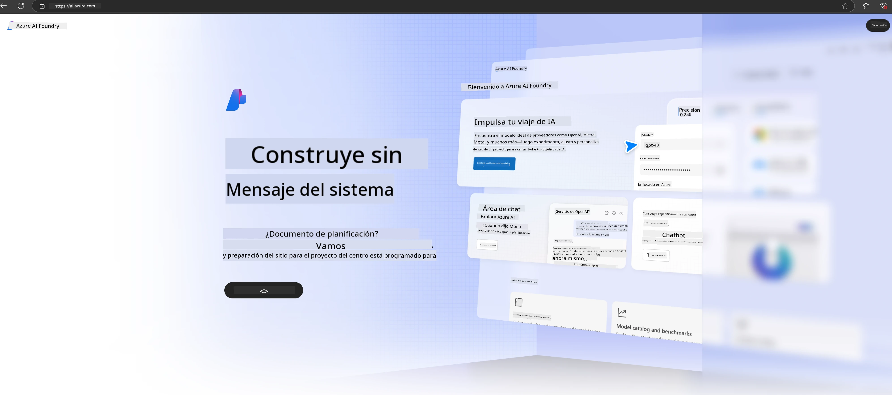

# **Uso de Phi-3 en Microsoft Foundry**

Con el desarrollo de la IA Generativa, esperamos usar una plataforma unificada para gestionar diferentes LLM y SLM, la integración de datos empresariales, operaciones de fine-tuning/RAG y la evaluación de diferentes negocios empresariales después de integrar LLM y SLM, etc., para que las aplicaciones inteligentes de IA generativa se puedan implementar mejor. [Microsoft Foundry](https://ai.azure.com) es una plataforma de aplicaciones de IA generativa a nivel empresarial.

Con Microsoft Foundry, puedes evaluar las respuestas de modelos de lenguaje grandes (LLM) y orquestar componentes de aplicaciones con flujo de indicaciones para un mejor rendimiento. La plataforma facilita la escalabilidad para transformar pruebas de concepto en una producción completa con facilidad. El monitoreo y refinamiento continuos apoyan el éxito a largo plazo.

Podemos desplegar rápidamente el modelo Phi-3 en Microsoft Foundry mediante pasos sencillos, y luego usar Microsoft Foundry para completar el Playground/Chat, Fine-tuning, evaluación y otros trabajos relacionados con Phi-3.

## **1. Preparación**

Si ya tienes instalado el [Azure Developer CLI](https://learn.microsoft.com/azure/developer/azure-developer-cli/overview?WT.mc_id=aiml-138114-kinfeylo) en tu máquina, usar esta plantilla es tan simple como ejecutar este comando en un nuevo directorio.

## Creación Manual

Crear un proyecto y un hub en Microsoft Foundry es una excelente forma de organizar y gestionar tu trabajo de IA. Aquí tienes una guía paso a paso para empezar:

### Crear un Proyecto en Microsoft Foundry

1. **Ir a Microsoft Foundry**: Inicia sesión en el portal de Microsoft Foundry.
2. **Crear un Proyecto**:
   - Si estás dentro de un proyecto, selecciona "Microsoft Foundry" en la parte superior izquierda de la página para ir a la página de inicio.
   - Selecciona "+ Crear proyecto".
   - Ingresa un nombre para el proyecto.
   - Si tienes un hub, estará seleccionado por defecto. Si tienes acceso a más de un hub, puedes seleccionar otro diferente del menú desplegable. Si deseas crear un nuevo hub, selecciona "Crear nuevo hub" y proporciona un nombre.
   - Selecciona "Crear".

### Crear un Hub en Microsoft Foundry

1. **Ir a Microsoft Foundry**: Inicia sesión con tu cuenta de Azure.
2. **Crear un Hub**:
   - Selecciona el centro de administración desde el menú izquierdo.
   - Selecciona "Todos los recursos", luego la flecha hacia abajo junto a "+ Nuevo proyecto" y selecciona "+ Nuevo hub".
   - En el diálogo de "Crear un nuevo hub", ingresa un nombre para tu hub (por ejemplo, contoso-hub) y modifica los demás campos como desees.
   - Selecciona "Siguiente", revisa la información y luego selecciona "Crear".

Para instrucciones más detalladas, puedes consultar la [documentación oficial de Microsoft](https://learn.microsoft.com/azure/ai-studio/how-to/create-projects).

Después de la creación exitosa, puedes acceder al estudio que creaste a través de [ai.azure.com](https://ai.azure.com/).

Puede haber múltiples proyectos en un AI Foundry. Crea un proyecto en AI Foundry para prepararte.

Crea Microsoft Foundry [QuickStarts](https://learn.microsoft.com/azure/ai-studio/quickstarts/get-started-code).

## **2. Desplegar un modelo Phi en Microsoft Foundry**

Haz clic en la opción Explorar del proyecto para entrar al Catálogo de Modelos y selecciona Phi-3.

Selecciona Phi-3-mini-4k-instruct.

Haz clic en 'Desplegar' para implementar el modelo Phi-3-mini-4k-instruct.

> [!NOTE]
>
> Puedes seleccionar la potencia de cómputo al desplegar.

## **3. Playground Chat Phi en Microsoft Foundry**

Ve a la página de despliegue, selecciona Playground y chatea con Phi-3 de Microsoft Foundry.

## **4. Desplegar el modelo desde Microsoft Foundry**

Para desplegar un modelo desde el Catálogo de Modelos de Azure, puedes seguir estos pasos:

- Inicia sesión en Microsoft Foundry.
- Elige el modelo que quieres desplegar desde el catálogo de modelos de Microsoft Foundry.
- En la página de detalles del modelo, selecciona Desplegar y luego selecciona API Serverless con Azure AI Content Safety.
- Selecciona el proyecto en el cual deseas desplegar tus modelos. Para usar la oferta API Serverless, tu espacio de trabajo debe estar en la región East US 2 o Sweden Central. Puedes personalizar el nombre del Despliegue.
- En el asistente de despliegue, selecciona Precios y términos para conocer los precios y condiciones de uso.
- Selecciona Desplegar. Espera hasta que el despliegue esté listo y seas redirigido a la página de Despliegues.
- Selecciona Abrir en playground para comenzar a interactuar con el modelo.
- Puedes regresar a la página de Despliegues, seleccionar el despliegue y anotar la URL de destino del endpoint y la Clave Secreta, que puedes usar para llamar al despliegue y generar completaciones.
- Siempre puedes encontrar los detalles del endpoint, la URL y las claves de acceso navegando a la pestaña Build y seleccionando Despliegues en la sección Componentes.

> [!NOTE]
> Ten en cuenta que tu cuenta debe tener permisos de rol de Desarrollador de Azure AI sobre el Grupo de Recursos para poder realizar estos pasos.

## **5. Usar la API Phi en Microsoft Foundry**

Puedes acceder a https://{Tu nombre de proyecto}.region.inference.ml.azure.com/swagger.json mediante Postman GET y combinarlo con la clave para conocer las interfaces proporcionadas.

Puedes obtener muy fácilmente los parámetros de solicitud, así como los parámetros de respuesta.

---

<!-- CO-OP TRANSLATOR DISCLAIMER START -->
**Aviso Legal**:
Este documento ha sido traducido utilizando el servicio de traducción automática [Co-op Translator](https://github.com/Azure/co-op-translator). Aunque nos esforzamos por la precisión, tenga en cuenta que las traducciones automáticas pueden contener errores o imprecisiones. El documento original en su idioma nativo debe considerarse la fuente autorizada. Para información crítica, se recomienda la traducción profesional humana. No nos hacemos responsables por malentendidos o interpretaciones erróneas derivadas del uso de esta traducción.
<!-- CO-OP TRANSLATOR DISCLAIMER END -->