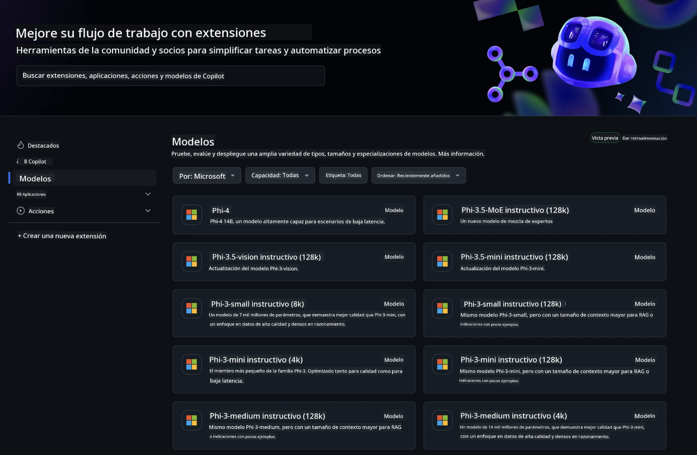
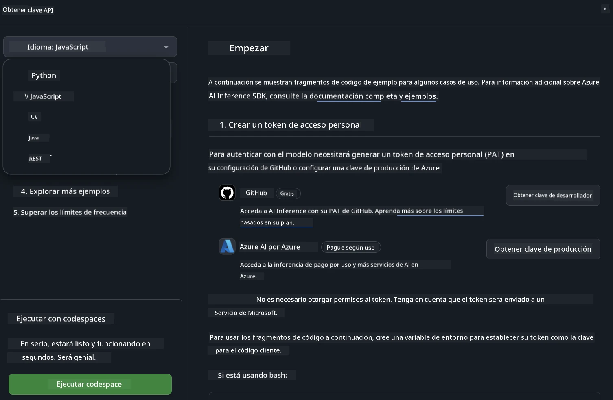
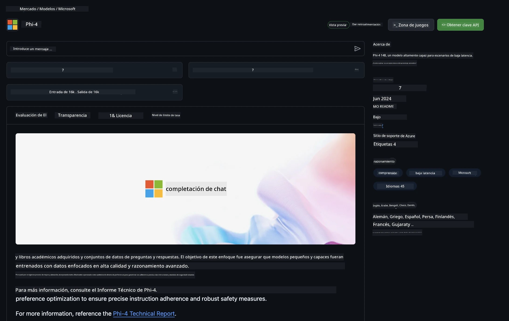

## Modelos de GitHub - Beta Pública Limitada

¡Bienvenido a [GitHub Models](https://github.com/marketplace/models)! Tenemos todo listo para que explores los Modelos de IA alojados en Azure AI.



Para más información sobre los Modelos disponibles en GitHub Models, consulta el [GitHub Model Marketplace](https://github.com/marketplace/models)

## Modelos Disponibles

Cada modelo cuenta con un espacio de pruebas dedicado y código de ejemplo


### Modelos Phi-3 en el Catálogo de Modelos de GitHub

[Phi-3-Medium-128k-Instruct](https://github.com/marketplace/models/azureml/Phi-3-medium-128k-instruct)

[Phi-3-medium-4k-instruct](https://github.com/marketplace/models/azureml/Phi-3-medium-4k-instruct)

[Phi-3-mini-128k-instruct](https://github.com/marketplace/models/azureml/Phi-3-mini-128k-instruct)

[Phi-3-mini-4k-instruct](https://github.com/marketplace/models/azureml/Phi-3-mini-4k-instruct)

[Phi-3-small-128k-instruct](https://github.com/marketplace/models/azureml/Phi-3-small-128k-instruct)

[Phi-3-small-8k-instruct](https://github.com/marketplace/models/azureml/Phi-3-small-8k-instruct)

## Primeros Pasos

Hay algunos ejemplos básicos listos para que los ejecutes. Puedes encontrarlos en el directorio de samples. Si quieres ir directo a tu lenguaje favorito, los ejemplos están disponibles en los siguientes lenguajes:

- Python
- JavaScript
- cURL

También hay un entorno dedicado de Codespaces para ejecutar los ejemplos y modelos.



## Código de Ejemplo

A continuación, se muestran fragmentos de código para algunos casos de uso. Para más información sobre Azure AI Inference SDK, consulta la documentación completa y los ejemplos.

## Configuración

1. Crea un token de acceso personal  
No es necesario asignar permisos al token. Ten en cuenta que el token será enviado a un servicio de Microsoft.

Para usar los fragmentos de código a continuación, crea una variable de entorno para establecer tu token como la clave para el código cliente.

Si usas bash:  
```
export GITHUB_TOKEN="<your-github-token-goes-here>"
```  
Si usas powershell:  

```
$Env:GITHUB_TOKEN="<your-github-token-goes-here>"
```  

Si usas el símbolo del sistema de Windows:  

```
set GITHUB_TOKEN=<your-github-token-goes-here>
```  

## Ejemplo en Python

### Instalar dependencias  
Instala Azure AI Inference SDK usando pip (Requiere: Python >=3.8):

```
pip install azure-ai-inference
```  
### Ejecutar un ejemplo básico

Este ejemplo muestra una llamada básica a la API de chat completion. Utiliza el endpoint de inferencia del modelo de IA de GitHub y tu token de GitHub. La llamada es síncrona.

```
import os
from azure.ai.inference import ChatCompletionsClient
from azure.ai.inference.models import SystemMessage, UserMessage
from azure.core.credentials import AzureKeyCredential

endpoint = "https://models.inference.ai.azure.com"
# Replace Model_Name 
model_name = "Phi-3-small-8k-instruct"
token = os.environ["GITHUB_TOKEN"]

client = ChatCompletionsClient(
    endpoint=endpoint,
    credential=AzureKeyCredential(token),
)

response = client.complete(
    messages=[
        SystemMessage(content="You are a helpful assistant."),
        UserMessage(content="What is the capital of France?"),
    ],
    model=model_name,
    temperature=1.,
    max_tokens=1000,
    top_p=1.
)

print(response.choices[0].message.content)
```

### Ejecutar una conversación de múltiples turnos

Este ejemplo muestra una conversación de múltiples turnos con la API de chat completion. Al usar el modelo para una aplicación de chat, deberás gestionar el historial de la conversación y enviar los mensajes más recientes al modelo.

```
import os
from azure.ai.inference import ChatCompletionsClient
from azure.ai.inference.models import AssistantMessage, SystemMessage, UserMessage
from azure.core.credentials import AzureKeyCredential

token = os.environ["GITHUB_TOKEN"]
endpoint = "https://models.inference.ai.azure.com"
# Replace Model_Name
model_name = "Phi-3-small-8k-instruct"

client = ChatCompletionsClient(
    endpoint=endpoint,
    credential=AzureKeyCredential(token),
)

messages = [
    SystemMessage(content="You are a helpful assistant."),
    UserMessage(content="What is the capital of France?"),
    AssistantMessage(content="The capital of France is Paris."),
    UserMessage(content="What about Spain?"),
]

response = client.complete(messages=messages, model=model_name)

print(response.choices[0].message.content)
```

### Transmitir la salida

Para una mejor experiencia de usuario, querrás transmitir la respuesta del modelo para que el primer token aparezca rápidamente y evitar esperar respuestas largas.

```
import os
from azure.ai.inference import ChatCompletionsClient
from azure.ai.inference.models import SystemMessage, UserMessage
from azure.core.credentials import AzureKeyCredential

token = os.environ["GITHUB_TOKEN"]
endpoint = "https://models.inference.ai.azure.com"
# Replace Model_Name
model_name = "Phi-3-small-8k-instruct"

client = ChatCompletionsClient(
    endpoint=endpoint,
    credential=AzureKeyCredential(token),
)

response = client.complete(
    stream=True,
    messages=[
        SystemMessage(content="You are a helpful assistant."),
        UserMessage(content="Give me 5 good reasons why I should exercise every day."),
    ],
    model=model_name,
)

for update in response:
    if update.choices:
        print(update.choices[0].delta.content or "", end="")

client.close()
```

## JavaScript

### Instalar dependencias

Instala Node.js.

Copia las siguientes líneas de texto y guárdalas en un archivo package.json dentro de tu carpeta.

```
{
  "type": "module",
  "dependencies": {
    "@azure-rest/ai-inference": "latest",
    "@azure/core-auth": "latest",
    "@azure/core-sse": "latest"
  }
}
```

Nota: @azure/core-sse solo es necesario cuando transmites la respuesta de chat completions.

Abre una terminal en esta carpeta y ejecuta npm install.

Para cada uno de los fragmentos de código a continuación, copia el contenido en un archivo sample.js y ejecútalo con node sample.js.

### Ejecutar un ejemplo básico

Este ejemplo muestra una llamada básica a la API de chat completion. Utiliza el endpoint de inferencia del modelo de IA de GitHub y tu token de GitHub. La llamada es síncrona.

```
import ModelClient from "@azure-rest/ai-inference";
import { AzureKeyCredential } from "@azure/core-auth";

const token = process.env["GITHUB_TOKEN"];
const endpoint = "https://models.inference.ai.azure.com";
// Update your modelname
const modelName = "Phi-3-small-8k-instruct";

export async function main() {

  const client = new ModelClient(endpoint, new AzureKeyCredential(token));

  const response = await client.path("/chat/completions").post({
    body: {
      messages: [
        { role:"system", content: "You are a helpful assistant." },
        { role:"user", content: "What is the capital of France?" }
      ],
      model: modelName,
      temperature: 1.,
      max_tokens: 1000,
      top_p: 1.
    }
  });

  if (response.status !== "200") {
    throw response.body.error;
  }
  console.log(response.body.choices[0].message.content);
}

main().catch((err) => {
  console.error("The sample encountered an error:", err);
});
```

### Ejecutar una conversación de múltiples turnos

Este ejemplo muestra una conversación de múltiples turnos con la API de chat completion. Al usar el modelo para una aplicación de chat, deberás gestionar el historial de la conversación y enviar los mensajes más recientes al modelo.

```
import ModelClient from "@azure-rest/ai-inference";
import { AzureKeyCredential } from "@azure/core-auth";

const token = process.env["GITHUB_TOKEN"];
const endpoint = "https://models.inference.ai.azure.com";
// Update your modelname
const modelName = "Phi-3-small-8k-instruct";

export async function main() {

  const client = new ModelClient(endpoint, new AzureKeyCredential(token));

  const response = await client.path("/chat/completions").post({
    body: {
      messages: [
        { role: "system", content: "You are a helpful assistant." },
        { role: "user", content: "What is the capital of France?" },
        { role: "assistant", content: "The capital of France is Paris." },
        { role: "user", content: "What about Spain?" },
      ],
      model: modelName,
    }
  });

  if (response.status !== "200") {
    throw response.body.error;
  }

  for (const choice of response.body.choices) {
    console.log(choice.message.content);
  }
}

main().catch((err) => {
  console.error("The sample encountered an error:", err);
});
```

### Transmitir la salida

Para una mejor experiencia de usuario, querrás transmitir la respuesta del modelo para que el primer token aparezca rápidamente y evitar esperar respuestas largas.

```
import ModelClient from "@azure-rest/ai-inference";
import { AzureKeyCredential } from "@azure/core-auth";
import { createSseStream } from "@azure/core-sse";

const token = process.env["GITHUB_TOKEN"];
const endpoint = "https://models.inference.ai.azure.com";
// Update your modelname
const modelName = "Phi-3-small-8k-instruct";

export async function main() {

  const client = new ModelClient(endpoint, new AzureKeyCredential(token));

  const response = await client.path("/chat/completions").post({
    body: {
      messages: [
        { role: "system", content: "You are a helpful assistant." },
        { role: "user", content: "Give me 5 good reasons why I should exercise every day." },
      ],
      model: modelName,
      stream: true
    }
  }).asNodeStream();

  const stream = response.body;
  if (!stream) {
    throw new Error("The response stream is undefined");
  }

  if (response.status !== "200") {
    stream.destroy();
    throw new Error(`Failed to get chat completions, http operation failed with ${response.status} code`);
  }

  const sseStream = createSseStream(stream);

  for await (const event of sseStream) {
    if (event.data === "[DONE]") {
      return;
    }
    for (const choice of (JSON.parse(event.data)).choices) {
        process.stdout.write(choice.delta?.content ?? ``);
    }
  }
}

main().catch((err) => {
  console.error("The sample encountered an error:", err);
});
```

## REST

### Ejecutar un ejemplo básico

Pega lo siguiente en una shell:

```
curl -X POST "https://models.inference.ai.azure.com/chat/completions" \
    -H "Content-Type: application/json" \
    -H "Authorization: Bearer $GITHUB_TOKEN" \
    -d '{
        "messages": [
            {
                "role": "system",
                "content": "You are a helpful assistant."
            },
            {
                "role": "user",
                "content": "What is the capital of France?"
            }
        ],
        "model": "Phi-3-small-8k-instruct"
    }'
```  
### Ejecutar una conversación de múltiples turnos

Llama a la API de chat completion y pasa el historial de chat:

```
curl -X POST "https://models.inference.ai.azure.com/chat/completions" \
    -H "Content-Type: application/json" \
    -H "Authorization: Bearer $GITHUB_TOKEN" \
    -d '{
        "messages": [
            {
                "role": "system",
                "content": "You are a helpful assistant."
            },
            {
                "role": "user",
                "content": "What is the capital of France?"
            },
            {
                "role": "assistant",
                "content": "The capital of France is Paris."
            },
            {
                "role": "user",
                "content": "What about Spain?"
            }
        ],
        "model": "Phi-3-small-8k-instruct"
    }'
```  
### Transmitir la salida

Este es un ejemplo de cómo llamar al endpoint y transmitir la respuesta.

```
curl -X POST "https://models.inference.ai.azure.com/chat/completions" \
    -H "Content-Type: application/json" \
    -H "Authorization: Bearer $GITHUB_TOKEN" \
    -d '{
        "messages": [
            {
                "role": "system",
                "content": "You are a helpful assistant."
            },
            {
                "role": "user",
                "content": "Give me 5 good reasons why I should exercise every day."
            }
        ],
        "stream": true,
        "model": "Phi-3-small-8k-instruct"
    }'
```

## Uso GRATUITO y límites de tasa para GitHub Models



Los [límites de tasa para el playground y el uso gratuito de la API](https://docs.github.com/en/github-models/prototyping-with-ai-models#rate-limits) están diseñados para ayudarte a experimentar con los modelos y prototipar tu aplicación de IA. Para un uso que supere esos límites y para escalar tu aplicación, debes aprovisionar recursos desde una cuenta de Azure y autenticarte desde allí en lugar de usar tu token personal de GitHub. No necesitas cambiar nada más en tu código. Usa este enlace para descubrir cómo superar los límites del nivel gratuito en Azure AI.

### Divulgaciones

Recuerda que al interactuar con un modelo estás experimentando con IA, por lo que pueden ocurrir errores en el contenido.

La función está sujeta a varios límites (incluyendo solicitudes por minuto, solicitudes por día, tokens por solicitud y solicitudes concurrentes) y no está diseñada para casos de uso en producción.

GitHub Models utiliza Azure AI Content Safety. Estos filtros no pueden desactivarse como parte de la experiencia de GitHub Models. Si decides usar modelos a través de un servicio de pago, configura tus filtros de contenido según tus necesidades.

Este servicio está bajo los Términos de Pre-lanzamiento de GitHub.

**Aviso legal**:  
Este documento ha sido traducido utilizando el servicio de traducción automática [Co-op Translator](https://github.com/Azure/co-op-translator). Aunque nos esforzamos por la precisión, tenga en cuenta que las traducciones automáticas pueden contener errores o inexactitudes. El documento original en su idioma nativo debe considerarse la fuente autorizada. Para información crítica, se recomienda la traducción profesional realizada por humanos. No nos hacemos responsables de malentendidos o interpretaciones erróneas derivadas del uso de esta traducción.