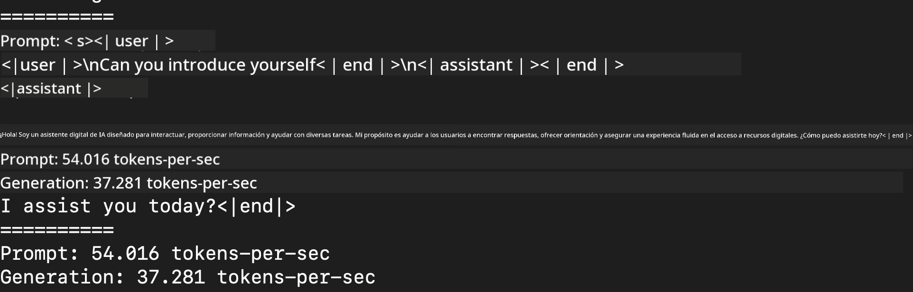
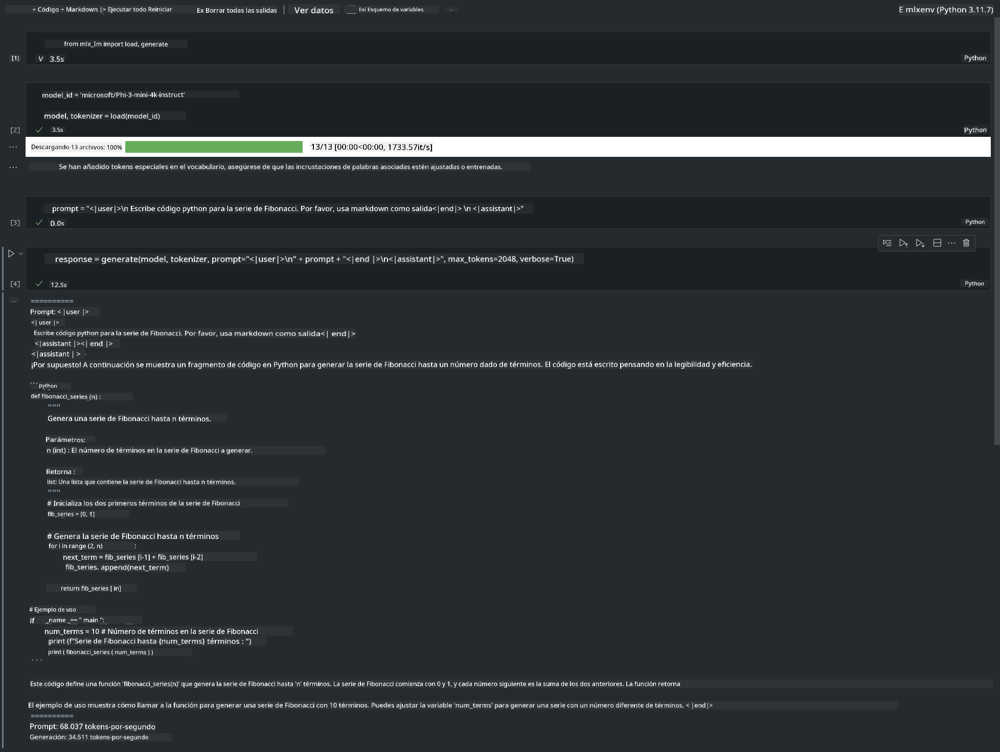

<!--
CO_OP_TRANSLATOR_METADATA:
{
  "original_hash": "dcb656f3d206fc4968e236deec5d4384",
  "translation_date": "2025-05-07T10:34:12+00:00",
  "source_file": "md/03.FineTuning/03.Inference/MLX_Inference.md",
  "language_code": "es"
}
-->
# **Inferencia Phi-3 con Apple MLX Framework**

## **Qué es MLX Framework**

MLX es un framework de arreglos para investigación en aprendizaje automático en Apple silicon, desarrollado por el equipo de investigación en machine learning de Apple.

MLX está diseñado por investigadores de machine learning para investigadores de machine learning. El framework busca ser fácil de usar, pero eficiente para entrenar y desplegar modelos. El diseño del framework también es conceptualmente simple. Nuestra intención es facilitar que los investigadores extiendan y mejoren MLX con el objetivo de explorar nuevas ideas rápidamente.

Los LLMs pueden acelerarse en dispositivos Apple Silicon mediante MLX, y los modelos pueden ejecutarse localmente de forma muy conveniente.

## **Usando MLX para inferir Phi-3-mini**

### **1. Configura tu entorno MLX**

1. Python 3.11.x  
2. Instala la librería MLX

```bash

pip install mlx-lm

```

### **2. Ejecutando Phi-3-mini en Terminal con MLX**

```bash

python -m mlx_lm.generate --model microsoft/Phi-3-mini-4k-instruct --max-token 2048 --prompt  "<|user|>\nCan you introduce yourself<|end|>\n<|assistant|>"

```

El resultado (mi entorno es Apple M1 Max, 64GB) es


### **3. Cuantizando Phi-3-mini con MLX en Terminal**

```bash

python -m mlx_lm.convert --hf-path microsoft/Phi-3-mini-4k-instruct

```

***Nota:*** El modelo puede cuantizarse mediante mlx_lm.convert, y la cuantización por defecto es INT4. Este ejemplo cuantiza Phi-3-mini a INT4.

El modelo puede cuantizarse mediante mlx_lm.convert, y la cuantización por defecto es INT4. En este ejemplo se cuantiza Phi-3-mini a INT4. Después de la cuantización, se almacenará en el directorio por defecto ./mlx_model

Podemos probar el modelo cuantizado con MLX desde terminal

```bash

python -m mlx_lm.generate --model ./mlx_model/ --max-token 2048 --prompt  "<|user|>\nCan you introduce yourself<|end|>\n<|assistant|>"

```

El resultado es



### **4. Ejecutando Phi-3-mini con MLX en Jupyter Notebook**



***Nota:*** Por favor revisa este ejemplo [click this link](../../../../../code/03.Inference/MLX/MLX_DEMO.ipynb)

## **Recursos**

1. Aprende sobre Apple MLX Framework [https://ml-explore.github.io](https://ml-explore.github.io/mlx/build/html/index.html)

2. Repositorio Apple MLX en GitHub [https://github.com/ml-explore](https://github.com/ml-explore)

**Descargo de responsabilidad**:  
Este documento ha sido traducido utilizando el servicio de traducción automática [Co-op Translator](https://github.com/Azure/co-op-translator). Aunque nos esforzamos por la precisión, tenga en cuenta que las traducciones automáticas pueden contener errores o inexactitudes. El documento original en su idioma nativo debe considerarse la fuente autorizada. Para información crítica, se recomienda una traducción profesional realizada por humanos. No nos hacemos responsables de ningún malentendido o interpretación errónea derivada del uso de esta traducción.