# Ajuste fino de Phi-3 con Microsoft Foundry

Exploraremos cómo ajustar finamente el modelo de lenguaje Phi-3 Mini de Microsoft usando Microsoft Foundry. El ajuste fino te permite adaptar Phi-3 Mini a tareas específicas, haciéndolo aún más poderoso y consciente del contexto.

## Consideraciones

- **Capacidades:** ¿Qué modelos pueden ajustarse finamente? ¿Para qué se puede ajustar el modelo base?
- **Costo:** ¿Cuál es el modelo de precios para el ajuste fino?
- **Personalización:** ¿Cuánto puedo modificar el modelo base y de qué maneras?
- **Conveniencia:** ¿Cómo ocurre el ajuste fino en realidad? ¿Necesito escribir código personalizado? ¿Necesito traer mi propio cómputo?
- **Seguridad:** Se sabe que los modelos ajustados finamente tienen riesgos de seguridad. ¿Existen mecanismos para proteger contra daños no intencionados?

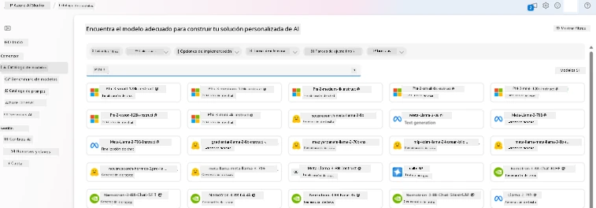

## Preparación para el ajuste fino

### Requisitos previos

> [!NOTE]
> Para los modelos de la familia Phi-3, la oferta de ajuste fino de pago por uso solo está disponible con hubs creados en las regiones **East US 2**.

- Una suscripción de Azure. Si no tienes una suscripción, crea una [cuenta paga de Azure](https://azure.microsoft.com/pricing/purchase-options/pay-as-you-go) para comenzar.

- Un [proyecto de AI Foundry](https://ai.azure.com?WT.mc_id=aiml-138114-kinfeylo).
- Los controles de acceso basados en roles de Azure (Azure RBAC) se usan para conceder acceso a operaciones en Microsoft Foundry. Para realizar los pasos en este artículo, tu cuenta de usuario debe tener asignado el __rol de Desarrollador AI de Azure__ en el grupo de recursos.

### Registro del proveedor de suscripción

Verifica que la suscripción esté registrada al proveedor de recursos `Microsoft.Network`.

1. Inicia sesión en el [portal de Azure](https://portal.azure.com).
1. Selecciona **Suscripciones** en el menú lateral.
1. Selecciona la suscripción que deseas usar.
1. Selecciona **Configuración del proyecto AI** > **Proveedores de recursos** en el menú lateral.
1. Confirma que **Microsoft.Network** esté en la lista de proveedores. De lo contrario, agréguelo.

### Preparación de datos

Prepara tus datos de entrenamiento y validación para ajustar tu modelo. Tus conjuntos de datos de entrenamiento y validación consisten en ejemplos de entrada y salida que ejemplifican cómo quieres que el modelo se desempeñe.

Asegúrate de que todos tus ejemplos de entrenamiento sigan el formato esperado para la inferencia. Para ajustar efectivamente los modelos, garantiza un conjunto de datos equilibrado y diverso.

Esto implica mantener el balance de datos, incluir varios escenarios y refinar periódicamente los datos de entrenamiento para alinearlos con expectativas del mundo real, lo que finalmente conduce a respuestas del modelo más precisas y equilibradas.

Diferentes tipos de modelos requieren diferentes formatos de datos de entrenamiento.

### Chat Completion

Los datos de entrenamiento y validación que uses **deben** estar formateados como un documento JSON Lines (JSONL). Para `Phi-3-mini-128k-instruct`, el conjunto de datos para el ajuste fino debe estar formateado en el formato conversacional usado por la API de Chat completions.

### Formato de archivo de ejemplo

```json
    {"messages": [{"role": "system", "content": "You are an Xbox customer support agent whose primary goal is to help users with issues they are experiencing with their Xbox devices. You are friendly and concise. You only provide factual answers to queries, and do not provide answers that are not related to Xbox."}, {"role": "user", "content": "Is Xbox better than PlayStation?"}, {"role": "assistant", "content": "I apologize, but I cannot provide personal opinions. My primary job is to assist you with any issues related to your Xbox device. Do you have any Xbox-related issues that need addressing?"}]}
    {"messages": [{"role": "system", "content": "You are an Xbox customer support agent whose primary goal is to help users with issues they are experiencing with their Xbox devices. You are friendly and concise. You only provide factual answers to queries, and do not provide answers that are not related to Xbox."}, {"role": "user", "content": "Can I play PC games on my Xbox?"}, {"role": "assistant", "content": "While Xbox consoles don't natively support PC games, they can play an array of Xbox games, many of which are also available on PC. Can I assist you with finding games compatible with your Xbox device?"}]}
    {"messages": [{"role": "system", "content": "You are an Xbox customer support agent whose primary goal is to help users with issues they are experiencing with their Xbox devices. You are friendly and concise. You only provide factual answers to queries, and do not provide answers that are not related to Xbox."}, {"role": "user", "content": "I'm having trouble connecting my Xbox to the Wi-Fi."}, {"role": "assistant", "content": "No worries, let's go through the network settings on your Xbox. Can you please tell me what happens when you try to connect it to the Wi-Fi?"}]}
```

El tipo de archivo soportado es JSON Lines. Los archivos se cargan en el almacén de datos predeterminado y están disponibles en tu proyecto.

## Ajuste fino de Phi-3 con Microsoft Foundry

Microsoft Foundry te permite personalizar modelos de lenguaje grandes con tus propios conjuntos de datos mediante un proceso conocido como ajuste fino. El ajuste fino proporciona un valor significativo al permitir la personalización y optimización para tareas y aplicaciones específicas. Esto conduce a un mejor rendimiento, eficiencia de costos, menor latencia y salidas personalizadas.

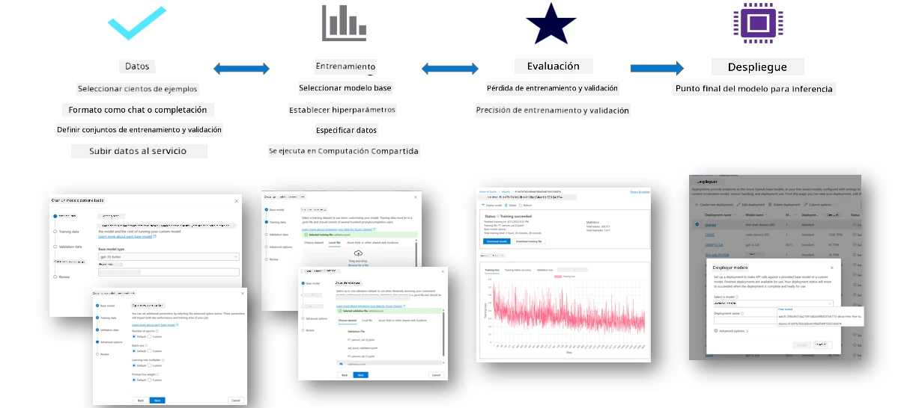

### Crear un nuevo proyecto

1. Inicia sesión en [Microsoft Foundry](https://ai.azure.com).

1. Selecciona **+Nuevo proyecto** para crear un nuevo proyecto en Microsoft Foundry.

    

1. Realiza las siguientes tareas:

    - Nombre del proyecto **Hub**. Debe ser un valor único.
    - Selecciona el **Hub** a usar (crea uno nuevo si es necesario).

    

1. Realiza las siguientes tareas para crear un nuevo hub:

    - Escribe el **Nombre del Hub**. Debe ser un valor único.
    - Selecciona tu **Suscripción** de Azure.
    - Selecciona el **Grupo de recursos** a usar (crea uno nuevo si es necesario).
    - Selecciona la **Ubicación** que quieras usar.
    - Selecciona los **Servicios Azure AI** para conectar (crea uno nuevo si es necesario).
    - Selecciona **Conectar Azure AI Search** para **Omitir conexión**.

    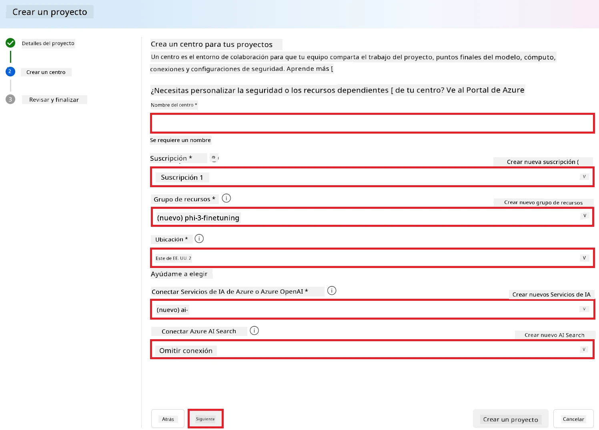

1. Selecciona **Siguiente**.
1. Selecciona **Crear un proyecto**.

### Preparación de datos

Antes del ajuste fino, recopila o crea un conjunto de datos relevante para tu tarea, como instrucciones de chat, pares pregunta-respuesta u otros datos textuales pertinentes. Limpia y preprocesa estos datos eliminando ruido, manejando valores faltantes y tokenizando el texto.

### Ajustar modelos Phi-3 en Microsoft Foundry

> [!NOTE]
> El ajuste fino de modelos Phi-3 está actualmente soportado en proyectos localizados en East US 2.

1. Selecciona **Catálogo de modelos** en la pestaña lateral izquierda.

1. Escribe *phi-3* en la **barra de búsqueda** y selecciona el modelo phi-3 que desees usar.

    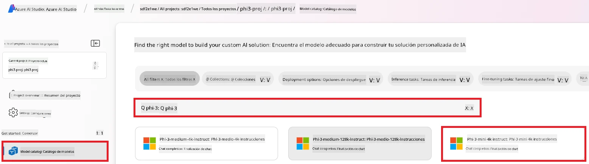

1. Selecciona **Ajustar fino**.

    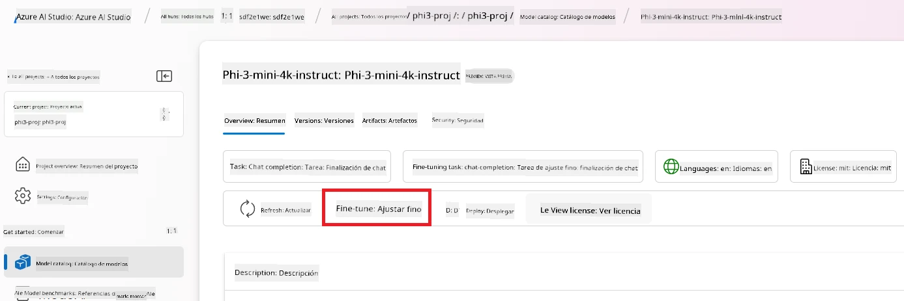

1. Ingresa el **Nombre del modelo ajustado fino**.

    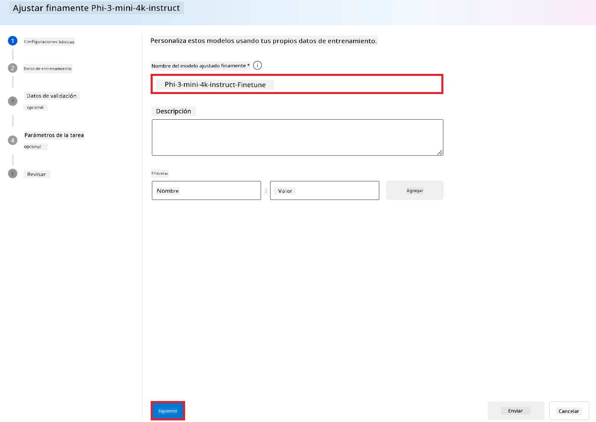

1. Selecciona **Siguiente**.

1. Realiza las siguientes tareas:

    - Selecciona el **tipo de tarea** a **Chat completion**.
    - Selecciona los **datos de entrenamiento** que desees usar. Puedes cargarlos mediante los datos de Microsoft Foundry o desde tu entorno local.

    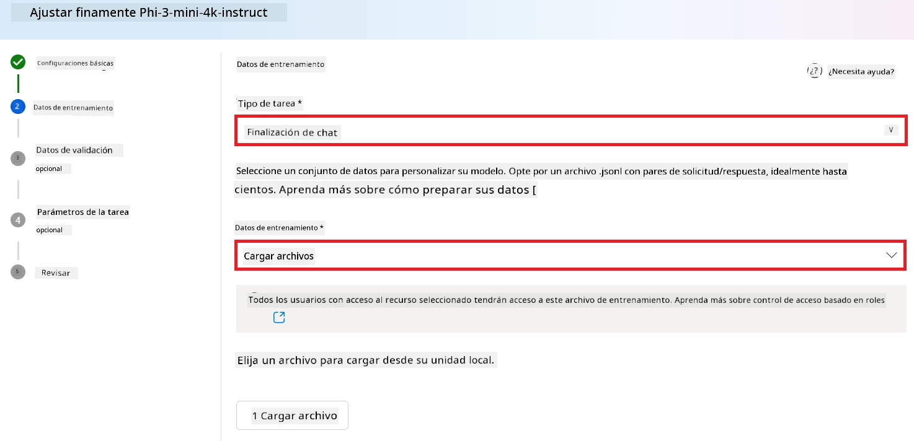

1. Selecciona **Siguiente**.

1. Carga los **datos de validación** que deseas usar o selecciona **División automática de datos de entrenamiento**.

    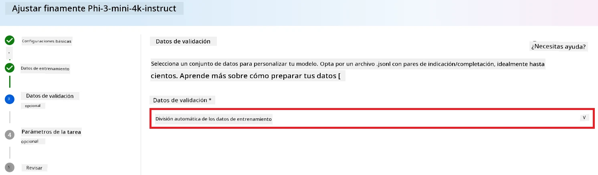

1. Selecciona **Siguiente**.

1. Realiza las siguientes tareas:

    - Selecciona el **Multiplicador del tamaño del lote** que quieres usar.
    - Selecciona la **Tasa de aprendizaje** que deseas usar.
    - Selecciona las **Épocas** que quieres usar.

    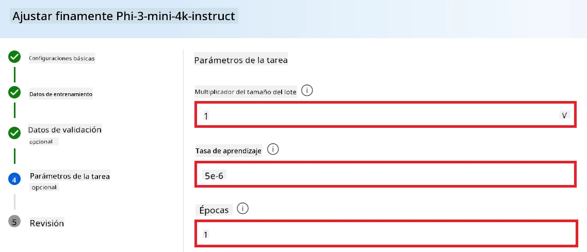

1. Selecciona **Enviar** para iniciar el proceso de ajuste fino.

    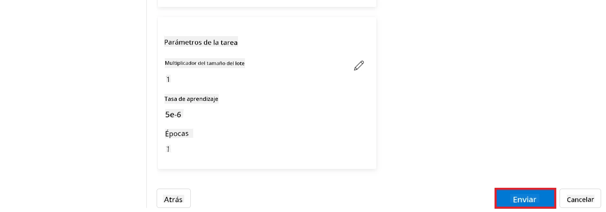

1. Una vez que tu modelo esté ajustado fino, el estado se mostrará como **Completado**, como se ve en la imagen a continuación. Ahora puedes desplegar el modelo y usarlo en tu propia aplicación, en el playground o en prompt flow. Para más información, consulta [Cómo desplegar la familia de modelos pequeños Phi-3 con Microsoft Foundry](https://learn.microsoft.com/azure/ai-studio/how-to/deploy-models-phi-3?tabs=phi-3-5&pivots=programming-language-python).

    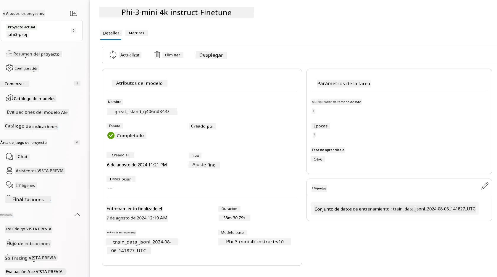

> [!NOTE]
> Para información más detallada sobre el ajuste fino de Phi-3, visita [Ajustar finamente modelos Phi-3 en Microsoft Foundry](https://learn.microsoft.com/azure/ai-studio/how-to/fine-tune-phi-3?tabs=phi-3-mini).

## Limpieza de tus modelos ajustados fino

Puedes eliminar un modelo ajustado fino de la lista de modelos de ajuste fino en [Microsoft Foundry](https://ai.azure.com) o desde la página de detalles del modelo. Selecciona el modelo ajustado fino que deseas eliminar en la página de Ajuste fino y luego selecciona el botón Eliminar para borrar el modelo.

> [!NOTE]
> No puedes eliminar un modelo personalizado si tiene un despliegue existente. Primero debes eliminar el despliegue del modelo antes de poder eliminar el modelo personalizado.

## Costos y cuotas

### Consideraciones de costos y cuotas para modelos Phi-3 ajustados finamente como servicio

Los modelos Phi ajustados finamente como servicio son ofrecidos por Microsoft e integrados con Microsoft Foundry para su uso. Puedes encontrar los precios al [desplegar](https://learn.microsoft.com/azure/ai-studio/how-to/deploy-models-phi-3?tabs=phi-3-5&pivots=programming-language-python) o ajustar finamente los modelos en la pestaña Precios y términos del asistente de despliegue.

## Filtrado de contenido

Los modelos desplegados como servicio con pago por uso están protegidos por Azure AI Content Safety. Al desplegar a endpoints en tiempo real, puedes optar por desactivar esta capacidad. Con Azure AI Content Safety habilitado, tanto el prompt como la finalización pasan por un conjunto de modelos de clasificación destinados a detectar y prevenir la salida de contenido dañino. El sistema de filtrado detecta y actúa sobre categorías específicas de contenido potencialmente dañino tanto en los prompts de entrada como en las salidas. Aprende más sobre [Azure AI Content Safety](https://learn.microsoft.com/azure/ai-studio/concepts/content-filtering).

**Configuración del ajuste fino**

Hiperparámetros: Define hiperparámetros como tasa de aprendizaje, tamaño de lote y número de épocas de entrenamiento.

**Función de pérdida**

Elige una función de pérdida apropiada para tu tarea (por ejemplo, entropía cruzada).

**Optimizador**

Selecciona un optimizador (por ejemplo, Adam) para las actualizaciones de gradiente durante el entrenamiento.

**Proceso de ajuste fino**

- Cargar modelo pre-entrenado: Carga el checkpoint de Phi-3 Mini.
- Agregar capas personalizadas: Añade capas específicas para la tarea (por ejemplo, cabeza de clasificación para instrucciones de chat).

**Entrenar el modelo**  
Ajusta finamente el modelo usando tu conjunto de datos preparado. Monitorea el progreso del entrenamiento y ajusta hiperparámetros según sea necesario.

**Evaluación y validación**

Conjunto de validación: Divide tus datos en conjuntos de entrenamiento y validación.

**Evaluar desempeño**

Usa métricas como precisión, F1-score o perplexidad para evaluar el desempeño del modelo.

## Guardar el modelo ajustado fino

**Checkpoint**  
Guarda el checkpoint del modelo ajustado fino para uso futuro.

## Despliegue

- Desplegar como servicio web: Despliega tu modelo ajustado fino como un servicio web en Microsoft Foundry.
- Probar el endpoint: Envía consultas de prueba al endpoint desplegado para verificar su funcionalidad.

## Iterar y mejorar

Iterar: Si el desempeño no es satisfactorio, ajusta hiperparámetros, añade más datos o haz más épocas de ajuste fino.

## Monitorear y refinar

Monitorea continuamente el comportamiento del modelo y realiza refinamientos según sea necesario.

## Personalizar y extender

Tareas personalizadas: Phi-3 Mini puede ajustarse finamente para varias tareas además de instrucciones de chat. ¡Explora otros casos de uso!  
Experimenta: Prueba diferentes arquitecturas, combinaciones de capas y técnicas para mejorar el desempeño.

> [!NOTE]
> El ajuste fino es un proceso iterativo. ¡Experimenta, aprende y adapta tu modelo para lograr los mejores resultados para tu tarea específica!

---

<!-- CO-OP TRANSLATOR DISCLAIMER START -->
**Aviso Legal**:
Este documento ha sido traducido utilizando el servicio de traducción automática [Co-op Translator](https://github.com/Azure/co-op-translator). Aunque nos esforzamos por la precisión, tenga en cuenta que las traducciones automatizadas pueden contener errores o inexactitudes. El documento original en su idioma nativo debe considerarse la fuente autorizada. Para información crítica, se recomienda la traducción profesional realizada por humanos. No somos responsables de ningún malentendido o interpretación errónea derivada del uso de esta traducción.
<!-- CO-OP TRANSLATOR DISCLAIMER END -->