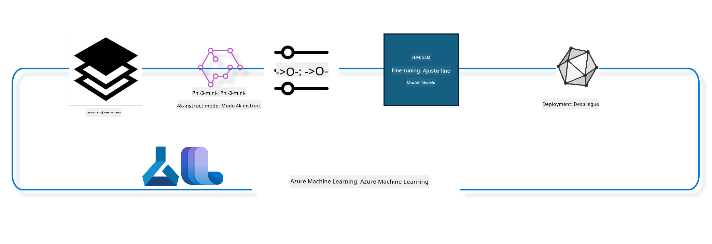

<!--
CO_OP_TRANSLATOR_METADATA:
{
  "original_hash": "944949f040e61b2ea25b3460f7394fd4",
  "translation_date": "2025-05-07T10:31:39+00:00",
  "source_file": "md/03.FineTuning/FineTuning_MLSDK.md",
  "language_code": "es"
}
-->
## Cómo usar los componentes de chat-completion del registro del sistema Azure ML para afinar un modelo

En este ejemplo realizaremos el fine tuning del modelo Phi-3-mini-4k-instruct para completar una conversación entre 2 personas usando el dataset ultrachat_200k.



El ejemplo te mostrará cómo realizar el fine tuning usando el Azure ML SDK y Python, y luego desplegar el modelo afinado en un endpoint en línea para inferencia en tiempo real.

### Datos de entrenamiento

Usaremos el dataset ultrachat_200k. Esta es una versión muy filtrada del dataset UltraChat y fue usado para entrenar Zephyr-7B-β, un modelo de chat de última generación con 7B parámetros.

### Modelo

Usaremos el modelo Phi-3-mini-4k-instruct para mostrar cómo un usuario puede afinar un modelo para la tarea de chat-completion. Si abriste este notebook desde una tarjeta de modelo específica, recuerda reemplazar el nombre del modelo por el correspondiente.

### Tareas

- Elegir un modelo para afinar.
- Elegir y explorar los datos de entrenamiento.
- Configurar el trabajo de fine tuning.
- Ejecutar el trabajo de fine tuning.
- Revisar las métricas de entrenamiento y evaluación.
- Registrar el modelo afinado.
- Desplegar el modelo afinado para inferencia en tiempo real.
- Limpiar los recursos.

## 1. Configurar los requisitos previos

- Instalar dependencias
- Conectarse al AzureML Workspace. Aprende más en configurar la autenticación del SDK. Reemplaza <WORKSPACE_NAME>, <RESOURCE_GROUP> y <SUBSCRIPTION_ID> a continuación.
- Conectarse al registro del sistema azureml
- Establecer un nombre opcional para el experimento
- Verificar o crear el recurso de cómputo.

> [!NOTE]
> Requisitos: un nodo GPU puede tener múltiples tarjetas GPU. Por ejemplo, un nodo Standard_NC24rs_v3 tiene 4 GPUs NVIDIA V100, mientras que Standard_NC12s_v3 tiene 2 GPUs NVIDIA V100. Consulta la documentación para más información. El número de tarjetas GPU por nodo se define en el parámetro gpus_per_node más abajo. Configurar este valor correctamente garantiza la utilización de todas las GPUs en el nodo. Los SKUs de cómputo GPU recomendados se pueden encontrar aquí y aquí.

### Librerías de Python

Instala las dependencias ejecutando la celda siguiente. Este paso no es opcional si ejecutas en un entorno nuevo.

```bash
pip install azure-ai-ml
pip install azure-identity
pip install datasets==2.9.0
pip install mlflow
pip install azureml-mlflow
```

### Interactuando con Azure ML

1. Este script en Python se usa para interactuar con el servicio Azure Machine Learning (Azure ML). Aquí un resumen de lo que hace:

    - Importa los módulos necesarios de los paquetes azure.ai.ml, azure.identity y azure.ai.ml.entities. También importa el módulo time.

    - Intenta autenticarse usando DefaultAzureCredential(), que ofrece una experiencia simplificada para comenzar a desarrollar aplicaciones en la nube Azure. Si falla, usa InteractiveBrowserCredential(), que muestra un inicio de sesión interactivo.

    - Luego intenta crear una instancia MLClient usando el método from_config, que lee la configuración del archivo config.json por defecto. Si falla, crea la instancia MLClient proporcionando manualmente subscription_id, resource_group_name y workspace_name.

    - Crea otra instancia MLClient, esta vez para el registro Azure ML llamado "azureml". Este registro es donde se almacenan modelos, pipelines de fine tuning y entornos.

    - Establece el experiment_name como "chat_completion_Phi-3-mini-4k-instruct".

    - Genera una marca de tiempo única convirtiendo el tiempo actual (en segundos desde la época, como número flotante) a entero y luego a cadena. Esta marca se puede usar para crear nombres y versiones únicos.

    ```python
    # Import necessary modules from Azure ML and Azure Identity
    from azure.ai.ml import MLClient
    from azure.identity import (
        DefaultAzureCredential,
        InteractiveBrowserCredential,
    )
    from azure.ai.ml.entities import AmlCompute
    import time  # Import time module
    
    # Try to authenticate using DefaultAzureCredential
    try:
        credential = DefaultAzureCredential()
        credential.get_token("https://management.azure.com/.default")
    except Exception as ex:  # If DefaultAzureCredential fails, use InteractiveBrowserCredential
        credential = InteractiveBrowserCredential()
    
    # Try to create an MLClient instance using the default config file
    try:
        workspace_ml_client = MLClient.from_config(credential=credential)
    except:  # If that fails, create an MLClient instance by manually providing the details
        workspace_ml_client = MLClient(
            credential,
            subscription_id="<SUBSCRIPTION_ID>",
            resource_group_name="<RESOURCE_GROUP>",
            workspace_name="<WORKSPACE_NAME>",
        )
    
    # Create another MLClient instance for the Azure ML registry named "azureml"
    # This registry is where models, fine-tuning pipelines, and environments are stored
    registry_ml_client = MLClient(credential, registry_name="azureml")
    
    # Set the experiment name
    experiment_name = "chat_completion_Phi-3-mini-4k-instruct"
    
    # Generate a unique timestamp that can be used for names and versions that need to be unique
    timestamp = str(int(time.time()))
    ```

## 2. Elegir un modelo base para afinar

1. Phi-3-mini-4k-instruct es un modelo abierto ligero de última generación con 3.8B parámetros, construido sobre datasets usados para Phi-2. El modelo pertenece a la familia Phi-3, y la versión Mini viene en dos variantes 4K y 128K, que indican la longitud de contexto (en tokens) que puede soportar. Necesitamos afinar el modelo para nuestro propósito específico antes de usarlo. Puedes explorar estos modelos en el Catálogo de Modelos en AzureML Studio, filtrando por la tarea chat-completion. En este ejemplo usamos el modelo Phi-3-mini-4k-instruct. Si abriste este notebook para otro modelo, reemplaza el nombre y versión del modelo según corresponda.

    > [!NOTE]
    > la propiedad model id del modelo. Esto se pasa como entrada al trabajo de fine tuning. También está disponible como el campo Asset ID en la página de detalles del modelo en el Catálogo de Modelos de AzureML Studio.

2. Este script en Python interactúa con Azure Machine Learning (Azure ML). Aquí un resumen de lo que hace:

    - Establece model_name como "Phi-3-mini-4k-instruct".

    - Usa el método get de la propiedad models del objeto registry_ml_client para obtener la última versión del modelo con el nombre especificado desde el registro Azure ML. El método get se llama con dos argumentos: el nombre del modelo y una etiqueta que indica que se debe obtener la versión más reciente.

    - Imprime un mensaje en consola indicando el nombre, versión e id del modelo que se usará para el fine tuning. El método format de la cadena inserta el nombre, versión e id del modelo en el mensaje. Estas propiedades se acceden desde el objeto foundation_model.

    ```python
    # Set the model name
    model_name = "Phi-3-mini-4k-instruct"
    
    # Get the latest version of the model from the Azure ML registry
    foundation_model = registry_ml_client.models.get(model_name, label="latest")
    
    # Print the model name, version, and id
    # This information is useful for tracking and debugging
    print(
        "\n\nUsing model name: {0}, version: {1}, id: {2} for fine tuning".format(
            foundation_model.name, foundation_model.version, foundation_model.id
        )
    )
    ```

## 3. Crear un recurso de cómputo para usar en el trabajo

El trabajo de fine tuning FUNCIONA SOLO con cómputo GPU. El tamaño del cómputo depende del tamaño del modelo y, en la mayoría de los casos, es complicado identificar el cómputo correcto para el trabajo. En esta celda guiamos al usuario para seleccionar el cómputo adecuado.

> [!NOTE]
> Los cómputos listados abajo funcionan con la configuración más optimizada. Cambios en la configuración pueden provocar errores de memoria CUDA. En esos casos, intenta actualizar a un cómputo de mayor tamaño.

> [!NOTE]
> Al seleccionar el compute_cluster_size más abajo, asegúrate de que el cómputo esté disponible en tu grupo de recursos. Si no está disponible, puedes solicitar acceso a los recursos de cómputo.

### Verificación del modelo para soporte de fine tuning

1. Este script en Python interactúa con un modelo de Azure Machine Learning (Azure ML). Aquí un resumen de lo que hace:

    - Importa el módulo ast, que provee funciones para procesar árboles del gramática abstracta de Python.

    - Verifica si el objeto foundation_model (que representa un modelo en Azure ML) tiene una etiqueta llamada finetune_compute_allow_list. Las etiquetas en Azure ML son pares clave-valor que puedes usar para filtrar y ordenar modelos.

    - Si la etiqueta finetune_compute_allow_list está presente, usa ast.literal_eval para analizar de forma segura el valor de la etiqueta (una cadena) y convertirlo en una lista Python. Esta lista se asigna a la variable computes_allow_list. Luego imprime un mensaje indicando que se debe crear un cómputo de esa lista.

    - Si la etiqueta no está presente, asigna None a computes_allow_list e imprime un mensaje indicando que la etiqueta no forma parte de las etiquetas del modelo.

    - En resumen, este script verifica una etiqueta específica en los metadatos del modelo, convierte su valor a lista si existe y proporciona retroalimentación al usuario.

    ```python
    # Import the ast module, which provides functions to process trees of the Python abstract syntax grammar
    import ast
    
    # Check if the 'finetune_compute_allow_list' tag is present in the model's tags
    if "finetune_compute_allow_list" in foundation_model.tags:
        # If the tag is present, use ast.literal_eval to safely parse the tag's value (a string) into a Python list
        computes_allow_list = ast.literal_eval(
            foundation_model.tags["finetune_compute_allow_list"]
        )  # convert string to python list
        # Print a message indicating that a compute should be created from the list
        print(f"Please create a compute from the above list - {computes_allow_list}")
    else:
        # If the tag is not present, set computes_allow_list to None
        computes_allow_list = None
        # Print a message indicating that the 'finetune_compute_allow_list' tag is not part of the model's tags
        print("`finetune_compute_allow_list` is not part of model tags")
    ```

### Verificación del recurso de cómputo

1. Este script en Python interactúa con Azure Machine Learning (Azure ML) y realiza varias verificaciones en una instancia de cómputo. Aquí un resumen de lo que hace:

    - Intenta obtener la instancia de cómputo con el nombre almacenado en compute_cluster desde el workspace Azure ML. Si el estado de aprovisionamiento es "failed", lanza un ValueError.

    - Verifica si computes_allow_list no es None. Si no lo es, convierte todos los tamaños de cómputo en la lista a minúsculas y comprueba si el tamaño del cómputo actual está en la lista. Si no, lanza un ValueError.

    - Si computes_allow_list es None, verifica si el tamaño del cómputo está en una lista de tamaños GPU no soportados. Si está, lanza un ValueError.

    - Obtiene la lista de todos los tamaños de cómputo disponibles en el workspace. Luego itera sobre esta lista y, para cada tamaño, verifica si su nombre coincide con el tamaño del cómputo actual. Si coincide, obtiene el número de GPUs para ese tamaño y marca gpu_count_found como True.

    - Si gpu_count_found es True, imprime el número de GPUs en la instancia de cómputo. Si es False, lanza un ValueError.

    - En resumen, este script realiza varias comprobaciones en una instancia de cómputo en un workspace Azure ML, incluyendo estado de aprovisionamiento, tamaño contra listas permitidas o denegadas, y número de GPUs.

    ```python
    # Print the exception message
    print(e)
    # Raise a ValueError if the compute size is not available in the workspace
    raise ValueError(
        f"WARNING! Compute size {compute_cluster_size} not available in workspace"
    )
    
    # Retrieve the compute instance from the Azure ML workspace
    compute = workspace_ml_client.compute.get(compute_cluster)
    # Check if the provisioning state of the compute instance is "failed"
    if compute.provisioning_state.lower() == "failed":
        # Raise a ValueError if the provisioning state is "failed"
        raise ValueError(
            f"Provisioning failed, Compute '{compute_cluster}' is in failed state. "
            f"please try creating a different compute"
        )
    
    # Check if computes_allow_list is not None
    if computes_allow_list is not None:
        # Convert all compute sizes in computes_allow_list to lowercase
        computes_allow_list_lower_case = [x.lower() for x in computes_allow_list]
        # Check if the size of the compute instance is in computes_allow_list_lower_case
        if compute.size.lower() not in computes_allow_list_lower_case:
            # Raise a ValueError if the size of the compute instance is not in computes_allow_list_lower_case
            raise ValueError(
                f"VM size {compute.size} is not in the allow-listed computes for finetuning"
            )
    else:
        # Define a list of unsupported GPU VM sizes
        unsupported_gpu_vm_list = [
            "standard_nc6",
            "standard_nc12",
            "standard_nc24",
            "standard_nc24r",
        ]
        # Check if the size of the compute instance is in unsupported_gpu_vm_list
        if compute.size.lower() in unsupported_gpu_vm_list:
            # Raise a ValueError if the size of the compute instance is in unsupported_gpu_vm_list
            raise ValueError(
                f"VM size {compute.size} is currently not supported for finetuning"
            )
    
    # Initialize a flag to check if the number of GPUs in the compute instance has been found
    gpu_count_found = False
    # Retrieve a list of all available compute sizes in the workspace
    workspace_compute_sku_list = workspace_ml_client.compute.list_sizes()
    available_sku_sizes = []
    # Iterate over the list of available compute sizes
    for compute_sku in workspace_compute_sku_list:
        available_sku_sizes.append(compute_sku.name)
        # Check if the name of the compute size matches the size of the compute instance
        if compute_sku.name.lower() == compute.size.lower():
            # If it does, retrieve the number of GPUs for that compute size and set gpu_count_found to True
            gpus_per_node = compute_sku.gpus
            gpu_count_found = True
    # If gpu_count_found is True, print the number of GPUs in the compute instance
    if gpu_count_found:
        print(f"Number of GPU's in compute {compute.size}: {gpus_per_node}")
    else:
        # If gpu_count_found is False, raise a ValueError
        raise ValueError(
            f"Number of GPU's in compute {compute.size} not found. Available skus are: {available_sku_sizes}."
            f"This should not happen. Please check the selected compute cluster: {compute_cluster} and try again."
        )
    ```

## 4. Elegir el dataset para afinar el modelo

1. Usamos el dataset ultrachat_200k. El dataset tiene cuatro divisiones, adecuadas para fine tuning supervisado (sft). Generación ranking (gen). El número de ejemplos por división se muestra a continuación:

    ```bash
    train_sft test_sft  train_gen  test_gen
    207865  23110  256032  28304
    ```

1. Las siguientes celdas muestran la preparación básica de datos para fine tuning:

### Visualizar algunas filas de datos

Queremos que esta muestra corra rápido, así que guardamos los archivos train_sft, test_sft conteniendo el 5% de las filas ya filtradas. Esto significa que el modelo afinado tendrá menor precisión, por lo que no debería usarse en producción real.  
El script download-dataset.py se usa para descargar el dataset ultrachat_200k y transformar el dataset en un formato consumible por el pipeline de fine tuning. Además, como el dataset es grande, aquí solo tenemos una parte.

1. Ejecutar el script a continuación solo descarga el 5% de los datos. Esto puede aumentarse cambiando el parámetro dataset_split_pc al porcentaje deseado.

    > [!NOTE]
    > Algunos modelos de lenguaje tienen diferentes códigos de idioma y por eso los nombres de columna en el dataset deben reflejar lo mismo.

1. Aquí un ejemplo de cómo deberían lucir los datos  
El dataset de chat-completion se almacena en formato parquet con cada entrada usando el siguiente esquema:

    - Este es un documento JSON (JavaScript Object Notation), un formato popular para intercambio de datos. No es código ejecutable, sino una forma de almacenar y transportar datos. Aquí un desglose de su estructura:

    - "prompt": esta clave contiene un valor tipo cadena que representa una tarea o pregunta para un asistente AI.

    - "messages": esta clave contiene un arreglo de objetos. Cada objeto representa un mensaje en una conversación entre un usuario y un asistente AI. Cada mensaje tiene dos claves:

    - "content": cadena que representa el contenido del mensaje.
    - "role": cadena que indica el rol del emisor del mensaje. Puede ser "user" o "assistant".
    - "prompt_id": cadena que representa un identificador único para el prompt.

1. En este documento JSON específico, se representa una conversación donde un usuario pide a un asistente AI crear un protagonista para una historia distópica. El asistente responde, y el usuario luego pide más detalles. El asistente acepta proporcionar más detalles. Toda la conversación está asociada a un prompt_id específico.

    ```python
    {
        // The task or question posed to an AI assistant
        "prompt": "Create a fully-developed protagonist who is challenged to survive within a dystopian society under the rule of a tyrant. ...",
        
        // An array of objects, each representing a message in a conversation between a user and an AI assistant
        "messages":[
            {
                // The content of the user's message
                "content": "Create a fully-developed protagonist who is challenged to survive within a dystopian society under the rule of a tyrant. ...",
                // The role of the entity that sent the message
                "role": "user"
            },
            {
                // The content of the assistant's message
                "content": "Name: Ava\n\n Ava was just 16 years old when the world as she knew it came crashing down. The government had collapsed, leaving behind a chaotic and lawless society. ...",
                // The role of the entity that sent the message
                "role": "assistant"
            },
            {
                // The content of the user's message
                "content": "Wow, Ava's story is so intense and inspiring! Can you provide me with more details.  ...",
                // The role of the entity that sent the message
                "role": "user"
            }, 
            {
                // The content of the assistant's message
                "content": "Certainly! ....",
                // The role of the entity that sent the message
                "role": "assistant"
            }
        ],
        
        // A unique identifier for the prompt
        "prompt_id": "d938b65dfe31f05f80eb8572964c6673eddbd68eff3db6bd234d7f1e3b86c2af"
    }
    ```

### Descargar datos

1. Este script en Python se usa para descargar un dataset usando un script auxiliar llamado download-dataset.py. Aquí un resumen de lo que hace:

    - Importa el módulo os, que provee funciones para interactuar con el sistema operativo.

    - Usa la función os.system para ejecutar el script download-dataset.py en la consola con argumentos específicos. Los argumentos indican qué dataset descargar (HuggingFaceH4/ultrachat_200k), el directorio donde descargarlo (ultrachat_200k_dataset) y el porcentaje del dataset para dividir (5). El valor devuelto por os.system es el estado de salida del comando y se almacena en exit_status.

    - Verifica si exit_status no es 0. En sistemas tipo Unix, un estado 0 indica éxito, cualquier otro número indica error. Si no es 0, lanza una excepción indicando que hubo un error al descargar el dataset.

    - En resumen, este script ejecuta un comando para descargar un dataset usando un script auxiliar y lanza una excepción si el comando falla.

    ```python
    # Import the os module, which provides a way of using operating system dependent functionality
    import os
    
    # Use the os.system function to run the download-dataset.py script in the shell with specific command-line arguments
    # The arguments specify the dataset to download (HuggingFaceH4/ultrachat_200k), the directory to download it to (ultrachat_200k_dataset), and the percentage of the dataset to split (5)
    # The os.system function returns the exit status of the command it executed; this status is stored in the exit_status variable
    exit_status = os.system(
        "python ./download-dataset.py --dataset HuggingFaceH4/ultrachat_200k --download_dir ultrachat_200k_dataset --dataset_split_pc 5"
    )
    
    # Check if exit_status is not 0
    # In Unix-like operating systems, an exit status of 0 usually indicates that a command has succeeded, while any other number indicates an error
    # If exit_status is not 0, raise an Exception with a message indicating that there was an error downloading the dataset
    if exit_status != 0:
        raise Exception("Error downloading dataset")
    ```

### Cargar datos en un DataFrame

1. Este script en Python carga un archivo JSON Lines en un DataFrame de pandas y muestra las primeras 5 filas. Aquí un resumen de lo que hace:

    - Importa la librería pandas, que es poderosa para manipulación y análisis de datos.

    - Establece el ancho máximo de columna para la visualización de pandas a 0. Esto significa que se mostrará el texto completo de cada columna sin truncar al imprimir el DataFrame.

    - Usa pd.read_json para cargar el archivo train_sft.jsonl del directorio ultrachat_200k_dataset en un DataFrame. El argumento lines=True indica que el archivo está en formato JSON Lines, donde cada línea es un objeto JSON separado.

    - Usa el método head para mostrar las primeras 5 filas del DataFrame. Si tiene menos de 5 filas, muestra todas.

    - En resumen, este script carga un archivo JSON Lines en un DataFrame y muestra las primeras 5 filas con texto completo.

    ```python
    # Import the pandas library, which is a powerful data manipulation and analysis library
    import pandas as pd
    
    # Set the maximum column width for pandas' display options to 0
    # This means that the full text of each column will be displayed without truncation when the DataFrame is printed
    pd.set_option("display.max_colwidth", 0)
    
    # Use the pd.read_json function to load the train_sft.jsonl file from the ultrachat_200k_dataset directory into a DataFrame
    # The lines=True argument indicates that the file is in JSON Lines format, where each line is a separate JSON object
    df = pd.read_json("./ultrachat_200k_dataset/train_sft.jsonl", lines=True)
    
    # Use the head method to display the first 5 rows of the DataFrame
    # If the DataFrame has less than 5 rows, it will display all of them
    df.head()
    ```

## 5. Enviar el trabajo de fine tuning usando el modelo y datos como entradas

Crea el trabajo que usa el componente pipeline de chat-completion. Aprende más sobre todos los parámetros soportados para fine tuning.

### Definir parámetros de fine tuning

1. Los parámetros de fine tuning pueden agruparse en 2 categorías: parámetros de entrenamiento y parámetros de optimización.

1. Los parámetros de entrenamiento definen aspectos como:

    - El optimizador y scheduler a usar
    - La métrica a optimizar en el fine tuning
    - Número de pasos de entrenamiento, tamaño de batch, etc.
    - Los parámetros de optimización ayudan a optimizar la memoria GPU y el uso efectivo de los recursos de cómputo.

1. A continuación algunos de los parámetros que pertenecen a esta categoría. Los parámetros de optimización varían según el modelo y vienen empaquetados con el modelo para manejar estas diferencias.

    - Activar deepspeed y LoRA
    - Activar entrenamiento con precisión mixta
    - Activar entrenamiento multinodo

> [!NOTE]
> El fine tuning supervisado puede causar pérdida de alineación o olvido catastrófico. Recomendamos verificar este problema y ejecutar una etapa de alineación después de afinar.

### Parámetros de Fine Tuning

1. Este script en Python configura parámetros para el fine tuning de un modelo de machine learning. Aquí un resumen de lo que hace:  
- Configura parámetros por defecto de entrenamiento como número de épocas, tamaños de batch para entrenamiento y evaluación, tasa de aprendizaje y tipo de scheduler.  
- Configura parámetros por defecto de optimización como si aplicar LoRa y DeepSpeed, y la etapa de DeepSpeed.  
- Combina los parámetros de entrenamiento y optimización en un diccionario llamado finetune_parameters.  
- Verifica si foundation_model tiene parámetros por defecto específicos para el modelo. Si es así, imprime una advertencia y actualiza finetune_parameters con esos valores específicos. Usa ast.literal_eval para convertir esos valores de cadena a diccionario Python.  
- Imprime el conjunto final de parámetros de fine tuning que se usarán para la ejecución.  
- En resumen, este script configura y muestra los parámetros para el fine tuning de un modelo, permitiendo sobrescribir los valores por defecto con los específicos del modelo.

```python
    # Set up default training parameters such as the number of training epochs, batch sizes for training and evaluation, learning rate, and learning rate scheduler type
    training_parameters = dict(
        num_train_epochs=3,
        per_device_train_batch_size=1,
        per_device_eval_batch_size=1,
        learning_rate=5e-6,
        lr_scheduler_type="cosine",
    )
    
    # Set up default optimization parameters such as whether to apply Layer-wise Relevance Propagation (LoRa) and DeepSpeed, and the DeepSpeed stage
    optimization_parameters = dict(
        apply_lora="true",
        apply_deepspeed="true",
        deepspeed_stage=2,
    )
    
    # Combine the training and optimization parameters into a single dictionary called finetune_parameters
    finetune_parameters = {**training_parameters, **optimization_parameters}
    
    # Check if the foundation_model has any model-specific default parameters
    # If it does, print a warning message and update the finetune_parameters dictionary with these model-specific defaults
    # The ast.literal_eval function is used to convert the model-specific defaults from a string to a Python dictionary
    if "model_specific_defaults" in foundation_model.tags:
        print("Warning! Model specific defaults exist. The defaults could be overridden.")
        finetune_parameters.update(
            ast.literal_eval(  # convert string to python dict
                foundation_model.tags["model_specific_defaults"]
            )
        )
    
    # Print the final set of fine-tuning parameters that will be used for the run
    print(
        f"The following finetune parameters are going to be set for the run: {finetune_parameters}"
    )
    ```

### Pipeline de entrenamiento

1. Este script en Python define una función para generar un nombre de visualización para un pipeline de entrenamiento de machine learning, y luego llama a esta función para generar e imprimir el nombre. Aquí un resumen de lo que hace:  
1. Se define la función get_pipeline_display_name. Esta función genera un nombre basado en varios parámetros relacionados con el pipeline de entrenamiento.  
1. Dentro de la función, calcula el tamaño total del batch multiplicando el batch por dispositivo, los pasos de acumulación de gradiente, el número de GPUs por nodo y el número de nodos usados para fine tuning.  
1. Recupera otros parámetros como el tipo de scheduler de tasa de aprendizaje, si se aplica DeepSpeed, la etapa de DeepSpeed, si se aplica LoRa, el límite de checkpoints de modelo a mantener y la longitud máxima de secuencia.  
1. Construye una cadena que incluye todos estos parámetros, separados por guiones. Si se aplica DeepSpeed o LoRa, la cadena incluye "ds" seguido de la etapa de DeepSpeed, o "lora" respectivamente. Si no, incluye "nods" o "nolora".  
1. La función retorna esta cadena, que sirve como nombre de visualización para el pipeline de entrenamiento.  
1. Después de definir la función, se llama para generar el nombre, que luego se imprime.  
1. En resumen, este script genera un nombre de visualización para un pipeline de machine learning.
pipeline de entrenamiento basado en varios parámetros, y luego imprime este nombre para mostrar. ```python
    # Define a function to generate a display name for the training pipeline
    def get_pipeline_display_name():
        # Calculate the total batch size by multiplying the per-device batch size, the number of gradient accumulation steps, the number of GPUs per node, and the number of nodes used for fine-tuning
        batch_size = (
            int(finetune_parameters.get("per_device_train_batch_size", 1))
            * int(finetune_parameters.get("gradient_accumulation_steps", 1))
            * int(gpus_per_node)
            * int(finetune_parameters.get("num_nodes_finetune", 1))
        )
        # Retrieve the learning rate scheduler type
        scheduler = finetune_parameters.get("lr_scheduler_type", "linear")
        # Retrieve whether DeepSpeed is applied
        deepspeed = finetune_parameters.get("apply_deepspeed", "false")
        # Retrieve the DeepSpeed stage
        ds_stage = finetune_parameters.get("deepspeed_stage", "2")
        # If DeepSpeed is applied, include "ds" followed by the DeepSpeed stage in the display name; if not, include "nods"
        if deepspeed == "true":
            ds_string = f"ds{ds_stage}"
        else:
            ds_string = "nods"
        # Retrieve whether Layer-wise Relevance Propagation (LoRa) is applied
        lora = finetune_parameters.get("apply_lora", "false")
        # If LoRa is applied, include "lora" in the display name; if not, include "nolora"
        if lora == "true":
            lora_string = "lora"
        else:
            lora_string = "nolora"
        # Retrieve the limit on the number of model checkpoints to keep
        save_limit = finetune_parameters.get("save_total_limit", -1)
        # Retrieve the maximum sequence length
        seq_len = finetune_parameters.get("max_seq_length", -1)
        # Construct the display name by concatenating all these parameters, separated by hyphens
        return (
            model_name
            + "-"
            + "ultrachat"
            + "-"
            + f"bs{batch_size}"
            + "-"
            + f"{scheduler}"
            + "-"
            + ds_string
            + "-"
            + lora_string
            + f"-save_limit{save_limit}"
            + f"-seqlen{seq_len}"
        )
    
    # Call the function to generate the display name
    pipeline_display_name = get_pipeline_display_name()
    # Print the display name
    print(f"Display name used for the run: {pipeline_display_name}")
    ```

### Configuración del Pipeline

Este script de Python está definiendo y configurando un pipeline de machine learning usando el Azure Machine Learning SDK. Aquí tienes un desglose de lo que hace:

1. Importa los módulos necesarios del Azure AI ML SDK.

1. Obtiene un componente de pipeline llamado "chat_completion_pipeline" del registro.

1. Define un trabajo de pipeline usando `@pipeline` decorator and the function `create_pipeline`. The name of the pipeline is set to `pipeline_display_name`.

1. Inside the `create_pipeline` function, it initializes the fetched pipeline component with various parameters, including the model path, compute clusters for different stages, dataset splits for training and testing, the number of GPUs to use for fine-tuning, and other fine-tuning parameters.

1. It maps the output of the fine-tuning job to the output of the pipeline job. This is done so that the fine-tuned model can be easily registered, which is required to deploy the model to an online or batch endpoint.

1. It creates an instance of the pipeline by calling the `create_pipeline` function.

1. It sets the `force_rerun` setting of the pipeline to `True`, meaning that cached results from previous jobs will not be used.

1. It sets the `continue_on_step_failure` setting of the pipeline to `False`, lo que significa que el pipeline se detendrá si algún paso falla.

1. En resumen, este script está definiendo y configurando un pipeline de machine learning para una tarea de finalización de chat usando el Azure Machine Learning SDK.

```python
    # Import necessary modules from the Azure AI ML SDK
    from azure.ai.ml.dsl import pipeline
    from azure.ai.ml import Input
    
    # Fetch the pipeline component named "chat_completion_pipeline" from the registry
    pipeline_component_func = registry_ml_client.components.get(
        name="chat_completion_pipeline", label="latest"
    )
    
    # Define the pipeline job using the @pipeline decorator and the function create_pipeline
    # The name of the pipeline is set to pipeline_display_name
    @pipeline(name=pipeline_display_name)
    def create_pipeline():
        # Initialize the fetched pipeline component with various parameters
        # These include the model path, compute clusters for different stages, dataset splits for training and testing, the number of GPUs to use for fine-tuning, and other fine-tuning parameters
        chat_completion_pipeline = pipeline_component_func(
            mlflow_model_path=foundation_model.id,
            compute_model_import=compute_cluster,
            compute_preprocess=compute_cluster,
            compute_finetune=compute_cluster,
            compute_model_evaluation=compute_cluster,
            # Map the dataset splits to parameters
            train_file_path=Input(
                type="uri_file", path="./ultrachat_200k_dataset/train_sft.jsonl"
            ),
            test_file_path=Input(
                type="uri_file", path="./ultrachat_200k_dataset/test_sft.jsonl"
            ),
            # Training settings
            number_of_gpu_to_use_finetuning=gpus_per_node,  # Set to the number of GPUs available in the compute
            **finetune_parameters
        )
        return {
            # Map the output of the fine tuning job to the output of pipeline job
            # This is done so that we can easily register the fine tuned model
            # Registering the model is required to deploy the model to an online or batch endpoint
            "trained_model": chat_completion_pipeline.outputs.mlflow_model_folder
        }
    
    # Create an instance of the pipeline by calling the create_pipeline function
    pipeline_object = create_pipeline()
    
    # Don't use cached results from previous jobs
    pipeline_object.settings.force_rerun = True
    
    # Set continue on step failure to False
    # This means that the pipeline will stop if any step fails
    pipeline_object.settings.continue_on_step_failure = False
    ```

### Enviar el Trabajo

1. Este script de Python está enviando un trabajo de pipeline de machine learning a un workspace de Azure Machine Learning y luego espera a que el trabajo finalice. Aquí tienes un desglose de lo que hace:

- Llama al método create_or_update del objeto jobs en workspace_ml_client para enviar el trabajo de pipeline. El pipeline que se ejecutará está especificado por pipeline_object, y el experimento bajo el cual se ejecuta el trabajo está especificado por experiment_name.

- Luego llama al método stream del objeto jobs en workspace_ml_client para esperar a que el trabajo de pipeline finalice. El trabajo a esperar está especificado por el atributo name del objeto pipeline_job.

- En resumen, este script está enviando un trabajo de pipeline de machine learning a un workspace de Azure Machine Learning y luego espera a que el trabajo finalice.

```python
    # Submit the pipeline job to the Azure Machine Learning workspace
    # The pipeline to be run is specified by pipeline_object
    # The experiment under which the job is run is specified by experiment_name
    pipeline_job = workspace_ml_client.jobs.create_or_update(
        pipeline_object, experiment_name=experiment_name
    )
    
    # Wait for the pipeline job to complete
    # The job to wait for is specified by the name attribute of the pipeline_job object
    workspace_ml_client.jobs.stream(pipeline_job.name)
    ```

## 6. Registrar el modelo afinado con el workspace

Registraremos el modelo a partir de la salida del trabajo de fine tuning. Esto rastreará la línea de descendencia entre el modelo afinado y el trabajo de fine tuning. Además, el trabajo de fine tuning rastrea la línea de descendencia hacia el modelo base, los datos y el código de entrenamiento.

### Registro del Modelo ML

1. Este script de Python está registrando un modelo de machine learning que fue entrenado en un pipeline de Azure Machine Learning. Aquí tienes un desglose de lo que hace:

- Importa los módulos necesarios del Azure AI ML SDK.

- Verifica si la salida trained_model está disponible desde el trabajo de pipeline llamando al método get del objeto jobs en workspace_ml_client y accediendo a su atributo outputs.

- Construye una ruta al modelo entrenado formateando una cadena con el nombre del trabajo de pipeline y el nombre de la salida ("trained_model").

- Define un nombre para el modelo afinado añadiendo "-ultrachat-200k" al nombre original del modelo y reemplazando cualquier barra por guiones.

- Se prepara para registrar el modelo creando un objeto Model con varios parámetros, incluyendo la ruta al modelo, el tipo de modelo (modelo MLflow), el nombre y la versión del modelo, y una descripción del modelo.

- Registra el modelo llamando al método create_or_update del objeto models en workspace_ml_client con el objeto Model como argumento.

- Imprime el modelo registrado.

1. En resumen, este script está registrando un modelo de machine learning que fue entrenado en un pipeline de Azure Machine Learning.

```python
    # Import necessary modules from the Azure AI ML SDK
    from azure.ai.ml.entities import Model
    from azure.ai.ml.constants import AssetTypes
    
    # Check if the `trained_model` output is available from the pipeline job
    print("pipeline job outputs: ", workspace_ml_client.jobs.get(pipeline_job.name).outputs)
    
    # Construct a path to the trained model by formatting a string with the name of the pipeline job and the name of the output ("trained_model")
    model_path_from_job = "azureml://jobs/{0}/outputs/{1}".format(
        pipeline_job.name, "trained_model"
    )
    
    # Define a name for the fine-tuned model by appending "-ultrachat-200k" to the original model name and replacing any slashes with hyphens
    finetuned_model_name = model_name + "-ultrachat-200k"
    finetuned_model_name = finetuned_model_name.replace("/", "-")
    
    print("path to register model: ", model_path_from_job)
    
    # Prepare to register the model by creating a Model object with various parameters
    # These include the path to the model, the type of the model (MLflow model), the name and version of the model, and a description of the model
    prepare_to_register_model = Model(
        path=model_path_from_job,
        type=AssetTypes.MLFLOW_MODEL,
        name=finetuned_model_name,
        version=timestamp,  # Use timestamp as version to avoid version conflict
        description=model_name + " fine tuned model for ultrachat 200k chat-completion",
    )
    
    print("prepare to register model: \n", prepare_to_register_model)
    
    # Register the model by calling the create_or_update method of the models object in the workspace_ml_client with the Model object as the argument
    registered_model = workspace_ml_client.models.create_or_update(
        prepare_to_register_model
    )
    
    # Print the registered model
    print("registered model: \n", registered_model)
    ```

## 7. Desplegar el modelo afinado en un endpoint en línea

Los endpoints en línea ofrecen una API REST duradera que puede usarse para integrarse con aplicaciones que necesitan utilizar el modelo.

### Gestión del Endpoint

1. Este script de Python está creando un endpoint en línea gestionado en Azure Machine Learning para un modelo registrado. Aquí tienes un desglose de lo que hace:

- Importa los módulos necesarios del Azure AI ML SDK.

- Define un nombre único para el endpoint en línea añadiendo una marca de tiempo a la cadena "ultrachat-completion-".

- Se prepara para crear el endpoint en línea creando un objeto ManagedOnlineEndpoint con varios parámetros, incluyendo el nombre del endpoint, una descripción del endpoint y el modo de autenticación ("key").

- Crea el endpoint en línea llamando al método begin_create_or_update de workspace_ml_client con el objeto ManagedOnlineEndpoint como argumento. Luego espera a que la operación de creación termine llamando al método wait.

1. En resumen, este script está creando un endpoint en línea gestionado en Azure Machine Learning para un modelo registrado.

```python
    # Import necessary modules from the Azure AI ML SDK
    from azure.ai.ml.entities import (
        ManagedOnlineEndpoint,
        ManagedOnlineDeployment,
        ProbeSettings,
        OnlineRequestSettings,
    )
    
    # Define a unique name for the online endpoint by appending a timestamp to the string "ultrachat-completion-"
    online_endpoint_name = "ultrachat-completion-" + timestamp
    
    # Prepare to create the online endpoint by creating a ManagedOnlineEndpoint object with various parameters
    # These include the name of the endpoint, a description of the endpoint, and the authentication mode ("key")
    endpoint = ManagedOnlineEndpoint(
        name=online_endpoint_name,
        description="Online endpoint for "
        + registered_model.name
        + ", fine tuned model for ultrachat-200k-chat-completion",
        auth_mode="key",
    )
    
    # Create the online endpoint by calling the begin_create_or_update method of the workspace_ml_client with the ManagedOnlineEndpoint object as the argument
    # Then wait for the creation operation to complete by calling the wait method
    workspace_ml_client.begin_create_or_update(endpoint).wait()
    ```

> [!NOTE]
> Puedes encontrar aquí la lista de SKU compatibles para el despliegue - [Managed online endpoints SKU list](https://learn.microsoft.com/azure/machine-learning/reference-managed-online-endpoints-vm-sku-list)

### Desplegando el Modelo ML

1. Este script de Python está desplegando un modelo de machine learning registrado a un endpoint en línea gestionado en Azure Machine Learning. Aquí tienes un desglose de lo que hace:

- Importa el módulo ast, que provee funciones para procesar árboles de la gramática abstracta de Python.

- Establece el tipo de instancia para el despliegue a "Standard_NC6s_v3".

- Verifica si la etiqueta inference_compute_allow_list está presente en el modelo base. Si lo está, convierte el valor de la etiqueta de una cadena a una lista de Python y lo asigna a inference_computes_allow_list. Si no está, establece inference_computes_allow_list en None.

- Verifica si el tipo de instancia especificado está en la lista permitida. Si no lo está, imprime un mensaje solicitando al usuario que seleccione un tipo de instancia de la lista permitida.

- Se prepara para crear el despliegue creando un objeto ManagedOnlineDeployment con varios parámetros, incluyendo el nombre del despliegue, el nombre del endpoint, el ID del modelo, el tipo y la cantidad de instancias, la configuración de la sonda de disponibilidad y la configuración de solicitudes.

- Crea el despliegue llamando al método begin_create_or_update de workspace_ml_client con el objeto ManagedOnlineDeployment como argumento. Luego espera a que la operación de creación termine llamando al método wait.

- Establece el tráfico del endpoint para dirigir el 100% del tráfico al despliegue "demo".

- Actualiza el endpoint llamando al método begin_create_or_update de workspace_ml_client con el objeto endpoint como argumento. Luego espera a que la operación de actualización termine llamando al método result.

1. En resumen, este script está desplegando un modelo de machine learning registrado a un endpoint en línea gestionado en Azure Machine Learning.

```python
    # Import the ast module, which provides functions to process trees of the Python abstract syntax grammar
    import ast
    
    # Set the instance type for the deployment
    instance_type = "Standard_NC6s_v3"
    
    # Check if the `inference_compute_allow_list` tag is present in the foundation model
    if "inference_compute_allow_list" in foundation_model.tags:
        # If it is, convert the tag value from a string to a Python list and assign it to `inference_computes_allow_list`
        inference_computes_allow_list = ast.literal_eval(
            foundation_model.tags["inference_compute_allow_list"]
        )
        print(f"Please create a compute from the above list - {computes_allow_list}")
    else:
        # If it's not, set `inference_computes_allow_list` to `None`
        inference_computes_allow_list = None
        print("`inference_compute_allow_list` is not part of model tags")
    
    # Check if the specified instance type is in the allow list
    if (
        inference_computes_allow_list is not None
        and instance_type not in inference_computes_allow_list
    ):
        print(
            f"`instance_type` is not in the allow listed compute. Please select a value from {inference_computes_allow_list}"
        )
    
    # Prepare to create the deployment by creating a `ManagedOnlineDeployment` object with various parameters
    demo_deployment = ManagedOnlineDeployment(
        name="demo",
        endpoint_name=online_endpoint_name,
        model=registered_model.id,
        instance_type=instance_type,
        instance_count=1,
        liveness_probe=ProbeSettings(initial_delay=600),
        request_settings=OnlineRequestSettings(request_timeout_ms=90000),
    )
    
    # Create the deployment by calling the `begin_create_or_update` method of the `workspace_ml_client` with the `ManagedOnlineDeployment` object as the argument
    # Then wait for the creation operation to complete by calling the `wait` method
    workspace_ml_client.online_deployments.begin_create_or_update(demo_deployment).wait()
    
    # Set the traffic of the endpoint to direct 100% of the traffic to the "demo" deployment
    endpoint.traffic = {"demo": 100}
    
    # Update the endpoint by calling the `begin_create_or_update` method of the `workspace_ml_client` with the `endpoint` object as the argument
    # Then wait for the update operation to complete by calling the `result` method
    workspace_ml_client.begin_create_or_update(endpoint).result()
    ```

## 8. Probar el endpoint con datos de ejemplo

Obtendremos algunos datos de muestra del conjunto de datos de prueba y los enviaremos al endpoint en línea para inferencia. Luego mostraremos las etiquetas predichas junto con las etiquetas reales.

### Lectura de los resultados

1. Este script de Python está leyendo un archivo JSON Lines en un DataFrame de pandas, tomando una muestra aleatoria y reiniciando el índice. Aquí tienes un desglose de lo que hace:

- Lee el archivo ./ultrachat_200k_dataset/test_gen.jsonl en un DataFrame de pandas. La función read_json se usa con el argumento lines=True porque el archivo está en formato JSON Lines, donde cada línea es un objeto JSON separado.

- Toma una muestra aleatoria de 1 fila del DataFrame. La función sample se usa con el argumento n=1 para especificar el número de filas aleatorias a seleccionar.

- Reinicia el índice del DataFrame. La función reset_index se usa con el argumento drop=True para eliminar el índice original y reemplazarlo con un nuevo índice de valores enteros por defecto.

- Muestra las primeras 2 filas del DataFrame usando la función head con el argumento 2. Sin embargo, como el DataFrame solo contiene una fila después del muestreo, solo mostrará esa fila.

1. En resumen, este script está leyendo un archivo JSON Lines en un DataFrame de pandas, tomando una muestra aleatoria de 1 fila, reiniciando el índice y mostrando la primera fila.

```python
    # Import pandas library
    import pandas as pd
    
    # Read the JSON Lines file './ultrachat_200k_dataset/test_gen.jsonl' into a pandas DataFrame
    # The 'lines=True' argument indicates that the file is in JSON Lines format, where each line is a separate JSON object
    test_df = pd.read_json("./ultrachat_200k_dataset/test_gen.jsonl", lines=True)
    
    # Take a random sample of 1 row from the DataFrame
    # The 'n=1' argument specifies the number of random rows to select
    test_df = test_df.sample(n=1)
    
    # Reset the index of the DataFrame
    # The 'drop=True' argument indicates that the original index should be dropped and replaced with a new index of default integer values
    # The 'inplace=True' argument indicates that the DataFrame should be modified in place (without creating a new object)
    test_df.reset_index(drop=True, inplace=True)
    
    # Display the first 2 rows of the DataFrame
    # However, since the DataFrame only contains one row after the sampling, this will only display that one row
    test_df.head(2)
    ```

### Crear Objeto JSON

1. Este script de Python está creando un objeto JSON con parámetros específicos y guardándolo en un archivo. Aquí tienes un desglose de lo que hace:

- Importa el módulo json, que provee funciones para trabajar con datos JSON.

- Crea un diccionario parameters con claves y valores que representan parámetros para un modelo de machine learning. Las claves son "temperature", "top_p", "do_sample" y "max_new_tokens", y sus valores correspondientes son 0.6, 0.9, True y 200 respectivamente.

- Crea otro diccionario test_json con dos claves: "input_data" y "params". El valor de "input_data" es otro diccionario con las claves "input_string" y "parameters". El valor de "input_string" es una lista que contiene el primer mensaje del DataFrame test_df. El valor de "parameters" es el diccionario parameters creado anteriormente. El valor de "params" es un diccionario vacío.

- Abre un archivo llamado sample_score.json

```python
    # Import the json module, which provides functions to work with JSON data
    import json
    
    # Create a dictionary `parameters` with keys and values that represent parameters for a machine learning model
    # The keys are "temperature", "top_p", "do_sample", and "max_new_tokens", and their corresponding values are 0.6, 0.9, True, and 200 respectively
    parameters = {
        "temperature": 0.6,
        "top_p": 0.9,
        "do_sample": True,
        "max_new_tokens": 200,
    }
    
    # Create another dictionary `test_json` with two keys: "input_data" and "params"
    # The value of "input_data" is another dictionary with keys "input_string" and "parameters"
    # The value of "input_string" is a list containing the first message from the `test_df` DataFrame
    # The value of "parameters" is the `parameters` dictionary created earlier
    # The value of "params" is an empty dictionary
    test_json = {
        "input_data": {
            "input_string": [test_df["messages"][0]],
            "parameters": parameters,
        },
        "params": {},
    }
    
    # Open a file named `sample_score.json` in the `./ultrachat_200k_dataset` directory in write mode
    with open("./ultrachat_200k_dataset/sample_score.json", "w") as f:
        # Write the `test_json` dictionary to the file in JSON format using the `json.dump` function
        json.dump(test_json, f)
    ```

### Invocando el Endpoint

1. Este script de Python está invocando un endpoint en línea en Azure Machine Learning para puntuar un archivo JSON. Aquí tienes un desglose de lo que hace:

- Llama al método invoke de la propiedad online_endpoints del objeto workspace_ml_client. Este método se usa para enviar una solicitud a un endpoint en línea y obtener una respuesta.

- Especifica el nombre del endpoint y del despliegue con los argumentos endpoint_name y deployment_name. En este caso, el nombre del endpoint está almacenado en la variable online_endpoint_name y el nombre del despliegue es "demo".

- Especifica la ruta al archivo JSON a puntuar con el argumento request_file. En este caso, el archivo es ./ultrachat_200k_dataset/sample_score.json.

- Almacena la respuesta del endpoint en la variable response.

- Imprime la respuesta en crudo.

1. En resumen, este script está invocando un endpoint en línea en Azure Machine Learning para puntuar un archivo JSON e imprime la respuesta.

```python
    # Invoke the online endpoint in Azure Machine Learning to score the `sample_score.json` file
    # The `invoke` method of the `online_endpoints` property of the `workspace_ml_client` object is used to send a request to an online endpoint and get a response
    # The `endpoint_name` argument specifies the name of the endpoint, which is stored in the `online_endpoint_name` variable
    # The `deployment_name` argument specifies the name of the deployment, which is "demo"
    # The `request_file` argument specifies the path to the JSON file to be scored, which is `./ultrachat_200k_dataset/sample_score.json`
    response = workspace_ml_client.online_endpoints.invoke(
        endpoint_name=online_endpoint_name,
        deployment_name="demo",
        request_file="./ultrachat_200k_dataset/sample_score.json",
    )
    
    # Print the raw response from the endpoint
    print("raw response: \n", response, "\n")
    ```

## 9. Eliminar el endpoint en línea

1. No olvides eliminar el endpoint en línea, de lo contrario dejarás el medidor de facturación activo por el cómputo usado por el endpoint. Esta línea de código Python está eliminando un endpoint en línea en Azure Machine Learning. Aquí tienes un desglose de lo que hace:

- Llama al método begin_delete de la propiedad online_endpoints del objeto workspace_ml_client. Este método se usa para iniciar la eliminación de un endpoint en línea.

- Especifica el nombre del endpoint a eliminar con el argumento name. En este caso, el nombre del endpoint está almacenado en la variable online_endpoint_name.

- Llama al método wait para esperar a que la operación de eliminación termine. Esta es una operación bloqueante, lo que significa que impedirá que el script continúe hasta que la eliminación haya finalizado.

- En resumen, esta línea de código está iniciando la eliminación de un endpoint en línea en Azure Machine Learning y esperando a que la operación finalice.

```python
    # Delete the online endpoint in Azure Machine Learning
    # The `begin_delete` method of the `online_endpoints` property of the `workspace_ml_client` object is used to start the deletion of an online endpoint
    # The `name` argument specifies the name of the endpoint to be deleted, which is stored in the `online_endpoint_name` variable
    # The `wait` method is called to wait for the deletion operation to complete. This is a blocking operation, meaning that it will prevent the script from continuing until the deletion is finished
    workspace_ml_client.online_endpoints.begin_delete(name=online_endpoint_name).wait()
    ```

**Descargo de responsabilidad**:  
Este documento ha sido traducido utilizando el servicio de traducción automática [Co-op Translator](https://github.com/Azure/co-op-translator). Aunque nos esforzamos por la precisión, tenga en cuenta que las traducciones automáticas pueden contener errores o inexactitudes. El documento original en su idioma nativo debe considerarse la fuente autorizada. Para información crítica, se recomienda una traducción profesional realizada por humanos. No nos hacemos responsables por malentendidos o interpretaciones erróneas derivadas del uso de esta traducción.