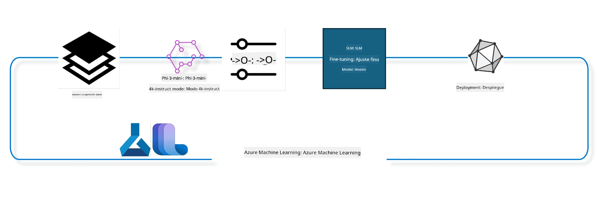

## Cómo usar componentes de chat-completion del registro del sistema de Azure ML para ajustar un modelo

En este ejemplo realizaremos el ajuste fino del modelo Phi-3-mini-4k-instruct para completar una conversación entre 2 personas usando el conjunto de datos ultrachat_200k.



El ejemplo te mostrará cómo realizar el ajuste fino usando el SDK de Azure ML y Python y luego desplegar el modelo ajustado a un endpoint en línea para inferencia en tiempo real.

### Datos de entrenamiento

Usaremos el conjunto de datos ultrachat_200k. Esta es una versión fuertemente filtrada del conjunto de datos UltraChat y fue utilizado para entrenar Zephyr-7B-β, un modelo de chat de última generación de 7b.

### Modelo

Usaremos el modelo Phi-3-mini-4k-instruct para mostrar cómo el usuario puede afinar un modelo para la tarea de chat-completion. Si abriste este cuaderno desde una tarjeta de modelo específica, recuerda reemplazar el nombre del modelo específico.

### Tareas

- Elegir un modelo para afinar.
- Elegir y explorar datos de entrenamiento.
- Configurar el trabajo de ajuste fino.
- Ejecutar el trabajo de ajuste fino.
- Revisar métricas de entrenamiento y evaluación.
- Registrar el modelo ajustado.
- Desplegar el modelo ajustado para inferencia en tiempo real.
- Limpiar recursos.

## 1. Configurar prerrequisitos

- Instalar dependencias
- Conectarse al espacio de trabajo de AzureML. Aprende más en configurar la autenticación del SDK. Reemplaza <WORKSPACE_NAME>, <RESOURCE_GROUP> y <SUBSCRIPTION_ID> a continuación.
- Conectarse al registro del sistema azureml
- Establecer un nombre opcional para el experimento
- Verificar o crear computación.

> [!NOTE]
> Se requiere un solo nodo GPU que puede tener múltiples tarjetas GPU. Por ejemplo, en un nodo de Standard_NC24rs_v3 hay 4 GPUs NVIDIA V100 mientras que en Standard_NC12s_v3 hay 2 GPUs NVIDIA V100. Consulta la documentación para esta información. El número de tarjetas GPU por nodo se establece en el parámetro gpus_per_node a continuación. Configurar este valor correctamente asegurará la utilización de todas las GPUs en el nodo. Los SKUs recomendados para cómputo GPU se pueden encontrar aquí y aquí.

### Bibliotecas de Python

Instala las dependencias ejecutando la celda a continuación. Este paso no es opcional si se ejecuta en un entorno nuevo.

```bash
pip install azure-ai-ml
pip install azure-identity
pip install datasets==2.9.0
pip install mlflow
pip install azureml-mlflow
```

### Interacción con Azure ML

1. Este script de Python se usa para interactuar con el servicio Azure Machine Learning (Azure ML). Aquí tienes un resumen de lo que hace:

    - Importa los módulos necesarios de azure.ai.ml, azure.identity y azure.ai.ml.entities. También importa el módulo time.

    - Intenta autenticarse usando DefaultAzureCredential(), que provee una experiencia simplificada de autenticación para comenzar rápidamente a desarrollar aplicaciones en la nube de Azure. Si esto falla, recurre a InteractiveBrowserCredential(), que proporciona un inicio de sesión interactivo.

    - Luego intenta crear una instancia MLClient usando el método from_config, que lee la configuración del archivo config.json por defecto. Si esto falla, crea una instancia MLClient proporcionando manualmente subscription_id, resource_group_name y workspace_name.

    - Crea otra instancia MLClient, esta vez para el registro Azure ML llamado "azureml". Este registro es donde se almacenan modelos, pipelines de ajuste fino y entornos.

    - Establece el nombre del experimento como "chat_completion_Phi-3-mini-4k-instruct".

    - Genera una marca de tiempo única convirtiendo el tiempo actual (en segundos desde la época, como número flotante) a entero y luego a cadena. Esta marca de tiempo puede usarse para crear nombres y versiones únicas.

    ```python
    # Importar los módulos necesarios de Azure ML y Azure Identity
    from azure.ai.ml import MLClient
    from azure.identity import (
        DefaultAzureCredential,
        InteractiveBrowserCredential,
    )
    from azure.ai.ml.entities import AmlCompute
    import time  # Importar el módulo time
    
    # Intentar autenticar usando DefaultAzureCredential
    try:
        credential = DefaultAzureCredential()
        credential.get_token("https://management.azure.com/.default")
    except Exception as ex:  # Si DefaultAzureCredential falla, usar InteractiveBrowserCredential
        credential = InteractiveBrowserCredential()
    
    # Intentar crear una instancia de MLClient usando el archivo de configuración predeterminado
    try:
        workspace_ml_client = MLClient.from_config(credential=credential)
    except:  # Si eso falla, crear una instancia de MLClient proporcionando los detalles manualmente
        workspace_ml_client = MLClient(
            credential,
            subscription_id="<SUBSCRIPTION_ID>",
            resource_group_name="<RESOURCE_GROUP>",
            workspace_name="<WORKSPACE_NAME>",
        )
    
    # Crear otra instancia de MLClient para el registro de Azure ML llamado "azureml"
    # Este registro es donde se almacenan modelos, pipelines de ajuste fino y entornos
    registry_ml_client = MLClient(credential, registry_name="azureml")
    
    # Establecer el nombre del experimento
    experiment_name = "chat_completion_Phi-3-mini-4k-instruct"
    
    # Generar una marca de tiempo única que pueda usarse para nombres y versiones que necesitan ser únicos
    timestamp = str(int(time.time()))
    ```

## 2. Elegir un modelo base para ajustar

1. Phi-3-mini-4k-instruct es un modelo ligero de última generación con 3.8B parámetros construido sobre datasets usados para Phi-2. El modelo pertenece a la familia Phi-3, y la versión Mini viene en dos variantes 4K y 128K, que es la longitud de contexto (en tokens) que puede soportar. Necesitamos afinar el modelo para nuestro propósito específico para usarlo. Puedes explorar estos modelos en el Catálogo de Modelos en AzureML Studio, filtrando por la tarea chat-completion. En este ejemplo, usamos el modelo Phi-3-mini-4k-instruct. Si abriste este cuaderno para un modelo diferente, reemplaza el nombre y versión del modelo respectivamente.

> [!NOTE]
> la propiedad model id del modelo. Esto se pasará como entrada al trabajo de ajuste fino. También está disponible como campo Asset ID en la página de detalles del modelo en el Catálogo de Modelos de AzureML Studio.

2. Este script de Python está interactuando con el servicio Azure Machine Learning (Azure ML). Aquí tienes un resumen de lo que hace:

    - Establece el nombre del modelo como "Phi-3-mini-4k-instruct".

    - Usa el método get de la propiedad models del objeto registry_ml_client para recuperar la versión más reciente del modelo con el nombre especificado del registro Azure ML. El método get se llama con dos argumentos: el nombre del modelo y una etiqueta que especifica que se debe recuperar la última versión disponible.

    - Imprime un mensaje en la consola indicando el nombre, versión e id del modelo que se usará para el ajuste fino. El método format de la cadena inserta el nombre, versión e id del modelo en el mensaje. El nombre, versión e id del modelo se acceden como propiedades del objeto foundation_model.

    ```python
    # Establecer el nombre del modelo
    model_name = "Phi-3-mini-4k-instruct"
    
    # Obtener la última versión del modelo del registro de Azure ML
    foundation_model = registry_ml_client.models.get(model_name, label="latest")
    
    # Imprimir el nombre, la versión y el id del modelo
    # Esta información es útil para el seguimiento y la depuración
    print(
        "\n\nUsing model name: {0}, version: {1}, id: {2} for fine tuning".format(
            foundation_model.name, foundation_model.version, foundation_model.id
        )
    )
    ```

## 3. Crear un recurso de cómputo para usar con el trabajo

El trabajo de afinamiento funciona SOLO con cómputo GPU. El tamaño del recurso depende de qué tan grande es el modelo y en la mayoría de casos se vuelve complicado identificar el cómputo correcto para el trabajo. En esta celda, guiamos al usuario para seleccionar el cómputo adecuado para el trabajo.

> [!NOTE]
> Los cómputos listados abajo funcionan con la configuración más optimizada. Cualquier cambio en la configuración podría causar error Cuda Out Of Memory. En tal caso, intenta actualizar el cómputo a uno de mayor tamaño.

> [!NOTE]
> Al seleccionar el compute_cluster_size abajo, asegúrate que el cómputo esté disponible en tu grupo de recursos. Si un cómputo específico no está disponible puedes solicitar acceso a los recursos de cómputo.

### Comprobación del Modelo para Soporte de Ajuste Fino

1. Este script de Python está interactuando con un modelo de Azure Machine Learning (Azure ML). Aquí tienes un resumen de lo que hace:

    - Importa el módulo ast, que proporciona funciones para procesar árboles de la gramática abstracta de Python.

    - Verifica si el objeto foundation_model (que representa un modelo en Azure ML) tiene una etiqueta llamada finetune_compute_allow_list. Las etiquetas en Azure ML son pares clave-valor que puedes crear y usar para filtrar y ordenar modelos.

    - Si la etiqueta finetune_compute_allow_list está presente, usa la función ast.literal_eval para analizar de forma segura el valor de la etiqueta (una cadena) en una lista de Python. Esta lista se asigna a la variable computes_allow_list. Luego imprime un mensaje indicando que se debe crear un cómputo desde la lista.

    - Si la etiqueta no está presente, asigna None a computes_allow_list e imprime un mensaje indicando que la etiqueta no forma parte de las etiquetas del modelo.

    - En resumen, este script busca una etiqueta específica en la metadata del modelo, convierte su valor a lista si existe y proporciona retroalimentación al usuario.

    ```python
    # Importa el módulo ast, que proporciona funciones para procesar árboles de la gramática abstracta de sintaxis de Python
    import ast
    
    # Verifica si la etiqueta 'finetune_compute_allow_list' está presente en las etiquetas del modelo
    if "finetune_compute_allow_list" in foundation_model.tags:
        # Si la etiqueta está presente, usa ast.literal_eval para analizar de forma segura el valor de la etiqueta (una cadena) en una lista de Python
        computes_allow_list = ast.literal_eval(
            foundation_model.tags["finetune_compute_allow_list"]
        )  # convierte una cadena en una lista de Python
        # Imprime un mensaje indicando que se debe crear un cómputo a partir de la lista
        print(f"Please create a compute from the above list - {computes_allow_list}")
    else:
        # Si la etiqueta no está presente, establece computes_allow_list como None
        computes_allow_list = None
        # Imprime un mensaje indicando que la etiqueta 'finetune_compute_allow_list' no forma parte de las etiquetas del modelo
        print("`finetune_compute_allow_list` is not part of model tags")
    ```

### Comprobación de la Instancia de Cómputo

1. Este script de Python está interactuando con el servicio Azure Machine Learning (Azure ML) y realiza varias comprobaciones sobre una instancia de cómputo. Aquí tienes un resumen de lo que hace:

    - Intenta obtener la instancia de cómputo con el nombre almacenado en compute_cluster desde el espacio de trabajo Azure ML. Si el estado de aprovisionamiento es "failed", lanza un ValueError.

    - Comprueba si computes_allow_list no es None. Si no lo es, convierte todos los tamaños en la lista a minúsculas y verifica si el tamaño de la instancia de cómputo actual está en la lista. Si no está, lanza un ValueError.

    - Si computes_allow_list es None, verifica si el tamaño de la instancia de cómputo está en una lista de tamaños de VM GPU no soportados. Si está, lanza un ValueError.

    - Recupera una lista de todos los tamaños de cómputo disponibles en el espacio de trabajo. Recorre la lista y para cada tamaño comprueba si su nombre coincide con el tamaño de la instancia actual. Si coincide, obtiene el número de GPUs para ese tamaño y marca gpu_count_found como True.

    - Si gpu_count_found es True, imprime el número de GPUs en la instancia de cómputo. Si es False, lanza un ValueError.

    - En resumen, este script realiza varias comprobaciones sobre una instancia de cómputo en un espacio de trabajo Azure ML, incluyendo estado de aprovisionamiento, tamaño contra listas de permitidos o denegados y número de GPUs.
    
    ```python
    # Imprimir el mensaje de la excepción
    print(e)
    # Lanzar un ValueError si el tamaño de computación no está disponible en el espacio de trabajo
    raise ValueError(
        f"WARNING! Compute size {compute_cluster_size} not available in workspace"
    )
    
    # Obtener la instancia de computación del espacio de trabajo de Azure ML
    compute = workspace_ml_client.compute.get(compute_cluster)
    # Verificar si el estado de aprovisionamiento de la instancia de computación es "fallido"
    if compute.provisioning_state.lower() == "failed":
        # Lanzar un ValueError si el estado de aprovisionamiento es "fallido"
        raise ValueError(
            f"Provisioning failed, Compute '{compute_cluster}' is in failed state. "
            f"please try creating a different compute"
        )
    
    # Verificar si computes_allow_list no es None
    if computes_allow_list is not None:
        # Convertir todos los tamaños de computación en computes_allow_list a minúsculas
        computes_allow_list_lower_case = [x.lower() for x in computes_allow_list]
        # Verificar si el tamaño de la instancia de computación está en computes_allow_list_lower_case
        if compute.size.lower() not in computes_allow_list_lower_case:
            # Lanzar un ValueError si el tamaño de la instancia de computación no está en computes_allow_list_lower_case
            raise ValueError(
                f"VM size {compute.size} is not in the allow-listed computes for finetuning"
            )
    else:
        # Definir una lista de tamaños de máquinas virtuales GPU no soportados
        unsupported_gpu_vm_list = [
            "standard_nc6",
            "standard_nc12",
            "standard_nc24",
            "standard_nc24r",
        ]
        # Verificar si el tamaño de la instancia de computación está en unsupported_gpu_vm_list
        if compute.size.lower() in unsupported_gpu_vm_list:
            # Lanzar un ValueError si el tamaño de la instancia de computación está en unsupported_gpu_vm_list
            raise ValueError(
                f"VM size {compute.size} is currently not supported for finetuning"
            )
    
    # Inicializar una bandera para verificar si se ha encontrado el número de GPUs en la instancia de computación
    gpu_count_found = False
    # Obtener una lista de todos los tamaños de computación disponibles en el espacio de trabajo
    workspace_compute_sku_list = workspace_ml_client.compute.list_sizes()
    available_sku_sizes = []
    # Iterar sobre la lista de tamaños de computación disponibles
    for compute_sku in workspace_compute_sku_list:
        available_sku_sizes.append(compute_sku.name)
        # Verificar si el nombre del tamaño de computación coincide con el tamaño de la instancia de computación
        if compute_sku.name.lower() == compute.size.lower():
            # Si coincide, obtener el número de GPUs para ese tamaño de computación y establecer gpu_count_found en True
            gpus_per_node = compute_sku.gpus
            gpu_count_found = True
    # Si gpu_count_found es True, imprimir el número de GPUs en la instancia de computación
    if gpu_count_found:
        print(f"Number of GPU's in compute {compute.size}: {gpus_per_node}")
    else:
        # Si gpu_count_found es False, lanzar un ValueError
        raise ValueError(
            f"Number of GPU's in compute {compute.size} not found. Available skus are: {available_sku_sizes}."
            f"This should not happen. Please check the selected compute cluster: {compute_cluster} and try again."
        )
    ```

## 4. Elegir el conjunto de datos para el ajuste fino del modelo

1. Usamos el conjunto de datos ultrachat_200k. Este conjunto tiene cuatro divisiones, adecuadas para ajuste fino supervisado (sft).
Generación ranking (gen). El número de ejemplos por división se muestra a continuación:

    ```bash
    train_sft test_sft  train_gen  test_gen
    207865  23110  256032  28304
    ```

1. Las siguientes pocas celdas muestran la preparación básica de los datos para ajuste fino:

### Visualizar algunas filas de datos

Queremos que esta muestra se ejecute rápido, así que guarda los archivos train_sft, test_sft conteniendo el 5% de las filas ya recortadas. Esto significa que el modelo afinado tendrá menor precisión, por lo que no debería usarse en producción.
El script download-dataset.py se usa para descargar el conjunto ultrachat_200k y transformar el conjunto en un formato consumible por el pipeline de ajuste fino. Además, dado que el conjunto es grande, aquí solo tenemos una parte del conjunto de datos.

1. Ejecutar el script a continuación descarga solo el 5% de los datos. Esto puede aumentarse cambiando el parámetro dataset_split_pc al porcentaje deseado.

> [!NOTE]
> Algunos modelos de lenguaje usan diferentes códigos para idioma por lo que los nombres de columna en el conjunto de datos deberían reflejar esto.

1. Aquí hay un ejemplo de cómo deberían verse los datos
El conjunto de datos de chat-completion está almacenado en formato parquet con cada entrada usando el siguiente esquema:

    - Este es un documento JSON (JavaScript Object Notation), un formato de intercambio de datos popular. No es código ejecutable, sino una manera de almacenar y transportar datos. Aquí tienes un desglose de su estructura:

    - "prompt": Esta clave contiene un valor de texto que representa una tarea o pregunta planteada a un asistente de IA.

    - "messages": Esta clave contiene un arreglo de objetos. Cada objeto representa un mensaje en una conversación entre un usuario y un asistente de IA. Cada objeto mensaje tiene dos claves:

    - "content": Esta clave contiene un valor de texto que representa el contenido del mensaje.
    - "role": Esta clave contiene un valor de texto que representa el rol de la entidad que envió el mensaje. Puede ser "user" o "assistant".
    - "prompt_id": Esta clave contiene un valor de texto que representa un identificador único para el prompt.

1. En este documento JSON específico, se representa una conversación donde un usuario pide a un asistente de IA crear un protagonista para una historia distópica. El asistente responde, y luego el usuario pide más detalles. El asistente acepta proveer más detalles. Toda la conversación está asociada con un id de prompt específico.

    ```python
    {
        // The task or question posed to an AI assistant
        "prompt": "Create a fully-developed protagonist who is challenged to survive within a dystopian society under the rule of a tyrant. ...",
        
        // An array of objects, each representing a message in a conversation between a user and an AI assistant
        "messages":[
            {
                // The content of the user's message
                "content": "Create a fully-developed protagonist who is challenged to survive within a dystopian society under the rule of a tyrant. ...",
                // The role of the entity that sent the message
                "role": "user"
            },
            {
                // The content of the assistant's message
                "content": "Name: Ava\n\n Ava was just 16 years old when the world as she knew it came crashing down. The government had collapsed, leaving behind a chaotic and lawless society. ...",
                // The role of the entity that sent the message
                "role": "assistant"
            },
            {
                // The content of the user's message
                "content": "Wow, Ava's story is so intense and inspiring! Can you provide me with more details.  ...",
                // The role of the entity that sent the message
                "role": "user"
            }, 
            {
                // The content of the assistant's message
                "content": "Certainly! ....",
                // The role of the entity that sent the message
                "role": "assistant"
            }
        ],
        
        // A unique identifier for the prompt
        "prompt_id": "d938b65dfe31f05f80eb8572964c6673eddbd68eff3db6bd234d7f1e3b86c2af"
    }
    ```

### Descargar Datos

1. Este script de Python se usa para descargar un conjunto de datos usando un script auxiliar llamado download-dataset.py. Aquí tienes un resumen de lo que hace:

    - Importa el módulo os, que proporciona una manera portable de usar funcionalidades dependientes del sistema operativo.

    - Usa la función os.system para ejecutar el script download-dataset.py en la shell con argumentos específicos. Los argumentos especifican el conjunto de datos a descargar (HuggingFaceH4/ultrachat_200k), el directorio donde descargarlo (ultrachat_200k_dataset) y el porcentaje del conjunto para dividir (5). La función os.system devuelve el estado de salida del comando; este valor se almacena en exit_status.

    - Comprueba si exit_status no es 0. En sistemas tipo Unix, un estado de salida de 0 indica éxito, cualquier otro número indica un error. Si exit_status no es 0, lanza una excepción con un mensaje indicando que hubo un error descargando el conjunto de datos.

    - En resumen, este script ejecuta un comando para descargar un conjunto de datos usando un script auxiliar y lanza una excepción si el comando falla.
    
    ```python
    # Importa el módulo os, que proporciona una forma de usar la funcionalidad dependiente del sistema operativo
    import os
    
    # Usa la función os.system para ejecutar el script download-dataset.py en la consola con argumentos específicos de línea de comandos
    # Los argumentos especifican el conjunto de datos a descargar (HuggingFaceH4/ultrachat_200k), el directorio donde descargarlo (ultrachat_200k_dataset), y el porcentaje del conjunto de datos para dividir (5)
    # La función os.system devuelve el estado de salida del comando que ejecutó; este estado se guarda en la variable exit_status
    exit_status = os.system(
        "python ./download-dataset.py --dataset HuggingFaceH4/ultrachat_200k --download_dir ultrachat_200k_dataset --dataset_split_pc 5"
    )
    
    # Verifica si exit_status no es 0
    # En sistemas operativos similares a Unix, un estado de salida de 0 generalmente indica que un comando ha tenido éxito, mientras que cualquier otro número indica un error
    # Si exit_status no es 0, lanza una Excepción con un mensaje que indica que hubo un error descargando el conjunto de datos
    if exit_status != 0:
        raise Exception("Error downloading dataset")
    ```

### Cargar Datos en un DataFrame
1. Este script de Python está cargando un archivo JSON Lines en un DataFrame de pandas y mostrando las primeras 5 filas. Aquí hay un desglose de lo que hace:

    - Importa la biblioteca pandas, que es una poderosa librería de manipulación y análisis de datos.

    - Establece el ancho máximo de columna para las opciones de visualización de pandas en 0. Esto significa que se mostrará el texto completo de cada columna sin truncamiento cuando se imprima el DataFrame.

    - Usa la función pd.read_json para cargar el archivo train_sft.jsonl del directorio ultrachat_200k_dataset en un DataFrame. El argumento lines=True indica que el archivo está en formato JSON Lines, donde cada línea es un objeto JSON separado.

    - Usa el método head para mostrar las primeras 5 filas del DataFrame. Si el DataFrame tiene menos de 5 filas, mostrará todas.

    - En resumen, este script está cargando un archivo JSON Lines en un DataFrame y mostrando las primeras 5 filas con texto completo en las columnas.
    
    ```python
    # Importa la biblioteca pandas, que es una biblioteca poderosa para la manipulación y análisis de datos
    import pandas as pd
    
    # Establece el ancho máximo de columna para las opciones de visualización de pandas a 0
    # Esto significa que el texto completo de cada columna se mostrará sin truncamiento cuando se imprima el DataFrame
    pd.set_option("display.max_colwidth", 0)
    
    # Usa la función pd.read_json para cargar el archivo train_sft.jsonl del directorio ultrachat_200k_dataset en un DataFrame
    # El argumento lines=True indica que el archivo está en formato JSON Lines, donde cada línea es un objeto JSON separado
    df = pd.read_json("./ultrachat_200k_dataset/train_sft.jsonl", lines=True)
    
    # Usa el método head para mostrar las primeras 5 filas del DataFrame
    # Si el DataFrame tiene menos de 5 filas, mostrará todas ellas
    df.head()
    ```

## 5. Enviar el trabajo de ajuste fino usando el modelo y datos como entradas

Crea el trabajo que usa el componente de canalización chat-completion. Aprende más sobre todos los parámetros soportados para el ajuste fino.

### Definir parámetros de ajuste fino

1. Los parámetros de ajuste fino pueden agruparse en 2 categorías: parámetros de entrenamiento, parámetros de optimización.

1. Los parámetros de entrenamiento definen los aspectos de la capacitación como:

    - El optimizador, el programador a usar
    - La métrica para optimizar el ajuste fino
    - Número de pasos de entrenamiento, tamaño del lote, etc.
    - Los parámetros de optimización ayudan a optimizar la memoria GPU y a usar eficazmente los recursos de cómputo.

1. A continuación se muestran algunos de los parámetros que pertenecen a esta categoría. Los parámetros de optimización varían para cada modelo y se empaquetan con el modelo para manejar estas variaciones.

    - Habilitar deepspeed y LoRA
    - Habilitar entrenamiento con precisión mixta
    - Habilitar entrenamiento multinodo

> [!NOTE]
> El ajuste fino supervisado puede resultar en pérdida de alineación o un olvido catastrófico. Recomendamos revisar este problema y ejecutar una etapa de alineación después de ajustar el modelo.

### Parámetros de Ajuste Fino

1. Este script de Python establece parámetros para el ajuste fino de un modelo de aprendizaje automático. Aquí hay un desglose de lo que hace:

    - Establece parámetros de entrenamiento predeterminados como el número de épocas, tamaños de lote para entrenamiento y evaluación, tasa de aprendizaje, y tipo de programador de tasa de aprendizaje.

    - Establece parámetros de optimización predeterminados como si se aplica Layer-wise Relevance Propagation (LoRa) y DeepSpeed, y la etapa de DeepSpeed.

    - Combina los parámetros de entrenamiento y optimización en un solo diccionario llamado finetune_parameters.

    - Verifica si foundation_model tiene parámetros predeterminados específicos para el modelo. Si es así, imprime un mensaje de advertencia y actualiza el diccionario finetune_parameters con esos parámetros específicos del modelo. La función ast.literal_eval se usa para convertir los parámetros específicos del modelo de una cadena a un diccionario de Python.

    - Imprime el conjunto final de parámetros de ajuste fino que se usarán para la ejecución.

    - En resumen, este script configura y muestra los parámetros para el ajuste fino de un modelo de aprendizaje automático, con la capacidad de sobrescribir los parámetros predeterminados con los específicos del modelo.

    ```python
    # Configurar parámetros de entrenamiento predeterminados, como el número de épocas de entrenamiento, tamaños de lote para entrenamiento y evaluación, tasa de aprendizaje y tipo de programador de tasa de aprendizaje
    training_parameters = dict(
        num_train_epochs=3,
        per_device_train_batch_size=1,
        per_device_eval_batch_size=1,
        learning_rate=5e-6,
        lr_scheduler_type="cosine",
    )
    
    # Configurar parámetros de optimización predeterminados, como si se debe aplicar Layer-wise Relevance Propagation (LoRa) y DeepSpeed, y la etapa de DeepSpeed
    optimization_parameters = dict(
        apply_lora="true",
        apply_deepspeed="true",
        deepspeed_stage=2,
    )
    
    # Combinar los parámetros de entrenamiento y optimización en un solo diccionario llamado finetune_parameters
    finetune_parameters = {**training_parameters, **optimization_parameters}
    
    # Verificar si el foundation_model tiene parámetros predeterminados específicos del modelo
    # Si los tiene, imprimir un mensaje de advertencia y actualizar el diccionario finetune_parameters con estos valores predeterminados específicos del modelo
    # La función ast.literal_eval se usa para convertir los valores predeterminados específicos del modelo de una cadena a un diccionario de Python
    if "model_specific_defaults" in foundation_model.tags:
        print("Warning! Model specific defaults exist. The defaults could be overridden.")
        finetune_parameters.update(
            ast.literal_eval(  # convertir cadena a diccionario de Python
                foundation_model.tags["model_specific_defaults"]
            )
        )
    
    # Imprimir el conjunto final de parámetros de fine-tuning que se utilizarán para la ejecución
    print(
        f"The following finetune parameters are going to be set for the run: {finetune_parameters}"
    )
    ```

### Canalización de Entrenamiento

1. Este script de Python define una función para generar un nombre de visualización para una canalización de entrenamiento de aprendizaje automático, y luego llama a esta función para generar e imprimir este nombre. Aquí hay un desglose de lo que hace:

1. Se define la función get_pipeline_display_name. Esta función genera un nombre de visualización basado en varios parámetros relacionados con la canalización de entrenamiento.

1. Dentro de la función, calcula el tamaño total del lote multiplicando el tamaño del lote por dispositivo, los pasos de acumulación de gradiente, el número de GPUs por nodo y el número de nodos usados para el ajuste fino.

1. Recupera varios otros parámetros como el tipo de programador de tasa de aprendizaje, si se aplica DeepSpeed, la etapa de DeepSpeed, si se aplica Layer-wise Relevance Propagation (LoRa), el límite en el número de puntos de control del modelo a conservar y la longitud máxima de la secuencia.

1. Construye una cadena que incluye todos estos parámetros, separados por guiones. Si DeepSpeed o LoRa están aplicados, la cadena incluye "ds" seguido por la etapa de DeepSpeed, o "lora", respectivamente. Si no, incluye "nods" o "nolora", respectivamente.

1. La función devuelve esta cadena, que sirve como nombre de visualización para la canalización de entrenamiento.

1. Después de definir la función, se llama para generar el nombre de visualización, que luego se imprime.

1. En resumen, este script genera un nombre de visualización para una canalización de entrenamiento de aprendizaje automático basado en varios parámetros, y luego imprime ese nombre.

    ```python
    # Define una función para generar un nombre para mostrar para la canalización de entrenamiento
    def get_pipeline_display_name():
        # Calcula el tamaño total del lote multiplicando el tamaño del lote por dispositivo, el número de pasos de acumulación de gradientes, el número de GPUs por nodo y el número de nodos utilizados para el ajuste fino
        batch_size = (
            int(finetune_parameters.get("per_device_train_batch_size", 1))
            * int(finetune_parameters.get("gradient_accumulation_steps", 1))
            * int(gpus_per_node)
            * int(finetune_parameters.get("num_nodes_finetune", 1))
        )
        # Recuperar el tipo de planificador de la tasa de aprendizaje
        scheduler = finetune_parameters.get("lr_scheduler_type", "linear")
        # Recuperar si se aplica DeepSpeed
        deepspeed = finetune_parameters.get("apply_deepspeed", "false")
        # Recuperar la etapa de DeepSpeed
        ds_stage = finetune_parameters.get("deepspeed_stage", "2")
        # Si se aplica DeepSpeed, incluir "ds" seguido de la etapa de DeepSpeed en el nombre para mostrar; si no, incluir "nods"
        if deepspeed == "true":
            ds_string = f"ds{ds_stage}"
        else:
            ds_string = "nods"
        # Recuperar si se aplica la Propagación de Relevancia a nivel de capa (LoRa)
        lora = finetune_parameters.get("apply_lora", "false")
        # Si se aplica LoRa, incluir "lora" en el nombre para mostrar; si no, incluir "nolora"
        if lora == "true":
            lora_string = "lora"
        else:
            lora_string = "nolora"
        # Recuperar el límite en el número de puntos de control del modelo para mantener
        save_limit = finetune_parameters.get("save_total_limit", -1)
        # Recuperar la longitud máxima de la secuencia
        seq_len = finetune_parameters.get("max_seq_length", -1)
        # Construir el nombre para mostrar concatenando todos estos parámetros, separados por guiones
        return (
            model_name
            + "-"
            + "ultrachat"
            + "-"
            + f"bs{batch_size}"
            + "-"
            + f"{scheduler}"
            + "-"
            + ds_string
            + "-"
            + lora_string
            + f"-save_limit{save_limit}"
            + f"-seqlen{seq_len}"
        )
    
    # Llamar a la función para generar el nombre para mostrar
    pipeline_display_name = get_pipeline_display_name()
    # Imprimir el nombre para mostrar
    print(f"Display name used for the run: {pipeline_display_name}")
    ```

### Configuración de la Canalización

Este script de Python está definiendo y configurando una canalización de aprendizaje automático usando el SDK de Azure Machine Learning. Aquí hay un desglose de lo que hace:

1. Importa los módulos necesarios del SDK Azure AI ML.

1. Obtiene un componente de canalización llamado "chat_completion_pipeline" del registro.

1. Define un trabajo de canalización usando el decorador `@pipeline` y la función `create_pipeline`. El nombre de la canalización se establece como `pipeline_display_name`.

1. Dentro de la función `create_pipeline`, inicializa el componente de canalización obtenido con varios parámetros, incluyendo la ruta del modelo, clústeres de cómputo para diferentes etapas, divisiones del conjunto de datos para entrenamiento y prueba, número de GPUs para usar en el ajuste fino y otros parámetros de ajuste fino.

1. Mapea la salida del trabajo de ajuste fino a la salida del trabajo de la canalización. Esto se hace para que el modelo ajustado se pueda registrar fácilmente, lo cual es requerido para desplegar el modelo a un endpoint en línea o por lotes.

1. Crea una instancia de la canalización llamando a la función `create_pipeline`.

1. Establece la configuración `force_rerun` de la canalización a `True`, lo que significa que no se usarán resultados almacenados en caché de trabajos anteriores.

1. Establece la configuración `continue_on_step_failure` de la canalización a `False`, que significa que la canalización se detendrá si algún paso falla.

1. En resumen, este script está definiendo y configurando una canalización de aprendizaje automático para una tarea de completado de chat usando el SDK de Azure Machine Learning.

    ```python
    # Importar los módulos necesarios del SDK de Azure AI ML
    from azure.ai.ml.dsl import pipeline
    from azure.ai.ml import Input
    
    # Obtener el componente de pipeline llamado "chat_completion_pipeline" del registro
    pipeline_component_func = registry_ml_client.components.get(
        name="chat_completion_pipeline", label="latest"
    )
    
    # Definir el trabajo de pipeline usando el decorador @pipeline y la función create_pipeline
    # El nombre del pipeline se establece en pipeline_display_name
    @pipeline(name=pipeline_display_name)
    def create_pipeline():
        # Inicializar el componente de pipeline obtenido con varios parámetros
        # Estos incluyen la ruta del modelo, clusters de cómputo para diferentes etapas, divisiones de conjuntos de datos para entrenamiento y prueba, el número de GPUs para afinación fina y otros parámetros de afinación
        chat_completion_pipeline = pipeline_component_func(
            mlflow_model_path=foundation_model.id,
            compute_model_import=compute_cluster,
            compute_preprocess=compute_cluster,
            compute_finetune=compute_cluster,
            compute_model_evaluation=compute_cluster,
            # Mapear las divisiones del conjunto de datos a parámetros
            train_file_path=Input(
                type="uri_file", path="./ultrachat_200k_dataset/train_sft.jsonl"
            ),
            test_file_path=Input(
                type="uri_file", path="./ultrachat_200k_dataset/test_sft.jsonl"
            ),
            # Configuraciones de entrenamiento
            number_of_gpu_to_use_finetuning=gpus_per_node,  # Establecer al número de GPUs disponibles en el cómputo
            **finetune_parameters
        )
        return {
            # Mapear la salida del trabajo de afinación fina a la salida del trabajo de pipeline
            # Esto se hace para que podamos registrar fácilmente el modelo afinado
            # Registrar el modelo es necesario para desplegar el modelo en un endpoint en línea o por lotes
            "trained_model": chat_completion_pipeline.outputs.mlflow_model_folder
        }
    
    # Crear una instancia del pipeline llamando a la función create_pipeline
    pipeline_object = create_pipeline()
    
    # No usar resultados almacenados en caché de trabajos anteriores
    pipeline_object.settings.force_rerun = True
    
    # Establecer continuar en caso de fallo de paso a Falso
    # Esto significa que el pipeline se detendrá si algún paso falla
    pipeline_object.settings.continue_on_step_failure = False
    ```

### Enviar el Trabajo

1. Este script de Python está enviando un trabajo de canalización de aprendizaje automático a un espacio de trabajo de Azure Machine Learning y luego esperando a que el trabajo finalice. Aquí hay un desglose de lo que hace:

    - Llama al método create_or_update del objeto jobs en workspace_ml_client para enviar el trabajo de la canalización. Se especifica la canalización a ejecutar mediante pipeline_object, y el experimento bajo el cual se ejecuta el trabajo se especifica con experiment_name.

    - Luego llama al método stream del objeto jobs en workspace_ml_client para esperar a que el trabajo de la canalización finalice. El trabajo a esperar se especifica por el atributo name del objeto pipeline_job.

    - En resumen, este script está enviando un trabajo de canalización de aprendizaje automático a un espacio de trabajo de Azure Machine Learning, y luego esperando a que el trabajo finalice.

    ```python
    # Enviar el trabajo de la canalización al espacio de trabajo de Azure Machine Learning
    # La canalización que se ejecutará está especificada por pipeline_object
    # El experimento bajo el cual se ejecuta el trabajo está especificado por experiment_name
    pipeline_job = workspace_ml_client.jobs.create_or_update(
        pipeline_object, experiment_name=experiment_name
    )
    
    # Esperar a que el trabajo de la canalización se complete
    # El trabajo para esperar está especificado por el atributo name del objeto pipeline_job
    workspace_ml_client.jobs.stream(pipeline_job.name)
    ```

## 6. Registrar el modelo ajustado en el espacio de trabajo

Registraremos el modelo a partir de la salida del trabajo de ajuste fino. Esto rastreará la línea de tiempo entre el modelo ajustado y el trabajo de ajuste fino. El trabajo de ajuste fino, a su vez, rastrea la línea de tiempo con el modelo base, datos y código de entrenamiento.

### Registro del Modelo ML

1. Este script de Python está registrando un modelo de aprendizaje automático que fue entrenado en una canalización de Azure Machine Learning. Aquí hay un desglose de lo que hace:

    - Importa los módulos necesarios del SDK Azure AI ML.

    - Verifica si la salida trained_model está disponible desde el trabajo de la canalización llamando al método get del objeto jobs en workspace_ml_client y accediendo a su atributo outputs.

    - Construye una ruta hacia el modelo entrenado formateando una cadena con el nombre del trabajo de la canalización y el nombre de la salida ("trained_model").

    - Define un nombre para el modelo ajustado añadiendo "-ultrachat-200k" al nombre original del modelo y reemplazando cualquier barra diagonal por guiones.

    - Prepara el registro del modelo creando un objeto Model con varios parámetros, que incluyen la ruta al modelo, el tipo de modelo (modelo MLflow), el nombre y versión del modelo, y una descripción del modelo.

    - Registra el modelo llamando al método create_or_update del objeto models en workspace_ml_client con el objeto Model como argumento.

    - Imprime el modelo registrado.

1. En resumen, este script está registrando un modelo de aprendizaje automático entrenado en una canalización de Azure Machine Learning.
    
    ```python
    # Importar los módulos necesarios del SDK Azure AI ML
    from azure.ai.ml.entities import Model
    from azure.ai.ml.constants import AssetTypes
    
    # Comprobar si la salida `trained_model` está disponible desde el trabajo de canalización
    print("pipeline job outputs: ", workspace_ml_client.jobs.get(pipeline_job.name).outputs)
    
    # Construir una ruta al modelo entrenado formateando una cadena con el nombre del trabajo de la canalización y el nombre de la salida ("trained_model")
    model_path_from_job = "azureml://jobs/{0}/outputs/{1}".format(
        pipeline_job.name, "trained_model"
    )
    
    # Definir un nombre para el modelo ajustado añadiendo "-ultrachat-200k" al nombre original del modelo y reemplazando cualquier barra por guiones
    finetuned_model_name = model_name + "-ultrachat-200k"
    finetuned_model_name = finetuned_model_name.replace("/", "-")
    
    print("path to register model: ", model_path_from_job)
    
    # Preparar el registro del modelo creando un objeto Model con varios parámetros
    # Estos incluyen la ruta al modelo, el tipo de modelo (modelo MLflow), el nombre y versión del modelo, y una descripción del modelo
    prepare_to_register_model = Model(
        path=model_path_from_job,
        type=AssetTypes.MLFLOW_MODEL,
        name=finetuned_model_name,
        version=timestamp,  # Usar la marca de tiempo como versión para evitar conflicto de versiones
        description=model_name + " fine tuned model for ultrachat 200k chat-completion",
    )
    
    print("prepare to register model: \n", prepare_to_register_model)
    
    # Registrar el modelo llamando al método create_or_update del objeto models en workspace_ml_client con el objeto Model como argumento
    registered_model = workspace_ml_client.models.create_or_update(
        prepare_to_register_model
    )
    
    # Imprimir el modelo registrado
    print("registered model: \n", registered_model)
    ```

## 7. Desplegar el modelo ajustado en un endpoint en línea

Los endpoints en línea ofrecen una API REST durable que se puede usar para integrar con aplicaciones que necesiten usar el modelo.

### Gestionar Endpoint

1. Este script de Python está creando un endpoint en línea gestionado en Azure Machine Learning para un modelo registrado. Aquí hay un desglose de lo que hace:

    - Importa los módulos necesarios del SDK Azure AI ML.

    - Define un nombre único para el endpoint en línea añadiendo una marca temporal al string "ultrachat-completion-".

    - Prepara la creación del endpoint en línea creando un objeto ManagedOnlineEndpoint con varios parámetros, que incluyen el nombre del endpoint, una descripción y el modo de autenticación ("key").

    - Crea el endpoint en línea llamando al método begin_create_or_update de workspace_ml_client con el objeto ManagedOnlineEndpoint como argumento. Luego espera a que la operación de creación finalice usando el método wait.

1. En resumen, este script está creando un endpoint en línea gestionado en Azure Machine Learning para un modelo registrado.

    ```python
    # Importar los módulos necesarios del SDK de Azure AI ML
    from azure.ai.ml.entities import (
        ManagedOnlineEndpoint,
        ManagedOnlineDeployment,
        ProbeSettings,
        OnlineRequestSettings,
    )
    
    # Definir un nombre único para el endpoint en línea agregando una marca de tiempo a la cadena "ultrachat-completion-"
    online_endpoint_name = "ultrachat-completion-" + timestamp
    
    # Prepararse para crear el endpoint en línea creando un objeto ManagedOnlineEndpoint con varios parámetros
    # Estos incluyen el nombre del endpoint, una descripción del endpoint y el modo de autenticación ("key")
    endpoint = ManagedOnlineEndpoint(
        name=online_endpoint_name,
        description="Online endpoint for "
        + registered_model.name
        + ", fine tuned model for ultrachat-200k-chat-completion",
        auth_mode="key",
    )
    
    # Crear el endpoint en línea llamando al método begin_create_or_update del cliente workspace_ml_client con el objeto ManagedOnlineEndpoint como argumento
    # Luego esperar a que la operación de creación se complete llamando al método wait
    workspace_ml_client.begin_create_or_update(endpoint).wait()
    ```

> [!NOTE]
> Puedes encontrar aquí la lista de SKUs soportados para despliegue - [Managed online endpoints SKU list](https://learn.microsoft.com/azure/machine-learning/reference-managed-online-endpoints-vm-sku-list)

### Desplegar Modelo ML

1. Este script de Python está desplegando un modelo de aprendizaje automático registrado a un endpoint en línea gestionado en Azure Machine Learning. Aquí hay un desglose de lo que hace:

    - Importa el módulo ast, que provee funciones para procesar árboles de sintaxis abstracta de Python.

    - Establece el tipo de instancia para el despliegue en "Standard_NC6s_v3".

    - Verifica si la etiqueta inference_compute_allow_list está presente en el modelo base. Si está, convierte el valor de la etiqueta de una cadena a una lista de Python y la asigna a inference_computes_allow_list. Si no está, establece inference_computes_allow_list en None.

    - Verifica si el tipo de instancia especificado está en la lista permitida. Si no está, imprime un mensaje pidiendo al usuario seleccionar un tipo de instancia de la lista permitida.

    - Prepara la creación del despliegue creando un objeto ManagedOnlineDeployment con varios parámetros, que incluyen el nombre del despliegue, el nombre del endpoint, el ID del modelo, el tipo y número de instancias, configuraciones de sonda de vida y configuraciones de solicitud.

    - Crea el despliegue llamando al método begin_create_or_update de workspace_ml_client con el objeto ManagedOnlineDeployment como argumento. Luego espera a que la operación de creación termine usando el método wait.

    - Establece el tráfico del endpoint para dirigir el 100% del tráfico al despliegue "demo".

    - Actualiza el endpoint llamando al método begin_create_or_update de workspace_ml_client con el objeto endpoint como argumento. Luego espera a que la operación de actualización termine con el método result.

1. En resumen, este script está desplegando un modelo de aprendizaje automático registrado a un endpoint en línea gestionado en Azure Machine Learning.

    ```python
    # Importa el módulo ast, que proporciona funciones para procesar árboles de la gramática abstracta de sintaxis de Python
    import ast
    
    # Establece el tipo de instancia para el despliegue
    instance_type = "Standard_NC6s_v3"
    
    # Verifica si la etiqueta `inference_compute_allow_list` está presente en el modelo base
    if "inference_compute_allow_list" in foundation_model.tags:
        # Si lo está, convierte el valor de la etiqueta de una cadena a una lista de Python y la asigna a `inference_computes_allow_list`
        inference_computes_allow_list = ast.literal_eval(
            foundation_model.tags["inference_compute_allow_list"]
        )
        print(f"Please create a compute from the above list - {computes_allow_list}")
    else:
        # Si no está, establece `inference_computes_allow_list` en `None`
        inference_computes_allow_list = None
        print("`inference_compute_allow_list` is not part of model tags")
    
    # Verifica si el tipo de instancia especificado está en la lista permitida
    if (
        inference_computes_allow_list is not None
        and instance_type not in inference_computes_allow_list
    ):
        print(
            f"`instance_type` is not in the allow listed compute. Please select a value from {inference_computes_allow_list}"
        )
    
    # Prepara la creación del despliegue creando un objeto `ManagedOnlineDeployment` con varios parámetros
    demo_deployment = ManagedOnlineDeployment(
        name="demo",
        endpoint_name=online_endpoint_name,
        model=registered_model.id,
        instance_type=instance_type,
        instance_count=1,
        liveness_probe=ProbeSettings(initial_delay=600),
        request_settings=OnlineRequestSettings(request_timeout_ms=90000),
    )
    
    # Crea el despliegue llamando al método `begin_create_or_update` del `workspace_ml_client` con el objeto `ManagedOnlineDeployment` como argumento
    # Luego espera a que la operación de creación se complete llamando al método `wait`
    workspace_ml_client.online_deployments.begin_create_or_update(demo_deployment).wait()
    
    # Establece el tráfico del endpoint para dirigir el 100% del tráfico al despliegue "demo"
    endpoint.traffic = {"demo": 100}
    
    # Actualiza el endpoint llamando al método `begin_create_or_update` del `workspace_ml_client` con el objeto `endpoint` como argumento
    # Luego espera a que la operación de actualización se complete llamando al método `result`
    workspace_ml_client.begin_create_or_update(endpoint).result()
    ```

## 8. Probar el endpoint con datos de ejemplo

Obtendremos algunos datos de ejemplo del conjunto de datos de prueba y los enviaremos al endpoint en línea para inferencia. Luego mostraremos las etiquetas predichas junto con las etiquetas de verdad de base.

### Leyendo los resultados

1. Este script de Python está leyendo un archivo JSON Lines en un DataFrame de pandas, tomando una muestra aleatoria, y reseteando el índice. Aquí hay un desglose de lo que hace:

    - Lee el archivo ./ultrachat_200k_dataset/test_gen.jsonl en un DataFrame de pandas. La función read_json se usa con el argumento lines=True porque el archivo está en formato JSON Lines, donde cada línea es un objeto JSON separado.

    - Toma una muestra aleatoria de 1 fila del DataFrame. La función sample se usa con el argumento n=1 para especificar el número de filas aleatorias a seleccionar.

    - Resetea el índice del DataFrame. La función reset_index se usa con el argumento drop=True para eliminar el índice original y reemplazarlo con un nuevo índice con valores enteros por defecto.

    - Muestra las primeras 2 filas del DataFrame usando la función head con argumento 2. Sin embargo, dado que el DataFrame solo contiene una fila después del muestreo, solo se mostrará esa fila.

1. En resumen, este script está leyendo un archivo JSON Lines en un DataFrame de pandas, tomando una muestra aleatoria de 1 fila, reseteando el índice, y mostrando la primera fila.
    
    ```python
    # Importar la biblioteca pandas
    import pandas as pd
    
    # Leer el archivo JSON Lines './ultrachat_200k_dataset/test_gen.jsonl' en un DataFrame de pandas
    # El argumento 'lines=True' indica que el archivo está en formato JSON Lines, donde cada línea es un objeto JSON separado
    test_df = pd.read_json("./ultrachat_200k_dataset/test_gen.jsonl", lines=True)
    
    # Tomar una muestra aleatoria de 1 fila del DataFrame
    # El argumento 'n=1' especifica la cantidad de filas aleatorias a seleccionar
    test_df = test_df.sample(n=1)
    
    # Reiniciar el índice del DataFrame
    # El argumento 'drop=True' indica que el índice original debe eliminarse y reemplazarse con un nuevo índice de valores enteros predeterminados
    # El argumento 'inplace=True' indica que el DataFrame debe modificarse en el lugar (sin crear un nuevo objeto)
    test_df.reset_index(drop=True, inplace=True)
    
    # Mostrar las primeras 2 filas del DataFrame
    # Sin embargo, dado que el DataFrame solo contiene una fila después del muestreo, esto solo mostrará esa única fila
    test_df.head(2)
    ```

### Crear Objeto JSON
1. Este script de Python está creando un objeto JSON con parámetros específicos y guardándolo en un archivo. Aquí tienes un desglose de lo que hace:

    - Importa el módulo json, que proporciona funciones para trabajar con datos JSON.

    - Crea un diccionario parameters con claves y valores que representan parámetros para un modelo de aprendizaje automático. Las claves son "temperature", "top_p", "do_sample" y "max_new_tokens", y sus valores correspondientes son 0.6, 0.9, True y 200 respectivamente.

    - Crea otro diccionario test_json con dos claves: "input_data" y "params". El valor de "input_data" es otro diccionario con claves "input_string" y "parameters". El valor de "input_string" es una lista que contiene el primer mensaje del DataFrame test_df. El valor de "parameters" es el diccionario parameters creado anteriormente. El valor de "params" es un diccionario vacío.

    - Abre un archivo llamado sample_score.json
    
    ```python
    # Importa el módulo json, que proporciona funciones para trabajar con datos JSON
    import json
    
    # Crea un diccionario `parameters` con claves y valores que representan parámetros para un modelo de aprendizaje automático
    # Las claves son "temperature", "top_p", "do_sample" y "max_new_tokens", y sus valores correspondientes son 0.6, 0.9, True y 200 respectivamente
    parameters = {
        "temperature": 0.6,
        "top_p": 0.9,
        "do_sample": True,
        "max_new_tokens": 200,
    }
    
    # Crea otro diccionario `test_json` con dos claves: "input_data" y "params"
    # El valor de "input_data" es otro diccionario con las claves "input_string" y "parameters"
    # El valor de "input_string" es una lista que contiene el primer mensaje del DataFrame `test_df`
    # El valor de "parameters" es el diccionario `parameters` creado anteriormente
    # El valor de "params" es un diccionario vacío
    test_json = {
        "input_data": {
            "input_string": [test_df["messages"][0]],
            "parameters": parameters,
        },
        "params": {},
    }
    
    # Abre un archivo llamado `sample_score.json` en el directorio `./ultrachat_200k_dataset` en modo escritura
    with open("./ultrachat_200k_dataset/sample_score.json", "w") as f:
        # Escribe el diccionario `test_json` en el archivo en formato JSON usando la función `json.dump`
        json.dump(test_json, f)
    ```

### Invocación del Endpoint

1. Este script de Python está invocando un endpoint en línea en Azure Machine Learning para evaluar un archivo JSON. Aquí tienes un desglose de lo que hace:

    - Llama al método invoke de la propiedad online_endpoints del objeto workspace_ml_client. Este método se usa para enviar una solicitud a un endpoint en línea y obtener una respuesta.

    - Especifica el nombre del endpoint y la implementación con los argumentos endpoint_name y deployment_name. En este caso, el nombre del endpoint se almacena en la variable online_endpoint_name y el nombre de la implementación es "demo".

    - Especifica la ruta al archivo JSON que se va a evaluar con el argumento request_file. En este caso, el archivo es ./ultrachat_200k_dataset/sample_score.json.

    - Almacena la respuesta del endpoint en la variable response.

    - Imprime la respuesta en bruto.

1. En resumen, este script invoca un endpoint en línea en Azure Machine Learning para evaluar un archivo JSON e imprime la respuesta.

    ```python
    # Invocar el endpoint en línea en Azure Machine Learning para puntuar el archivo `sample_score.json`
    # El método `invoke` de la propiedad `online_endpoints` del objeto `workspace_ml_client` se usa para enviar una solicitud a un endpoint en línea y obtener una respuesta
    # El argumento `endpoint_name` especifica el nombre del endpoint, que está almacenado en la variable `online_endpoint_name`
    # El argumento `deployment_name` especifica el nombre del despliegue, que es "demo"
    # El argumento `request_file` especifica la ruta al archivo JSON que se debe puntuar, que es `./ultrachat_200k_dataset/sample_score.json`
    response = workspace_ml_client.online_endpoints.invoke(
        endpoint_name=online_endpoint_name,
        deployment_name="demo",
        request_file="./ultrachat_200k_dataset/sample_score.json",
    )
    
    # Imprimir la respuesta cruda del endpoint
    print("raw response: \n", response, "\n")
    ```

## 9. Eliminar el endpoint en línea

1. No olvides eliminar el endpoint en línea, de lo contrario dejarás el contador de facturación activo por el uso de cómputo del endpoint. Esta línea de código en Python está eliminando un endpoint en línea en Azure Machine Learning. Aquí tienes un desglose de lo que hace:

    - Llama al método begin_delete de la propiedad online_endpoints del objeto workspace_ml_client. Este método se usa para iniciar la eliminación de un endpoint en línea.

    - Especifica el nombre del endpoint que se va a eliminar con el argumento name. En este caso, el nombre del endpoint se almacena en la variable online_endpoint_name.

    - Llama al método wait para esperar a que la operación de eliminación se complete. Esta es una operación bloqueante, lo que significa que impedirá que el script continúe hasta que la eliminación haya finalizado.

    - En resumen, esta línea de código inicia la eliminación de un endpoint en línea en Azure Machine Learning y espera a que la operación se complete.

    ```python
    # Eliminar el endpoint en línea en Azure Machine Learning
    # El método `begin_delete` de la propiedad `online_endpoints` del objeto `workspace_ml_client` se usa para iniciar la eliminación de un endpoint en línea
    # El argumento `name` especifica el nombre del endpoint que se eliminará, que está almacenado en la variable `online_endpoint_name`
    # Se llama al método `wait` para esperar a que la operación de eliminación se complete. Esta es una operación bloqueante, lo que significa que impedirá que el script continúe hasta que la eliminación haya terminado
    workspace_ml_client.online_endpoints.begin_delete(name=online_endpoint_name).wait()
    ```

---

<!-- CO-OP TRANSLATOR DISCLAIMER START -->
**Aviso legal**:
Este documento ha sido traducido utilizando el servicio de traducción automática [Co-op Translator](https://github.com/Azure/co-op-translator). Aunque nos esforzamos por la precisión, tenga en cuenta que las traducciones automáticas pueden contener errores o inexactitudes. El documento original en su idioma nativo debe considerarse la fuente autorizada. Para información crítica, se recomienda la traducción profesional realizada por humanos. No somos responsables de malentendidos o interpretaciones erróneas derivadas del uso de esta traducción.
<!-- CO-OP TRANSLATOR DISCLAIMER END -->