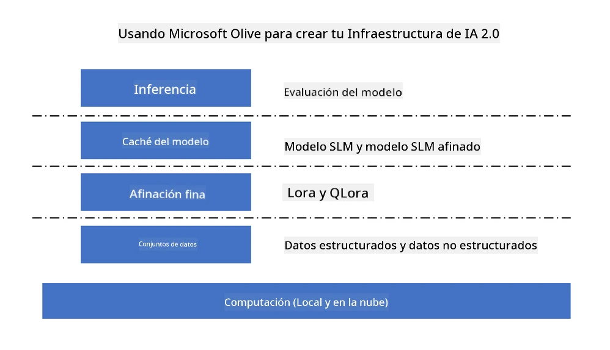

<!--
CO_OP_TRANSLATOR_METADATA:
{
  "original_hash": "5764be88ad2eb4f341e742eb8f14fab1",
  "translation_date": "2025-07-17T06:37:52+00:00",
  "source_file": "md/03.FineTuning/FineTuning_MicrosoftOlive.md",
  "language_code": "es"
}
-->
# **Ajuste fino de Phi-3 con Microsoft Olive**

[Olive](https://github.com/microsoft/OLive?WT.mc_id=aiml-138114-kinfeylo) es una herramienta de optimización de modelos consciente del hardware, fácil de usar, que reúne técnicas líderes en la industria en compresión, optimización y compilación de modelos.

Está diseñada para simplificar el proceso de optimización de modelos de aprendizaje automático, asegurando que aprovechen al máximo arquitecturas de hardware específicas.

Ya sea que trabajes en aplicaciones en la nube o en dispositivos edge, Olive te permite optimizar tus modelos de manera sencilla y efectiva.

## Características principales:
- Olive agrega y automatiza técnicas de optimización para los objetivos de hardware deseados.
- No existe una técnica de optimización única para todos los escenarios, por lo que Olive permite la extensibilidad al habilitar que expertos de la industria integren sus innovaciones en optimización.

## Reduce el esfuerzo de ingeniería:
- Los desarrolladores a menudo necesitan aprender y utilizar múltiples cadenas de herramientas específicas de proveedores de hardware para preparar y optimizar modelos entrenados para su despliegue.
- Olive simplifica esta experiencia automatizando las técnicas de optimización para el hardware deseado.

## Solución de optimización E2E lista para usar:

Al combinar y ajustar técnicas integradas, Olive ofrece una solución unificada para la optimización de extremo a extremo.
Tiene en cuenta restricciones como precisión y latencia mientras optimiza los modelos.

## Uso de Microsoft Olive para ajuste fino

Microsoft Olive es una herramienta de optimización de modelos de código abierto muy fácil de usar que puede cubrir tanto el ajuste fino como la referencia en el campo de la inteligencia artificial generativa. Solo requiere una configuración sencilla, combinada con el uso de modelos de lenguaje pequeños de código abierto y entornos de ejecución relacionados (AzureML / GPU local, CPU, DirectML), puedes completar el ajuste fino o la referencia del modelo mediante optimización automática, y encontrar el mejor modelo para desplegar en la nube o en dispositivos edge. Permite a las empresas construir sus propios modelos verticales industriales tanto on-premises como en la nube.



## Ajuste fino de Phi-3 con Microsoft Olive


## Código de ejemplo y muestra de Phi-3 Olive
En este ejemplo usarás Olive para:

- Ajustar fino un adaptador LoRA para clasificar frases en Tristeza, Alegría, Miedo, Sorpresa.
- Fusionar los pesos del adaptador en el modelo base.
- Optimizar y cuantizar el modelo a int4.

[Sample Code](../../code/03.Finetuning/olive-ort-example/README.md)

### Configurar Microsoft Olive

La instalación de Microsoft Olive es muy sencilla, y también puede instalarse para CPU, GPU, DirectML y Azure ML

```bash
pip install olive-ai
```

Si deseas ejecutar un modelo ONNX con CPU, puedes usar

```bash
pip install olive-ai[cpu]
```

Si quieres ejecutar un modelo ONNX con GPU, puedes usar

```python
pip install olive-ai[gpu]
```

Si quieres usar Azure ML, usa

```python
pip install git+https://github.com/microsoft/Olive#egg=olive-ai[azureml]
```

**Aviso**  
Requisito del SO: Ubuntu 20.04 / 22.04

### **Config.json de Microsoft Olive**

Después de la instalación, puedes configurar diferentes ajustes específicos del modelo a través del archivo Config, incluyendo datos, computación, entrenamiento, despliegue y generación de modelos.

**1. Datos**

En Microsoft Olive, se puede entrenar con datos locales y en la nube, y esto puede configurarse en los ajustes.

*Configuración de datos locales*

Puedes configurar fácilmente el conjunto de datos que se necesita para el ajuste fino, usualmente en formato json, y adaptarlo con la plantilla de datos. Esto debe ajustarse según los requisitos del modelo (por ejemplo, adaptarlo al formato requerido por Microsoft Phi-3-mini. Si tienes otros modelos, consulta los formatos de ajuste fino requeridos para procesarlos)

```json

    "data_configs": [
        {
            "name": "dataset_default_train",
            "type": "HuggingfaceContainer",
            "load_dataset_config": {
                "params": {
                    "data_name": "json", 
                    "data_files":"dataset/dataset-classification.json",
                    "split": "train"
                }
            },
            "pre_process_data_config": {
                "params": {
                    "dataset_type": "corpus",
                    "text_cols": [
                            "phrase",
                            "tone"
                    ],
                    "text_template": "### Text: {phrase}\n### The tone is:\n{tone}",
                    "corpus_strategy": "join",
                    "source_max_len": 2048,
                    "pad_to_max_len": false,
                    "use_attention_mask": false
                }
            }
        }
    ],
```

**Configuración de fuente de datos en la nube**

Al vincular el datastore de Azure AI Studio/Azure Machine Learning Service para enlazar los datos en la nube, puedes elegir introducir diferentes fuentes de datos a Azure AI Studio/Azure Machine Learning Service a través de Microsoft Fabric y Azure Data como soporte para el ajuste fino de los datos.

```json

    "data_configs": [
        {
            "name": "dataset_default_train",
            "type": "HuggingfaceContainer",
            "load_dataset_config": {
                "params": {
                    "data_name": "json", 
                    "data_files": {
                        "type": "azureml_datastore",
                        "config": {
                            "azureml_client": {
                                "subscription_id": "Your Azure Subscrition ID",
                                "resource_group": "Your Azure Resource Group",
                                "workspace_name": "Your Azure ML Workspaces name"
                            },
                            "datastore_name": "workspaceblobstore",
                            "relative_path": "Your train_data.json Azure ML Location"
                        }
                    },
                    "split": "train"
                }
            },
            "pre_process_data_config": {
                "params": {
                    "dataset_type": "corpus",
                    "text_cols": [
                            "Question",
                            "Best Answer"
                    ],
                    "text_template": "<|user|>\n{Question}<|end|>\n<|assistant|>\n{Best Answer}\n<|end|>",
                    "corpus_strategy": "join",
                    "source_max_len": 2048,
                    "pad_to_max_len": false,
                    "use_attention_mask": false
                }
            }
        }
    ],
    
```

**2. Configuración de computación**

Si necesitas trabajar localmente, puedes usar directamente recursos de datos locales. Si necesitas usar recursos de Azure AI Studio / Azure Machine Learning Service, debes configurar los parámetros relevantes de Azure, nombre de la potencia de cómputo, etc.

```json

    "systems": {
        "aml": {
            "type": "AzureML",
            "config": {
                "accelerators": ["gpu"],
                "hf_token": true,
                "aml_compute": "Your Azure AI Studio / Azure Machine Learning Service Compute Name",
                "aml_docker_config": {
                    "base_image": "Your Azure AI Studio / Azure Machine Learning Service docker",
                    "conda_file_path": "conda.yaml"
                }
            }
        },
        "azure_arc": {
            "type": "AzureML",
            "config": {
                "accelerators": ["gpu"],
                "aml_compute": "Your Azure AI Studio / Azure Machine Learning Service Compute Name",
                "aml_docker_config": {
                    "base_image": "Your Azure AI Studio / Azure Machine Learning Service docker",
                    "conda_file_path": "conda.yaml"
                }
            }
        }
    },
```

***Aviso***

Como se ejecuta a través de un contenedor en Azure AI Studio/Azure Machine Learning Service, es necesario configurar el entorno requerido. Esto se configura en el entorno conda.yaml.

```yaml

name: project_environment
channels:
  - defaults
dependencies:
  - python=3.8.13
  - pip=22.3.1
  - pip:
      - einops
      - accelerate
      - azure-keyvault-secrets
      - azure-identity
      - bitsandbytes
      - datasets
      - huggingface_hub
      - peft
      - scipy
      - sentencepiece
      - torch>=2.2.0
      - transformers
      - git+https://github.com/microsoft/Olive@jiapli/mlflow_loading_fix#egg=olive-ai[gpu]
      - --extra-index-url https://aiinfra.pkgs.visualstudio.com/PublicPackages/_packaging/ORT-Nightly/pypi/simple/ 
      - ort-nightly-gpu==1.18.0.dev20240307004
      - --extra-index-url https://aiinfra.pkgs.visualstudio.com/PublicPackages/_packaging/onnxruntime-genai/pypi/simple/
      - onnxruntime-genai-cuda

    

```

**3. Elige tu SLM**

Puedes usar el modelo directamente desde Hugging Face, o combinarlo directamente con el Catálogo de Modelos de Azure AI Studio / Azure Machine Learning para seleccionar el modelo a usar. En el ejemplo de código a continuación usaremos Microsoft Phi-3-mini como ejemplo.

Si tienes el modelo localmente, puedes usar este método

```json

    "input_model":{
        "type": "PyTorchModel",
        "config": {
            "hf_config": {
                "model_name": "model-cache/microsoft/phi-3-mini",
                "task": "text-generation",
                "model_loading_args": {
                    "trust_remote_code": true
                }
            }
        }
    },
```

Si quieres usar un modelo de Azure AI Studio / Azure Machine Learning Service, puedes usar este método

```json

    "input_model":{
        "type": "PyTorchModel",
        "config": {
            "model_path": {
                "type": "azureml_registry_model",
                "config": {
                    "name": "microsoft/Phi-3-mini-4k-instruct",
                    "registry_name": "azureml-msr",
                    "version": "11"
                }
            },
             "model_file_format": "PyTorch.MLflow",
             "hf_config": {
                "model_name": "microsoft/Phi-3-mini-4k-instruct",
                "task": "text-generation",
                "from_pretrained_args": {
                    "trust_remote_code": true
                }
            }
        }
    },
```

**Aviso:**  
Necesitamos integrarnos con Azure AI Studio / Azure Machine Learning Service, así que al configurar el modelo, consulta el número de versión y los nombres relacionados.

Todos los modelos en Azure deben configurarse como PyTorch.MLflow

Necesitas tener una cuenta de Hugging Face y vincular la clave al valor Key de Azure AI Studio / Azure Machine Learning

**4. Algoritmo**

Microsoft Olive encapsula muy bien los algoritmos de ajuste fino Lora y QLora. Solo necesitas configurar algunos parámetros relevantes. Aquí tomo QLora como ejemplo.

```json
        "lora": {
            "type": "LoRA",
            "config": {
                "target_modules": [
                    "o_proj",
                    "qkv_proj"
                ],
                "double_quant": true,
                "lora_r": 64,
                "lora_alpha": 64,
                "lora_dropout": 0.1,
                "train_data_config": "dataset_default_train",
                "eval_dataset_size": 0.3,
                "training_args": {
                    "seed": 0,
                    "data_seed": 42,
                    "per_device_train_batch_size": 1,
                    "per_device_eval_batch_size": 1,
                    "gradient_accumulation_steps": 4,
                    "gradient_checkpointing": false,
                    "learning_rate": 0.0001,
                    "num_train_epochs": 3,
                    "max_steps": 10,
                    "logging_steps": 10,
                    "evaluation_strategy": "steps",
                    "eval_steps": 187,
                    "group_by_length": true,
                    "adam_beta2": 0.999,
                    "max_grad_norm": 0.3
                }
            }
        },
```

Si quieres conversión de cuantización, la rama principal de Microsoft Olive ya soporta el método onnxruntime-genai. Puedes configurarlo según tus necesidades:

1. fusionar los pesos del adaptador en el modelo base  
2. convertir el modelo a modelo onnx con la precisión requerida mediante ModelBuilder

como por ejemplo convertir a INT4 cuantizado

```json

        "merge_adapter_weights": {
            "type": "MergeAdapterWeights"
        },
        "builder": {
            "type": "ModelBuilder",
            "config": {
                "precision": "int4"
            }
        }
```

**Aviso**  
- Si usas QLoRA, la conversión de cuantización de ONNXRuntime-genai no está soportada por el momento.

- Cabe señalar que puedes configurar los pasos anteriores según tus propias necesidades. No es necesario configurar completamente todos estos pasos. Dependiendo de tus requerimientos, puedes usar directamente los pasos del algoritmo sin ajuste fino. Finalmente, necesitas configurar los motores relevantes.

```json

    "engine": {
        "log_severity_level": 0,
        "host": "aml",
        "target": "aml",
        "search_strategy": false,
        "execution_providers": ["CUDAExecutionProvider"],
        "cache_dir": "../model-cache/models/phi3-finetuned/cache",
        "output_dir" : "../model-cache/models/phi3-finetuned"
    }
```

**5. Ajuste fino finalizado**

En la línea de comandos, ejecuta en el directorio de olive-config.json

```bash
olive run --config olive-config.json  
```

**Aviso legal**:  
Este documento ha sido traducido utilizando el servicio de traducción automática [Co-op Translator](https://github.com/Azure/co-op-translator). Aunque nos esforzamos por la precisión, tenga en cuenta que las traducciones automáticas pueden contener errores o inexactitudes. El documento original en su idioma nativo debe considerarse la fuente autorizada. Para información crítica, se recomienda la traducción profesional realizada por humanos. No nos hacemos responsables de malentendidos o interpretaciones erróneas derivadas del uso de esta traducción.