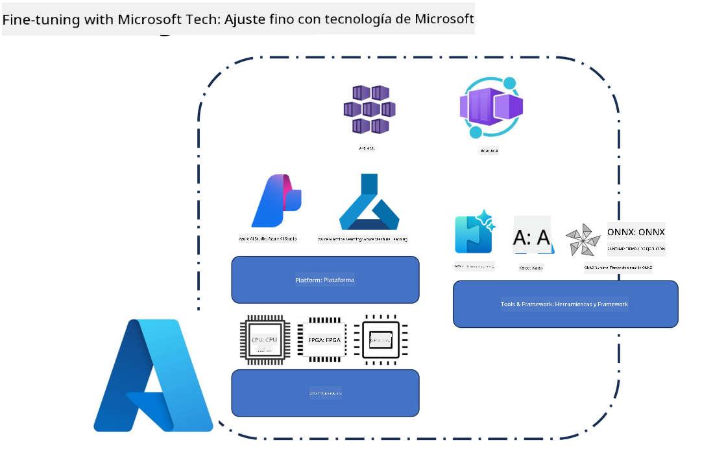
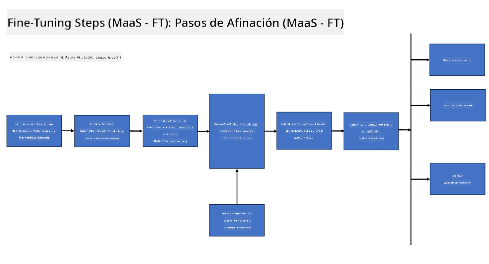
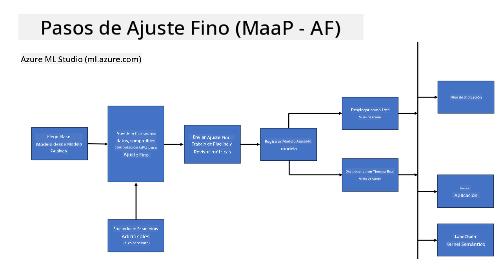
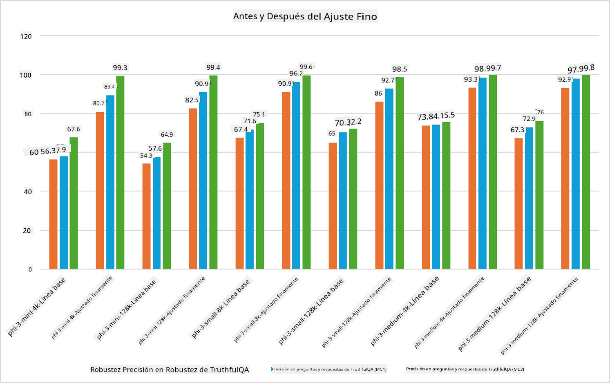

<!--
CO_OP_TRANSLATOR_METADATA:
{
  "original_hash": "cb5648935f63edc17e95ce38f23adc32",
  "translation_date": "2025-05-07T10:21:54+00:00",
  "source_file": "md/03.FineTuning/FineTuning_Scenarios.md",
  "language_code": "es"
}
-->
## Escenarios de Afinación Fina

**Plataforma** Esto incluye varias tecnologías como Azure AI Foundry, Azure Machine Learning, AI Tools, Kaito y ONNX Runtime.

**Infraestructura** Esto incluye la CPU y FPGA, que son esenciales para el proceso de afinación fina. Permíteme mostrarte los íconos de cada una de estas tecnologías.

**Herramientas y Framework** Esto incluye ONNX Runtime y ONNX Runtime. Permíteme mostrarte los íconos de cada una de estas tecnologías.  
[Insertar íconos para ONNX Runtime y ONNX Runtime]

El proceso de afinación fina con tecnologías de Microsoft involucra varios componentes y herramientas. Al comprender y utilizar estas tecnologías, podemos afinar eficazmente nuestras aplicaciones y crear mejores soluciones.

## Modelo como Servicio

Afina el modelo usando afinación fina hospedada, sin necesidad de crear y administrar cómputo.

La afinación fina sin servidor está disponible para los modelos Phi-3-mini y Phi-3-medium, permitiendo a los desarrolladores personalizar rápida y fácilmente los modelos para escenarios en la nube y en el borde sin tener que gestionar cómputo. También hemos anunciado que Phi-3-small ya está disponible a través de nuestra oferta Models-as-a-Service, para que los desarrolladores puedan comenzar rápidamente con el desarrollo de IA sin tener que administrar la infraestructura subyacente.

## Modelo como Plataforma

Los usuarios gestionan su propio cómputo para afinar sus modelos.

[Fine Tuning Sample](https://github.com/Azure/azureml-examples/blob/main/sdk/python/foundation-models/system/finetune/chat-completion/chat-completion.ipynb)

## Escenarios de Afinación Fina

| | | | | | | |
|-|-|-|-|-|-|-|
|Escenario|LoRA|QLoRA|PEFT|DeepSpeed|ZeRO|DORA|
|Adaptar LLMs preentrenados a tareas o dominios específicos|Sí|Sí|Sí|Sí|Sí|Sí|
|Afinación para tareas de PLN como clasificación de texto, reconocimiento de entidades nombradas y traducción automática|Sí|Sí|Sí|Sí|Sí|Sí|
|Afinación para tareas de QA|Sí|Sí|Sí|Sí|Sí|Sí|
|Afinación para generar respuestas similares a las humanas en chatbots|Sí|Sí|Sí|Sí|Sí|Sí|
|Afinación para generar música, arte u otras formas de creatividad|Sí|Sí|Sí|Sí|Sí|Sí|
|Reducir costos computacionales y financieros|Sí|Sí|No|Sí|Sí|No|
|Reducir uso de memoria|No|Sí|No|Sí|Sí|Sí|
|Usar menos parámetros para una afinación eficiente|No|Sí|Sí|No|No|Sí|
|Forma eficiente en memoria de paralelismo de datos que da acceso a la memoria GPU agregada de todos los dispositivos GPU disponibles|No|No|No|Sí|Sí|Sí|

## Ejemplos de Rendimiento en Afinación Fina

**Aviso Legal**:  
Este documento ha sido traducido utilizando el servicio de traducción automática [Co-op Translator](https://github.com/Azure/co-op-translator). Aunque nos esforzamos por la precisión, tenga en cuenta que las traducciones automáticas pueden contener errores o inexactitudes. El documento original en su idioma nativo debe considerarse la fuente autorizada. Para información crítica, se recomienda una traducción profesional realizada por humanos. No nos hacemos responsables por malentendidos o interpretaciones erróneas derivadas del uso de esta traducción.