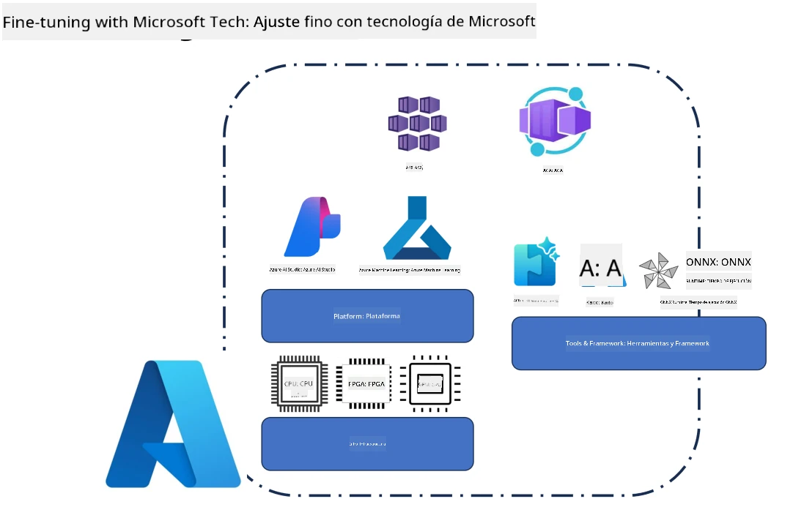
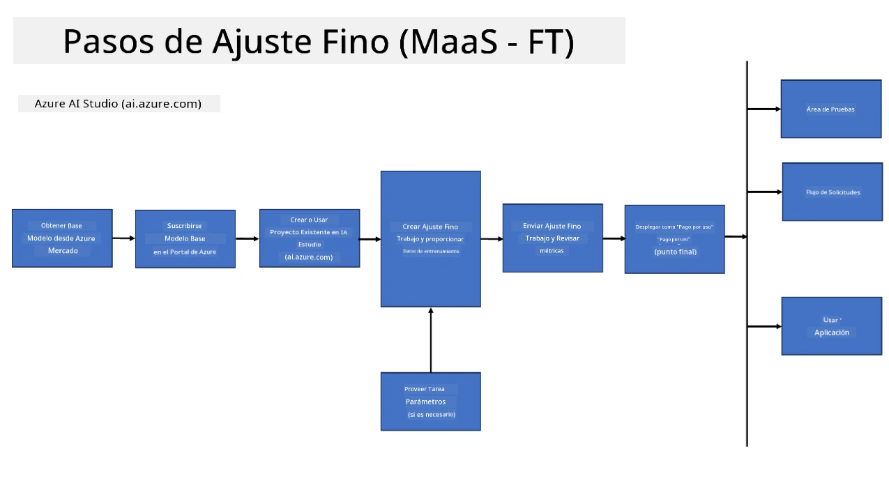
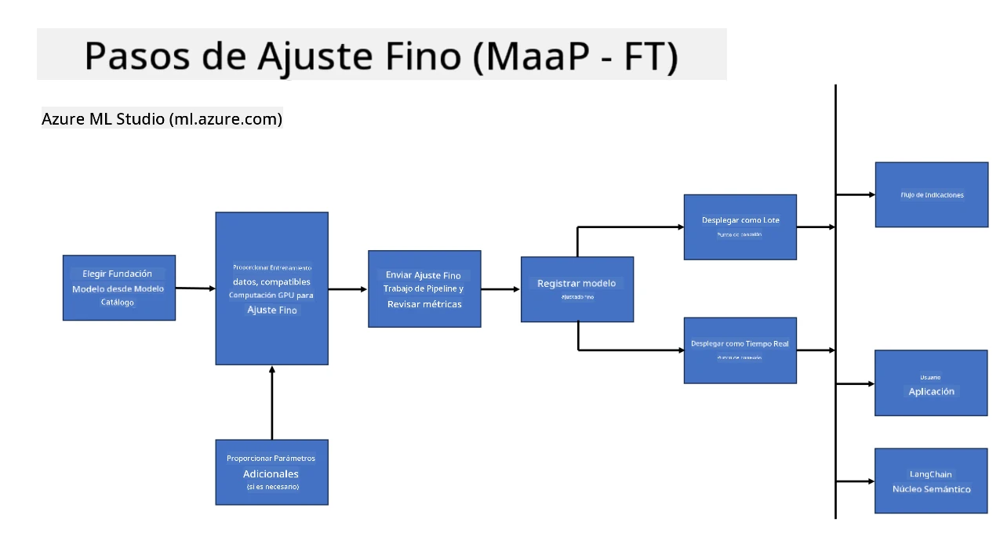
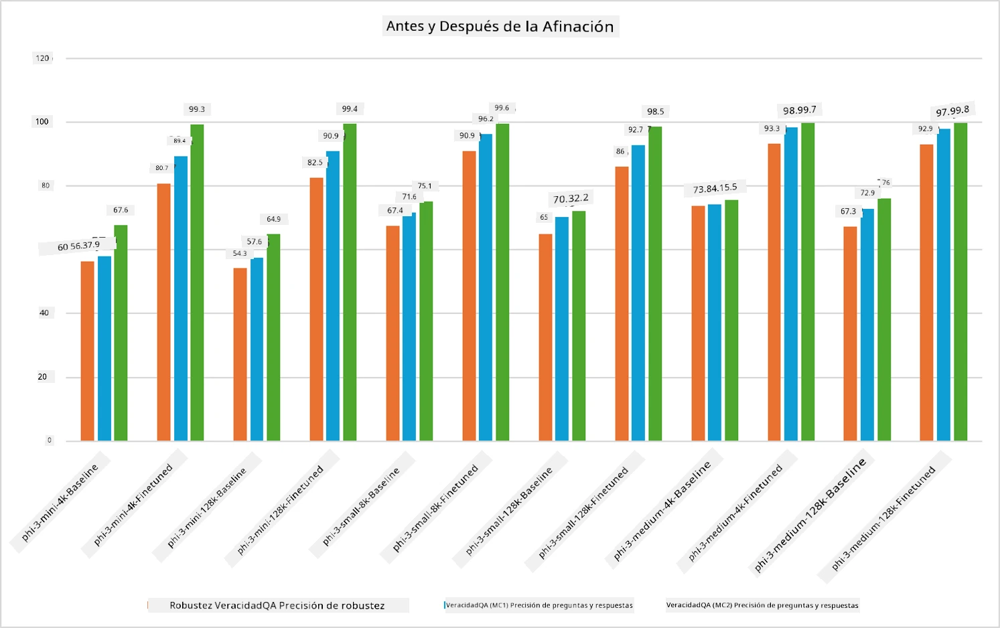

## Escenarios de Ajuste Fino

Esta sección proporciona una visión general de los escenarios de ajuste fino en entornos de Microsoft Foundry y Azure, incluyendo modelos de despliegue, capas de infraestructura y técnicas de optimización comúnmente usadas.

**Plataforma**  
Esto incluye servicios gestionados como Microsoft Foundry (anteriormente Azure AI Foundry) y Azure Machine Learning, que proporcionan gestión de modelos, orquestación, seguimiento de experimentos y flujos de trabajo de despliegue.

**Infraestructura**  
El ajuste fino requiere recursos de computación escalables. En entornos Azure, esto normalmente incluye máquinas virtuales basadas en GPU y recursos de CPU para cargas de trabajo ligeras, junto con almacenamiento escalable para conjuntos de datos y puntos de control.

**Herramientas y Framework**  
Los flujos de trabajo de ajuste fino comúnmente dependen de frameworks y bibliotecas de optimización como Hugging Face Transformers, DeepSpeed y PEFT (Ajuste fino eficiente en parámetros).

El proceso de ajuste fino con tecnologías de Microsoft abarca servicios de plataforma, infraestructura de computación y frameworks de entrenamiento. Al entender cómo estos componentes trabajan juntos, los desarrolladores pueden adaptar eficazmente los modelos base a tareas específicas y escenarios de producción.

## Modelo como Servicio

Ajusta fino el modelo usando ajuste fino alojado, sin necesidad de crear y gestionar computación.

El ajuste fino sin servidor está ahora disponible para las familias de modelos Phi-3, Phi-3.5 y Phi-4, permitiendo a los desarrolladores personalizar rápida y fácilmente los modelos para escenarios en la nube y en el edge sin tener que organizar recursos computacionales.

## Modelo como Plataforma 

Los usuarios gestionan su propia computación para ajustar fino sus modelos.

[Ejemplo de Ajuste Fino](https://github.com/Azure/azureml-examples/blob/main/sdk/python/foundation-models/system/finetune/chat-completion/chat-completion.ipynb)

## Comparación de Técnicas de Ajuste Fino

|Escenario|LoRA|QLoRA|PEFT|DeepSpeed|ZeRO|DoRA|
|---|---|---|---|---|---|---|
|Adaptar LLMs preentrenados a tareas o dominios específicos|Sí|Sí|Sí|Sí|Sí|Sí|
|Ajuste fino para tareas de PLN como clasificación de texto, reconocimiento de entidades nombradas y traducción automática|Sí|Sí|Sí|Sí|Sí|Sí|
|Ajuste fino para tareas de QA|Sí|Sí|Sí|Sí|Sí|Sí|
|Ajuste fino para generar respuestas similares a humanas en chatbots|Sí|Sí|Sí|Sí|Sí|Sí|
|Ajuste fino para generar música, arte u otras formas de creatividad|Sí|Sí|Sí|Sí|Sí|Sí|
|Reducir costos computacionales y financieros|Sí|Sí|Sí|Sí|Sí|Sí|
|Reducir uso de memoria|Sí|Sí|Sí|Sí|Sí|Sí|
|Usar menos parámetros para un ajuste fino eficiente|Sí|Sí|Sí|No|No|Sí|
|Forma eficiente en memoria de paralelismo de datos que da acceso a la memoria agregada de GPU de todos los dispositivos GPU disponibles|No|No|No|Sí|Sí|No|

> [!NOTE]
> LoRA, QLoRA, PEFT y DoRA son métodos de ajuste fino eficientes en parámetros, mientras que DeepSpeed y ZeRO se enfocan en entrenamiento distribuido y optimización de memoria.

## Ejemplos de Rendimiento de Ajuste Fino

---

<!-- CO-OP TRANSLATOR DISCLAIMER START -->
**Aviso Legal**:
Este documento ha sido traducido utilizando el servicio de traducción automática [Co-op Translator](https://github.com/Azure/co-op-translator). Aunque nos esforzamos por la precisión, tenga en cuenta que las traducciones automáticas pueden contener errores o inexactitudes. El documento original en su idioma original debe considerarse la fuente autorizada. Para información crítica, se recomienda una traducción profesional realizada por humanos. No nos hacemos responsables de malentendidos o interpretaciones erróneas derivadas del uso de esta traducción.
<!-- CO-OP TRANSLATOR DISCLAIMER END -->