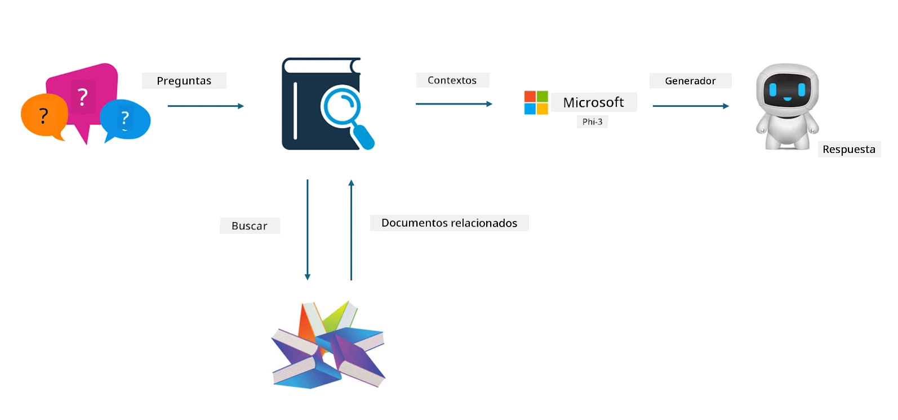

## Ajuste fino vs RAG

## Generación aumentada por recuperación

RAG es recuperación de datos + generación de texto. Los datos estructurados y no estructurados de la empresa se almacenan en la base de datos vectorial. Al buscar contenido relevante, se encuentra el resumen y contenido pertinente para formar un contexto, y se combina con la capacidad de completado de texto de LLM/SLM para generar contenido.

## Proceso RAG

## Ajuste fino
El ajuste fino se basa en la mejora de un modelo específico. No es necesario partir del algoritmo del modelo, pero sí se requiere acumular datos de forma continua. Si buscas terminología y expresiones lingüísticas más precisas para aplicaciones industriales, el ajuste fino es la mejor opción. Sin embargo, si tus datos cambian con frecuencia, el ajuste fino puede volverse complicado.

## Cómo elegir
Si nuestra respuesta requiere la incorporación de datos externos, RAG es la mejor opción.

Si necesitas ofrecer conocimientos industriales estables y precisos, el ajuste fino será una buena elección. RAG prioriza extraer contenido relevante, pero puede que no siempre capture las sutilezas especializadas.

El ajuste fino requiere un conjunto de datos de alta calidad, y si solo se cuenta con un rango pequeño de datos, no marcará mucha diferencia. RAG es más flexible.  
El ajuste fino es una caja negra, una especie de metafísica, y es difícil entender su mecanismo interno. Pero RAG facilita encontrar la fuente de los datos, lo que permite ajustar eficazmente las alucinaciones o errores de contenido y ofrece mejor transparencia.

**Aviso legal**:  
Este documento ha sido traducido utilizando el servicio de traducción automática [Co-op Translator](https://github.com/Azure/co-op-translator). Aunque nos esforzamos por la precisión, tenga en cuenta que las traducciones automáticas pueden contener errores o inexactitudes. El documento original en su idioma nativo debe considerarse la fuente autorizada. Para información crítica, se recomienda la traducción profesional realizada por humanos. No nos hacemos responsables de malentendidos o interpretaciones erróneas derivadas del uso de esta traducción.