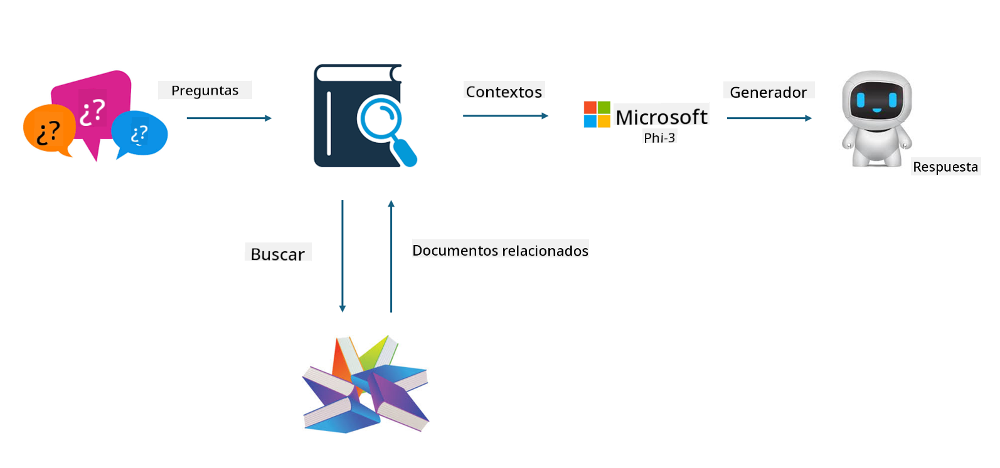

<!--
CO_OP_TRANSLATOR_METADATA:
{
  "original_hash": "e4e010400c2918557b36bb932a14004c",
  "translation_date": "2025-05-07T10:27:39+00:00",
  "source_file": "md/03.FineTuning/FineTuning_vs_RAG.md",
  "language_code": "es"
}
-->
## Ajuste fino vs RAG

## Generación aumentada por recuperación

RAG es recuperación de datos + generación de texto. Los datos estructurados y no estructurados de la empresa se almacenan en la base de datos vectorial. Al buscar contenido relevante, se encuentra el resumen y contenido pertinente para formar un contexto, y se combina con la capacidad de completado de texto de LLM/SLM para generar contenido.

## Proceso RAG

## Ajuste fino
El ajuste fino se basa en la mejora de un modelo determinado. No es necesario partir del algoritmo del modelo, pero se debe acumular datos de forma continua. Si deseas terminología y expresiones más precisas en aplicaciones industriales, el ajuste fino es tu mejor opción. Pero si tus datos cambian con frecuencia, el ajuste fino puede volverse complicado.

## Cómo elegir
Si nuestra respuesta requiere la incorporación de datos externos, RAG es la mejor opción.

Si necesitas generar conocimiento industrial estable y preciso, el ajuste fino será una buena elección. RAG prioriza extraer contenido relevante, pero puede no captar siempre las sutilezas especializadas.

El ajuste fino requiere un conjunto de datos de alta calidad, y si se trata solo de un rango pequeño de datos, no hará mucha diferencia. RAG es más flexible.  
El ajuste fino es una caja negra, una especie de metafísica, y es difícil entender su mecanismo interno. Pero RAG facilita encontrar la fuente de los datos, lo que permite ajustar de manera efectiva las alucinaciones o errores en el contenido y ofrece mejor transparencia.

**Aviso Legal**:  
Este documento ha sido traducido utilizando el servicio de traducción automática [Co-op Translator](https://github.com/Azure/co-op-translator). Aunque nos esforzamos por la precisión, tenga en cuenta que las traducciones automáticas pueden contener errores o inexactitudes. El documento original en su idioma nativo debe considerarse la fuente autorizada. Para información crítica, se recomienda la traducción profesional realizada por un humano. No nos responsabilizamos por malentendidos o interpretaciones erróneas que puedan surgir del uso de esta traducción.