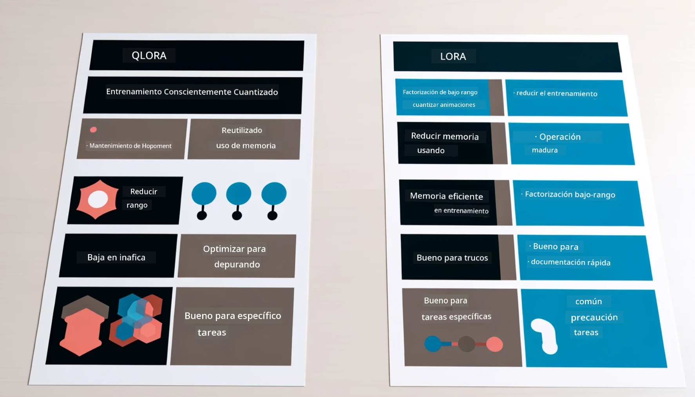

# **Deja que Phi-3 se convierta en un experto de la industria**

Para aplicar el modelo Phi-3 en una industria, necesitas agregar datos empresariales específicos de esa industria al modelo Phi-3. Tenemos dos opciones diferentes: la primera es RAG (Generación Aumentada por Recuperación) y la segunda es Fine Tuning (Ajuste fino).

## **RAG vs Fine-Tuning**

### **Generación Aumentada por Recuperación**

RAG es recuperación de datos + generación de texto. Los datos estructurados y no estructurados de la empresa se almacenan en una base de datos vectorial. Al buscar contenido relevante, se encuentra el resumen y contenido pertinente para formar un contexto, y se combina con la capacidad de completado de texto de LLM/SLM para generar contenido.

### **Fine-tuning**

Fine-tuning se basa en la mejora de un modelo específico. No es necesario partir del algoritmo del modelo, pero sí se requiere acumular datos de forma continua. Si quieres terminología y expresiones más precisas en aplicaciones industriales, fine-tuning es tu mejor opción. Pero si tus datos cambian con frecuencia, el fine-tuning puede volverse complicado.

### **Cómo elegir**

1. Si nuestra respuesta requiere la incorporación de datos externos, RAG es la mejor opción.

2. Si necesitas entregar conocimiento industrial estable y preciso, fine-tuning será una buena elección. RAG prioriza extraer contenido relevante, pero puede que no siempre capture los matices especializados.

3. Fine-tuning requiere un conjunto de datos de alta calidad, y si solo se cuenta con un rango pequeño de datos, no hará mucha diferencia. RAG es más flexible.

4. Fine-tuning es una caja negra, una especie de metafísica, y es difícil entender su mecanismo interno. Pero RAG facilita encontrar la fuente de los datos, lo que ayuda a ajustar alucinaciones o errores de contenido y ofrece mejor transparencia.

### **Escenarios**

1. Industrias verticales que requieren vocabulario y expresiones profesionales específicas, ***Fine-tuning*** será la mejor opción.

2. Sistemas de preguntas y respuestas que involucran la síntesis de diferentes puntos de conocimiento, ***RAG*** será la mejor opción.

3. La combinación de flujo de negocio automatizado ***RAG + Fine-tuning*** es la mejor opción.

## **Cómo usar RAG**

Una base de datos vectorial es una colección de datos almacenados en forma matemática. Las bases de datos vectoriales facilitan que los modelos de aprendizaje automático recuerden entradas previas, permitiendo usar machine learning para casos de uso como búsqueda, recomendaciones y generación de texto. Los datos pueden identificarse basándose en métricas de similitud en lugar de coincidencias exactas, lo que permite a los modelos computacionales entender el contexto de los datos.

La base de datos vectorial es clave para implementar RAG. Podemos convertir datos en almacenamiento vectorial mediante modelos vectoriales como text-embedding-3, jina-ai-embedding, etc.

Aprende más sobre cómo crear aplicaciones RAG en [https://github.com/microsoft/Phi-3CookBook](https://github.com/microsoft/Phi-3CookBook?WT.mc_id=aiml-138114-kinfeylo)

## **Cómo usar Fine-tuning**

Los algoritmos comúnmente usados en Fine-tuning son Lora y QLora. ¿Cómo elegir?
- [Aprende más con este notebook de ejemplo](../../../../code/04.Finetuning/Phi_3_Inference_Finetuning.ipynb)
- [Ejemplo de FineTuning en Python](../../../../code/04.Finetuning/FineTrainingScript.py)

### **Lora y QLora**

LoRA (Low-Rank Adaptation) y QLoRA (Quantized Low-Rank Adaptation) son técnicas usadas para ajustar finamente grandes modelos de lenguaje (LLMs) mediante Parameter Efficient Fine Tuning (PEFT). Las técnicas PEFT están diseñadas para entrenar modelos de manera más eficiente que los métodos tradicionales.  
LoRA es una técnica de fine-tuning independiente que reduce el uso de memoria aplicando una aproximación de bajo rango a la matriz de actualización de pesos. Ofrece tiempos de entrenamiento rápidos y mantiene un rendimiento cercano al de los métodos tradicionales de fine-tuning.

QLoRA es una versión extendida de LoRA que incorpora técnicas de cuantización para reducir aún más el uso de memoria. QLoRA cuantiza la precisión de los parámetros de peso en el LLM preentrenado a precisión de 4 bits, lo que es más eficiente en memoria que LoRA. Sin embargo, el entrenamiento con QLoRA es aproximadamente un 30% más lento que con LoRA debido a los pasos adicionales de cuantización y des-cuantización.

QLoRA usa LoRA como complemento para corregir los errores introducidos durante la cuantización. QLoRA permite el fine-tuning de modelos masivos con miles de millones de parámetros en GPUs relativamente pequeñas y disponibles. Por ejemplo, QLoRA puede ajustar un modelo de 70B parámetros que normalmente requeriría 36 GPUs con solo 2 GPUs.

**Aviso legal**:  
Este documento ha sido traducido utilizando el servicio de traducción automática [Co-op Translator](https://github.com/Azure/co-op-translator). Aunque nos esforzamos por la precisión, tenga en cuenta que las traducciones automáticas pueden contener errores o inexactitudes. El documento original en su idioma nativo debe considerarse la fuente autorizada. Para información crítica, se recomienda la traducción profesional realizada por humanos. No nos hacemos responsables de malentendidos o interpretaciones erróneas derivadas del uso de esta traducción.