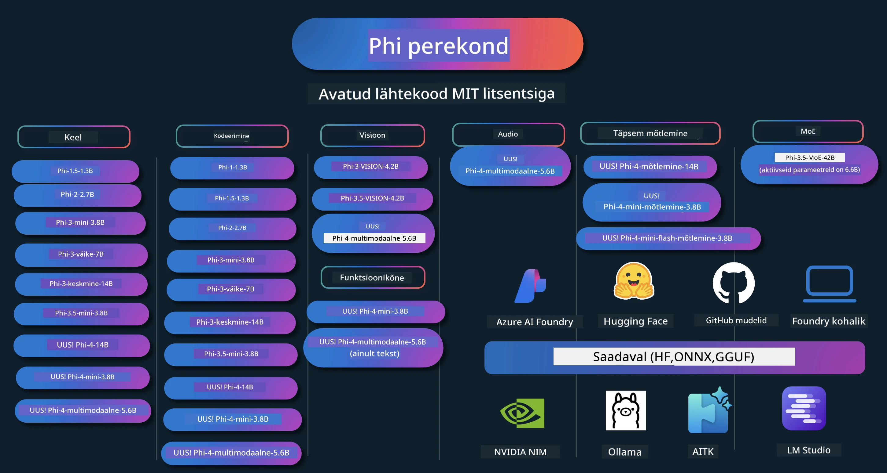

# Phi Kokkuraamat: Praktilised Näited Microsofti Phi Mudelitega

[](https://codespaces.new/microsoft/phicookbook)
[](https://vscode.dev/redirect?url=vscode://ms-vscode-remote.remote-containers/cloneInVolume?url=https://github.com/microsoft/phicookbook)

[](https://GitHub.com/microsoft/phicookbook/graphs/contributors/?WT.mc_id=aiml-137032-kinfeylo)
[](https://GitHub.com/microsoft/phicookbook/issues/?WT.mc_id=aiml-137032-kinfeylo)
[](https://GitHub.com/microsoft/phicookbook/pulls/?WT.mc_id=aiml-137032-kinfeylo)
[](http://makeapullrequest.com?WT.mc_id=aiml-137032-kinfeylo)

[](https://GitHub.com/microsoft/phicookbook/watchers/?WT.mc_id=aiml-137032-kinfeylo)
[](https://GitHub.com/microsoft/phicookbook/network/?WT.mc_id=aiml-137032-kinfeylo)
[](https://GitHub.com/microsoft/phicookbook/stargazers/?WT.mc_id=aiml-137032-kinfeylo)

[](https://discord.com/invite/ByRwuEEgH4)

Phi on Microsofti poolt arendatud avatud lähtekoodiga tehisintellekti mudelite sari.

Phi on praegu võimsaim ja kuluefektiivseim väikese keelemudeli (SLM) lahendus, millel on väga head tulemused mitmekeelses kasutuses, loogilises järeldamises, teksti/vestluse genereerimises, kodeerimises, piltide töötlemises, heli ja muudes stsenaariumites.

Saad panna Phi tööle kas pilves või ääreseadmetes ning lihtsalt luua generatiivseid tehisintellekti rakendusi piiratud arvutusvõimsusega.

Järgi neid samme, et alustada nende ressursside kasutamist:
1. **Forki hoidla**: Klõpsa [](https://GitHub.com/microsoft/phicookbook/network/?WT.mc_id=aiml-137032-kinfeylo)
2. **Klooni hoidla**: `git clone https://github.com/microsoft/PhiCookBook.git`
3. [**Liitu Microsoft AI Discord kogukonnaga ja kohtua ekspertide ning teiste arendajatega**](https://discord.com/invite/ByRwuEEgH4?WT.mc_id=aiml-137032-kinfeylo)



### 🌐 Mitmekeelsus

#### Toetatav GitHub Actioni kaudu (Automaatne & Alati uuendatud)

<!-- CO-OP TRANSLATOR LANGUAGES TABLE START -->
[Araabia](../ar/README.md) | [Bengali](../bn/README.md) | [Bulgaaria](../bg/README.md) | [Burma (Myanmar)](../my/README.md) | [Hiina (lihtsustatud)](../zh-CN/README.md) | [Hiina (traditsiooniline, Hongkong)](../zh-HK/README.md) | [Hiina (traditsiooniline, Macau)](../zh-MO/README.md) | [Hiina (traditsiooniline, Taiwan)](../zh-TW/README.md) | [Horvaadi](../hr/README.md) | [Tšehhi](../cs/README.md) | [Taani](../da/README.md) | [Hollandi](../nl/README.md) | [Eesti](./README.md) | [Soome](../fi/README.md) | [Prantsuse](../fr/README.md) | [Saksa](../de/README.md) | [Kreeka](../el/README.md) | [heebrea](../he/README.md) | [Hindi](../hi/README.md) | [Ungari](../hu/README.md) | [Indoneesia](../id/README.md) | [Itaalia](../it/README.md) | [Jaapani](../ja/README.md) | [Kannada](../kn/README.md) | [Korea](../ko/README.md) | [Leedu](../lt/README.md) | [Malai](../ms/README.md) | [Malajalami](../ml/README.md) | [Marathi](../mr/README.md) | [Nepali](../ne/README.md) | [Nigeeria pidgin](../pcm/README.md) | [Norra](../no/README.md) | [Pärsia (Farsi)](../fa/README.md) | [Poola](../pl/README.md) | [Portugali (Brasiilia)](../pt-BR/README.md) | [Portugali (Portugal)](../pt-PT/README.md) | [Pandžabi (Gurmukhi)](../pa/README.md) | [Rumeenia](../ro/README.md) | [Vene](../ru/README.md) | [Serbia (kirilitsas)](../sr/README.md) | [Slovaki](../sk/README.md) | [Sloveeni](../sl/README.md) | [Hispaania](../es/README.md) | [Suahiili](../sw/README.md) | [Rootsi](../sv/README.md) | [Tagalogi (Filipino)](../tl/README.md) | [Tamili](../ta/README.md) | [Telugu](../te/README.md) | [Tai](../th/README.md) | [Türgi](../tr/README.md) | [Ukraina](../uk/README.md) | [Urdu](../ur/README.md) | [Vietnami](../vi/README.md)

> **Eelistad kloonida lokaalselt?**

> See hoidla sisaldab üle 50 keele tõlkeid, mis suurendab oluliselt allalaadimismahtu. Tõlgeteta kloonimiseks kasuta sparse checkouti:
> ```bash
> git clone --filter=blob:none --sparse https://github.com/microsoft/PhiCookBook.git
> cd PhiCookBook
> git sparse-checkout set --no-cone '/*' '!translations' '!translated_images'
> ```
> See annab sulle kõik vajaliku kursuse läbimiseks kiirema allalaadimisega.
<!-- CO-OP TRANSLATOR LANGUAGES TABLE END -->

## Sisu

- Sissejuhatus
  - [Tere tulemast Phi perre](./md/01.Introduction/01/01.PhiFamily.md)
  - [Keskkonna seadistamine](./md/01.Introduction/01/01.EnvironmentSetup.md)
  - [Oluliste tehnoloogiate mõistmine](./md/01.Introduction/01/01.Understandingtech.md)
  - [Tehisintellekti ohutus Phi mudelite puhul](./md/01.Introduction/01/01.AISafety.md)
  - [Phi riistvaratugi](./md/01.Introduction/01/01.Hardwaresupport.md)
  - [Phi mudelid ja saadavus erinevatel platvormidel](./md/01.Introduction/01/01.Edgeandcloud.md)
  - [Guidance-ai ja Phi kasutamine](./md/01.Introduction/01/01.Guidance.md)
  - [GitHub Marketplace mudelid](https://github.com/marketplace/models)
  - [Azure AI mudelike kataloog](https://ai.azure.com)

- Phi inference erinevates keskkondades
    -  [Huggingface](./md/01.Introduction/02/01.HF.md)
    -  [GitHub mudelid](./md/01.Introduction/02/02.GitHubModel.md)
    -  [Azure AI Foundry mudelike kataloog](./md/01.Introduction/02/03.AzureAIFoundry.md)
    -  [Ollama](./md/01.Introduction/02/04.Ollama.md)
    -  [AI Toolkit VSCode (AITK)](./md/01.Introduction/02/05.AITK.md)
    -  [NVIDIA NIM](./md/01.Introduction/02/06.NVIDIA.md)
    -  [Foundry lokaalne](./md/01.Introduction/02/07.FoundryLocal.md)

- Phi perekonna inference
    - [Phi inference iOS-is](./md/01.Introduction/03/iOS_Inference.md)
    - [Phi inference Androidis](./md/01.Introduction/03/Android_Inference.md)
    - [Phi inference Jetsonis](./md/01.Introduction/03/Jetson_Inference.md)
    - [Phi inference AI PC-s](./md/01.Introduction/03/AIPC_Inference.md)
    - [Phi inference Apple MLX raamistikuga](./md/01.Introduction/03/MLX_Inference.md)
    - [Phi inference lokaalses serveris](./md/01.Introduction/03/Local_Server_Inference.md)
    - [Phi inference kaugserveris AI Toolkitiga](./md/01.Introduction/03/Remote_Interence.md)
    - [Phi inference Rustiga](./md/01.Introduction/03/Rust_Inference.md)
    - [Phi - Visioni lokaalne inference](./md/01.Introduction/03/Vision_Inference.md)
    - [Phi inference Kaito AKS-iga, Azure konteinerid (ametlik tugi)](./md/01.Introduction/03/Kaito_Inference.md)
-  [Phi perekonna kvantifitseerimine](./md/01.Introduction/04/QuantifyingPhi.md)
    - [Phi-3.5 / 4 kvantifitseerimine llama.cpp abil](./md/01.Introduction/04/UsingLlamacppQuantifyingPhi.md)
    - [Phi-3.5 / 4 kvantifitseerimine Generative AI laiendustega onnxruntime'le](./md/01.Introduction/04/UsingORTGenAIQuantifyingPhi.md)
    - [Phi-3.5 / 4 kvantifitseerimine Intel OpenVINO abil](./md/01.Introduction/04/UsingIntelOpenVINOQuantifyingPhi.md)
    - [Phi-3.5 / 4 kvantifitseerimine Apple MLX raamistikuga](./md/01.Introduction/04/UsingAppleMLXQuantifyingPhi.md)

- Phi hindamine
    - [Vastutustundlik tehisintellekt](./md/01.Introduction/05/ResponsibleAI.md)
    - [Azure AI Foundry hindamiseks](./md/01.Introduction/05/AIFoundry.md)
    - [Promptflow kasutamine hindamiseks](./md/01.Introduction/05/Promptflow.md)

- RAG Azure AI otsinguga
    - [Kuidas kasutada Phi-4-mini ja Phi-4-multimodal (RAG) Azure AI otsinguga](https://github.com/microsoft/PhiCookBook/blob/main/code/06.E2E/E2E_Phi-4-RAG-Azure-AI-Search.ipynb)

- Phi rakenduste arendamise näited
  - Teksti- ja vestlusrakendused
    - Phi-4 näited 🆕
      - [📓] [Vestlus Phi-4-mini ONNX mudeliga](./md/02.Application/01.TextAndChat/Phi4/ChatWithPhi4ONNX/README.md)
      - [Vestlus Phi-4 lokaalse ONNX mudeliga .NET](../../md/04.HOL/dotnet/src/LabsPhi4-Chat-01OnnxRuntime)
      - [Vestlus .NET konsoolirakenduses Phi-4 ONNX-ga kasutades Semantic Kernelit](../../md/04.HOL/dotnet/src/LabsPhi4-Chat-02SK)
    - Phi-3 / 3.5 näited
      - [Lokaalne chatbot brauseris kasutades Phi3, ONNX Runtime Web ja WebGPU](https://github.com/microsoft/onnxruntime-inference-examples/tree/main/js/chat)
      - [OpenVino vestlus](./md/02.Application/01.TextAndChat/Phi3/E2E_OpenVino_Chat.md)
      - [Multi mudel - interaktiivne Phi-3-mini ja OpenAI Whisper](./md/02.Application/01.TextAndChat/Phi3/E2E_Phi-3-mini_with_whisper.md)
      - [MLFlow - vormi loomine ja Phi-3 kasutamine MLFlow’ga](./md//02.Application/01.TextAndChat/Phi3/E2E_Phi-3-MLflow.md)
      - [Mudeliparandus - Kuidas optimeerida Phi-3-min mudelit ONNX Runtime Web jaoks Olive abil](https://github.com/microsoft/Olive/tree/main/examples/phi3)
      - [WinUI3 rakendus Phi-3 mini-4k-instruct-onnx abil](https://github.com/microsoft/Phi3-Chat-WinUI3-Sample/)
      -[WinUI3 Multi Mudel AI jõustatud Märkmete rakenduse näidis](https://github.com/microsoft/ai-powered-notes-winui3-sample)
      - [Kohandatud Phi-3 mudelite peenhäälestus ja integreerimine Prompt flow abil](./md/02.Application/01.TextAndChat/Phi3/E2E_Phi-3-FineTuning_PromptFlow_Integration.md)
      - [Kohandatud Phi-3 mudelite peenhäälestus ja integreerimine Prompt flow abil Azure AI Foundrys](./md/02.Application/01.TextAndChat/Phi3/E2E_Phi-3-FineTuning_PromptFlow_Integration_AIFoundry.md)
      - [Peenhäälestatud Phi-3 / Phi-3.5 mudeli hindamine Azure AI Foundrys, keskendudes Microsofti vastutustundliku AI põhimõtetele](./md/02.Application/01.TextAndChat/Phi3/E2E_Phi-3-Evaluation_AIFoundry.md)
      - [📓] [Phi-3.5-mini-instruct keele ennustamise näidis (hiina/inglise)](./md/02.Application/01.TextAndChat/Phi3/phi3-instruct-demo.ipynb)
      - [Phi-3.5-Instruct WebGPU RAG vestlusrobot](./md/02.Application/01.TextAndChat/Phi3/WebGPUWithPhi35Readme.md)
      - [Windows GPU kasutamine Prompt flow lahenduse loomiseks Phi-3.5-Instruct ONNX’iga](./md/02.Application/01.TextAndChat/Phi3/UsingPromptFlowWithONNX.md)
      - [Microsoft Phi-3.5 tflite kasutamine Androidi rakenduse loomiseks](./md/02.Application/01.TextAndChat/Phi3/UsingPhi35TFLiteCreateAndroidApp.md)
      - [Küsimuste ja vastuste .NET näidis, kus kasutatakse kohalikku ONNX Phi-3 mudelit Microsoft.ML.OnnxRuntime’iga](../../md/04.HOL/dotnet/src/LabsPhi301)
      - [Konsoolipõhine vestlusrakendus .NET Semantic Kerneliga ja Phi-3-ga](../../md/04.HOL/dotnet/src/LabsPhi302)

  - Azure AI järeldus SDK koodinäited 
    - Phi-4 näited 🆕
      - [📓] [Projekti koodi genereerimine Phi-4-multimodal abil](./md/02.Application/02.Code/Phi4/GenProjectCode/README.md)
    - Phi-3 / 3.5 näited
      - [Ehita oma Visual Studio Code GitHub Copilot Chat Microsoft Phi-3 perekonnaga](./md/02.Application/02.Code/Phi3/VSCodeExt/README.md)
      - [Loo oma Visual Studio Code Chat Copilot agent Phi-3.5 abil GitHub mudelitega](/md/02.Application/02.Code/Phi3/CreateVSCodeChatAgentWithGitHubModels.md)

  - Täiustatud järelduste näited
    - Phi-4 näited 🆕
      - [📓] [Phi-4-mini-järeldamine või Phi-4 järeldamise näited](./md/02.Application/03.AdvancedReasoning/Phi4/AdvancedResoningPhi4mini/README.md)
      - [📓] [Phi-4-mini-järeldamise peenhäälestus Microsoft Olive abil](./md/02.Application/03.AdvancedReasoning/Phi4/AdvancedResoningPhi4mini/olive_ft_phi_4_reasoning_with_medicaldata.ipynb)
      - [📓] [Phi-4-mini-järeldamise peenhäälestus Apple MLX abil](./md/02.Application/03.AdvancedReasoning/Phi4/AdvancedResoningPhi4mini/mlx_ft_phi_4_reasoning_with_medicaldata.ipynb)
      - [📓] [Phi-4-mini-järeldamine GitHub mudelitega](./md/02.Application/02.Code/Phi4r/github_models_inference.ipynb)
      - [📓] [Phi-4-mini-järeldamine Azure AI Foundry mudelitega](./md/02.Application/02.Code/Phi4r/azure_models_inference.ipynb)
  - Demo'd
      - [Phi-4-mini demo’d Hugging Face Spacest majutatud](https://huggingface.co/spaces/microsoft/phi-4-mini?WT.mc_id=aiml-137032-kinfeylo)
      - [Phi-4-multimodal demo’d Hugging Face Spacest majutatud](https://huggingface.co/spaces/microsoft/phi-4-multimodal?WT.mc_id=aiml-137032-kinfeylo)
  - Visiooni näited
    - Phi-4 näited 🆕
      - [📓] [Kasuta Phi-4-multimodalit piltide lugemiseks ja koodi genereerimiseks](./md/02.Application/04.Vision/Phi4/CreateFrontend/README.md) 
    - Phi-3 / 3.5 näited
      -  [📓][Phi-3-visioon-pildi tekst tekstiks](./md/02.Application/04.Vision/Phi3/E2E_Phi-3-vision-image-text-to-text-online-endpoint.ipynb)
      - [Phi-3-visioon-ONNX](https://onnxruntime.ai/docs/genai/tutorials/phi3-v.html)
      - [📓][Phi-3-visioon CLIP manustamine](./md/02.Application/04.Vision/Phi3/E2E_Phi-3-vision-image-text-to-text-online-endpoint.ipynb)
      - [DEMO: Phi-3 taaskasutus](https://github.com/jennifermarsman/PhiRecycling/)
      - [Phi-3-visioon - Visuaalne keeleabiline - Phi3-Visiooni ja OpenVINO abil](https://docs.openvino.ai/nightly/notebooks/phi-3-vision-with-output.html)
      - [Phi-3 Visioon Nvidia NIM](./md/02.Application/04.Vision/Phi3/E2E_Nvidia_NIM_Vision.md)
      - [Phi-3 Visioon OpenVino](./md/02.Application/04.Vision/Phi3/E2E_OpenVino_Phi3Vision.md)
      - [📓][Phi-3.5 Visioon mitme kaadri või mitme pildi näidis](./md/02.Application/04.Vision/Phi3/phi3-vision-demo.ipynb)
      - [Phi-3 Visioon Kohalik ONNX mudel kasutades Microsoft.ML.OnnxRuntime .NET](../../md/04.HOL/dotnet/src/LabsPhi303)
      - [Menüü põhine Phi-3 Visioon Kohalik ONNX mudel kasutades Microsoft.ML.OnnxRuntime .NET](../../md/04.HOL/dotnet/src/LabsPhi304)

  - Matemaatika näited
    -  Phi-4-Mini-Flash-Järeldamine-Juhendamise näited 🆕 [Matemaatika demo Phi-4-Mini-Flash-Järeldamine-Juhendamisega](./md/02.Application/09.Math/MathDemo.ipynb)

  - Audio näited
    - Phi-4 näited 🆕
      - [📓] [Helisalvestuste transkriptsioonide väljavõtmine Phi-4-multimodal abil](./md/02.Application/05.Audio/Phi4/Transciption/README.md)
      - [📓] [Phi-4-multimodal helinäidis](./md/02.Application/05.Audio/Phi4/Siri/demo.ipynb)
      - [📓] [Phi-4-multimodal kõnetõlke näidis](./md/02.Application/05.Audio/Phi4/Translate/demo.ipynb)
      - [.NET konsoolirakendus Phi-4-multimodal audio kasutamiseks helifaili analüüsimiseks ja transkriptsiooni genereerimiseks](../../md/04.HOL/dotnet/src/LabsPhi4-MultiModal-02Audio)

  - MOE näited
    - Phi-3 / 3.5 näited
      - [📓] [Phi-3.5 Ekspertide segu mudelid (MoEs) sotsiaalmeedia näidis](./md/02.Application/06.MoE/Phi3/phi3_moe_demo.ipynb)
      - [📓] [Päringupõhise suurendatud genereerimise (RAG) torujuhtme loomine NVIDIA NIM Phi-3 MOE, Azure AI Searchi ja LlamaIndexiga](./md/02.Application/06.MoE/Phi3/azure-ai-search-nvidia-rag.ipynb)
      - 
  - Funktsioonikõnede näited
    - Phi-4 näited 🆕
      -  [📓] [Funktsioonikõnede kasutamine Phi-4-miniga](./md/02.Application/07.FunctionCalling/Phi4/FunctionCallingBasic/README.md)
      -  [📓] [Funktsioonikõnede kasutamine mitme agendi loomiseks Phi-4-miniga](./md/02.Application/07.FunctionCalling/Phi4/Multiagents/Phi_4_mini_multiagent.ipynb)
      -  [📓] [Funktsioonikõnede kasutamine Ollama abil](./md/02.Application/07.FunctionCalling/Phi4/Ollama/ollama_functioncalling.ipynb)
      -  [📓] [Funktsioonikõnede kasutamine ONNX-iga](./md/02.Application/07.FunctionCalling/Phi4/ONNX/onnx_parallel_functioncalling.ipynb)
  - Multimodaalse segamise näited
    - Phi-4 näited 🆕
      -  [📓] [Phi-4-multimodal kasutamine tehnoloogiaalase ajakirjanikuna](./md/02.Application/08.Multimodel/Phi4/TechJournalist/phi_4_mm_audio_text_publish_news.ipynb)
      - [.NET konsoolirakendus Phi-4-multimodal piltide analüüsimiseks](../../md/04.HOL/dotnet/src/LabsPhi4-MultiModal-01Images)

- Phi mudelite peenhäälestamine
  - [Peenhäälestamise stsenaariumid](./md/03.FineTuning/FineTuning_Scenarios.md)
  - [Peenhäälestamine vs RAG](./md/03.FineTuning/FineTuning_vs_RAG.md)
  - [Lase Phi-3-l saada tööstuseksperdiks](./md/03.FineTuning/LetPhi3gotoIndustriy.md)
  - [Phi-3 peenhäälestamine AI Toolkit for VS Code abil](./md/03.FineTuning/Finetuning_VSCodeaitoolkit.md)
  - [Phi-3 peenhäälestamine Azure Machine Learning Service abil](./md/03.FineTuning/Introduce_AzureML.md)
  - [Phi-3 peenhäälestamine Lora abil](./md/03.FineTuning/FineTuning_Lora.md)
  - [Phi-3 peenhäälestamine QLora abil](./md/03.FineTuning/FineTuning_Qlora.md)
  - [Phi-3 peenhäälestamine Azure AI Foundry abil](./md/03.FineTuning/FineTuning_AIFoundry.md)
  - [Phi-3 peenhäälestamine Azure ML CLI/SDK abil](./md/03.FineTuning/FineTuning_MLSDK.md)
  - [Peenhäälestamine Microsoft Olive’iga](./md/03.FineTuning/FineTuning_MicrosoftOlive.md)
  - [Peenhäälestamine Microsoft Olive praktilises laboris](./md/03.FineTuning/olive-lab/readme.md)
  - [Phi-3-visiooni peenhäälestamine Weights and Bias abil](./md/03.FineTuning/FineTuning_Phi-3-visionWandB.md)
  - [Phi-3 peenhäälestamine Apple MLX raamistikuga](./md/03.FineTuning/FineTuning_MLX.md)
  - [Phi-3-visiooni peenhäälestamine (ametlik tugi)](./md/03.FineTuning/FineTuning_Vision.md)
  - [Phi-3 peenhäälestamine Kaito AKS ja Azure konteineritega (ametlik tugi)](./md/03.FineTuning/FineTuning_Kaito.md)
  - [Phi-3 ja 3.5 visiooni peenhäälestamine](https://github.com/2U1/Phi3-Vision-Finetune)

- Praktiline labor
  - [Uuenduslike mudelite uurimine: LLM-id, SLM-id, kohalik arendamine ja muud](https://github.com/microsoft/aitour-exploring-cutting-edge-models)
  - [NLP potentsiaali avamine: Peenhäälestamine Microsoft Olive’ga](https://github.com/azure/Ignite_FineTuning_workshop)

- Akadeemilised uurimispaberid ja publikatsioonid
  - [Õpikud on kõik, mida vajate II: phi-1.5 tehniline raport](https://arxiv.org/abs/2309.05463)
  - [Phi-3 tehniline raport: väga võimekas keelemudel lokaalselt teie telefonis](https://arxiv.org/abs/2404.14219)
  - [Phi-4 tehniline raport](https://arxiv.org/abs/2412.08905)
  - [Phi-4-Mini tehniline raport: kompaktsed, kuid võimsad multimodaalsed keelemudelid läbi Mixture-of-LoRAs](https://arxiv.org/abs/2503.01743)
  - [Väikeste keelemudelite optimeerimine sõidukisisese funktsioonikõne jaoks](https://arxiv.org/abs/2501.02342)
  - [(WhyPHI) PHI-3 peenhäälestamine valikvastustega küsimustele vastamiseks: metoodika, tulemused ja väljakutsed](https://arxiv.org/abs/2501.01588)
  - [Phi-4-põhjendus tehniline raport](https://www.microsoft.com/en-us/research/wp-content/uploads/2025/04/phi_4_reasoning.pdf)
  - [Phi-4-mini-põhjendus tehniline raport](https://huggingface.co/microsoft/Phi-4-mini-reasoning/blob/main/Phi-4-Mini-Reasoning.pdf)

## Phi mudelite kasutamine

### Phi Azure AI Foundry's

Saate õppida, kuidas kasutada Microsoft Phi ja kuidas ehitada E2E lahendusi erinevatesse riistvaraseadmetesse. Et Phi'd ise kogeda, alustage mudelitega mängimist ja kohandage Phi oma stsenaariumite jaoks, kasutades [Azure AI Foundry Azure AI mudelite kataloogi](https://aka.ms/phi3-azure-ai). Lisateavet leiate juhendist Getting Started with [Azure AI Foundry](/md/02.QuickStart/AzureAIFoundry_QuickStart.md)

**Mänguväljak**
Igal mudelil on pühendatud mänguväljak mudeli testimiseks [Azure AI Playground](https://aka.ms/try-phi3).

### Phi GitHub mudelitel

Saate õppida, kuidas kasutada Microsoft Phi ja kuidas ehitada E2E lahendusi erinevatesse riistvaraseadmetesse. Et Phi'd ise kogeda, alustage mudeliga mängimist ja kohandage Phi oma stsenaariumite jaoks, kasutades [GitHub mudelite kataloogi](https://github.com/marketplace/models?WT.mc_id=aiml-137032-kinfeylo). Lisateavet leiate juhendist Getting Started with [GitHub Model Catalog](/md/02.QuickStart/GitHubModel_QuickStart.md)

**Mänguväljak**
Igal mudelil on pühendatud [mänguväljak mudeli testimiseks](/md/02.QuickStart/GitHubModel_QuickStart.md).

### Phi Hugging Face'is

Samuti leiate mudeli [Hugging Face'ist](https://huggingface.co/microsoft)

**Mänguväljak**
[Hugging Chat mänguväljak](https://huggingface.co/chat/models/microsoft/Phi-3-mini-4k-instruct)

## 🎒 Muud kursused

Meie meeskond toodab ka teisi kursuseid! Vaadake:

<!-- CO-OP TRANSLATOR OTHER COURSES START -->
### LangChain
[](https://aka.ms/langchain4j-for-beginners)
[](https://aka.ms/langchainjs-for-beginners?WT.mc_id=m365-94501-dwahlin)
[](https://github.com/microsoft/langchain-for-beginners?WT.mc_id=m365-94501-dwahlin)
---

### Azure / Edge / MCP / Agentid
[](https://github.com/microsoft/AZD-for-beginners?WT.mc_id=academic-105485-koreyst)
[](https://github.com/microsoft/edgeai-for-beginners?WT.mc_id=academic-105485-koreyst)
[](https://github.com/microsoft/mcp-for-beginners?WT.mc_id=academic-105485-koreyst)
[](https://github.com/microsoft/ai-agents-for-beginners?WT.mc_id=academic-105485-koreyst)

---
 
### Generatiivse tehisintellekti seeria
[](https://github.com/microsoft/generative-ai-for-beginners?WT.mc_id=academic-105485-koreyst)
[-9333EA?style=for-the-badge&labelColor=E5E7EB&color=9333EA)](https://github.com/microsoft/Generative-AI-for-beginners-dotnet?WT.mc_id=academic-105485-koreyst)
[-C084FC?style=for-the-badge&labelColor=E5E7EB&color=C084FC)](https://github.com/microsoft/generative-ai-for-beginners-java?WT.mc_id=academic-105485-koreyst)
[-E879F9?style=for-the-badge&labelColor=E5E7EB&color=E879F9)](https://github.com/microsoft/generative-ai-with-javascript?WT.mc_id=academic-105485-koreyst)

---
 
### Põhialased õpingud
[](https://aka.ms/ml-beginners?WT.mc_id=academic-105485-koreyst)
[](https://aka.ms/datascience-beginners?WT.mc_id=academic-105485-koreyst)
[](https://aka.ms/ai-beginners?WT.mc_id=academic-105485-koreyst)
[](https://github.com/microsoft/Security-101?WT.mc_id=academic-96948-sayoung)
[](https://aka.ms/webdev-beginners?WT.mc_id=academic-105485-koreyst)
[](https://aka.ms/iot-beginners?WT.mc_id=academic-105485-koreyst)
[](https://github.com/microsoft/xr-development-for-beginners?WT.mc_id=academic-105485-koreyst)

---
 
### Copilot seeria
[](https://aka.ms/GitHubCopilotAI?WT.mc_id=academic-105485-koreyst)
[](https://github.com/microsoft/mastering-github-copilot-for-dotnet-csharp-developers?WT.mc_id=academic-105485-koreyst)
[](https://github.com/microsoft/CopilotAdventures?WT.mc_id=academic-105485-koreyst)
<!-- CO-OP TRANSLATOR OTHER COURSES END -->

## Vastutustundlik tehisintellekt

Microsoft on pühendunud aitama meie kliente kasutada meie tehisintellekti tooteid vastutustundlikult, jagades oma õppetunde ja luues usaldusel põhinevaid partnerlussuhteid tööriistade nagu läbipaistvuse märkused ja mõju hindamised kaudu. Paljusid neist ressurssidest leiab aadressilt [https://aka.ms/RAI](https://aka.ms/RAI).  
Microsofti lähenemine vastutustundlikule AI-le põhineb meie tehisintellekti põhimõtetel: õiglus, usaldusväärsus ja ohutus, privaatsus ja turvalisus, kaasatus, läbipaistvus ja vastutus.

Suurte loodusliku keele, pildi ja kõne mudelite kasutamine - nagu selles näites kasutatud mudelid - võib potentsiaalselt käituda ebaõiglaselt, usaldusväärselt või solvavalt, põhjustades kahju. Palun tutvuge [Azure OpenAI teenuse läbipaistvuse märkusega](https://learn.microsoft.com/legal/cognitive-services/openai/transparency-note?tabs=text), et saada teavet riskide ja piirangute kohta.

Soovitatav lähenemine nende riskide leevendamiseks on kaasata oma arhitektuuri turvasüsteem, mis suudab tuvastada ja ennetada kahjulikku käitumist. [Azure AI sisuohutus](https://learn.microsoft.com/azure/ai-services/content-safety/overview) pakub sõltumatut kaitsekihi, mis suudab tuvastada kahjulikku kasutajate ja AI poolt genereeritud sisu rakendustes ja teenustes. Azure AI sisuohutuse teenus sisaldab teksti- ja pildi-API-sid, mis võimaldavad teil tuvastada kahjulikku materjali. Azure AI Foundrys võimaldab Content Safety teenus teil vaadata, uurida ja proovida näitekoodi kahjuliku sisu tuvastamiseks erinevates modaliteetides. Järgmine [kiirjuhend](https://learn.microsoft.com/azure/ai-services/content-safety/quickstart-text?tabs=visual-studio%2Clinux&pivots=programming-language-rest) juhendab teid teenusele päringute tegemisel.
Teine aspekt, mida arvesse võtta, on kogu rakenduse jõudlus. Mitme modaaliga ja mitme mudeliga rakenduste puhul mõistame jõudluse all seda, et süsteem toimib nii, nagu teie ja teie kasutajad ootavad, sealhulgas ei genereeri kahjulikke väljundeid. Oluline on hinnata kogu oma rakenduse jõudlust, kasutades [jõudluse ja kvaliteedi ning riski ja ohutuse hindajaid](https://learn.microsoft.com/azure/ai-studio/concepts/evaluation-metrics-built-in). Teil on ka võimalus luua ja hinnata [kohandatud hindajatega](https://learn.microsoft.com/azure/ai-studio/how-to/develop/evaluate-sdk#custom-evaluators).

Saate oma AI-rakendust hinnata oma arenduskeskkonnas, kasutades [Azure AI hindamis-SDK-d](https://microsoft.github.io/promptflow/index.html). Kasutades kas testandmebaasi või eesmärki, mõõdetakse teie generatiivse AI rakenduse genereeringuid kvantitatiivselt sisseehitatud hindajate või teie valitud kohandatud hindajate abil. Süsteemi hindamise alustamiseks Azure AI hindamis-SDK-ga võite järgida [kiirstart juhendit](https://learn.microsoft.com/azure/ai-studio/how-to/develop/flow-evaluate-sdk). Kui olete hindamisjooksu läbi viinud, saate [tulemusi visualiseerida Azure AI Foundrys](https://learn.microsoft.com/azure/ai-studio/how-to/evaluate-flow-results).

## Kaubamärgid

See projekt võib sisaldada kaubamärke või logosid projektide, toodete või teenuste kohta. Microsofti kaubamärkide või logode volitatud kasutamine peab vastama ja järgima [Microsofti kaubamärgi ja brändi juhiseid](https://www.microsoft.com/legal/intellectualproperty/trademarks/usage/general). Microsofti kaubamärkide või logode kasutamine selle projekti muudetud versioonides ei tohi tekitada segadust ega vihjata Microsofti sponsorlusele. Kolmandate osapoolte kaubamärkide või logode kasutamine allub nende kolmandate osapoolte poliitikale.

## Abi saamine

Kui takerdulete või teil on küsimusi AI-rakenduste loomise kohta, liituge:

[](https://aka.ms/foundry/discord)

Kui teil on toote tagasisidet või vigu arendamise ajal, külastage:

[](https://aka.ms/foundry/forum)

---

<!-- CO-OP TRANSLATOR DISCLAIMER START -->
**Lahtiütlus**:
See dokument on tõlgitud kasutades tehisintellektil põhinevat tõlketeenust [Co-op Translator](https://github.com/Azure/co-op-translator). Kuigi püüame tagada täpsust, palun arvestage, et automaatsed tõlked võivad sisaldada vigu või ebatäpsusi. Algne dokument selle emakeeles tuleb pidada ametlikuks allikaks. Olulise info puhul soovitatakse kasutada professionaalset inimtõlget. Me ei vastuta selle tõlke kasutamisest tekkida võivate arusaamatuste või valesti tõlgenduste eest.
<!-- CO-OP TRANSLATOR DISCLAIMER END -->