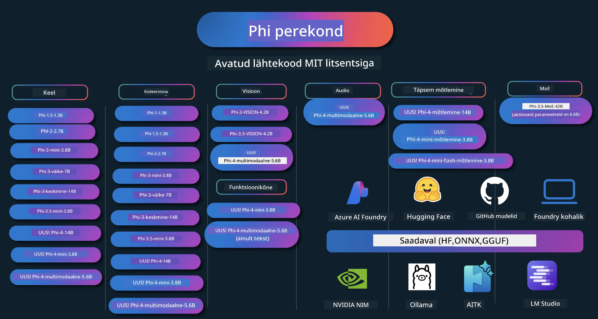

# Phi Kokkuraamat: Käed-külge näited Microsofti Phi mudelitega

[](https://codespaces.new/microsoft/phicookbook)
[](https://vscode.dev/redirect?url=vscode://ms-vscode-remote.remote-containers/cloneInVolume?url=https://github.com/microsoft/phicookbook)

[](https://GitHub.com/microsoft/phicookbook/graphs/contributors/?WT.mc_id=aiml-137032-kinfeylo)
[](https://GitHub.com/microsoft/phicookbook/issues/?WT.mc_id=aiml-137032-kinfeylo)
[](https://GitHub.com/microsoft/phicookbook/pulls/?WT.mc_id=aiml-137032-kinfeylo)
[](http://makeapullrequest.com?WT.mc_id=aiml-137032-kinfeylo)

[](https://GitHub.com/microsoft/phicookbook/watchers/?WT.mc_id=aiml-137032-kinfeylo)
[](https://GitHub.com/microsoft/phicookbook/network/?WT.mc_id=aiml-137032-kinfeylo)
[](https://GitHub.com/microsoft/phicookbook/stargazers/?WT.mc_id=aiml-137032-kinfeylo)

[](https://discord.com/invite/ByRwuEEgH4)

Phi on Microsofti poolt arendatud avatud lähtekoodiga tehisintellekti mudelite seeria.

Phi on praegu kõige võimsam ja kuluefektiivsem väike keelemudel (SLM), millel on väga head näitajad mitmes keeles, mõtlemises, teksti/jutu genereerimises, kodeerimises, piltides, helis ja muudes stsenaariumides.

Saate Phi kasutusele võtta kas pilves või äärmusseadmetes ning saate lihtsalt luua generatiivseid tehisintellekti rakendusi piiratud arvutusvõimsusega.

Järgige neid samme, et alustada nende ressursside kasutamist:
1. **Tee hoidlast fork**: Klõpsa [](https://GitHub.com/microsoft/phicookbook/network/?WT.mc_id=aiml-137032-kinfeylo)
2. **Klooni hoidla**: `git clone https://github.com/microsoft/PhiCookBook.git`
3. [**Liitu Microsoft AI Discord kogukonnaga ja kohtuge ekspertide ning kaasaarendajatega**](https://discord.com/invite/ByRwuEEgH4?WT.mc_id=aiml-137032-kinfeylo)



### 🌐 Mitmekeelne tugi

#### Toetatud GitHub Actioniga (automaatne ja alati ajakohane)

<!-- CO-OP TRANSLATOR LANGUAGES TABLE START -->
[Araabia](../ar/README.md) | [Bengali](../bn/README.md) | [Bulgaaria](../bg/README.md) | [Burma (Myanmar)](../my/README.md) | [Hiina (lihtsustatud)](../zh-CN/README.md) | [Hiina (traditsiooniline, Hongkong)](../zh-HK/README.md) | [Hiina (traditsiooniline, Macau)](../zh-MO/README.md) | [Hiina (traditsiooniline, Taiwan)](../zh-TW/README.md) | [Horvaadi](../hr/README.md) | [Tšehhi](../cs/README.md) | [Taani](../da/README.md) | [Hollandi](../nl/README.md) | [Eesti](./README.md) | [Soome](../fi/README.md) | [Prantsuse](../fr/README.md) | [Saksa](../de/README.md) | [Kreeka](../el/README.md) | [Heebrea](../he/README.md) | [Hindi](../hi/README.md) | [Ungari](../hu/README.md) | [Indoneesia](../id/README.md) | [Itaalia](../it/README.md) | [Jaapani](../ja/README.md) | [Kannada](../kn/README.md) | [Korea](../ko/README.md) | [Leedu](../lt/README.md) | [Malai](../ms/README.md) | [Malajalami](../ml/README.md) | [Marathi](../mr/README.md) | [Nepali](../ne/README.md) | [Nigeeria pidgin](../pcm/README.md) | [Norra](../no/README.md) | [Pärsia (Farsi)](../fa/README.md) | [Poola](../pl/README.md) | [Portugali (Brasiilia)](../pt-BR/README.md) | [Portugali (Portugal)](../pt-PT/README.md) | [Punjabi (Gurmukhi)](../pa/README.md) | [Rumeenia](../ro/README.md) | [Vene](../ru/README.md) | [Serbia (tsükliline)](../sr/README.md) | [Slovaki](../sk/README.md) | [Sloveeni](../sl/README.md) | [Hispaania](../es/README.md) | [Suaheli](../sw/README.md) | [Rootsi](../sv/README.md) | [Tagalog (Filipino)](../tl/README.md) | [Tamil](../ta/README.md) | [Telugu](../te/README.md) | [Tai](../th/README.md) | [Türgi](../tr/README.md) | [Ukraina](../uk/README.md) | [Urdu](../ur/README.md) | [Vietnami](../vi/README.md)

> **Eelistad kloonimist lokaalselt?**
>
> See hoidla sisaldab üle 50 keele tõlkeid, mis suurendab oluliselt allalaadimismahtu. Tõlgeteta kloonimiseks kasuta haru valikut (sparse checkout):
>
> **Bash / macOS / Linux:**
> ```bash
> git clone --filter=blob:none --sparse https://github.com/microsoft/PhiCookBook.git
> cd PhiCookBook
> git sparse-checkout set --no-cone '/*' '!translations' '!translated_images'
> ```
>
> **CMD (Windows):**
> ```cmd
> git clone --filter=blob:none --sparse https://github.com/microsoft/PhiCookBook.git
> cd PhiCookBook
> git sparse-checkout set --no-cone "/*" "!translations" "!translated_images"
> ```
>
> See annab sulle kõik vajaliku kursuse läbimiseks oluliselt kiiremalt.
<!-- CO-OP TRANSLATOR LANGUAGES TABLE END -->

## Sisukord

- Sissejuhatus
  - [Tere tulemast Phi perekonda](./md/01.Introduction/01/01.PhiFamily.md)
  - [Keskkonna häälestamine](./md/01.Introduction/01/01.EnvironmentSetup.md)
  - [Võtmetehnoloogiate mõistmine](./md/01.Introduction/01/01.Understandingtech.md)
  - [Tehisintellekti ohutus Phi mudelite jaoks](./md/01.Introduction/01/01.AISafety.md)
  - [Phi riistvaratugi](./md/01.Introduction/01/01.Hardwaresupport.md)
  - [Phi mudelid & Tähtsuse platvormiülesus](./md/01.Introduction/01/01.Edgeandcloud.md)
  - [Guidance-ai ja Phi kasutamine](./md/01.Introduction/01/01.Guidance.md)
  - [GitHubi turuplatsimudelid](https://github.com/marketplace/models)
  - [Azure AI mudelite kataloog](https://ai.azure.com)

- Phi järeldamine erinevates keskkondades
    -  [Hugging face](./md/01.Introduction/02/01.HF.md)
    -  [GitHub mudelid](./md/01.Introduction/02/02.GitHubModel.md)
    -  [Microsoft Foundry mudelikelder](./md/01.Introduction/02/03.AzureAIFoundry.md)
    -  [Ollama](./md/01.Introduction/02/04.Ollama.md)
    -  [AI tööriistakomplekt VSCode'is (AITK)](./md/01.Introduction/02/05.AITK.md)
    -  [NVIDIA NIM](./md/01.Introduction/02/06.NVIDIA.md)
    -  [Foundry lokaalselt](./md/01.Introduction/02/07.FoundryLocal.md)

- Phi perekonna järeldamine
    - [Phi järeldamine iOS-is](./md/01.Introduction/03/iOS_Inference.md)
    - [Phi järeldamine Androidis](./md/01.Introduction/03/Android_Inference.md)
    - [Phi järeldamine Jetsonil](./md/01.Introduction/03/Jetson_Inference.md)
    - [Phi järeldamine AI PC-s](./md/01.Introduction/03/AIPC_Inference.md)
    - [Phi järeldamine Apple MLX raamistiku abil](./md/01.Introduction/03/MLX_Inference.md)
    - [Phi järeldamine lokaalses serveris](./md/01.Introduction/03/Local_Server_Inference.md)
    - [Phi järeldamine kauglahenduses AI tööriistakomplektiga](./md/01.Introduction/03/Remote_Interence.md)
    - [Phi järeldamine Rustiga](./md/01.Introduction/03/Rust_Inference.md)
    - [Phi järeldamine -- Vision lokaalselt](./md/01.Introduction/03/Vision_Inference.md)
    - [Phi järeldamine Kaito AKS, Azure konteineritega (ametlik tugi)](./md/01.Introduction/03/Kaito_Inference.md)
-  [Phi perekonna kvantimine](./md/01.Introduction/04/QuantifyingPhi.md)
    - [Phi-3.5 / 4 kvantimine llama.cpp abil](./md/01.Introduction/04/UsingLlamacppQuantifyingPhi.md)
    - [Phi-3.5 / 4 kvantimine generatiivse AI laiendustega onnxruntime jaoks](./md/01.Introduction/04/UsingORTGenAIQuantifyingPhi.md)
    - [Phi-3.5 / 4 kvantimine Intel OpenVINO abil](./md/01.Introduction/04/UsingIntelOpenVINOQuantifyingPhi.md)
    - [Phi-3.5 / 4 kvantimine Apple MLX raamistiku abil](./md/01.Introduction/04/UsingAppleMLXQuantifyingPhi.md)

-  Phi hindamine
    - [Vastutustundlik AI](./md/01.Introduction/05/ResponsibleAI.md)
    - [Microsoft Foundry hindamiseks](./md/01.Introduction/05/AIFoundry.md)
    - [Promptflow kasutamine hindamiseks](./md/01.Introduction/05/Promptflow.md)
 
- RAG Azure AI Searchiga
    - [Kuidas kasutada Phi-4-mini ja Phi-4-multimodal(RAG) koos Azure AI Searchiga](https://github.com/microsoft/PhiCookBook/blob/main/code/06.E2E/E2E_Phi-4-RAG-Azure-AI-Search.ipynb)

- Phi rakenduste arendusnäited
  - Teksti & Jutu rakendused
    - Phi-4 näited 🆕
      - [📓] [Vestlus Phi-4-mini ONNX mudeliga](./md/02.Application/01.TextAndChat/Phi4/ChatWithPhi4ONNX/README.md)
      - [Vestlus Phi-4 lokaalse ONNX mudeliga .NET](../../md/04.HOL/dotnet/src/LabsPhi4-Chat-01OnnxRuntime)
      - [Vestlus .NET konsoolirakenduses Phi-4 ONNX kasutades Semantic Kernelit](../../md/04.HOL/dotnet/src/LabsPhi4-Chat-02SK)
    - Phi-3 / 3.5 näited
      - [Lokaalne vestlusrobot brauseris, kasutades Phi3, ONNX Runtime Web ja WebGPU](https://github.com/microsoft/onnxruntime-inference-examples/tree/main/js/chat)
      - [OpenVino Chat](./md/02.Application/01.TextAndChat/Phi3/E2E_OpenVino_Chat.md)
      - [Mitmemudel - Interaktiivne Phi-3-mini ja OpenAI Whisper](./md/02.Application/01.TextAndChat/Phi3/E2E_Phi-3-mini_with_whisper.md)
      - [MLFlow - Kestade loomine ja Phi-3 kasutamine MLFlow-ga](./md//02.Application/01.TextAndChat/Phi3/E2E_Phi-3-MLflow.md)
      - [Mudeliparandus - Kuidas optimeerida Phi-3-mini mudelit ONNX Runtime Web jaoks Olive abil](https://github.com/microsoft/Olive/tree/main/examples/phi3)
      - [WinUI3 rakendus Phi-3 mini-4k-instruct-onnx abil](https://github.com/microsoft/Phi3-Chat-WinUI3-Sample/)
      -[WinUI3 mitmemudeliline AI toega märkmete rakenduse näidis](https://github.com/microsoft/ai-powered-notes-winui3-sample)
      - [Kohandatud Phi-3 mudelite peenhäälestamine ja integreerimine Prompt flow abil](./md/02.Application/01.TextAndChat/Phi3/E2E_Phi-3-FineTuning_PromptFlow_Integration.md)
      - [Kohandatud Phi-3 mudelite peenhäälestamine ja integreerimine Prompt flow abil Microsoft Foundrys](./md/02.Application/01.TextAndChat/Phi3/E2E_Phi-3-FineTuning_PromptFlow_Integration_AIFoundry.md)
      - [Peenhäälestatud Phi-3 / Phi-3.5 mudeli hindamine Microsoft Foundrys, keskendudes Microsofti vastutustundliku tehisintellekti põhimõtetele](./md/02.Application/01.TextAndChat/Phi3/E2E_Phi-3-Evaluation_AIFoundry.md)
      - [📓] [Phi-3.5-mini-instruct keelprognoosi näidis (hiina/inglise)](./md/02.Application/01.TextAndChat/Phi3/phi3-instruct-demo.ipynb)
      - [Phi-3.5-Instruct WebGPU RAG Chatbot](./md/02.Application/01.TextAndChat/Phi3/WebGPUWithPhi35Readme.md)
      - [Windowsi GPU kasutamine Prompt flow lahenduse loomiseks Phi-3.5-Instruct ONNX-iga](./md/02.Application/01.TextAndChat/Phi3/UsingPromptFlowWithONNX.md)
      - [Microsoft Phi-3.5 tflite kasutamine Androidi rakenduse loomiseks](./md/02.Application/01.TextAndChat/Phi3/UsingPhi35TFLiteCreateAndroidApp.md)
      - [Q&A .NET näidis kohalikku ONNX Phi-3 mudelit kasutades Microsoft.ML.OnnxRuntime'iga](../../md/04.HOL/dotnet/src/LabsPhi301)
      - [Käsurea vestlusrakendus .NET Semantic Kernel ja Phi-3 abil](../../md/04.HOL/dotnet/src/LabsPhi302)

  - Azure AI järelduste SDK koodinäited 
    - Phi-4 näited 🆕
      - [📓] [Projekti koodi genereerimine Phi-4-multimodal abil](./md/02.Application/02.Code/Phi4/GenProjectCode/README.md)
    - Phi-3 / 3.5 näited
      - [Loo oma Visual Studio Code GitHub Copilot Chat Microsoft Phi-3 perekonnaga](./md/02.Application/02.Code/Phi3/VSCodeExt/README.md)
      - [Loo oma Visual Studio Code Chat Copilot agendiga Phi-3.5 GitHub mudelite abil](/md/02.Application/02.Code/Phi3/CreateVSCodeChatAgentWithGitHubModels.md)

  - Täiustatud põhjendusnäited
    - Phi-4 näited 🆕
      - [📓] [Phi-4-mini-põhjendus või Phi-4-põhjendus näited](./md/02.Application/03.AdvancedReasoning/Phi4/AdvancedResoningPhi4mini/README.md)
      - [📓] [Phi-4-mini-põhjenduse peenhäälestamine Microsoft Olive abil](./md/02.Application/03.AdvancedReasoning/Phi4/AdvancedResoningPhi4mini/olive_ft_phi_4_reasoning_with_medicaldata.ipynb)
      - [📓] [Phi-4-mini-põhjenduse peenhäälestamine Apple MLX-i abil](./md/02.Application/03.AdvancedReasoning/Phi4/AdvancedResoningPhi4mini/mlx_ft_phi_4_reasoning_with_medicaldata.ipynb)
      - [📓] [Phi-4-mini-põhjendus GitHub mudelitega](./md/02.Application/02.Code/Phi4r/github_models_inference.ipynb)
      - [📓] [Phi-4-mini-põhjendus Microsoft Foundry mudelitega](./md/02.Application/02.Code/Phi4r/azure_models_inference.ipynb)
  - Demos
      - [Phi-4-mini demo Hugging Face Spaces'is](https://huggingface.co/spaces/microsoft/phi-4-mini?WT.mc_id=aiml-137032-kinfeylo)
      - [Phi-4-multimodal demo Hugginge Face Spaces'is](https://huggingface.co/spaces/microsoft/phi-4-multimodal?WT.mc_id=aiml-137032-kinfeylo)
  - Visiooninäited
    - Phi-4 näited 🆕
      - [📓] [Phi-4-multimodal kasutamine piltide lugemiseks ja koodi genereerimiseks](./md/02.Application/04.Vision/Phi4/CreateFrontend/README.md) 
    - Phi-3 / 3.5 näited
      -  [📓][Phi-3-visioon-pildi tekst tekstiks](./md/02.Application/04.Vision/Phi3/E2E_Phi-3-vision-image-text-to-text-online-endpoint.ipynb)
      - [Phi-3-visioon-ONNX](https://onnxruntime.ai/docs/genai/tutorials/phi3-v.html)
      - [📓][Phi-3-vision CLIP manustus](./md/02.Application/04.Vision/Phi3/E2E_Phi-3-vision-image-text-to-text-online-endpoint.ipynb)
      - [DEMO: Phi-3 ringlussevõtt](https://github.com/jennifermarsman/PhiRecycling/)
      - [Phi-3-visioon - Visuaalne keeleassistent - Phi3-Visiooni ja OpenVINO-ga](https://docs.openvino.ai/nightly/notebooks/phi-3-vision-with-output.html)
      - [Phi-3 Visioon Nvidia NIM](./md/02.Application/04.Vision/Phi3/E2E_Nvidia_NIM_Vision.md)
      - [Phi-3 Visioon OpenVino](./md/02.Application/04.Vision/Phi3/E2E_OpenVino_Phi3Vision.md)
      - [📓][Phi-3.5 Visioon mitme kaadri või mitme pildi näidis](./md/02.Application/04.Vision/Phi3/phi3-vision-demo.ipynb)
      - [Phi-3 Visioon kohalik ONNX mudel Microsoft.ML.OnnxRuntime .NET-iga](../../md/04.HOL/dotnet/src/LabsPhi303)
      - [Menüü-põhine Phi-3 Visioon kohalik ONNX mudel Microsoft.ML.OnnxRuntime .NET-iga](../../md/04.HOL/dotnet/src/LabsPhi304)

  - Matemaatika näited
    -  Phi-4-Mini-Flash-Reasoning-Instruct näited 🆕 [Matemaatika demo Phi-4-Mini-Flash-Reasoning-Instructiga](./md/02.Application/09.Math/MathDemo.ipynb)

  - Audio näited
    - Phi-4 näited 🆕
      - [📓] [Helitekstide väljavõtmine Phi-4-multimodal abil](./md/02.Application/05.Audio/Phi4/Transciption/README.md)
      - [📓] [Phi-4-multimodal audio näidis](./md/02.Application/05.Audio/Phi4/Siri/demo.ipynb)
      - [📓] [Phi-4-multimodal kõne tõlke näidis](./md/02.Application/05.Audio/Phi4/Translate/demo.ipynb)
      - [.NET käsurearakendus Phi-4-multimodal audioga heli faili analüüsimiseks ja transkriptsiooni genereerimiseks](../../md/04.HOL/dotnet/src/LabsPhi4-MultiModal-02Audio)

  - MOE näited
    - Phi-3 / 3.5 näited
      - [📓] [Phi-3.5 Ekspertide segu mudelid (MoEs) sotsiaalmeedia näidis](./md/02.Application/06.MoE/Phi3/phi3_moe_demo.ipynb)
      - [📓] [Võta üles Retrieval-Augmented Generation (RAG) torujuht NVIDIA NIM Phi-3 MOE, Azure AI Search ja LlamaIndex abil](./md/02.Application/06.MoE/Phi3/azure-ai-search-nvidia-rag.ipynb)
      - 
  - Funktsiooni kutsumise näited
    - Phi-4 näited 🆕
      -  [📓] [Funktsiooni kutsumise kasutamine Phi-4-mini puhul](./md/02.Application/07.FunctionCalling/Phi4/FunctionCallingBasic/README.md)
      -  [📓] [Funktsiooni kutsumise kasutamine multi-agentide loomiseks Phi-4-mini abil](./md/02.Application/07.FunctionCalling/Phi4/Multiagents/Phi_4_mini_multiagent.ipynb)
      -  [📓] [Funktsiooni kutsumise kasutamine Ollama abil](./md/02.Application/07.FunctionCalling/Phi4/Ollama/ollama_functioncalling.ipynb)
      -  [📓] [Funktsiooni kutsumise kasutamine ONNX-iga](./md/02.Application/07.FunctionCalling/Phi4/ONNX/onnx_parallel_functioncalling.ipynb)
  - Mitmemodaalne segamine näited
    - Phi-4 näited 🆕
      -  [📓] [Phi-4-multimodal kasutamine tehnoloogiauudiste ajakirjanikuna](./md/02.Application/08.Multimodel/Phi4/TechJournalist/phi_4_mm_audio_text_publish_news.ipynb)
      - [.NET käsurearakendus Phi-4-multimodal piltide analüüsimiseks](../../md/04.HOL/dotnet/src/LabsPhi4-MultiModal-01Images)

- Phi peenhäälestamine
  - [Peenhäälestamise stsenaariumid](./md/03.FineTuning/FineTuning_Scenarios.md)
  - [Peenhäälestamine vs RAG](./md/03.FineTuning/FineTuning_vs_RAG.md)
  - [Lase Phi-3-l saada tööstuseksperdiks](./md/03.FineTuning/LetPhi3gotoIndustriy.md)
  - [Phi-3 peenhäälestamine VS Code'i AI tööriistakomplektiga](./md/03.FineTuning/Finetuning_VSCodeaitoolkit.md)
  - [Phi-3 peenhäälestamine Azure Machine Learning Service'iga](./md/03.FineTuning/Introduce_AzureML.md)
  - [Phi-3 peenhäälestamine Loraga](./md/03.FineTuning/FineTuning_Lora.md)
  - [Phi-3 peenhäälestamine QLora abil](./md/03.FineTuning/FineTuning_Qlora.md)
  - [Phi-3 peenhäälestamine Microsoft Foundryga](./md/03.FineTuning/FineTuning_AIFoundry.md)
  - [Phi-3 peenhäälestamine Azure ML CLI/SDK abil](./md/03.FineTuning/FineTuning_MLSDK.md)
  - [Peenhäälestamine Microsoft Olive'iga](./md/03.FineTuning/FineTuning_MicrosoftOlive.md)
  - [Microsoft Olive praktiline lab](./md/03.FineTuning/olive-lab/readme.md)
  - [Phi-3-vision peenhäälestamine Weights and Bias abil](./md/03.FineTuning/FineTuning_Phi-3-visionWandB.md)
  - [Phi-3 peenhäälestamine Apple MLX raamistikuga](./md/03.FineTuning/FineTuning_MLX.md)
  - [Phi-3-vision peenhäälestamine (ametlik tugi)](./md/03.FineTuning/FineTuning_Vision.md)
  - [Phi-3 peenhäälestamine Kaito AKS, Azure konteineritega (ametlik tugi)](./md/03.FineTuning/FineTuning_Kaito.md)
  - [Phi-3 ja 3.5 Vision peenhäälestamine](https://github.com/2U1/Phi3-Vision-Finetune)

- Praktikum
  - [Lõpp-eesmärgi mudelite uurimine: LLMid, SLMid, kohaliku arenduse ja palju muud](https://github.com/microsoft/aitour-exploring-cutting-edge-models)
  - [NLP potentsiaali avamine: peenhäälestamine Microsoft Olive'iga](https://github.com/azure/Ignite_FineTuning_workshop)
- Akadeemilised teadustööd ja publikatsioonid
  - [Textbooks Are All You Need II: phi-1.5 tehniline aruanne](https://arxiv.org/abs/2309.05463)
  - [Phi-3 tehniline aruanne: väga võimekas keelemudel kohapeal teie telefonis](https://arxiv.org/abs/2404.14219)
  - [Phi-4 tehniline aruanne](https://arxiv.org/abs/2412.08905)
  - [Phi-4-Mini tehniline aruanne: kompaktne kuid võimas multimodaalne keelemudel LoRA seguga](https://arxiv.org/abs/2503.01743)
  - [Väikeste keelemudelite optimeerimine sõidukisiseseks funktsioonikõneks](https://arxiv.org/abs/2501.02342)
  - [(WhyPHI) PHI-3 peenhäälestamine mitmevalikvastustega küsimustele vastamiseks: metoodika, tulemused ja väljakutsed](https://arxiv.org/abs/2501.01588)
  - [Phi-4-loogika tehniline aruanne](https://www.microsoft.com/en-us/research/wp-content/uploads/2025/04/phi_4_reasoning.pdf)
  - [Phi-4-mini-loogika tehniline aruanne](https://huggingface.co/microsoft/Phi-4-mini-reasoning/blob/main/Phi-4-Mini-Reasoning.pdf)

## Phi mudelite kasutamine

### Phi Microsoft Foundry's

Saate õppida, kuidas kasutada Microsoft Phi'd ja kuidas ehitada E2E lahendusi erinevates riistvaraseadmetes. Phi kogemiseks alustage mudelitega mängimist ja Phi kohandamist oma stsenaariumide jaoks, kasutades [Microsoft Foundry Azure AI mudelikataloogi](https://aka.ms/phi3-azure-ai). Rohkem saate õppida juhendist Starting with [Microsoft Foundry](/md/02.QuickStart/AzureAIFoundry_QuickStart.md)

**Mänguväljak**
Igal mudelil on pühendatud testimisvõimalus [Azure AI Playground](https://aka.ms/try-phi3).

### Phi GitHub mudelitel

Saate õppida, kuidas kasutada Microsoft Phi'd ja kuidas ehitada E2E lahendusi erinevates riistvaraseadmetes. Phi kogemiseks alustage mudeli mängimist ja Phi kohandamist oma stsenaariumide jaoks, kasutades [GitHub Mudelikataloogi](https://github.com/marketplace/models?WT.mc_id=aiml-137032-kinfeylo). Rohkem saate õppida juhendist Starting with [GitHub Model Catalog](/md/02.QuickStart/GitHubModel_QuickStart.md)

**Mänguväljak**
Igal mudelil on pühendatud [testimisvõimalus](/md/02.QuickStart/GitHubModel_QuickStart.md).

### Phi Hugging Face's

Mudelit leiate ka [Hugging Face'ist](https://huggingface.co/microsoft)

**Mänguväljak**
[Hugging Chat mänguväljak](https://huggingface.co/chat/models/microsoft/Phi-3-mini-4k-instruct)

## 🎒 Teised kursused

Meie meeskond toodab ka teisi kursuseid! Vaadake:

<!-- CO-OP TRANSLATOR OTHER COURSES START -->
### LangChain
[](https://aka.ms/langchain4j-for-beginners)
[](https://aka.ms/langchainjs-for-beginners?WT.mc_id=m365-94501-dwahlin)
[](https://github.com/microsoft/langchain-for-beginners?WT.mc_id=m365-94501-dwahlin)
---

### Azure / Edge / MCP / Agentid
[](https://github.com/microsoft/AZD-for-beginners?WT.mc_id=academic-105485-koreyst)
[](https://github.com/microsoft/edgeai-for-beginners?WT.mc_id=academic-105485-koreyst)
[](https://github.com/microsoft/mcp-for-beginners?WT.mc_id=academic-105485-koreyst)
[](https://github.com/microsoft/ai-agents-for-beginners?WT.mc_id=academic-105485-koreyst)

---

### Generatiivse AI seeria
[](https://github.com/microsoft/generative-ai-for-beginners?WT.mc_id=academic-105485-koreyst)
[-9333EA?style=for-the-badge&labelColor=E5E7EB&color=9333EA)](https://github.com/microsoft/Generative-AI-for-beginners-dotnet?WT.mc_id=academic-105485-koreyst)
[-C084FC?style=for-the-badge&labelColor=E5E7EB&color=C084FC)](https://github.com/microsoft/generative-ai-for-beginners-java?WT.mc_id=academic-105485-koreyst)
[-E879F9?style=for-the-badge&labelColor=E5E7EB&color=E879F9)](https://github.com/microsoft/generative-ai-with-javascript?WT.mc_id=academic-105485-koreyst)

---

### Põhjalik õpe
[](https://aka.ms/ml-beginners?WT.mc_id=academic-105485-koreyst)
[](https://aka.ms/datascience-beginners?WT.mc_id=academic-105485-koreyst)
[](https://aka.ms/ai-beginners?WT.mc_id=academic-105485-koreyst)
[](https://github.com/microsoft/Security-101?WT.mc_id=academic-96948-sayoung)
[](https://aka.ms/webdev-beginners?WT.mc_id=academic-105485-koreyst)
[](https://aka.ms/iot-beginners?WT.mc_id=academic-105485-koreyst)
[](https://github.com/microsoft/xr-development-for-beginners?WT.mc_id=academic-105485-koreyst)

---

### Copiloti seeria
[](https://aka.ms/GitHubCopilotAI?WT.mc_id=academic-105485-koreyst)
[](https://github.com/microsoft/mastering-github-copilot-for-dotnet-csharp-developers?WT.mc_id=academic-105485-koreyst)
[](https://github.com/microsoft/CopilotAdventures?WT.mc_id=academic-105485-koreyst)
<!-- CO-OP TRANSLATOR OTHER COURSES END -->

## Vastutustundlik AI

Microsoft on pühendunud aitama klientidel kasutada meie tehisintellekti tooteid vastutustundlikult, jagades meie kogemusi ja luues usaldusel põhinevaid partnerlusi tööriistade nagu läbipaistvuse märkmed ja mõjuhinnangud kaudu. Paljusid neist ressurssidest leiab aadressilt [https://aka.ms/RAI](https://aka.ms/RAI).
Microsofti lähenemine vastutustundlikule tehisintellektile tugineb meie tehisintellekti põhimõtetele: õiglus, usaldusväärsus ja ohutus, privaatsus ja turvalisus, kaasatus, läbipaistvus ning vastutus.

Suurte keele-, pildi- ja kõnemudelite puhul - nagu selles näites kasutatud - võivad tekkida võimalikud käitumisviisid, mis on ebaõiglased, ebausaldusväärsed või solvavad, põhjustades seeläbi kahju. Palun tutvuge [Azure OpenAI teenuse läbipaistvuse märkmega](https://learn.microsoft.com/legal/cognitive-services/openai/transparency-note?tabs=text), et saada teavet riskide ja piirangute kohta.

Soovitatav meetod nende riskide vähendamiseks on lisada oma arhitektuuri turvasüsteem, mis tuvastab ja takistab kahjulikku käitumist. [Azure AI Content Safety](https://learn.microsoft.com/azure/ai-services/content-safety/overview) pakub sõltumatut kaitsekihi, mis suudab tuvastada kasutajate ja AI loodud kahjulikku sisu rakendustes ja teenustes. Azure AI Content Safety sisaldab teksti ja pildi API-sid, mis võimaldavad tuvastada kahjulikku materjali. Microsoft Foundry’s võimaldab Content Safety teenus vaadata, uurida ja proovida näidiskoodi kahjuliku sisu tuvastamiseks eri modaalides. Järgnev [kiirjuhendi dokumentatsioon](https://learn.microsoft.com/azure/ai-services/content-safety/quickstart-text?tabs=visual-studio%2Clinux&pivots=programming-language-rest) juhendab teid teenusele päringute tegemisel.
Teine aspekt, mida tuleks arvestada, on kogu rakenduse jõudlus. Multi-modaalsete ja multi-mudelitega rakenduste puhul mõistame jõudluse all, et süsteem toimib nii nagu teie ja teie kasutajad ootavad, sealhulgas ei genereeri kahjulikke väljundeid. On oluline hinnata kogu oma rakenduse jõudlust, kasutades [jõudluse, kvaliteedi ning riski ja turvalisuse hindajaid](https://learn.microsoft.com/azure/ai-studio/concepts/evaluation-metrics-built-in). Samuti on teil võimalik luua ja hinnata [kohandatud hindajatega](https://learn.microsoft.com/azure/ai-studio/how-to/develop/evaluate-sdk#custom-evaluators).

Saate hinnata oma tehisintellektil põhinevat rakendust arenduskeskkonnas, kasutades [Azure AI hindamis-SDK-d](https://microsoft.github.io/promptflow/index.html). Kasutades kas testiandmekogumit või sihti, mõõdetakse teie generatiivse tehisintellekti rakenduse väljundeid kvantitatiivselt kaasasolevate või teie valitud kohandatud hindajatega. Azure AI hindamis-SDK kasutamise alustamiseks oma süsteemi hindamiseks võite järgida [kiirjuhendit](https://learn.microsoft.com/azure/ai-studio/how-to/develop/flow-evaluate-sdk). Kui olete hinnangu käivituse läbi viinud, saate [tulemusi visualiseerida Microsoft Foundrys](https://learn.microsoft.com/azure/ai-studio/how-to/evaluate-flow-results).

## Kaubamärgid

See projekt võib sisaldada kaubamärke või logosi projektide, toodete või teenuste jaoks. Microsofti kaubamärkide või logode autoriseeritud kasutamine peab toimuma vastavalt ja järgides [Microsofti kaubamärkide ja brändi juhiseid](https://www.microsoft.com/legal/intellectualproperty/trademarks/usage/general).
Microsofti kaubamärkide või logode kasutamine selle projekti muudetud versioonides ei tohi põhjustada segadust ega viidata Microsofti sponsorlusele. Kolmandate osapoolte kaubamärkide või logode kasutamine sõltub nende kolmandate osapoolte poliitikatest.

## Abi saamine

Kui takerduse tekib või teil on küsimusi AI-rakenduste loomise kohta, liituge:

[](https://aka.ms/foundry/discord)

Kui teil on tootepalautust või veateateid arendamisel, külastage:

[](https://aka.ms/foundry/forum)

---

<!-- CO-OP TRANSLATOR DISCLAIMER START -->
**Vastutusest loobumine**:  
See dokument on tõlgitud AI tõlketeenuse [Co-op Translator](https://github.com/Azure/co-op-translator) abil. Kuigi püüdleme täpsuse poole, palun arvestage, et automaatsed tõlked võivad sisaldada vigu või ebatäpsusi. Originaaldokument selle emakeeles tuleks pidada ametlikuks allikaks. Olulise teabe puhul on soovitatav kasutada professionaalset inimtõlget. Me ei vastuta selles tõlkes esinevate arusaamatuste või valesti tõlgendamise eest.
<!-- CO-OP TRANSLATOR DISCLAIMER END -->