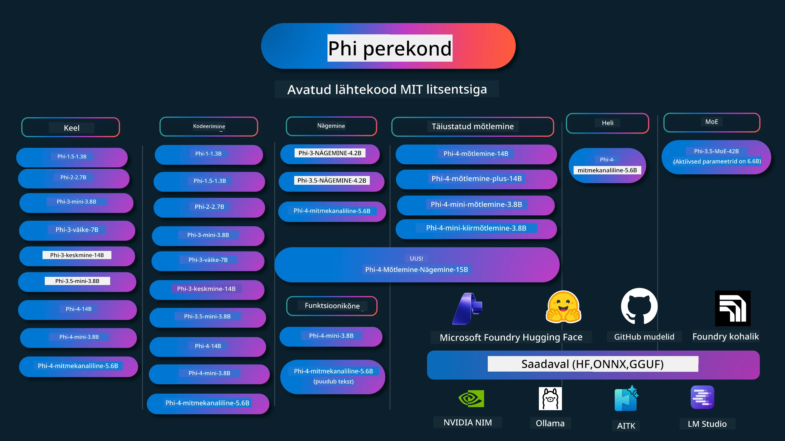

# Phi Cookbook: Praktilised näited Microsofti Phi mudelitega

[](https://codespaces.new/microsoft/phicookbook)
[](https://vscode.dev/redirect?url=vscode://ms-vscode-remote.remote-containers/cloneInVolume?url=https://github.com/microsoft/phicookbook)

[](https://GitHub.com/microsoft/phicookbook/graphs/contributors/?WT.mc_id=aiml-137032-kinfeylo)
[](https://GitHub.com/microsoft/phicookbook/issues/?WT.mc_id=aiml-137032-kinfeylo)
[](https://GitHub.com/microsoft/phicookbook/pulls/?WT.mc_id=aiml-137032-kinfeylo)
[](http://makeapullrequest.com?WT.mc_id=aiml-137032-kinfeylo)

[](https://GitHub.com/microsoft/phicookbook/watchers/?WT.mc_id=aiml-137032-kinfeylo)
[](https://GitHub.com/microsoft/phicookbook/network/?WT.mc_id=aiml-137032-kinfeylo)
[](https://GitHub.com/microsoft/phicookbook/stargazers/?WT.mc_id=aiml-137032-kinfeylo)

[](https://discord.com/invite/ByRwuEEgH4)

Phi on Microsofti väljatöötatud avatud lähtekoodiga tehisintellekti mudelite seeria.

Phi on hetkel võimsaim ja kulutõhusaim väike keelemudel (SLM), millel on väga head tulemused mitmekeelesuses, loogikas, teksti/vestluse genereerimises, kodeerimises, piltides, helis ja muudes stsenaariumites.

Phi saab juurutada pilves või servaseadmetes ning selle abil saab lihtsalt luua generatiivseid tehisintellekti rakendusi piiratud arvutusvõimsusega.

Järgige neid samme, et alustada nende ressursside kasutamist:
1. **Hargmusta repoteek**: Vajuta [](https://GitHub.com/microsoft/phicookbook/network/?WT.mc_id=aiml-137032-kinfeylo)
2. **Klooni repoteek**: `git clone https://github.com/microsoft/PhiCookBook.git`
3. [**Liitu Microsoft AI Discord kogukonnaga ja saa tuttavaks ekspertide ning teiste arendajatega**](https://discord.com/invite/ByRwuEEgH4?WT.mc_id=aiml-137032-kinfeylo)



### 🌐 Mitmekeelsuse tugi

#### Toetatud GitHub Actioni kaudu (automatiseeritud ja alati ajakohane)

<!-- CO-OP TRANSLATOR LANGUAGES TABLE START -->
[Araabia](../ar/README.md) | [Bengali](../bn/README.md) | [Bulgaaria](../bg/README.md) | [Birma (Myanmar)](../my/README.md) | [Hiina (lihtsustatud)](../zh-CN/README.md) | [Hiina (traditsiooniline, Hongkong)](../zh-HK/README.md) | [Hiina (traditsiooniline, Macau)](../zh-MO/README.md) | [Hiina (traditsiooniline, Taiwan)](../zh-TW/README.md) | [Horvaadi](../hr/README.md) | [Tšehhi](../cs/README.md) | [Taani](../da/README.md) | [Hollandi](../nl/README.md) | [Eesti](./README.md) | [Soome](../fi/README.md) | [Prantsuse](../fr/README.md) | [Saksa](../de/README.md) | [Kreeka](../el/README.md) | [Heebrea](../he/README.md) | [Hindi](../hi/README.md) | [Ungari](../hu/README.md) | [Indoneesia](../id/README.md) | [Itaalia](../it/README.md) | [Jaapani](../ja/README.md) | [Kannada](../kn/README.md) | [Khmeri](../km/README.md) | [Korea](../ko/README.md) | [Leedu](../lt/README.md) | [Malai](../ms/README.md) | [Malayalam](../ml/README.md) | [Marathi](../mr/README.md) | [Nepali](../ne/README.md) | [Nigeeria Pidgin](../pcm/README.md) | [Norra](../no/README.md) | [Pärsia (Farsi)](../fa/README.md) | [Poola](../pl/README.md) | [Portugali (Brasiilia)](../pt-BR/README.md) | [Portugali (Portugal)](../pt-PT/README.md) | [Pandžabi (Gurmukhi)](../pa/README.md) | [Rumeenia](../ro/README.md) | [Vene](../ru/README.md) | [Serbia (kirillitsa)](../sr/README.md) | [Slovaki](../sk/README.md) | [Sloveeni](../sl/README.md) | [Hispaania](../es/README.md) | [Suahiili](../sw/README.md) | [Rootsi](../sv/README.md) | [Tagalogi (Filipiino)](../tl/README.md) | [Tamili](../ta/README.md) | [Telugu](../te/README.md) | [Tai](../th/README.md) | [Türgi](../tr/README.md) | [Ukraina](../uk/README.md) | [Urdu](../ur/README.md) | [Vietnami](../vi/README.md)

> **Eelistad kohalikku kloonimist?**
>
> See repoteek sisaldab üle 50 keele tõlkeid, mis suurendab oluliselt allalaadimissuurust. Tõlgeteta kloonimiseks kasuta harvade failide kontrolli (sparse checkout):
>
> **Bash / macOS / Linux:**
> ```bash
> git clone --filter=blob:none --sparse https://github.com/microsoft/PhiCookBook.git
> cd PhiCookBook
> git sparse-checkout set --no-cone '/*' '!translations' '!translated_images'
> ```
>
> **CMD (Windows):**
> ```cmd
> git clone --filter=blob:none --sparse https://github.com/microsoft/PhiCookBook.git
> cd PhiCookBook
> git sparse-checkout set --no-cone "/*" "!translations" "!translated_images"
> ```
>
> See annab sulle kõik vajaliku kursuse lõpuleviimiseks palju kiirema allalaadimisega.
<!-- CO-OP TRANSLATOR LANGUAGES TABLE END -->

## Sisukord
- Sissejuhatus - [Tere tulemast Phi perekonda](./md/01.Introduction/01/01.PhiFamily.md) - [Keskkonna seadistamine](./md/01.Introduction/01/01.EnvironmentSetup.md) - [Põhitehnoloogiate mõistmine](./md/01.Introduction/01/01.Understandingtech.md) - [AI ohutus Phi mudelite jaoks](./md/01.Introduction/01/01.AISafety.md) - [Phi riistvara tugi](./md/01.Introduction/01/01.Hardwaresupport.md) - [Phi mudelid ja kättesaadavus platvormide vahel](./md/01.Introduction/01/01.Edgeandcloud.md) - [Guidance-ai ja Phi kasutamine](./md/01.Introduction/01/01.Guidance.md) - [GitHub Marketplace mudelid](https://github.com/marketplace/models) - [Azure AI mudelite kataloog](https://ai.azure.com) - Phi tuletamine erinevates keskkondades - [Hugging face](./md/01.Introduction/02/01.HF.md) - [GitHub mudelid](./md/01.Introduction/02/02.GitHubModel.md) - [Microsoft Foundry mudelite kataloog](./md/01.Introduction/02/03.AzureAIFoundry.md) - [Ollama](./md/01.Introduction/02/04.Ollama.md) - [AI tööriistad VSCode (AITK)](./md/01.Introduction/02/05.AITK.md) - [NVIDIA NIM](./md/01.Introduction/02/06.NVIDIA.md) - [Foundry kohalik](./md/01.Introduction/02/07.FoundryLocal.md) - Phi perekonna tuletamine - [Phi tuletamine iOS-s](./md/01.Introduction/03/iOS_Inference.md) - [Phi tuletamine Androidis](./md/01.Introduction/03/Android_Inference.md) - [Phi tuletamine Jetsonis](./md/01.Introduction/03/Jetson_Inference.md) - [Phi tuletamine AI arvutis](./md/01.Introduction/03/AIPC_Inference.md) - [Phi tuletamine Apple MLX raamistiku abil](./md/01.Introduction/03/MLX_Inference.md) - [Phi tuletamine lokaalses serveris](./md/01.Introduction/03/Local_Server_Inference.md) - [Phi tuletamine kaugserveris AI tööriistadega](./md/01.Introduction/03/Remote_Interence.md) - [Phi tuletamine Rustiga](./md/01.Introduction/03/Rust_Inference.md) - [Phi--Vision tuletamine lokaalselt](./md/01.Introduction/03/Vision_Inference.md) - [Phi tuletamine Kaito AKS, Azure konteineritega (ametlik tugi)](./md/01.Introduction/03/Kaito_Inference.md) - Phi perekonna kvantifitseerimine - [Phi kvantifitseerimine](./md/01.Introduction/04/QuantifyingPhi.md) - [Phi-3.5 / 4 kvantifitseerimine kasutades llama.cpp](./md/01.Introduction/04/UsingLlamacppQuantifyingPhi.md) - [Phi-3.5 / 4 kvantifitseerimine kasutades Generative AI laiendusi onnxruntime jaoks](./md/01.Introduction/04/UsingORTGenAIQuantifyingPhi.md) - [Phi-3.5 / 4 kvantifitseerimine kasutades Intel OpenVINO](./md/01.Introduction/04/UsingIntelOpenVINOQuantifyingPhi.md) - [Phi-3.5 / 4 kvantifitseerimine kasutades Apple MLX Frameworki](./md/01.Introduction/04/UsingAppleMLXQuantifyingPhi.md) - Phi hindamine - [Vastutustundlik AI](./md/01.Introduction/05/ResponsibleAI.md) - [Microsoft Foundry hindamiseks](./md/01.Introduction/05/AIFoundry.md) - [Promptflow kasutamine hindamiseks](./md/01.Introduction/05/Promptflow.md) - RAG Azure AI otsinguga - [Kuidas kasutada Phi-4-mini ja Phi-4-multimodaalset (RAG) koos Azure AI otsinguga](https://github.com/microsoft/PhiCookBook/blob/main/code/06.E2E/E2E_Phi-4-RAG-Azure-AI-Search.ipynb) - Phi rakenduste arendusnäited - Tekst ja juturakendused - Phi-4 näited - [📓] [Räägi Phi-4-mini ONNX mudeliga](./md/02.Application/01.TextAndChat/Phi4/ChatWithPhi4ONNX/README.md) - [Räägi kohalikuga Phi-4 ONNX mudel .NET](../../md/04.HOL/dotnet/src/LabsPhi4-Chat-01OnnxRuntime) - [Vestlus .NET konsoolirakenduses Phi-4 ONNX ja Semantic Kerneliga](../../md/04.HOL/dotnet/src/LabsPhi4-Chat-02SK) - Phi-3 / 3.5 näited - [Kohalik juturobot brauseris kasutades Phi3, ONNX Runtime Web ja WebGPU](https://github.com/microsoft/onnxruntime-inference-examples/tree/main/js/chat) - [OpenVino vestlus](./md/02.Application/01.TextAndChat/Phi3/E2E_OpenVino_Chat.md) - [Mitme mudeliga - Interaktiivne Phi-3-mini ja OpenAI Whisper](./md/02.Application/01.TextAndChat/Phi3/E2E_Phi-3-mini_with_whisper.md) - [MLFlow - Wrapperi loomine ja Phi-3 kasutamine MLFlow'ga](./md//02.Application/01.TextAndChat/Phi3/E2E_Phi-3-MLflow.md) - [Mudelihalduse optimeerimine - Kuidas optimeerida Phi-3-mini mudelit ONNX Runtime Web jaoks Olive abil](https://github.com/microsoft/Olive/tree/main/examples/phi3) - [WinUI3 rakendus Phi-3 mini-4k-instruct-onnx abil](https://github.com/microsoft/Phi3-Chat-WinUI3-Sample/) - [WinUI3 mitme mudeliga AI-käivitatud märkmete rakenduse näide](https://github.com/microsoft/ai-powered-notes-winui3-sample) - [Kohandatud Phi-3 mudelite peenhäälestamine ja integreerimine Prompt flow abil](./md/02.Application/01.TextAndChat/Phi3/E2E_Phi-3-FineTuning_PromptFlow_Integration.md) - [Kohandatud Phi-3 mudelite peenhäälestamine ja integreerimine Prompt flow abil Microsoft Foundry's](./md/02.Application/01.TextAndChat/Phi3/E2E_Phi-3-FineTuning_PromptFlow_Integration_AIFoundry.md) - [Peenhäälestatud Phi-3 / Phi-3.5 mudeli hindamine Microsoft Foundry's, keskendudes Microsofti vastutustundliku AI põhimõtetele](./md/02.Application/01.TextAndChat/Phi3/E2E_Phi-3-Evaluation_AIFoundry.md) - [📓] [Phi-3.5-mini-instruct keele ennustamise näide (hiina / inglise)](./md/02.Application/01.TextAndChat/Phi3/phi3-instruct-demo.ipynb) - [Phi-3.5-Instruct WebGPU RAG juturobot](./md/02.Application/01.TextAndChat/Phi3/WebGPUWithPhi35Readme.md) - [Windows GPU kasutamine Prompt flow lahenduse loomiseks Phi-3.5-Instruct ONNX-iga](./md/02.Application/01.TextAndChat/Phi3/UsingPromptFlowWithONNX.md) - [Microsoft Phi-3.5 tflite kasutamine Androidi rakenduse loomiseks](./md/02.Application/01.TextAndChat/Phi3/UsingPhi35TFLiteCreateAndroidApp.md) - [Küsimused ja vastused .NET näide kohalikuga ONNX Phi-3 mudel ja Microsoft.ML.OnnxRuntime'ga](../../md/04.HOL/dotnet/src/LabsPhi301) - [Konsooli vestlusrakendus .NET Semantic Kernel ja Phi-3-ga](../../md/04.HOL/dotnet/src/LabsPhi302) - Azure AI tuletamise SDK koodinäited - Phi-4 näited - [📓] [Projekti koodi genereerimine Phi-4-multimodaaliga](./md/02.Application/02.Code/Phi4/GenProjectCode/README.md) - Phi-3 / 3.5 näited - [Loo oma Visual Studio Code GitHub Copilot Chat Microsoft Phi-3 perega](./md/02.Application/02.Code/Phi3/VSCodeExt/README.md) - [Loo oma Visual Studio Code Chat Copilot agent Phi-3.5 abil GitHub mudelitega](/md/02.Application/02.Code/Phi3/CreateVSCodeChatAgentWithGitHubModels.md) - Täiustatud mõtlemise näited - Phi-4 näited - [📓] [Phi-4-mini-mõtlemise või Phi-4-mõtlemise näited](./md/02.Application/03.AdvancedReasoning/Phi4/AdvancedResoningPhi4mini/README.md) - [📓] [Phi-4-mini-mõtlemise peenhäälestamine Microsoft Olive abil](./md/02.Application/03.AdvancedReasoning/Phi4/AdvancedResoningPhi4mini/olive_ft_phi_4_reasoning_with_medicaldata.ipynb) - [📓] [Phi-4-mini-mõtlemise peenhäälestamine Apple MLX abil](./md/02.Application/03.AdvancedReasoning/Phi4/AdvancedResoningPhi4mini/mlx_ft_phi_4_reasoning_with_medicaldata.ipynb) - [📓] [Phi-4-mini-mõtlemine GitHub mudelitega](./md/02.Application/02.Code/Phi4r/github_models_inference.ipynb) - [📓] [Phi-4-mini-mõtlemine Microsoft Foundry mudelitega](./md/02.Application/02.Code/Phi4r/azure_models_inference.ipynb) -
Demo'd - [Phi-4-mini demo'd majutatud Hugging Face Spacesis](https://huggingface.co/spaces/microsoft/phi-4-mini?WT.mc_id=aiml-137032-kinfeylo) - [Phi-4-multimodaalsed demo'd majutatud Hugging Face Spacesis](https://huggingface.co/spaces/microsoft/phi-4-multimodal?WT.mc_id=aiml-137032-kinfeylo) - Visiooni näited - Phi-4 näited - [📓] [Kasuta Phi-4-multimodaalset piltide lugemiseks ja koodi genereerimiseks](./md/02.Application/04.Vision/Phi4/CreateFrontend/README.md) - Phi-3 / 3.5 näited - [📓][Phi-3-visioon-pildi tekst tekstiks](./md/02.Application/04.Vision/Phi3/E2E_Phi-3-vision-image-text-to-text-online-endpoint.ipynb) - [Phi-3-visioon-ONNX](https://onnxruntime.ai/docs/genai/tutorials/phi3-v.html) - [📓][Phi-3-visioon CLIP manustatud](./md/02.Application/04.Vision/Phi3/E2E_Phi-3-vision-image-text-to-text-online-endpoint.ipynb) - [DEMO: Phi-3 taaskasutamine](https://github.com/jennifermarsman/PhiRecycling/) - [Phi-3-visioon - Visuaalne keeleabisüsteem - Phi3-Visiooni ja OpenVINO-ga](https://docs.openvino.ai/nightly/notebooks/phi-3-vision-with-output.html) - [Phi-3 Visioon Nvidia NIM](./md/02.Application/04.Vision/Phi3/E2E_Nvidia_NIM_Vision.md) - [Phi-3 Visioon OpenVino](./md/02.Application/04.Vision/Phi3/E2E_OpenVino_Phi3Vision.md) - [📓][Phi-3.5 Visioon mitme kaadri või mitme pildi näide](./md/02.Application/04.Vision/Phi3/phi3-vision-demo.ipynb) - [Phi-3 Visioon kohalik ONNX mudel kasutades Microsoft.ML.OnnxRuntime .NET](../../md/04.HOL/dotnet/src/LabsPhi303) - [Menüü-põhine Phi-3 Visioon kohalik ONNX mudel kasutades Microsoft.ML.OnnxRuntime .NET](../../md/04.HOL/dotnet/src/LabsPhi304) - Mõtlemise-Visiooni näited - Phi-4-Mõtlemise-Visioon-15B - [📓] [Phi-4-Mõtlemise-Visioon-15B kasutamine jaywalking'u tuvastamiseks](./md/02.Application/10.ReasoningVision/Phi_4_reasoning_vision_15b_Jaywalking.ipynb) - [📓] [Phi-4-Mõtlemise-Visioon-15B kasutamine matemaatikas](./md/02.Application/10.ReasoningVision/Phi_4_reasoning_vision_15b_Math.ipynb) - [📓] [Phi-4-Mõtlemise-Visioon-15B kasutamine kasutajaliidese tuvastamiseks](./md/02.Application/10.ReasoningVision/Phi_4_reasoning_vision_15b_ui.ipynb) - Matemaatika näited - Phi-4-Mini-Flash-Mõtlemise-Juhend näited [Matemaatika demo Phi-4-Mini-Flash-Mõtlemise-Juhendiga](./md/02.Application/09.Math/MathDemo.ipynb) - Helinäited - Phi-4 näited - [📓] [Helitekstide väljavõtmine Phi-4-multimodaalset kasutades](./md/02.Application/05.Audio/Phi4/Transciption/README.md) - [📓] [Phi-4-multimodaalne helinäide](./md/02.Application/05.Audio/Phi4/Siri/demo.ipynb) - [📓] [Phi-4-multimodaalne kõnetõlke näide](./md/02.Application/05.Audio/Phi4/Translate/demo.ipynb) - [.NET konsoolirakendus kasutades Phi-4-multimodaalset heli analüüsimiseks ja transkriptsiooni genereerimiseks](../../md/04.HOL/dotnet/src/LabsPhi4-MultiModal-02Audio) - MOE näited - Phi-3 / 3.5 näited - [📓] [Phi-3.5 Ekspertide segu mudelid (MoEs) sotsiaalmeedia näide](./md/02.Application/06.MoE/Phi3/phi3_moe_demo.ipynb) - [📓] [Päringu täiendatud generaatori (RAG) torujuhtme koostamine NVIDIA NIM Phi-3 MOE, Azure AI Search ja LlamaIndex abil](./md/02.Application/06.MoE/Phi3/azure-ai-search-nvidia-rag.ipynb) - - Funktsioonikõne näited - Phi-4 näited 🆕 - [📓] [Funktsioonikõne kasutamine Phi-4-mini'ga](./md/02.Application/07.FunctionCalling/Phi4/FunctionCallingBasic/README.md) - [📓] [Funktsioonikõne kasutamine mitme agendi loomiseks Phi-4-mini'ga](./md/02.Application/07.FunctionCalling/Phi4/Multiagents/Phi_4_mini_multiagent.ipynb) - [📓] [Funktsioonikõne kasutamine Ollama'ga](./md/02.Application/07.FunctionCalling/Phi4/Ollama/ollama_functioncalling.ipynb) - [📓] [Funktsioonikõne kasutamine ONNX'iga](./md/02.Application/07.FunctionCalling/Phi4/ONNX/onnx_parallel_functioncalling.ipynb) - Mitmemodaalne segamine näited - Phi-4 näited 🆕 - [📓] [Phi-4-multimodaalse kasutamine tehnoloogiaalase ajakirjanikuna](./md/02.Application/08.Multimodel/Phi4/TechJournalist/phi_4_mm_audio_text_publish_news.ipynb) - [.NET konsoolirakendus, mis kasutab Phi-4-multimodaalset piltide analüüsimiseks](../../md/04.HOL/dotnet/src/LabsPhi4-MultiModal-01Images) - Peenhäälestamise Phi näited - [Peenhäälestamise stsenaariumid](./md/03.FineTuning/FineTuning_Scenarios.md) - [Peenhäälestamine vs RAG](./md/03.FineTuning/FineTuning_vs_RAG.md) - [Peenhäälestamine Las Phi-3 saada tööstuse eksperdiks](./md/03.FineTuning/LetPhi3gotoIndustriy.md) - [Peenhäälestamine Phi-3 AI tööriistakomplektiga VS Code'i jaoks](./md/03.FineTuning/Finetuning_VSCodeaitoolkit.md) - [Peenhäälestamine Phi-3 Azure masinõppeserveri abil](./md/03.FineTuning/Introduce_AzureML.md) - [Peenhäälestamine Phi-3 Lora abil](./md/03.FineTuning/FineTuning_Lora.md) - [Peenhäälestamine Phi-3 QLora abil](./md/03.FineTuning/FineTuning_Qlora.md) - [Peenhäälestamine Phi-3 Microsoft Foundry abil](./md/03.FineTuning/FineTuning_AIFoundry.md) - [Peenhäälestamine Phi-3 Azure ML CLI/SDK-ga](./md/03.FineTuning/FineTuning_MLSDK.md) - [Peenhäälestamine Microsoft Olive'iga](./md/03.FineTuning/FineTuning_MicrosoftOlive.md) - [Peenhäälestamine Microsoft Olive praktilises laboris](./md/03.FineTuning/olive-lab/readme.md) - [Peenhäälestamine Phi-3-vision Weights and Bias'i abil](./md/03.FineTuning/FineTuning_Phi-3-visionWandB.md) - [Peenhäälestamine Phi-3 Apple MLX raamistiku abil](./md/03.FineTuning/FineTuning_MLX.md) - [Peenhäälestamine Phi-3-vision (ametlik tugi)](./md/03.FineTuning/FineTuning_Vision.md) - [Peenhäälestamine Phi-3 Kaito AKS, Azure konteineritega (ametlik tugi)](./md/03.FineTuning/FineTuning_Kaito.md) - [Peenhäälestamine Phi-3 ja 3.5 Vision](https://github.com/2U1/Phi3-Vision-Finetune) - Praktiline labor - [Tipptasemel mudelite uurimine: LLM-id, SLM-id, kohalik arendus ja rohkem](https://github.com/microsoft/aitour-exploring-cutting-edge-models) - [NLP-potentsiaali avamine: peenhäälestamine Microsoft Olive'iga](https://github.com/azure/Ignite_FineTuning_workshop) - Akadeemilised uurimispaberid ja väljaanded - [Textbooks Are All You Need II: phi-1.5 tehniline raport](https://arxiv.org/abs/2309.05463) - [Phi-3 tehniline raport: väga võimekas keelemudel lokaalselt sinu telefonis](https://arxiv.org/abs/2404.14219) - [Phi-4 tehniline raport](https://arxiv.org/abs/2412.08905) - [Phi-4-Mini tehniline raport: kompaktne, kuid võimas multimodaalne keelemudel LoRAde seguga](https://arxiv.org/abs/2503.01743) - [Väikeste keelemudelite optimeerimine sõidukisisesteks funktsioonikõnedeks](https://arxiv.org/abs/2501.02342) - [(WhyPHI) PHI-3 peenhäälestamine mitmekümnel valikul küsimustele vastamiseks: metoodika, tulemused ja väljakutsed](https://arxiv.org/abs/2501.01588) - [Phi-4-mõtlemise tehniline raport](https://www.microsoft.com/en-us/research/wp-content/uploads/2025/04/phi_4_reasoning.pdf)
- [Phi-4-mini-põhjuslik aruanne](https://huggingface.co/microsoft/Phi-4-mini-reasoning/blob/main/Phi-4-Mini-Reasoning.pdf)
# Phi kokaraamat: praktilised näited Microsofti Phi mudelitega

[](https://codespaces.new/microsoft/phicookbook)
[](https://vscode.dev/redirect?url=vscode://ms-vscode-remote.remote-containers/cloneInVolume?url=https://github.com/microsoft/phicookbook)

[](https://GitHub.com/microsoft/phicookbook/graphs/contributors/?WT.mc_id=aiml-137032-kinfeylo)
[](https://GitHub.com/microsoft/phicookbook/issues/?WT.mc_id=aiml-137032-kinfeylo)
[](https://GitHub.com/microsoft/phicookbook/pulls/?WT.mc_id=aiml-137032-kinfeylo)
[](http://makeapullrequest.com?WT.mc_id=aiml-137032-kinfeylo)

[](https://GitHub.com/microsoft/phicookbook/watchers/?WT.mc_id=aiml-137032-kinfeylo)
[](https://GitHub.com/microsoft/phicookbook/network/?WT.mc_id=aiml-137032-kinfeylo)
[](https://GitHub.com/microsoft/phicookbook/stargazers/?WT.mc_id=aiml-137032-kinfeylo)

[](https://discord.com/invite/ByRwuEEgH4)

Phi on Microsofti arendatud avatud lähtekoodiga tehisintellekti mudelite sari.

Phi on hetkel kõige võimsam ja kuluefektiivsem väike keelemudel (SLM), millel on väga head tulemused mitmekeelses kasutuses, arutlemises, teksti/vestluse genereerimises, kodeerimises, piltides, helis ja muudes stsenaariumites.

Phi saab juurutada kas pilve või ääres olevatesse seadmetesse ning generatiivsete tehisintellekti rakenduste loomine väikese arvutusvõimsuse juures on lihtne.

Alusta nende ressursside kasutamist järgmiste sammudega:
1. **Tee hoidlast kahvel (fork)**: Klõpsa [](https://GitHub.com/microsoft/phicookbook/network/?WT.mc_id=aiml-137032-kinfeylo)
2. **Klooni hoidla**:   `git clone https://github.com/microsoft/PhiCookBook.git`
3. [**Liitu Microsoft AI Discord kogukonnaga ja kohtuge ekspertide ning teiste arendajatega**](https://discord.com/invite/ByRwuEEgH4?WT.mc_id=aiml-137032-kinfeylo)


### 🌐 Mitmekeelne tugi

#### Toetatud GitHub Actioni kaudu (automaatne ja alati ajakohane)

<!-- CO-OP TRANSLATOR LANGUAGES TABLE START -->
[Araabia](../ar/README.md) | [Bengali](../bn/README.md) | [Bulgaaria](../bg/README.md) | [Birma (Myanmar)](../my/README.md) | [Hiina (lihtsustatud)](../zh-CN/README.md) | [Hiina (traditsiooniline, Hong Kong)](../zh-HK/README.md) | [Hiina (traditsiooniline, Macau)](../zh-MO/README.md) | [Hiina (traditsiooniline, Taiwan)](../zh-TW/README.md) | [Horvaadi](../hr/README.md) | [Tšehhi](../cs/README.md) | [Taani](../da/README.md) | [Hollandi](../nl/README.md) | [Eesti](./README.md) | [Soome](../fi/README.md) | [Prantsuse](../fr/README.md) | [Saksa](../de/README.md) | [Kreeka](../el/README.md) | [Heebrea](../he/README.md) | [Hindi](../hi/README.md) | [Ungari](../hu/README.md) | [Indoneesia](../id/README.md) | [Itaalia](../it/README.md) | [Jaapani](../ja/README.md) | [Kannada](../kn/README.md) | [Khmeri](../km/README.md) | [Korea](../ko/README.md) | [Leedu](../lt/README.md) | [Malai](../ms/README.md) | [Malajalami](../ml/README.md) | [Marathi](../mr/README.md) | [Nepali](../ne/README.md) | [Nigeeria pidžin](../pcm/README.md) | [Norra](../no/README.md) | [Pärsia (Farsi)](../fa/README.md) | [Poola](../pl/README.md) | [Portugali (Brasiilia)](../pt-BR/README.md) | [Portugali (Portugal)](../pt-PT/README.md) | [Pandžabi (Gurmukhi)](../pa/README.md) | [Rumeenia](../ro/README.md) | [Vene](../ru/README.md) | [Serbia (kirillitsa)](../sr/README.md) | [Sloveaki](../sk/README.md) | [Sloveeni](../sl/README.md) | [Hispaania](../es/README.md) | [Suahiili](../sw/README.md) | [Rootsi](../sv/README.md) | [Tagalogi (filipino)](../tl/README.md) | [Tamili](../ta/README.md) | [Telugu](../te/README.md) | [Tai](../th/README.md) | [Türgi](../tr/README.md) | [Ukraina](../uk/README.md) | [Urdu](../ur/README.md) | [Vietnam](../vi/README.md)

> **Eelistad kohalikku kloonimist?**
>
> Selles hoidlates on üle 50 keele tõlke, mis suurendab oluliselt allalaaditava faili suurust. Tõlgete ilma kloonimiseks kasuta spartaalist väljavõtet:
>
> **Bash / macOS / Linux:**
> ```bash
> git clone --filter=blob:none --sparse https://github.com/microsoft/PhiCookBook.git
> cd PhiCookBook
> git sparse-checkout set --no-cone '/*' '!translations' '!translated_images'
> ```
>
> **CMD (Windows):**
> ```cmd
> git clone --filter=blob:none --sparse https://github.com/microsoft/PhiCookBook.git
> cd PhiCookBook
> git sparse-checkout set --no-cone "/*" "!translations" "!translated_images"
> ```
>
> See annab sulle kõik vajaliku kursuse lõpuleviimiseks palju kiiremalt.
<!-- CO-OP TRANSLATOR LANGUAGES TABLE END -->

## Sisukord

## Phi mudelite kasutamine

### Phi Microsoft Foundry's

Saad õppida, kuidas kasutada Microsoft Phi ning kuidas ehitada E2E lahendusi erinevatel riistvaraseadmetel. Et Phi'd ise kogeda, alusta modelleerimise ja teemade jaoks Phi kohandamisega [Microsoft Foundry Azure AI mudelikataloogiga](https://aka.ms/phi3-azure-ai) ning saad rohkem teada Microsoft Foundry's alustamise kohta [Microsoft Foundry](/md/02.QuickStart/AzureAIFoundry_QuickStart.md)

**Katseplats**
Igal mudelil on pühendatud katseplats [Azure AI Playground](https://aka.ms/try-phi3).

### Phi GitHub mudelitel

Saad õppida, kuidas kasutada Microsoft Phi ning kuidas ehitada E2E lahendusi erinevatel riistvaraseadmetel. Et Phi'd ise kogeda, alusta modelleerimise ja teemade jaoks Phi kohandamisega [GitHub mudelikataloogiga](https://github.com/marketplace/models?WT.mc_id=aiml-137032-kinfeylo) ning saad rohkem teada GitHub mudelikataloogiga alustamise kohta [GitHub Model Catalog](/md/02.QuickStart/GitHubModel_QuickStart.md)

**Katseplats**
Igal mudelil on pühendatud [katseplats mudeli testimiseks](/md/02.QuickStart/GitHubModel_QuickStart.md).

### Phi Hugging Face'is

Mudeli leiad ka [Hugging Face](https://huggingface.co/microsoft)

**Katseplats**
 [Hugging Chat katseplats](https://huggingface.co/chat/models/microsoft/Phi-3-mini-4k-instruct)

 ## 🎒 Muud kursused

Meie meeskond toodab ka teisi kursuseid! Vaata:

<!-- CO-OP TRANSLATOR OTHER COURSES START -->
### LangChain
[](https://aka.ms/langchain4j-for-beginners)
[](https://aka.ms/langchainjs-for-beginners?WT.mc_id=m365-94501-dwahlin)
[](https://github.com/microsoft/langchain-for-beginners?WT.mc_id=m365-94501-dwahlin)
---

### Azure / Edge / MCP / Agentid
[](https://github.com/microsoft/AZD-for-beginners?WT.mc_id=academic-105485-koreyst)
[](https://github.com/microsoft/edgeai-for-beginners?WT.mc_id=academic-105485-koreyst)
[](https://github.com/microsoft/mcp-for-beginners?WT.mc_id=academic-105485-koreyst)
[](https://github.com/microsoft/ai-agents-for-beginners?WT.mc_id=academic-105485-koreyst)

---
 
### Generatiivse AI sari
[](https://github.com/microsoft/generative-ai-for-beginners?WT.mc_id=academic-105485-koreyst)
[-9333EA?style=for-the-badge&labelColor=E5E7EB&color=9333EA)](https://github.com/microsoft/Generative-AI-for-beginners-dotnet?WT.mc_id=academic-105485-koreyst)
[-C084FC?style=for-the-badge&labelColor=E5E7EB&color=C084FC)](https://github.com/microsoft/generative-ai-for-beginners-java?WT.mc_id=academic-105485-koreyst)
[-E879F9?style=for-the-badge&labelColor=E5E7EB&color=E879F9)](https://github.com/microsoft/generative-ai-with-javascript?WT.mc_id=academic-105485-koreyst)

---
 
### Põhialane õpe
[](https://aka.ms/ml-beginners?WT.mc_id=academic-105485-koreyst)
[](https://aka.ms/datascience-beginners?WT.mc_id=academic-105485-koreyst)
[](https://aka.ms/ai-beginners?WT.mc_id=academic-105485-koreyst)
[](https://github.com/microsoft/Security-101?WT.mc_id=academic-96948-sayoung)
[](https://aka.ms/webdev-beginners?WT.mc_id=academic-105485-koreyst)
[](https://aka.ms/iot-beginners?WT.mc_id=academic-105485-koreyst)
[](https://github.com/microsoft/xr-development-for-beginners?WT.mc_id=academic-105485-koreyst)

---
 
### Copiloti sari
[](https://aka.ms/GitHubCopilotAI?WT.mc_id=academic-105485-koreyst)
[](https://github.com/microsoft/mastering-github-copilot-for-dotnet-csharp-developers?WT.mc_id=academic-105485-koreyst)
[](https://github.com/microsoft/CopilotAdventures?WT.mc_id=academic-105485-koreyst)
<!-- CO-OP TRANSLATOR OTHER COURSES END -->

## Vastutustundlik tehisintellekt

Microsoft on pühendunud aitama meie klientidel kasutada meie tehisintellekti tooteid vastutustundlikult, jagades oma õppetunde ja luues usaldusel põhinevaid partnerlussuhteid tööriistade nagu läbipaistvuse märkmed ja mõjuhinnangud kaudu. Paljusid neist ressurssidest leiab aadressilt [https://aka.ms/RAI](https://aka.ms/RAI).
Microsofti vastutustundliku tehisintellekti lähenemine põhineb meie tehisintellekti põhimõtetel: õiglus, usaldusväärsus ja ohutus, privaatsus ja turvalisus, kaasatatus, läbipaistvus ning vastutus.

Suurte tekstipõhiste, pildiliste ja kõnemudelite puhul – nagu selles näites kasutatud – võivad need potentsiaalselt käituda ebaõiglaselt, usaldamatult või solvavalt, põhjustades kahju. Palun tutvuge [Azure OpenAI teenuse läbipaistvuse märkmega](https://learn.microsoft.com/legal/cognitive-services/openai/transparency-note?tabs=text), et olla informeeritud riskidest ja piirangutest.

Soovitatav lähenemine nende riskide leevendamiseks on lisada oma arhitektuuri turvasüsteem, mis saab tuvastada ja takistada kahjulikku käitumist. [Azure AI Content Safety](https://learn.microsoft.com/azure/ai-services/content-safety/overview) pakub sõltumatut kaitsekihti, mis suudab rakendustes ja teenustes tuvastada kahjulikku kasutaja ja tehisintellekti loodud sisu. Azure AI Content Safety sisaldab tekstipõhiseid ja pildipõhiseid API-sid, mis võimaldavad tuvastada kahjulikku materjali. Microsoft Foundry raames võimaldab Content Safety teenus vaadata, uurida ja proovida näitekoodi kahjuliku sisu tuvastamiseks erinevates modaliteetides. Järgmine [kiirlahenduse dokumentatsioon](https://learn.microsoft.com/azure/ai-services/content-safety/quickstart-text?tabs=visual-studio%2Clinux&pivots=programming-language-rest) juhendab teid teenusele päringute tegemisel.

Teine oluline aspekt on kogu rakenduse jõudlus. Mitmemodaalsete ja mitmemudelist rakenduste puhul mõistame jõudlust nii, et süsteem toimib ootuspäraselt nii teil kui ka teie kasutajatel, sealhulgas ei genereeri kahjulikke väljundeid. On oluline hinnata oma kogu rakenduse jõudlust kasutades [soorituse ja kvaliteedi ning riski ja turvalisuse hindajaid](https://learn.microsoft.com/azure/ai-studio/concepts/evaluation-metrics-built-in). Teil on ka võimalus luua ja hinnata [kohandatud hindajaid](https://learn.microsoft.com/azure/ai-studio/how-to/develop/evaluate-sdk#custom-evaluators).

Saate hinnata oma tehisintellekti rakendust arenduskeskkonnas, kasutades [Azure AI hindamise SDK-d](https://microsoft.github.io/promptflow/index.html). Kasutades kas testandmestikku või sihtmärki, mõõdetakse teie generatiivse tehisintellekti rakenduse tulemusi kvantitatiivselt sisseehitatud või valikuliste kohandatud hindajatega. Alustamiseks Azure AI hindamise SDK-ga süsteemi hindamiseks võite järgida [kiirjuhendit](https://learn.microsoft.com/azure/ai-studio/how-to/develop/flow-evaluate-sdk). Kui hindamise käivitate, saate [tulemusi Microsoft Foundry's visualiseerida](https://learn.microsoft.com/azure/ai-studio/how-to/evaluate-flow-results).

## Kaubamärgid

See projekt võib sisaldada kaubamärke või logosid projektide, toodete või teenuste jaoks. Microsofti kaubamärkide või logode autoriseeritud kasutamine allub ja peab järgima [Microsofti kaubamärkide ja brändijuhiseid](https://www.microsoft.com/legal/intellectualproperty/trademarks/usage/general).
Microsofti kaubamärkide või logode kasutamine selle projekti muudetud versioonides ei tohi tekitada segadust ega anda muljet, et Microsoft on sponsor. Kolmandate osapoolte kaubamärkide või logode kasutamine allub nende kolmandate osapoolte poliitikale.

## Abi saamine

Kui jääte hätta või teil on küsimusi tehisintellekti rakenduste loomise kohta, liituge:

[](https://aka.ms/foundry/discord)

Kui teil on tootepalautus või ehitamisel esineb vigu, külastage:

[](https://aka.ms/foundry/forum)

---

<!-- CO-OP TRANSLATOR DISCLAIMER START -->
**Vastutusest loobumine**:  
See dokument on tõlgitud kasutades AI tõlketeenust [Co-op Translator](https://github.com/Azure/co-op-translator). Kuigi püüame täpsust, tuleb arvestada, et automaatsed tõlked võivad sisaldada vigu või ebatäpsusi. Originaaldokument selle emakeeles tuleks pidada autoriteetseks allikaks. Kriitilise teabe puhul soovitatakse kasutada professionaalset inimtõlget. Me ei vastuta käesoleva tõlke kasutamisest tulenevate arusaamatuste või valesti mõistmiste eest.
<!-- CO-OP TRANSLATOR DISCLAIMER END -->