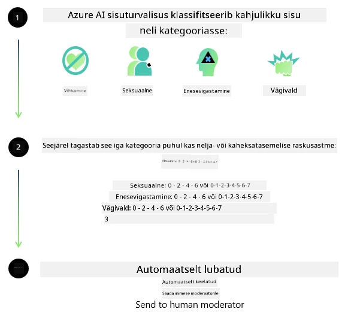
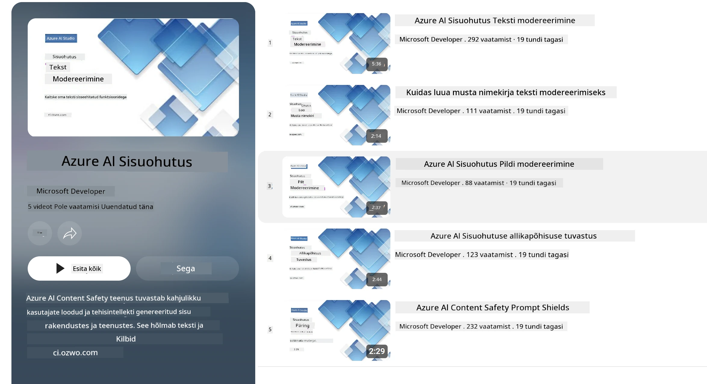

# AI ohutus Phi mudelite jaoks
Phi mudelite perekond on välja töötatud kooskõlas [Microsofti Väärika AI standardiga](https://www.microsoft.com/ai/principles-and-approach#responsible-ai-standard), mis on ettevõttesiseselt kehtestatud nõuete kogum, mis põhineb kuuel põhimõttel: vastutus, läbipaistvus, õiglus, usaldusväärsus ja ohutus, privaatsus ja turvalisus ning kaasatus, mis moodustavad [Microsofti Väärika AI põhimõtted](https://www.microsoft.com/ai/responsible-ai).

Nagu eelnevate Phi mudelite puhul, võeti kasutusele mitmetahuline ohutuse hindamine ja ohutuse järelkoolituse lähenemine, võttes täiendavaid meetmeid selle väljaande mitmekeelse suutlikkuse arvestamiseks. Meie lähenemine ohutuskoolitusele ja hindamisele, sealhulgas testimine mitmes keeles ja riskikategooriates, on kirjeldatud [Phi ohutuse järelkoolituse artiklis](https://arxiv.org/abs/2407.13833). Kuigi Phi mudelid saavad sellest lähenemisviisist kasu, peaksid arendajad rakendama vastutustundliku tehisintellekti parimaid tavasid, sealhulgas kaardi koostamist, mõõtmist ja riskide leevendamist, mis on seotud nende konkreetse kasutusjuhtumi ning kultuurilise ja keelelise kontekstiga.

## Parimad tavad

Nagu teised mudelid, võivad ka Phi mudelite perekonna mudelid käituda potentsiaalselt ebaõiglases, usaldusväärsuse kaotavat või solvavas viisis.

Mõned SLM-i ja LLM-i piiravad käitumisviisid, millest peaks teadlik olema, hõlmavad:

- **Teenuse kvaliteet:** Phi mudelid on peamiselt koolitatud inglise teksti põhjal. Muud keeled kui inglise keel kogevad halvemate tulemustega. Inglise keele variandid, mis on koolitusandmetes vähem esindatud, võivad kogeda halvemate tulemustega kui tavapärane Ameerika inglise keel.
- **Kahjude tootmine ja stereotüüpide kinnistamine:** Need mudelid võivad üle- või alahinnata inimrühmi, kustutada mõnede rühmade esindatust või tugevdada halvustavaid või negatiivseid stereotüüpe. Hoolimata ohutuse jälgimiskoolitusest võivad need piirangud endiselt esineda, kuna erinevate rühmade esindatus on erinev või koolitusandmetes esinevad negatiivsete stereotüüpide näited, mis peegeldavad reaalse maailma mustreid ja ühiskondlikke eelarvamusi.
- **Sobimatu või solvav sisu:** Need mudelid võivad toota teisi sobimatuid või solvavaid sisusid, mis võivad muuta nende kasutamise tundlikes kontekstides sobimatuks ilma kindlate kasutusjuhtumiga seotud täiendavate leevendusmeetmeteta.
- **Teabe usaldusväärsus:** Keelemudelid võivad genereerida mõttetut sisu või väljamõeldud sisu, mis võib küll kõlada mõistlikult, kuid on ebatäpne või aegunud.
- **Piiratud koodivaldkond:** Phi-3 koolitusandmete enamus põhineb Pythonil ja kasutab levinud pakette nagu "typing, math, random, collections, datetime, itertools". Kui mudel genereerib Pythoni skripte, mis kasutavad teisi pakette või skripte teistes keeltes, soovitame tungivalt kasutajatel käsitsi kontrollida kõiki API kasutusi.

Arendajad peaksid rakendama vastutustundliku AI parimaid tavasid ja vastutavad selle eest, et konkreetne kasutusjuhtum vastab asjakohastele seadustele ja määrustele (nt privaatsus, kaubandus jne).

## Vastutustundliku AI kaalutlused

Nagu teised keelemudelid, võivad Phi sarja mudelid käituda potentsiaalselt ebaõiglases, usaldusväärsuse kaotavas või solvavas viisis. Mõned piiravad käitumisviisid, millest teadlik olla, hõlmavad:

**Teenuse kvaliteet:** Phi mudelid on peamiselt koolitatud inglise teksti põhjal. Muud keeled kui inglise keel kogevad halvemate tulemustega. Inglise keele variandid, mis on koolitusandmetes vähem esindatud, võivad kogeda halvemate tulemustega kui tavapärane Ameerika inglise keel.

**Kahjude tootmine ja stereotüüpide kinnistamine:** Need mudelid võivad üle- või alahinnata inimrühmi, kustutada mõnede rühmade esindatust või tugevdada halvustavaid või negatiivseid stereotüüpe. Hoolimata ohutuse jälgimiskoolitusest võivad need piirangud endiselt esineda, kuna erinevate rühmade esindatus on erinev või koolitusandmetes esinevad negatiivsete stereotüüpide näited, mis peegeldavad reaalse maailma mustreid ja ühiskondlikke eelarvamusi.

**Sobimatu või solvav sisu:** Need mudelid võivad toota teisi sobimatuid või solvavaid sisusid, mis võivad muuta nende kasutamise tundlikes kontekstides sobimatuks ilma kindlate kasutusjuhtumiga seotud täiendavate leevendusmeetmeteta.
Teabe usaldusväärsus: Keelemudelid võivad genereerida mõttetut sisu või väljamõeldud sisu, mis võib küll kõlada mõistlikult, kuid on ebatäpne või aegunud.

**Piiratud koodivaldkond:** Phi-3 koolitusandmete enamus põhineb Pythonil ja kasutab levinud pakette nagu "typing, math, random, collections, datetime, itertools". Kui mudel genereerib Pythoni skripte, mis kasutavad teisi pakette või skripte teistes keeltes, soovitame tungivalt kasutajatel käsitsi kontrollida kõiki API kasutusi.

Arendajad peaksid rakendama vastutustundliku AI parimaid tavasid ja vastutavad selle eest, et konkreetne kasutusjuhtum vastab asjakohastele seadustele ja määrustele (nt privaatsus, kaubandus jne). Olulised kaalutlusalad hõlmavad:

**Alokasiion:** Mudelid ei pruugi sobida olukordadesse, mis võivad oluliselt mõjutada õiguslikku staatust või ressursside või elu võimaluste jaotust (nt eluaseme, töö, krediidi jms puhul) ilma täiendavate hindamiste ja täiendavate kallutatuse vähendamise tehnikateta.

**Kõrge riskiga olukorrad:** Arendajad peaksid hindama mudelite sobivust kasutada kõrge riskiga olukordades, kus ebaõiglased, usaldusväärsuse kaotanud või solvavad väljundid võivad põhjustada suuri kulusid või kahju. See hõlmab tundlikes või ekspertvaldkondades nõuandmise pakkumist, kus täpsus ja usaldusväärsus on kriitilise tähtsusega (nt juriidiline või tervisenõuanne). Täiendavad turvameetmed tuleks rakendada rakendustasemel vastavalt kasutuselevõtu kontekstile.

**Valeinfo levitamine:** Mudelid võivad toota ebatäpset teavet. Arendajad peaksid järgima läbipaistvuse parimaid tavasid ja teavitama lõppkasutajaid, et nad suhtlevad AI-süsteemiga. Rakendustasemel saavad arendajad ehitada tagasisidemehhanisme ja torusid, et vastused põhineksid kasutusjuhtumi spetsiifilisel, kontekstipõhisel teabel, mida tuntakse kui Retrieval Augmented Generation (RAG).

**Kahjuliku sisu genereerimine:** Arendajad peaksid hindama väljundeid nende kontekstis ning kasutama olemasolevaid ohutuskahjurite klassifikaatoreid või oma lahendusi, mis sobivad nende kasutusjuhtumiga.

**Valekasutus:** Võivad esineda ka muud valekasutuse vormid nagu pettus, rämpspost või pahavara tootmine, ning arendajad peaksid tagama, et nende rakendused ei riku kehtivaid seadusi ja määrusi.

### Peenhäälestus ja AI sisu ohutus

Pärast mudeli peenhäälestust soovitame tungivalt kasutada [Azure AI Content Safety](https://learn.microsoft.com/azure/ai-services/content-safety/overview) meetmeid mudelite poolt genereeritud sisu jälgimiseks, võimalike riskide, ohtude ja kvaliteediprobleemide tuvastamiseks ja blokeerimiseks.

[Azure AI Content Safety](https://learn.microsoft.com/azure/ai-services/content-safety/overview) toetab nii teksti kui ka pildi sisu. Seda saab juurutada pilves, ühenduseta konteinerites ja serva/sisesseadmetes.

## Ülevaade Azure AI Content Safety'st

Azure AI Content Safety ei ole kõikidele sobiv universaallahendus; seda saab kohandada vastavaks ettevõtete spetsiifiliste poliitikatega. Lisaks võimaldavad selle mitmekeelsed mudelid mõista korraga mitut keelt.

- **Azure AI Content Safety**
- **Microsoft Developer**
- **5 videot**

Azure AI Content Safety teenus tuvastab kahjuliku kasutajate ja AI poolt genereeritud sisu rakendustes ja teenustes. See sisaldab teksti ja pildi API-sid, mis võimaldavad tuvastada kahjulikku või sobimatut materjali.

[AI Content Safety esitlusloend](https://www.youtube.com/playlist?list=PLlrxD0HtieHjaQ9bJjyp1T7FeCbmVcPkQ)

---

<!-- CO-OP TRANSLATOR DISCLAIMER START -->
**Vastutusest vabastamine**:
See dokument on tõlgitud AI tõlketeenuse [Co-op Translator](https://github.com/Azure/co-op-translator) abil. Kuigi me püüame täpsust, palun pange tähele, et automaatsed tõlked võivad sisaldada vigu või ebatäpsusi. Originaaldokument selle emakeeles tuleks lugeda autoriseeritud allikaks. Olulise teabe puhul soovitatakse professionaalset inimtõlget. Me ei vastuta selle tõlke kasutamisest tekkida võivate arusaamatuste või väärtõlgenduste eest.
<!-- CO-OP TRANSLATOR DISCLAIMER END -->