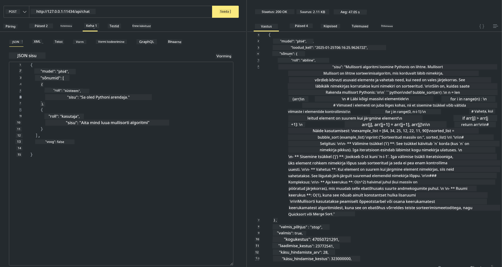

<!--
CO_OP_TRANSLATOR_METADATA:
{
  "original_hash": "2aa35f3c8b437fd5dc9995d53909d495",
  "translation_date": "2025-12-21T14:48:23+00:00",
  "source_file": "md/01.Introduction/02/04.Ollama.md",
  "language_code": "et"
}
-->
## Phi-perekond Ollamas


[Ollama](https://ollama.com) võimaldab rohkematel inimestel otse juurutada avatud lähtekoodiga LLM-e või SLM-e lihtsate skriptide abil ning saab ka luua API-sid, et aidata kohalikke Copiloti rakendussituatsioone.

## **1. Installimine**

Ollama toetab töötamist Windowsis, macOS-is ja Linuxis. Saate Ollama installida läbi selle lingi ([https://ollama.com/download](https://ollama.com/download)). Pärast edukat paigaldamist saate otse terminaliaknast kasutada Ollama skripti Phi-3 kutsumiseks. Kõiki [saadaval olevaid teeke Ollamas](https://ollama.com/library) näete linki järgides. Kui avate selle hoidla Codespace'is, on Ollama juba paigaldatud.

```bash

ollama run phi4

```

> [!NOTE]
> Mudel laetakse esmalt alla, kui käivitate selle esimest korda. Muidugi võite ka otse määrata juba alla laetud Phi-4 mudeli. Näiteks kasutame WSL-i selle käsu käivitamiseks. Kui mudel on edukalt alla laetud, saate terminalis otse suhelda.


## **2. Kutsu phi-4 API-d Ollamast**

Kui soovite kutsuda Phi-4 API-d, mida ollama genereerib, saate serveri käivitada järgmise terminalikäsuga.

```bash

ollama serve

```

> [!NOTE]
> Kui jooksutate macOS-i või Linuxi, pidage meeles, et võite kokku puutuda järgmise veateatega **"Error: listen tcp 127.0.0.1:11434: bind: address already in use"**. Selle vea võite saada käsu käivitamisel. Võite selle vea ignoreerida, kuna see tavaliselt viitab sellele, et server juba töötab, või võite Ollama peatada ja taaskäivitada:

**macOS**

```bash

brew services restart ollama

```

**Linux**

```bash

sudo systemctl stop ollama

```

Ollama toetab kahte API-d: generate ja chat. Soovi korral saate Ollama pakutavat mudeli API-d kutsuda, saates päringuid kohaliku teenuse aadressile, mis töötab pordil 11434.

**Chat**

```bash

curl http://127.0.0.1:11434/api/chat -d '{
  "model": "phi3",
  "messages": [
    {
      "role": "system",
      "content": "Your are a python developer."
    },
    {
      "role": "user",
      "content": "Help me generate a bubble algorithm"
    }
  ],
  "stream": false
  
}'
```

See on tulemus Postmanis



## Täiendavad ressursid

Vaadake Ollama saadaolevate mudelite nimekirja nende [teegist](https://ollama.com/library).

Tõmmake oma mudel Ollama serverist alla järgmise käsuga

```bash
ollama pull phi4
```

Käivitage mudel järgmise käsuga

```bash
ollama run phi4
```

***Märkus:*** Külastage seda linki [https://github.com/ollama/ollama/blob/main/docs/api.md](https://github.com/ollama/ollama/blob/main/docs/api.md), et saada rohkem teavet

## Ollama kutsumine Pythonist

Võite kasutada `requests` või `urllib3`, et teha päringuid kohaliku serveri lõpp-punktidele, mida eespool kasutati. Kuid populaarne viis Ollama kasutamiseks Pythonis on [openai](https://pypi.org/project/openai/) SDK kaudu, kuna Ollama pakub ka OpenAI-ühilduvaid serveri lõpp-punkte.

Siin on näide phi3-mini jaoks:

```python
import openai

client = openai.OpenAI(
    base_url="http://localhost:11434/v1",
    api_key="nokeyneeded",
)

response = client.chat.completions.create(
    model="phi4",
    temperature=0.7,
    n=1,
    messages=[
        {"role": "system", "content": "You are a helpful assistant."},
        {"role": "user", "content": "Write a haiku about a hungry cat"},
    ],
)

print("Response:")
print(response.choices[0].message.content)
```

## Ollama kutsumine JavaScriptist 

```javascript
// Näide faili kokkuvõtmisest Phi-4 abil
script({
    model: "ollama:phi4",
    title: "Summarize with Phi-4",
    system: ["system"],
})

// Näide kokkuvõtmisest
const file = def("FILE", env.files)
$`Summarize ${file} in a single paragraph.`
```

## Ollama kutsumine C#-ist

Looge uus C# konsoolirakendus ja lisage järgmine NuGet-pakett:

```bash
dotnet add package Microsoft.SemanticKernel --version 1.34.0
```

Seejärel asendage see kood failis `Program.cs`

```csharp
using Microsoft.SemanticKernel;
using Microsoft.SemanticKernel.ChatCompletion;

// add chat completion service using the local ollama server endpoint
#pragma warning disable SKEXP0001, SKEXP0003, SKEXP0010, SKEXP0011, SKEXP0050, SKEXP0052
builder.AddOpenAIChatCompletion(
    modelId: "phi4",
    endpoint: new Uri("http://localhost:11434/"),
    apiKey: "non required");

// invoke a simple prompt to the chat service
string prompt = "Write a joke about kittens";
var response = await kernel.InvokePromptAsync(prompt);
Console.WriteLine(response.GetValue<string>());
```

Käivitage rakendus järgmise käsuga:

```bash
dotnet run
```

---

<!-- CO-OP TRANSLATOR DISCLAIMER START -->
**Lahtiütlus**:
See dokument on tõlgitud tehisintellekti tõlketeenuse [Co-op Translator](https://github.com/Azure/co-op-translator) abil. Kuigi püüame tagada täpsust, võivad automaatsed tõlked sisaldada vigu või ebatäpsusi. Originaaldokumenti selle emakeeles tuleks pidada autoriteetseks allikaks. Olulise teabe puhul soovitatakse kasutada professionaalset inimtõlget. Me ei vastuta selle tõlke kasutamisest tulenevate arusaamatuste ega valesti tõlgendamise eest.
<!-- CO-OP TRANSLATOR DISCLAIMER END -->