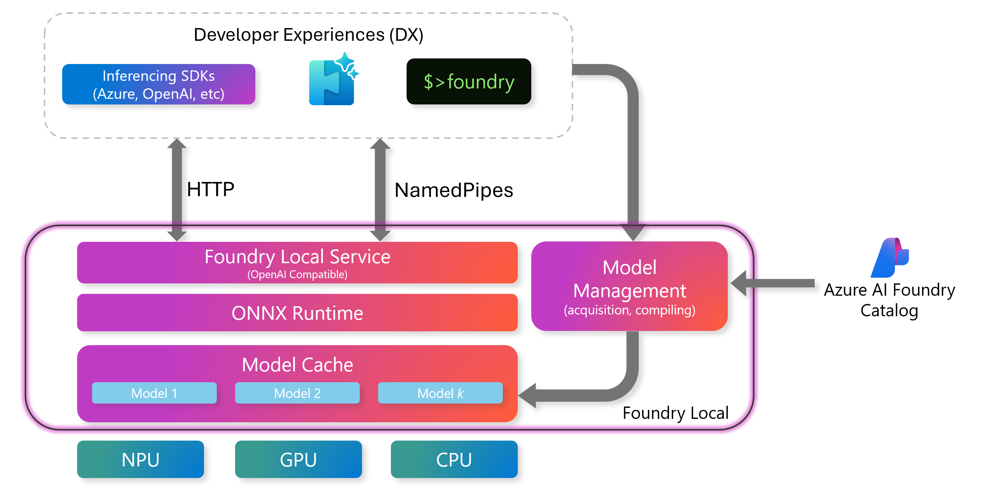
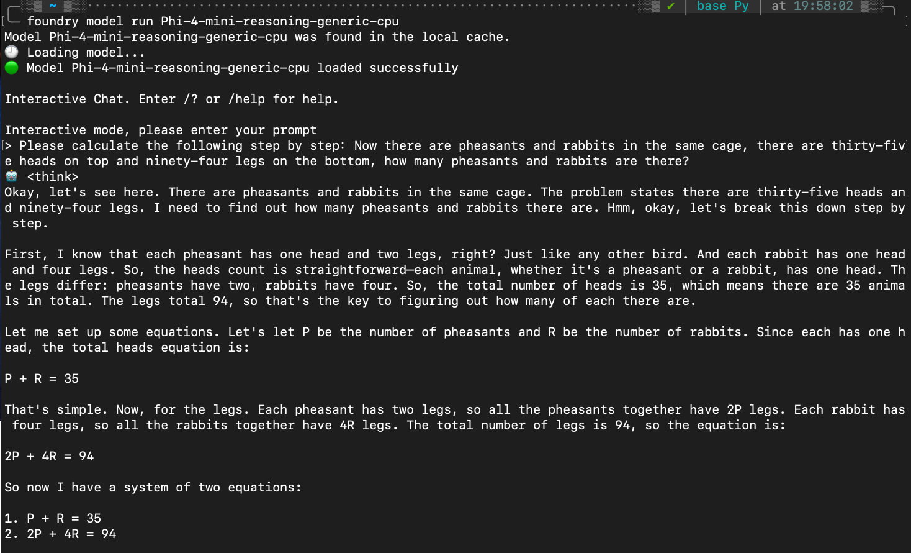

## Alustamine Phi-perekonna mudelitega Foundry Localis

### Sissejuhatus Foundry Localisse

Foundry Local on võimas seadmesisene AI järelduslahendus, mis toob ettevõtte tasemel AI võimekuse otse teie kohalikule riistvarale. See juhend aitab teil seadistada ja kasutada Phi-perekonna mudeleid Foundry Localis, pakkudes täielikku kontrolli teie AI töökoormuste üle, säilitades samal ajal privaatsuse ja vähendades kulusid.

Foundry Local pakub jõudlust, privaatsust, kohandatavust ja kuluefektiivsust, käivitades AI mudeleid otse teie seadmes. See integreerub sujuvalt teie olemasolevatesse töövoogudesse ja rakendustesse intuitiivse CLI, SDK ja REST API kaudu.



### Miks valida Foundry Local?

Foundry Locali eeliste mõistmine aitab teil teha teadlikke otsuseid oma AI juurutusstrateegia kohta:

- **Seadmesisene järeldus:** Käivitage mudeleid otse oma riistvaral, vähendades kulusid ja hoides kõik andmed oma seadmes.

- **Mudelite kohandamine:** Valige eelseadistatud mudelite hulgast või kasutage oma mudeleid, et vastata konkreetsetele nõuetele ja kasutusjuhtudele.

- **Kuluefektiivsus:** Kaotage korduvad pilveteenuste kulud, kasutades olemasolevat riistvara, muutes AI kättesaadavamaks.

- **Sujuv integreerimine:** Ühendage oma rakendustega SDK, API lõpp-punktide või CLI kaudu, võimaldades lihtsat skaleerimist Microsoft Foundry suunas vastavalt vajadusele.

> **Alustamise märkus:** See juhend keskendub Foundry Locali kasutamisele CLI ja SDK liideste kaudu. Õpite mõlemat lähenemist, et valida oma kasutusjuhtumi jaoks parim meetod.

## Osa 1: Foundry Local CLI seadistamine

### Samm 1: Paigaldamine

Foundry Local CLI on teie värav AI mudelite haldamiseks ja käivitamiseks kohapeal. Alustame selle paigaldamisest teie süsteemi.

**Toetatud platvormid:** Windows ja macOS

Üksikasjalike paigaldusjuhiste saamiseks vaadake [Foundry Locali ametlikku dokumentatsiooni](https://github.com/microsoft/Foundry-Local/blob/main/README.md).

### Samm 2: Saadaval olevate mudelite uurimine

Kui Foundry Local CLI on paigaldatud, saate uurida, millised mudelid on teie kasutusjuhtumi jaoks saadaval. See käsk kuvab kõik toetatud mudelid:

```bash
foundry model list
```

### Samm 3: Phi-perekonna mudelite mõistmine

Phi-perekond pakub erinevate kasutusjuhtude ja riistvarakonfiguratsioonide jaoks optimeeritud mudeleid. Siin on Foundry Localis saadaval olevad Phi-mudelid:

**Saadaval olevad Phi-mudelid:** 

- **phi-3.5-mini** - Kompaktne mudel põhiülesannete jaoks
- **phi-3-mini-128k** - Pikendatud konteksti versioon pikemate vestluste jaoks
- **phi-3-mini-4k** - Standardse konteksti mudel üldiseks kasutamiseks
- **phi-4** - Täiustatud mudel paremate võimekustega
- **phi-4-mini** - Kerge versioon Phi-4-st
- **phi-4-mini-reasoning** - Spetsialiseerunud keerukate loogiliste ülesannete lahendamiseks

> **Riistvara ühilduvus:** Iga mudelit saab konfigureerida erineva riistvara kiirenduse jaoks (CPU, GPU) sõltuvalt teie süsteemi võimekusest.

### Samm 4: Esimese Phi-mudeli käivitamine

Alustame praktilise näitega. Käivitame mudeli `phi-4-mini-reasoning`, mis on suurepärane keeruliste probleemide lahendamisel samm-sammult.

**Käsk mudeli käivitamiseks:**

```bash
foundry model run Phi-4-mini-reasoning-generic-cpu
```

> **Esimene seadistamine:** Mudelit esmakordselt käivitades laadib Foundry Local selle automaatselt teie kohalikku seadmesse. Allalaadimise aeg varieerub sõltuvalt teie võrgu kiirusest, seega olge esialgse seadistamise ajal kannatlik.

### Samm 5: Mudeli testimine reaalse probleemiga

Testime nüüd mudelit klassikalise loogikaprobleemiga, et näha, kuidas see samm-sammult loogilist arutlust rakendab:

**Näide probleemist:**

```txt
Please calculate the following step by step: Now there are pheasants and rabbits in the same cage, there are thirty-five heads on top and ninety-four legs on the bottom, how many pheasants and rabbits are there?
```

**Oodatav käitumine:** Mudel peaks jagama probleemi loogilisteks sammudeks, kasutades fakti, et faasanitel on 2 jalga ja jänestel 4 jalga, et lahendada võrrandisüsteem.

**Tulemused:**



## Osa 2: Rakenduste loomine Foundry Local SDK-ga

### Miks kasutada SDK-d?

Kuigi CLI sobib testimiseks ja kiireks suhtluseks, võimaldab SDK integreerida Foundry Locali rakendustesse programmeeritavalt. See avab võimalused:

- Kohandatud AI-põhiste rakenduste loomiseks
- Automatiseeritud töövoogude loomiseks
- AI võimekuse integreerimiseks olemasolevatesse süsteemidesse
- Vestlusrobotite ja interaktiivsete tööriistade arendamiseks

### Toetatud programmeerimiskeeled

Foundry Local pakub SDK tuge mitmele programmeerimiskeelele, et sobituda teie arenduskeskkonnaga:

**📦 Saadaval olevad SDK-d:**

- **C# (.NET):** [SDK dokumentatsioon ja näited](https://github.com/microsoft/Foundry-Local/tree/main/sdk/cs)
- **Python:** [SDK dokumentatsioon ja näited](https://github.com/microsoft/Foundry-Local/tree/main/sdk/python)
- **JavaScript:** [SDK dokumentatsioon ja näited](https://github.com/microsoft/Foundry-Local/tree/main/sdk/js)
- **Rust:** [SDK dokumentatsioon ja näited](https://github.com/microsoft/Foundry-Local/tree/main/sdk/rust)

### Järgmised sammud

1. **Valige oma eelistatud SDK** vastavalt oma arenduskeskkonnale
2. **Järgige SDK-spetsiifilist dokumentatsiooni** üksikasjalike rakendusjuhendite jaoks
3. **Alustage lihtsate näidetega** enne keerukate rakenduste loomist
4. **Uurige näidiskoodi**, mis on saadaval igas SDK repos

## Kokkuvõte

Olete nüüd õppinud:
- ✅ Foundry Local CLI paigaldamist ja seadistamist
- ✅ Phi-perekonna mudelite avastamist ja käivitamist
- ✅ Mudelite testimist reaalsete probleemidega
- ✅ SDK valikuid rakenduste arendamiseks

Foundry Local pakub võimast alust AI võimekuse toomiseks otse teie kohalikku keskkonda, andes teile kontrolli jõudluse, privaatsuse ja kulude üle, säilitades samal ajal paindlikkuse pilvelahenduste skaleerimiseks vastavalt vajadusele.

---

**Lahtiütlus**:  
See dokument on tõlgitud AI tõlketeenuse [Co-op Translator](https://github.com/Azure/co-op-translator) abil. Kuigi püüame tagada täpsust, palume arvestada, et automaatsed tõlked võivad sisaldada vigu või ebatäpsusi. Algne dokument selle algses keeles tuleks pidada autoriteetseks allikaks. Olulise teabe puhul soovitame kasutada professionaalset inimtõlget. Me ei vastuta selle tõlke kasutamisest tulenevate arusaamatuste või valesti tõlgenduste eest.