# Peenhäälesta ja integreeri kohandatud Phi-3 mudelid Prompt flow's Azure AI Foundry's

See otsast lõpuni (E2E) näide põhineb Microsoft Tech Community juhendil "[Fine-Tune and Integrate Custom Phi-3 Models with Prompt Flow in Azure AI Foundry](https://techcommunity.microsoft.com/t5/educator-developer-blog/fine-tune-and-integrate-custom-phi-3-models-with-prompt-flow-in/ba-p/4191726?WT.mc_id=aiml-137032-kinfeylo)". See tutvustab peenhäälestuse, juurutamise ja kohandatud Phi-3 mudelite integreerimise protsesse Prompt flow’s Azure AI Foundry's.
Erinevalt E2E näitest, "[Fine-Tune and Integrate Custom Phi-3 Models with Prompt Flow](./E2E_Phi-3-FineTuning_PromptFlow_Integration.md)", mis nõudis koodi käivitamist lokaalselt, keskendub see juhend täielikult mudeli peenhäälestusele ja integreerimisele Azure AI / ML Studio's.

## Ülevaade

Selles E2E näites õpite, kuidas peenhäälestada Phi-3 mudelit ja integreerida seda Prompt flow's Azure AI Foundry's. Kasutades Azure AI / ML Studio't, loote töövoo kohandatud tehisintellekti mudelite juurutamiseks ja kasutamiseks. See E2E näide on jaotatud kolmeks stsenaariumiks:

**Stsenaarium 1: Azure ressursside seadistamine ja peenhäälestuseks ettevalmistamine**

**Stsenaarium 2: Phi-3 mudeli peenhäälestus ja juurutamine Azure Machine Learning Studio's**

**Stsenaarium 3: Integreerimine Prompt flow'ga ja vestlus kohandatud mudeliga Azure AI Foundry's**

Siin on selle E2E näite ülevaade.

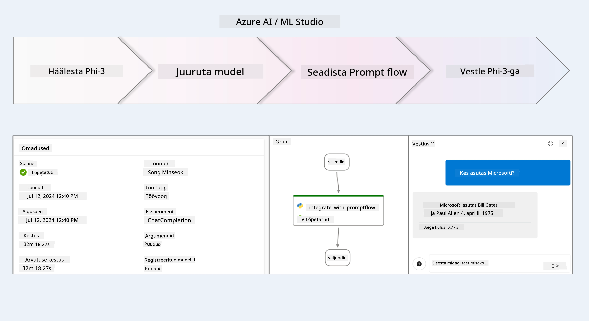

### Sisukord

1. **[Stsenaarium 1: Azure ressursside seadistamine ja peenhäälestuseks ettevalmistamine](../../../../../../md/02.Application/01.TextAndChat/Phi3)**
    - [Loo Azure Machine Learning tööruum](../../../../../../md/02.Application/01.TextAndChat/Phi3)
    - [Pöörduge Azure tellimuse GPU kvootide taotlemiseks](../../../../../../md/02.Application/01.TextAndChat/Phi3)
    - [Lisa rolli määramine](../../../../../../md/02.Application/01.TextAndChat/Phi3)
    - [Projekti seadistamine](../../../../../../md/02.Application/01.TextAndChat/Phi3)
    - [Valmistage andmekogum peenhäälestuseks ette](../../../../../../md/02.Application/01.TextAndChat/Phi3)

1. **[Stsenaarium 2: Phi-3 mudeli peenhäälestus ja juurutamine Azure Machine Learning Studio's](../../../../../../md/02.Application/01.TextAndChat/Phi3)**
    - [Peenhäälesta Phi-3 mudel](../../../../../../md/02.Application/01.TextAndChat/Phi3)
    - [Juuruta peenhäälestatud Phi-3 mudel](../../../../../../md/02.Application/01.TextAndChat/Phi3)

1. **[Stsenaarium 3: Integreerimine Prompt flow'ga ja vestlus kohandatud mudeliga Azure AI Foundry's](../../../../../../md/02.Application/01.TextAndChat/Phi3)**
    - [Integreeri kohandatud Phi-3 mudel Prompt flow'ga](../../../../../../md/02.Application/01.TextAndChat/Phi3)
    - [Vestle oma kohandatud Phi-3 mudeliga](../../../../../../md/02.Application/01.TextAndChat/Phi3)

## Stsenaarium 1: Azure ressursside seadistamine ja peenhäälestuseks ettevalmistamine

### Loo Azure Machine Learning tööruum

1. Tippige portaali lehe ülaosas olevasse **otsinguribale** *azure machine learning* ja valige kuvatavatest valikutest **Azure Machine Learning**.

    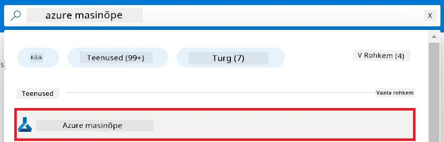

2. Valige navigeerimismenüüst **+ Create**.

3. Valige navigeerimismenüüst **New workspace**.

    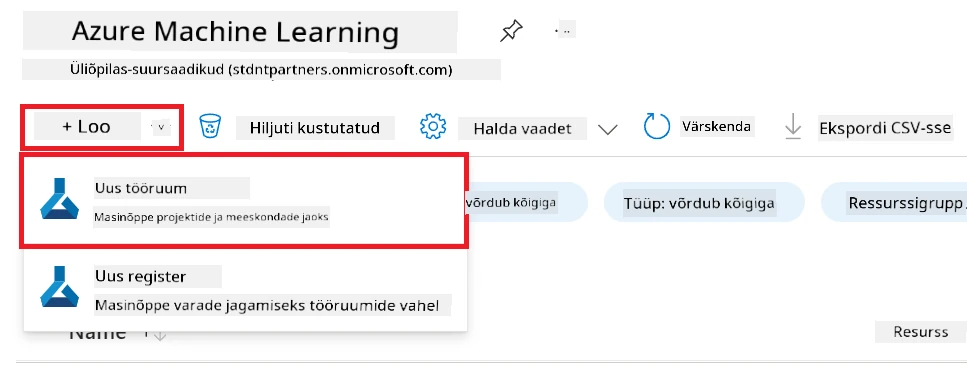

4. Tehke järgmised toimingud:

    - Valige oma Azure **Subscription**.
    - Valige kasutamiseks **Resource group** (loon uue, kui vaja).
    - Sisestage **Workspace Name**. See peab olema unikaalne väärtus.
    - Valige soovitud **Region**.
    - Valige kasutamiseks **Storage account** (loon uue, kui vaja).
    - Valige kasutamiseks **Key vault** (loon uue, kui vaja).
    - Valige kasutamiseks **Application insights** (loon uue, kui vaja).
    - Valige kasutamiseks **Container registry** (loon uue, kui vaja).

    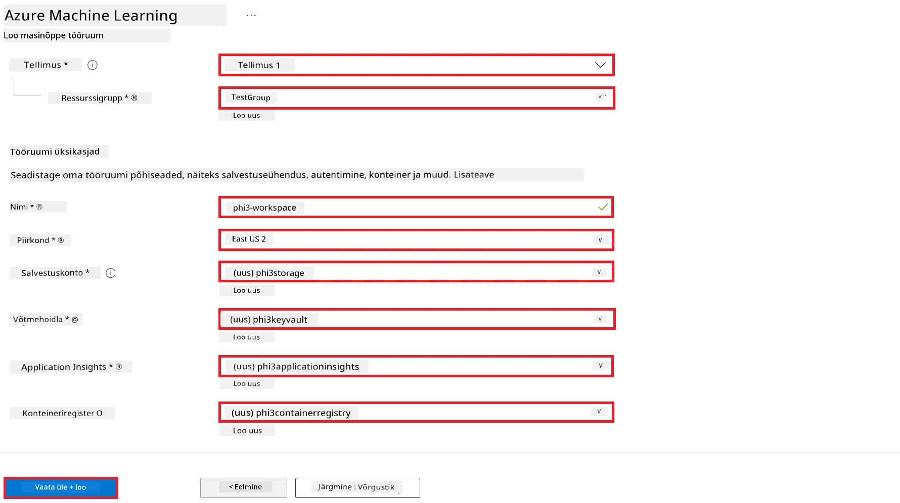

5. Valige **Review + Create**.

6. Valige **Create**.

### Pöörduge Azure tellimuse GPU kvootide taotlemiseks

Selles juhendis õpite, kuidas peenhäälestada ja juurutada Phi-3 mudelit, kasutades GPU-sid. Peenhäälestuseks kasutate *Standard_NC24ads_A100_v4* GPU-d, mille jaoks on vaja kvooti taotleda. Juurutamiseks kasutate *Standard_NC6s_v3* GPU-d, milleks on samuti vaja kvooti taotleda.

> [!NOTE]
>
> Ainult Pay-As-You-Go tüüpi tellimused (tavapärane tellimustüüp) on GPU ressursside eraldamiseks sobilikud; kasu tellimused pole hetkel toetatud.
>

1. Külastage [Azure ML Studio](https://ml.azure.com/home?wt.mc_id=studentamb_279723).

1. Tehke järgmised toimingud, et taotleda *Standard NCADSA100v4 Family* kvooti:

    - Valige vasaku külje vahekaardilt **Quota**.
    - Valige kasutatav **Virtual machine family**. Näiteks valige **Standard NCADSA100v4 Family Cluster Dedicated vCPUs**, mis sisaldab *Standard_NC24ads_A100_v4* GPU-d.
    - Valige navigeerimismenüüst **Request quota**.

        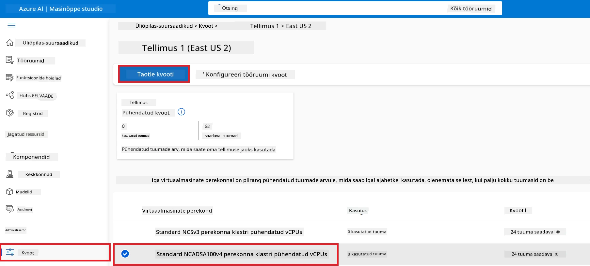

    - Taotluse lehel sisestage soovitud **New cores limit**, näiteks 24.
    - Taotluse lehel valige **Submit**, et esitada GPU kvooti taotlus.

1. Tehke järgmised toimingud, et taotleda *Standard NCSv3 Family* kvooti:

    - Valige vasaku külje vahekaardilt **Quota**.
    - Valige kasutatav **Virtual machine family**. Näiteks valige **Standard NCSv3 Family Cluster Dedicated vCPUs**, mis sisaldab *Standard_NC6s_v3* GPU-d.
    - Valige navigeerimismenüüst **Request quota**.
    - Sisestage soovitud **New cores limit**, näiteks 24.
    - Valige **Submit**, et saata GPU kvootide taotlus.

### Lisa rolli määramine

Mudelite peenhäälestamiseks ja juurutamiseks peate esmalt looma kasutaja määratud haldatud identiteedi (User Assigned Managed Identity - UAI) ja määrama sellele sobivad õigused. Seda UAI-d kasutatakse autentimiseks juurutamise ajal.

#### Loo kasutaja määratud haldatud identiteet (UAI)

1. Tippige portaali lehe ülaosas **otsinguribale** *managed identities* ja valige kuvatavatest valikutest **Managed Identities**.

    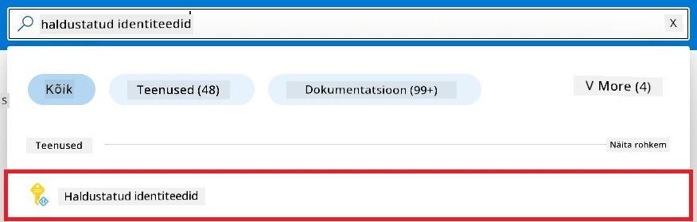

1. Valige **+ Create**.

    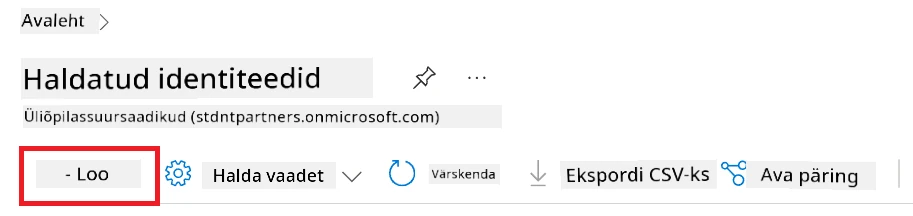

1. Tehke järgmised toimingud:

    - Valige oma Azure **Subscription**.
    - Valige kasutamiseks **Resource group** (loon uue, kui vaja).
    - Valige soovitud **Region**.
    - Sisestage **Name**. See peab olema unikaalne väärtus.

    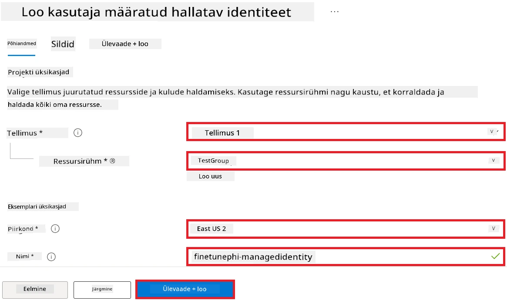

1. Valige **Review + create**.

1. Valige **+ Create**.

#### Määra haldatud identiteedile Contributor roll

1. Navigeerige loodud haldatud identiteedi ressursile.

1. Valige vasaku külje vahekaardilt **Azure role assignments**.

1. Valige navigeerimismenüüst **+Add role assignment**.

1. Määramise lehel tehke järgnevad toimingud:
    - Valige **Scope** väärtuseks **Resource group**.
    - Valige oma Azure **Subscription**.
    - Valige kasutatav **Resource group**.
    - Valige rolliks **Contributor**.

    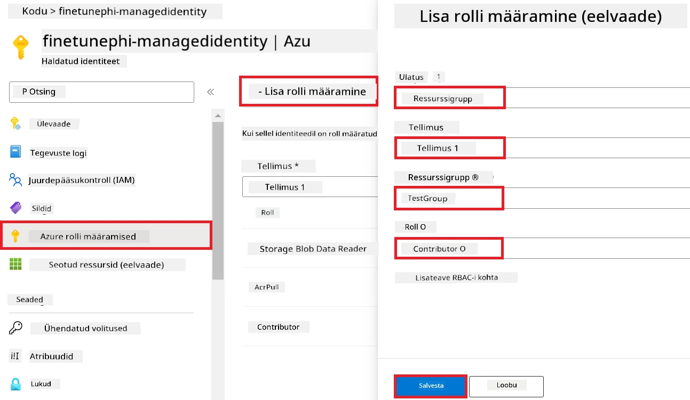

2. Valige **Save**.

#### Määra haldatud identiteedile Storage Blob Data Reader roll

1. Tippige portaali lehe ülaosas **otsinguribale** *storage accounts* ja valige kuvatavatest valikutest **Storage accounts**.

    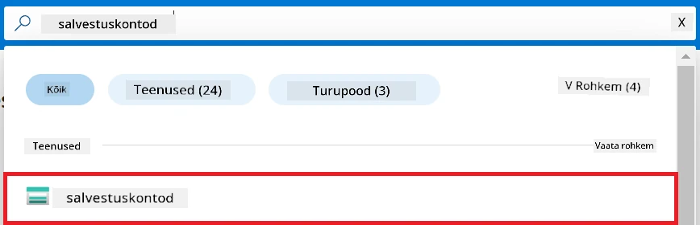

1. Valige salvestuskonto, mis on seotud loodud Azure Machine Learning tööruumiga. Näiteks, *finetunephistorage*.

1. Tehke järgmised toimingud, et jõuda rolli lisamise lehele:

    - Navigeerige loodud Azure Storage kontole.
    - Valige vasakult vahekaardilt **Access Control (IAM)**.
    - Valige navigeerimismenüüst **+ Add**.
    - Valige navigeerimismenüüst **Add role assignment**.

    

1. Rolli lisamise lehel tehke järgmised toimingud:

    - Rolli lehel tippige **otsinguribale** *Storage Blob Data Reader* ja valige kuvatavatest valikutest **Storage Blob Data Reader**.
    - Rolli lehel valige **Next**.
    - Liikmete lehel valige **Assign access to** **Managed identity**.
    - Liikmete lehel valige **+ Select members**.
    - Valige oma Azure **Subscription**.
    - Valige haldatud identiteediks **Manage Identity**.
    - Valige loodud haldatud identiteet, näiteks *finetunephi-managedidentity*.
    - Valige **Select**.

    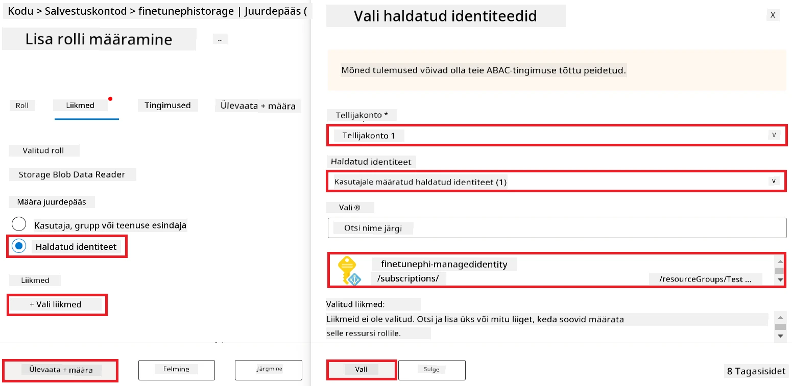

1. Valige **Review + assign**.

#### Määra haldatud identiteedile AcrPull roll

1. Tippige portaali lehe ülaosas **otsinguribale** *container registries* ja valige kuvatavatest valikutest **Container registries**.

    

1. Valige konteineriregister, mis on seotud Azure Machine Learning tööruumiga. Näiteks, *finetunephicontainerregistry*.

1. Tehke järgmised toimingud, et jõuda rolli lisamise lehele:

    - Valige vasakult vahekaardilt **Access Control (IAM)**.
    - Valige navigeerimismenüüst **+ Add**.
    - Valige navigeerimismenüüst **Add role assignment**.

1. Rolli lisamise lehel tehke järgmised toimingud:

    - Rolli lehel tippige **otsinguribale** *AcrPull* ja valige kuvatavatest valikutest **AcrPull**.
    - Rolli lehel valige **Next**.
    - Liikmete lehel valige **Assign access to** **Managed identity**.
    - Liikmete lehel valige **+ Select members**.
    - Valige oma Azure **Subscription**.
    - Valige haldatud identiteediks **Manage Identity**.
    - Valige loodud haldatud identiteet, näiteks *finetunephi-managedidentity*.
    - Valige **Select**.
    - Valige **Review + assign**.

### Projekti seadistamine

Peenhäälestuseks vajalike andmekogumite allalaadimiseks seadistate lokaalse keskkonna.

Selles ülesandes:

- Loote kausta, kus töötada.
- Loote virtuaalse keskkonna.
- Installite vajalikud paketid.
- Loote *download_dataset.py* faili andmekogumi allalaadimiseks.

#### Looge kaust, kus töötada

1. Avage terminal ja tippige järgmine käsk, et luua vaikimisi asukohta kaust nimega *finetune-phi*.

    ```console
    mkdir finetune-phi
    ```

2. Tippige oma terminali järgmine käsk, et liikuda loodud *finetune-phi* kausta.

    ```console
    cd finetune-phi
    ```

#### Loo virtuaalne keskkond

1. Tippige oma terminali järgmine käsk, et luua virtuaalne keskkond nimega *.venv*.

    ```console
    python -m venv .venv
    ```

2. Tippige oma terminali järgmine käsk, et aktiveerida virtuaalne keskkond.

    ```console
    .venv\Scripts\activate.bat
    ```

> [!NOTE]
> Kui see toimis, peaksite nägema *(.venv)* käsurea viiba ees.

#### Paigaldage vajalikud paketid

1. Tippige oma terminali järgmised käsud, et paigaldada vajalikud paketid.

    ```console
    pip install datasets==2.19.1
    ```

#### Looge `donload_dataset.py`

> [!NOTE]
> Täielik kaustastruktuur:
>
> ```text
> └── YourUserName
> .    └── finetune-phi
> .        └── download_dataset.py
> ```

1. Avage **Visual Studio Code**.

1. Valige menüüribalt **File**.

1. Valige **Open Folder**.

1. Valige loodud *finetune-phi* kaust, mis asub aadressil *C:\Users\yourUserName\finetune-phi*.

    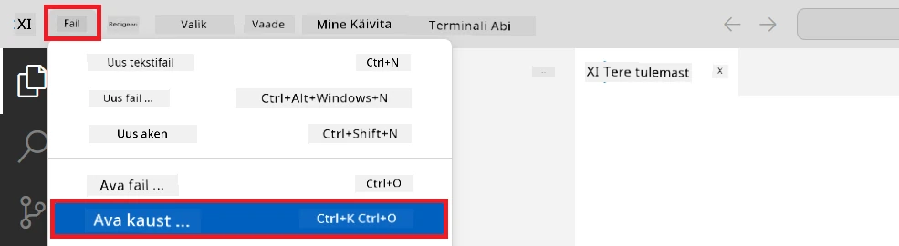

1. Visual Studio Code vasakul paanil paremklõpsake ja valige **New File**, et luua uus fail nimega *download_dataset.py*.

    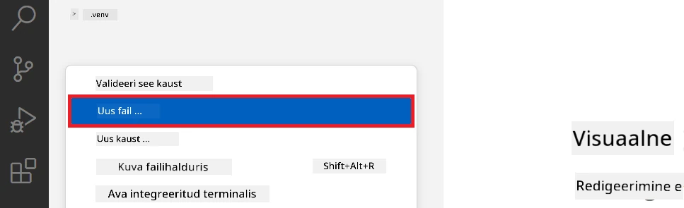

### Valmistage andmekogum ette täiendõppeks

Selles harjutuses käivitate *download_dataset.py* faili, et laadida alla *ultrachat_200k* andmekogud oma kohalikku keskkonda. Seejärel kasutate seda andmekogu Phi-3 mudeli täiendõppeks Azure Machine Learning'is.

Selles harjutuses teete:

- Lisate koodi *download_dataset.py* faili, et alla laadida andmekogud.
- Käivitate *download_dataset.py* faili, et laadida andmekogud oma kohalikku keskkonda.

#### Laadige alla oma andmekogu kasutades *download_dataset.py*

1. Avage *download_dataset.py* fail Visual Studio Code'is.

1. Lisage järgmine kood *download_dataset.py* faili.

    ```python
    import json
    import os
    from datasets import load_dataset

    def load_and_split_dataset(dataset_name, config_name, split_ratio):
        """
        Load and split a dataset.
        """
        # Laadi andmekogu määratud nime, konfiguratsiooni ja jaotuse suhtega
        dataset = load_dataset(dataset_name, config_name, split=split_ratio)
        print(f"Original dataset size: {len(dataset)}")
        
        # Jaga andmekogu treening- ja testandmete komplektideks (80% treening, 20% test)
        split_dataset = dataset.train_test_split(test_size=0.2)
        print(f"Train dataset size: {len(split_dataset['train'])}")
        print(f"Test dataset size: {len(split_dataset['test'])}")
        
        return split_dataset

    def save_dataset_to_jsonl(dataset, filepath):
        """
        Save a dataset to a JSONL file.
        """
        # Loo kaust, kui see ei eksisteeri
        os.makedirs(os.path.dirname(filepath), exist_ok=True)
        
        # Ava fail kirjutusrežiimis
        with open(filepath, 'w', encoding='utf-8') as f:
            # Itereeri üle iga kirje andmekogus
            for record in dataset:
                # Kirjuta kirje JSON-objektina faili
                json.dump(record, f)
                # Kirjuta kirjade eraldamiseks reavahetusmärk
                f.write('\n')
        
        print(f"Dataset saved to {filepath}")

    def main():
        """
        Main function to load, split, and save the dataset.
        """
        # Laadi ja jaga ULTRACHAT_200k andmekogu kindla konfiguratsiooni ja jaotuse suhtega
        dataset = load_and_split_dataset("HuggingFaceH4/ultrachat_200k", 'default', 'train_sft[:1%]')
        
        # Erota treening- ja testandmekogud jaotusest
        train_dataset = dataset['train']
        test_dataset = dataset['test']

        # Salvesta treeningandmekogu JSONL-failina
        save_dataset_to_jsonl(train_dataset, "data/train_data.jsonl")
        
        # Salvesta testandmekogu eraldi JSONL-failina
        save_dataset_to_jsonl(test_dataset, "data/test_data.jsonl")

    if __name__ == "__main__":
        main()

    ```

1. Tippige oma terminali järgmine käsk, et käivitada skript ja laadida andmekogu oma kohalikku keskkonda.

    ```console
    python download_dataset.py
    ```

1. Kontrollige, et andmekogud oleksid edukalt salvestatud teie kohalikku *finetune-phi/data* kataloogi.

> [!NOTE]
>
> #### Märkus andmekogu suuruse ja täiendõppe aja kohta
>
> Selles juhendis kasutate ainult 1% andmekogust (`split='train[:1%]'`). See vähendab oluliselt andmete hulka ja kiirendab nii üleslaadimist kui ka täiendõppe protsessi. Võite protsenti kohandada, et leida sobiv tasakaal treeningaja ja mudeli jõudluse vahel. Väiksema andmeosa kasutamine lühendab täiendõppe aega, muutes protsessi juhendi jaoks hallatavaks.

## Stsenaarium 2: Phi-3 mudeli täiendõpe ja juurutamine Azure Machine Learning Studio's

### Phi-3 mudeli täiendõpe

Selles harjutuses teete Phi-3 mudeli täiendõppe Azure Machine Learning Studio's.

Selles harjutuses teete:

- Loote arvutiklustri täiendõppeks.
- Täiendõppete Phi-3 mudeli Azure Machine Learning Studio's.

#### Looge arvutiklaster täiendõppeks

1. Minge aadressile [Azure ML Studio](https://ml.azure.com/home?wt.mc_id=studentamb_279723).

1. Valige vasakult vahekaardilt **Compute**.

1. Valige navigeerimismenüüst **Compute clusters**.

1. Valige **+ New**.

    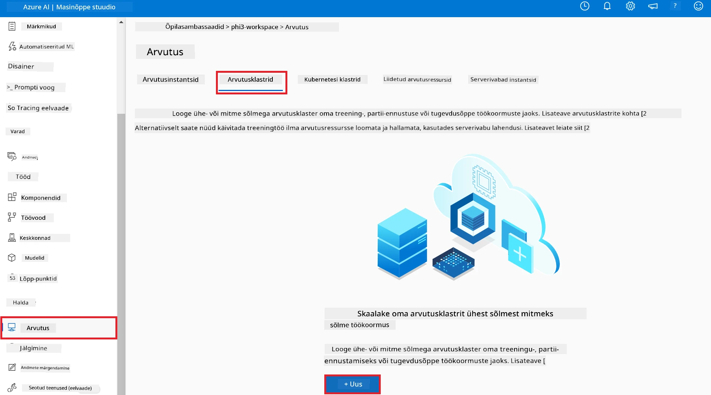

1. Tehke järgnevad toimingud:

    - Valige soovitud **Region**.
    - Valige **Virtual machine tier** väärtuseks **Dedicated**.
    - Valige **Virtual machine type** väärtuseks **GPU**.
    - Filtreerige **Virtual machine size** valikuteks **Select from all options**.
    - Valige **Virtual machine size** väärtuseks **Standard_NC24ads_A100_v4**.

    

1. Valige **Next**.

1. Tehke järgnevad toimingud:

    - Sisestage **Compute name**. See peab olema unikaalne.
    - Valige **Minimum number of nodes** väärtuseks **0**.
    - Valige **Maximum number of nodes** väärtuseks **1**.
    - Valige **Idle seconds before scale down** väärtuseks **120**.

    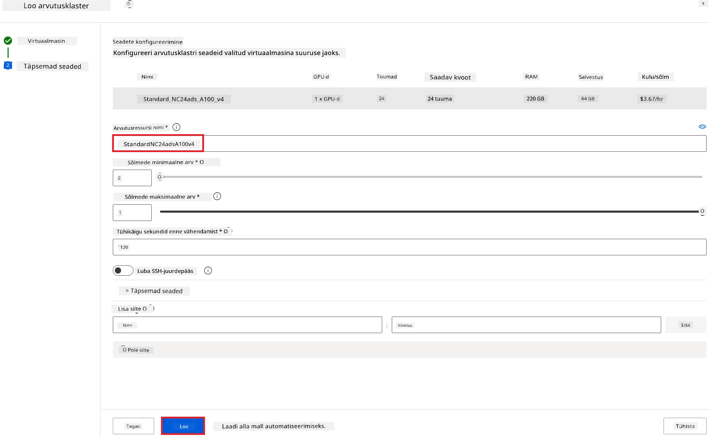

1. Valige **Create**.

#### Täiendõppige Phi-3 mudelit

1. Minge aadressile [Azure ML Studio](https://ml.azure.com/home?wt.mc_id=studentamb_279723).

1. Valige loodud Azure Machine Learning tööruum.

    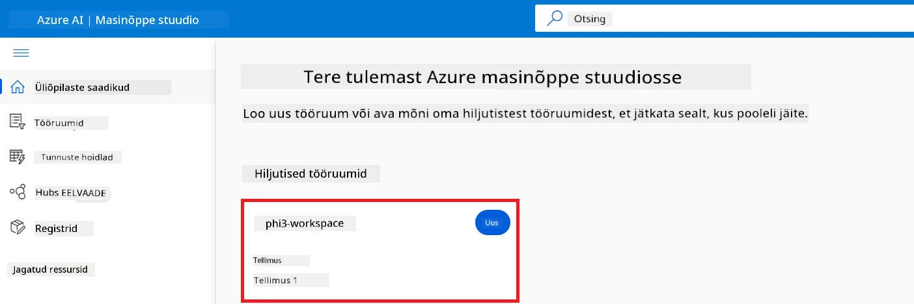

1. Tehke järgnevad toimingud:

    - Valige vasakult vahekaardilt **Model catalog**.
    - Tippige **otsinguribale** *phi-3-mini-4k* ning valige valikutest **Phi-3-mini-4k-instruct**.

    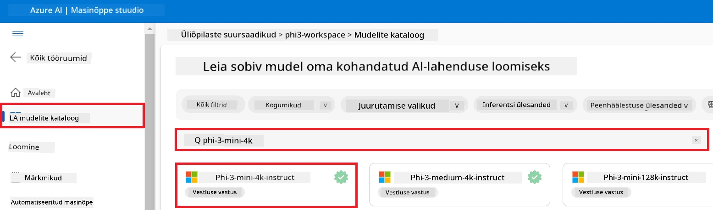

1. Valige navigeerimismenüüst **Fine-tune**.

    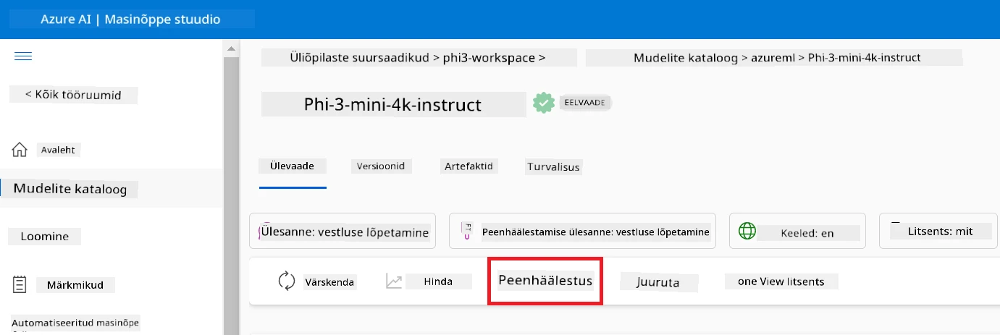

1. Tehke järgnevad toimingud:

    - Valige **Select task type** väärtuseks **Chat completion**.
    - Valige **+ Select data**, et üles laadida **Traning data**.
    - Valige valideerimisandmete üleslaadimise tüübiks **Provide different validation data**.
    - Valige **+ Select data**, et üles laadida **Validation data**.

    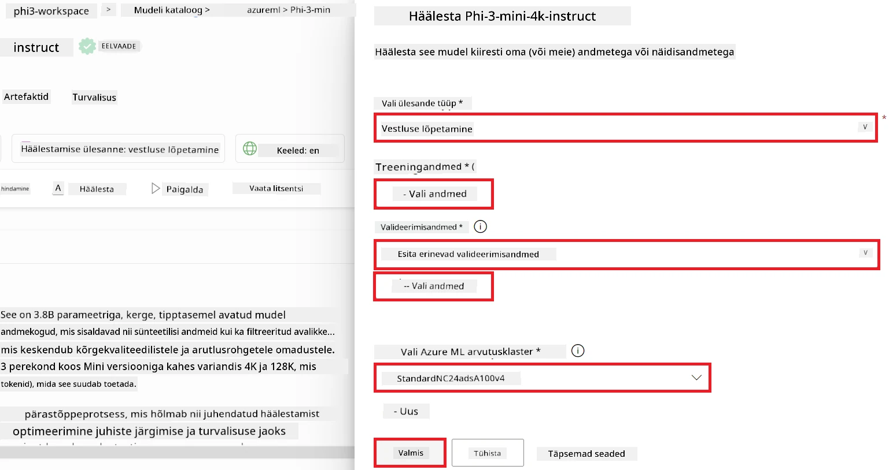

> [!TIP]
>
> Võite valida **Advanced settings**, et kohandada näiteks **learning_rate** ja **lr_scheduler_type**, optimeerides täiendõppe protsessi vastavalt oma vajadustele.

1. Valige **Finish**.

1. Selles harjutuses täiendõppisite edukalt Phi-3 mudelit Azure Machine Learning abil. Pange tähele, et täiendõppe protsess võib võtta märkimisväärselt aega. Pärast täiendõppe tööaja käivitamist peate ootama selle lõpetamist. Täiendõppe töö olekut saate jälgida, minnes Azure Machine Learning tööruumi vasakult vahekaardilt "Jobs". Järgnevates osades juurutate täiendõppinud mudeli ja integreerite selle Prompt flowga.

    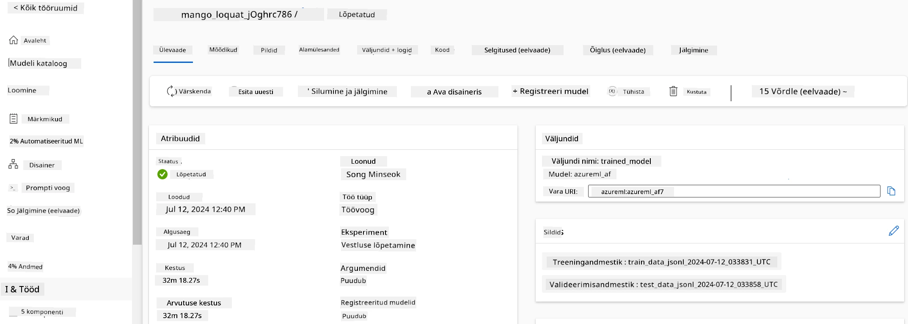

### Juurutage täiendõppinud Phi-3 mudel

Et integreerida täiendõppinud Phi-3 mudelit Prompt flowga, peate mudeli juurutama, et teha see reaalajas ennustamiseks ligipääsetavaks. See protsess hõlmab mudeli registreerimist, veebipõhise lõpp-punkti loomist ja mudeli juurutamist.

Selles harjutuses teete:

- Registreerite täiendõppinud mudeli Azure Machine Learning tööruumis.
- Loote veebipõhise lõpp-punkti.
- Juurutate registreeritud täiendõppinud Phi-3 mudeli.

#### Registreerige täiendõppinud mudel

1. Minge aadressile [Azure ML Studio](https://ml.azure.com/home?wt.mc_id=studentamb_279723).

1. Valige loodud Azure Machine Learning tööruum.

    

1. Valige vasakult vahekaardilt **Models**.
1. Valige **+ Register**.
1. Valige **From a job output**.

    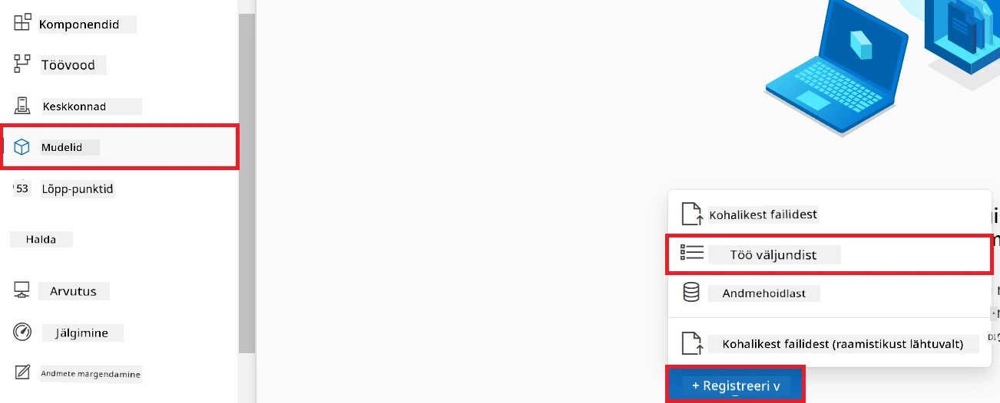

1. Valige loodud töö.

    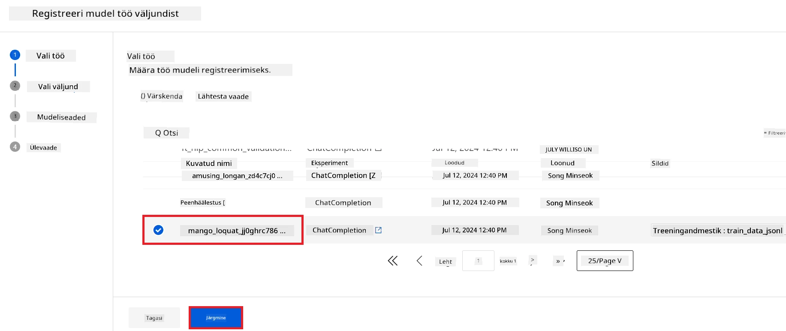

1. Valige **Next**.

1. Valige **Model type** väärtuseks **MLflow**.

1. Kontrollige, et oleks valitud **Job output**; see peaks olema automaatselt valitud.

    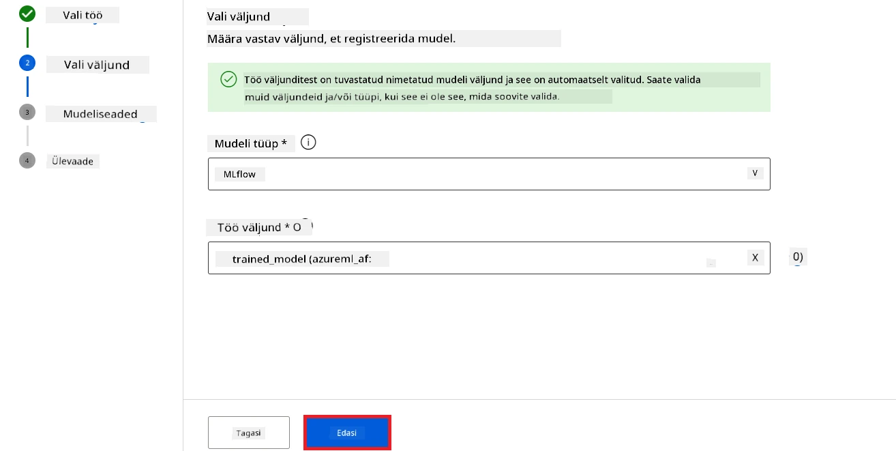

2. Valige **Next**.

3. Valige **Register**.

    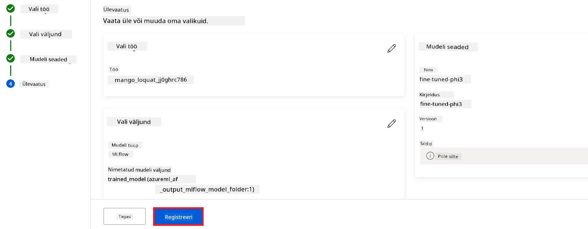

4. Oma registreeritud mudelit saate vaadata, minnes vasakult vahekaardilt menüüsse **Models**.

    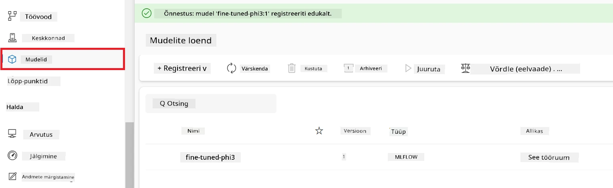

#### Juurutage täiendõppinud mudel

1. Minge loodud Azure Machine Learning tööruumi.

1. Valige vasakult vahekaardilt **Endpoints**.

1. Valige navigeerimismenüüst **Real-time endpoints**.

    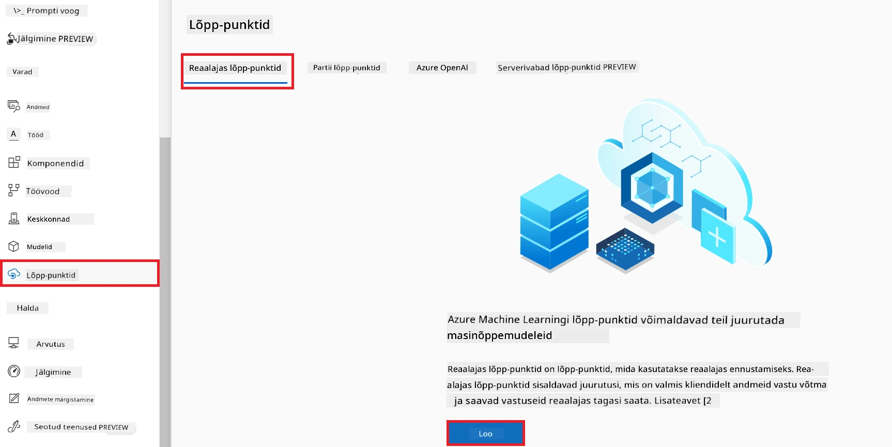

1. Valige **Create**.

1. Valige loodud registreeritud mudel.

    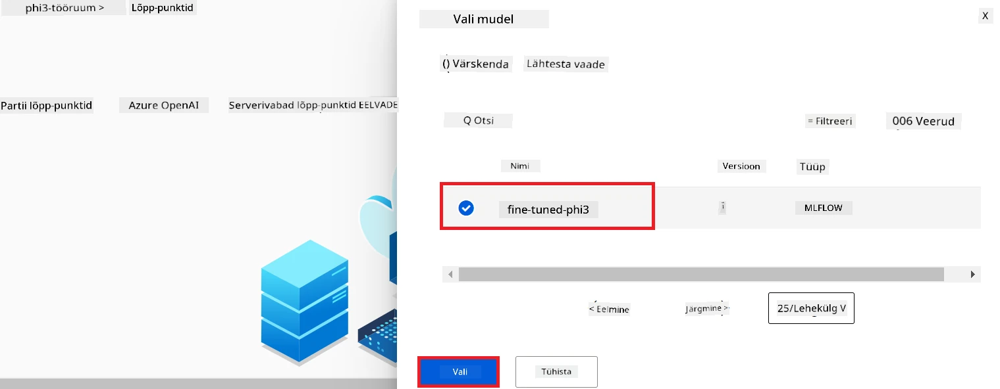

1. Valige **Select**.

1. Tehke järgnevad toimingud:

    - Valige **Virtual machine** väärtuseks *Standard_NC6s_v3*.
    - Valige soovitud **Instance count**, näiteks *1*.
    - Valige **Endpoint** väärtuseks **New**, et luua uus lõpp-punkt.
    - Sisestage unikaalne **Endpoint name**.
    - Sisestage unikaalne **Deployment name**.

    

1. Valige **Deploy**.

> [!WARNING]
> Et vältida lisatasusid, veenduge, et olete Azure Machine Learning tööruumis loodud lõpp-punkti kustutanud.
>

#### Kontrollige juurutamise olekut Azure Machine Learning tööruumis

1. Minge loodud Azure Machine Learning tööruumi.

1. Valige vasakult vahekaardilt **Endpoints**.

1. Valige loodud lõpp-punkt.

    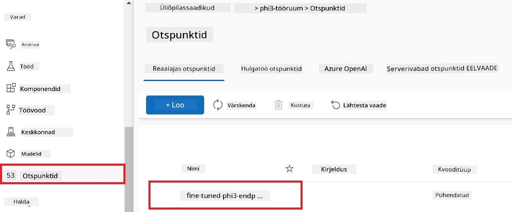

1. Sellel lehel saate hallata lõpp-punkte juurutamise protsessi ajal.

> [!NOTE]
> Kui juurutamine on lõpetatud, veenduge, et **Live traffic** on seatud väärtusele **100%**. Kui see pole nii, valige **Update traffic**, et liiklust reguleerida. Mudelit ei saa testida, kui liiklus on seatud 0%-le.
>
> 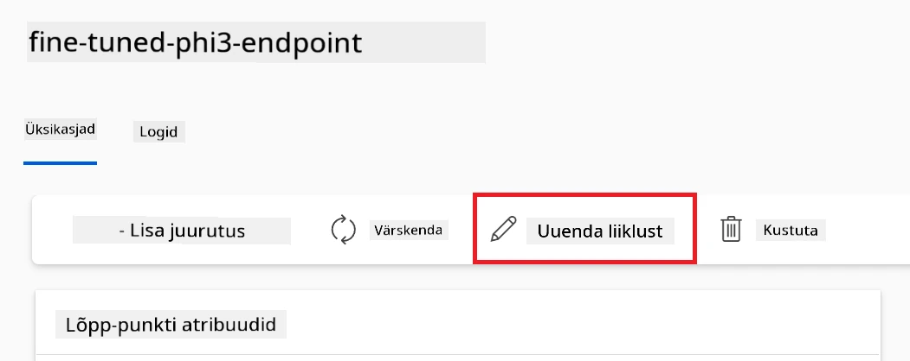
>

## Stsenaarium 3: Integreerimine Prompt flowga ja vestlus oma kohandatud mudeliga Azure AI Foundry's

### Integreerige kohandatud Phi-3 mudel Prompt flowga

Pärast täiendõppinud mudeli edukat juurutamist saate nüüd integreerida selle Prompt Flowga, et kasutada mudelit reaalajas rakendustes, võimaldades erinevaid interaktiivseid ülesandeid oma kohandatud Phi-3 mudeliga.

Selles harjutuses teete:

- Loote Azure AI Foundry Hubi.
- Loote Azure AI Foundry projekti.
- Loote Prompt flow.
- Lisate kohandatud ühenduse täiendõppinud Phi-3 mudelile.
- Seadistate Prompt flow vestluseks oma kohandatud Phi-3 mudeliga.

> [!NOTE]
> Samuti saate integreerida Promptflowga kasutades Azure ML Studio. Sama integreerimisprotsessi saab rakendada Azure ML Studio puhul.

#### Looge Azure AI Foundry Hub

Enne projekti loomist peate looma Hubi. Hub toimib nagu Ressursigrupp, võimaldades teil korraldada ja hallata mitut projekti Azure AI Foundry sees.

1. Minge aadressile [Azure AI Foundry](https://ai.azure.com/?WT.mc_id=aiml-137032-kinfeylo).

1. Valige vasakult vahekaardilt **All hubs**.

1. Valige navigeerimismenüüst **+ New hub**.
    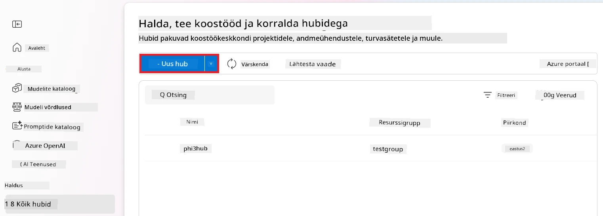

1. Täida järgmised ülesanded:

    - Sisesta **Keskuse nimi**. See peab olema unikaalne väärtus.
    - Vali oma Azure **Tellimus**.
    - Vali kasutatav **Ressursirühm** (lõpeta vajadusel uue loomine).
    - Vali kasutatav **Asukoht**.
    - Vali kasutatav **Ühenda Azure AI teenustega** (lõpeta vajadusel uue loomine).
    - Vali **Ühenda Azure AI Search** ja vali **Jäta ühendamine vahele**.

    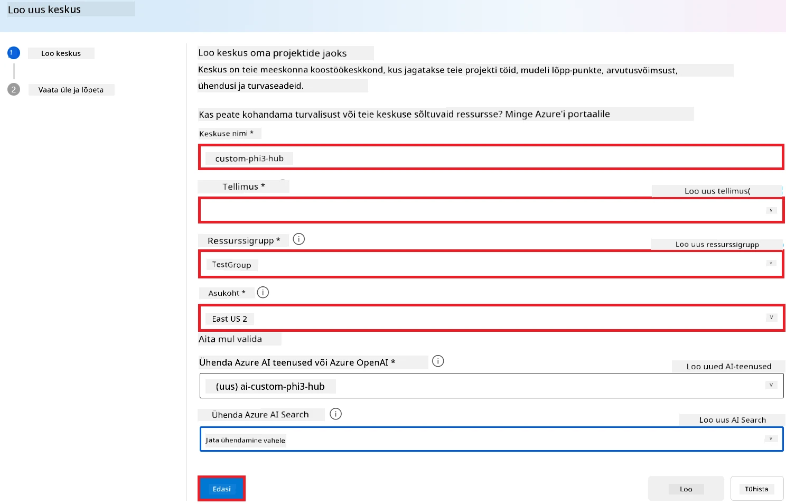

1. Vali **Järgmine**.

#### Loo Azure AI Foundry projekt

1. Vali loodud Keskusest vasakpoolsest paanist **Kõik projektid**.

1. Vali navigeerimismenüüst **+ Uus projekt**.

    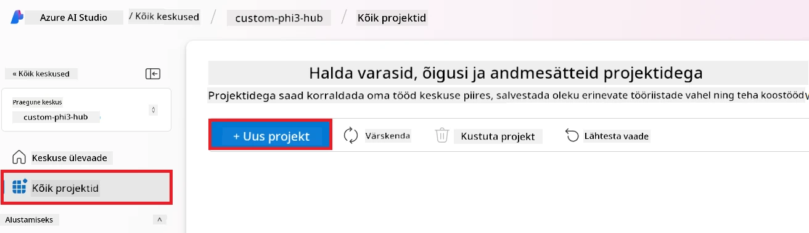

1. Sisesta **Projekti nimi**. See peab olema unikaalne väärtus.

    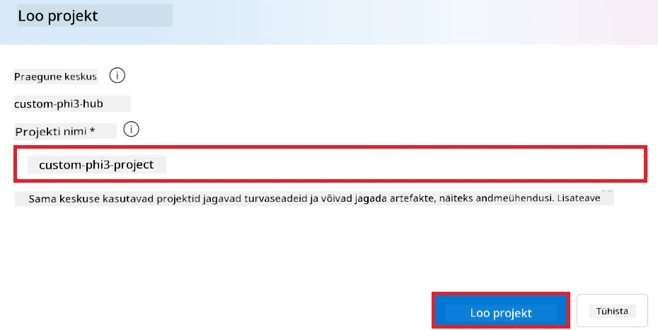

1. Vali **Loo projekt**.

#### Lisa kohandatud ühendus fine-tuned Phi-3 mudelile

Et integreerida oma kohandatud Phi-3 mudel Prompt flow’ga, pead salvestama mudeli lõpp-punkti ja võtit kohandatud ühendusse. See seadistus tagab juurdepääsu sinu kohandatud Phi-3 mudelile Prompt flow’s.

#### Sea api võti ja lõpp-punkti URI fine-tuned Phi-3 mudelile

1. Külastage [Azure ML Studio](https://ml.azure.com/home?WT.mc_id=aiml-137032-kinfeylo).

1. Liigu loodud Azure Masinõppe tööruumi juurde.

1. Vali vasakpoolsest paanist **Lõpp-punktid**.

    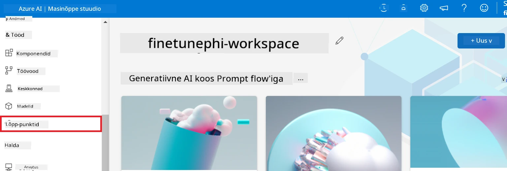

1. Vali loodud lõpp-punkt.

    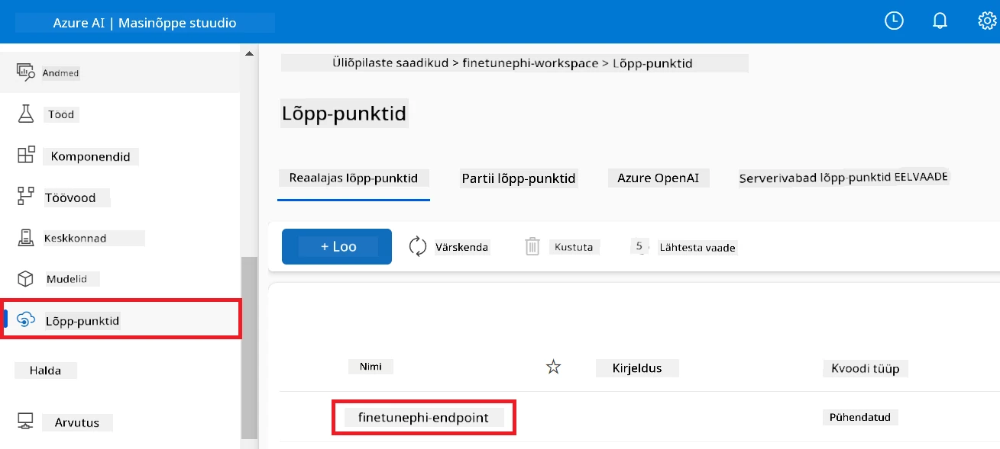

1. Vali navigeerimismenüüst **Tarbi**.

1. Kopeeri oma **REST lõpp-punkt** ja **Põhivõti**.

    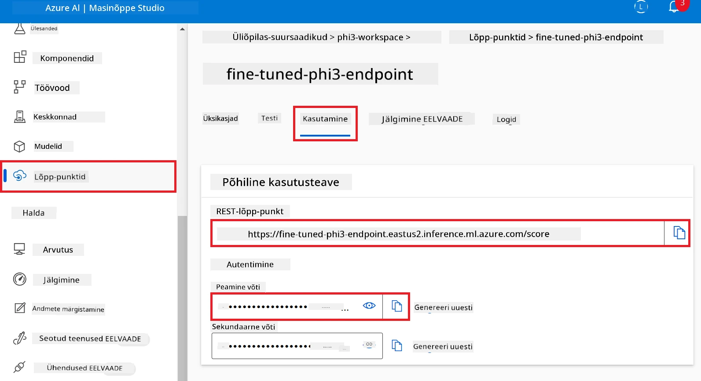

#### Lisa Kohandatud Ühendus

1. Külastage [Azure AI Foundry](https://ai.azure.com/?WT.mc_id=aiml-137032-kinfeylo).

1. Liigu loodud Azure AI Foundry projekti juurde.

1. Vali loodud projektist vasakpoolsest paanist **Seaded**.

1. Vali **+ Uus ühendus**.

    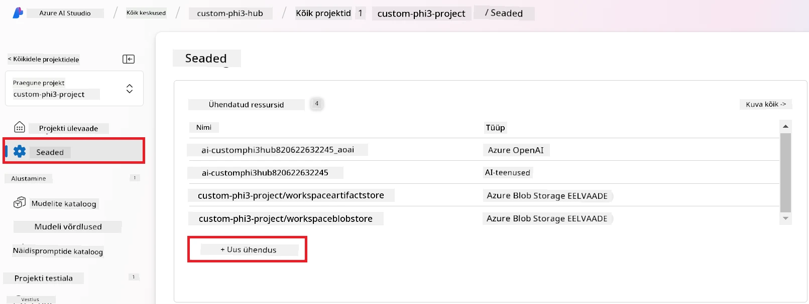

1. Vali navigeerimismenüüst **Kohandatud võtmed**.

    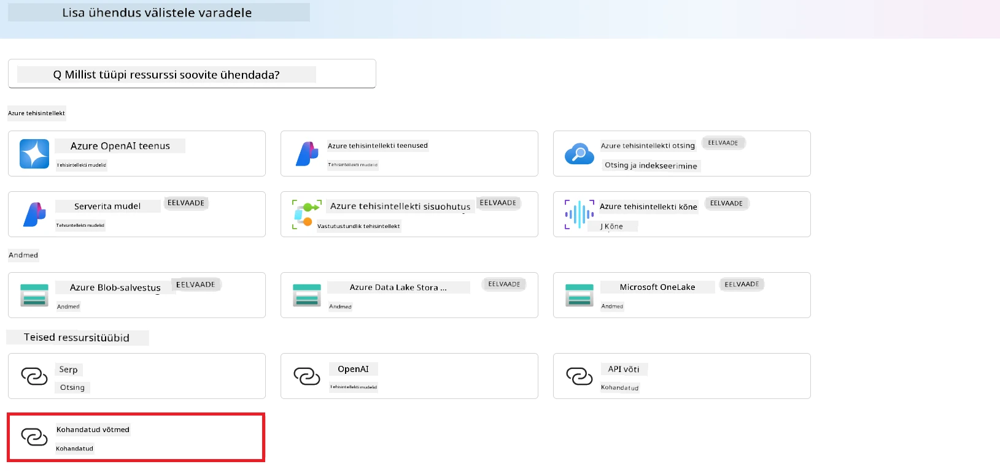

1. Täida järgmised ülesanded:

    - Vali **+ Lisa võtme-väärtuse paarid**.
    - Sisesta võtme nimeks **endpoint** ja kleebi Azure ML Studiost kopeeritud lõpp-punkt väärtuse lahtrisse.
    - Vali uuesti **+ Lisa võtme-väärtuse paarid**.
    - Sisesta võtme nimeks **key** ja kleebi Azure ML Studiost kopeeritud võti väärtuse lahtrisse.
    - Pärast võtmete lisamist vali **on saladus**, et vältida võtme avalikuks tegemist.

    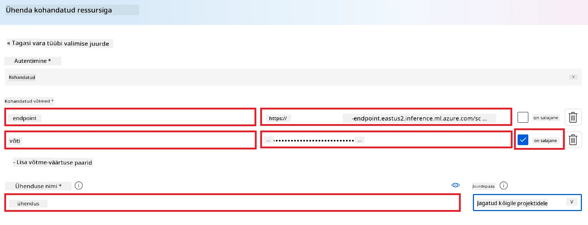

1. Vali **Lisa ühendus**.

#### Loo Prompt flow

Oled lisanud kohandatud ühenduse Azure AI Foundry’sse. Nüüd loo Prompt flow järgmiste sammude abil. Seejärel ühenda see Prompt flow kohandatud ühendusega, et saaksid kasutada fine-tuned mudelit Prompt flow’s sees.

1. Liigu loodud Azure AI Foundry projekti juurde.

1. Vali vasakpoolsest paanist **Prompt flow**.

1. Vali navigeerimismenüüst **+ Loo**.

    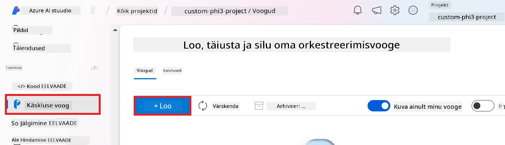

1. Vali navigeerimismenüüst **Vestlusvoog**.

    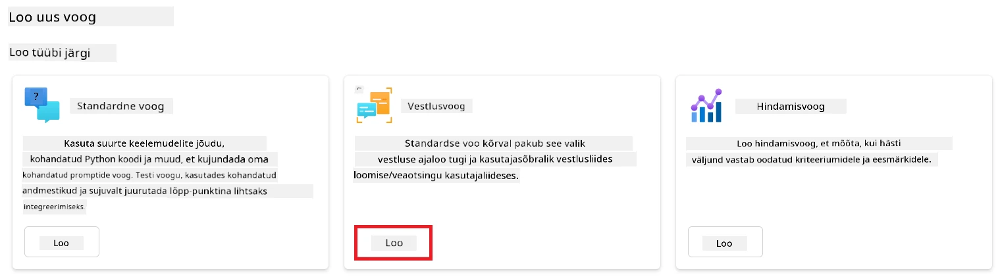

1. Sisesta kasutatav **Kausta nimi**.

    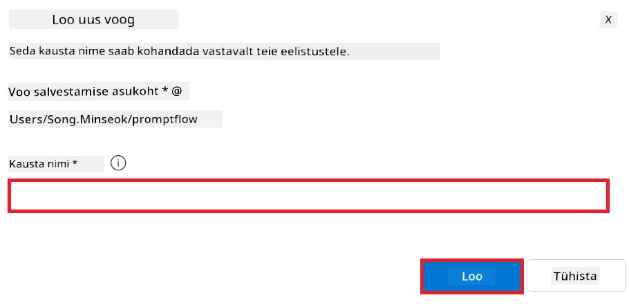

2. Vali **Loo**.

#### Sea Prompt flow üles suhtlemiseks kohandatud Phi-3 mudeliga

Pead integreerima fine-tuned Phi-3 mudeli Prompt flow’sse. Kuid olemasolev Prompt flow pole selleks eesmärgiks loodud. Seetõttu pead Prompt flow ümber kujundama, et võimaldada kohandatud mudeli integreerimist.

1. Prompt flow’s tee järgnevad toimingud olemasoleva voo ülesehitamiseks:

    - Vali **Toores failirežiim**.
    - Kustuta kogu olemasolev kood failist *flow.dag.yml*.
    - Lisa failile *flow.dag.yml* järgmine kood.

        ```yml
        inputs:
          input_data:
            type: string
            default: "Who founded Microsoft?"

        outputs:
          answer:
            type: string
            reference: ${integrate_with_promptflow.output}

        nodes:
        - name: integrate_with_promptflow
          type: python
          source:
            type: code
            path: integrate_with_promptflow.py
          inputs:
            input_data: ${inputs.input_data}
        ```

    - Vali **Salvesta**.

    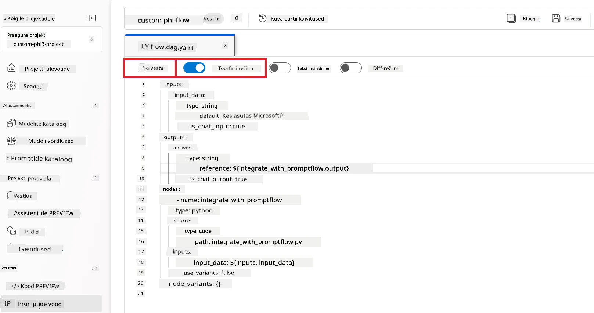

1. Lisa failile *integrate_with_promptflow.py* järgmine kood, et kasutada kohandatud Phi-3 mudelit Prompt flow’s.

    ```python
    import logging
    import requests
    from promptflow import tool
    from promptflow.connections import CustomConnection

    # Logimise seadistamine
    logging.basicConfig(
        format="%(asctime)s - %(levelname)s - %(name)s - %(message)s",
        datefmt="%Y-%m-%d %H:%M:%S",
        level=logging.DEBUG
    )
    logger = logging.getLogger(__name__)

    def query_phi3_model(input_data: str, connection: CustomConnection) -> str:
        """
        Send a request to the Phi-3 model endpoint with the given input data using Custom Connection.
        """

        # "connection" on kohandatud ühenduse nimi, "endpoint", "key" on võtmed kohandatud ühenduses
        endpoint_url = connection.endpoint
        api_key = connection.key

        headers = {
            "Content-Type": "application/json",
            "Authorization": f"Bearer {api_key}"
        }
        data = {
            "input_data": {
                "input_string": [
                    {"role": "user", "content": input_data}
                ],
                "parameters": {
                    "temperature": 0.7,
                    "max_new_tokens": 128
                }
            }
        }
        try:
            response = requests.post(endpoint_url, json=data, headers=headers)
            response.raise_for_status()
            
            # Logi kogu JSON-vastus
            logger.debug(f"Full JSON response: {response.json()}")

            result = response.json()["output"]
            logger.info("Successfully received response from Azure ML Endpoint.")
            return result
        except requests.exceptions.RequestException as e:
            logger.error(f"Error querying Azure ML Endpoint: {e}")
            raise

    @tool
    def my_python_tool(input_data: str, connection: CustomConnection) -> str:
        """
        Tool function to process input data and query the Phi-3 model.
        """
        return query_phi3_model(input_data, connection)

    ```

    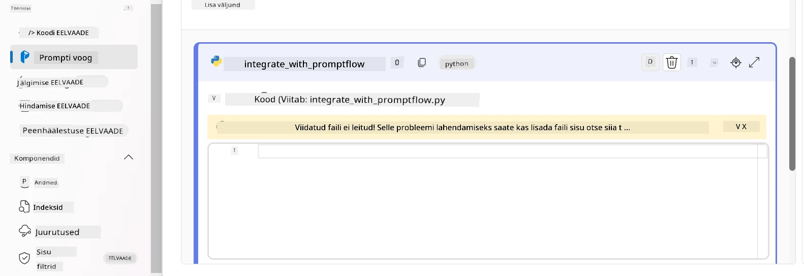

> [!NOTE]
> Kui soovid üksikasjalikumat teavet Prompt flow kasutamise kohta Azure AI Foundry’s, võid vaadata [Prompt flow Azure AI Foundry's](https://learn.microsoft.com/azure/ai-studio/how-to/prompt-flow) juhendit.

1. Vali **Vestluse sisend**, **Vestluse väljund**, et lubada suhtlemine mudeliga.

    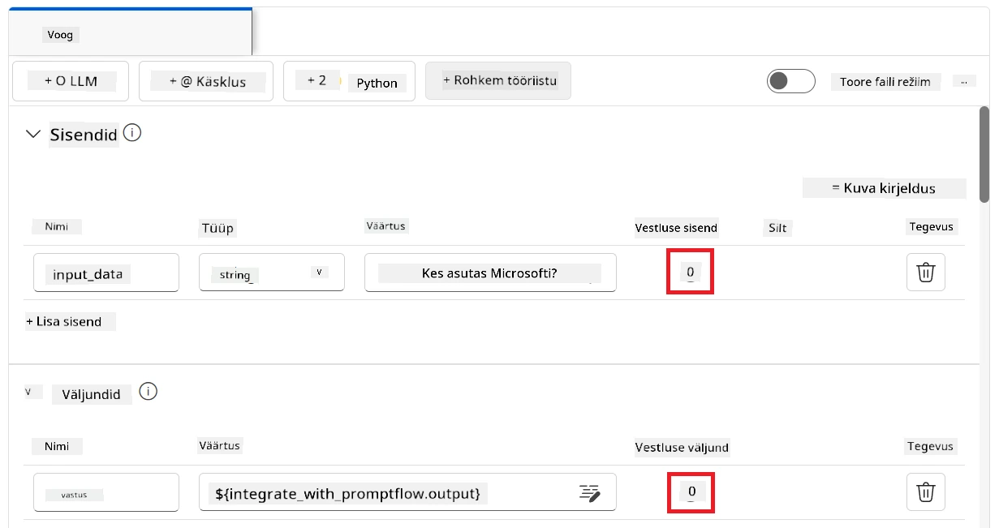

1. Nüüd oled valmis suhtlema oma kohandatud Phi-3 mudeliga. Järgmises harjutuses õpid, kuidas alustada Prompt flow’d ja kasutades sellega oma fine-tuned Phi-3 mudeliga vestelda.

> [!NOTE]
>
> Ümber ehitatud voog peaks välja nägema nagu allpool olev pilt:
>
> 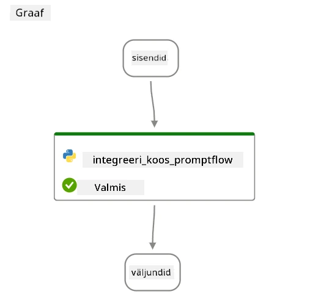
>

### Suhtle oma kohandatud Phi-3 mudeliga

Nüüd, kui oled oma kohandatud Phi-3 mudeli fine-tuning'u ja integreerimise Prompt flow’sse lõpetanud, oled valmis sellega suhtlema hakkama. See harjutus juhendab sind mudeliga suhtlemiseks vajaliku seadistuse ja käivitamise protsessis Prompt flow abil. Neid samme järgides saad oma fine-tuned Phi-3 mudelit täielikult kasutada erinevatel ülesannetel ja vestlustes.

- Suhtle oma kohandatud Phi-3 mudeliga kasutades Prompt flow’d.

#### Käivita Prompt flow

1. Vali **Alusta arvutusseansse**, et alustada Prompt flow’d.

    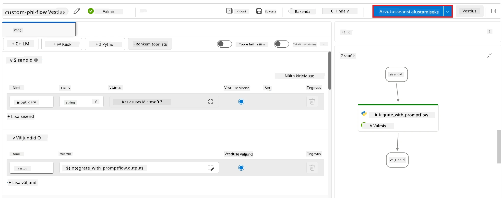

1. Vali **Kinnita ja tõlgi sisend**, et uuendada parameetreid.

    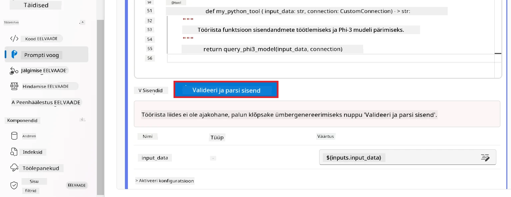

1. Vali **value** väljal **ühendus** loodud kohandatud ühenduse väärtus. Näiteks *connection*.

    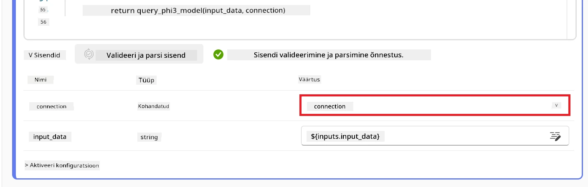

#### Suhtle oma kohandatud mudeliga

1. Vali **Vestlus**.

    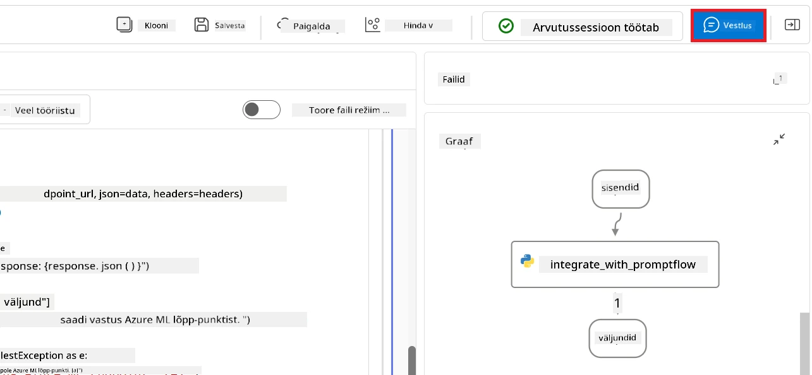

1. Siin on näide tulemustest: Nüüd saad suhelda oma kohandatud Phi-3 mudeliga. Soovitame esitada küsimusi andmete põhjal, mis olid kasutusel fine-tuning’u puhul.

    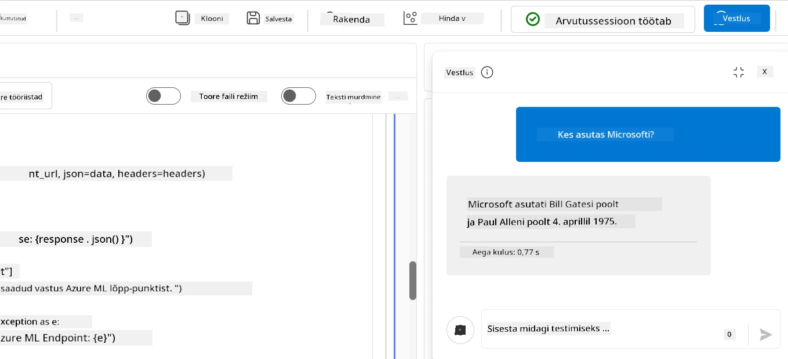

---

<!-- CO-OP TRANSLATOR DISCLAIMER START -->
**Vastutusest loobumine**:
See dokument on tõlgitud kasutades tehisintellekti tõlketeenust [Co-op Translator](https://github.com/Azure/co-op-translator). Kuigi püüame tagada täpsust, palun arvestage, et automaatsed tõlked võivad sisaldada vigu või ebatäpsusi. Originaaldokument selles algses keeles tuleks pidada autoriteetseks allikaks. Olulise teabe puhul on soovitatav kasutada professionaalset inimtõlget. Me ei vastuta selle tõlke kasutamisest tulenevate arusaamatuste või valesti mõistmiste eest.
<!-- CO-OP TRANSLATOR DISCLAIMER END -->