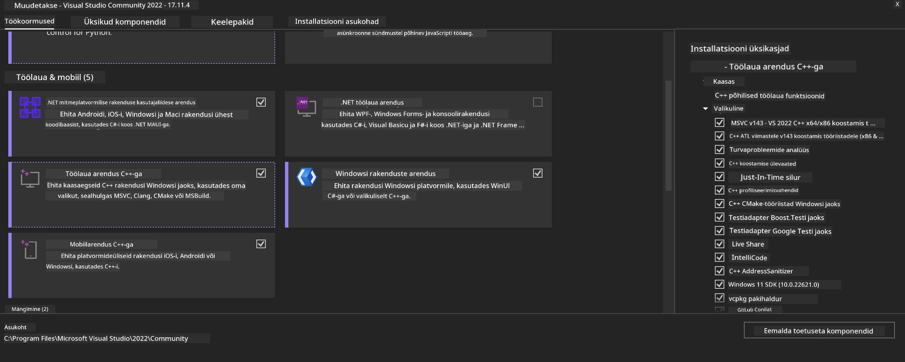
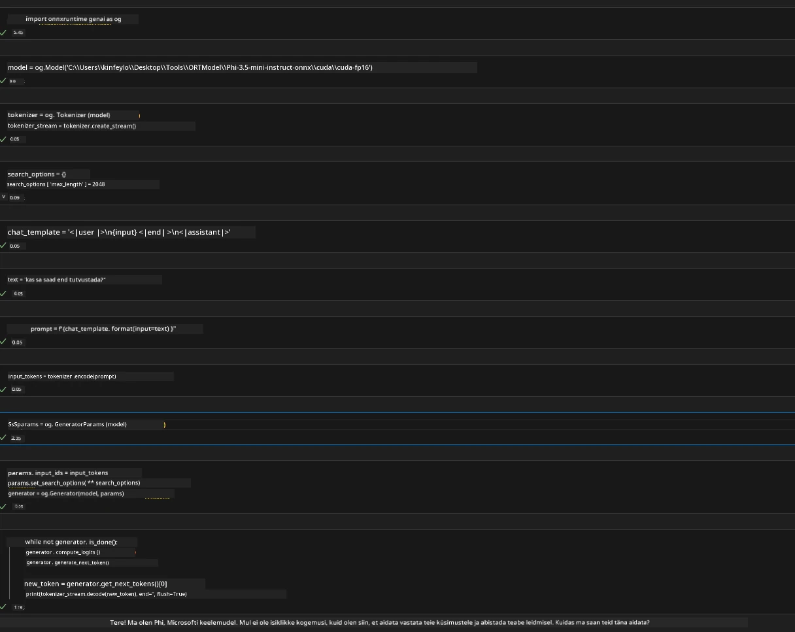
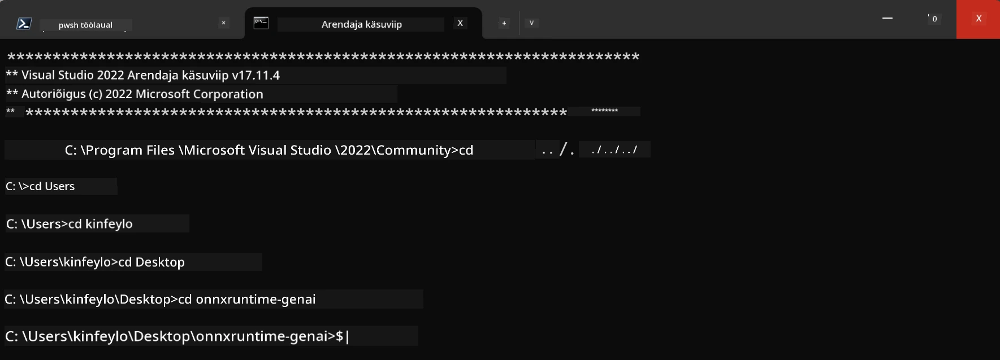

# **Juhend OnnxRuntime GenAI Windows GPU jaoks**

See juhend annab sammud ONNX Runtime (ORT) seadistamiseks ja kasutamiseks GPU-dega Windowsis. See on mõeldud aitamaks teil kasutada oma mudelite jaoks GPU kiirendust, parandades jõudlust ja efektiivsust.

Dokument sisaldab juhiseid:

- Keskkonna seadistamine: juhised vajalike sõltuvuste nagu CUDA, cuDNN ja ONNX Runtime paigaldamiseks.
- Konfigureerimine: Kuidas seadistada keskkond ja ONNX Runtime GPU ressursside tõhusaks kasutamiseks.
- Optimeerimisnõuanded: soovitused, kuidas GPU seadeid optimaalse jõudluse saavutamiseks häälestada.

### **1. Python 3.10.x /3.11.8**

   ***Märkus*** Soovitatav on kasutada [miniforge](https://github.com/conda-forge/miniforge/releases/latest/download/Miniforge3-Windows-x86_64.exe) oma Python keskkonnana

   ```bash

   conda create -n pydev python==3.11.8

   conda activate pydev

   ```

   ***Meeldetuletus*** Kui olete installinud mõne Python ONNX teegi, palun eemaldage see esmalt

### **2. Paigalda CMake kasutades winget**


   ```bash

   winget install -e --id Kitware.CMake

   ```

### **3. Paigalda Visual Studio 2022 - Desktop Development with C++**

   ***Märkus*** Kui te ei soovi ise kompileerida, võite selle sammu vahele jätta




### **4. Paigalda NVIDIA draiver**

1. **NVIDIA GPU draiver**  [https://www.nvidia.com/en-us/drivers/](https://www.nvidia.com/en-us/drivers/)

2. **NVIDIA CUDA 12.4** [https://developer.nvidia.com/cuda-12-4-0-download-archive](https://developer.nvidia.com/cuda-12-4-0-download-archive)

3. **NVIDIA CUDNN 9.4**  [https://developer.nvidia.com/cudnn-downloads](https://developer.nvidia.com/cudnn-downloads)

***Meeldetuletus*** Palun kasutage installimisel vaikevalikuid

### **5. Sea NVIDIA keskkond**

Kopeeri NVIDIA CUDNN 9.4 lib, bin, include failid NVIDIA CUDA 12.4 lib, bin, include kataloogidesse

- kopeeri *'C:\Program Files\NVIDIA\CUDNN\v9.4\bin\12.6'* failid kataloogi  *'C:\Program Files\NVIDIA GPU Computing Toolkit\CUDA\v12.4\bin*

- kopeeri *'C:\Program Files\NVIDIA\CUDNN\v9.4\include\12.6'* failid kataloogi  *'C:\Program Files\NVIDIA GPU Computing Toolkit\CUDA\v12.4\include*

- kopeeri *'C:\Program Files\NVIDIA\CUDNN\v9.4\lib\12.6'* failid kataloogi  *'C:\Program Files\NVIDIA GPU Computing Toolkit\CUDA\v12.4\lib\x64'*


### **6. Laadi alla Phi-3.5-mini-instruct-onnx**


   ```bash

   winget install -e --id Git.Git

   winget install -e --id GitHub.GitLFS

   git lfs install

   git clone https://huggingface.co/microsoft/Phi-3.5-mini-instruct-onnx

   ```

### **7. Käivita InferencePhi35Instruct.ipynb**

   Ava [Notebook](../../../../code/09.UpdateSamples/Aug/ortgpu-phi35-instruct.ipynb) ja käivita see





### **8. Kompileeri ORT GenAI GPU**


   ***Märkus*** 
   
   1. Palun eemalda esmalt kõik onnx, onnxruntime ja onnxruntime-genai teegid

   
   ```bash

   pip list 
   
   ```

   Seejärel eemalda kõik onnxruntime teegid näiteks 


   ```bash

   pip uninstall onnxruntime

   pip uninstall onnxruntime-genai

   pip uninstall onnxruntume-genai-cuda
   
   ```

   2. Kontrolli Visual Studio laienduse tuge

   Kontrolli kataloogi C:\Program Files\NVIDIA GPU Computing Toolkit\CUDA\v12.4\extras, et seal oleks olemas C:\Program Files\NVIDIA GPU Computing Toolkit\CUDA\v12.4\extras\visual_studio_integration. 
   
   Kui pole, siis vaata teisi CUDA tööriistakasti katalooge ja kopeeri visual_studio_integration kaust ja selle sisu C:\Program Files\NVIDIA GPU Computing Toolkit\CUDA\v12.4\extras\visual_studio_integration asukohta


   - Kui te ei soovi kompileerida, võite selle sammu vahele jätta


   ```bash

   git clone https://github.com/microsoft/onnxruntime-genai

   ```

   - Laadi alla [https://github.com/microsoft/onnxruntime/releases/download/v1.19.2/onnxruntime-win-x64-gpu-1.19.2.zip](https://github.com/microsoft/onnxruntime/releases/download/v1.19.2/onnxruntime-win-x64-gpu-1.19.2.zip)

   - Paki lahti onnxruntime-win-x64-gpu-1.19.2.zip, ja nimeta kaust ümber **ort**, kopeeri ort kaust onnxruntime-genai kausta

   - Kasutades Windows Terminali, ava Developer Command Prompt for VS 2022 ja mine onnxruntime-genai kausta



   - Kompileeri see oma Python keskkonnas

   
   ```bash

   cd onnxruntime-genai

   python build.py --use_cuda  --cuda_home "C:\Program Files\NVIDIA GPU Computing Toolkit\CUDA\v12.4" --config Release
 

   cd build/Windows/Release/Wheel

   pip install .whl

   ```

---

<!-- CO-OP TRANSLATOR DISCLAIMER START -->
**Lahtiütlus**:
See dokument on tõlgitud kasutades AI tõlketeenust [Co-op Translator](https://github.com/Azure/co-op-translator). Kuigi me püüdleme täpsuse poole, palun pange tähele, et automatiseeritud tõlgetes võib esineda vigu või ebatäpsusi. Originaaldokument selle emakeeles tuleks pidada autoriteetseks allikaks. Olulise teabe puhul soovitatakse kasutada professionaalset inimtõlget. Me ei vastuta selle tõlkega seotud eksimustest või valesti mõistmistest.
<!-- CO-OP TRANSLATOR DISCLAIMER END -->