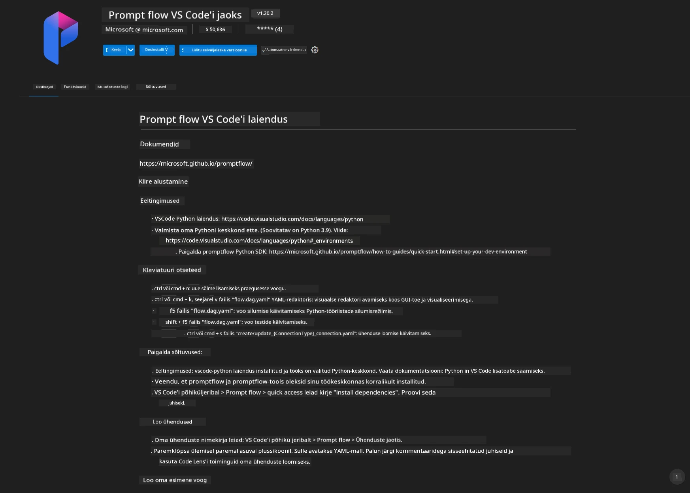
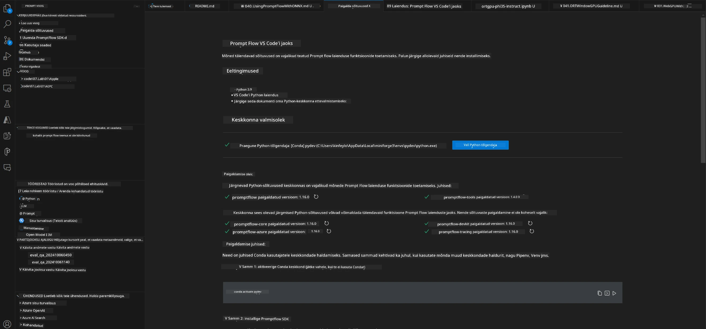
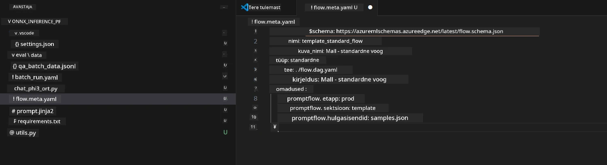
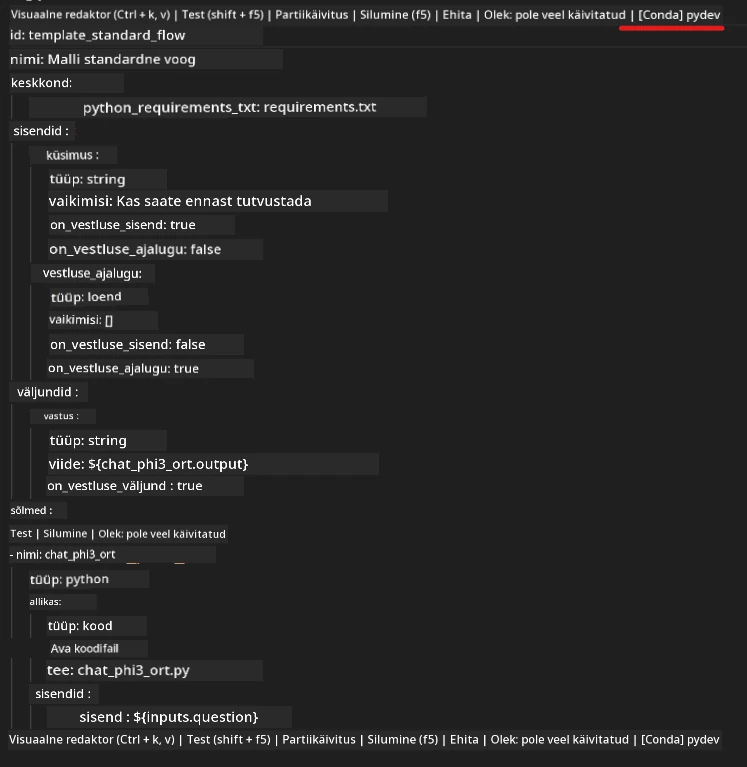
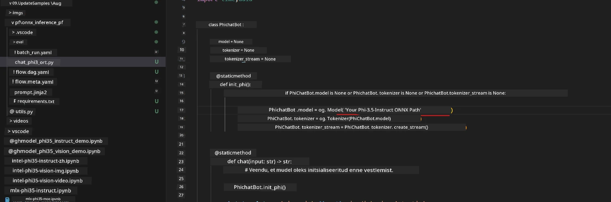
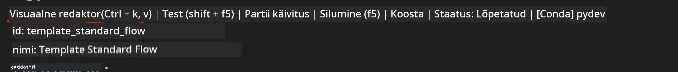
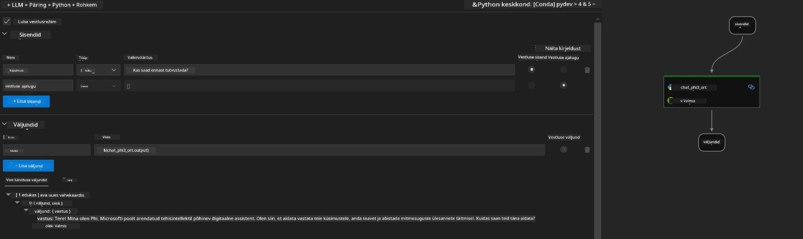
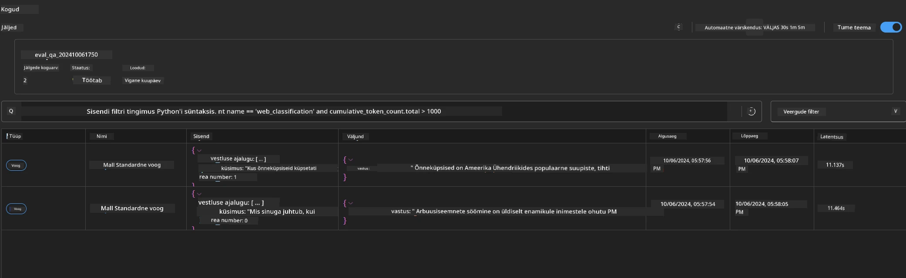

# Windowsi GPU kasutamine Phi-3.5-Instruct ONNX-ga Prompt flow lahenduse loomiseks

Järgmine dokument on näide sellest, kuidas kasutada PromptFlow't ONNX-i (Open Neural Network Exchange) abil Phi-3 mudelitel põhinevate AI rakenduste arendamiseks.

PromptFlow on arendustööriistade komplekt, mis on loodud LLM-põhiste (suur keelemudel) AI-rakenduste kogu arendustsükli lihtsustamiseks, alates ideest ja prototüübist kuni testimise ja hindamiseni.

Integreerides PromptFlow ONNX-iga, saavad arendajad:

- Optimeerida mudeli jõudlust: kasutada ONNX-i tõhusa mudeli järeldamise ja juurutamise jaoks.
- Lihtsustada arendust: kasutada PromptFlow't töövoo haldamiseks ja korduvate ülesannete automatiseerimiseks.
- Edendada koostööd: soodustada paremat koostööd meeskonnaliikmete vahel, pakkudes ühtset arenduskeskkonda.

**Prompt flow** on arendustööriistade komplekt, mis on loodud LLM-põhiste AI-rakenduste kogu arendustsükli lihtsustamiseks alates ideest, prototüüpidest, testimisest, hindamisest kuni toodangusse juurutamise ja jälgimiseni. See teeb prompt engineeringu palju lihtsamaks ning võimaldab ehitada tootmiskvaliteediga LLM-rakendusi.

Prompt flow saab ühendada OpenAI, Azure OpenAI teenuse ja kohandatavate mudelitega (Huggingface, kohalik LLM/SLM). Lootus on juurutada Phi-3.5 kvantiseeritud ONNX mudel kohalike rakenduste jaoks. Prompt flow aitab meil paremini planeerida oma äri ja lõpule viia kohalikud lahendused Phi-3.5 alusel. Selles näites ühendame ONNX Runtime GenAI raamatukogu, et valmis saada Prompt flow lahendus Windowsi GPU alusel.

## **Paigaldamine**

### **ONNX Runtime GenAI Windowsi GPU jaoks**

Loe seda juhendit ONNX Runtime GenAI seadistamiseks Windowsi GPU jaoks [kliki siia](./ORTWindowGPUGuideline.md)

### **Prompt flow seadistamine VSCode'is**

1. Paigalda Prompt flow VS Code'i laiendus



2. Pärast Prompt flow VS Code'i laienduse paigaldamist klõpsa laiendusel ja vali **Installation dependencies** ning järgi seda juhendit, et paigaldada Prompt flow SDK oma keskkonda



3. Laadi alla [Näitekood](../../../../../../code/09.UpdateSamples/Aug/pf/onnx_inference_pf) ja ava see näidis VS Code'is



4. Ava **flow.dag.yaml** ja vali oma Python keskkond



   Ava **chat_phi3_ort.py** ja muuda Phi-3.5-instruct ONNX mudeli asukohta



5. Käivita oma prompt flow testimiseks

Ava **flow.dag.yaml** ja klõpsa visuaalset redaktorit



Pärast klõpsamist käivita see testimiseks



1. Võid terminalis käivitada hulgikaudu, et näha rohkem tulemusi


```bash

pf run create --file batch_run.yaml --stream --name 'Your eval qa name'    

```

Tulemusi saad kontrollida oma vaikebrauseris




---

<!-- CO-OP TRANSLATOR DISCLAIMER START -->
**Lahtiütlus**:
See dokument on tõlgitud kasutades AI tõlketeenust [Co-op Translator](https://github.com/Azure/co-op-translator). Kuigi me püüdleme täpsuse poole, palun pange tähele, et automatiseeritud tõlgetes võib esineda vigu või ebatäpsusi. Originaaldokument selle emakeeles tuleks pidada autoriteetseks allikaks. Olulise teabe puhul soovitatakse kasutada professionaalset inimtõlget. Me ei vastuta selle tõlkega seotud eksimustest või valesti mõistmistest.
<!-- CO-OP TRANSLATOR DISCLAIMER END -->