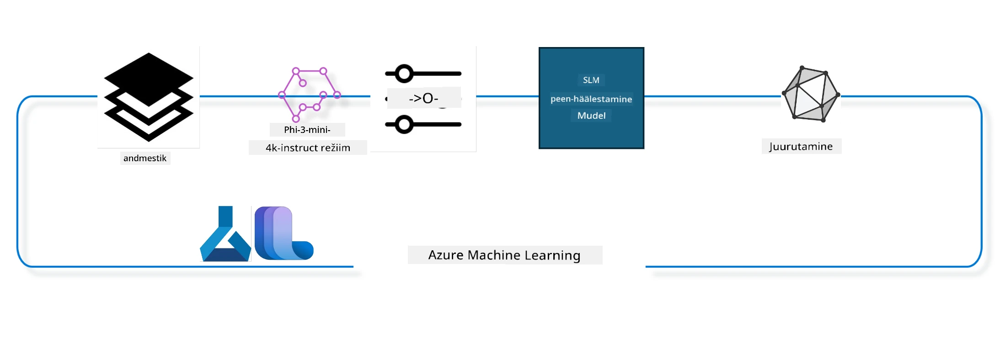

## Kuidas kasutada vestluse lõpuleviimise komponente Azure ML süsteemiregistrist mudeli täiendamiseks

Selles näites viime läbi Phi-3-mini-4k-instruct mudeli täiendamist, et lõpetada vestlus kahe inimese vahel, kasutades ultrachat_200k andmestikku.



Näide näitab, kuidas teha täiendust Azure ML SDK ja Pythoniga ning seejärel juurutada täiendatud mudel reaalajas teostamiseks veebipõhises otsapunktis.

### Treeningandmed

Kasutame ultrachat_200k andmestikku. See on UltraChat andmestiku tugevalt filtreeritud versioon ja seda kasutati Zephyr-7B-β treenimiseks, mis on tipptasemel 7b vestlusmudel.

### Mudel

Kasutame Phi-3-mini-4k-instruct mudelit, et näidata, kuidas saab kasutaja mudelit täpsustada vestluse lõpetamise ülesande jaoks. Kui avasite selle märkmiku konkreetse mudelikaardiga, ärge unustage konkreetset mudeli nime asendada.

### Ülesanded

- Valida mudel täiendamiseks.
- Valida ja uurida treeningandmeid.
- Konfigureerida täiendamise töö.
- Käivitada täiendamise töö.
- Läbivaatada treeningu ja hindamise mõõdikud.
- Registreerida täiendatud mudel.
- Juurutada täiendatud mudel reaalajas teostamiseks.
- Puhastada ressursid.

## 1. Eeltingimuste seadistamine

- Paigaldada sõltuvused
- Ühenduda AzureML tööruumiga. Lisateavet leiate autentimise seadistamisest SDK-s. Asendage allpool <WORKSPACE_NAME>, <RESOURCE_GROUP> ja <SUBSCRIPTION_ID>.
- Ühenduda azureml süsteemiregistriga
- Määrata valikuline eksperimendi nimi
- Kontrollida või luua arvutusvõimsust.

> [!NOTE]
> Nõuded: üks GPU sõlm võib sisaldada mitut GPU kaarti. Näiteks ühes Standard_NC24rs_v3 sõlmes on 4 NVIDIA V100 GPU-d, samas kui Standard_NC12s_v3-s on 2 NVIDIA V100 GPU-d. Täpsema info leiate dokumentatsioonist. Ühe sõlme GPU kaartide arv on määratud parameetris gpus_per_node allpool. Õige väärtuse seadmine tagab kõigi sõlme GPU-de kasutamise. Soovitatud GPU arvutusvõimsuse SKU-d leiate siit ja siit.

### Pythoni raamatukogud

Paigaldage sõltuvused, käivitades alljärgneva lahtri. See ei ole valikuline samm uues keskkonnas.

```bash
pip install azure-ai-ml
pip install azure-identity
pip install datasets==2.9.0
pip install mlflow
pip install azureml-mlflow
```

### Suhtlus Azure ML-iga

1. See Python skript suhtleb Azure Machine Learning (Azure ML) teenusega. Siin on ülevaade, mida see teeb:

    - Impordib vajalikke mooduleid azure.ai.ml, azure.identity ja azure.ai.ml.entities pakettidest. Impordib ka time mooduli.

    - Proovib autentida DefaultAzureCredential() abil, mis pakub lihtsustatud autentimise kogemust Azure pilves rakenduste arendamiseks. Kui see ebaõnnestub, kasutatakse varuks InteractiveBrowserCredential(), mis pakub interaktiivset sisselogimisviipa.

    - Seejärel proovib luua MLClienti eksemplari kasutades from_config meetodit, mis loeb konfiguratsiooni vaikimisi konfiguratsioonifailist (config.json). Kui see ebaõnnestub, luuakse MLClient käsitsi, edastades subscription_id, resource_group_name ja workspace_name.

    - Loob teise MLClienti eksemplari, seekord Azure ML registri jaoks nimega "azureml". See register hoiab mudeleid, täiendamise torujuhtmeid ja keskkondi.

    - Määrab eksperimendi nimeks "chat_completion_Phi-3-mini-4k-instruct".

    - Genereerib unikaalse ajatempli, muutes praeguse aja (sekundites alates epohhist, ujukomaarvuna) täisarvuks ja seejärel stringiks. Seda ajatemplit saab kasutada unikaalsete nimede ja versioonide loomiseks.

    ```python
    # Impordi vajalikud moodulid Azure ML-ist ja Azure Identity-st
    from azure.ai.ml import MLClient
    from azure.identity import (
        DefaultAzureCredential,
        InteractiveBrowserCredential,
    )
    from azure.ai.ml.entities import AmlCompute
    import time  # Impordi aegade moodul
    
    # Proovi autentida kasutades DefaultAzureCredential'i
    try:
        credential = DefaultAzureCredential()
        credential.get_token("https://management.azure.com/.default")
    except Exception as ex:  # Kui DefaultAzureCredential ebaõnnestub, kasuta InteractiveBrowserCredential'i
        credential = InteractiveBrowserCredential()
    
    # Proovi luua MLClient instants vaikimisi konfiguratsioonifaili abil
    try:
        workspace_ml_client = MLClient.from_config(credential=credential)
    except:  # Kui see ebaõnnestub, loo MLClient instants, esitades andmed käsitsi
        workspace_ml_client = MLClient(
            credential,
            subscription_id="<SUBSCRIPTION_ID>",
            resource_group_name="<RESOURCE_GROUP>",
            workspace_name="<WORKSPACE_NAME>",
        )
    
    # Loo teine MLClienti instants Azure ML registri jaoks nimega "azureml"
    # Selles registris hoitakse mudeleid, täpsustustöötluse torujuhtmeid ja keskkondi
    registry_ml_client = MLClient(credential, registry_name="azureml")
    
    # Sea katse nimi
    experiment_name = "chat_completion_Phi-3-mini-4k-instruct"
    
    # Genereeri ainulaadne ajatempli, mida saab kasutada nimede ja versioonide jaoks, mis peavad olema unikaalsed
    timestamp = str(int(time.time()))
    ```

## 2. Valige täiendatav põhialane mudel

1. Phi-3-mini-4k-instruct on 3,8 miljardi parameetriga kerge kaaluga tipptasemel avatud mudel, mis on ehitatud Phi-2 jaoks kasutatud andmestike põhjal. Mudel kuulub Phi-3 mudelite perekonda ja Mini versioonil on kaks varianti: 4K ja 128K, mis näitavad toetatava konteksti pikkust (tokenites). Me peame mudelit oma spetsiifiliseks otstarbeks täiendama. Saate neid mudeleid sirvida AzureML Studio Mudelite kataloogis, filtreerides vestluse lõpuleviimise ülesande järgi. Selles näites kasutame Phi-3-mini-4k-instruct mudelit. Kui avasite selle märkmiku mõne muu mudeli jaoks, asendage mudeli nimi ja versioon vastavalt.

> [!NOTE]
> mudeli id omadus. Seda antakse täiendamise töö sisendina. See on saadaval ka mudeli detailide lehel AzureML Studio Mudelite kataloogis Asset ID väljal.

2. See Python skript suhtleb Azure Machine Learning (Azure ML) teenusega. Siin on ülevaade, mida see teeb:

    - Määrab model_name väärtuseks "Phi-3-mini-4k-instruct".

    - Kasutab registry_ml_client objekti models atribuudi get meetodit, et saada Azure ML registrist mudeli uusim versioon nimetatud nimega. Get meetodile antakse kaks argumenti: mudeli nimi ja silt, mis näitab, et tõmmata tuleks mudeli viimane versioon.

    - Trükib konsooli sõnumi, mis näitab, millist mudelit (nimi, versioon, id) kasutatakse täiendamiseks. Stringi format meetodit kasutatakse mudeli omaduste (nimi, versioon, id) sisestamiseks sõnumisse. Omadused pärinevad foundation_model objektist.

    ```python
    # Määra mudeli nimi
    model_name = "Phi-3-mini-4k-instruct"
    
    # Hangi mudeli uuem versioon Azure ML registrist
    foundation_model = registry_ml_client.models.get(model_name, label="latest")
    
    # Trüki mudeli nimi, versioon ja ID
    # See teave on kasulik jälgimiseks ja silumiseks
    print(
        "\n\nUsing model name: {0}, version: {1}, id: {2} for fine tuning".format(
            foundation_model.name, foundation_model.version, foundation_model.id
        )
    )
    ```

## 3. Looge arvutusressurss töö jaoks

Täiendamise töö töötab AINULT GPU arvutusressursiga. Arvutusressursi maht sõltub mudeli suurusest ja enamasti on keeruline õige töö jaoks arvutus valida. Selles lahtris juhendame kasutajat valima sobiva arvutusressursi.

> [!NOTE]
> Alljärgnevad arvutusressursid töötavad kõige optimeerituma konfiguratsiooniga. Ükskõik millised konfiguratsiooni muudatused võivad põhjustada Cuda Out Of Memory veateate. Sellisel puhul proovige arvutusressurssi suurema mahuga uuendada.

> [!NOTE]
> Arvutusressursi "compute_cluster_size" valimisel veenduge, et see oleks teie ressursside grupis saadaval. Kui see ei ole, saate taotleda juurdepääsu arvutusressurssidele.

### Mudeli kontroll täiendamise toe osas

1. See Python skript suhtleb Azure Machine Learning (Azure ML) mudeliga. Siin on ülevaade toimuvast:

    - Impordib ast mooduli, mis võimaldab töödelda Python'i süntaksipuu.

    - Kontrollib, kas foundation_model objektil (mudel Azure ML-s) on silt nimega finetune_compute_allow_list. Azure ML märgendid on võtme-väärtuse paarid, mida saab kasutada mudelite filtreerimiseks ja sorteerimiseks.

    - Kui see silt on olemas, kasutab ast.literal_eval funktsiooni sildi väärtuse turvaliseks teisendamiseks Python'i listiks. See list määratakse muutujale computes_allow_list. Seejärel prinditakse sõnum, mis juhendab arvutusressurssi looma selle nimekirja alusel.

    - Kui seda silti ei ole, määrab computes_allow_list väärtuseks None ja prindib sõnumi, et finetune_compute_allow_list ei kuulu mudeli siltide hulka.

    - Kokkuvõttes kontrollitakse seda konkreetset silti mudeli metaandmetes, konverteeritakse selle väärtus listiks, kui see on olemas, ja antakse tagasisidet kasutajale.

    ```python
    # Impordi ast moodul, mis pakub funktsioone Python'i abstraktse süntaksi puude töötlemiseks
    import ast
    
    # Kontrolli, kas mudeli siltide seas on olemas 'finetune_compute_allow_list' silt
    if "finetune_compute_allow_list" in foundation_model.tags:
        # Kui silt on olemas, kasuta ast.literal_eval funktsiooni, et turvaliselt tõlgendada sildi väärtus (string) Python'i nimekirjaks
        computes_allow_list = ast.literal_eval(
            foundation_model.tags["finetune_compute_allow_list"]
        )  # teisenda string Python'i nimekirjaks
        # Prindi sõnum, mis näitab, et arvutus tuleks nimekirjast luua
        print(f"Please create a compute from the above list - {computes_allow_list}")
    else:
        # Kui silt puudub, määra computes_allow_list väärtuseks None
        computes_allow_list = None
        # Prindi sõnum, mis näitab, et 'finetune_compute_allow_list' silt ei ole mudeli siltide hulgas
        print("`finetune_compute_allow_list` is not part of model tags")
    ```

### Arvutusinstantsi kontrollimine

1. See Python skript suhtleb Azure Machine Learning (Azure ML) teenusega ja teeb mitmeid kontrollimisi arvutusinstantsi kohta. Siin on ülevaade tehtust:

    - Püüab Azure ML tööruumist üles leida arvutusinstantsi nimega compute_cluster. Kui selle loomise olek on "failed", viskab vea.

    - Kontrollib, kas computes_allow_list ei ole None. Kui see nii on, teisendab selle listi kõik arvutusmõõdud väikesteks tähtedeks ning kontrollib, kas praeguse instantsi suurus on lubatud nimekirjas. Kui ei ole, viskab vea.

    - Kui computes_allow_list on None, kontrollib, kas instantsi suurus on ebasobivate GPU VM suuruste nimekirjas. Kui on, viskab vea.

    - Hangib kõigi tööruumi saadaolevate arvutusmõõtude nimekirja. Läbib selle listi ja kui mõne nimi vastab praeguse instantsi suurusele, hangib selle mõõduga seotud GPUde arvu ning märgib gpu_count_found lipu True-ks.

    - Kui gpu_count_found on True, trükib GPU-de arvu. Kui False, viskab vea.

    - Kokkuvõttes teeb skript mitmeid kontrollimisi Azure ML tööruumi arvutusinstantsi kohta, sh loomise oleku, suuruse vastavuse lubatud või keelatud nimekirjale ja GPUde arvu olemasolu.

    ```python
    # Prindi erandi sõnum
    print(e)
    # Tõsta ValueError, kui töövahemikus pole arvutamise suurus saadaval
    raise ValueError(
        f"WARNING! Compute size {compute_cluster_size} not available in workspace"
    )
    
    # Hangi arvutamise näidis Azure ML töövahemikust
    compute = workspace_ml_client.compute.get(compute_cluster)
    # Kontrolli, kas arvutamise näidise proviisorimise olek on "ebaõnnestunud"
    if compute.provisioning_state.lower() == "failed":
        # Tõsta ValueError, kui proviisorimise olek on "ebaõnnestunud"
        raise ValueError(
            f"Provisioning failed, Compute '{compute_cluster}' is in failed state. "
            f"please try creating a different compute"
        )
    
    # Kontrolli, kas computes_allow_list ei ole None
    if computes_allow_list is not None:
        # Muuda kõik computes_allow_list arvutamise suurused väikesteks tähtedeks
        computes_allow_list_lower_case = [x.lower() for x in computes_allow_list]
        # Kontrolli, kas arvutamise näidise suurus on computes_allow_list_lower_case sees
        if compute.size.lower() not in computes_allow_list_lower_case:
            # Tõsta ValueError, kui arvutamise näidise suurus ei ole computes_allow_list_lower_case sees
            raise ValueError(
                f"VM size {compute.size} is not in the allow-listed computes for finetuning"
            )
    else:
        # Määra mittetoetatavate GPU VM suuruste nimekiri
        unsupported_gpu_vm_list = [
            "standard_nc6",
            "standard_nc12",
            "standard_nc24",
            "standard_nc24r",
        ]
        # Kontrolli, kas arvutamise näidise suurus on mittetoetatavate_gpu_vm_nimekirjas
        if compute.size.lower() in unsupported_gpu_vm_list:
            # Tõsta ValueError, kui arvutamise näidise suurus on mittetoetatavate_gpu_vm_nimekirjas
            raise ValueError(
                f"VM size {compute.size} is currently not supported for finetuning"
            )
    
    # Algata lipp, et kontrollida, kas GPUde arv arvutamise näidises on leitud
    gpu_count_found = False
    # Hangi loend kõigist töövahemikus saadaval olevatest arvutamise suurustest
    workspace_compute_sku_list = workspace_ml_client.compute.list_sizes()
    available_sku_sizes = []
    # Tsükli läbi saadaval olevate arvutamise suuruste loendi
    for compute_sku in workspace_compute_sku_list:
        available_sku_sizes.append(compute_sku.name)
        # Kontrolli, kas arvutamise suuruse nimi vastab arvutamise näidise suurusele
        if compute_sku.name.lower() == compute.size.lower():
            # Kui sobib, saada selle arvutamise suuruse GPUde arv ja sea gpu_count_found väärtuseks True
            gpus_per_node = compute_sku.gpus
            gpu_count_found = True
    # Kui gpu_count_found on True, prindi arvutamise näidise GPUde arv
    if gpu_count_found:
        print(f"Number of GPU's in compute {compute.size}: {gpus_per_node}")
    else:
        # Kui gpu_count_found on False, tõsta ValueError
        raise ValueError(
            f"Number of GPU's in compute {compute.size} not found. Available skus are: {available_sku_sizes}."
            f"This should not happen. Please check the selected compute cluster: {compute_cluster} and try again."
        )
    ```

## 4. Valige täpsustamiseks andmestik

1. Kasutame ultrachat_200k andmestikku. Andmestikul on neli jaotust, mis sobivad juhendatud täiendamiseks (Supervised fine-tuning, sft).
Generatsiooni järjestamine (gen). Näidete arv iga jaotuse kohta on järgmine:

    ```bash
    train_sft test_sft  train_gen  test_gen
    207865  23110  256032  28304
    ```

1. Järgmised lahtrid näitavad andmete põhilist ettevalmistust täiendamiseks:

### Andmerea visualiseerimine

Soovime, et see näidis käivituks kiiresti, seega salvestame train_sft ja test_sft failid, mis sisaldavad 5% juba filtreeritud ridadest. See tähendab, et täiendatud mudelil on madalam täpsus ning seega ei sobi see tootmiskeskkonda.
download-dataset.py kasutatakse ultrachat_200k andmestiku allalaadimiseks ja andmestiku teisendamiseks täiendamise torujuhtme komponendi tarbitavasse formaati. Kuna andmestik on suur, on siin esitatud ainult osa andmestikust.

1. Alljärgneva skripti käivitamine laadib alla ainult 5% andmetest. Seda protsenti saab suurendada muutmaks dataset_split_pc parameetrit soovitud väärtuseks.

> [!NOTE]
> Mõne keelemudeli keelekoodid erinevad, seega peavad andmestiku veerunimed vastama sellele.

1. Siin on näide, kuidas andmed peaksid välja nägema.
Vestluse lõpuleviimise andmestik on salvestatud parquet formaadis, kus iga kirje kasutab järgmist skeemi:

    - See on JSON dokument (JavaScript Object Notation), mis on populaarne andmevahetuse formaat. See ei ole täidetav kood, vaid viis andmete salvestamiseks ja transportimiseks. Siin on selle struktuuri ülevaade:

    - "prompt": Võti, mis hoiab stringi väärtust, mis esindab ülesannet või küsimust AI assistendile.

    - "messages": Võti, mis hoiab objektilisti. Iga objekt kujutab vestlust kasutaja ja AI assistendi vahel. Igal sõnumi objkektil on kaks võtit:

    - "content": String, mis on sõnumi sisu.
    - "role": String, mis näitab, kas sõnumi saataja roll on "user" või "assistant".
    - "prompt_id": String, mis tähistab unikaalset id-d selle sisendi jaoks.

1. Selles konkreetse JSON dokumendis on esitatud vestlus, kus kasutaja palub AI assistendil luua peategelane düstoopilises loos. Assistent vastab ning kasutaja palub lisateavet. Assistent nõustub lisateavet pakkuma. Kogu vestlus on seotud konkreetse prompt id-ga.

    ```python
    {
        // The task or question posed to an AI assistant
        "prompt": "Create a fully-developed protagonist who is challenged to survive within a dystopian society under the rule of a tyrant. ...",
        
        // An array of objects, each representing a message in a conversation between a user and an AI assistant
        "messages":[
            {
                // The content of the user's message
                "content": "Create a fully-developed protagonist who is challenged to survive within a dystopian society under the rule of a tyrant. ...",
                // The role of the entity that sent the message
                "role": "user"
            },
            {
                // The content of the assistant's message
                "content": "Name: Ava\n\n Ava was just 16 years old when the world as she knew it came crashing down. The government had collapsed, leaving behind a chaotic and lawless society. ...",
                // The role of the entity that sent the message
                "role": "assistant"
            },
            {
                // The content of the user's message
                "content": "Wow, Ava's story is so intense and inspiring! Can you provide me with more details.  ...",
                // The role of the entity that sent the message
                "role": "user"
            }, 
            {
                // The content of the assistant's message
                "content": "Certainly! ....",
                // The role of the entity that sent the message
                "role": "assistant"
            }
        ],
        
        // A unique identifier for the prompt
        "prompt_id": "d938b65dfe31f05f80eb8572964c6673eddbd68eff3db6bd234d7f1e3b86c2af"
    }
    ```

### Andmete allalaadimine

1. See Python skript kasutab download-dataset.py abiskripti andmestiku allalaadimiseks. Siin on ülevaade tehtust:

    - Impordib os mooduli, mis pakub platvormideülest võimalust operatsioonisüsteemiga suhelda.

    - Käivitab os.system funktsiooni abil shellis download-dataset.py skripti koos konkreetsete käsurea argumentidega. Argumentides on määratud, millist andmestikku laadida (HuggingFaceH4/ultrachat_200k), kuhu (ultrachat_200k_dataset), ja kui suur osa jagada (5%). Os.system tagastab käsu väljumise staatuse, mis salvestatakse exit_status muutujasse.

    - Kontrollib, kas exit_status ei võrdu 0-ga. Unixilaadsetes opsüsteemides tähendab 0 tavaliselt edukat täitmist, mis tahes muu number viga. Kui exit_status ei ole 0, viskab vea sõnumiga, mis teatab allalaadimisveast.

    - Kokkuvõttes käivitab see skript käsu andmestiku allalaadimiseks ja viskab veateate, kui see ebaõnnestub.

    ```python
    # Impordi os moodul, mis pakub võimalust kasutada operatsioonisüsteemist sõltuvat funktsionaalsust
    import os
    
    # Kasuta os.system funktsiooni, et käivitada download-dataset.py skript shellis konkreetsete käsurea argumentidega
    # Argumendid täpsustavad allalaaditavat andmekogu (HuggingFaceH4/ultrachat_200k), kausta, kuhu see alla laaditakse (ultrachat_200k_dataset), ja andmekogu jagamise protsenti (5)
    # os.system funktsioon tagastab käsu täitmise väljundoleku; see olek salvestatakse muutujasse exit_status
    exit_status = os.system(
        "python ./download-dataset.py --dataset HuggingFaceH4/ultrachat_200k --download_dir ultrachat_200k_dataset --dataset_split_pc 5"
    )
    
    # Kontrolli, kas exit_status ei ole 0
    # Unixilaadsetes operatsioonisüsteemides tähistab väljundolek 0 tavaliselt käsu õnnestumist, samas kui iga muu number näitab viga
    # Kui exit_status ei ole 0, viska Exception teatega, mis näitab, et andmekogu allalaadimisel tekkis viga
    if exit_status != 0:
        raise Exception("Error downloading dataset")
    ```

### Andmete laadimine DataFrame'i

1. See Python skript laadib JSON Lines faili pandas DataFrame'i ja kuvab esimesed 5 rida. Siin on ülevaade toimuvast:

    - Impordib pandas raamatukogu, mis on võimas andmetöötluse ja analüüsi tööriist.

    - Määrab pandas kuvamisvalikutes maksimaalse veeru laiuseks 0, mis tähendab, et veeru kogu tekst kuvatakse ilma kärpimiseta, kui DataFrame välja trükitakse.
    - See kasutab pd.read_json funktsiooni, et laadida ultrachat_200k_dataset kataloogist fail train_sft.jsonl DataFrame’i. Argument lines=True näitab, et fail on JSON Lines formaadis, kus iga rida on eraldi JSON objekt.

    - See kasutab meetodit head, et kuvada DataFrame’i esimesed 5 rida. Kui DataFrame’is on vähem kui 5 rida, kuvatakse kõik read.

    - Kokkuvõttes laadib see skript JSON Lines faili DataFrame’i ja kuvab esimesed 5 rida koos täieliku veergude tekstiga.
    
    ```python
    # Impordi pandas'i raamatukogu, mis on võimas andmete töötlemise ja analüüsi raamatukogu
    import pandas as pd
    
    # Sea pandas'i kuvamisvalikutes veeru maksimaalne laius 0-ks
    # See tähendab, et iga veeru täistekst kuvatakse ilma lühendamiseta, kui DataFrame välja prinditakse
    pd.set_option("display.max_colwidth", 0)
    
    # Kasuta pd.read_json funktsiooni, et laadida train_sft.jsonl fail ultrachat_200k_dataset kataloogist DataFrame'i
    # Argumendi lines=True kasutamine näitab, et fail on JSON Lines formaadis, kus iga rida on eraldi JSON objekt
    df = pd.read_json("./ultrachat_200k_dataset/train_sft.jsonl", lines=True)
    
    # Kasuta head meetodit, et kuvada DataFrame'i esimesed 5 rida
    # Kui DataFrame'il on vähem kui 5 rida, kuvatakse need kõik
    df.head()
    ```

## 5. Esita peenhäälestamise töö, kasutades mudelit ja andmeid sisendina

Loo töö, mis kasutab chat-completion pipeline komponenti. Õpi rohkem kõigi peenhäälestamiseks toetatud parameetrite kohta.

### Peenhäälestuse parameetrite määratlemine

1. Peenhäälestuse parameetrid saab jagada 2 kategooriasse – treeningparameetrid ja optimeerimisparameetrid

1. Treeningparameetrid määravad treeningu aspektid, nagu -

    - Kasutatav optimeerija, ajastaja
    - Parameeter, mida peenhäälestamisel optimeerida
    - Treeningusammude arv ja partii suurus jne
    - Optimeerimisparameetrid aitavad GPU mälu optimeerida ja arvutusressursse tõhusalt kasutada.

1. Allpool on mõned parameetrid, mis kuuluvad sellesse kategooriasse. Optimeerimisparameetrid erinevad mudelite lõikes ning need on pakitud mudelisse nende erinevuste haldamiseks.

    - Aktiveeri deepspeed ja LoRA
    - Aktiveeri segatud täpsusega treening
    - Aktiveeri mitme sõlmega treening

> [!NOTE]
> Juhendatud peenhäälestamine võib põhjustada joondamise kaotust või katastroofilist unustamist. Soovitame seda probleemi kontrollida ja käivitada joondamisetapi peale peenhäälestust.

### Peenhäälestuse parameetrid

1. See Python skript seadistab parameetreid masinaõppemudeli peenhäälestamiseks. Siin on kokkuvõte, mida ta teeb:

    - See määrab vaikimisi treeningparameetrid, nagu treeninguperioodide arv, treening- ja valideerimispartiide suurused, õppemäär ja õppemäära ajastaja tüüp.

    - See määrab vaikimisi optimeerimisparameetrid, nagu kas rakendada Layer-wise Relevance Propagation (LoRa) ja DeepSpeed, ning DeepSpeed tase.

    - See kombineerib treening- ja optimeerimisparameetrid üheks sõnastikuks finetune_parameters.

    - See kontrollib, kas foundation_model’il on mudelipõhiseid vaikimisi parameetreid. Kui on, prinditakse hoiatussõnum ja finetune_parameters uuendatakse nende mudelipõhiste vaikimistega. ast.literal_eval funktsiooni kasutatakse mudelipõhiste vaikimiste teisendamiseks stringist Python sõnastikuks.

    - See prindib peenhäälestuse lõpliku parameetrite komplekti, mida jooksu jaoks kasutatakse.

    - Kokkuvõttes seadistab ja kuvab see skript masinaõppemudeli peenhäälestuse parameetreid, võimaldades vaikimisi parameetreid ülekirjutada mudelipõhistega.

    ```python
    # Määrake vaikimisi treeningparameetrid, nagu treeningepohhide arv, treeningu ja hindamise partiide suurused, õppemäär ja õppemäära ajastaja tüüp
    training_parameters = dict(
        num_train_epochs=3,
        per_device_train_batch_size=1,
        per_device_eval_batch_size=1,
        learning_rate=5e-6,
        lr_scheduler_type="cosine",
    )
    
    # Määrake vaikimisi optimeerimisparameetrid, nagu kas rakendada kihipõhist asjakohasuslevi (LoRa) ja DeepSpeed ning DeepSpeed etapp
    optimization_parameters = dict(
        apply_lora="true",
        apply_deepspeed="true",
        deepspeed_stage=2,
    )
    
    # Ühendage treeningu ja optimeerimise parameetrid üheks sõnastikuks nimega finetune_parameters
    finetune_parameters = {**training_parameters, **optimization_parameters}
    
    # Kontrollige, kas foundation_modelil on mõningaid mudelipõhiseid vaikimisi parameetreid
    # Kui on, printige hoiatussõnum ja uuendage finetune_parameters sõnastikku nende mudelipõhiste vaikeseadistustega
    # ast.literal_eval funktsiooni kasutatakse mudelipõhiste vaikeseadistuste teisendamiseks sõstringist Python'i sõnastikuks
    if "model_specific_defaults" in foundation_model.tags:
        print("Warning! Model specific defaults exist. The defaults could be overridden.")
        finetune_parameters.update(
            ast.literal_eval(  # teisendage string Python sõnastikuks
                foundation_model.tags["model_specific_defaults"]
            )
        )
    
    # Printige lõplik karastamisparameetrite komplekt, mida jooksu käigus kasutatakse
    print(
        f"The following finetune parameters are going to be set for the run: {finetune_parameters}"
    )
    ```

### Treeningpõhi

1. See Python skript defineerib funktsiooni, mis genereerib masinaõppetreeningu poole torujuhtme kuvamisnime, ja seejärel kutsub seda funktsiooni nime genereerimiseks ja väljatrükiks. Siin on kokkuvõte, mida ta teeb:

1. Defineeritakse funktsioon get_pipeline_display_name. See funktsioon genereerib kuvamisnime erinevate treeningpõhise parameetrite põhjal.

1. Funktsiooni sees arvutatakse kogupartii suurus, korrutades üksiku seadme partiisuuruse, gradientide akumuleerimistõmmete arvu, GPU-de arvu ühe sõlme kohta ja peenhäälestuseks kasutatavate sõlmede arvu.

1. Võetakse erinevad muud parameetrid nagu õppemäära ajastaja tüüp, kas kasutusel on DeepSpeed, DeepSpeed tase, kas kasutatakse LoRa’d, modelle hoidvate kontrollpunktide arvu piirang ja maksimaalne järjestuse pikkus.

1. Koostatakse string, mis sisaldab kõiki neid parameetreid sidekriipsudega eraldatult. Kui DeepSpeed või LoRa on aktiveeritud, sisaldab stringi kas "ds" koos DeepSpeed tasemega või "lora". Kui mitte, siis vastavalt "nods" või "nolora".

1. Funktsioon tagastab selle stringi, mis on treeningpõhise kuvamisnimi.

1. Pärast funktsiooni defineerimist kutsutakse see kuvamisnime genereerimiseks ja see prinditakse välja.

1. Kokkuvõttes genereerib see skript masinaõppetreeningu poole torujuhtme kuvamisnime erinevate parameetrite põhjal ning trükib selle välja.

    ```python
    # Määra funktsioon koolituskanali kuvamisnime loomiseks
    def get_pipeline_display_name():
        # Arvuta kogu partiisuurus, korrutades seadme kohta partiisuuruse, gradientide akumulatsiooni sammude arvu, GPU-de arvu sõlmes ja peenhäälestuseks kasutatavate sõlmede arvu
        batch_size = (
            int(finetune_parameters.get("per_device_train_batch_size", 1))
            * int(finetune_parameters.get("gradient_accumulation_steps", 1))
            * int(gpus_per_node)
            * int(finetune_parameters.get("num_nodes_finetune", 1))
        )
        # Hangi õppimise kiiruse ajastaja tüüp
        scheduler = finetune_parameters.get("lr_scheduler_type", "linear")
        # Hangi, kas DeepSpeed on rakendatud
        deepspeed = finetune_parameters.get("apply_deepspeed", "false")
        # Hangi DeepSpeed etapp
        ds_stage = finetune_parameters.get("deepspeed_stage", "2")
        # Kui DeepSpeed on rakendatud, lisa kuvamisnimele "ds" ja seejärel DeepSpeed etapp; kui mitte, lisa "nods"
        if deepspeed == "true":
            ds_string = f"ds{ds_stage}"
        else:
            ds_string = "nods"
        # Hangi, kas on rakendatud kihti-põhist asjakohasuse levitamist (LoRa)
        lora = finetune_parameters.get("apply_lora", "false")
        # Kui LoRa on rakendatud, lisa kuvamisnimele "lora"; kui mitte, lisa "nolora"
        if lora == "true":
            lora_string = "lora"
        else:
            lora_string = "nolora"
        # Hangi mudeli kontrollpunktide arvu piirang
        save_limit = finetune_parameters.get("save_total_limit", -1)
        # Hangi maksimaalne järjestuse pikkus
        seq_len = finetune_parameters.get("max_seq_length", -1)
        # Koosta kuvamisnimi, ühendades kõik need parameetrid kriipsudega eraldatult
        return (
            model_name
            + "-"
            + "ultrachat"
            + "-"
            + f"bs{batch_size}"
            + "-"
            + f"{scheduler}"
            + "-"
            + ds_string
            + "-"
            + lora_string
            + f"-save_limit{save_limit}"
            + f"-seqlen{seq_len}"
        )
    
    # Kutsu funktsioon kuvamisnime loomiseks
    pipeline_display_name = get_pipeline_display_name()
    # Prindi kuvamisnimi
    print(f"Display name used for the run: {pipeline_display_name}")
    ```

### Pooli seadistamine

See Python skript määratleb ja seadistab masinõppe poole torujuhtme Azure Machine Learning SDK abil. Siin on kokkuvõte, mida ta teeb:

1. Impordib vajalikud moodulid Azure AI ML SDK-st.

1. Võtab registrist komponendi nimega "chat_completion_pipeline".

1. Defineerib torujuhtme töö `@pipeline` dekoraatori ja `create_pipeline` funktsiooni abil. Pooli nimeks määratakse `pipeline_display_name`.

1. `create_pipeline` funktsiooni sees initsialiseeritakse võetud pooli komponent erinevate parameetritega, sealhulgas mudeli tee, arvutusklastrid erinevates etappides, treeningu- ja testandmete jagunemised, peenhäälestuseks kasutatavate GPU-de arv ja teised peenhäälestuse parameetrid.

1. Seob peenhäälestustöö väljundi pooli töö väljundiga. See tehakse selleks, et peenhäälestatud mudelit saaks lihtsalt registreerida, mis on vajalik mudeli juurutamiseks veebipõhises või partiilõpp-punktis.

1. Loob pooli eksemplari, kutsudes `create_pipeline` funktsiooni.

1. Määrab torujuhtme `force_rerun` sätte väärtuseks `True`, mis tähendab, et eelnevate tööde vahemällu salvestatud tulemusi ei kasutata.

1. Määrab torujuhtme `continue_on_step_failure` sätte väärtuseks `False`, mis tähendab, et torujuhtme täitmine peatub, kui mõni etapp ei õnnestu.

1. Kokkuvõttes defineerib ja seadistab see skript masinõppe poole torujuhtme vestluste täitmise ülesandeks Azure Machine Learning SDK abil.

    ```python
    # Impordi vajalikud moodulid Azure AI ML SDK-st
    from azure.ai.ml.dsl import pipeline
    from azure.ai.ml import Input
    
    # Hangi registrist pipeline komponent nimega "chat_completion_pipeline"
    pipeline_component_func = registry_ml_client.components.get(
        name="chat_completion_pipeline", label="latest"
    )
    
    # Määra pipeline töö @pipeline dekoratsiooni ja funktsiooni create_pipeline abil
    # Pipeline nimi seatakse muutujale pipeline_display_name
    @pipeline(name=pipeline_display_name)
    def create_pipeline():
        # Algata hangitud pipeline komponent erinevate parameetritega
        # Nende hulka kuuluvad mudeli tee, arvutusklastrid erinevate etappide jaoks, andmestiku jagamised treeninguks ja testimiseks, täpsustamise jaoks kasutatavate GPUde arv ning muud täpsustamise parameetrid
        chat_completion_pipeline = pipeline_component_func(
            mlflow_model_path=foundation_model.id,
            compute_model_import=compute_cluster,
            compute_preprocess=compute_cluster,
            compute_finetune=compute_cluster,
            compute_model_evaluation=compute_cluster,
            # Kaardista andmestiku jagamised parameetritele
            train_file_path=Input(
                type="uri_file", path="./ultrachat_200k_dataset/train_sft.jsonl"
            ),
            test_file_path=Input(
                type="uri_file", path="./ultrachat_200k_dataset/test_sft.jsonl"
            ),
            # Treeningu seaded
            number_of_gpu_to_use_finetuning=gpus_per_node,  # Sea väärtus arvutusklastris saadaolevate GPUde arvuks
            **finetune_parameters
        )
        return {
            # Kaardista täpsustamise töö väljund pipeline töö väljundile
            # Seda tehakse selleks, et saaksime hõlpsasti registreerida täpsustatud mudeli
            # Mudeli registreerimine on vajalik mudeli juurutamiseks võrgus oleva või partiipunkti kaudu
            "trained_model": chat_completion_pipeline.outputs.mlflow_model_folder
        }
    
    # Loo pipeline eksemplar, kutsudes funktsiooni create_pipeline
    pipeline_object = create_pipeline()
    
    # Ära kasuta vahemälus olevaid tulemusi varasemast tööst
    pipeline_object.settings.force_rerun = True
    
    # Sea jätkamise valik sammude ebaõnnestumisel väärtuseks False
    # See tähendab, et pipeline peatub, kui mõni samm ebaõnnestub
    pipeline_object.settings.continue_on_step_failure = False
    ```

### Esita töö

1. See Python skript esitab masinõppe poole torujuhtme töö Azure Machine Learning tööruumi ja ootab siis töö lõpetamist. Siin on kokkuvõte, mida ta teeb:

    - Kutsutakse workspace_ml_client jobs objekti create_or_update meetodit poole töö esitamiseks. Käivitatav pool on määratud pipeline_object muutujaga ning töö eksperimendi nimi on määratud experiment_name muutujaga.

    - Seejärel kutsutakse workspace_ml_client jobs objekti stream meetodit, et oodata poole töö lõppu. Oodatav töö on määratud pipeline_job objekti name atribuudiga.

    - Kokkuvõttes esitab see skript masinõppe poole torujuhtme töö Azure Machine Learning tööruumi ja ootab selle lõppu.

    ```python
    # Esita torujuhtme töö Azure Machine Learning tööruumi
    # Käivitatav torujuhtme on määratud pipeline_object abil
    # Katse, mille raames töö käivitatakse, on määratud experiment_name abil
    pipeline_job = workspace_ml_client.jobs.create_or_update(
        pipeline_object, experiment_name=experiment_name
    )
    
    # Oota, kuni torujuhtme töö lõpeb
    # Oodatav töö on määratud pipeline_job objekti name atribuudi abil
    workspace_ml_client.jobs.stream(pipeline_job.name)
    ```

## 6. Registreeri peenhäälestatud mudel tööruumis

Registreerime mudeli, mis on saadud peenhäälestustöö väljundist. See jälgib seotust peenhäälestatud mudeli ja peenhäälestustöö vahel. Peenhäälestustöö omakorda jälgib seotust alusmudeli, andmete ja treeningkoodiga.

### ML mudeli registreerimine

1. See Python skript registreerib Azure Machine Learning poole torujuhtmes treenitud masinõppemudeli. Siin on kokkuvõte, mida ta teeb:

    - Impordib vajalikud moodulid Azure AI ML SDK-st.

    - Kontrollib, kas treenitud mudeli väljund on poole tööst saadaval, kutsudes workspace_ml_client jobs objekti get meetodit ja pääsedes selle outputs atribuudi kaudu väljundile ligi.

    - Moodustab teekonna treenitud mudelile, kasutades stringi vormindamist poletöö nime ja väljundi ("trained_model") nime põhjal.

    - Määrab peenhäälestatud mudelile nime, lisades algsele mudelinimele "-ultrachat-200k" ja asendades kaldkriipsud sidekriipsudega.

    - Valmistub mudeli registreerimiseks, luues Model objekti erinevate parameetritega, sealhulgas mudeli tee, mudeli tüüp (MLflow mudel), mudeli nimi ja versioon ning mudeli kirjeldus.

    - Registreerib mudeli, kutsudes workspace_ml_client models objekti create_or_update meetodit koos Model objektiga argumendina.

    - Prindib registreeritud mudeli välja.

1. Kokkuvõttes registreerib see skript masinõppemudeli, mis treeniti Azure Machine Learning poole torujuhtmes.
    
    ```python
    # Impordi vajalikud moodulid Azure AI ML SDK-st
    from azure.ai.ml.entities import Model
    from azure.ai.ml.constants import AssetTypes
    
    # Kontrolli, kas torujuhtme tööst on saadaval väljund `trained_model`
    print("pipeline job outputs: ", workspace_ml_client.jobs.get(pipeline_job.name).outputs)
    
    # Koosta tee treenitud mudelile, vormindades stringi torujuhtme töö nime ja väljundi ("trained_model") nimega
    model_path_from_job = "azureml://jobs/{0}/outputs/{1}".format(
        pipeline_job.name, "trained_model"
    )
    
    # Määratle peenhäälestatud mudeli nimi, lisades originaalmudeli nimele "-ultrachat-200k" ja asendades kaldkriipsud sidekriipsudega
    finetuned_model_name = model_name + "-ultrachat-200k"
    finetuned_model_name = finetuned_model_name.replace("/", "-")
    
    print("path to register model: ", model_path_from_job)
    
    # Valmista mudeli registreerimiseks ette, luues Model objekti mitme parameetriga
    # Nende hulka kuuluvad tee mudelini, mudeli tüüp (MLflow mudel), mudeli nimi ja versioon ning mudeli kirjeldus
    prepare_to_register_model = Model(
        path=model_path_from_job,
        type=AssetTypes.MLFLOW_MODEL,
        name=finetuned_model_name,
        version=timestamp,  # Kasuta versioonina ajatemplit, et vältida versioonikonflikte
        description=model_name + " fine tuned model for ultrachat 200k chat-completion",
    )
    
    print("prepare to register model: \n", prepare_to_register_model)
    
    # Registreeri mudel, kutsudes tööruumi workspace_ml_client models objektil create_or_update meetodit Model objektiga argumendina
    registered_model = workspace_ml_client.models.create_or_update(
        prepare_to_register_model
    )
    
    # Prindi registreeritud mudel
    print("registered model: \n", registered_model)
    ```

## 7. Juuruta peenhäälestatud mudel veebipõhisesse lõpp-punkti

Veebipõhised lõpp-punktid pakuvad püsivat REST API-d, mida saab kasutada rakendustega integratsiooniks, mis peavad mudelit kasutama.

### Lõpp-punkti haldamine

1. See Python skript loob Azure Machine Learning’is hallatava veebipõhise lõpp-punkti registreeritud mudelile. Siin on kokkuvõte, mida ta teeb:

    - Impordib vajalikud moodulid Azure AI ML SDK-st.

    - Määrab veebipõhisele lõpp-punktile unikaalse nime, lisades täheahelale "ultrachat-completion-" ajatempli.

    - Valmistub lõpp-punkti loomiseks, luues ManagedOnlineEndpoint objekti erinevate parameetritega, sealhulgas lõpp-punkti nimi, kirjeldus ja autentimismeetod ("key").

    - Loob veebipõhise lõpp-punkti, kutsudes workspace_ml_client begin_create_or_update meetodit koos ManagedOnlineEndpoint objektiga ning ootab loomisoperatsiooni lõppu, kutsudes wait meetodit.

1. Kokkuvõttes loob see skript hallatava veebipõhise lõpp-punkti Azure Machine Learning’is registreeritud mudelile.

    ```python
    # Impordi vajalikud moodulid Azure AI ML SDK-st
    from azure.ai.ml.entities import (
        ManagedOnlineEndpoint,
        ManagedOnlineDeployment,
        ProbeSettings,
        OnlineRequestSettings,
    )
    
    # Määra veebipunktile unikaalne nimi, lisades ajatempli sõnale "ultrachat-completion-"
    online_endpoint_name = "ultrachat-completion-" + timestamp
    
    # Valmista ette veebipunkti loomine, luues ManagedOnlineEndpoint objekti mitme parameetriga
    # Nende hulka kuuluvad punkti nimi, punkti kirjeldus ja autentimismeetod ("key")
    endpoint = ManagedOnlineEndpoint(
        name=online_endpoint_name,
        description="Online endpoint for "
        + registered_model.name
        + ", fine tuned model for ultrachat-200k-chat-completion",
        auth_mode="key",
    )
    
    # Loo veebipunkt, kutsudes työruumi workspace_ml_client meetodit begin_create_or_update ManagedOnlineEndpoint objektiga argumendina
    # Seejärel oota loomisoperatsiooni lõpetamist, kutsudes wait meetodit
    workspace_ml_client.begin_create_or_update(endpoint).wait()
    ```

> [!NOTE]
> Siit leiate loetelu juurutamiseks toetatud SKU-dest - [Managed online endpoints SKU list](https://learn.microsoft.com/azure/machine-learning/reference-managed-online-endpoints-vm-sku-list)

### ML mudeli juurutamine

1. See Python skript juurutab registreeritud masinõppemudeli hallatavale veebipõhisele lõpp-punktile Azure Machine Learning’is. Siin on kokkuvõte, mida ta teeb:

    - Impordib ast mooduli, mis pakub funktsioone Python abstraktse süntaksi puude töötlemiseks.

    - Määrab juurutamise eksemplari tüübiks "Standard_NC6s_v3".

    - Kontrollib, kas foundation_model sisaldab silti inference_compute_allow_list. Kui sisaldab, teisendab sildi väärtuse stringist Python listiks ja määrab selle inference_computes_allow_list muutujale. Kui mitte, määrab selle väärtuseks None.

    - Kontrollib, kas määratud eksemplari tüüp on lubatud nimekirjas. Kui ei ole, prindib kasutajale sõnumi, paludes valida lubatud eksemplari tüübi hulgast.

    - Valmistub juurutamiseks, luues ManagedOnlineDeployment objekti erinevate parameetritega, sealhulgas juurutuse nimi, lõpp-punkti nimi, mudeli ID, eksemplari tüüp ja arv, elavuse kontrolli seaded ja päringute seaded.

    - Loob juurutuse, kutsudes workspace_ml_client begin_create_or_update meetodit koos ManagedOnlineDeployment objektiga ning ootab loomisoperatsiooni lõppu wait meetodiga.

    - Määrab lõpp-punkti liikluseks 100% liiklus "demo" juurutusele.

    - Uuendab lõpp-punkti, kutsudes workspace_ml_client begin_create_or_update meetodit endpoint objektiga ning ootab uuendusoperatsiooni lõppu result meetodiga.

1. Kokkuvõttes juurutab see skript registreeritud masinõppemudeli hallatud veebipõhisele lõpp-punktile Azure Machine Learning’is.

    ```python
    # Impordi ast moodul, mis pakub funktsioone Python'i abstraktse süntaksipuu töötlemiseks
    import ast
    
    # Sea juurutuse jaoks instantsi tüüp
    instance_type = "Standard_NC6s_v3"
    
    # Kontrolli, kas vundamendimudelis on olemas silt `inference_compute_allow_list`
    if "inference_compute_allow_list" in foundation_model.tags:
        # Kui see on olemas, teisenda sildi väärtus stringist Python'i listiks ja määra see `inference_computes_allow_list`-ile
        inference_computes_allow_list = ast.literal_eval(
            foundation_model.tags["inference_compute_allow_list"]
        )
        print(f"Please create a compute from the above list - {computes_allow_list}")
    else:
        # Kui seda pole, sea `inference_computes_allow_list` väärtuseks `None`
        inference_computes_allow_list = None
        print("`inference_compute_allow_list` is not part of model tags")
    
    # Kontrolli, kas määratud instantsi tüüp on lubatud nimekirjas
    if (
        inference_computes_allow_list is not None
        and instance_type not in inference_computes_allow_list
    ):
        print(
            f"`instance_type` is not in the allow listed compute. Please select a value from {inference_computes_allow_list}"
        )
    
    # Valmista ette juurutuse loomine, luues `ManagedOnlineDeployment` objekti mitmete parameetritega
    demo_deployment = ManagedOnlineDeployment(
        name="demo",
        endpoint_name=online_endpoint_name,
        model=registered_model.id,
        instance_type=instance_type,
        instance_count=1,
        liveness_probe=ProbeSettings(initial_delay=600),
        request_settings=OnlineRequestSettings(request_timeout_ms=90000),
    )
    
    # Loo juurutus, kutsudes `workspace_ml_client`-i `begin_create_or_update` meetodit koos `ManagedOnlineDeployment` objektiga argumendina
    # Seejärel oota, kuni loomise toiming lõpeb, kutsudes `wait` meetodit
    workspace_ml_client.online_deployments.begin_create_or_update(demo_deployment).wait()
    
    # Sea sõlme liiklus nii, et 100% liiklusest suunatakse "demo" juurutusele
    endpoint.traffic = {"demo": 100}
    
    # Uuenda sõlme, kutsudes `workspace_ml_client`-i `begin_create_or_update` meetodit koos `endpoint` objektiga argumendina
    # Seejärel oota, kuni uuendamise toiming lõpeb, kutsudes `result` meetodit
    workspace_ml_client.begin_create_or_update(endpoint).result()
    ```

## 8. Testi lõpp-punkti näidandmetega

Toome testandmestikust mõned näidandmed ja esitame need veebipõhisele lõpp-punktile hinnanguks. Seejärel kuvame hinde sildid koos tegelike siltidega.

### Tulemuste lugemine

1. See Python skript loeb JSON Lines faili pandas DataFrame’i, võtab juhusliku valimi ja lähtestab indeksi. Siin on kokkuvõte, mida ta teeb:

    - Loeb faili ./ultrachat_200k_dataset/test_gen.jsonl pandas DataFrame’i. Kasutatakse read_json funktsiooni koos argumendiga lines=True, kuna fail on JSON Lines formaadis, kus iga rida on eraldi JSON objekt.

    - Võtab DataFrame’ist juhusliku 1 rea valimi. Kasutatakse sample funktsiooni koos argumendiga n=1, et määrata juhuslikult valitud ridade arv.

    - Lähtestab DataFrame’i indeksi. Kasutatakse reset_index funktsiooni koos argumendiga drop=True, et eemaldada originaalindeks ja asendada see vaikimisi täisarvulise indeksiga.

    - Kuvab DataFrame’i esimesed 2 rida, kasutades head funktsiooni argumendiga 2. Kuid kuna DataFrame'is on pärast valimist üks rida, kuvatakse ainult see üks rida.

1. Kokkuvõttes loeb see skript JSON Lines faili pandas DataFrame’i, võtab juhusliku 1 rea valimi, lähtestab indeksi ja kuvab esimese rea.
    
    ```python
    # Impordi pandas teek
    import pandas as pd
    
    # Loe JSON Lines fail './ultrachat_200k_dataset/test_gen.jsonl' pandas DataFrame'iks
    # Argument 'lines=True' näitab, et fail on JSON Lines formaadis, kus iga rida on eraldi JSON objekt
    test_df = pd.read_json("./ultrachat_200k_dataset/test_gen.jsonl", lines=True)
    
    # Võta DataFrame'ist juhuslikult 1 rida
    # Argument 'n=1' määrab valitavate juhuslike ridade arvu
    test_df = test_df.sample(n=1)
    
    # Lähtesta DataFrame'i indeks
    # Argument 'drop=True' näitab, et algne indeks tuleks eemaldada ja asendada uue vaikimisi täisarvulise indeksiga
    # Argument 'inplace=True' tähendab, et DataFrame muudetakse kohapeal (ilma uue objekti loomata)
    test_df.reset_index(drop=True, inplace=True)
    
    # Kuvada DataFrame'i esimesed 2 rida
    # Kuid kuna DataFrame'is on pärast valikut ainult üks rida, kuvab see ainult selle ühe rea
    test_df.head(2)
    ```

### JSON objekti loomine

1. See Python skript loob JSON objekti konkreetsete parameetritega ja salvestab selle faili. Siin on kokkuvõte, mida ta teeb:

    - Impordib json mooduli, mis pakub funktsioone JSON andmetega töötamiseks.
    - See loob sõnastiku parameters, mille võtmed ja väärtused esindavad masinaõppemudeli parameetreid. Võtmed on "temperature", "top_p", "do_sample" ja "max_new_tokens" ning vastavad väärtused on vastavalt 0.6, 0.9, True ja 200.

    - See loob teise sõnastiku test_json kahe võtmega: "input_data" ja "params". "input_data" väärtuseks on teine sõnastik võtmetega "input_string" ja "parameters". "input_string" väärtuseks on nimekiri, mis sisaldab test_df DataFrame'i esimest sõnumit. "parameters" väärtuseks on varem loodud parameters sõnastik. "params" väärtuseks on tühi sõnastik.

    - See avab faili nimega sample_score.json
    
    ```python
    # Impordi json moodul, mis pakub funktsioone JSON andmetega töötamiseks
    import json
    
    # Loo sõnastik `parameters`, mille võtmed ja väärtused esindavad masinõppemudeli parameetreid
    # Võtmed on "temperature", "top_p", "do_sample" ja "max_new_tokens" ning nende vastavad väärtused on 0.6, 0.9, True ja 200
    parameters = {
        "temperature": 0.6,
        "top_p": 0.9,
        "do_sample": True,
        "max_new_tokens": 200,
    }
    
    # Loo teine sõnastik `test_json` kahe võtmega: "input_data" ja "params"
    # Võti "input_data" väärtus on teine sõnastik võtmetega "input_string" ja "parameters"
    # Võti "input_string" väärtus on nimekirja, mis sisaldab `test_df` andmeraami esimese sõnumi
    # Võti "parameters" väärtus on varem loodud `parameters` sõnastik
    # Võti "params" väärtus on tühi sõnastik
    test_json = {
        "input_data": {
            "input_string": [test_df["messages"][0]],
            "parameters": parameters,
        },
        "params": {},
    }
    
    # Ava fail nimega `sample_score.json` kaustas `./ultrachat_200k_dataset` kirjutamisrežiimis
    with open("./ultrachat_200k_dataset/sample_score.json", "w") as f:
        # Kirjuta sõnastik `test_json` faili JSON formaadis, kasutades funktsiooni `json.dump`
        json.dump(test_json, f)
    ```

### Lõpp-punkti kutsumine

1. See Python skript kutsub Azure Machine Learningi online-lõpp-punkti, et hinnata JSON-faili. Siin on, mida see teeb:

    - See kutsub workspace_ml_client objekti online_endpoints atribuudi invoke meetodit. Seda meetodit kasutatakse, et saata päring online-lõpp-punkti ja saada vastus.

    - See määrab lõpp-punkti ja juurutuse nime argumentidega endpoint_name ja deployment_name. Antud juhul on lõpp-punkti nimi muutuja online_endpoint_name ja juurutuse nimi on "demo".

    - See määrab skooritava JSON-faili tee argumentidega request_file. Antud juhul fail on ./ultrachat_200k_dataset/sample_score.json.

    - See salvestab lõpp-punkti vastuse muutujasse response.

    - See prindib algse vastuse.

1. Kokkuvõttes kutsub see skript Azure Machine Learningi online-lõpp-punkti, et hinnata JSON-faili ja prindib vastuse.

    ```python
    # Kutsu Azure Machine Learningis veebipõhist lõpp-punkti, et hinnata faili `sample_score.json`
    # Objekti `workspace_ml_client` omaduse `online_endpoints` meetodit `invoke` kasutatakse veebipõhisele lõpp-punktile päringu saatmiseks ja vastuse saamiseks
    # Argumendi `endpoint_name` väärtuseks on määratud lõpp-punkti nimi, mis on salvestatud muutujasse `online_endpoint_name`
    # Argumendi `deployment_name` väärtuseks on määratud juurutuse nimi, mis on "demo"
    # Argumendi `request_file` väärtuseks on määratud teekond hinnatava JSON-failini, mis on `./ultrachat_200k_dataset/sample_score.json`
    response = workspace_ml_client.online_endpoints.invoke(
        endpoint_name=online_endpoint_name,
        deployment_name="demo",
        request_file="./ultrachat_200k_dataset/sample_score.json",
    )
    
    # Prindi lõpp-punktist saadud töötlemata vastus
    print("raw response: \n", response, "\n")
    ```

## 9. Kustuta online-lõpp-punkt

1. Ära unusta kustutada online-lõpp-punkti, vastasel juhul jätkad arvestuse mõõturi tööd lõpp-punkti kasutatud arvutusvõimsuse eest. See Python-koodirida kustutab Azure Machine Learningis online-lõpp-punkti. Siin on, mida see teeb:

    - See kutsub workspace_ml_client objekti online_endpoints atribuudi begin_delete meetodit. Seda meetodit kasutatakse online-lõpp-punkti kustutamise alustamiseks.

    - See määrab kustutatava lõpp-punkti nime argumendiga name. Antud juhul on lõpp-punkti nimi muutuja online_endpoint_name.

    - See kutsub wait meetodi, et oodata kustutamisoperatsiooni lõpetamist. See on blokeeriv operatsioon, mis tähendab, et see takistab skripti jätkamist kuni kustutamine on lõpule viidud.

    - Kokkuvõttes alustab see koodirida Azure Machine Learningis online-lõpp-punkti kustutamist ja ootab operatsiooni lõpetamist.

    ```python
    # Kustutage Azure Machine Learningi võrgupõhine lõpp-punkt
    # `workspace_ml_client` objekti `online_endpoints` omaduse `begin_delete` meetod käivitatakse võrgupõhise lõpp-punkti kustutamise alustamiseks
    # Argument `name` määrab kustutatava lõpp-punkti nime, mis on salvestatud muutujas `online_endpoint_name`
    # Kutsutakse meetodit `wait`, et oodata kustutamisoperatsiooni lõpetamist. See on blokeeriv operatsioon, mis tähendab, et see takistab skripti jätkamist, kuni kustutamine on lõpetatud
    workspace_ml_client.online_endpoints.begin_delete(name=online_endpoint_name).wait()
    ```

---

<!-- CO-OP TRANSLATOR DISCLAIMER START -->
**Vastutusest vabastamine**:
See dokument on tõlgitud AI tõlketeenuse [Co-op Translator](https://github.com/Azure/co-op-translator) abil. Kuigi me püüame täpsust, palun arvestage, et automatiseeritud tõlked võivad sisaldada vigu või ebatäpsusi. Originaaldokument selle emakeeles tuleb pidada autoriteetseks allikaks. Olulise informatsiooni puhul soovitatakse kasutada professionaalset inimtõlget. Me ei vastuta selle tõlke kasutamisest tulenevate arusaamatuste või väärinterpreteerimiste eest.
<!-- CO-OP TRANSLATOR DISCLAIMER END -->