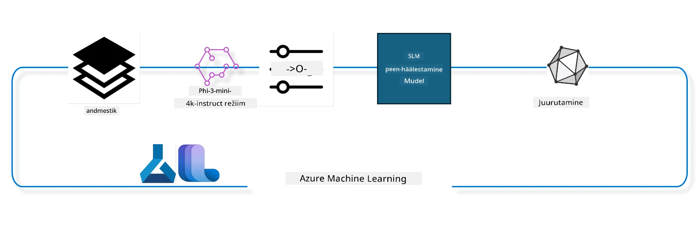

## Kuidas kasutada vestluste täitmise komponente Azure ML süsteemiregistrist mudeli peenhäälestamiseks

Selles näites teostame Phi-3-mini-4k-instruct mudeli peenhäälestuse, et lõpule viia vestlus kahe inimese vahel, kasutades ultrachat_200k andmekogumit.



Näide näitab, kuidas teha peenhäälestust Azure ML SDK ja Pythoni abil ning seejärel juurutada peenhäälestatud mudel reaalajas järeldusteks veebipunkti.

### Treeningandmed

Kasutame ultrachat_200k andmekogumit. See on tugevalt filtreeritud versioon UltraChat andmestikust ja seda kasutati Zephyr-7B-β koolitamiseks, mis on tipptasemel 7b vestlusmudel.

### Mudel

Kasutame Phi-3-mini-4k-instruct mudelit, et näidata, kuidas kasutaja saab peenhäälestada mudelit vestluste täitmise ülesande jaoks. Kui avasite selle märkmiku konkreetse mudelikaardi kaudu, pidage meeles konkreetse mudelinime asendamist.

### Ülesanded

- Valige mudel peenhäälestamiseks.
- Valige ja uurige treeningandmeid.
- Konfigureerige peenhäälestus töö.
- Käivitage peenhäälestus töö.
- Vaadake üle treeningu ja hindamise mõõdikud.
- Registreerige peenhäälestatud mudel.
- Juurutage peenhäälestatud mudel reaalajas järeldusteks.
- Puhastage ressursid.

## 1. Eeltingimuste seadistamine

- Installige sõltuvused
- Ühenduge AzureML tööruumiga. Lisateavet leiate teemast SDK autentimise seadistamine. Asendage allpool <WORKSPACE_NAME>, <RESOURCE_GROUP> ja <SUBSCRIPTION_ID>.
- Ühenduge azureml süsteemiregistriga
- Määrake valikuline eksperimendi nimi
- Kontrollige või looge arvutus

> [!NOTE]
> Nõuded: üks GPU sõlm võib sisaldada mitut GPU kaarti. Näiteks ühe Standard_NC24rs_v3 sõlme sees on 4 NVIDIA V100 GPU-d, samas kui Standard_NC12s_v3 sõlmes on 2 NVIDIA V100 GPU-d. Teabe saamiseks vaadake dokumentatsiooni. GPU kaartide arv sõlme kohta seatakse allolevas parameetris gpus_per_node. Selle väärtuse korrektne seadistamine tagab kõigi GPU-de kasutamise sõlmes. Soovitatud GPU arvutuskeskuse SKU-d leiate siit ja siit.

### Pythoni teegid

Paigaldage sõltuvused, käivitades alloleva koodi ploki. See ei ole vabatahtlik samm, kui töötate uues keskkonnas.

```bash
pip install azure-ai-ml
pip install azure-identity
pip install datasets==2.9.0
pip install mlflow
pip install azureml-mlflow
```

### Suhtlemine Azure ML-iga

1. See Pythoni skript on kasutusel Azure Machine Learning (Azure ML) teenusega suhtlemiseks. Järgnevalt on ülevaade, mida see teeb:

    - Impordib vajalikud moodulid azure.ai.ml, azure.identity ja azure.ai.ml.entities pakettidest. Samuti impordib time mooduli.

    - Üritab autentida kasutades DefaultAzureCredential(), mis pakub lihtsustatud autentimise kogemust Azure pilves rakenduste arendamiseks. Kui see ebaõnnestub, lülitub InteractiveBrowserCredential() peale, mis kuvab interaktiivse sisselogimisakna.

    - Järgmiseks proovib luua MLClienti eksemplari meetodiga from_config, mis loeb konfiguratsiooni vaikefailist (config.json). Kui see ebaõnnestub, loob MLClienti käsitsi, andes subscription_id, resource_group_name ja workspace_name.

    - Loob veel ühe MLClienti, seekord Azure ML registri "azureml" jaoks. See register hoiab mudeleid, peenhäälestuse torujuhtmeid ja keskkondi.

    - Määrab experiment_name väärtuseks "chat_completion_Phi-3-mini-4k-instruct".

    - Genereerib unikaalse ajatempli, teisendades praeguse aja (sekundites epohhist ujukomaarvuna) täisarvuks ja seejärel stringiks. Seda ajatemplit saab kasutada unikaalsete nimede ja versioonide loomiseks.

    ```python
    # Impordi vajalikud moodulid Azure ML ja Azure Identity'st
    from azure.ai.ml import MLClient
    from azure.identity import (
        DefaultAzureCredential,
        InteractiveBrowserCredential,
    )
    from azure.ai.ml.entities import AmlCompute
    import time  # Impordi ajamoodul
    
    # Proovi autentida kasutades DefaultAzureCredentiali
    try:
        credential = DefaultAzureCredential()
        credential.get_token("https://management.azure.com/.default")
    except Exception as ex:  # Kui DefaultAzureCredential ebaõnnestub, kasuta InteractiveBrowserCredentiali
        credential = InteractiveBrowserCredential()
    
    # Proovi luua MLClienti instants, kasutades vaikimisi konfigureerimisfaili
    try:
        workspace_ml_client = MLClient.from_config(credential=credential)
    except:  # Kui see ei õnnestu, loo MLClienti instants käsitsi andmeid sisestades
        workspace_ml_client = MLClient(
            credential,
            subscription_id="<SUBSCRIPTION_ID>",
            resource_group_name="<RESOURCE_GROUP>",
            workspace_name="<WORKSPACE_NAME>",
        )
    
    # Loo teine MLClienti instants Azure ML registri "azureml" jaoks
    # See register on koht, kus hoitakse mudeleid, peenhäälestusvooge ja keskkondi
    registry_ml_client = MLClient(credential, registry_name="azureml")
    
    # Määra eksperimendi nimi
    experiment_name = "chat_completion_Phi-3-mini-4k-instruct"
    
    # Genereeri unikaalne ajatemperatuur, mida saab kasutada nimedes ja versioonides, mis peavad olema unikaalsed
    timestamp = str(int(time.time()))
    ```

## 2. Valige mudel peenhäälestamiseks

1. Phi-3-mini-4k-instruct on 3,8 miljardi parameetriga, kerge, tipptasemel avatud mudel, mis on ehitatud Phi-2 koolitusandmete põhjal. Mudel kuulub Phi-3 mudeliperekonda ja Mini versioon on kahes variandis: 4K ja 128K, mis näitavad toetatavat konteksti pikkust (tokenites). Mudelit tuleb meie konkreetseks otstarbeks peenhäälestada. Neid mudeleid saate sirvida AzureML Studio Mudelite kataloogis, filtreerides vestluste täitmise ülesande alusel. Selles näites kasutame Phi-3-mini-4k-instruct mudelit. Kui avasite selle märkmiku mõne teise mudeli jaoks, asendage vastavalt mudelinimi ja versioon.

> [!NOTE]
> Mudeli id omadus. Seda antakse peenhäälestus tööle sisendina. Samuti leitav Mudeli omaduste lehel AzureML Studio Mudelite kataloogis väljana "Asset ID".

2. See Pythoni skript suhtleb Azure Machine Learning (Azure ML) teenusega. Järgnevalt on ülevaade, mida see teeb:

    - Määrab model_name väärtuseks "Phi-3-mini-4k-instruct".

    - Kasutab registry_ml_client objekti models omaduse get meetodit, et hankida Azure ML registrist selle nimega mudeli viimane versioon. get meetodile antakse kaks argumenti: mudeli nimi ja silt, mis näitab, et soovitakse kätte saada mudeli viimane versioon.

    - Prindib konsooli sõnumi, mis näitab peenhäälestamiseks kasutatava mudeli nime, versiooni ja id-d. Stringi format meetodit kasutatakse mudeli nime, versiooni ja id lisamiseks sõnumisse. Need omadused on foundation_model objekti omadused.

    ```python
    # Määra mudeli nimi
    model_name = "Phi-3-mini-4k-instruct"
    
    # Hangi mudeli uusim versioon Azure ML registrist
    foundation_model = registry_ml_client.models.get(model_name, label="latest")
    
    # Prindi mudeli nimi, versioon ja id
    # See teave on kasulik jälgimiseks ja silumiseks
    print(
        "\n\nUsing model name: {0}, version: {1}, id: {2} for fine tuning".format(
            foundation_model.name, foundation_model.version, foundation_model.id
        )
    )
    ```

## 3. Looge arvutusüksus, mida töö jaoks kasutada

Peenhäälestuse töö töötab AINULT GPU arvutusressursiga. Arvutusüksuse suurus sõltub mudeli suurusest ja enamikul juhtudel on keeruline õigesti valida. Selles lahtris juhendame kasutajat õige arvutuse valimiseks.

> [!NOTE]
> Allpool loetletud arvutusüksused töötavad kõige optimeerituma konfigüratsiooniga. Kõik konfiguratsiooni muudatused võivad põhjustada Cuda Out Of Memory vea. Sellisel juhul proovige suurendada arvutusüksuse suurust.

> [!NOTE]
> Arvutusüksuse cluster_size valimisel veenduge, et see on teie ressursigrupis saadaval. Kui teatud arvutusüksust ei ole, saate taotleda ligipääsu.

### Mudeli tugi peenhäälestuseks kontrollimine

1. See Pythoni skript suhtleb Azure Machine Learning (Azure ML) mudeliga. Järgnevalt on ülevaade, mida see teeb:

    - Impordib ast mooduli, mis pakub funktsioone Pythoni abstraktse süntaksi puu töötlemiseks.

    - Kontrollib, kas foundation_model objektil on tag nimega finetune_compute_allow_list. Tagid Azure ML mudelitel on võtme-väärtuse paarid, mida saate kasutada mudelite filtreerimiseks ja sortimiseks.

    - Kui finetune_compute_allow_list tag on olemas, kasutab ast.literal_eval funktsiooni, et ohutult tõlgendada sildi väärtuse (string) Pythoni listiks. Seda listi omistatakse computes_allow_list muutujale. Seejärel prindib teate, et arvutus tuleb luua selle nimekirja põhjal.

    - Kui finetune_compute_allow_list tag puudub, määrab computes_allow_list väärtuseks None ja prindib teate, et see tag ei kuulu mudeli tagide hulka.

    - Kokkuvõttes kontrollib see skript mudeli metadatas kindlat silti, teisendab selle väärtuse vajadusel listiks ja annab kasutajale tagasisidet.

    ```python
    # Impordi ast moodul, mis pakub funktsioone Python abstraktse süntaksi grammatika puude töötlemiseks
    import ast
    
    # Kontrolli, kas mudeli siltide seas on olemas märge 'finetune_compute_allow_list'
    if "finetune_compute_allow_list" in foundation_model.tags:
        # Kui märge on olemas, kasuta ast.literal_eval funktsiooni, et turvaliselt analüüsida märgi väärtus (string) Python listiks
        computes_allow_list = ast.literal_eval(
            foundation_model.tags["finetune_compute_allow_list"]
        )  # muuda string Python listiks
        # Trüki sõnum, mis näitab, et arvutus tuleks loendist luua
        print(f"Please create a compute from the above list - {computes_allow_list}")
    else:
        # Kui märget ei ole, määra computes_allow_list väärtuseks None
        computes_allow_list = None
        # Trüki sõnum, mis näitab, et 'finetune_compute_allow_list' märge ei ole mudeli siltide hulgas
        print("`finetune_compute_allow_list` is not part of model tags")
    ```

### Arvutusinstantsi kontrollimine

1. See Pythoni skript suhtleb Azure Machine Learning (Azure ML) teenusega ning teeb mitmeid kontrollimisi arvutusinstantsile. Järgnevalt on ülevaade, mida see teeb:

    - Üritab hankida compute instantsi nimega compute_cluster Azure ML tööruumist. Kui selle provisioning state on "failed", viskab ValueError'i.

    - Kui computes_allow_list ei ole None, teisendab kõik selle nimekirja arvutusvõimsuse suurused väikesteks tähtedeks ja kontrollib, kas praegune arvutuse suurus asub selles nimekirjas. Kui mitte, viskab ValueError'i.

    - Kui computes_allow_list on None, kontrollib, kas arvutuse suurus on toetamata GPU VM suuruste nimekirjas. Kui jah, viskab ValueError'i.

    - Hangib kõik töökohas olevad saadaval olevad arvutussuurused. Itereerib üle nimekirja ja kui mõne suuruse nimi vastab praeguse arvutuse suurusele, võtab selle suuruse GPUde arvu ning seab gpu_count_found väärtuseks True.

    - Kui gpu_count_found on True, prindib GPU-de arvu arvutusinstantsis. Kui False, viskab ValueError'i.

    - Kokkuvõttes teeb skript mitmeid kontrollimisi Azure ML tööruumi arvutusinstantsi kohta, sealhulgas selle provisioning state, selle suuruse võrreldes lubatud või keelatud nimekirjaga ning GPUde arvu.

    ```python
    # Prindi erandi sõnum
    print(e)
    # Tõsta ValueError, kui tööruumis ei ole saadaval arvutusmahtu
    raise ValueError(
        f"WARNING! Compute size {compute_cluster_size} not available in workspace"
    )
    
    # Hangi arvutusüksus Azure ML tööruumist
    compute = workspace_ml_client.compute.get(compute_cluster)
    # Kontrolli, kas arvutusüksuse pakkumise olek on "failed"
    if compute.provisioning_state.lower() == "failed":
        # Tõsta ValueError, kui pakkumise olek on "failed"
        raise ValueError(
            f"Provisioning failed, Compute '{compute_cluster}' is in failed state. "
            f"please try creating a different compute"
        )
    
    # Kontrolli, kas computes_allow_list ei ole None
    if computes_allow_list is not None:
        # Muuda kõik computes_allow_listi arvutusmahud väikesteks tähtedeks
        computes_allow_list_lower_case = [x.lower() for x in computes_allow_list]
        # Kontrolli, kas arvutusüksuse suurus on computes_allow_list_lower_case'is
        if compute.size.lower() not in computes_allow_list_lower_case:
            # Tõsta ValueError, kui arvutusüksuse suurus ei ole computes_allow_list_lower_case'is
            raise ValueError(
                f"VM size {compute.size} is not in the allow-listed computes for finetuning"
            )
    else:
        # Määra toetamatute GPU virtuaalmasinate suuruste nimekiri
        unsupported_gpu_vm_list = [
            "standard_nc6",
            "standard_nc12",
            "standard_nc24",
            "standard_nc24r",
        ]
        # Kontrolli, kas arvutusüksuse suurus on unsupported_gpu_vm_list'is
        if compute.size.lower() in unsupported_gpu_vm_list:
            # Tõsta ValueError, kui arvutusüksuse suurus on unsupported_gpu_vm_list'is
            raise ValueError(
                f"VM size {compute.size} is currently not supported for finetuning"
            )
    
    # Initsialiseeri lipp, et kontrollida, kas arvutusüksuse GPUde arv on leitud
    gpu_count_found = False
    # Hangi loend kõigist tööruumis saadaval olevatest arvutusmahtudest
    workspace_compute_sku_list = workspace_ml_client.compute.list_sizes()
    available_sku_sizes = []
    # Itereeri üle saadavalolevate arvutusmahtude nimekirja
    for compute_sku in workspace_compute_sku_list:
        available_sku_sizes.append(compute_sku.name)
        # Kontrolli, kas arvutusmahu nimi vastab arvutusüksuse suurusele
        if compute_sku.name.lower() == compute.size.lower():
            # Kui vastab, määra selle arvutusmahu GPUde arv ja sea gpu_count_found väärtuseks True
            gpus_per_node = compute_sku.gpus
            gpu_count_found = True
    # Kui gpu_count_found on True, prindi arvutusüksuse GPUde arv
    if gpu_count_found:
        print(f"Number of GPU's in compute {compute.size}: {gpus_per_node}")
    else:
        # Kui gpu_count_found on False, tõsta ValueError
        raise ValueError(
            f"Number of GPU's in compute {compute.size} not found. Available skus are: {available_sku_sizes}."
            f"This should not happen. Please check the selected compute cluster: {compute_cluster} and try again."
        )
    ```

## 4. Valige andmestik mudeli peenhäälestuseks

1. Kasutame ultrachat_200k andmestikku. Andmestikul on neli jagu, sobilik reguleeritud peenhäälestuseks (supervised fine-tuning, sft).
Generatsiooni järjestus (gen). Iga jagu näidatud näidete arv on järgmine:

    ```bash
    train_sft test_sft  train_gen  test_gen
    207865  23110  256032  28304
    ```

1. Järgmised lahtrid näitavad andmete põhjalikku ettevalmistust peenhäälestuseks:

### Vaadake mõningaid andmeridu

Soovime, et see näidis töötab kiiresti, seega salvestame train_sft ja test_sft failid, mis sisaldavad 5% juba kärbitud ridadest. See tähendab, et peenhäälestatud mudelil on madalam täpsus, seega ei tohiks seda reaalses maailmas kasutada.
download-dataset.py kasutatakse ultrachat_200k andmestiku allalaadimiseks ja andmestiku teisendamiseks peenhäälestuse torujuhtme komponendi kasutatavasse vormingusse. Kuna andmestik on suur, on meil siin ainult osa andmestikust.

1. Allolev skript laeb alla ainult 5% andmetest. Seda saab suurendada muutes dataset_split_pc parameetri soovitud protsendiks.

> [!NOTE]
> Mõned keelemudelid kasutavad erinevaid keelekoode, seega peaksid andmestiku veerunimed vastama sellele.

1. Näide, kuidas andmed peaksid välja nägema:
Vestluste täitmise andmestik on salvestatud parquet formaadis, kus iga kirje kasutab järgmist skeemi:

    - See on JSON (JavaScript Object Notation) dokument, mis on populaarne andmevahetuse formaat. See ei ole täidetav kood, vaid viis andmete salvestamiseks ja transportimiseks. Struktuuri ülevaade:

    - "prompt": Võti hoiab tekstiväärtust, mis esindab ülesannet või küsimust AI assistendile.

    - "messages": Võti hoiab objektide massiivi. Iga objekt esindab sõnumit vestluses kasutaja ja AI assistendi vahel. Iga sõnumi objektil on kaks võtit:

    - "content": Tekstiväärtus, mis esindab sõnumi sisu.
    - "role": Tekstiväärtus, mis näitab, kas sõnum tuli "user" (kasutaja) või "assistant" (assistendi) rollist.
    - "prompt_id": Tekstiväärtus, mis on unikaalne identifikaator "prompt"-ile.

1. Selles konkreetses JSON dokumendis on esitatud vestlus, kus kasutaja palub AI assistendil luua düstoopilise loo peategelane. Assistent vastab ning kasutaja palub rohkem detaile. Assistent nõustub lisama detaile. Kogu vestlus on seotud konkreetse prompt id-ga.

    ```python
    {
        // The task or question posed to an AI assistant
        "prompt": "Create a fully-developed protagonist who is challenged to survive within a dystopian society under the rule of a tyrant. ...",
        
        // An array of objects, each representing a message in a conversation between a user and an AI assistant
        "messages":[
            {
                // The content of the user's message
                "content": "Create a fully-developed protagonist who is challenged to survive within a dystopian society under the rule of a tyrant. ...",
                // The role of the entity that sent the message
                "role": "user"
            },
            {
                // The content of the assistant's message
                "content": "Name: Ava\n\n Ava was just 16 years old when the world as she knew it came crashing down. The government had collapsed, leaving behind a chaotic and lawless society. ...",
                // The role of the entity that sent the message
                "role": "assistant"
            },
            {
                // The content of the user's message
                "content": "Wow, Ava's story is so intense and inspiring! Can you provide me with more details.  ...",
                // The role of the entity that sent the message
                "role": "user"
            }, 
            {
                // The content of the assistant's message
                "content": "Certainly! ....",
                // The role of the entity that sent the message
                "role": "assistant"
            }
        ],
        
        // A unique identifier for the prompt
        "prompt_id": "d938b65dfe31f05f80eb8572964c6673eddbd68eff3db6bd234d7f1e3b86c2af"
    }
    ```

### Andmete allalaadimine

1. See Pythoni skript on kasutusel andmestiku allalaadimiseks abiskripti download-dataset.py kaudu. Järgnevalt on ülevaade, mida see teeb:

    - Impordib os mooduli, mis pakub platvormideülest ligipääsu opsüsteemi spetsiifilistele funktsioonidele.

    - Kasutab os.system funktsiooni, et käivitada download-dataset.py skript konkreetsete käsurea argumentidega. Argumendid määravad, millist andmestikku laadida (HuggingFaceH4/ultrachat_200k), kuhu allalaadimiskausta (ultrachat_200k_dataset) ning andmestiku protsendiosa (5). Os.system tagastab käsu väljumisseisundi, mis salvestatakse exit_status muutujasse.

    - Kontrollib, kas exit_status ei ole 0. Unix-laadsetes opsüsteemides tähistab 0 edukat käivitust, mis tahes muu väärtus viitab veale. Kui exit_status ei ole 0, viskab vea sõnumiga, et andmestiku allalaadimisel tekkis viga.

    - Kokkuvõtteks käivitab skript käsu andmestiku allalaadimiseks abiskripti abil ja tõstab vea, kui käsk ebaõnnestub.

    ```python
    # Impordi os moodul, mis pakub viisi operatsioonisüsteemispetsiifilise funktsionaalsuse kasutamiseks
    import os
    
    # Kasuta os.system funktsiooni, et käivitada download-dataset.py skript kestas koos kindlate käsurea argumentidega
    # Argumendid määravad, millist andmestikku alla laadida (HuggingFaceH4/ultrachat_200k), kuhu kausta allalaadimiseks (ultrachat_200k_dataset) ja andmestiku jagamise protsendi (5)
    # os.system funktsioon tagastab käivitatud käsu väljundseisundi; see seisund salvestatakse muutujasse exit_status
    exit_status = os.system(
        "python ./download-dataset.py --dataset HuggingFaceH4/ultrachat_200k --download_dir ultrachat_200k_dataset --dataset_split_pc 5"
    )
    
    # Kontrolli, kas exit_status ei ole 0
    # Unixilaadsetes operatsioonisüsteemides tähendab väljundseisund 0 tavaliselt, et käsk õnnestus, samas kui ükskõik milline muu number näitab viga
    # Kui exit_status ei ole 0, tekita Exception sõnumiga, mis näitab, et andmestiku allalaadimisel tekkis viga
    if exit_status != 0:
        raise Exception("Error downloading dataset")
    ```

### Andmete laadimine DataFrame'i
1. See Pythoni skript laadib JSON Lines faili pandas DataFrame'i ja kuvab esimesed 5 rida. Siin on ülevaade, mida see teeb:

    - Impordib pandas teegi, mis on võimas andmete manipuleerimise ja analüüsi teek.

    - Määrab pandas kuvamisvalikute maksimaalse veeru laiuse väärtuseks 0. See tähendab, et iga veeru kogu tekst kuvatakse ilma lühendamiseta, kui DataFrame trükitakse.

    - Kasutab funktsiooni pd.read_json, et laadida fail train_sft.jsonl kaustast ultrachat_200k_dataset DataFrame'i. Argumendiga lines=True märgitakse, et fail on JSON Lines formaadis, kus iga rida on eraldi JSON objekt.

    - Kasutab meetodit head, et kuvada DataFrame'i esimesed 5 rida. Kui DataFrame'il on vähem kui 5 rida, kuvatakse kõik read.

    - Kokkuvõtlikult laadib see skript JSON Lines faili DataFrame'i ja kuvab esimesed 5 rida täistekstiga veergudes.
    
    ```python
    # Impordi pandas teek, mis on võimas andmete manipuleerimise ja analüüsi teek
    import pandas as pd
    
    # Sea pandas kuvamise valikutes veeru maksimaalne laius väärtusele 0
    # See tähendab, et iga veeru täielik tekst kuvatakse ilma kärpimiseta, kui DataFrame trükitakse
    pd.set_option("display.max_colwidth", 0)
    
    # Kasuta pd.read_json funktsiooni, et laadida ultrachat_200k_dataset kataloogist train_sft.jsonl fail DataFrame'i
    # Argument lines=True näitab, et fail on JSON Lines formaadis, kus iga rida on eraldi JSON objekt
    df = pd.read_json("./ultrachat_200k_dataset/train_sft.jsonl", lines=True)
    
    # Kasuta meetodit head, et kuvada DataFrame'i esimesed 5 rida
    # Kui DataFrame'il on vähem kui 5 rida, kuvatakse need kõik
    df.head()
    ```

## 5. Esita peenhäälestuse töö kasutades mudelit ja andmeid sisendina

Loo töö, mis kasutab chat-completion toru komponenti. Õpi lähemalt kõikide parameetrite kohta, mida peenhäälestuse juures toetatakse.

### Peenhäälestuse parameetrite määratlemine

1. Peenhäälestuse parameetrid võib jagada 2 kategooriasse - treeningparameetrid, optimeerimisparameetrid

1. Treeningparameetrid määravad treeningu aspektid, nagu -

    - Kasutatav optimeerija, ajastaja
    - Metrik, mida peenhäälestuse optimeerimiseks kasutada
    - Treeningusammude arv ja partii suurus jms
    - Optimeerimisparameetrid aitavad GPU mälu optimeerida ja arvutusressursse efektiivselt kasutada.

1. Allpool on mõned selle kategooria parameetrid. Optimeerimisparameetrid erinevad mudeli järgi ja on pakitud mudeliga, et neid erinevusi hallata.

    - Luba deepspeed ja LoRA kasutamine
    - Luba segatud täpsusega treening
    - Luba mitme sõlmega treening

> [!NOTE]
> Juhendatud peenhäälestus võib põhjustada joondamise kaotuse või katastroofilise unustamise. Soovitame seda probleemi kontrollida ja pärast peenhäälestust jooksutada joondusetapp.

### Peenhäälestuse parameetrid

1. See Python skript seab masinaõppe mudeli peenhäälestuse parameetrid. Siin on, mida see teeb:

    - Määrab vaikimisi treeningparameetreid, nagu treeningu epohhide arv, treening- ja valideerimispartii suurused, õppemäär ja õppemäära ajastaja tüüp.

    - Määrab vaikimisi optimeerimisparameetreid, näiteks kas kasutada Layer-wise Relevance Propagation (LoRa) ja DeepSpeed, samuti DeepSpeed astet.

    - Kombineerib treening- ja optimeerimisparameetrid ühte sõnastikku finetune_parameters.

    - Kontrollib, kas foundation_modelil on mudelispetsiifilisi vaikeparameetreid. Kui on, prindib hoiatusteate ja uuendab finetune_parameters sõnastikku nende mudelispetsiifiliste vaikeseadistustega. Funktsioon ast.literal_eval teisendab mudelispetsiifilised vaikeseaded stringist Python'i sõnastikuks.

    - Prindib välja lõpuks kasutatavad peenhäälestuse parameetrid.

    - Kokkuvõtlikult seab see skript masinaõppe mudeli peenhäälestuse parameetrid ja kuvab need, võimaldades olemasolevaid vaikeseadeid mudelispetsiifilistega üle kirjutada.

    ```python
    # Seadista vaikimisi treeningparameetrid, nagu treeningepohhide arv, partii suurused treeninguks ja hindamiseks, õppemäär ja õppemäära ajakava tüüp
    training_parameters = dict(
        num_train_epochs=3,
        per_device_train_batch_size=1,
        per_device_eval_batch_size=1,
        learning_rate=5e-6,
        lr_scheduler_type="cosine",
    )
    
    # Seadista vaikimisi optimeerimisparameetrid, näiteks kas rakendada Layer-wise Relevance Propagation (LoRa) ja DeepSpeed ning DeepSpeed etapp
    optimization_parameters = dict(
        apply_lora="true",
        apply_deepspeed="true",
        deepspeed_stage=2,
    )
    
    # Ühenda treeningu ja optimeerimise parameetrid üheks sõnastikuks nimega finetune_parameters
    finetune_parameters = {**training_parameters, **optimization_parameters}
    
    # Kontrolli, kas foundation_modelil on mõningad mudelipõhised vaikimisi parameetrid
    # Kui on, siis trüki hoiatusteade ja uuenda finetune_parameters sõnastikku nende mudelipõhiste vaikimisi väärtustega
    # ast.literal_eval funktsiooni kasutatakse mudelispetsiifiliste vaikimisi väärtuste teisendamiseks stringist Python sõnastikuks
    if "model_specific_defaults" in foundation_model.tags:
        print("Warning! Model specific defaults exist. The defaults could be overridden.")
        finetune_parameters.update(
            ast.literal_eval(  # teisenda string Python sõnastikuks
                foundation_model.tags["model_specific_defaults"]
            )
        )
    
    # Trüki välja lõplik komplekt peenhäälestuse parameetritest, mida jooksul kasutatakse
    print(
        f"The following finetune parameters are going to be set for the run: {finetune_parameters}"
    )
    ```

### Treeningtõrmu

1. See Python skript defineerib funktsiooni masinaõppe treeningtõrmu kuvava nime genereerimiseks ning kutsub seda funktsiooni nime genereerimiseks ja kuvamiseks. Siin on, mida see teeb:

1. Defineeritakse funktsioon get_pipeline_display_name, mis genereerib kuvava nime treeningtõrmu erinevate parameetrite põhjal.

1. Funktsioonis arvutatakse kogupartii suurus, korrutades seadme kohta partii suuruse, gradientide akumulatsiooni sammude arvu, GPU-de arvu sõlme kohta ja sõlmede hulga, mida peenhäälestuseks kasutatakse.

1. Võetakse teisi parameetreid nagu õppemäära ajastaja tüüp, kas kasutatakse DeepSpeed'i, DeepSpeed aste, kas rakendatakse Layer-wise Relevance Propagation'it (LoRa), mudelikontrollpunktide hoidmise limiit ja maksimaalne jada pikkus.

1. Koostatakse string, mis sisaldab kõiki neid parameetreid sidekriipsudega eraldatuna. Kui DeepSpeed või LoRa on lubatud, sisaldab string vastavalt "ds" ja DeepSpeed astet või "lora". Kui mitte, siis kasutatakse "nods" või "nolora".

1. Funktsioon tagastab selle stringi, mis toimib treeningtõrmu kuvava nime.

1. Pärast funktsiooni määratlemist kutsutakse see välja, et genereerida ja kuvada kuvanimi.

1. Kokkuvõtlikult genereerib see skript masinaõppe treeningtõrmu kuvava nime erinevate parameetrite põhjal ning kuvab selle.

    ```python
    # Määra funktsioon, mis genereerib treeningutorule kuvamisnime
    def get_pipeline_display_name():
        # Arvuta kogu partii suurus, korrutades seadme kohta partii suuruse, gradiendi akumuleerimise sammude arvu, GPU-de arvu sõlme kohta ja peenhäälestuseks kasutatavate sõlmede arvu
        batch_size = (
            int(finetune_parameters.get("per_device_train_batch_size", 1))
            * int(finetune_parameters.get("gradient_accumulation_steps", 1))
            * int(gpus_per_node)
            * int(finetune_parameters.get("num_nodes_finetune", 1))
        )
        # Võta õppemäärade ajasturi tüüp
        scheduler = finetune_parameters.get("lr_scheduler_type", "linear")
        # Võta, kas DeepSpeed on rakendatud
        deepspeed = finetune_parameters.get("apply_deepspeed", "false")
        # Võta DeepSpeed etapp
        ds_stage = finetune_parameters.get("deepspeed_stage", "2")
        # Kui DeepSpeed on rakendatud, lisa kuvamisnimesse "ds", millele järgneks DeepSpeed etapp; kui mitte, lisa "nods"
        if deepspeed == "true":
            ds_string = f"ds{ds_stage}"
        else:
            ds_string = "nods"
        # Võta, kas on rakendatud kihiti tähtsuse levikut (LoRa)
        lora = finetune_parameters.get("apply_lora", "false")
        # Kui LoRa on rakendatud, lisa kuvamisnimesse "lora"; kui mitte, lisa "nolora"
        if lora == "true":
            lora_string = "lora"
        else:
            lora_string = "nolora"
        # Võta mudeli kontrollpunktide hoidmise limiit
        save_limit = finetune_parameters.get("save_total_limit", -1)
        # Võta maksimaalne järjestuse pikkus
        seq_len = finetune_parameters.get("max_seq_length", -1)
        # Koosta kuvamisnimi, ühendades kõik need parameetrid sidekriipsudega eraldatult
        return (
            model_name
            + "-"
            + "ultrachat"
            + "-"
            + f"bs{batch_size}"
            + "-"
            + f"{scheduler}"
            + "-"
            + ds_string
            + "-"
            + lora_string
            + f"-save_limit{save_limit}"
            + f"-seqlen{seq_len}"
        )
    
    # Kleebi funktsioon kuvamisnime genereerimiseks
    pipeline_display_name = get_pipeline_display_name()
    # Prindi kuvamisnimi
    print(f"Display name used for the run: {pipeline_display_name}")
    ```

### Toru seadistamine

See Python skript defineerib ja seadistab masinaõppe toru kasutades Azure Machine Learning SDK-d. Siin on, mida see teeb:

1. Impordib vajalikud moodulid Azure AI ML SDK-st.

1. Hangib registrist toru komponendi nimega "chat_completion_pipeline".

1. Defineerib torutöö kasutades `@pipeline` dekoratiivfunktsiooni ja funktsiooni `create_pipeline`. Toru nimeks määratakse `pipeline_display_name`.

1. Funktsioonis `create_pipeline` initsialiseerib hangitud toru komponendi erinevate parameetritega, sealhulgas mudeli tee, arvutusklastrid erinevate etappide jaoks, treeningu ja testimise andmekogumid, GPUde arv peenhäälestuseks ja teised peenhäälestuse parameetrid.

1. Suunab peenhäälestuse töö väljundi torutöö väljundiks, et peenhäälestatud mudelit oleks lihtne registreerida, mis on vajalik mudeli juurutamiseks veebi- või partiipunkti.

1. Loob toru instantsi, kutsudes välja funktsiooni `create_pipeline`.

1. Määrab toru sätte `force_rerun` väärtuseks `True`, mis tähendab, et eelnevatest töödest salvestatud vahemälu tulemusi ei kasutata.

1. Määrab toru sätte `continue_on_step_failure` väärtuseks `False`, mis tähendab, et toru peatub, kui mõni samm ebaõnnestub.

1. Kokkuvõtlikult on see skript defineerib ja seadistab masinaõppe toru vestluse lõpetamise ülesande jaoks kasutades Azure Machine Learning SDK-d.

    ```python
    # Impordi vajalikud moodulid Azure AI ML SDK-st
    from azure.ai.ml.dsl import pipeline
    from azure.ai.ml import Input
    
    # Hangi registrist torujuhtme komponent nimega "chat_completion_pipeline"
    pipeline_component_func = registry_ml_client.components.get(
        name="chat_completion_pipeline", label="latest"
    )
    
    # Määra torujuhtme töö kasutades @pipeline dekoratsiooni ja funktsiooni create_pipeline
    # Torujuhtme nimeks määratakse pipeline_display_name
    @pipeline(name=pipeline_display_name)
    def create_pipeline():
        # Algata hangitud torujuhtme komponent erinevate parameetritega
        # Nende hulka kuuluvad mudeli tee, arvutusklastrid erinevateks etappideks, andmestiku jagunemised treenimiseks ja testimiseks, kasutatavate GPUde arv peenhäälestamiseks ning muud peenhäälestamise parameetrid
        chat_completion_pipeline = pipeline_component_func(
            mlflow_model_path=foundation_model.id,
            compute_model_import=compute_cluster,
            compute_preprocess=compute_cluster,
            compute_finetune=compute_cluster,
            compute_model_evaluation=compute_cluster,
            # Kaardista andmestiku jagunemised parameetritele
            train_file_path=Input(
                type="uri_file", path="./ultrachat_200k_dataset/train_sft.jsonl"
            ),
            test_file_path=Input(
                type="uri_file", path="./ultrachat_200k_dataset/test_sft.jsonl"
            ),
            # Treenimise seaded
            number_of_gpu_to_use_finetuning=gpus_per_node,  # Määra arvutusressurssides saadaolevate GPUde arvuks
            **finetune_parameters
        )
        return {
            # Kaardista peenhäälestustöö väljund torujuhtme töö väljundile
            # Seda tehakse selleks, et saaksime hõlpsasti peenhäälestatud mudeli registreerida
            # Mudeli registreerimine on vajalik mudeli juurutamiseks veebipõhisele või partiilisele lõpp-punktile
            "trained_model": chat_completion_pipeline.outputs.mlflow_model_folder
        }
    
    # Loo torujuhtme eksemplar, kutsudes funktsiooni create_pipeline
    pipeline_object = create_pipeline()
    
    # Ära kasuta eelnevate tööde vahemällu salvestatud tulemusi
    pipeline_object.settings.force_rerun = True
    
    # Sea ebaõnnestumisel jätkamine väärtuseks False
    # See tähendab, et torujuhe peatub, kui mõni etapp ebaõnnestub
    pipeline_object.settings.continue_on_step_failure = False
    ```

### Töö esitamine

1. See Python skript esitab masinaõppe torutöö Azure Machine Learning töökeskkonda ja ootab, kuni töö lõpeb. Siin on, mida see teeb:

    - Kutsutakse välja meetod create_or_update objektil jobs Azure töökeskkonna kliendis, et saata torutöö. Tööd täidab pipeline_object ja töö all on määratud experiment_name.

    - Seejärel kutsutakse meetod stream objektil jobs, et oodata torutöö lõpetamist. Oodata on torutöö nime atribuuti pipeline_job.

    - Kokkuvõtlikult esitab see skript masinaõppe torutöö Azure Machine Learning töökeskkonda ja ootab selle lõpetamist.

    ```python
    # Esita torujuhtme töö Azure Machine Learningi tööruumi
    # Käivitamiseks määratud torujuhe on määratud muutuja pipeline_object abil
    # Katse, mille raames töö käivitatakse, on määratud muutujaga experiment_name
    pipeline_job = workspace_ml_client.jobs.create_or_update(
        pipeline_object, experiment_name=experiment_name
    )
    
    # Oota, kuni torujuhtme töö on lõpetatud
    # Ootamiseks määratud töö on määratud pipeline_job objekti nimeatribuudiga
    workspace_ml_client.jobs.stream(pipeline_job.name)
    ```

## 6. Registreeri peenhäälestatud mudel töökeskkonnas

Registreerime mudeli, mis on saadud peenhäälestuse töö väljundina. See jälgib järeltulijate seoste vahelist suhet peenhäälestatud mudeli ja peenhäälestuse töö vahel. Peenhäälestuse töö jälgib omakorda järeltulijate seoseid alusmudeli, andmete ja treeningkoodiga.

### ML mudeli registreerimine

1. See Python skript registreerib masinaõppe mudeli, mis treeniti Azure Machine Learning torus. Siin on, mida see teeb:

    - Impordib vajalikud moodulid Azure AI ML SDK-st.

    - Kontrollib, kas pipeline töö väljundist on saadaval trained_model, kutsudes meetodit get objektil jobs Azure töökeskkonna kliendis ja ligipääsudes selle väljundile outputs.

    - Koostab treenitud mudeli tee vormindades stringi, mis sisaldab torutöö nime ja väljundi nime ("trained_model").

    - Määrab peenhäälestatud mudeli nime, lisades originaalmudeli nimele "-ultrachat-200k" ning asendades kaldkriipsud sidekriipsudega.

    - Valmistub mudelit registreerima, luues Model objekti erinevate parameetritega, nagu mudeli tee, mudeli tüüp (MLflow mudel), mudeli nimi ja versioon ning mudeli kirjeldus.

    - Registreerib mudeli, kutsudes meetodit create_or_update objektil models Azure töökeskkonna kliendis, andes argumendiks Model objekti.

    - Trükib registreeritud mudeli välja.

1. Kokkuvõtlikult registreerib see skript masinaõppe mudeli, mis treeniti Azure Machine Learning toru kaudu.
    
    ```python
    # Impordi vajalikud moodulid Azure AI ML SDK-st
    from azure.ai.ml.entities import Model
    from azure.ai.ml.constants import AssetTypes
    
    # Kontrolli, kas `trained_model` väljund on töölõigu tööst saadaval
    print("pipeline job outputs: ", workspace_ml_client.jobs.get(pipeline_job.name).outputs)
    
    # Koosta tee treenitud mudelile, vormindades stringi töölõigu nime ja väljundi nimega ("trained_model")
    model_path_from_job = "azureml://jobs/{0}/outputs/{1}".format(
        pipeline_job.name, "trained_model"
    )
    
    # Määra peenhäälestatud mudelile nimi, lisades algsele mudelinimele "-ultrachat-200k" ja asendades kaldkriipsud sidekriipsudega
    finetuned_model_name = model_name + "-ultrachat-200k"
    finetuned_model_name = finetuned_model_name.replace("/", "-")
    
    print("path to register model: ", model_path_from_job)
    
    # Valmista mudeli registreerimiseks ette, luues Model objekti mitmete parameetritega
    # Siia kuuluvad mudeli tee, mudeli tüüp (MLflow mudel), mudeli nimi ja versioon ning mudeli kirjeldus
    prepare_to_register_model = Model(
        path=model_path_from_job,
        type=AssetTypes.MLFLOW_MODEL,
        name=finetuned_model_name,
        version=timestamp,  # Kasuta versiooni vältimiseks konfliktide teket ajatemplit
        description=model_name + " fine tuned model for ultrachat 200k chat-completion",
    )
    
    print("prepare to register model: \n", prepare_to_register_model)
    
    # Registreeri mudel, kutsudes välja workspace_ml_client mudelites meetodi create_or_update, kasutades Model objekti argumendina
    registered_model = workspace_ml_client.models.create_or_update(
        prepare_to_register_model
    )
    
    # Prindi registreeritud mudel
    print("registered model: \n", registered_model)
    ```

## 7. Juuruta peenhäälestatud mudel veebi lõpp-punkti

Veebipõhised lõpp-punktid pakuvad püsivat REST API-d, mida saab kasutada mudeli integreerimiseks rakendustega.

### Lõpp-punkti haldamine

1. See Python skript loob hallatud veebilõpp-punkti Azure Machine Learningis registreeritud mudeli jaoks. Siin on, mida see teeb:

    - Impordib vajalikud moodulid Azure AI ML SDK-st.

    - Defineerib unikaalse nime veebi lõpp-punktile, lisades stringile "ultrachat-completion-" ajatempliga.

    - Valmistub veebi lõpp-punkti loomiseks, luues ManagedOnlineEndpoint objekti erinevate parameetritega, sealhulgas lõpp-punkti nimi, kirjeldus ja autentimismeetod ("key").

    - Loob veebi lõpp-punkti, kutsudes meetodit begin_create_or_update Azure töökeskkonna kliendi objektis workspace_ml_client, andes argumendiks ManagedOnlineEndpoint objekti. Seejärel ootab loomise lõpetamist, kutsudes meetodit wait.

1. Kokkuvõtlikult loob see skript hallatud veebi lõpp-punkti Azure Machine Learningis registreeritud mudeli jaoks.

    ```python
    # Impordi vajalikud moodulid Azure AI ML SDK-st
    from azure.ai.ml.entities import (
        ManagedOnlineEndpoint,
        ManagedOnlineDeployment,
        ProbeSettings,
        OnlineRequestSettings,
    )
    
    # Määra veebipunktile ainulaadne nimi, lisades ajatempli stringile "ultrachat-completion-"
    online_endpoint_name = "ultrachat-completion-" + timestamp
    
    # Valmista ette veebipunkti loomine, luues ManagedOnlineEndpoint objekti erinevate parameetritega
    # Nende hulka kuuluvad punkti nimi, punkti kirjeldus ja autentimismeetod ("key")
    endpoint = ManagedOnlineEndpoint(
        name=online_endpoint_name,
        description="Online endpoint for "
        + registered_model.name
        + ", fine tuned model for ultrachat-200k-chat-completion",
        auth_mode="key",
    )
    
    # Loo veebipunkt, kutsudes workspace_ml_client'i meetodit begin_create_or_update ja andes argumendiks ManagedOnlineEndpoint objekti
    # Seejärel oota, kuni loomise operatsioon lõpeb, kutsudes meetodit wait
    workspace_ml_client.begin_create_or_update(endpoint).wait()
    ```

> [!NOTE]
> Siin leiate nimekirja toetatud SKU-de kohta juurutamiseks - [Hallatud veebi lõpp-punktide SKU nimekiri](https://learn.microsoft.com/azure/machine-learning/reference-managed-online-endpoints-vm-sku-list)

### ML mudeli juurutamine

1. See Python skript juurutab registreeritud masinaõppe mudeli hallatud veebilõpp-punkti Azure Machine Learningis. Siin on, mida see teeb:

    - Impordib mooduli ast, mis pakub funktsioone Python'i abstraktse süntaksi puude töötlemiseks.

    - Määrab juurutuse instantsitüübiks "Standard_NC6s_v3".

    - Kontrollib, kas foundation_modelis on silt inference_compute_allow_list. Kui on, teisendab selle väärtuse stringina Python'i listiks ja määrab selle inference_computes_allow_list muutuja väärtuseks. Kui pole, seab selle väärtuseks None.

    - Kontrollib, kas valitud instantsitüüp on lubatud nimekirjas. Kui ei ole, prindib teate, mis palub valida lubatud nimekirjast.

    - Valmistub juurutuse loomiseks, luues ManagedOnlineDeployment objekti erinevate parameetritega, sealhulgas juurutuse nimi, lõpp-punkti nimi, mudeli ID, instantsitüüp ja arv, liveness-probe sätteid ja päringute seadeid.

    - Loob juurutuse, kutsudes meetodit begin_create_or_update Azure töökeskkonna kliendi objektis workspace_ml_client, andes argumendiks ManagedOnlineDeployment objekti. Seejärel ootab operatsiooni lõpetamist meetodiga wait.

    - Määrab lõpp-punkti liikluse 100% jagunemise juurutusele nimega "demo".

    - Uuendab lõpp-punkti, kutsudes meetodit begin_create_or_update Azure töökeskkonna kliendi objektis workspace_ml_client, andes argumendiks lõpp-punkti objekti. Seejärel ootab uuenduse lõpetamist meetodiga result.

1. Kokkuvõtlikult juurutab see skript registreeritud masinaõppe mudeli hallatud veebilõpp-punkti Azure Machine Learningis.

    ```python
    # Impordi ast moodul, mis pakub funktsioone Python abstraktse süntaksipuu töötlemiseks
    import ast
    
    # Sea juurutuse eksemplari tüüp
    instance_type = "Standard_NC6s_v3"
    
    # Kontrolli, kas aluseks oleval mudelil on olemas `inference_compute_allow_list` silt
    if "inference_compute_allow_list" in foundation_model.tags:
        # Kui on, muuda sildi väärtus stringist Pythoni listiks ja määra see `inference_computes_allow_list`-le
        inference_computes_allow_list = ast.literal_eval(
            foundation_model.tags["inference_compute_allow_list"]
        )
        print(f"Please create a compute from the above list - {computes_allow_list}")
    else:
        # Kui ei ole, sea `inference_computes_allow_list` väärtuseks `None`
        inference_computes_allow_list = None
        print("`inference_compute_allow_list` is not part of model tags")
    
    # Kontrolli, kas määratud eksemplari tüüp on lubatud nimekirjas
    if (
        inference_computes_allow_list is not None
        and instance_type not in inference_computes_allow_list
    ):
        print(
            f"`instance_type` is not in the allow listed compute. Please select a value from {inference_computes_allow_list}"
        )
    
    # Valmista ette juurutuse loomine, luues `ManagedOnlineDeployment` objekti mitme parameetriga
    demo_deployment = ManagedOnlineDeployment(
        name="demo",
        endpoint_name=online_endpoint_name,
        model=registered_model.id,
        instance_type=instance_type,
        instance_count=1,
        liveness_probe=ProbeSettings(initial_delay=600),
        request_settings=OnlineRequestSettings(request_timeout_ms=90000),
    )
    
    # Loo juurutus, kutsudes `workspace_ml_client` meetodit `begin_create_or_update`, kasutades argumendina `ManagedOnlineDeployment` objekti
    # Seejärel oota, kuni loomise operatsioon lõpetatakse, kutsudes `wait` meetodit
    workspace_ml_client.online_deployments.begin_create_or_update(demo_deployment).wait()
    
    # Sea lõpp-punkti liiklus nii, et 100% liiklus suunatakse "demo" juurutusele
    endpoint.traffic = {"demo": 100}
    
    # Uuenda lõpp-punkti, kutsudes `workspace_ml_client` meetodit `begin_create_or_update`, kasutades argumendina `endpoint` objekti
    # Seejärel oota, kuni uuenduse operatsioon lõpetatakse, kutsudes `result` meetodit
    workspace_ml_client.begin_create_or_update(endpoint).result()
    ```

## 8. Testi lõpp-punkti näidisandmetega

Toome testandmestikust mõned näidisandmed ja esitame need veebi lõpp-punktile ennustamiseks. Seejärel kuvame ennustatud sildid koos tegelike siltidega.

### Tulemite lugemine

1. See Python skript loeb JSON Lines faili pandas DataFrame'i, võtab juhusliku valimi ja lähtestab indeksi. Siin on, mida see teeb:

    - Loeb faili ./ultrachat_200k_dataset/test_gen.jsonl pandas DataFrame'i. Kasutatakse read_json funktsiooni argumendiga lines=True, sest fail on JSON Lines formaadis, kus iga rida on eraldi JSON objekt.

    - Võtab juhusliku valimi ühest reast DataFrame'ist. Kasutatakse funktsiooni sample argumendiga n=1, et valida üks juhuslik rida.

    - Lähtestab DataFrame'i indeksi. Kasutatakse reset_index funktsiooni argumendiga drop=True, et loobuda algsest indeksist ja lisada uus vaikimisi täisarvuline indeks.

    - Kuvab DataFrame'i kaks esimest rida funktsiooniga head argumendiga 2. Kuna DataFrame'is on pärast valimi võtmist vaid üks rida, kuvab see vaid selle ühe rea.

1. Kokkuvõtlikult loeb skript JSON Lines faili pandas DataFrame'i, võtab juhusliku ühe rea valimi, lähtestab indeksi ja kuvab esimese rea.
    
    ```python
    # Impordi pandas teek
    import pandas as pd
    
    # Loe JSON Lines fail './ultrachat_200k_dataset/test_gen.jsonl' pandas DataFrame'i
    # Argument 'lines=True' näitab, et fail on JSON Lines formaadis, kus iga rida on eraldi JSON objekt
    test_df = pd.read_json("./ultrachat_200k_dataset/test_gen.jsonl", lines=True)
    
    # Võta DataFrame'ist juhuslikult 1 rida
    # Argument 'n=1' määrab juhuslike ridade arvu, mida valida
    test_df = test_df.sample(n=1)
    
    # Lähtesta DataFrame'i indeks
    # Argument 'drop=True' näitab, et algne indeks tuleks eemaldada ja asendada uue vaike-murdarvulise indeksiga
    # Argument 'inplace=True' näitab, et DataFrame tuleks muuta kohapeal (ilma uue objekti loomata)
    test_df.reset_index(drop=True, inplace=True)
    
    # Kuvada DataFrame'i esimene 2 rida
    # Kuid kuna pärast valimi võtmist sisaldab DataFrame ainult üht rida, kuvatakse ainult see üks rida
    test_df.head(2)
    ```

### Loo JSON objekt
1. See Pythoni skript loob JSON-objekti kindlate parameetritega ja salvestab selle faili. Siin on, mida see täidab:

    - See impordib json mooduli, mis pakub funktsioone JSON-andmetega töötamiseks.

    - See loob sõnastiku parameters, mille võtmed ja väärtused esindavad masinaõppemudeli parameetreid. Võtmed on "temperature", "top_p", "do_sample" ja "max_new_tokens", ning nende vastavad väärtused on 0.6, 0.9, True ja 200.

    - See loob teise sõnastiku test_json kahe võtmega: "input_data" ja "params". "input_data" väärtuseks on teine sõnastik võtmetega "input_string" ja "parameters". "input_string" väärtuseks on nimekiri, mis sisaldab esimest sõnumit test_df DataFrame’ist. "parameters" väärtuseks on varem loodud parameters sõnastik. "params" väärtuseks on tühi sõnastik.

    - See avab faili nimega sample_score.json

    ```python
    # Impordi json moodul, mis pakub funktsioone JSON andmetega töötamiseks
    import json
    
    # Loo sõnastik `parameters`, mille võtmed ja väärtused esindavad masinõppemudeli parameetreid
    # Võtmed on "temperature", "top_p", "do_sample" ja "max_new_tokens" ning nende vastavad väärtused on 0.6, 0.9, True ja 200
    parameters = {
        "temperature": 0.6,
        "top_p": 0.9,
        "do_sample": True,
        "max_new_tokens": 200,
    }
    
    # Loo teine sõnastik `test_json`, millel on kaks võtit: "input_data" ja "params"
    # "input_data" väärtus on teine sõnastik, mille võtmed on "input_string" ja "parameters"
    # "input_string" väärtus on loend, mis sisaldab esimest sõnumit `test_df` DataFrame'ist
    # "parameters" väärtus on eelnevalt loodud `parameters` sõnastik
    # "params" väärtus on tühi sõnastik
    test_json = {
        "input_data": {
            "input_string": [test_df["messages"][0]],
            "parameters": parameters,
        },
        "params": {},
    }
    
    # Ava fail nimega `sample_score.json` kaustas `./ultrachat_200k_dataset` kirjutamisrežiimis
    with open("./ultrachat_200k_dataset/sample_score.json", "w") as f:
        # Kirjuta sõnastik `test_json` faili JSON formaadis, kasutades `json.dump` funktsiooni
        json.dump(test_json, f)
    ```

### Otspunkti kutsumine

1. See Pythoni skript kutsub Azure Machine Learning-i veebipõhist otspunkti, et hinnata JSON-faili. Siin on, mida see teeb:

    - See kutsub workspace_ml_client objekti online_endpoints atribuudi invoke meetodit. Seda meetodit kasutatakse, et saata päring veebipõhisele otspunktile ja saada vastus.

    - See määrab otspunkti nime ja juurutuse argumendiga endpoint_name ja deployment_name. Sel juhul on otspunkti nimi salvestatud muutujasse online_endpoint_name ja juurutuse nimi on "demo".

    - See määrab JSON-faili tee, mida hinnata, argumendiga request_file. Sel juhul on fail ./ultrachat_200k_dataset/sample_score.json.

    - See salvestab otspunkti vastuse muutujasse response.

    - See prindib toore vastuse välja.

1. Kokkuvõtlikult kutsub see skript Azure Machine Learning-is veebipõhist otspunkti, et hinnata JSON-faili ja prindib vastuse.

    ```python
    # Kutsu Azure Machine Learningis veebipõhist lõpp-punkti, et skoorida `sample_score.json` faili
    # `workspace_ml_client` objekti `online_endpoints` atribuudi `invoke` meetodit kasutatakse taotluse saatmiseks veebipõhisele lõpp-punktile ja vastuse saamiseks
    # `endpoint_name` argument määrab lõpp-punkti nime, mis on salvestatud muutujasse `online_endpoint_name`
    # `deployment_name` argument määrab juurutuse nime, mis on "demo"
    # `request_file` argument määrab JSON-faili tee, mida skoorida, see on `./ultrachat_200k_dataset/sample_score.json`
    response = workspace_ml_client.online_endpoints.invoke(
        endpoint_name=online_endpoint_name,
        deployment_name="demo",
        request_file="./ultrachat_200k_dataset/sample_score.json",
    )
    
    # Prindi lõpp-punktist saadud puhas vastus
    print("raw response: \n", response, "\n")
    ```

## 9. Kustuta veebipõhine otspunkt

1. Ära unusta veebipõhist otspunkti kustutada, vastasel juhul jätkad arvelduse käivitamist otspunkti kasutatud arvutusvõimsuse eest. See Pythoni koodijupp kustutab veebipõhise otspunkti Azure Machine Learning-is. Siin on, mida see teeb:

    - See kutsub workspace_ml_client objekti online_endpoints atribuudi begin_delete meetodit. Seda meetodit kasutatakse veebipõhise otspunkti kustutamise alustamiseks.

    - See määrab kustutatava otspunkti nime argumendiga name. Sel juhul on otspunkti nimi salvestatud muutujasse online_endpoint_name.

    - See kutsub wait meetodi, et oodata kustutamise lõpetamist. See on blokeeriv toiming, mis tähendab, et skript ei jätka enne, kui kustutamine on lõpetatud.

    - Kokkuvõttes alustab see koodijupp veebipõhise otspunkti kustutamist Azure Machine Learning-is ja ootab, kuni operatsioon lõpeb.

    ```python
    # Kustuta Azure Machine Learningi veebipõhine lõpp-punkt
    # `workspace_ml_client` objekti `online_endpoints` atribuudi `begin_delete` meetodit kasutatakse veebipõhise lõpp-punkti kustutamise alustamiseks
    # `name` argument määrab kustutatava lõpp-punkti nime, mis on salvestatud muutujasse `online_endpoint_name`
    # Kutsutakse meetodit `wait`, et oodata kustutamise lõppemist. See on blokeeriv operatsioon, mis tähendab, et see takistab skripti jätkumist kuni kustutamine on lõpetatud
    workspace_ml_client.online_endpoints.begin_delete(name=online_endpoint_name).wait()
    ```

---

<!-- CO-OP TRANSLATOR DISCLAIMER START -->
**Vastutusest loobumine**:  
See dokument on tõlgitud AI tõlketeenuse [Co-op Translator](https://github.com/Azure/co-op-translator) abil. Kuigi püüame tagada täpsust, võib automaatsetes tõlgetes esineda vigu või ebatäpsusi. Originaaldokument selle algkeeles tuleks pidada autoriteetseks allikaks. Kriitilise tähtsusega teabe puhul soovitatakse kasutada professionaalset inimtõlget. Me ei vastuta selle tõlke kasutamisest tulenevate arusaamatuste või valesti mõistmiste eest.
<!-- CO-OP TRANSLATOR DISCLAIMER END -->