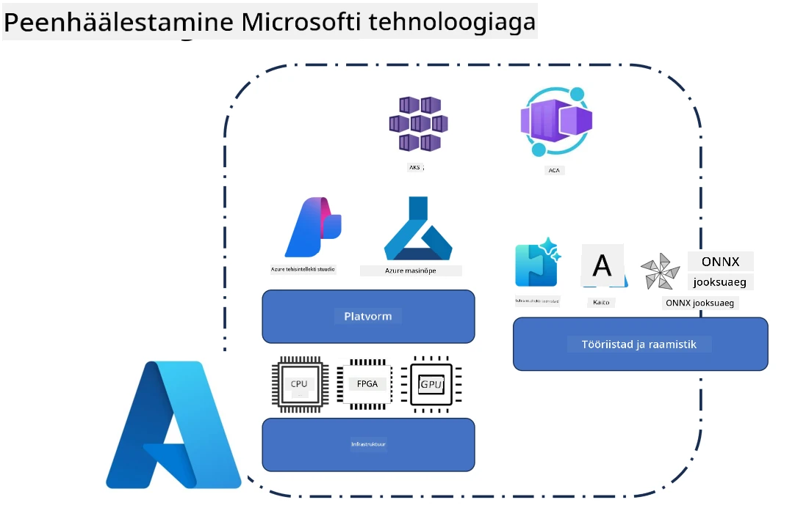
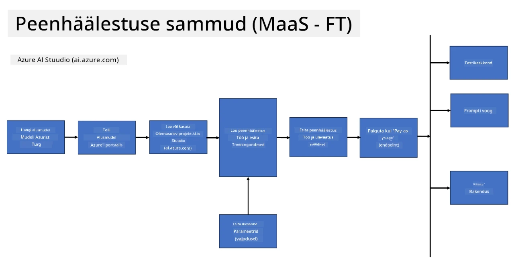
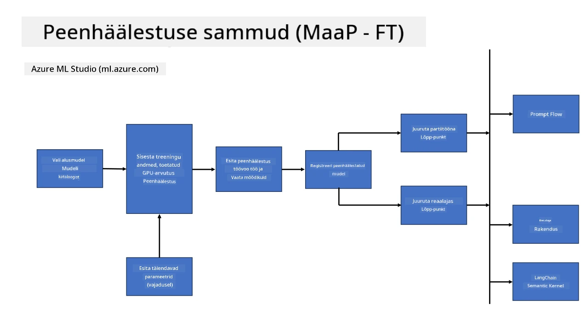
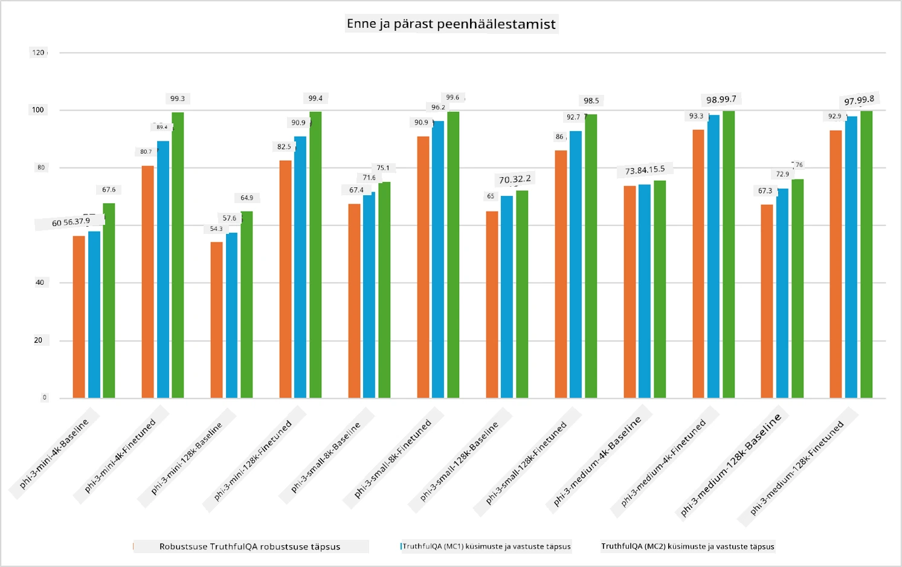

## Hõrenemise stsenaariumid

See jaotis annab ülevaate Microsoft Foundry ja Azure keskkondade hõrenemise stsenaariumitest, sealhulgas juurutusmudelitest, infrastruktuuri kihtidest ja sageli kasutatavatest optimeerimistehnikatest.

**Platvorm**  
Siia kuuluvad hallatud teenused nagu Microsoft Foundry (endine Azure AI Foundry) ja Azure Machine Learning, mis pakuvad mudelite haldamist, orkestreerimist, katsete jälgimist ja juurutuse töövooge.

**Infrastruktuur**  
Hõrenemine nõuab skaleeritavaid arvutusressursse. Azure keskkondades hõlmab see tavaliselt GPU-põhiseid virtuaalmasinaid ja CPU ressursse kergemate töökoormuste jaoks ning skaleeritavat salvestusruumi andmekogumite ja kontrollpunktide jaoks.

**Tööriistad ja raamistik**  
Hõrenemise töövood tuginevad tavaliselt raamistikule ja optimeerimisteekidele nagu Hugging Face Transformers, DeepSpeed ja PEFT (Parameter-Efficient Fine-Tuning).

Hõrenemisprotsess Microsofti tehnoloogiatega hõlmab platvormiteenuseid, arvutusinfrastruktuuri ja treeninguraamistikke. Mõistes, kuidas need komponendid omavahel töötavad, saavad arendajad efektiivselt kohandada baas- ja algmudelid kindlate ülesannete ja tootmistsenaariumite jaoks.

## Mudel teenusena

Hõrena mudelit hostitud hõrenemise abil, ilma arvutusvõimsust ise looma ja haldamata.

Serverita hõrenemine on nüüd saadaval Phi-3, Phi-3.5 ja Phi-4 mudelifamiljadele, võimaldades arendajatel mudeleid kiiresti ja lihtsalt kohandada pilve- ja servatsenaariumide jaoks ilma arvutusvõimsust eraldamata.

## Mudel platvormina

Kasutajad haldavad oma arvutusressursse, et oma mudeleid hõreneda.

[Fine Tuning Sample](https://github.com/Azure/azureml-examples/blob/main/sdk/python/foundation-models/system/finetune/chat-completion/chat-completion.ipynb)

## Hõrenemise tehnikate võrdlus

|Stsenaarium|LoRA|QLoRA|PEFT|DeepSpeed|ZeRO|DoRA|
|---|---|---|---|---|---|---|
|Eeltrenitud LLM-ide kohandamine konkreetsete ülesannete või valdkondade jaoks|Jah|Jah|Jah|Jah|Jah|Jah|
|Hõrenemine NLP ülesannete jaoks nagu teksti klassifitseerimine, nimetatud üksuste tuvastamine ja masintõlge|Jah|Jah|Jah|Jah|Jah|Jah|
|Hõrenemine QA ülesannete jaoks|Jah|Jah|Jah|Jah|Jah|Jah|
|Hõrenemine inimlaadsete vastuste genereerimiseks juturobotites|Jah|Jah|Jah|Jah|Jah|Jah|
|Hõrenemine muusika, kunsti või muu loovuse genereerimiseks|Jah|Jah|Jah|Jah|Jah|Jah|
|Arvutus- ja rahakulude vähendamine|Jah|Jah|Jah|Jah|Jah|Jah|
|Mälu kasutamise vähendamine|Jah|Jah|Jah|Jah|Jah|Jah|
|Väiksema parameetrite arvuga efektiivne hõrenemine|Jah|Jah|Jah|Ei|Ei|Jah|
|Mäluefektiivne andmeparalleelsuse vorm, mis annab juurdepääsu kõigi olemasolevate GPU seadmete agregaatmäluressursile|Ei|Ei|Ei|Jah|Jah|Ei|

> [!NOTE]
> LoRA, QLoRA, PEFT ja DoRA on parameetrite-tõhusad hõrenemismeetodid, samas kui DeepSpeed ja ZeRO keskenduvad hajutatud treeningule ja mälu optimeerimisele.

## Hõrenemise jõudlusnäited

---

<!-- CO-OP TRANSLATOR DISCLAIMER START -->
**Hõivamärkus**:
See dokument on tõlgitud kasutades tehisintellekti tõlketeenust [Co-op Translator](https://github.com/Azure/co-op-translator). Kuigi püüame täpsust, palun arvestage, et automaatsed tõlked võivad sisaldada vigu või ebakõlasid. Originaaldokument selle emakeeles peaks olema autoriteetne allikas. Olulise teabe puhul soovitatakse kasutada professionaalset inimtõlget. Me ei vastuta ühegi arusaamatuse või valesti tõlgendamise eest, mis võivad sellest tõlkest tuleneda.
<!-- CO-OP TRANSLATOR DISCLAIMER END -->