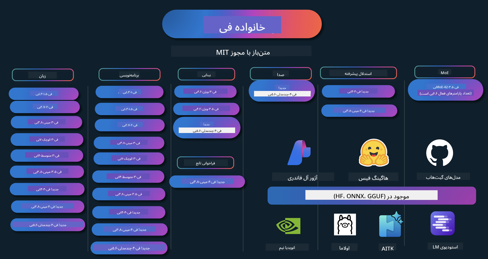

<!--
CO_OP_TRANSLATOR_METADATA:
{
  "original_hash": "10139744c0f1757a5ade1c66749e803f",
  "translation_date": "2025-05-04T13:29:58+00:00",
  "source_file": "README.md",
  "language_code": "fa"
}
-->
# کتاب آشپزی Phi: مثال‌های عملی با مدل‌های Phi مایکروسافت

  

  
  
  

  
  

Phi مجموعه‌ای از مدل‌های هوش مصنوعی متن‌باز است که توسط مایکروسافت توسعه یافته‌اند.

Phi در حال حاضر قدرتمندترین و مقرون‌به‌صرفه‌ترین مدل زبان کوچک (SLM) است که در زمینه‌های چندزبانه، استدلال، تولید متن/چت، برنامه‌نویسی، تصاویر، صوت و سایر سناریوها عملکرد بسیار خوبی دارد.

شما می‌توانید Phi را در فضای ابری یا دستگاه‌های لبه‌ای مستقر کنید و به‌راحتی با منابع محاسباتی محدود، برنامه‌های هوش مصنوعی مولد بسازید.

برای شروع استفاده از این منابع، مراحل زیر را دنبال کنید:  
1. **فورک کردن مخزن**: کلیک کنید روی   
2. **کلون کردن مخزن**: `git clone https://github.com/microsoft/PhiCookBook.git`  
3. [**عضویت در جامعه دیسکورد مایکروسافت AI و ملاقات با کارشناسان و توسعه‌دهندگان دیگر**](https://discord.com/invite/ByRwuEEgH4?WT.mc_id=aiml-137032-kinfeylo)

## 🌐 پشتیبانی چندزبانه
[فرانسوی](../fr/README.md) | [اسپانیایی](../es/README.md) | [آلمانی](../de/README.md) | [روسی](../ru/README.md) | [عربی](../ar/README.md) | [فارسی](./README.md) | [اردو](../ur/README.md) | [چینی (ساده‌شده)](../zh/README.md) | [چینی (سنتی، ماکائو)](../mo/README.md) | [چینی (سنتی، هنگ کنگ)](../hk/README.md) | [چینی (سنتی، تایوان)](../tw/README.md) | [ژاپنی](../ja/README.md) | [کره‌ای](../ko/README.md) | [هندی](../hi/README.md) | [بنگالی](../bn/README.md) | [مراتی](../mr/README.md) | [نپالی](../ne/README.md) | [پنجابی (گورمکھی)](../pa/README.md) | [پرتغالی (پرتغال)](../pt/README.md) | [پرتغالی (برزیل)](../br/README.md) | [ایتالیایی](../it/README.md) | [لهستانی](../pl/README.md) | [ترکی](../tr/README.md) | [یونانی](../el/README.md) | [تایلندی](../th/README.md) | [سوئدی](../sv/README.md) | [دانمارکی](../da/README.md) | [نروژی](../no/README.md) | [فنلاندی](../fi/README.md) | [هلندی](../nl/README.md) | [عبری](../he/README.md) | [ویتنامی](../vi/README.md) | [اندونزیایی](../id/README.md) | [مالایی](../ms/README.md) | [تاگالوگ (فیلیپینی)](../tl/README.md) | [سواحیلی](../sw/README.md) | [مجارستانی](../hu/README.md) | [چکی](../cs/README.md) | [اسلواکی](../sk/README.md) | [رومانیایی](../ro/README.md) | [بلغاری](../bg/README.md) | [صربی (سیریلیک)](../sr/README.md) | [کرواسی](../hr/README.md) | [اسلوونیایی](../sl/README.md)
## فهرست مطالب

- مقدمه  
  - [خوش آمدید به خانواده Phi](./md/01.Introduction/01/01.PhiFamily.md)  
  - [راه‌اندازی محیط کاری شما](./md/01.Introduction/01/01.EnvironmentSetup.md)  
  - [درک فناوری‌های کلیدی](./md/01.Introduction/01/01.Understandingtech.md)  
  - [ایمنی هوش مصنوعی برای مدل‌های Phi](./md/01.Introduction/01/01.AISafety.md)  
  - [پشتیبانی سخت‌افزاری Phi](./md/01.Introduction/01/01.Hardwaresupport.md)  
  - [مدل‌های Phi و دسترسی آنها در پلتفرم‌های مختلف](./md/01.Introduction/01/01.Edgeandcloud.md)  
  - [استفاده از Guidance-ai و Phi](./md/01.Introduction/01/01.Guidance.md)  
  - [مدل‌های بازار GitHub](https://github.com/marketplace/models)  
  - [کاتالوگ مدل‌های هوش مصنوعی Azure](https://ai.azure.com)

- استنتاج Phi در محیط‌های مختلف  
    -  [Hugging face](./md/01.Introduction/02/01.HF.md)  
    -  [مدل‌های GitHub](./md/01.Introduction/02/02.GitHubModel.md)  
    -  [کاتالوگ مدل‌های Azure AI Foundry](./md/01.Introduction/02/03.AzureAIFoundry.md)  
    -  [Ollama](./md/01.Introduction/02/04.Ollama.md)  
    -  [ابزارک AI برای VSCode (AITK)](./md/01.Introduction/02/05.AITK.md)  
    -  [NVIDIA NIM](./md/01.Introduction/02/06.NVIDIA.md)

- استنتاج خانواده Phi  
    - [استنتاج Phi در iOS](./md/01.Introduction/03/iOS_Inference.md)  
    - [استنتاج Phi در اندروید](./md/01.Introduction/03/Android_Inference.md)  
    - [استنتاج Phi در Jetson](./md/01.Introduction/03/Jetson_Inference.md)  
    - [استنتاج Phi در رایانه‌های AI](./md/01.Introduction/03/AIPC_Inference.md)  
    - [استنتاج Phi با فریم‌ورک Apple MLX](./md/01.Introduction/03/MLX_Inference.md)  
    - [استنتاج Phi در سرور محلی](./md/01.Introduction/03/Local_Server_Inference.md)  
    - [استنتاج Phi در سرور راه دور با استفاده از ابزارک AI](./md/01.Introduction/03/Remote_Interence.md)  
    - [استنتاج Phi با Rust](./md/01.Introduction/03/Rust_Inference.md)  
    - [استنتاج Phi–Vision در محیط محلی](./md/01.Introduction/03/Vision_Inference.md)  
    - [استنتاج Phi با Kaito AKS و کانتینرهای Azure (پشتیبانی رسمی)](./md/01.Introduction/03/Kaito_Inference.md)

- [کوانتیزه کردن خانواده Phi](./md/01.Introduction/04/QuantifyingPhi.md)  
    - [کوانتیزه کردن Phi-3.5 / 4 با استفاده از llama.cpp](./md/01.Introduction/04/UsingLlamacppQuantifyingPhi.md)  
    - [کوانتیزه کردن Phi-3.5 / 4 با استفاده از افزونه‌های هوش مصنوعی مولد برای onnxruntime](./md/01.Introduction/04/UsingORTGenAIQuantifyingPhi.md)  
    - [کوانتیزه کردن Phi-3.5 / 4 با استفاده از Intel OpenVINO](./md/01.Introduction/04/UsingIntelOpenVINOQuantifyingPhi.md)  
    - [کوانتیزه کردن Phi-3.5 / 4 با استفاده از فریم‌ورک Apple MLX](./md/01.Introduction/04/UsingAppleMLXQuantifyingPhi.md)

- ارزیابی Phi
- [Response AI](./md/01.Introduction/05/ResponsibleAI.md)
    - [Azure AI Foundry for Evaluation](./md/01.Introduction/05/AIFoundry.md)
    - [Using Promptflow for Evaluation](./md/01.Introduction/05/Promptflow.md)
 
- RAG با Azure AI Search
    - [نحوه استفاده از Phi-4-mini و Phi-4-multimodal(RAG) با Azure AI Search](https://github.com/microsoft/PhiCookBook/blob/main/code/06.E2E/E2E_Phi-4-RAG-Azure-AI-Search.ipynb)

- نمونه‌های توسعه برنامه Phi
  - برنامه‌های متنی و چت
    - نمونه‌های Phi-4 🆕
      - [📓] [چت با مدل ONNX Phi-4-mini](./md/02.Application/01.TextAndChat/Phi4/ChatWithPhi4ONNX/README.md)
      - [چت با مدل ONNX محلی Phi-4 در دات‌نت](../../md/04.HOL/dotnet/src/LabsPhi4-Chat-01OnnxRuntime)
      - [برنامه کنسول چت دات‌نت با Phi-4 ONNX با استفاده از Semantic Kernel](../../md/04.HOL/dotnet/src/LabsPhi4-Chat-02SK)
    - نمونه‌های Phi-3 / 3.5
      - [چت‌بات محلی در مرورگر با استفاده از Phi3، ONNX Runtime Web و WebGPU](https://github.com/microsoft/onnxruntime-inference-examples/tree/main/js/chat)
      - [چت OpenVino](./md/02.Application/01.TextAndChat/Phi3/E2E_OpenVino_Chat.md)
      - [چند مدل - تعامل Phi-3-mini و OpenAI Whisper](./md/02.Application/01.TextAndChat/Phi3/E2E_Phi-3-mini_with_whisper.md)
      - [MLFlow - ساخت یک wrapper و استفاده از Phi-3 با MLFlow](./md//02.Application/01.TextAndChat/Phi3/E2E_Phi-3-MLflow.md)
      - [بهینه‌سازی مدل - نحوه بهینه‌سازی مدل Phi-3-min برای ONNX Runtime Web با Olive](https://github.com/microsoft/Olive/tree/main/examples/phi3)
      - [برنامه WinUI3 با Phi-3 mini-4k-instruct-onnx](https://github.com/microsoft/Phi3-Chat-WinUI3-Sample/)
      - [نمونه برنامه یادداشت‌های چند مدلی WinUI3 با هوش مصنوعی](https://github.com/microsoft/ai-powered-notes-winui3-sample)
      - [تنظیم دقیق و یکپارچه‌سازی مدل‌های سفارشی Phi-3 با Prompt flow](./md/02.Application/01.TextAndChat/Phi3/E2E_Phi-3-FineTuning_PromptFlow_Integration.md)
      - [تنظیم دقیق و یکپارچه‌سازی مدل‌های سفارشی Phi-3 با Prompt flow در Azure AI Foundry](./md/02.Application/01.TextAndChat/Phi3/E2E_Phi-3-FineTuning_PromptFlow_Integration_AIFoundry.md)
      - [ارزیابی مدل Phi-3 / Phi-3.5 تنظیم دقیق شده در Azure AI Foundry با تمرکز بر اصول مسئولیت‌پذیری هوش مصنوعی مایکروسافت](./md/02.Application/01.TextAndChat/Phi3/E2E_Phi-3-Evaluation_AIFoundry.md)
      - [📓] [نمونه پیش‌بینی زبان Phi-3.5-mini-instruct (چینی/انگلیسی)](../../md/02.Application/01.TextAndChat/Phi3/phi3-instruct-demo.ipynb)
      - [چت‌بات RAG Phi-3.5-Instruct WebGPU](./md/02.Application/01.TextAndChat/Phi3/WebGPUWithPhi35Readme.md)
      - [استفاده از GPU ویندوز برای ساخت راه‌حل Prompt flow با Phi-3.5-Instruct ONNX](./md/02.Application/01.TextAndChat/Phi3/UsingPromptFlowWithONNX.md)
      - [ساخت اپلیکیشن اندروید با استفاده از Microsoft Phi-3.5 tflite](./md/02.Application/01.TextAndChat/Phi3/UsingPhi35TFLiteCreateAndroidApp.md)
      - [نمونه پرسش و پاسخ دات‌نت با مدل محلی ONNX Phi-3 با استفاده از Microsoft.ML.OnnxRuntime](../../md/04.HOL/dotnet/src/LabsPhi301)
      - [برنامه کنسول چت دات‌نت با Semantic Kernel و Phi-3](../../md/04.HOL/dotnet/src/LabsPhi302)

  - نمونه‌های کد مبتنی بر Azure AI Inference SDK
    - نمونه‌های Phi-4 🆕
      - [📓] [تولید کد پروژه با استفاده از Phi-4-multimodal](./md/02.Application/02.Code/Phi4/GenProjectCode/README.md)
    - نمونه‌های Phi-3 / 3.5
      - [ساخت چت GitHub Copilot در Visual Studio Code با خانواده Microsoft Phi-3](./md/02.Application/02.Code/Phi3/VSCodeExt/README.md)
      - [ساخت عامل چت Copilot در Visual Studio Code با مدل‌های GitHub و Phi-3.5](./md/02.Application/02.Code/Phi3/CreateVSCodeChatAgentWithGitHubModels.md)

  - نمونه‌های استدلال پیشرفته
    - نمونه‌های Phi-4 🆕
      - [📓] [نمونه‌های Phi-4-mini-reasoning یا Phi-4-reasoning](./md/02.Application/03.AdvancedReasoning/Phi4/AdvancedResoningPhi4mini/README.md)
      - [📓] [تنظیم دقیق Phi-4-mini-reasoning با Microsoft Olive](../../md/02.Application/03.AdvancedReasoning/Phi4/AdvancedResoningPhi4mini/olive_ft_phi_4_reasoning_with_medicaldata.ipynb)
      - [📓] [تنظیم دقیق Phi-4-mini-reasoning با Apple MLX](../../md/02.Application/03.AdvancedReasoning/Phi4/AdvancedResoningPhi4mini/mlx_ft_phi_4_reasoning_with_medicaldata.ipynb)
      - [📓] [Phi-4-mini-reasoning با مدل‌های GitHub](../../md/02.Application/02.Code/Phi4r/github_models_inference.ipynb)
- [📓] [Phi-4-mini استدلال با مدل‌های Azure AI Foundry](../../md/02.Application/02.Code/Phi4r/azure_models_inference.ipynb)
  - دموها
      - [دموهای Phi-4-mini میزبانی شده در Hugging Face Spaces](https://huggingface.co/spaces/microsoft/phi-4-mini?WT.mc_id=aiml-137032-kinfeylo)
      - [دموهای Phi-4-multimodal میزبانی شده در Hugging Face Spaces](https://huggingface.co/spaces/microsoft/phi-4-multimodal?WT.mc_id=aiml-137032-kinfeylo)
  - نمونه‌های بینایی
    - نمونه‌های Phi-4 🆕
      - [📓] [استفاده از Phi-4-multimodal برای خواندن تصاویر و تولید کد](./md/02.Application/04.Vision/Phi4/CreateFrontend/README.md) 
    - نمونه‌های Phi-3 / 3.5
      -  [📓][متن به متن تصویر در Phi-3-vision](../../md/02.Application/04.Vision/Phi3/E2E_Phi-3-vision-image-text-to-text-online-endpoint.ipynb)
      - [Phi-3-vision-ONNX](https://onnxruntime.ai/docs/genai/tutorials/phi3-v.html)
      - [📓][Embedding CLIP در Phi-3-vision](../../md/02.Application/04.Vision/Phi3/E2E_Phi-3-vision-image-text-to-text-online-endpoint.ipynb)
      - [دمو: بازیافت Phi-3](https://github.com/jennifermarsman/PhiRecycling/)
      - [Phi-3-vision - دستیار زبان بصری - با Phi3-Vision و OpenVINO](https://docs.openvino.ai/nightly/notebooks/phi-3-vision-with-output.html)
      - [Phi-3 Vision Nvidia NIM](./md/02.Application/04.Vision/Phi3/E2E_Nvidia_NIM_Vision.md)
      - [Phi-3 Vision OpenVino](./md/02.Application/04.Vision/Phi3/E2E_OpenVino_Phi3Vision.md)
      - [📓][نمونه چند فریم یا چند تصویر در Phi-3.5 Vision](../../md/02.Application/04.Vision/Phi3/phi3-vision-demo.ipynb)
      - [مدل محلی ONNX Phi-3 Vision با استفاده از Microsoft.ML.OnnxRuntime .NET](../../md/04.HOL/dotnet/src/LabsPhi303)
      - [مدل محلی ONNX Phi-3 Vision مبتنی بر منو با استفاده از Microsoft.ML.OnnxRuntime .NET](../../md/04.HOL/dotnet/src/LabsPhi304)

  - نمونه‌های صوتی
    - نمونه‌های Phi-4 🆕
      - [📓] [استخراج متن صوتی با استفاده از Phi-4-multimodal](./md/02.Application/05.Audio/Phi4/Transciption/README.md)
      - [📓] [نمونه صوتی Phi-4-multimodal](../../md/02.Application/05.Audio/Phi4/Siri/demo.ipynb)
      - [📓] [نمونه ترجمه گفتار Phi-4-multimodal](../../md/02.Application/05.Audio/Phi4/Translate/demo.ipynb)
      - [برنامه کنسول .NET با استفاده از Phi-4-multimodal Audio برای تحلیل فایل صوتی و تولید متن](../../md/04.HOL/dotnet/src/LabsPhi4-MultiModal-02Audio)

  - نمونه‌های MOE
    - نمونه‌های Phi-3 / 3.5
      - [📓] [نمونه شبکه مخلوطی از کارشناسان (MoEs) Phi-3.5 در شبکه‌های اجتماعی](../../md/02.Application/06.MoE/Phi3/phi3_moe_demo.ipynb)
      - [📓] [ساخت یک خط لوله RAG (تولید تقویت شده با بازیابی) با NVIDIA NIM Phi-3 MOE، Azure AI Search و LlamaIndex](../../md/02.Application/06.MoE/Phi3/azure-ai-search-nvidia-rag.ipynb)
  - نمونه‌های فراخوانی توابع
    - نمونه‌های Phi-4 🆕
      -  [📓] [استفاده از فراخوانی توابع با Phi-4-mini](./md/02.Application/07.FunctionCalling/Phi4/FunctionCallingBasic/README.md)
      -  [📓] [استفاده از فراخوانی توابع برای ایجاد چند عامل با Phi-4-mini](../../md/02.Application/07.FunctionCalling/Phi4/Multiagents/Phi_4_mini_multiagent.ipynb)
      -  [📓] [استفاده از فراخوانی توابع با Ollama](../../md/02.Application/07.FunctionCalling/Phi4/Ollama/ollama_functioncalling.ipynb)
  - نمونه‌های ترکیب چندرسانه‌ای
    - نمونه‌های Phi-4 🆕
      -  [📓] [استفاده از Phi-4-multimodal به عنوان خبرنگار فناوری](../../md/02.Application/08.Multimodel/Phi4/TechJournalist/phi_4_mm_audio_text_publish_news.ipynb)
      - [برنامه کنسول .NET با استفاده از Phi-4-multimodal برای تحلیل تصاویر](../../md/04.HOL/dotnet/src/LabsPhi4-MultiModal-01Images)

- نمونه‌های ریزتنظیم Phi
  - [سناریوهای ریزتنظیم](./md/03.FineTuning/FineTuning_Scenarios.md)
  - [مقایسه ریزتنظیم و RAG](./md/03.FineTuning/FineTuning_vs_RAG.md)
  - [ریزتنظیم برای تبدیل Phi-3 به یک متخصص صنعتی](./md/03.FineTuning/LetPhi3gotoIndustriy.md)
  - [ریزتنظیم Phi-3 با AI Toolkit برای VS Code](./md/03.FineTuning/Finetuning_VSCodeaitoolkit.md)
  - [ریزتنظیم Phi-3 با Azure Machine Learning Service](./md/03.FineTuning/Introduce_AzureML.md)
- [تنظیم دقیق Phi-3 با Lora](./md/03.FineTuning/FineTuning_Lora.md)
  - [تنظیم دقیق Phi-3 با QLora](./md/03.FineTuning/FineTuning_Qlora.md)
  - [تنظیم دقیق Phi-3 با Azure AI Foundry](./md/03.FineTuning/FineTuning_AIFoundry.md)
  - [تنظیم دقیق Phi-3 با Azure ML CLI/SDK](./md/03.FineTuning/FineTuning_MLSDK.md)
  - [تنظیم دقیق با Microsoft Olive](./md/03.FineTuning/FineTuning_MicrosoftOlive.md)
  - [کارگاه عملی تنظیم دقیق با Microsoft Olive](./md/03.FineTuning/olive-lab/readme.md)
  - [تنظیم دقیق Phi-3-vision با Weights and Bias](./md/03.FineTuning/FineTuning_Phi-3-visionWandB.md)
  - [تنظیم دقیق Phi-3 با Apple MLX Framework](./md/03.FineTuning/FineTuning_MLX.md)
  - [تنظیم دقیق Phi-3-vision (پشتیبانی رسمی)](./md/03.FineTuning/FineTuning_Vision.md)
  - [تنظیم دقیق Phi-3 با Kaito AKS ، Azure Containers (پشتیبانی رسمی)](./md/03.FineTuning/FineTuning_Kaito.md)
  - [تنظیم دقیق Phi-3 و 3.5 Vision](https://github.com/2U1/Phi3-Vision-Finetune)

- کارگاه عملی
  - [کاوش مدل‌های پیشرفته: LLMها، SLMها، توسعه محلی و بیشتر](https://github.com/microsoft/aitour-exploring-cutting-edge-models)
  - [بازکردن پتانسیل NLP: تنظیم دقیق با Microsoft Olive](https://github.com/azure/Ignite_FineTuning_workshop)

- مقالات و انتشارات پژوهشی دانشگاهی
  - [کتاب‌های درسی همه چیزی هستند که نیاز دارید II: گزارش فنی phi-1.5](https://arxiv.org/abs/2309.05463)
  - [گزارش فنی Phi-3: مدل زبان قدرتمند و محلی روی گوشی شما](https://arxiv.org/abs/2404.14219)
  - [گزارش فنی Phi-4](https://arxiv.org/abs/2412.08905)
  - [گزارش فنی Phi-4-Mini: مدل‌های زبان چندرسانه‌ای جمع‌وجور و قدرتمند از طریق Mixture-of-LoRAs](https://arxiv.org/abs/2503.01743)
  - [بهینه‌سازی مدل‌های کوچک زبان برای فراخوانی توابع داخل خودرو](https://arxiv.org/abs/2501.02342)
  - [(WhyPHI) تنظیم دقیق PHI-3 برای پاسخ‌دهی به سوالات چندگزینه‌ای: روش‌شناسی، نتایج و چالش‌ها](https://arxiv.org/abs/2501.01588)
  - [گزارش فنی استدلال Phi-4](https://www.microsoft.com/en-us/research/wp-content/uploads/2025/04/phi_4_reasoning.pdf)
  - [گزارش فنی استدلال Phi-4-mini](https://huggingface.co/microsoft/Phi-4-mini-reasoning/blob/main/Phi-4-Mini-Reasoning.pdf)

## استفاده از مدل‌های Phi

### Phi در Azure AI Foundry

می‌توانید یاد بگیرید چگونه از Microsoft Phi استفاده کنید و راهکارهای انتها به انتها را روی دستگاه‌های سخت‌افزاری مختلف خود بسازید. برای تجربه Phi به صورت عملی، با بازی کردن با مدل‌ها و شخصی‌سازی Phi برای سناریوهای خود با استفاده از [کاتالوگ مدل Azure AI Foundry](https://aka.ms/phi3-azure-ai) شروع کنید. اطلاعات بیشتر را در شروع کار با [Azure AI Foundry](/md/02.QuickStart/AzureAIFoundry_QuickStart.md) بیابید.

**محیط آزمایش**
هر مدل یک محیط آزمایش اختصاصی برای تست دارد [Azure AI Playground](https://aka.ms/try-phi3).

### Phi در مدل‌های GitHub

می‌توانید یاد بگیرید چگونه از Microsoft Phi استفاده کنید و راهکارهای انتها به انتها را روی دستگاه‌های سخت‌افزاری مختلف خود بسازید. برای تجربه Phi به صورت عملی، با بازی کردن با مدل و شخصی‌سازی Phi برای سناریوهای خود با استفاده از [کاتالوگ مدل GitHub](https://github.com/marketplace/models?WT.mc_id=aiml-137032-kinfeylo) شروع کنید. اطلاعات بیشتر را در شروع کار با [کاتالوگ مدل GitHub](/md/02.QuickStart/GitHubModel_QuickStart.md) بیابید.

**محیط آزمایش**
هر مدل یک [محیط آزمایش اختصاصی برای تست مدل](/md/02.QuickStart/GitHubModel_QuickStart.md) دارد.

### Phi در Hugging Face

می‌توانید مدل را همچنین در [Hugging Face](https://huggingface.co/microsoft) پیدا کنید.

**محیط آزمایش**
[محیط آزمایش Hugging Chat](https://huggingface.co/chat/models/microsoft/Phi-3-mini-4k-instruct)

## هوش مصنوعی مسئولانه

مایکروسافت متعهد است به کمک به مشتریان خود برای استفاده مسئولانه از محصولات هوش مصنوعی، به اشتراک‌گذاری تجربیات و ایجاد همکاری‌های مبتنی بر اعتماد از طریق ابزارهایی مانند Transparency Notes و Impact Assessments. بسیاری از این منابع را می‌توانید در [https://aka.ms/RAI](https://aka.ms/RAI) بیابید.  
رویکرد مایکروسافت به هوش مصنوعی مسئولانه بر اصول هوش مصنوعی ما استوار است که شامل عدالت، قابلیت اطمینان و ایمنی، حفظ حریم خصوصی و امنیت، فراگیری، شفافیت و پاسخگویی می‌شود.
مدل‌های زبان طبیعی، تصویر و گفتار در مقیاس بزرگ – مانند نمونه‌ای که در اینجا استفاده شده – ممکن است به گونه‌ای رفتار کنند که ناعادلانه، غیرقابل اعتماد یا توهین‌آمیز باشد و در نتیجه باعث آسیب شود. لطفاً برای آگاهی از ریسک‌ها و محدودیت‌ها به [Azure OpenAI service Transparency note](https://learn.microsoft.com/legal/cognitive-services/openai/transparency-note?tabs=text) مراجعه کنید.

روش پیشنهادی برای کاهش این ریسک‌ها، گنجاندن یک سیستم ایمنی در معماری شما است که بتواند رفتارهای مضر را شناسایی و جلوگیری کند. [Azure AI Content Safety](https://learn.microsoft.com/azure/ai-services/content-safety/overview) یک لایه مستقل حفاظتی فراهم می‌کند که قادر به شناسایی محتوای مضر تولید شده توسط کاربران و هوش مصنوعی در برنامه‌ها و سرویس‌ها است. Azure AI Content Safety شامل APIهای متنی و تصویری است که به شما امکان می‌دهد محتوای مضر را شناسایی کنید. در Azure AI Foundry، سرویس Content Safety به شما اجازه می‌دهد نمونه کدهای تشخیص محتوای مضر در حوزه‌های مختلف را مشاهده، بررسی و آزمایش کنید. مستندات [quickstart](https://learn.microsoft.com/azure/ai-services/content-safety/quickstart-text?tabs=visual-studio%2Clinux&pivots=programming-language-rest) زیر شما را در ارسال درخواست به این سرویس راهنمایی می‌کند.

یکی دیگر از جنبه‌های مهم، عملکرد کلی برنامه است. در برنامه‌های چندرسانه‌ای و چندمدلی، عملکرد به معنای این است که سیستم همان‌طور که شما و کاربران انتظار دارید عمل کند، از جمله عدم تولید خروجی‌های مضر. ارزیابی عملکرد کلی برنامه با استفاده از [Performance and Quality and Risk and Safety evaluators](https://learn.microsoft.com/azure/ai-studio/concepts/evaluation-metrics-built-in) اهمیت دارد. همچنین می‌توانید با استفاده از [custom evaluators](https://learn.microsoft.com/azure/ai-studio/how-to/develop/evaluate-sdk#custom-evaluators) ارزیابی‌های خود را ایجاد و اجرا کنید.

شما می‌توانید برنامه هوش مصنوعی خود را در محیط توسعه با استفاده از [Azure AI Evaluation SDK](https://microsoft.github.io/promptflow/index.html) ارزیابی کنید. با داشتن یک مجموعه داده آزمایشی یا هدف مشخص، نسل‌های برنامه هوش مصنوعی شما به صورت کمی با ارزیاب‌های داخلی یا سفارشی انتخابی اندازه‌گیری می‌شوند. برای شروع کار با azure ai evaluation sdk و ارزیابی سیستم خود، می‌توانید از [quickstart guide](https://learn.microsoft.com/azure/ai-studio/how-to/develop/flow-evaluate-sdk) پیروی کنید. پس از اجرای ارزیابی، می‌توانید [نتایج را در Azure AI Foundry مشاهده کنید](https://learn.microsoft.com/azure/ai-studio/how-to/evaluate-flow-results).

## علائم تجاری

این پروژه ممکن است شامل علائم تجاری یا لوگوهایی برای پروژه‌ها، محصولات یا خدمات باشد. استفاده مجاز از علائم تجاری یا لوگوهای Microsoft تابع و ملزم به رعایت [Microsoft's Trademark & Brand Guidelines](https://www.microsoft.com/legal/intellectualproperty/trademarks/usage/general) است.
استفاده از علائم تجاری یا لوگوهای Microsoft در نسخه‌های تغییر یافته این پروژه نباید باعث سردرگمی یا القای حمایت Microsoft شود. هرگونه استفاده از علائم تجاری یا لوگوهای شخص ثالث تابع سیاست‌های آن‌ها است.

**سلب مسئولیت**:  
این سند با استفاده از سرویس ترجمه هوش مصنوعی [Co-op Translator](https://github.com/Azure/co-op-translator) ترجمه شده است. در حالی که ما برای دقت تلاش می‌کنیم، لطفاً توجه داشته باشید که ترجمه‌های خودکار ممکن است حاوی اشتباهات یا نواقصی باشند. سند اصلی به زبان مادری خود باید به عنوان منبع معتبر در نظر گرفته شود. برای اطلاعات حیاتی، ترجمه حرفه‌ای انسانی توصیه می‌شود. ما مسئول هیچ گونه سوءتفاهم یا برداشت نادرستی که از استفاده از این ترجمه ناشی شود، نیستیم.