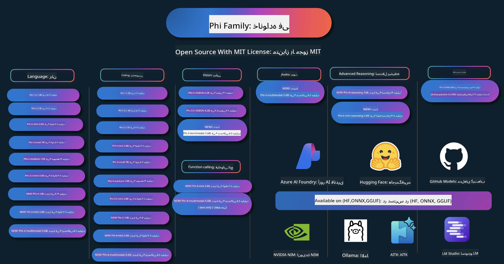

<!--
CO_OP_TRANSLATOR_METADATA:
{
  "original_hash": "5184fe9d0c6c744782f795436349ccf8",
  "translation_date": "2025-06-27T13:11:32+00:00",
  "source_file": "README.md",
  "language_code": "fa"
}
-->
# کتاب آشپزی Phi: مثال‌های عملی با مدل‌های Phi مایکروسافت

  

  
  
  

  
  

Phi مجموعه‌ای از مدل‌های هوش مصنوعی متن‌باز است که توسط مایکروسافت توسعه یافته‌اند.

Phi در حال حاضر قدرتمندترین و مقرون‌به‌صرفه‌ترین مدل زبان کوچک (SLM) است که در زمینه‌های چندزبانه، استدلال، تولید متن/چت، کدنویسی، تصاویر، صدا و سایر کاربردها عملکرد بسیار خوبی دارد.

شما می‌توانید Phi را در فضای ابری یا دستگاه‌های لبه‌ای مستقر کنید و به‌راحتی برنامه‌های هوش مصنوعی مولد را با قدرت محاسباتی محدود بسازید.

برای شروع استفاده از این منابع، مراحل زیر را دنبال کنید:  
1. **انشعاب گرفتن از مخزن**: روی  کلیک کنید  
2. **کلون کردن مخزن**: `git clone https://github.com/microsoft/PhiCookBook.git`  
3. [**به جامعه Discord هوش مصنوعی مایکروسافت بپیوندید و با متخصصان و توسعه‌دهندگان دیگر آشنا شوید**](https://discord.com/invite/ByRwuEEgH4?WT.mc_id=aiml-137032-kinfeylo)

## 🌐 پشتیبانی چندزبانه

### پشتیبانی شده از طریق GitHub Action (خودکار و همیشه به‌روز)

[فرانسوی](../fr/README.md) | [اسپانیایی](../es/README.md) | [آلمانی](../de/README.md) | [روسی](../ru/README.md) | [عربی](../ar/README.md) | [فارسی](./README.md) | [اردو](../ur/README.md) | [چینی (ساده‌شده)](../zh/README.md) | [چینی (سنتی، ماکائو)](../mo/README.md) | [چینی (سنتی، هنگ‌کنگ)](../hk/README.md) | [چینی (سنتی، تایوان)](../tw/README.md) | [ژاپنی](../ja/README.md) | [کره‌ای](../ko/README.md) | [هندی](../hi/README.md)

### پشتیبانی شده از طریق CLI
## فهرست مطالب

- مقدمه
- [خوش‌آمدید به خانواده فی](./md/01.Introduction/01/01.PhiFamily.md)
  - [راه‌اندازی محیط کاری‌تان](./md/01.Introduction/01/01.EnvironmentSetup.md)
  - [درک فناوری‌های کلیدی](./md/01.Introduction/01/01.Understandingtech.md)
  - [ایمنی هوش مصنوعی برای مدل‌های فی](./md/01.Introduction/01/01.AISafety.md)
  - [پشتیبانی سخت‌افزاری فی](./md/01.Introduction/01/01.Hardwaresupport.md)
  - [مدل‌های فی و در دسترس بودن آن‌ها در پلتفرم‌ها](./md/01.Introduction/01/01.Edgeandcloud.md)
  - [استفاده از Guidance-ai و فی](./md/01.Introduction/01/01.Guidance.md)
  - [مدل‌های GitHub Marketplace](https://github.com/marketplace/models)
  - [کاتالوگ مدل‌های Azure AI](https://ai.azure.com)

- استنتاج فی در محیط‌های مختلف
    -  [Hugging face](./md/01.Introduction/02/01.HF.md)
    -  [مدل‌های GitHub](./md/01.Introduction/02/02.GitHubModel.md)
    -  [کاتالوگ مدل‌های Azure AI Foundry](./md/01.Introduction/02/03.AzureAIFoundry.md)
    -  [Ollama](./md/01.Introduction/02/04.Ollama.md)
    -  [ابزار AI در VSCode (AITK)](./md/01.Introduction/02/05.AITK.md)
    -  [NVIDIA NIM](./md/01.Introduction/02/06.NVIDIA.md)
    -  [Foundry محلی](./md/01.Introduction/02/07.FoundryLocal.md)

- استنتاج خانواده فی
    - [استنتاج فی در iOS](./md/01.Introduction/03/iOS_Inference.md)
    - [استنتاج فی در اندروید](./md/01.Introduction/03/Android_Inference.md)
    - [استنتاج فی در جتسون](./md/01.Introduction/03/Jetson_Inference.md)
    - [استنتاج فی در کامپیوتر هوش مصنوعی](./md/01.Introduction/03/AIPC_Inference.md)
    - [استنتاج فی با فریم‌ورک Apple MLX](./md/01.Introduction/03/MLX_Inference.md)
    - [استنتاج فی در سرور محلی](./md/01.Introduction/03/Local_Server_Inference.md)
    - [استنتاج فی در سرور راه دور با استفاده از ابزار AI](./md/01.Introduction/03/Remote_Interence.md)
    - [استنتاج فی با Rust](./md/01.Introduction/03/Rust_Inference.md)
    - [استنتاج فی-ویژن در محیط محلی](./md/01.Introduction/03/Vision_Inference.md)
    - [استنتاج فی با Kaito AKS، کانتینرهای Azure (پشتیبانی رسمی)](./md/01.Introduction/03/Kaito_Inference.md)
-  [کوانتایز کردن خانواده فی](./md/01.Introduction/04/QuantifyingPhi.md)
    - [کوانتایز کردن Phi-3.5 / 4 با استفاده از llama.cpp](./md/01.Introduction/04/UsingLlamacppQuantifyingPhi.md)
    - [کوانتایز کردن Phi-3.5 / 4 با استفاده از افزونه‌های هوش مصنوعی مولد برای onnxruntime](./md/01.Introduction/04/UsingORTGenAIQuantifyingPhi.md)
    - [کوانتایز کردن Phi-3.5 / 4 با استفاده از Intel OpenVINO](./md/01.Introduction/04/UsingIntelOpenVINOQuantifyingPhi.md)
- [کوانتیزه کردن Phi-3.5 / 4 با استفاده از چارچوب Apple MLX](./md/01.Introduction/04/UsingAppleMLXQuantifyingPhi.md)

- ارزیابی Phi  
    - [هوش مصنوعی مسئولانه](./md/01.Introduction/05/ResponsibleAI.md)  
    - [Azure AI Foundry برای ارزیابی](./md/01.Introduction/05/AIFoundry.md)  
    - [استفاده از Promptflow برای ارزیابی](./md/01.Introduction/05/Promptflow.md)  
 
- RAG با جستجوی Azure AI  
    - [چگونه از Phi-4-mini و Phi-4-multimodal (RAG) با جستجوی Azure AI استفاده کنیم](https://github.com/microsoft/PhiCookBook/blob/main/code/06.E2E/E2E_Phi-4-RAG-Azure-AI-Search.ipynb)

- نمونه‌های توسعه برنامه‌های Phi  
  - برنامه‌های متنی و چت  
    - نمونه‌های Phi-4 🆕  
      - [📓] [چت با مدل ONNX Phi-4-mini](./md/02.Application/01.TextAndChat/Phi4/ChatWithPhi4ONNX/README.md)  
      - [چت با مدل ONNX محلی Phi-4 در دات‌نت](../../md/04.HOL/dotnet/src/LabsPhi4-Chat-01OnnxRuntime)  
      - [برنامه کنسول چت دات‌نت با Phi-4 ONNX با استفاده از Semantic Kernel](../../md/04.HOL/dotnet/src/LabsPhi4-Chat-02SK)  
    - نمونه‌های Phi-3 / 3.5  
      - [چت‌بات محلی در مرورگر با استفاده از Phi3، ONNX Runtime Web و WebGPU](https://github.com/microsoft/onnxruntime-inference-examples/tree/main/js/chat)  
      - [چت OpenVino](./md/02.Application/01.TextAndChat/Phi3/E2E_OpenVino_Chat.md)  
      - [چند مدل - Phi-3-mini تعاملی و OpenAI Whisper](./md/02.Application/01.TextAndChat/Phi3/E2E_Phi-3-mini_with_whisper.md)  
      - [MLFlow - ساخت یک Wrapper و استفاده از Phi-3 با MLFlow](./md//02.Application/01.TextAndChat/Phi3/E2E_Phi-3-MLflow.md)  
      - [بهینه‌سازی مدل - چگونگی بهینه‌سازی مدل Phi-3-mini برای ONNX Runtime Web با Olive](https://github.com/microsoft/Olive/tree/main/examples/phi3)  
      - [برنامه WinUI3 با Phi-3 mini-4k-instruct-onnx](https://github.com/microsoft/Phi3-Chat-WinUI3-Sample/)  
      - [نمونه برنامه یادداشت‌های چندمدلی با WinUI3 و هوش مصنوعی](https://github.com/microsoft/ai-powered-notes-winui3-sample)  
      - [تنظیم دقیق و ادغام مدل‌های سفارشی Phi-3 با Prompt flow](./md/02.Application/01.TextAndChat/Phi3/E2E_Phi-3-FineTuning_PromptFlow_Integration.md)  
      - [تنظیم دقیق و ادغام مدل‌های سفارشی Phi-3 با Prompt flow در Azure AI Foundry](./md/02.Application/01.TextAndChat/Phi3/E2E_Phi-3-FineTuning_PromptFlow_Integration_AIFoundry.md)  
      - [ارزیابی مدل تنظیم شده Phi-3 / Phi-3.5 در Azure AI Foundry با تمرکز بر اصول هوش مصنوعی مسئولانه مایکروسافت](./md/02.Application/01.TextAndChat/Phi3/E2E_Phi-3-Evaluation_AIFoundry.md)  
      - [📓] [نمونه پیش‌بینی زبان Phi-3.5-mini-instruct (چینی/انگلیسی)](../../md/02.Application/01.TextAndChat/Phi3/phi3-instruct-demo.ipynb)  
      - [چت‌بات RAG Phi-3.5-Instruct WebGPU](./md/02.Application/01.TextAndChat/Phi3/WebGPUWithPhi35Readme.md)  
      - [استفاده از GPU ویندوز برای ایجاد راه‌حل Prompt flow با Phi-3.5-Instruct ONNX](./md/02.Application/01.TextAndChat/Phi3/UsingPromptFlowWithONNX.md)  
      - [استفاده از Microsoft Phi-3.5 tflite برای ساخت برنامه اندروید](./md/02.Application/01.TextAndChat/Phi3/UsingPhi35TFLiteCreateAndroidApp.md)  
      - [مثال پرسش و پاسخ دات‌نت با استفاده از مدل محلی ONNX Phi-3 و Microsoft.ML.OnnxRuntime](../../md/04.HOL/dotnet/src/LabsPhi301)  
      - [برنامه کنسول چت دات‌نت با Semantic Kernel و Phi-3](../../md/04.HOL/dotnet/src/LabsPhi302)

  - نمونه‌های کد مبتنی بر Azure AI Inference SDK  
    - نمونه‌های Phi-4 🆕  
      - [📓] [تولید کد پروژه با استفاده از Phi-4-multimodal](./md/02.Application/02.Code/Phi4/GenProjectCode/README.md)  
    - نمونه‌های Phi-3 / 3.5  
      - [ساخت چت GitHub Copilot برای Visual Studio Code با خانواده Phi-3 مایکروسافت](./md/02.Application/02.Code/Phi3/VSCodeExt/README.md)  
      - [ایجاد عامل چت Copilot برای Visual Studio Code با Phi-3.5 با استفاده از مدل‌های GitHub](/md/02.Application/02.Code/Phi3/CreateVSCodeChatAgentWithGitHubModels.md)

  - نمونه‌های استدلال پیشرفته  
    - نمونه‌های Phi-4 🆕  
      - [📓] [نمونه‌های استدلال Phi-4-mini یا Phi-4](./md/02.Application/03.AdvancedReasoning/Phi4/AdvancedResoningPhi4mini/README.md)  
      - [📓] [تنظیم دقیق استدلال Phi-4-mini با Microsoft Olive](../../md/02.Application/03.AdvancedReasoning/Phi4/AdvancedResoningPhi4mini/olive_ft_phi_4_reasoning_with_medicaldata.ipynb)  
      - [📓] [تنظیم دقیق استدلال Phi-4-mini با Apple MLX](../../md/02.Application/03.AdvancedReasoning/Phi4/AdvancedResoningPhi4mini/mlx_ft_phi_4_reasoning_with_medicaldata.ipynb)
- [📓] [Phi-4-mini استنتاج با مدل‌های GitHub](../../md/02.Application/02.Code/Phi4r/github_models_inference.ipynb)
      - [📓] [Phi-4-mini استنتاج با مدل‌های Azure AI Foundry](../../md/02.Application/02.Code/Phi4r/azure_models_inference.ipynb)
  - دموها
      - [دموهای Phi-4-mini میزبانی شده در Hugging Face Spaces](https://huggingface.co/spaces/microsoft/phi-4-mini?WT.mc_id=aiml-137032-kinfeylo)
      - [دموهای Phi-4-multimodal میزبانی شده در Hugging Face Spaces](https://huggingface.co/spaces/microsoft/phi-4-multimodal?WT.mc_id=aiml-137032-kinfeylo)
  - نمونه‌های بینایی
    - نمونه‌های Phi-4 🆕
      - [📓] [استفاده از Phi-4-multimodal برای خواندن تصاویر و تولید کد](./md/02.Application/04.Vision/Phi4/CreateFrontend/README.md) 
    - نمونه‌های Phi-3 / 3.5
      -  [📓][Phi-3-vision تبدیل متن تصویر به متن](../../md/02.Application/04.Vision/Phi3/E2E_Phi-3-vision-image-text-to-text-online-endpoint.ipynb)
      - [Phi-3-vision-ONNX](https://onnxruntime.ai/docs/genai/tutorials/phi3-v.html)
      - [📓][Phi-3-vision CLIP Embedding](../../md/02.Application/04.Vision/Phi3/E2E_Phi-3-vision-image-text-to-text-online-endpoint.ipynb)
      - [دمو: بازیافت Phi-3](https://github.com/jennifermarsman/PhiRecycling/)
      - [Phi-3-vision - دستیار زبان تصویری - با Phi3-Vision و OpenVINO](https://docs.openvino.ai/nightly/notebooks/phi-3-vision-with-output.html)
      - [Phi-3 Vision Nvidia NIM](./md/02.Application/04.Vision/Phi3/E2E_Nvidia_NIM_Vision.md)
      - [Phi-3 Vision OpenVino](./md/02.Application/04.Vision/Phi3/E2E_OpenVino_Phi3Vision.md)
      - [📓][نمونه چندفریمی یا چندتصویری Phi-3.5 Vision](../../md/02.Application/04.Vision/Phi3/phi3-vision-demo.ipynb)
      - [مدل ONNX محلی Phi-3 Vision با استفاده از Microsoft.ML.OnnxRuntime .NET](../../md/04.HOL/dotnet/src/LabsPhi303)
      - [مدل ONNX محلی Phi-3 Vision مبتنی بر منو با استفاده از Microsoft.ML.OnnxRuntime .NET](../../md/04.HOL/dotnet/src/LabsPhi304)

  - نمونه‌های صوتی
    - نمونه‌های Phi-4 🆕
      - [📓] [استخراج رونوشت‌های صوتی با استفاده از Phi-4-multimodal](./md/02.Application/05.Audio/Phi4/Transciption/README.md)
      - [📓] [نمونه صوتی Phi-4-multimodal](../../md/02.Application/05.Audio/Phi4/Siri/demo.ipynb)
      - [📓] [نمونه ترجمه گفتار Phi-4-multimodal](../../md/02.Application/05.Audio/Phi4/Translate/demo.ipynb)
      - [برنامه کنسول .NET با استفاده از Phi-4-multimodal Audio برای تحلیل فایل صوتی و تولید رونوشت](../../md/04.HOL/dotnet/src/LabsPhi4-MultiModal-02Audio)

  - نمونه‌های MOE
    - نمونه‌های Phi-3 / 3.5
      - [📓] [نمونه مدل‌های Mixture of Experts (MoEs) Phi-3.5 در شبکه‌های اجتماعی](../../md/02.Application/06.MoE/Phi3/phi3_moe_demo.ipynb)
      - [📓] [ساخت خط لوله Retrieval-Augmented Generation (RAG) با NVIDIA NIM Phi-3 MOE، Azure AI Search و LlamaIndex](../../md/02.Application/06.MoE/Phi3/azure-ai-search-nvidia-rag.ipynb)
  - نمونه‌های فراخوانی تابع
    - نمونه‌های Phi-4 🆕
      -  [📓] [استفاده از فراخوانی تابع با Phi-4-mini](./md/02.Application/07.FunctionCalling/Phi4/FunctionCallingBasic/README.md)
      -  [📓] [استفاده از فراخوانی تابع برای ایجاد چند عامل با Phi-4-mini](../../md/02.Application/07.FunctionCalling/Phi4/Multiagents/Phi_4_mini_multiagent.ipynb)
      -  [📓] [استفاده از فراخوانی تابع با Ollama](../../md/02.Application/07.FunctionCalling/Phi4/Ollama/ollama_functioncalling.ipynb)
      -  [📓] [استفاده از فراخوانی تابع با ONNX](../../md/02.Application/07.FunctionCalling/Phi4/ONNX/onnx_parallel_functioncalling.ipynb)
  - نمونه‌های ترکیب چندرسانه‌ای
    - نمونه‌های Phi-4 🆕
      -  [📓] [استفاده از Phi-4-multimodal به عنوان خبرنگار فناوری](../../md/02.Application/08.Multimodel/Phi4/TechJournalist/phi_4_mm_audio_text_publish_news.ipynb)
      - [برنامه کنسول .NET با استفاده از Phi-4-multimodal برای تحلیل تصاویر](../../md/04.HOL/dotnet/src/LabsPhi4-MultiModal-01Images)

- نمونه‌های تنظیم دقیق Phi
  - [سناریوهای تنظیم دقیق](./md/03.FineTuning/FineTuning_Scenarios.md)
  - [تنظیم دقیق در مقابل RAG](./md/03.FineTuning/FineTuning_vs_RAG.md)
  - [تنظیم دقیق: اجازه دهید Phi-3 به یک متخصص صنعتی تبدیل شود](./md/03.FineTuning/LetPhi3gotoIndustriy.md)
- [تنظیم دقیق Phi-3 با AI Toolkit برای VS Code](./md/03.FineTuning/Finetuning_VSCodeaitoolkit.md)
  - [تنظیم دقیق Phi-3 با سرویس Azure Machine Learning](./md/03.FineTuning/Introduce_AzureML.md)
  - [تنظیم دقیق Phi-3 با Lora](./md/03.FineTuning/FineTuning_Lora.md)
  - [تنظیم دقیق Phi-3 با QLora](./md/03.FineTuning/FineTuning_Qlora.md)
  - [تنظیم دقیق Phi-3 با Azure AI Foundry](./md/03.FineTuning/FineTuning_AIFoundry.md)
  - [تنظیم دقیق Phi-3 با Azure ML CLI/SDK](./md/03.FineTuning/FineTuning_MLSDK.md)
  - [تنظیم دقیق با Microsoft Olive](./md/03.FineTuning/FineTuning_MicrosoftOlive.md)
  - [کارگاه عملی تنظیم دقیق با Microsoft Olive](./md/03.FineTuning/olive-lab/readme.md)
  - [تنظیم دقیق Phi-3-vision با Weights and Bias](./md/03.FineTuning/FineTuning_Phi-3-visionWandB.md)
  - [تنظیم دقیق Phi-3 با چارچوب Apple MLX](./md/03.FineTuning/FineTuning_MLX.md)
  - [تنظیم دقیق Phi-3-vision (پشتیبانی رسمی)](./md/03.FineTuning/FineTuning_Vision.md)
  - [تنظیم دقیق Phi-3 با Kaito AKS و Azure Containers (پشتیبانی رسمی)](./md/03.FineTuning/FineTuning_Kaito.md)
  - [تنظیم دقیق Phi-3 و 3.5 Vision](https://github.com/2U1/Phi3-Vision-Finetune)

- کارگاه عملی
  - [کاوش مدل‌های پیشرفته: LLMها، SLMها، توسعه محلی و موارد بیشتر](https://github.com/microsoft/aitour-exploring-cutting-edge-models)
  - [باز کردن پتانسیل NLP: تنظیم دقیق با Microsoft Olive](https://github.com/azure/Ignite_FineTuning_workshop)

- مقالات و انتشارات پژوهشی دانشگاهی
  - [کتاب‌های درسی همه چیزهایی هستند که نیاز دارید II: گزارش فنی phi-1.5](https://arxiv.org/abs/2309.05463)
  - [گزارش فنی Phi-3: یک مدل زبان بسیار توانمند به صورت محلی روی گوشی شما](https://arxiv.org/abs/2404.14219)
  - [گزارش فنی Phi-4](https://arxiv.org/abs/2412.08905)
  - [گزارش فنی Phi-4-Mini: مدل‌های زبان چندرسانه‌ای جمع و جور اما قدرتمند از طریق ترکیب LoRAها](https://arxiv.org/abs/2503.01743)
  - [بهینه‌سازی مدل‌های زبان کوچک برای فراخوانی عملکرد در خودرو](https://arxiv.org/abs/2501.02342)
  - [(WhyPHI) تنظیم دقیق PHI-3 برای پاسخ‌دهی به سوالات چندگزینه‌ای: روش‌شناسی، نتایج و چالش‌ها](https://arxiv.org/abs/2501.01588)
  - [گزارش فنی Phi-4-استدلال](https://www.microsoft.com/en-us/research/wp-content/uploads/2025/04/phi_4_reasoning.pdf)
  - [گزارش فنی Phi-4-mini-استدلال](https://huggingface.co/microsoft/Phi-4-mini-reasoning/blob/main/Phi-4-Mini-Reasoning.pdf)

## استفاده از مدل‌های Phi

### Phi در Azure AI Foundry

می‌توانید یاد بگیرید چگونه از Microsoft Phi استفاده کنید و راه‌حل‌های انتها به انتها را در دستگاه‌های سخت‌افزاری مختلف خود بسازید. برای تجربه شخصی Phi، با آزمایش مدل‌ها و سفارشی‌سازی Phi برای سناریوهای خود شروع کنید، با استفاده از [کاتالوگ مدل Azure AI Foundry](https://aka.ms/phi3-azure-ai). برای اطلاعات بیشتر می‌توانید به راهنمای شروع به کار با [Azure AI Foundry](/md/02.QuickStart/AzureAIFoundry_QuickStart.md) مراجعه کنید.

**محیط آزمایش**
هر مدل دارای یک محیط آزمایش اختصاصی برای تست مدل است [محیط آزمایش Azure AI](https://aka.ms/try-phi3).

### Phi در مدل‌های GitHub

می‌توانید یاد بگیرید چگونه از Microsoft Phi استفاده کنید و راه‌حل‌های انتها به انتها را در دستگاه‌های سخت‌افزاری مختلف خود بسازید. برای تجربه شخصی Phi، با آزمایش مدل و سفارشی‌سازی Phi برای سناریوهای خود شروع کنید، با استفاده از [کاتالوگ مدل GitHub](https://github.com/marketplace/models?WT.mc_id=aiml-137032-kinfeylo). برای اطلاعات بیشتر می‌توانید به راهنمای شروع به کار با [کاتالوگ مدل GitHub](/md/02.QuickStart/GitHubModel_QuickStart.md) مراجعه کنید.

**محیط آزمایش**
هر مدل دارای یک [محیط آزمایش اختصاصی برای تست مدل](/md/02.QuickStart/GitHubModel_QuickStart.md) است.

### Phi در Hugging Face

همچنین می‌توانید مدل را در [Hugging Face](https://huggingface.co/microsoft) پیدا کنید.

**محیط آزمایش**
[Hugging Chat playground](https://huggingface.co/chat/models/microsoft/Phi-3-mini-4k-instruct)

## هوش مصنوعی مسئولانه

مایکروسافت متعهد است به کمک به مشتریان خود برای استفاده مسئولانه از محصولات هوش مصنوعی، به اشتراک‌گذاری تجربیات و ساخت شراکت‌های مبتنی بر اعتماد از طریق ابزارهایی مانند Transparency Notes و Impact Assessments. بسیاری از این منابع را می‌توانید در [https://aka.ms/RAI](https://aka.ms/RAI) بیابید.  
رویکرد مایکروسافت به هوش مصنوعی مسئولانه بر اصول هوش مصنوعی ما استوار است که شامل عدالت، قابلیت اطمینان و ایمنی، حریم خصوصی و امنیت، فراگیری، شفافیت و پاسخگویی می‌شود.

مدل‌های بزرگ زبان طبیعی، تصویر و گفتار - مانند مدل‌های استفاده شده در این نمونه - ممکن است رفتارهایی ناعادلانه، غیرقابل اعتماد یا توهین‌آمیز داشته باشند که می‌تواند آسیب‌هایی ایجاد کند. لطفاً برای آگاهی از ریسک‌ها و محدودیت‌ها، به [یادداشت شفافیت سرویس Azure OpenAI](https://learn.microsoft.com/legal/cognitive-services/openai/transparency-note?tabs=text) مراجعه کنید.

رویکرد پیشنهادی برای کاهش این ریسک‌ها، گنجاندن یک سیستم ایمنی در معماری شماست که بتواند رفتارهای مضر را شناسایی و جلوگیری کند. [Azure AI Content Safety](https://learn.microsoft.com/azure/ai-services/content-safety/overview) لایه‌ای مستقل از محافظت را ارائه می‌دهد که قادر است محتوای مضر تولید شده توسط کاربران و هوش مصنوعی را در برنامه‌ها و خدمات شناسایی کند. Azure AI Content Safety شامل APIهای متن و تصویر است که به شما امکان می‌دهد محتوای مضر را تشخیص دهید. در Azure AI Foundry، سرویس Content Safety به شما اجازه می‌دهد نمونه کدهای تشخیص محتوای مضر در مدالیت‌های مختلف را مشاهده، بررسی و آزمایش کنید. مستندات [شروع سریع](https://learn.microsoft.com/azure/ai-services/content-safety/quickstart-text?tabs=visual-studio%2Clinux&pivots=programming-language-rest) شما را در ارسال درخواست به این سرویس راهنمایی می‌کند.

جنبه دیگری که باید در نظر گرفته شود، عملکرد کلی برنامه است. در برنامه‌های چندمدلی و چندمدلیتی، عملکرد به معنای این است که سیستم همان‌طور که شما و کاربران انتظار دارید عمل کند، از جمله عدم تولید خروجی‌های مضر. ارزیابی عملکرد کل برنامه خود با استفاده از [ارزیاب‌های عملکرد، کیفیت، ریسک و ایمنی](https://learn.microsoft.com/azure/ai-studio/concepts/evaluation-metrics-built-in) اهمیت دارد. همچنین می‌توانید با استفاده از [ارزیاب‌های سفارشی](https://learn.microsoft.com/azure/ai-studio/how-to/develop/evaluate-sdk#custom-evaluators) ارزیابی و ساخت ارزیاب اختصاصی خود را انجام دهید.

می‌توانید برنامه هوش مصنوعی خود را در محیط توسعه با استفاده از [Azure AI Evaluation SDK](https://microsoft.github.io/promptflow/index.html) ارزیابی کنید. با داشتن یک مجموعه داده آزمایشی یا هدف، تولیدات برنامه هوش مصنوعی تولیدی شما به صورت کمی با ارزیاب‌های داخلی یا ارزیاب‌های سفارشی انتخابی اندازه‌گیری می‌شوند. برای شروع استفاده از azure ai evaluation sdk جهت ارزیابی سیستم خود، می‌توانید راهنمای [شروع سریع](https://learn.microsoft.com/azure/ai-studio/how-to/develop/flow-evaluate-sdk) را دنبال کنید. پس از اجرای ارزیابی، می‌توانید [نتایج را در Azure AI Foundry مشاهده کنید](https://learn.microsoft.com/azure/ai-studio/how-to/evaluate-flow-results).

## علائم تجاری

این پروژه ممکن است شامل علائم تجاری یا لوگوهایی برای پروژه‌ها، محصولات یا خدمات باشد. استفاده مجاز از علائم تجاری یا لوگوهای مایکروسافت مشروط به رعایت [دستورالعمل‌های علائم تجاری و برند مایکروسافت](https://www.microsoft.com/legal/intellectualproperty/trademarks/usage/general) است.  
استفاده از علائم تجاری یا لوگوهای مایکروسافت در نسخه‌های تغییر یافته این پروژه نباید باعث سردرگمی شود یا دلالت بر حمایت مایکروسافت داشته باشد. هرگونه استفاده از علائم تجاری یا لوگوهای شخص ثالث مشمول سیاست‌های آن شخص ثالث است.

**سلب مسئولیت**:  
این سند با استفاده از سرویس ترجمه هوش مصنوعی [Co-op Translator](https://github.com/Azure/co-op-translator) ترجمه شده است. در حالی که ما در تلاش برای دقت هستیم، لطفاً توجه داشته باشید که ترجمه‌های خودکار ممکن است شامل خطاها یا نواقص باشند. سند اصلی به زبان مادری خود باید به عنوان منبع معتبر در نظر گرفته شود. برای اطلاعات حیاتی، استفاده از ترجمه حرفه‌ای انسانی توصیه می‌شود. ما مسئول هیچ گونه سوءتفاهم یا تفسیر نادرست ناشی از استفاده از این ترجمه نیستیم.