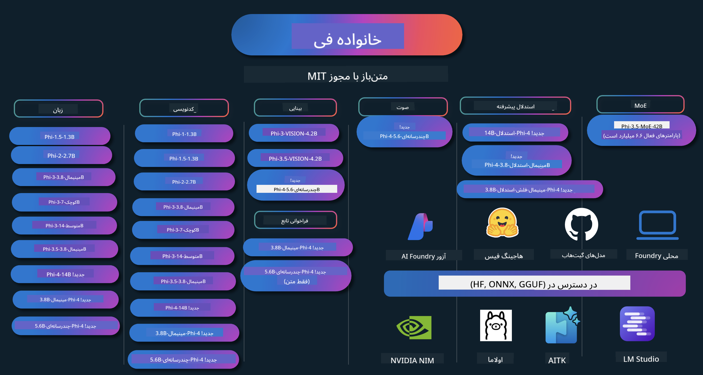

<!--
CO_OP_TRANSLATOR_METADATA:
{
  "original_hash": "c2e4b490f4bd424b095f21e38c6af33b",
  "translation_date": "2026-01-05T16:58:17+00:00",
  "source_file": "README.md",
  "language_code": "fa"
}
-->
# کتابچه Phi: مثال‌های عملی با مدل‌های Phi مایکروسافت

[](https://codespaces.new/microsoft/phicookbook)
[](https://vscode.dev/redirect?url=vscode://ms-vscode-remote.remote-containers/cloneInVolume?url=https://github.com/microsoft/phicookbook)

[](https://GitHub.com/microsoft/phicookbook/graphs/contributors/?WT.mc_id=aiml-137032-kinfeylo)
[](https://GitHub.com/microsoft/phicookbook/issues/?WT.mc_id=aiml-137032-kinfeylo)
[](https://GitHub.com/microsoft/phicookbook/pulls/?WT.mc_id=aiml-137032-kinfeylo)
[](http://makeapullrequest.com?WT.mc_id=aiml-137032-kinfeylo)

[](https://GitHub.com/microsoft/phicookbook/watchers/?WT.mc_id=aiml-137032-kinfeylo)
[](https://GitHub.com/microsoft/phicookbook/network/?WT.mc_id=aiml-137032-kinfeylo)
[](https://GitHub.com/microsoft/phicookbook/stargazers/?WT.mc_id=aiml-137032-kinfeylo)

[](https://discord.com/invite/ByRwuEEgH4)

Phi مجموعه‌ای از مدل‌های هوش مصنوعی متن‌باز توسعه یافته توسط مایکروسافت است.

Phi در حال حاضر قوی‌ترین و مقرون‌به‌صرفه‌ترین مدل زبان کوچک (SLM) است، با بنچمارک‌های بسیار خوب در چندزبانگی، استدلال، تولید متن/چت، برنامه‌نویسی، تصاویر، صوت و سایر سناریوها.

شما می‌توانید Phi را در ابر یا دستگاه‌های لبه پیاده‌سازی کنید و به‌سادگی برنامه‌های هوش مصنوعی مولد را با قدرت محاسباتی محدود بسازید.

برای شروع استفاده از این منابع، مراحل زیر را دنبال کنید:
1. **شعبه گرفتن مخزن**: کلیک کنید روی [](https://GitHub.com/microsoft/phicookbook/network/?WT.mc_id=aiml-137032-kinfeylo)
2. **کلونه کردن مخزن**: `git clone https://github.com/microsoft/PhiCookBook.git`
3. [**به انجمن Discord هوش مصنوعی مایکروسافت بپیوندید و با کارشناسان و توسعه‌دهندگان هم‌سطح ملاقات کنید**](https://discord.com/invite/ByRwuEEgH4?WT.mc_id=aiml-137032-kinfeylo)



### 🌐 پشتیبانی چندزبانه

#### پشتیبانی شده از طریق GitHub Action (خودکار و همیشه بروز)

<!-- CO-OP TRANSLATOR LANGUAGES TABLE START -->
[عربی](../ar/README.md) | [بنگالی](../bn/README.md) | [بلغاری](../bg/README.md) | [بُرمی (میانمار)](../my/README.md) | [چینی (ساده‌شده)](../zh/README.md) | [چینی (سنتی، هنگ کنگ)](../hk/README.md) | [چینی (سنتی، ماکائو)](../mo/README.md) | [چینی (سنتی، تایوان)](../tw/README.md) | [کرواتی](../hr/README.md) | [چکی](../cs/README.md) | [دانمارکی](../da/README.md) | [هلندی](../nl/README.md) | [استونیایی](../et/README.md) | [فنلاندی](../fi/README.md) | [فرانسوی](../fr/README.md) | [آلمانی](../de/README.md) | [یونانی](../el/README.md) | [عبری](../he/README.md) | [هندی](../hi/README.md) | [مجارستانی](../hu/README.md) | [اندونزیایی](../id/README.md) | [ایتالیایی](../it/README.md) | [ژاپنی](../ja/README.md) | [کانارا](../kn/README.md) | [کره‌ای](../ko/README.md) | [لیتوانیایی](../lt/README.md) | [مالزیایی](../ms/README.md) | [مالایالم](../ml/README.md) | [ماراتی](../mr/README.md) | [نفالی](../ne/README.md) | [پیدجین نیجریه‌ای](../pcm/README.md) | [نروژی](../no/README.md) | [فارسی](./README.md) | [لهستانی](../pl/README.md) | [پرتغالی (برزیل)](../br/README.md) | [پرتغالی (پرتغال)](../pt/README.md) | [پنجابی (گورموقی)](../pa/README.md) | [رومانیایی](../ro/README.md) | [روسی](../ru/README.md) | [صربی (سیریلیک)](../sr/README.md) | [اسلواکی](../sk/README.md) | [اسلوونیایی](../sl/README.md) | [اسپانیایی](../es/README.md) | [سواحیلی](../sw/README.md) | [سوئدی](../sv/README.md) | [تاگالوگ (فیلیپینی)](../tl/README.md) | [تامیلی](../ta/README.md) | [تلگو](../te/README.md) | [تایلندی](../th/README.md) | [ترکی](../tr/README.md) | [اوکراینی](../uk/README.md) | [اردو](../ur/README.md) | [ویتنامی](../vi/README.md)

> **ترجیح می‌دهید به صورت محلی کلونه کنید؟**

> این مخزن شامل بیش از ۵۰ ترجمه زبان است که حجم دانلود را به شکل قابل توجهی افزایش می‌دهد. برای کلونه کردن بدون ترجمه‌ها، از sparse checkout استفاده کنید:
> ```bash
> git clone --filter=blob:none --sparse https://github.com/microsoft/PhiCookBook.git
> cd PhiCookBook
> git sparse-checkout set --no-cone '/*' '!translations' '!translated_images'
> ```
> این به شما همه چیزهایی را می‌دهد که برای تکمیل دوره نیاز دارید با دانلود بسیار سریع‌تر.
<!-- CO-OP TRANSLATOR LANGUAGES TABLE END -->

## فهرست مطالب

- معرفی
  - [به خانواده Phi خوش آمدید](./md/01.Introduction/01/01.PhiFamily.md)
  - [راه‌اندازی محیط خود](./md/01.Introduction/01/01.EnvironmentSetup.md)
  - [درک فناوری‌های کلیدی](./md/01.Introduction/01/01.Understandingtech.md)
  - [ایمنی هوش مصنوعی برای مدل‌های Phi](./md/01.Introduction/01/01.AISafety.md)
  - [پشتیبانی سخت‌افزاری Phi](./md/01.Introduction/01/01.Hardwaresupport.md)
  - [مدل‌های Phi و در دسترس بودن‌شان در پلتفرم‌های گوناگون](./md/01.Introduction/01/01.Edgeandcloud.md)
  - [استفاده از Guidance-ai و Phi](./md/01.Introduction/01/01.Guidance.md)
  - [مدل‌های بازار گیت‌هاب](https://github.com/marketplace/models)
  - [کاتالوگ مدل‌های Azure AI](https://ai.azure.com)

- استنتاج Phi در محیط‌های مختلف
    -  [Hugging face](./md/01.Introduction/02/01.HF.md)
    -  [مدل‌های گیت‌هاب](./md/01.Introduction/02/02.GitHubModel.md)
    -  [کاتالوگ مدل Azure AI Foundry](./md/01.Introduction/02/03.AzureAIFoundry.md)
    -  [Ollama](./md/01.Introduction/02/04.Ollama.md)
    -  [ابزار VSCode هوش مصنوعی (AITK)](./md/01.Introduction/02/05.AITK.md)
    -  [NVIDIA NIM](./md/01.Introduction/02/06.NVIDIA.md)
    -  [Foundry Local](./md/01.Introduction/02/07.FoundryLocal.md)

- خانواده استنتاج Phi
    - [استنتاج Phi در iOS](./md/01.Introduction/03/iOS_Inference.md)
    - [استنتاج Phi در اندروید](./md/01.Introduction/03/Android_Inference.md)
    - [استنتاج Phi در Jetson](./md/01.Introduction/03/Jetson_Inference.md)
    - [استنتاج Phi در AI PC](./md/01.Introduction/03/AIPC_Inference.md)
    - [استنتاج Phi با فریم‌ورک Apple MLX](./md/01.Introduction/03/MLX_Inference.md)
    - [استنتاج Phi در سرور محلی](./md/01.Introduction/03/Local_Server_Inference.md)
    - [استنتاج Phi در سرور راه دور با استفاده از ابزار هوش مصنوعی](./md/01.Introduction/03/Remote_Interence.md)
    - [استنتاج Phi با Rust](./md/01.Introduction/03/Rust_Inference.md)
    - [استنتاج Phi- بینایی در محلی](./md/01.Introduction/03/Vision_Inference.md)
    - [استنتاج Phi با Kaito AKS، کانتینرهای Azure (پشتیبانی رسمی)](./md/01.Introduction/03/Kaito_Inference.md)
-  [کوانتیزه کردن خانواده Phi](./md/01.Introduction/04/QuantifyingPhi.md)
    - [کوانتیزه کردن Phi-3.5 / 4 با استفاده از llama.cpp](./md/01.Introduction/04/UsingLlamacppQuantifyingPhi.md)
    - [کوانتیزه کردن Phi-3.5 / 4 با استفاده از افزونه‌های هوش مصنوعی مولد برای onnxruntime](./md/01.Introduction/04/UsingORTGenAIQuantifyingPhi.md)
    - [کوانتیزه کردن Phi-3.5 / 4 با استفاده از Intel OpenVINO](./md/01.Introduction/04/UsingIntelOpenVINOQuantifyingPhi.md)
    - [کوانتیزه کردن Phi-3.5 / 4 با استفاده از فریم‌ورک Apple MLX](./md/01.Introduction/04/UsingAppleMLXQuantifyingPhi.md)

-  ارزیابی Phi
    - [هوش مصنوعی مسئولانه](./md/01.Introduction/05/ResponsibleAI.md)
    - [Azure AI Foundry برای ارزیابی](./md/01.Introduction/05/AIFoundry.md)
    - [استفاده از Promptflow برای ارزیابی](./md/01.Introduction/05/Promptflow.md)
 
- RAG با جستجوی Azure AI
    - [چگونه از Phi-4-mini و Phi-4-multimodal (RAG) با جستجوی Azure AI استفاده کنیم](https://github.com/microsoft/PhiCookBook/blob/main/code/06.E2E/E2E_Phi-4-RAG-Azure-AI-Search.ipynb)

- نمونه‌های توسعه برنامه Phi
  - برنامه‌های متن و چت
    - نمونه‌های Phi-4 🆕
      - [📓] [چت با مدل ONNX Phi-4-mini](./md/02.Application/01.TextAndChat/Phi4/ChatWithPhi4ONNX/README.md)
      - [چت با مدل ONNX محلی Phi-4 .NET](../../md/04.HOL/dotnet/src/LabsPhi4-Chat-01OnnxRuntime)
      - [برنامه کنسول چت .NET با ONNX Phi-4 با استفاده از Sementic Kernel](../../md/04.HOL/dotnet/src/LabsPhi4-Chat-02SK)
    - نمونه‌های Phi-3 / 3.5
      - [چت‌بات محلی در مرورگر با استفاده از Phi3، ONNX Runtime Web و WebGPU](https://github.com/microsoft/onnxruntime-inference-examples/tree/main/js/chat)
      - [چت OpenVino](./md/02.Application/01.TextAndChat/Phi3/E2E_OpenVino_Chat.md)
      - [چندمدلی - Phi-3-mini تعاملی و OpenAI Whisper](./md/02.Application/01.TextAndChat/Phi3/E2E_Phi-3-mini_with_whisper.md)
      - [MLFlow - ساخت یک پوشش و استفاده از Phi-3 با MLFlow](./md//02.Application/01.TextAndChat/Phi3/E2E_Phi-3-MLflow.md)
      - [بهینه‌سازی مدل - نحوه بهینه‌سازی مدل Phi-3-min برای ONNX Runtime Web با Olive](https://github.com/microsoft/Olive/tree/main/examples/phi3)
      - [اپلیکیشن WinUI3 با Phi-3 mini-4k-instruct-onnx](https://github.com/microsoft/Phi3-Chat-WinUI3-Sample/)
      - [نمونه اپلیکیشن یادداشت‌های چندمدلی مبتنی بر هوش مصنوعی WinUI3](https://github.com/microsoft/ai-powered-notes-winui3-sample)
      - [تنظیم دقیق و یکپارچه‌سازی مدل‌های سفارشی Phi-3 با Prompt flow](./md/02.Application/01.TextAndChat/Phi3/E2E_Phi-3-FineTuning_PromptFlow_Integration.md)
      - [تنظیم دقیق و یکپارچه‌سازی مدل‌های سفارشی Phi-3 با Prompt flow در Azure AI Foundry](./md/02.Application/01.TextAndChat/Phi3/E2E_Phi-3-FineTuning_PromptFlow_Integration_AIFoundry.md)
      - [ارزیابی مدل Phi-3 / Phi-3.5 تنظیم دقیق شده در Azure AI Foundry با تمرکز بر اصول هوش مصنوعی مسئولانه مایکروسافت](./md/02.Application/01.TextAndChat/Phi3/E2E_Phi-3-Evaluation_AIFoundry.md)
      - [📓] [نمونه پیش‌بینی زبان Phi-3.5-mini-instruct (چینی/انگلیسی)](./md/02.Application/01.TextAndChat/Phi3/phi3-instruct-demo.ipynb)
      - [چت‌بات Phi-3.5-Instruct WebGPU RAG](./md/02.Application/01.TextAndChat/Phi3/WebGPUWithPhi35Readme.md)
      - [استفاده از GPU ویندوز برای ساخت راه‌حل Prompt flow با Phi-3.5-Instruct ONNX](./md/02.Application/01.TextAndChat/Phi3/UsingPromptFlowWithONNX.md)
      - [استفاده از Microsoft Phi-3.5 tflite برای ساخت اپلیکیشن اندروید](./md/02.Application/01.TextAndChat/Phi3/UsingPhi35TFLiteCreateAndroidApp.md)
      - [نمونه پرسش و پاسخ .NET با استفاده از مدل ONNX Phi-3 محلی با Microsoft.ML.OnnxRuntime](../../md/04.HOL/dotnet/src/LabsPhi301)
      - [اپلیکیشن چت کنسول .NET با Semantic Kernel و Phi-3](../../md/04.HOL/dotnet/src/LabsPhi302)

  - نمونه‌های کد SDK استنتاج Azure AI  
    - نمونه‌های Phi-4 🆕  
      - [📓] [تولید کد پروژه با استفاده از Phi-4-multimodal](./md/02.Application/02.Code/Phi4/GenProjectCode/README.md)  
    - نمونه‌های Phi-3 / 3.5  
      - [ساخت ویژوال استودیو کد GitHub Copilot Chat خود با خانواده Phi-3 مایکروسافت](./md/02.Application/02.Code/Phi3/VSCodeExt/README.md)  
      - [ساخت عامل چت GitHub Copilot برای ویژوال استودیو کد با Phi-3.5 با مدل‌های GitHub](./md/02.Application/02.Code/Phi3/CreateVSCodeChatAgentWithGitHubModels.md)

  - نمونه‌های استدلال پیشرفته  
    - نمونه‌های Phi-4 🆕  
      - [📓] [نمونه‌های استدلال Phi-4-mini یا Phi-4](./md/02.Application/03.AdvancedReasoning/Phi4/AdvancedResoningPhi4mini/README.md)  
      - [📓] [تنظیم دقیق Phi-4-mini-reasoning با Microsoft Olive](./md/02.Application/03.AdvancedReasoning/Phi4/AdvancedResoningPhi4mini/olive_ft_phi_4_reasoning_with_medicaldata.ipynb)  
      - [📓] [تنظیم دقیق Phi-4-mini-reasoning با Apple MLX](./md/02.Application/03.AdvancedReasoning/Phi4/AdvancedResoningPhi4mini/mlx_ft_phi_4_reasoning_with_medicaldata.ipynb)  
      - [📓] [Phi-4-mini-reasoning با مدل‌های GitHub](./md/02.Application/02.Code/Phi4r/github_models_inference.ipynb)  
      - [📓] [Phi-4-mini-reasoning با مدل‌های Azure AI Foundry](./md/02.Application/02.Code/Phi4r/azure_models_inference.ipynb)  
  - دموی‌ها  
      - [دموهای Phi-4-mini در Hugging Face Spaces](https://huggingface.co/spaces/microsoft/phi-4-mini?WT.mc_id=aiml-137032-kinfeylo)  
      - [دموهای Phi-4-multimodal در Hugging Face Spaces](https://huggingface.co/spaces/microsoft/phi-4-multimodal?WT.mc_id=aiml-137032-kinfeylo)  
  - نمونه‌های بینایی  
    - نمونه‌های Phi-4 🆕  
      - [📓] [استفاده از Phi-4-multimodal برای خواندن تصاویر و تولید کد](./md/02.Application/04.Vision/Phi4/CreateFrontend/README.md)  
    - نمونه‌های Phi-3 / 3.5  
      -  [📓][Phi-3-vision-متن تصویر به متن](./md/02.Application/04.Vision/Phi3/E2E_Phi-3-vision-image-text-to-text-online-endpoint.ipynb)  
      - [Phi-3-vision-ONNX](https://onnxruntime.ai/docs/genai/tutorials/phi3-v.html)  
      - [📓][Phi-3-vision تعبیه CLIP](./md/02.Application/04.Vision/Phi3/E2E_Phi-3-vision-image-text-to-text-online-endpoint.ipynb)  
      - [دمو: بازیافت Phi-3](https://github.com/jennifermarsman/PhiRecycling/)  
      - [Phi-3-vision - دستیار زبان تصویری - با Phi3-Vision و OpenVINO](https://docs.openvino.ai/nightly/notebooks/phi-3-vision-with-output.html)  
      - [Phi-3 Vision Nvidia NIM](./md/02.Application/04.Vision/Phi3/E2E_Nvidia_NIM_Vision.md)  
      - [Phi-3 Vision OpenVino](./md/02.Application/04.Vision/Phi3/E2E_OpenVino_Phi3Vision.md)  
      - [📓][نمونه چند فریم یا چند تصویر Phi-3.5 Vision](./md/02.Application/04.Vision/Phi3/phi3-vision-demo.ipynb)  
      - [مدل ONNX محلی Phi-3 Vision با استفاده از Microsoft.ML.OnnxRuntime .NET](../../md/04.HOL/dotnet/src/LabsPhi303)  
      - [مدل ONNX محلی Phi-3 Vision مبتنی بر منو با استفاده از Microsoft.ML.OnnxRuntime .NET](../../md/04.HOL/dotnet/src/LabsPhi304)

  - نمونه‌های ریاضی  
    - نمونه‌های Phi-4-Mini-Flash-Reasoning-Instruct 🆕 [دموی ریاضی با Phi-4-Mini-Flash-Reasoning-Instruct](./md/02.Application/09.Math/MathDemo.ipynb)

  - نمونه‌های صوتی  
    - نمونه‌های Phi-4 🆕  
      - [📓] [استخراج رونوشت صوتی با استفاده از Phi-4-multimodal](./md/02.Application/05.Audio/Phi4/Transciption/README.md)  
      - [📓] [نمونه صوتی Phi-4-multimodal](./md/02.Application/05.Audio/Phi4/Siri/demo.ipynb)  
      - [📓] [نمونه ترجمه گفتار Phi-4-multimodal](./md/02.Application/05.Audio/Phi4/Translate/demo.ipynb)  
      - [برنامه کنسول .NET با استفاده از Phi-4-multimodal برای تحلیل فایل صوتی و تولید رونوشت](../../md/04.HOL/dotnet/src/LabsPhi4-MultiModal-02Audio)

  - نمونه‌های MOE  
    - نمونه‌های Phi-3 / 3.5  
      - [📓] [نمونه مدل‌های مخلوط کارشناسان Phi-3.5 (MoEs) در رسانه‌های اجتماعی](./md/02.Application/06.MoE/Phi3/phi3_moe_demo.ipynb)  
      - [📓] [ساخت خط لوله تولید افزایش‌یافته بازیابی (RAG) با NVIDIA NIM Phi-3 MOE، جستجوی Azure AI و LlamaIndex](./md/02.Application/06.MoE/Phi3/azure-ai-search-nvidia-rag.ipynb)  
      - 
  - نمونه‌های تماس به تابع  
    - نمونه‌های Phi-4 🆕  
      -  [📓] [استفاده از تماس به تابع با Phi-4-mini](./md/02.Application/07.FunctionCalling/Phi4/FunctionCallingBasic/README.md)  
      -  [📓] [استفاده از تماس به تابع برای ساخت چند عامل با Phi-4-mini](./md/02.Application/07.FunctionCalling/Phi4/Multiagents/Phi_4_mini_multiagent.ipynb)  
      -  [📓] [استفاده از تماس به تابع با Ollama](./md/02.Application/07.FunctionCalling/Phi4/Ollama/ollama_functioncalling.ipynb)  
      -  [📓] [استفاده از تماس به تابع با ONNX](./md/02.Application/07.FunctionCalling/Phi4/ONNX/onnx_parallel_functioncalling.ipynb)  
  - نمونه‌های ترکیب چندمدلی  
    - نمونه‌های Phi-4 🆕  
      -  [📓] [استفاده از Phi-4-multimodal به عنوان خبرنگار فناوری](./md/02.Application/08.Multimodel/Phi4/TechJournalist/phi_4_mm_audio_text_publish_news.ipynb)  
      - [برنامه کنسول .NET با استفاده از Phi-4-multimodal برای تحلیل تصاویر](../../md/04.HOL/dotnet/src/LabsPhi4-MultiModal-01Images)

- تنظیم دقیق نمونه‌های Phi  
  - [سناریوهای تنظیم دقیق](./md/03.FineTuning/FineTuning_Scenarios.md)  
  - [تنظیم دقیق در مقابل RAG](./md/03.FineTuning/FineTuning_vs_RAG.md)  
  - [اجازه دهید Phi-3 تبدیل به یک متخصص صنعتی شود (تنظیم دقیق)](./md/03.FineTuning/LetPhi3gotoIndustriy.md)  
  - [تنظیم دقیق Phi-3 با جعبه ابزار AI برای VS Code](./md/03.FineTuning/Finetuning_VSCodeaitoolkit.md)  
  - [تنظیم دقیق Phi-3 با سرویس یادگیری ماشین Azure](./md/03.FineTuning/Introduce_AzureML.md)  
  - [تنظیم دقیق Phi-3 با Lora](./md/03.FineTuning/FineTuning_Lora.md)  
  - [تنظیم دقیق Phi-3 با QLora](./md/03.FineTuning/FineTuning_Qlora.md)  
  - [تنظیم دقیق Phi-3 با Azure AI Foundry](./md/03.FineTuning/FineTuning_AIFoundry.md)  
  - [تنظیم دقیق Phi-3 با Azure ML CLI/SDK](./md/03.FineTuning/FineTuning_MLSDK.md)  
  - [تنظیم دقیق با Microsoft Olive](./md/03.FineTuning/FineTuning_MicrosoftOlive.md)  
  - [تنظیم دقیق با آزمایشگاه عملی Microsoft Olive](./md/03.FineTuning/olive-lab/readme.md)  
  - [تنظیم دقیق Phi-3-vision با Weights and Bias](./md/03.FineTuning/FineTuning_Phi-3-visionWandB.md)  
  - [تنظیم دقیق Phi-3 با چارچوب Apple MLX](./md/03.FineTuning/FineTuning_MLX.md)  
  - [تنظیم دقیق Phi-3-vision (پشتیبانی رسمی)](./md/03.FineTuning/FineTuning_Vision.md)  
  - [تنظیم دقیق Phi-3 با Kaito AKS ، Azure Containers (پشتیبانی رسمی)](./md/03.FineTuning/FineTuning_Kaito.md)  
  - [تنظیم دقیق Phi-3 و 3.5 Vision](https://github.com/2U1/Phi3-Vision-Finetune)

- آزمایشگاه عملی  
  - [بررسی مدل‌های پیشرفته: LLMها، SLMها، توسعه محلی و بیشتر](https://github.com/microsoft/aitour-exploring-cutting-edge-models)  
  - [آزادسازی پتانسیل NLP: تنظیم دقیق با Microsoft Olive](https://github.com/azure/Ignite_FineTuning_workshop)

- مقالات و انتشارات تحقیقاتی علمی
  - [کتاب‌های درسی همه‌چیز هستند II: گزارش فنی phi-1.5](https://arxiv.org/abs/2309.05463)
  - [گزارش فنی Phi-3: یک مدل زبان بسیار توانمند که به‌صورت محلی روی تلفن شما اجرا می‌شود](https://arxiv.org/abs/2404.14219)
  - [گزارش فنی Phi-4](https://arxiv.org/abs/2412.08905)
  - [گزارش فنی Phi-4-Mini: مدل‌های زبانی چندرسانه‌ای فشرده اما قدرتمند از طریق ترکیب LoRA‌ها](https://arxiv.org/abs/2503.01743)
  - [بهینه‌سازی مدل‌های کوچک زبان برای فراخوانی عملکرد در خودرو](https://arxiv.org/abs/2501.02342)
  - [(WhyPHI) تنظیم دقیق PHI-3 برای پاسخ به سوالات چند گزینه‌ای: روش‌شناسی، نتایج و چالش‌ها](https://arxiv.org/abs/2501.01588)
  - [گزارش فنی استدلال Phi-4](https://www.microsoft.com/en-us/research/wp-content/uploads/2025/04/phi_4_reasoning.pdf)
  - [گزارش فنی استدلال Phi-4-mini](https://huggingface.co/microsoft/Phi-4-mini-reasoning/blob/main/Phi-4-Mini-Reasoning.pdf)

## استفاده از مدل‌های Phi

### Phi در Azure AI Foundry

می‌توانید بیاموزید که چگونه از Microsoft Phi استفاده کنید و چگونه راه‌حل‌های انتها به انتها را در دستگاه‌های سخت‌افزاری مختلف خود بسازید. برای تجربه Phi به‌صورت عملی، با آزمایش مدل‌ها و سفارشی‌سازی Phi برای سناریوهای خود با استفاده از [کاتالوگ مدل‌های Azure AI Foundry](https://aka.ms/phi3-azure-ai) شروع کنید. می‌توانید اطلاعات بیشتر را در شروع کار با [Azure AI Foundry](/md/02.QuickStart/AzureAIFoundry_QuickStart.md) بیابید.

**محیط آزمایش**
هر مدل یک محیط آزمایش اختصاصی دارد برای تست مدل [Azure AI Playground](https://aka.ms/try-phi3).

### Phi در مدل‌های GitHub

می‌توانید بیاموزید که چگونه از Microsoft Phi استفاده کنید و چگونه راه‌حل‌های انتها به انتها را در دستگاه‌های سخت‌افزاری مختلف خود بسازید. برای تجربه Phi به‌صورت عملی، با آزمایش مدل و سفارشی‌سازی Phi برای سناریوهای خود با استفاده از [کاتالوگ مدل GitHub](https://github.com/marketplace/models?WT.mc_id=aiml-137032-kinfeylo) شروع کنید. می‌توانید اطلاعات بیشتر را در شروع کار با [کاتالوگ مدل GitHub](/md/02.QuickStart/GitHubModel_QuickStart.md) بیابید.

**محیط آزمایش**
هر مدل یک [محیط آزمایش اختصاصی برای تست مدل](/md/02.QuickStart/GitHubModel_QuickStart.md) دارد.

### Phi در Hugging Face

مدل را همچنین می‌توانید در [Hugging Face](https://huggingface.co/microsoft) بیابید.

**محیط آزمایش**
 [محیط آزمایش Hugging Chat](https://huggingface.co/chat/models/microsoft/Phi-3-mini-4k-instruct)

 ## 🎒 دوره‌های دیگر

تیم ما دوره‌های دیگری نیز تولید می‌کند! ببینید:

<!-- CO-OP TRANSLATOR OTHER COURSES START -->
### LangChain
[](https://aka.ms/langchain4j-for-beginners)
[](https://aka.ms/langchainjs-for-beginners?WT.mc_id=m365-94501-dwahlin)

---

### Azure / Edge / MCP / عوامل
[](https://github.com/microsoft/AZD-for-beginners?WT.mc_id=academic-105485-koreyst)
[](https://github.com/microsoft/edgeai-for-beginners?WT.mc_id=academic-105485-koreyst)
[](https://github.com/microsoft/mcp-for-beginners?WT.mc_id=academic-105485-koreyst)
[](https://github.com/microsoft/ai-agents-for-beginners?WT.mc_id=academic-105485-koreyst)

---
 
### سری هوش مصنوعی مولد
[](https://github.com/microsoft/generative-ai-for-beginners?WT.mc_id=academic-105485-koreyst)
[-9333EA?style=for-the-badge&labelColor=E5E7EB&color=9333EA)](https://github.com/microsoft/Generative-AI-for-beginners-dotnet?WT.mc_id=academic-105485-koreyst)
[-C084FC?style=for-the-badge&labelColor=E5E7EB&color=C084FC)](https://github.com/microsoft/generative-ai-for-beginners-java?WT.mc_id=academic-105485-koreyst)
[-E879F9?style=for-the-badge&labelColor=E5E7EB&color=E879F9)](https://github.com/microsoft/generative-ai-with-javascript?WT.mc_id=academic-105485-koreyst)

---
 
### یادگیری پایه
[](https://aka.ms/ml-beginners?WT.mc_id=academic-105485-koreyst)
[](https://aka.ms/datascience-beginners?WT.mc_id=academic-105485-koreyst)
[](https://aka.ms/ai-beginners?WT.mc_id=academic-105485-koreyst)
[](https://github.com/microsoft/Security-101?WT.mc_id=academic-96948-sayoung)
[](https://aka.ms/webdev-beginners?WT.mc_id=academic-105485-koreyst)
[](https://aka.ms/iot-beginners?WT.mc_id=academic-105485-koreyst)
[](https://github.com/microsoft/xr-development-for-beginners?WT.mc_id=academic-105485-koreyst)

---
 
### سری Copilot
[](https://aka.ms/GitHubCopilotAI?WT.mc_id=academic-105485-koreyst)
[](https://github.com/microsoft/mastering-github-copilot-for-dotnet-csharp-developers?WT.mc_id=academic-105485-koreyst)
[](https://github.com/microsoft/CopilotAdventures?WT.mc_id=academic-105485-koreyst)
<!-- CO-OP TRANSLATOR OTHER COURSES END -->

## هوش مصنوعی مسئولانه

مایکروسافت متعهد است که به مشتریان خود کمک کند تا محصولات هوش مصنوعی ما را به‌صورت مسئولانه استفاده کنند، دانش‌های خود را به اشتراک بگذارد و از طریق ابزارهایی مانند یادداشت‌های شفافیت و ارزیابی تأثیر، شراکت‌های مبتنی بر اعتماد بسازد. بسیاری از این منابع را می‌توانید در [https://aka.ms/RAI](https://aka.ms/RAI) پیدا کنید.
رویکرد مایکروسافت به هوش مصنوعی مسئولانه بر اساس اصول هوش مصنوعی ما شامل انصاف، قابلیت اطمینان و ایمنی، حریم خصوصی و امنیت، شمولیت، شفافیت، و پاسخگویی است.

مدل‌های بزرگ زبان طبیعی، تصویر و گفتار - مانند مدل‌هایی که در این نمونه استفاده شده‌اند - ممکن است به شکلی رفتار کنند که ناعادلانه، غیرقابل اعتماد یا توهین‌آمیز باشد و در نتیجه آسیب‌هایی ایجاد کند. لطفاً برای آگاهی از خطرات و محدودیت‌ها، به [یادداشت شفافیت Azure OpenAI service](https://learn.microsoft.com/legal/cognitive-services/openai/transparency-note?tabs=text) مراجعه کنید.

رویکرد پیشنهادی برای کاهش این خطرات، گنجاندن یک سیستم ایمنی در معماری شماست که بتواند رفتار مضر را تشخیص داده و از آن جلوگیری کند. [Azure AI Content Safety](https://learn.microsoft.com/azure/ai-services/content-safety/overview) یک لایه محافظت مستقل فراهم می‌کند که قادر است محتوای مضر تولید شده توسط کاربر و هوش مصنوعی را در برنامه‌ها و خدمات شناسایی کند. Azure AI Content Safety شامل API‌های متن و تصویر است که به شما امکان می‌دهد محتوای مضر را شناسایی کنید. در Azure AI Foundry، سرویس Content Safety به شما اجازه می‌دهد محتوای مضر را در زمینه‌های مختلف مشاهده، بررسی و کد نمونه را امتحان کنید. مستندات [شروع سریع](https://learn.microsoft.com/azure/ai-services/content-safety/quickstart-text?tabs=visual-studio%2Clinux&pivots=programming-language-rest) شما را برای ارسال درخواست به این سرویس راهنمایی می‌کند.

جنبه دیگر که باید در نظر گرفت عملکرد کلی برنامه است. با برنامه‌های چندرسانه‌ای و چندمدلی، عملکرد به معنای این است که سیستم طبق انتظار شما و کاربران عمل کند، از جمله عدم تولید خروجی‌های مضر. ارزیابی عملکرد کلی برنامه خود با استفاده از [ارزیاب‌های عملکرد و کیفیت و ریسک و ایمنی](https://learn.microsoft.com/azure/ai-studio/concepts/evaluation-metrics-built-in) اهمیت دارد. همچنین شما قادر هستید با استفاده از [ارزیاب‌های سفارشی](https://learn.microsoft.com/azure/ai-studio/how-to/develop/evaluate-sdk#custom-evaluators) ارزیابی بسازید و اجرا کنید.
شما می‌توانید برنامه هوش مصنوعی خود را در محیط توسعه خود با استفاده از [Azure AI Evaluation SDK](https://microsoft.github.io/promptflow/index.html) ارزیابی کنید. با داشتن یک مجموعه داده آزمایشی یا هدف، تولیدات برنامه هوش مصنوعی تولیدی شما به صورت کمی با ارزیاب‌های داخلی یا ارزیاب‌های سفارشی دلخواه شما اندازه‌گیری می‌شوند. برای شروع با sdk ارزیابی azure ai جهت ارزیابی سیستم خود، می‌توانید راهنمای [quickstart guide](https://learn.microsoft.com/azure/ai-studio/how-to/develop/flow-evaluate-sdk) را دنبال کنید. پس از اجرای یک دوره ارزیابی، می‌توانید [نتایج را در Azure AI Foundry مشاهده کنید](https://learn.microsoft.com/azure/ai-studio/how-to/evaluate-flow-results).

## علائم تجاری

این پروژه ممکن است شامل علائم تجاری یا لوگوهایی برای پروژه‌ها، محصولات یا خدمات باشد. استفاده مجاز از علائم تجاری یا لوگوهای مایکروسافت تابع و باید از [دستورالعمل‌های علامت تجاری و برند مایکروسافت](https://www.microsoft.com/legal/intellectualproperty/trademarks/usage/general) پیروی کند.
استفاده از علائم تجاری یا لوگوهای مایکروسافت در نسخه‌های تغییر یافته این پروژه نباید باعث اشتباه یا القای حمایت مالی مایکروسافت شود. هرگونه استفاده از علائم تجاری یا لوگوهای شخص ثالث تابع سیاست‌های آن اشخاص ثالث است.

## دریافت کمک

اگر در ساخت برنامه‌های هوش مصنوعی گیر کردید یا سوالی دارید، بپیوندید به:

[](https://aka.ms/foundry/discord)

اگر بازخورد محصول یا خطایی هنگام ساخت داشتید، مراجعه کنید به:

[](https://aka.ms/foundry/forum)

---

<!-- CO-OP TRANSLATOR DISCLAIMER START -->
**توضیح مهم**:  
این سند با استفاده از سرویس ترجمه هوش مصنوعی [Co-op Translator](https://github.com/Azure/co-op-translator) ترجمه شده است. در حالی که ما در تلاش برای دقت هستیم، لطفاً به این نکته توجه داشته باشید که ترجمه‌های خودکار ممکن است حاوی خطاها یا نادرستی‌هایی باشند. سند اصلی به زبان بومی خود به عنوان منبع معتبر در نظر گرفته شود. برای اطلاعات حیاتی، ترجمه انسانی حرفه‌ای توصیه می‌شود. ما مسئول هیچ گونه سوءتفاهم یا برداشت نادرست ناشی از استفاده از این ترجمه نیستیم.
<!-- CO-OP TRANSLATOR DISCLAIMER END -->