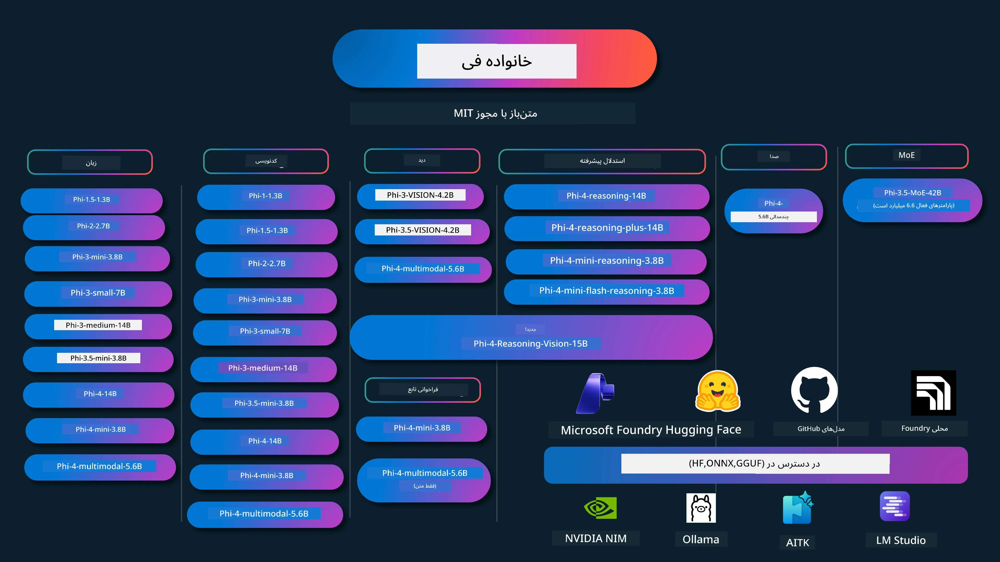

# کتاب‌راهنمای فی: مثال‌های عملی با مدل‌های فی مایکروسافت

[](https://codespaces.new/microsoft/phicookbook)
[](https://vscode.dev/redirect?url=vscode://ms-vscode-remote.remote-containers/cloneInVolume?url=https://github.com/microsoft/phicookbook)

[](https://GitHub.com/microsoft/phicookbook/graphs/contributors/?WT.mc_id=aiml-137032-kinfeylo)
[](https://GitHub.com/microsoft/phicookbook/issues/?WT.mc_id=aiml-137032-kinfeylo)
[](https://GitHub.com/microsoft/phicookbook/pulls/?WT.mc_id=aiml-137032-kinfeylo)
[](http://makeapullrequest.com?WT.mc_id=aiml-137032-kinfeylo)

[](https://GitHub.com/microsoft/phicookbook/watchers/?WT.mc_id=aiml-137032-kinfeylo)
[](https://GitHub.com/microsoft/phicookbook/network/?WT.mc_id=aiml-137032-kinfeylo)
[](https://GitHub.com/microsoft/phicookbook/stargazers/?WT.mc_id=aiml-137032-kinfeylo)

[](https://discord.com/invite/ByRwuEEgH4)

فی یک سری مدل‌های هوش مصنوعی متن‌باز است که توسط مایکروسافت توسعه یافته‌اند.

فی در حال حاضر کوچک‌ترین مدل زبان (SLM) قدرتمند و مقرون‌به‌صرفه است، که معیارهای بسیار خوبی در چند زبانه، استدلال، تولید متن/چت، کدنویسی، تصاویر، صدا و سایر سناریوها دارد.

شما می‌توانید فی را در ابر یا دستگاه‌های لبه‌محور مستقر کنید، و می‌توانید به راحتی برنامه‌های هوش مصنوعی مولد را با قدرت محاسباتی محدود بسازید.

برای شروع به استفاده از این منابع، مراحل زیر را دنبال کنید:
1. **فورک کردن مخزن**: کلیک کنید [](https://GitHub.com/microsoft/phicookbook/network/?WT.mc_id=aiml-137032-kinfeylo)
2. **کلون کردن مخزن**:   `git clone https://github.com/microsoft/PhiCookBook.git`
3. [**عضویت در جامعه دیسکورد مایکروسافت AI و ملاقات با کارشناسان و توسعه‌دهندگان هم‌ردیف**](https://discord.com/invite/ByRwuEEgH4?WT.mc_id=aiml-137032-kinfeylo)



### 🌐 پشتیبانی چندزبانه

#### پشتیبانی شده از طریق GitHub Action (خودکار و همیشه به‌روز)

<!-- CO-OP TRANSLATOR LANGUAGES TABLE START -->
[عربی](../ar/README.md) | [بنگالی](../bn/README.md) | [بلغاری](../bg/README.md) | [برمه‌ای (میانمار)](../my/README.md) | [چینی (ساده‌شده)](../zh-CN/README.md) | [چینی (سنتی، هنگ‌کنگ)](../zh-HK/README.md) | [چینی (سنتی، ماکائو)](../zh-MO/README.md) | [چینی (سنتی، تایوان)](../zh-TW/README.md) | [کرواتی](../hr/README.md) | [چکی](../cs/README.md) | [دانمارکی](../da/README.md) | [هلندی](../nl/README.md) | [استونیایی](../et/README.md) | [فنلاندی](../fi/README.md) | [فرانسوی](../fr/README.md) | [آلمانی](../de/README.md) | [یونانی](../el/README.md) | [عبری](../he/README.md) | [هندی](../hi/README.md) | [مجارستانی](../hu/README.md) | [اندونزیایی](../id/README.md) | [ایتالیایی](../it/README.md) | [ژاپنی](../ja/README.md) | [کانادا](../kn/README.md) | [کره‌ای](../ko/README.md) | [لیتوانیایی](../lt/README.md) | [مالایی](../ms/README.md) | [مالایالام](../ml/README.md) | [مراتی](../mr/README.md) | [نپالی](../ne/README.md) | [پیدجین نیجریه](../pcm/README.md) | [نروژی](../no/README.md) | [فارسی (ایران)](./README.md) | [لهستانی](../pl/README.md) | [پرتغالی (برزیل)](../pt-BR/README.md) | [پرتغالی (پرتغال)](../pt-PT/README.md) | [پنجابی (گورموخی)](../pa/README.md) | [رومانیایی](../ro/README.md) | [روسی](../ru/README.md) | [صربی (سیریلیک)](../sr/README.md) | [اسلواکی](../sk/README.md) | [اسلوونیایی](../sl/README.md) | [اسپانیایی](../es/README.md) | [سواحیلی](../sw/README.md) | [سوئدی](../sv/README.md) | [تاگالوگ (فیلیپینی)](../tl/README.md) | [تامیل](../ta/README.md) | [تلگو](../te/README.md) | [تایلندی](../th/README.md) | [ترکی](../tr/README.md) | [اوکراینی](../uk/README.md) | [اردو](../ur/README.md) | [ویتنامی](../vi/README.md)

> **ترجیح می‌دهید به‌صورت محلی کلون کنید؟**

> این مخزن شامل بیش از ۵۰ ترجمه زبان است که اندازه دانلود را به طور قابل توجهی افزایش می‌دهد. برای کلون کردن بدون ترجمه‌ها، از sparse checkout استفاده کنید:
> ```bash
> git clone --filter=blob:none --sparse https://github.com/microsoft/PhiCookBook.git
> cd PhiCookBook
> git sparse-checkout set --no-cone '/*' '!translations' '!translated_images'
> ```
> این به شما همه چیز لازم برای تکمیل دوره را با دانلود بسیار سریع‌تر می‌دهد.
<!-- CO-OP TRANSLATOR LANGUAGES TABLE END -->

## فهرست مطالب

- مقدمه
  - [خوش‌آمد گویی به خانواده فی](./md/01.Introduction/01/01.PhiFamily.md)
  - [راه‌اندازی محیط کاری](./md/01.Introduction/01/01.EnvironmentSetup.md)
  - [درک فناوری‌های کلیدی](./md/01.Introduction/01/01.Understandingtech.md)
  - [ایمنی هوش مصنوعی برای مدل‌های فی](./md/01.Introduction/01/01.AISafety.md)
  - [پشتیبانی سخت‌افزاری فی](./md/01.Introduction/01/01.Hardwaresupport.md)
  - [مدل‌های فی و دسترسی در پلتفرم‌ها](./md/01.Introduction/01/01.Edgeandcloud.md)
  - [استفاده از Guidance-ai و فی](./md/01.Introduction/01/01.Guidance.md)
  - [مدل‌های بازارگاه گیت‌هاب](https://github.com/marketplace/models)
  - [فهرست مدل‌های Azure AI](https://ai.azure.com)

- استنتاج فی در محیط‌های مختلف
    -  [هگینگ فیس](./md/01.Introduction/02/01.HF.md)
    -  [مدل‌های گیت‌هاب](./md/01.Introduction/02/02.GitHubModel.md)
    -  [فهرست مدل‌های Azure AI Foundry](./md/01.Introduction/02/03.AzureAIFoundry.md)
    -  [آلاما](./md/01.Introduction/02/04.Ollama.md)
    -  [Toolkit هوش مصنوعی VSCode (AITK)](./md/01.Introduction/02/05.AITK.md)
    -  [NVIDIA NIM](./md/01.Introduction/02/06.NVIDIA.md)
    -  [Foundry محلی](./md/01.Introduction/02/07.FoundryLocal.md)

- استنتاج خانواده فی
    - [استنتاج فی در iOS](./md/01.Introduction/03/iOS_Inference.md)
    - [استنتاج فی در اندروید](./md/01.Introduction/03/Android_Inference.md)
    - [استنتاج فی در جتسون](./md/01.Introduction/03/Jetson_Inference.md)
    - [استنتاج فی در PC هوش مصنوعی](./md/01.Introduction/03/AIPC_Inference.md)
    - [استنتاج فی با چارچوب Apple MLX](./md/01.Introduction/03/MLX_Inference.md)
    - [استنتاج فی در سرور محلی](./md/01.Introduction/03/Local_Server_Inference.md)
    - [استنتاج فی در سرور راه‌دور با استفاده از Toolkit هوش مصنوعی](./md/01.Introduction/03/Remote_Interence.md)
    - [استنتاج فی با زبان راست](./md/01.Introduction/03/Rust_Inference.md)
    - [استنتاج فی-ویژن در محیط محلی](./md/01.Introduction/03/Vision_Inference.md)
    - [استنتاج فی با Kaito AKS، کانتینرهای Azure (پشتیبانی رسمی)](./md/01.Introduction/03/Kaito_Inference.md)
-  [کوانتیزه کردن خانواده فی](./md/01.Introduction/04/QuantifyingPhi.md)
    - [کوانتیزه کردن فی-3.5/4 با استفاده از llama.cpp](./md/01.Introduction/04/UsingLlamacppQuantifyingPhi.md)
    - [کوانتیزه کردن فی-3.5/4 با استفاده از افزونه‌های هوش مصنوعی مولد برای onnxruntime](./md/01.Introduction/04/UsingORTGenAIQuantifyingPhi.md)
    - [کوانتیزه کردن فی-3.5/4 با استفاده از Intel OpenVINO](./md/01.Introduction/04/UsingIntelOpenVINOQuantifyingPhi.md)
    - [کوانتیزه کردن فی-3.5/4 با استفاده از چارچوب Apple MLX](./md/01.Introduction/04/UsingAppleMLXQuantifyingPhi.md)

-  ارزیابی فی
    - [هوش مصنوعی مسئول](./md/01.Introduction/05/ResponsibleAI.md)
    - [Azure AI Foundry برای ارزیابی](./md/01.Introduction/05/AIFoundry.md)
    - [استفاده از Promptflow برای ارزیابی](./md/01.Introduction/05/Promptflow.md)
 
- RAG با Azure AI Search
    - [چگونه از Phi-4-mini و Phi-4-multimodal (RAG) با Azure AI Search استفاده کنیم](https://github.com/microsoft/PhiCookBook/blob/main/code/06.E2E/E2E_Phi-4-RAG-Azure-AI-Search.ipynb)

- نمونه‌های توسعه برنامه‌های فی  
  - برنامه‌های متن و چت  
    - نمونه‌های Phi-4 🆕  
      - [📓] [چت با مدل Phi-4-mini ONNX](./md/02.Application/01.TextAndChat/Phi4/ChatWithPhi4ONNX/README.md)  
      - [چت با مدل ONNX محلی Phi-4 .NET](../../md/04.HOL/dotnet/src/LabsPhi4-Chat-01OnnxRuntime)  
      - [برنامه کنسول چت .NET با Phi-4 ONNX با استفاده از Sementic Kernel](../../md/04.HOL/dotnet/src/LabsPhi4-Chat-02SK)  
    - نمونه‌های Phi-3 / 3.5  
      - [چت‌بات محلی در مرورگر با استفاده از Phi3، ONNX Runtime Web و WebGPU](https://github.com/microsoft/onnxruntime-inference-examples/tree/main/js/chat)  
      - [چت OpenVino](./md/02.Application/01.TextAndChat/Phi3/E2E_OpenVino_Chat.md)  

      - [چندمدل - تعاملی Phi-3-mini و OpenAI Whisper](./md/02.Application/01.TextAndChat/Phi3/E2E_Phi-3-mini_with_whisper.md)
      - [MLFlow - ساخت یک wrapper و استفاده از Phi-3 با MLFlow](./md//02.Application/01.TextAndChat/Phi3/E2E_Phi-3-MLflow.md)
      - [بهینه‌سازی مدل - چگونه مدل Phi-3-min را برای ONNX Runtime Web با Olive بهینه کنیم](https://github.com/microsoft/Olive/tree/main/examples/phi3)
      - [برنامه WinUI3 با Phi-3 mini-4k-instruct-onnx](https://github.com/microsoft/Phi3-Chat-WinUI3-Sample/)
      - [نمونه برنامه یادداشت‌های چندمدل AI مبتنی بر WinUI3](https://github.com/microsoft/ai-powered-notes-winui3-sample)
      - [تنظیم دقیق و یکپارچه‌سازی مدل‌های سفارشی Phi-3 با Prompt flow](./md/02.Application/01.TextAndChat/Phi3/E2E_Phi-3-FineTuning_PromptFlow_Integration.md)
      - [تنظیم دقیق و یکپارچه‌سازی مدل‌های سفارشی Phi-3 با Prompt flow در Azure AI Foundry](./md/02.Application/01.TextAndChat/Phi3/E2E_Phi-3-FineTuning_PromptFlow_Integration_AIFoundry.md)
      - [ارزیابی مدل Phi-3 / Phi-3.5 تنظیم شده در Azure AI Foundry با تمرکز بر اصول AI مسئولانه مایکروسافت](./md/02.Application/01.TextAndChat/Phi3/E2E_Phi-3-Evaluation_AIFoundry.md)
      - [📓] [نمونه پیش‌بینی زبان Phi-3.5-mini-instruct (چینی/انگلیسی)](./md/02.Application/01.TextAndChat/Phi3/phi3-instruct-demo.ipynb)
      - [بات چت Phi-3.5-Instruct WebGPU RAG](./md/02.Application/01.TextAndChat/Phi3/WebGPUWithPhi35Readme.md)
      - [استفاده از GPU ویندوز برای ایجاد راه‌حل Prompt flow با Phi-3.5-Instruct ONNX](./md/02.Application/01.TextAndChat/Phi3/UsingPromptFlowWithONNX.md)
      - [ساخت اپلیکیشن اندروید با استفاده از Microsoft Phi-3.5 tflite](./md/02.Application/01.TextAndChat/Phi3/UsingPhi35TFLiteCreateAndroidApp.md)
      - [مثال پرسش و پاسخ .NET با استفاده از مدل محلی ONNX Phi-3 با Microsoft.ML.OnnxRuntime](../../md/04.HOL/dotnet/src/LabsPhi301)
      - [برنامه چت کنسول .NET با Semantic Kernel و Phi-3](../../md/04.HOL/dotnet/src/LabsPhi302)

  - نمونه‌های کد SDK استنتاج Azure AI
    - نمونه‌های Phi-4 🆕
      - [📓] [تولید کد پروژه با استفاده از Phi-4-multimodal](./md/02.Application/02.Code/Phi4/GenProjectCode/README.md)
    - نمونه‌های Phi-3 / 3.5
      - [ساخت چت GitHub Copilot Visual Studio Code اختصاصی خود با خانواده Phi-3 مایکروسافت](./md/02.Application/02.Code/Phi3/VSCodeExt/README.md)
      - [ایجاد عامل چت Copilot شخصی Visual Studio Code با Phi-3.5 با مدل‌های GitHub](/md/02.Application/02.Code/Phi3/CreateVSCodeChatAgentWithGitHubModels.md)

  - نمونه‌های استدلال پیشرفته
    - نمونه‌های Phi-4 🆕
      - [📓] [نمونه‌های Phi-4-mini-reasoning یا Phi-4-reasoning](./md/02.Application/03.AdvancedReasoning/Phi4/AdvancedResoningPhi4mini/README.md)
      - [📓] [تنظیم دقیق Phi-4-mini-reasoning با Microsoft Olive](./md/02.Application/03.AdvancedReasoning/Phi4/AdvancedResoningPhi4mini/olive_ft_phi_4_reasoning_with_medicaldata.ipynb)
      - [📓] [تنظیم دقیق Phi-4-mini-reasoning با Apple MLX](./md/02.Application/03.AdvancedReasoning/Phi4/AdvancedResoningPhi4mini/mlx_ft_phi_4_reasoning_with_medicaldata.ipynb)
      - [📓] [Phi-4-mini-reasoning با مدل‌های GitHub](./md/02.Application/02.Code/Phi4r/github_models_inference.ipynb)
      - [📓] [Phi-4-mini-reasoning با مدل‌های Azure AI Foundry](./md/02.Application/02.Code/Phi4r/azure_models_inference.ipynb)
  - دموها
      - [دموهای Phi-4-mini میزبانی شده در Hugging Face Spaces](https://huggingface.co/spaces/microsoft/phi-4-mini?WT.mc_id=aiml-137032-kinfeylo)
      - [دموهای Phi-4-multimodal میزبانی شده در Hugginge Face Spaces](https://huggingface.co/spaces/microsoft/phi-4-multimodal?WT.mc_id=aiml-137032-kinfeylo)
  - نمونه‌های بینایی
    - نمونه‌های Phi-4 🆕
      - [📓] [استفاده از Phi-4-multimodal برای خواندن تصاویر و تولید کد](./md/02.Application/04.Vision/Phi4/CreateFrontend/README.md) 
    - نمونه‌های Phi-3 / 3.5
      -  [📓][Phi-3-vision-تبدیل متن تصویر به متن](./md/02.Application/04.Vision/Phi3/E2E_Phi-3-vision-image-text-to-text-online-endpoint.ipynb)
      - [Phi-3-vision-ONNX](https://onnxruntime.ai/docs/genai/tutorials/phi3-v.html)
      - [📓][Phi-3-vision CLIP Embedding](./md/02.Application/04.Vision/Phi3/E2E_Phi-3-vision-image-text-to-text-online-endpoint.ipynb)
      - [دمو: بازیافت Phi-3](https://github.com/jennifermarsman/PhiRecycling/)
      - [Phi-3-vision - دستیار زبان بصری - با Phi3-Vision و OpenVINO](https://docs.openvino.ai/nightly/notebooks/phi-3-vision-with-output.html)
      - [Phi-3 Vision Nvidia NIM](./md/02.Application/04.Vision/Phi3/E2E_Nvidia_NIM_Vision.md)
      - [Phi-3 Vision OpenVino](./md/02.Application/04.Vision/Phi3/E2E_OpenVino_Phi3Vision.md)
      - [📓][نمونه Phi-3.5 Vision چندفریمی یا چندتصویری](./md/02.Application/04.Vision/Phi3/phi3-vision-demo.ipynb)
      - [مدل محلی ONNX Phi-3 Vision با استفاده از Microsoft.ML.OnnxRuntime .NET](../../md/04.HOL/dotnet/src/LabsPhi303)
      - [مدل محلی ONNX Phi-3 Vision مبتنی بر منو با استفاده از Microsoft.ML.OnnxRuntime .NET](../../md/04.HOL/dotnet/src/LabsPhi304)

  - نمونه‌های ریاضی
    -  نمونه‌های Phi-4-Mini-Flash-Reasoning-Instruct 🆕 [دموی ریاضی با Phi-4-Mini-Flash-Reasoning-Instruct](./md/02.Application/09.Math/MathDemo.ipynb)

  - نمونه‌های صوتی
    - نمونه‌های Phi-4 🆕
      - [📓] [استخراج رونویسی صوتی با استفاده از Phi-4-multimodal](./md/02.Application/05.Audio/Phi4/Transciption/README.md)
      - [📓] [نمونه صوتی Phi-4-multimodal](./md/02.Application/05.Audio/Phi4/Siri/demo.ipynb)
      - [📓] [نمونه ترجمه گفتار Phi-4-multimodal](./md/02.Application/05.Audio/Phi4/Translate/demo.ipynb)
      - [برنامه کنسول .NET با استفاده از Phi-4-multimodal برای تحلیل فایل صوتی و تولید رونویسی](../../md/04.HOL/dotnet/src/LabsPhi4-MultiModal-02Audio)

  - نمونه‌های MOE
    - نمونه‌های Phi-3 / 3.5
      - [📓] [نمونه مدل‌های مخلوطی از کارشناسان (MoEs) Phi-3.5 در شبکه‌های اجتماعی](./md/02.Application/06.MoE/Phi3/phi3_moe_demo.ipynb)
      - [📓] [ساخت خط لوله تولید افزوده بازیابی (RAG) با NVIDIA NIM Phi-3 MOE، Azure AI Search، و LlamaIndex](./md/02.Application/06.MoE/Phi3/azure-ai-search-nvidia-rag.ipynb)
      - 
  - نمونه‌های فراخوانی تابع
    - نمونه‌های Phi-4 🆕
      -  [📓] [استفاده از فراخوانی تابع با Phi-4-mini](./md/02.Application/07.FunctionCalling/Phi4/FunctionCallingBasic/README.md)
      -  [📓] [استفاده از فراخوانی تابع برای ساخت چندعامل با Phi-4-mini](./md/02.Application/07.FunctionCalling/Phi4/Multiagents/Phi_4_mini_multiagent.ipynb)
      -  [📓] [استفاده از فراخوانی تابع با Ollama](./md/02.Application/07.FunctionCalling/Phi4/Ollama/ollama_functioncalling.ipynb)
      -  [📓] [استفاده از فراخوانی تابع با ONNX](./md/02.Application/07.FunctionCalling/Phi4/ONNX/onnx_parallel_functioncalling.ipynb)
  - نمونه‌های اختلاط چندمدلی
    - نمونه‌های Phi-4 🆕
      -  [📓] [استفاده از Phi-4-multimodal به عنوان خبرنگار فناوری](./md/02.Application/08.Multimodel/Phi4/TechJournalist/phi_4_mm_audio_text_publish_news.ipynb)
      - [برنامه کنسول .NET با استفاده از Phi-4-multimodal برای تحلیل تصاویر](../../md/04.HOL/dotnet/src/LabsPhi4-MultiModal-01Images)

- تنظیم دقیق نمونه‌های Phi
  - [سناریوهای تنظیم دقیق](./md/03.FineTuning/FineTuning_Scenarios.md)
  - [تنظیم دقیق در مقابل RAG](./md/03.FineTuning/FineTuning_vs_RAG.md)
  - [اجازه دهید Phi-3 به یک متخصص صنعتی تبدیل شود](./md/03.FineTuning/LetPhi3gotoIndustriy.md)
  - [تنظیم دقیق Phi-3 با AI Toolkit برای VS Code](./md/03.FineTuning/Finetuning_VSCodeaitoolkit.md)
  - [تنظیم دقیق Phi-3 با سرویس Azure Machine Learning](./md/03.FineTuning/Introduce_AzureML.md)
  - [تنظیم دقیق Phi-3 با Lora](./md/03.FineTuning/FineTuning_Lora.md)
  - [تنظیم دقیق Phi-3 با QLora](./md/03.FineTuning/FineTuning_Qlora.md)
  - [تنظیم دقیق Phi-3 با Azure AI Foundry](./md/03.FineTuning/FineTuning_AIFoundry.md)
  - [تنظیم دقیق Phi-3 با Azure ML CLI/SDK](./md/03.FineTuning/FineTuning_MLSDK.md)
  - [تنظیم دقیق با Microsoft Olive](./md/03.FineTuning/FineTuning_MicrosoftOlive.md)
  - [آزمایشگاه عملی تنظیم دقیق با Microsoft Olive](./md/03.FineTuning/olive-lab/readme.md)
  - [تنظیم دقیق Phi-3-vision با Weights and Bias](./md/03.FineTuning/FineTuning_Phi-3-visionWandB.md)
  - [تنظیم دقیق Phi-3 با چارچوب Apple MLX](./md/03.FineTuning/FineTuning_MLX.md)
  - [تنظیم دقیق Phi-3-vision (پشتیبانی رسمی)](./md/03.FineTuning/FineTuning_Vision.md)
  - [تنظیم دقیق Phi-3 با Kaito AKS ، Azure Containers (پشتیبانی رسمی)](./md/03.FineTuning/FineTuning_Kaito.md)
  - [تنظیم دقیق Phi-3 و 3.5 Vision](https://github.com/2U1/Phi3-Vision-Finetune)

- آزمایشگاه عملی
  - [کاوش مدل‌های پیشرفته: LLMs، SLMs، توسعه محلی و بیشتر](https://github.com/microsoft/aitour-exploring-cutting-edge-models)
  - [باز کردن پتانسیل NLP: تنظیم دقیق با Microsoft Olive](https://github.com/azure/Ignite_FineTuning_workshop)

- مقالات و انتشارات پژوهشی دانشگاهی
  - [کتاب‌های درسی همه چیزی است که نیاز دارید II: گزارش فنی phi-1.5](https://arxiv.org/abs/2309.05463)
  - [گزارش فنی Phi-3: یک مدل زبانی بسیار توانمند روی گوشی شما به صورت محلی](https://arxiv.org/abs/2404.14219)
  - [گزارش فنی Phi-4](https://arxiv.org/abs/2412.08905)
  - [گزارش فنی Phi-4-Mini: مدل‌های زبانی چندرسانه‌ای جمع‌وجور اما قدرتمند از طریق مخلوطی از LoRAها](https://arxiv.org/abs/2503.01743)
  - [بهینه‌سازی مدل‌های زبانی کوچک برای فراخوانی عملکرد در داخل خودرو](https://arxiv.org/abs/2501.02342)
  - [(WhyPHI) فاین تیونینگ PHI-3 برای پاسخگویی به سوالات چندگزینه‌ای: روش‌شناسی، نتایج و چالش‌ها](https://arxiv.org/abs/2501.01588)
  - [گزارش فنی استدلال Phi-4](https://www.microsoft.com/en-us/research/wp-content/uploads/2025/04/phi_4_reasoning.pdf)
  - [گزارش فنی استدلال Phi-4-mini](https://huggingface.co/microsoft/Phi-4-mini-reasoning/blob/main/Phi-4-Mini-Reasoning.pdf)

## استفاده از مدل‌های Phi

### Phi در Azure AI Foundry

شما می‌توانید نحوه استفاده از Microsoft Phi و نحوه ساخت راه‌حل‌های انتها به انتها در دستگاه‌های سخت‌افزاری مختلف خود را بیاموزید. برای تجربه Phi برای خودتان، کار با مدل‌ها را شروع کنید و Phi را برای سناریوهای خود با استفاده از کاتالوگ مدل Azure AI Foundry در [Azure AI Foundry Azure AI Model Catalog](https://aka.ms/phi3-azure-ai) سفارشی‌سازی کنید. می‌توانید اطلاعات بیشتری را در شروع کار با [Azure AI Foundry](/md/02.QuickStart/AzureAIFoundry_QuickStart.md) یاد بگیرید.

**زمین بازی**
هر مدل دارای یک زمین بازی اختصاصی برای تست مدل است [Azure AI Playground](https://aka.ms/try-phi3).

### Phi در مدل‌های GitHub

شما می‌توانید نحوه استفاده از Microsoft Phi و نحوه ساخت راه‌حل‌های انتها به انتها در دستگاه‌های سخت‌افزاری مختلف خود را بیاموزید. برای تجربه Phi برای خودتان، کار با مدل را شروع کنید و Phi را برای سناریوهای خود با استفاده از [GitHub Model Catalog](https://github.com/marketplace/models?WT.mc_id=aiml-137032-kinfeylo) سفارشی‌سازی کنید. می‌توانید اطلاعات بیشتری را در شروع کار با [GitHub Model Catalog](/md/02.QuickStart/GitHubModel_QuickStart.md) یاد بگیرید.

**زمین بازی**
هر مدل دارای یک زمین بازی اختصاصی برای تست مدل است [playground to test the model](/md/02.QuickStart/GitHubModel_QuickStart.md).

### Phi در Hugging Face

شما همچنین می‌توانید مدل را در [Hugging Face](https://huggingface.co/microsoft) پیدا کنید.

**زمین بازی**  
[Hugging Chat playground](https://huggingface.co/chat/models/microsoft/Phi-3-mini-4k-instruct)

## 🎒 دوره‌های دیگر

تیم ما دوره‌های دیگری نیز تولید می‌کند! نگاهی بیندازید به:

<!-- CO-OP TRANSLATOR OTHER COURSES START -->
### LangChain
[](https://aka.ms/langchain4j-for-beginners)
[](https://aka.ms/langchainjs-for-beginners?WT.mc_id=m365-94501-dwahlin)

---

### Azure / Edge / MCP / Agents
[](https://github.com/microsoft/AZD-for-beginners?WT.mc_id=academic-105485-koreyst)
[](https://github.com/microsoft/edgeai-for-beginners?WT.mc_id=academic-105485-koreyst)
[](https://github.com/microsoft/mcp-for-beginners?WT.mc_id=academic-105485-koreyst)
[](https://github.com/microsoft/ai-agents-for-beginners?WT.mc_id=academic-105485-koreyst)

---
 
### سری هوش مصنوعی مولد
[](https://github.com/microsoft/generative-ai-for-beginners?WT.mc_id=academic-105485-koreyst)
[-9333EA?style=for-the-badge&labelColor=E5E7EB&color=9333EA)](https://github.com/microsoft/Generative-AI-for-beginners-dotnet?WT.mc_id=academic-105485-koreyst)
[-C084FC?style=for-the-badge&labelColor=E5E7EB&color=C084FC)](https://github.com/microsoft/generative-ai-for-beginners-java?WT.mc_id=academic-105485-koreyst)
[-E879F9?style=for-the-badge&labelColor=E5E7EB&color=E879F9)](https://github.com/microsoft/generative-ai-with-javascript?WT.mc_id=academic-105485-koreyst)

---
 
### آموزش‌های پایه
[](https://aka.ms/ml-beginners?WT.mc_id=academic-105485-koreyst)
[](https://aka.ms/datascience-beginners?WT.mc_id=academic-105485-koreyst)
[](https://aka.ms/ai-beginners?WT.mc_id=academic-105485-koreyst)
[](https://github.com/microsoft/Security-101?WT.mc_id=academic-96948-sayoung)
[](https://aka.ms/webdev-beginners?WT.mc_id=academic-105485-koreyst)
[](https://aka.ms/iot-beginners?WT.mc_id=academic-105485-koreyst)
[](https://github.com/microsoft/xr-development-for-beginners?WT.mc_id=academic-105485-koreyst)

---
 
### سری Copilot
[](https://aka.ms/GitHubCopilotAI?WT.mc_id=academic-105485-koreyst)
[](https://github.com/microsoft/mastering-github-copilot-for-dotnet-csharp-developers?WT.mc_id=academic-105485-koreyst)
[](https://github.com/microsoft/CopilotAdventures?WT.mc_id=academic-105485-koreyst)
<!-- CO-OP TRANSLATOR OTHER COURSES END -->

## هوش مصنوعی مسئولانه

مایکروسافت متعهد است که به مشتریان خود کمک کند تا محصولات هوش مصنوعی ما را به‌طور مسئولانه استفاده کنند، دانش‌های خود را به اشتراک بگذارند و از طریق ابزارهایی مانند نوت‌های شفافیت و ارزیابی‌های تأثیر، روابط مبتنی بر اعتماد بسازند. بسیاری از این منابع را می‌توانید در [https://aka.ms/RAI](https://aka.ms/RAI) پیدا کنید.  
رویکرد مایکروسافت به هوش مصنوعی مسئولانه مبتنی بر اصول هوش مصنوعی ما از جمله انصاف، قابلیت اطمینان و ایمنی، حریم خصوصی و امنیت، فراگیری، شفافیت و پاسخگویی است.

مدل‌های زبانی، تصویری و گفتاری بزرگ‌مقیاس - مانند آن‌هایی که در این نمونه استفاده شده‌اند - ممکن است به شیوه‌هایی نامنصفانه، غیرقابل اعتماد یا توهین‌آمیز رفتار کنند که به نوبه خود می‌تواند به آسیب‌هایی منجر شود. لطفاً به [نوت شفافیت خدمات Azure OpenAI](https://learn.microsoft.com/legal/cognitive-services/openai/transparency-note?tabs=text) مراجعه کنید تا در مورد ریسک‌ها و محدودیت‌ها آگاه شوید.

رویکرد توصیه‌شده برای کاهش این ریسک‌ها این است که یک سیستم ایمنی در معماری خود گنجانده شود که قادر به شناسایی و جلوگیری از رفتارهای آسیب‌زا باشد. [Azure AI Content Safety](https://learn.microsoft.com/azure/ai-services/content-safety/overview) یک لایه محافظتی مستقل فراهم می‌کند که می‌تواند محتوای آسیب‌زا تولید شده توسط کاربر یا هوش مصنوعی را در برنامه‌ها و خدمات شناسایی کند. سرویس Azure AI Content Safety شامل APIهای متن و تصویر است که به شما امکان می‌دهد مطالب آسیب‌زا را شناسایی کنید. در Azure AI Foundry، سرویس Content Safety به شما امکان می‌دهد نمونه کدهای تشخیص محتوای آسیب‌زا در مدیوم‌های مختلف را مشاهده، بررسی و آزمایش کنید. مستندات شروع سریع زیر [quickstart documentation](https://learn.microsoft.com/azure/ai-services/content-safety/quickstart-text?tabs=visual-studio%2Clinux&pivots=programming-language-rest) شما را در ارسال درخواست به این سرویس راهنمایی می‌کند.

یکی دیگر از جنبه‌های مهم، عملکرد کلی برنامه است. در برنامه‌های چند مدیوم و چند مدلی، عملکرد به معنای اجرای سیستم به نحوی است که شما و کاربران‌تان انتظار دارید، از جمله تولید نکردن خروجی‌های آسیب‌زا. ارزیابی عملکرد کلی برنامه خود را با استفاده از [ارزیاب‌های عملکرد، کیفیت، ریسک و ایمنی](https://learn.microsoft.com/azure/ai-studio/concepts/evaluation-metrics-built-in) انجام دهید. همچنین امکان ساخت و ارزیابی با [ارزیاب‌های سفارشی](https://learn.microsoft.com/azure/ai-studio/how-to/develop/evaluate-sdk#custom-evaluators) را نیز دارید.
شما می‌توانید برنامه هوش مصنوعی خود را در محیط توسعه خود با استفاده از [Azure AI Evaluation SDK](https://microsoft.github.io/promptflow/index.html) ارزیابی کنید. با داشتن یک مجموعه داده آزمایشی یا هدف، تولیدات برنامه هوش مصنوعی مولد شما به طور کمی با ارزیاب‌های داخلی یا ارزیاب‌های سفارشی دلخواه شما اندازه‌گیری می‌شود. برای شروع با Azure AI Evaluation SDK جهت ارزیابی سیستم خود، می‌توانید راهنمای [شروع سریع](https://learn.microsoft.com/azure/ai-studio/how-to/develop/flow-evaluate-sdk) را دنبال کنید. پس از اجرای یک دوره ارزیابی، می‌توانید [نتایج را در Azure AI Foundry مشاهده کنید](https://learn.microsoft.com/azure/ai-studio/how-to/evaluate-flow-results).

## علائم تجاری

این پروژه ممکن است شامل علائم تجاری یا لوگوهایی برای پروژه‌ها، محصولات یا خدمات باشد. استفاده مجاز از علائم تجاری یا لوگوهای مایکروسافت مشروط به پیروی از [خط‌مشی علائم تجاری و برند مایکروسافت](https://www.microsoft.com/legal/intellectualproperty/trademarks/usage/general) است.
استفاده از علائم تجاری یا لوگوهای مایکروسافت در نسخه‌های تغییر یافته این پروژه نباید باعث سردرگمی یا ایجاد توهم حمایت مایکروسافت شود. هرگونه استفاده از علائم تجاری یا لوگوهای شخص ثالث تابع خط‌مشی‌های آن شخص ثالث است.

## دریافت کمک

اگر درگیر شدید یا سوالاتی درباره ساخت برنامه‌های هوش مصنوعی داشتید، به موارد زیر بپیوندید:

[](https://aka.ms/foundry/discord)

اگر بازخورد محصول یا خطا هنگام ساخت داشتید به اینجا مراجعه کنید:

[](https://aka.ms/foundry/forum)

---

<!-- CO-OP TRANSLATOR DISCLAIMER START -->
**توضیح مهم**:  
این سند با استفاده از سرویس ترجمه هوش مصنوعی [Co-op Translator](https://github.com/Azure/co-op-translator) ترجمه شده است. در حالی که تلاش می‌کنیم دقت ترجمه بالا باشد، لطفاً توجه داشته باشید که ترجمه‌های خودکار ممکن است شامل خطاها یا نادرستی‌هایی باشند. سند اصلی به زبان مادری آن باید به عنوان منبع معتبر در نظر گرفته شود. برای اطلاعات حیاتی، ترجمه حرفه‌ای انسانی توصیه می‌شود. ما مسئول سوءتفاهم‌ها یا تفسیرهای نادرستی که از استفاده این ترجمه ناشی شود، نخواهیم بود.
<!-- CO-OP TRANSLATOR DISCLAIMER END -->