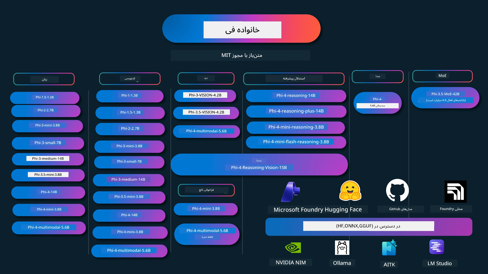

# کتاب آشپزی فی: مثال‌های عملی با مدل‌های فی مایکروسافت

[](https://codespaces.new/microsoft/phicookbook)
[](https://vscode.dev/redirect?url=vscode://ms-vscode-remote.remote-containers/cloneInVolume?url=https://github.com/microsoft/phicookbook)

[](https://GitHub.com/microsoft/phicookbook/graphs/contributors/?WT.mc_id=aiml-137032-kinfeylo)
[](https://GitHub.com/microsoft/phicookbook/issues/?WT.mc_id=aiml-137032-kinfeylo)
[](https://GitHub.com/microsoft/phicookbook/pulls/?WT.mc_id=aiml-137032-kinfeylo)
[](http://makeapullrequest.com?WT.mc_id=aiml-137032-kinfeylo)

[](https://GitHub.com/microsoft/phicookbook/watchers/?WT.mc_id=aiml-137032-kinfeylo)
[](https://GitHub.com/microsoft/phicookbook/network/?WT.mc_id=aiml-137032-kinfeylo)
[](https://GitHub.com/microsoft/phicookbook/stargazers/?WT.mc_id=aiml-137032-kinfeylo)

[](https://discord.com/invite/ByRwuEEgH4)

فی مجموعه‌ای از مدل‌های هوش مصنوعی متن‌باز است که توسط مایکروسافت توسعه یافته‌اند.

فی در حال حاضر قدرتمندترین و مقرون به صرفه‌ترین مدل زبان کوچک (SLM) است که معیارهای بسیار خوبی در زبان‌های چندگانه، استدلال، تولید متن/چت، کدنویسی، تصاویر، صدا و سایر سناریوها دارد.

شما می‌توانید فی را در فضای ابری یا دستگاه‌های لبه اجرا کنید و به‌راحتی برنامه‌های هوش مصنوعی مولد را با قدرت محاسباتی محدود بسازید.

برای شروع استفاده از این منابع، مراحل زیر را دنبال کنید:
1. **شاخۀ مخزن را فورک کنید**: کلیک کنید روی [](https://GitHub.com/microsoft/phicookbook/network/?WT.mc_id=aiml-137032-kinfeylo)
2. **مخزن را کلون کنید**: `git clone https://github.com/microsoft/PhiCookBook.git`
3. [**به انجمن دیسکورد هوش مصنوعی مایکروسافت بپیوندید و با کارشناسان و توسعه‌دهندگان دیگر ملاقات کنید**](https://discord.com/invite/ByRwuEEgH4?WT.mc_id=aiml-137032-kinfeylo)



### 🌐 پشتیبانی چندزبانه

#### پشتیبانی شده از طریق GitHub Action (خودکار و همواره به‌روز)

<!-- CO-OP TRANSLATOR LANGUAGES TABLE START -->
[عربی](../ar/README.md) | [بنگالی](../bn/README.md) | [بلغاری](../bg/README.md) | [برمه‌ای (میانمار)](../my/README.md) | [چینی (ساده‌شده)](../zh-CN/README.md) | [چینی (سنتی، هنگ کنگ)](../zh-HK/README.md) | [چینی (سنتی، ماکائو)](../zh-MO/README.md) | [چینی (سنتی، تایوان)](../zh-TW/README.md) | [کرواسی](../hr/README.md) | [چکی](../cs/README.md) | [دانمارکی](../da/README.md) | [هلندی](../nl/README.md) | [استونی](../et/README.md) | [فنلاندی](../fi/README.md) | [فرانسوی](../fr/README.md) | [آلمانی](../de/README.md) | [یونانی](../el/README.md) | [عبری](../he/README.md) | [هندی](../hi/README.md) | [مجارستانی](../hu/README.md) | [اندونزیایی](../id/README.md) | [ایتالیایی](../it/README.md) | [ژاپنی](../ja/README.md) | [کانادا](../kn/README.md) | [کره‌ای](../ko/README.md) | [لیتوانیایی](../lt/README.md) | [مالایی](../ms/README.md) | [مالایالام](../ml/README.md) | [مراتی](../mr/README.md) | [نپالی](../ne/README.md) | [پیدجین نیجریه‌ای](../pcm/README.md) | [نروژی](../no/README.md) | [فارسی](./README.md) | [لهستانی](../pl/README.md) | [پرتغالی (برزیل)](../pt-BR/README.md) | [پرتغالی (پرتغال)](../pt-PT/README.md) | [پنجابی (گورموخی)](../pa/README.md) | [رومانیایی](../ro/README.md) | [روسی](../ru/README.md) | [صربی (سیریلیک)](../sr/README.md) | [اسلواکی](../sk/README.md) | [اسلوونی](../sl/README.md) | [اسپانیایی](../es/README.md) | [سواحیلی](../sw/README.md) | [سوئدی](../sv/README.md) | [تاگالوگ (فیلیپینی)](../tl/README.md) | [تامیل](../ta/README.md) | [تلوگو](../te/README.md) | [تایلندی](../th/README.md) | [ترکی](../tr/README.md) | [اوکراینی](../uk/README.md) | [اردو](../ur/README.md) | [ویتنامی](../vi/README.md)

> **ترجیح می‌دهید به صورت محلی کلون کنید؟**
>
> این مخزن بیش از ۵۰ ترجمه زبان دارد که اندازه دانلود را به طور قابل توجهی افزایش می‌دهد. برای کلون کردن بدون ترجمه‌ها، از sparse checkout استفاده کنید:
>
> **Bash / macOS / Linux:**
> ```bash
> git clone --filter=blob:none --sparse https://github.com/microsoft/PhiCookBook.git
> cd PhiCookBook
> git sparse-checkout set --no-cone '/*' '!translations' '!translated_images'
> ```
>
> **CMD (ویندوز):**
> ```cmd
> git clone --filter=blob:none --sparse https://github.com/microsoft/PhiCookBook.git
> cd PhiCookBook
> git sparse-checkout set --no-cone "/*" "!translations" "!translated_images"
> ```
>
> این به شما همه چیز لازم برای کامل کردن دوره را با دانلود بسیار سریع‌تر می‌دهد.
<!-- CO-OP TRANSLATOR LANGUAGES TABLE END -->

## فهرست مطالب
- مقدمه - [خوش آمدید به خانواده فی](./md/01.Introduction/01/01.PhiFamily.md) - [راه‌اندازی محیط کار شما](./md/01.Introduction/01/01.EnvironmentSetup.md) - [درک فناوری‌های کلیدی](./md/01.Introduction/01/01.Understandingtech.md) - [ایمنی هوش مصنوعی برای مدل‌های فی](./md/01.Introduction/01/01.AISafety.md) - [پشتیبانی سخت‌افزاری فی](./md/01.Introduction/01/01.Hardwaresupport.md) - [مدل‌های فی و دسترسی در پلتفرم‌های مختلف](./md/01.Introduction/01/01.Edgeandcloud.md) - [استفاده از Guidance-ai و فی](./md/01.Introduction/01/01.Guidance.md) - [مدل‌های مارکت‌پلیس گیت‌هاب](https://github.com/marketplace/models) - [کتابخانه مدل‌های AI آزور](https://ai.azure.com) - استنتاج فی در محیط‌های مختلف - [Hugging face](./md/01.Introduction/02/01.HF.md) - [مدل‌های گیت‌هاب](./md/01.Introduction/02/02.GitHubModel.md) - [کتابخانه مدل‌های Microsoft Foundry](./md/01.Introduction/02/03.AzureAIFoundry.md) - [Ollama](./md/01.Introduction/02/04.Ollama.md) - [ابزار AI در VSCode (AITK)](./md/01.Introduction/02/05.AITK.md) - [NVIDIA NIM](./md/01.Introduction/02/06.NVIDIA.md) - [Foundry Local](./md/01.Introduction/02/07.FoundryLocal.md) - استنتاج خانواده فی - [استنتاج فی در iOS](./md/01.Introduction/03/iOS_Inference.md) - [استنتاج فی در اندروید](./md/01.Introduction/03/Android_Inference.md) - [استنتاج فی در جتسون](./md/01.Introduction/03/Jetson_Inference.md) - [استنتاج فی در رایانه AI](./md/01.Introduction/03/AIPC_Inference.md) - [استنتاج فی با Apple MLX Framework](./md/01.Introduction/03/MLX_Inference.md) - [استنتاج فی در سرور محلی](./md/01.Introduction/03/Local_Server_Inference.md) - [استنتاج فی در سرور راه دور با استفاده از AI Toolkit](./md/01.Introduction/03/Remote_Interence.md) - [استنتاج فی با Rust](./md/01.Introduction/03/Rust_Inference.md) - [استنتاج فی--دید در محلی](./md/01.Introduction/03/Vision_Inference.md) - [استنتاج فی با Kaito AKS، کانتینرهای آزور (پشتیبانی رسمی)](./md/01.Introduction/03/Kaito_Inference.md) - [کوانتیزه کردن خانواده فی](./md/01.Introduction/04/QuantifyingPhi.md) - [کوانتیزه کردن Phi-3.5 / 4 با استفاده از llama.cpp](./md/01.Introduction/04/UsingLlamacppQuantifyingPhi.md) - [کوانتیزه کردن Phi-3.5 / 4 با استفاده از افزونه‌های هوش مصنوعی مولد برای onnxruntime](./md/01.Introduction/04/UsingORTGenAIQuantifyingPhi.md) - [کوانتیزه کردن Phi-3.5 / 4 با استفاده از Intel OpenVINO](./md/01.Introduction/04/UsingIntelOpenVINOQuantifyingPhi.md) - [کوانتیزه کردن Phi-3.5 / 4 با استفاده از Apple MLX Framework](./md/01.Introduction/04/UsingAppleMLXQuantifyingPhi.md) - ارزیابی فی - [هوش مصنوعی مسئول](./md/01.Introduction/05/ResponsibleAI.md) - [Microsoft Foundry برای ارزیابی](./md/01.Introduction/05/AIFoundry.md) - [استفاده از Promptflow برای ارزیابی](./md/01.Introduction/05/Promptflow.md) - RAG با جستجوی AI آزور - [چگونه از Phi-4-mini و Phi-4-multimodal (RAG) با جستجوی AI آزور استفاده کنیم](https://github.com/microsoft/PhiCookBook/blob/main/code/06.E2E/E2E_Phi-4-RAG-Azure-AI-Search.ipynb) - نمونه‌های توسعه برنامه فی - برنامه‌های متنی و چت - نمونه‌های Phi-4 - [📓] [چت با مدل Phi-4-mini ONNX](./md/02.Application/01.TextAndChat/Phi4/ChatWithPhi4ONNX/README.md) - [چت با مدل محلی Phi-4 ONNX .NET](../../md/04.HOL/dotnet/src/LabsPhi4-Chat-01OnnxRuntime) - [برنامه کنسول چت .NET با Phi-4 ONNX با استفاده از Semantic Kernel](../../md/04.HOL/dotnet/src/LabsPhi4-Chat-02SK) - نمونه‌های Phi-3 / 3.5 - [ربات چت محلی در مرورگر با استفاده از Phi3، ONNX Runtime Web و WebGPU](https://github.com/microsoft/onnxruntime-inference-examples/tree/main/js/chat) - [چت OpenVino](./md/02.Application/01.TextAndChat/Phi3/E2E_OpenVino_Chat.md) - [مدل چندگانه - Phi-3-mini تعاملی و OpenAI Whisper](./md/02.Application/01.TextAndChat/Phi3/E2E_Phi-3-mini_with_whisper.md) - [MLFlow - ساخت یک بسته‌بندی و استفاده از Phi-3 با MLFlow](./md//02.Application/01.TextAndChat/Phi3/E2E_Phi-3-MLflow.md) - [بهینه‌سازی مدل - چگونه مدل Phi-3-min را برای ONNX Runtime Web با Olive بهینه کنیم](https://github.com/microsoft/Olive/tree/main/examples/phi3) - [برنامه WinUI3 با Phi-3 mini-4k-instruct-onnx](https://github.com/microsoft/Phi3-Chat-WinUI3-Sample/) -[نمونه برنامه یادداشت‌های هوشمند چندمدلی WinUI3](https://github.com/microsoft/ai-powered-notes-winui3-sample) - [تنظیم دقیق و یکپارچه‌سازی مدل‌های سفارشی Phi-3 با Prompt flow](./md/02.Application/01.TextAndChat/Phi3/E2E_Phi-3-FineTuning_PromptFlow_Integration.md) - [تنظیم دقیق و یکپارچه‌سازی مدل‌های سفارشی Phi-3 با Prompt flow در Microsoft Foundry](./md/02.Application/01.TextAndChat/Phi3/E2E_Phi-3-FineTuning_PromptFlow_Integration_AIFoundry.md) - [ارزیابی مدل تنظیم شده دقیق Phi-3 / Phi-3.5 در Microsoft Foundry با تمرکز بر اصول هوش مصنوعی مسئول مایکروسافت](./md/02.Application/01.TextAndChat/Phi3/E2E_Phi-3-Evaluation_AIFoundry.md) - [📓] [نمونه پیش‌بینی زبان Phi-3.5-mini-instruct (چینی/انگلیسی)](./md/02.Application/01.TextAndChat/Phi3/phi3-instruct-demo.ipynb) - [ربات چت WebGPU Phi-3.5-Instruct RAG](./md/02.Application/01.TextAndChat/Phi3/WebGPUWithPhi35Readme.md) - [استفاده از GPU ویندوز برای ایجاد راهکار Prompt flow با Phi-3.5-Instruct ONNX](./md/02.Application/01.TextAndChat/Phi3/UsingPromptFlowWithONNX.md) - [استفاده از Microsoft Phi-3.5 tflite برای ساخت برنامه اندروید](./md/02.Application/01.TextAndChat/Phi3/UsingPhi35TFLiteCreateAndroidApp.md) - [مثال پرسش و پاسخ .NET با استفاده از مدل محلی ONNX Phi-3 با Microsoft.ML.OnnxRuntime](../../md/04.HOL/dotnet/src/LabsPhi301) - [برنامه کنسول چت .NET با Semantic Kernel و Phi-3](../../md/04.HOL/dotnet/src/LabsPhi302) - نمونه‌های کد مبتنی بر SDK استنتاج AI آزور - نمونه‌های Phi-4 - [📓] [تولید کد پروژه با استفاده از Phi-4-multimodal](./md/02.Application/02.Code/Phi4/GenProjectCode/README.md) - نمونه‌های Phi-3 / 3.5 - [ساخت ربات چت Visual Studio Code GitHub Copilot با خانواده Phi-3 مایکروسافت](./md/02.Application/02.Code/Phi3/VSCodeExt/README.md) - [ایجاد ربات چت Visual Studio Code Copilot خود با Phi-3.5 توسط مدل‌های گیت‌هاب](./md/02.Application/02.Code/Phi3/CreateVSCodeChatAgentWithGitHubModels.md) - نمونه‌های استدلال پیشرفته - نمونه‌های Phi-4 - [📓] [نمونه‌های استدلال Phi-4-mini یا Phi-4](./md/02.Application/03.AdvancedReasoning/Phi4/AdvancedResoningPhi4mini/README.md) - [📓] [تنظیم دقیق استدلال Phi-4-mini با Microsoft Olive](./md/02.Application/03.AdvancedReasoning/Phi4/AdvancedResoningPhi4mini/olive_ft_phi_4_reasoning_with_medicaldata.ipynb) - [📓] [تنظیم دقیق استدلال Phi-4-mini با Apple MLX](./md/02.Application/03.AdvancedReasoning/Phi4/AdvancedResoningPhi4mini/mlx_ft_phi_4_reasoning_with_medicaldata.ipynb) - [📓] [استدلال Phi-4-mini با مدل‌های گیت‌هاب](./md/02.Application/02.Code/Phi4r/github_models_inference.ipynb) - [📓] [استدلال Phi-4-mini با مدل‌های Microsoft Foundry](./md/02.Application/02.Code/Phi4r/azure_models_inference.ipynb) -
دموها - [دموهای Phi-4-mini میزبانی شده در فضای Hugging Face](https://huggingface.co/spaces/microsoft/phi-4-mini?WT.mc_id=aiml-137032-kinfeylo) - [دموهای Phi-4-multimodal میزبانی شده در فضای Hugging Face](https://huggingface.co/spaces/microsoft/phi-4-multimodal?WT.mc_id=aiml-137032-kinfeylo) - نمونه‌های بینایی - نمونه‌های Phi-4 - [📓] [استفاده از Phi-4-multimodal برای خواندن تصاویر و تولید کد](./md/02.Application/04.Vision/Phi4/CreateFrontend/README.md) - نمونه‌های Phi-3 / 3.5 - [📓][متن به متن تصویر دیداری Phi-3](./md/02.Application/04.Vision/Phi3/E2E_Phi-3-vision-image-text-to-text-online-endpoint.ipynb) - [Phi-3-vision-ONNX](https://onnxruntime.ai/docs/genai/tutorials/phi3-v.html) - [📓][کدگذاری CLIP دیداری Phi-3](./md/02.Application/04.Vision/Phi3/E2E_Phi-3-vision-image-text-to-text-online-endpoint.ipynb) - [دمو: بازیافت Phi-3](https://github.com/jennifermarsman/PhiRecycling/) - [Phi-3-vision - دستیار زبان بصری - با Phi3-Vision و OpenVINO](https://docs.openvino.ai/nightly/notebooks/phi-3-vision-with-output.html) - [بینایی Phi-3 Nvidia NIM](./md/02.Application/04.Vision/Phi3/E2E_Nvidia_NIM_Vision.md) - [بینایی Phi-3 OpenVino](./md/02.Application/04.Vision/Phi3/E2E_OpenVino_Phi3Vision.md) - [📓][نمونه چندفریمی یا چندتصویری بینایی Phi-3.5](./md/02.Application/04.Vision/Phi3/phi3-vision-demo.ipynb) - [مدل ONNX محلی بینایی Phi-3 با استفاده از Microsoft.ML.OnnxRuntime .NET](../../md/04.HOL/dotnet/src/LabsPhi303) - [مدل ONNX محلی بینایی Phi-3 با منوی مبتنی بر استفاده از Microsoft.ML.OnnxRuntime .NET](../../md/04.HOL/dotnet/src/LabsPhi304) - نمونه‌های استدلال-بینایی - Phi-4-Reasoning-Vision-15B - [📓] [استفاده از Phi-4-Reasoning-Vision-15B برای تشخیص عبور غیرمجاز عابر پیاده](./md/02.Application/10.ReasoningVision/Phi_4_reasoning_vision_15b_Jaywalking.ipynb) - [📓] [استفاده از Phi-4-Reasoning-Vision-15B برای ریاضیات](./md/02.Application/10.ReasoningVision/Phi_4_reasoning_vision_15b_Math.ipynb) - [📓] [استفاده از Phi-4-Reasoning-Vision-15B برای تشخیص رابط کاربری](./md/02.Application/10.ReasoningVision/Phi_4_reasoning_vision_15b_ui.ipynb) - نمونه‌های ریاضی - نمونه‌های Phi-4-Mini-Flash-Reasoning-Instruct [دموی ریاضی با Phi-4-Mini-Flash-Reasoning-Instruct](./md/02.Application/09.Math/MathDemo.ipynb) - نمونه‌های صوتی - نمونه‌های Phi-4 - [📓] [استخراج رونوشت‌های صوتی با استفاده از Phi-4-multimodal](./md/02.Application/05.Audio/Phi4/Transciption/README.md) - [📓] [نمونه صوتی Phi-4-multimodal](./md/02.Application/05.Audio/Phi4/Siri/demo.ipynb) - [📓] [نمونه ترجمه گفتار Phi-4-multimodal](./md/02.Application/05.Audio/Phi4/Translate/demo.ipynb) - [برنامه کنسول .NET با استفاده از Phi-4-multimodal Audio برای تحلیل فایل صوتی و تولید رونوشت](../../md/04.HOL/dotnet/src/LabsPhi4-MultiModal-02Audio) - نمونه‌های MOE - نمونه‌های Phi-3 / 3.5 - [📓] [نمونه مدل‌های ترکیبی متخصصان (MoEs) Phi-3.5 برای رسانه‌های اجتماعی](./md/02.Application/06.MoE/Phi3/phi3_moe_demo.ipynb) - [📓] [ساخت یک خط لوله تولید مبتنی بر بازیابی (RAG) با NVIDIA NIM Phi-3 MOE، جستجوی Azure AI، و LlamaIndex](./md/02.Application/06.MoE/Phi3/azure-ai-search-nvidia-rag.ipynb) - - نمونه‌های فراخوانی تابع - نمونه‌های Phi-4 🆕 - [📓] [استفاده از فراخوانی تابع با Phi-4-mini](./md/02.Application/07.FunctionCalling/Phi4/FunctionCallingBasic/README.md) - [📓] [استفاده از فراخوانی تابع برای ایجاد چندعامل با Phi-4-mini](./md/02.Application/07.FunctionCalling/Phi4/Multiagents/Phi_4_mini_multiagent.ipynb) - [📓] [استفاده از فراخوانی تابع با Ollama](./md/02.Application/07.FunctionCalling/Phi4/Ollama/ollama_functioncalling.ipynb) - [📓] [استفاده از فراخوانی تابع با ONNX](./md/02.Application/07.FunctionCalling/Phi4/ONNX/onnx_parallel_functioncalling.ipynb) - نمونه‌های ترکیب چندرسانه‌ای - نمونه‌های Phi-4 🆕 - [📓] [استفاده از Phi-4-multimodal به عنوان خبرنگار فناوری](./md/02.Application/08.Multimodel/Phi4/TechJournalist/phi_4_mm_audio_text_publish_news.ipynb) - [برنامه کنسول .NET برای تحلیل تصاویر با استفاده از Phi-4-multimodal](../../md/04.HOL/dotnet/src/LabsPhi4-MultiModal-01Images) - نمونه‌های تنظیم دقیق Phi - [سناریوهای تنظیم دقیق](./md/03.FineTuning/FineTuning_Scenarios.md) - [تنظیم دقیق در مقابل RAG](./md/03.FineTuning/FineTuning_vs_RAG.md) - [تنظیم دقیق برای تبدیل Phi-3 به یک متخصص صنعتی](./md/03.FineTuning/LetPhi3gotoIndustriy.md) - [تنظیم دقیق Phi-3 با جعبه ابزار AI برای VS Code](./md/03.FineTuning/Finetuning_VSCodeaitoolkit.md) - [تنظیم دقیق Phi-3 با سرویس یادگیری ماشین Azure](./md/03.FineTuning/Introduce_AzureML.md) - [تنظیم دقیق Phi-3 با لورا](./md/03.FineTuning/FineTuning_Lora.md) - [تنظیم دقیق Phi-3 با کیولورا](./md/03.FineTuning/FineTuning_Qlora.md) - [تنظیم دقیق Phi-3 با Microsoft Foundry](./md/03.FineTuning/FineTuning_AIFoundry.md) - [تنظیم دقیق Phi-3 با Azure ML CLI/SDK](./md/03.FineTuning/FineTuning_MLSDK.md) - [تنظیم دقیق با Microsoft Olive](./md/03.FineTuning/FineTuning_MicrosoftOlive.md) - [آزمایشگاه عملی تنظیم دقیق با Microsoft Olive](./md/03.FineTuning/olive-lab/readme.md) - [تنظیم دقیق Phi-3-vision با Weights and Bias](./md/03.FineTuning/FineTuning_Phi-3-visionWandB.md) - [تنظیم دقیق Phi-3 با چارچوب MLX اپل](./md/03.FineTuning/FineTuning_MLX.md) - [تنظیم دقیق Phi-3-vision (پشتیبانی رسمی)](./md/03.FineTuning/FineTuning_Vision.md) - [تنظیم دقیق Phi-3 با Kaito AKS، کانتینرهای Azure (پشتیبانی رسمی)](./md/03.FineTuning/FineTuning_Kaito.md) - [تنظیم دقیق Phi-3 و 3.5 Vision](https://github.com/2U1/Phi3-Vision-Finetune) - آزمایشگاه عملی - [بررسی مدل‌های پیشرفته: LLMها، SLMها، توسعه محلی و بیشتر](https://github.com/microsoft/aitour-exploring-cutting-edge-models) - [باز کردن پتانسیل NLP: تنظیم دقیق با Microsoft Olive](https://github.com/azure/Ignite_FineTuning_workshop) - مقالات پژوهشی و انتشارات علمی - [کتاب‌های درسی تنها چیزی است که نیاز دارید II: گزارش فنی phi-1.5](https://arxiv.org/abs/2309.05463) - [گزارش فنی Phi-3: مدل زبان بسیار توانمند به طور محلی روی تلفن شما](https://arxiv.org/abs/2404.14219) - [گزارش فنی Phi-4](https://arxiv.org/abs/2412.08905) - [گزارش فنی Phi-4-Mini: مدل‌های زبان چندرسانه‌ای فشرده اما قدرتمند با استفاده از ترکیبی از LoRAها](https://arxiv.org/abs/2503.01743) - [بهینه‌سازی مدل‌های زبان کوچک برای فراخوانی تابع در خودرو](https://arxiv.org/abs/2501.02342) - [(چرا PHI) تنظیم دقیق PHI-3 برای پاسخگویی به سوالات چندگزینه‌ای: روش‌شناسی، نتایج و چالش‌ها](https://arxiv.org/abs/2501.01588) - [گزارش فنی Phi-4-Reasoning](https://www.microsoft.com/en-us/research/wp-content/uploads/2025/04/phi_4_reasoning.pdf)
- [گزارش فنی Phi-4-mini-reasoning](https://huggingface.co/microsoft/Phi-4-mini-reasoning/blob/main/Phi-4-Mini-Reasoning.pdf)
# کتاب‌ آشپزی فی: مثال‌های عملی با مدل‌های فی مایکروسافت

[](https://codespaces.new/microsoft/phicookbook)
[](https://vscode.dev/redirect?url=vscode://ms-vscode-remote.remote-containers/cloneInVolume?url=https://github.com/microsoft/phicookbook)

[](https://GitHub.com/microsoft/phicookbook/graphs/contributors/?WT.mc_id=aiml-137032-kinfeylo)
[](https://GitHub.com/microsoft/phicookbook/issues/?WT.mc_id=aiml-137032-kinfeylo)
[](https://GitHub.com/microsoft/phicookbook/pulls/?WT.mc_id=aiml-137032-kinfeylo)
[](http://makeapullrequest.com?WT.mc_id=aiml-137032-kinfeylo)

[](https://GitHub.com/microsoft/phicookbook/watchers/?WT.mc_id=aiml-137032-kinfeylo)
[](https://GitHub.com/microsoft/phicookbook/network/?WT.mc_id=aiml-137032-kinfeylo)
[](https://GitHub.com/microsoft/phicookbook/stargazers/?WT.mc_id=aiml-137032-kinfeylo)

[](https://discord.com/invite/ByRwuEEgH4)

فی مجموعه‌ای از مدل‌های هوش مصنوعی متن‌باز است که توسط مایکروسافت توسعه یافته‌اند.

فی در حال حاضر قدرتمندترین و مقرون به صرفه‌ترین مدل زبان کوچک (SLM) است، با معیارهای بسیار خوب در چند زبانگی، استدلال، تولید متن/گفت‌وگو، کدنویسی، تصاویر، صدا و سناریوهای دیگر.

شما می‌توانید فی را روی ابر یا دستگاه‌های لبه مستقر کنید و به راحتی برنامه‌های هوش مصنوعی مولد با قدرت محاسباتی محدود بسازید.

برای شروع استفاده از این منابع، مراحل زیر را دنبال کنید:
1. **فورک مخزن**: کلیک کنید [](https://GitHub.com/microsoft/phicookbook/network/?WT.mc_id=aiml-137032-kinfeylo)
2. **کلون مخزن**:   `git clone https://github.com/microsoft/PhiCookBook.git`
3. [**به جامعه Discord هوش مصنوعی مایکروسافت بپیوندید و با متخصصان و توسعه‌دهندگان همفکر ملاقات کنید**](https://discord.com/invite/ByRwuEEgH4?WT.mc_id=aiml-137032-kinfeylo)


### 🌐 پشتیبانی چندزبانه

#### پشتیبانی شده از طریق GitHub Action (خودکار و همواره به‌روز)

<!-- CO-OP TRANSLATOR LANGUAGES TABLE START -->
[عربی](../ar/README.md) | [بنگالی](../bn/README.md) | [بلغاری](../bg/README.md) | [برمه‌ای (میانمار)](../my/README.md) | [چینی (ساده‌شده)](../zh-CN/README.md) | [چینی (سنتی، هنگ کنگ)](../zh-HK/README.md) | [چینی (سنتی، ماکائو)](../zh-MO/README.md) | [چینی (سنتی، تایوان)](../zh-TW/README.md) | [کرواسی](../hr/README.md) | [چک](../cs/README.md) | [دانمارکی](../da/README.md) | [هلندی](../nl/README.md) | [استونیایی](../et/README.md) | [فنلاندی](../fi/README.md) | [فرانسوی](../fr/README.md) | [آلمانی](../de/README.md) | [یونانی](../el/README.md) | [عبری](../he/README.md) | [هندی](../hi/README.md) | [مجارستانی](../hu/README.md) | [اندونزیایی](../id/README.md) | [ایتالیایی](../it/README.md) | [ژاپنی](../ja/README.md) | [کانادا](../kn/README.md) | [کره‌ای](../ko/README.md) | [لیتوانیایی](../lt/README.md) | [مالایی](../ms/README.md) | [مالایالم](../ml/README.md) | [ماراتی](../mr/README.md) | [نپالی](../ne/README.md) | [پیجین نیجریه‌ای](../pcm/README.md) | [نروژی](../no/README.md) | [فارسی (Farsi)](./README.md) | [لهستانی](../pl/README.md) | [پرتغالی (برزیل)](../pt-BR/README.md) | [پرتغالی (پرتغال)](../pt-PT/README.md) | [پنجابی (گورمخی)](../pa/README.md) | [رومانیایی](../ro/README.md) | [روسی](../ru/README.md) | [صربی (سیریلیک)](../sr/README.md) | [اسلواکی](../sk/README.md) | [اسلوونیایی](../sl/README.md) | [اسپانیایی](../es/README.md) | [سوازیلی](../sw/README.md) | [سوئدی](../sv/README.md) | [تاگالوگ (فیلیپینی)](../tl/README.md) | [تامیل](../ta/README.md) | [تلگو](../te/README.md) | [تایلندی](../th/README.md) | [ترکی](../tr/README.md) | [اوکراینی](../uk/README.md) | [اردو](../ur/README.md) | [ویتنامی](../vi/README.md)

> **تمایل دارید به‌صورت محلی کلون کنید؟**
>
> این مخزن شامل بیش از ۵۰ ترجمه زبان است که حجم دانلود را به‌طور قابل توجهی افزایش می‌دهد. برای کلون کردن بدون ترجمه‌ها، از sparse checkout استفاده کنید:
>
> **بش / مک‌او‌اس / لینوکس:**
> ```bash
> git clone --filter=blob:none --sparse https://github.com/microsoft/PhiCookBook.git
> cd PhiCookBook
> git sparse-checkout set --no-cone '/*' '!translations' '!translated_images'
> ```
>
> **CMD (ویندوز):**
> ```cmd
> git clone --filter=blob:none --sparse https://github.com/microsoft/PhiCookBook.git
> cd PhiCookBook
> git sparse-checkout set --no-cone "/*" "!translations" "!translated_images"
> ```
>
> این به شما تمام چیزهای لازم برای تکمیل دوره را با سرعت دانلود بسیار سریع‌تر می‌دهد.
<!-- CO-OP TRANSLATOR LANGUAGES TABLE END -->

## فهرست مطالب

## استفاده از مدل‌های فی

### فی روی Microsoft Foundry

می‌توانید یاد بگیرید چگونه فی مایکروسافت را استفاده کنید و چگونه راه‌حل‌های End-to-End (E2E) را روی دستگاه‌های سخت‌افزاری مختلف خود بسازید. برای تجربه فی خودتان، با بازی کردن با مدل‌ها و سفارشی‌سازی فی برای سناریوهای خود از طریق [کتابخانه مدل‌های هوش مصنوعی Microsoft Foundry Azure](https://aka.ms/phi3-azure-ai) شروع کنید. می‌توانید بیشتر در مورد شروع کار با [Microsoft Foundry](/md/02.QuickStart/AzureAIFoundry_QuickStart.md) بدانید.

**محیط آزمایشی**
برای هر مدل یک محیط آزمایشی اختصاصی وجود دارد تا مدل را آزمایش کنید: [Azure AI Playground](https://aka.ms/try-phi3).

### فی روی GitHub Models

می‌توانید یاد بگیرید چگونه فی مایکروسافت را استفاده کنید و چگونه راه‌حل‌های E2E را روی دستگاه‌های سخت‌افزاری مختلف خود بسازید. برای تجربه فی خودتان، با بازی کردن با مدل و سفارشی‌سازی فی برای سناریوهای خود از طریق [کتابخانه مدل GitHub](https://github.com/marketplace/models?WT.mc_id=aiml-137032-kinfeylo) شروع کنید. می‌توانید بیشتر در مورد شروع کار با [کتابخانه مدل GitHub](/md/02.QuickStart/GitHubModel_QuickStart.md) بدانید.

**محیط آزمایشی**
برای هر مدل یک [محیط آزمایشی برای تست مدل](/md/02.QuickStart/GitHubModel_QuickStart.md) وجود دارد.

### فی روی Hugging Face

می‌توانید مدل را در [Hugging Face](https://huggingface.co/microsoft) نیز پیدا کنید.

**محیط آزمایشی**
 [محیط گفتگو Hugging Chat playground](https://huggingface.co/chat/models/microsoft/Phi-3-mini-4k-instruct)

 ## 🎒 دوره‌های دیگر

تیم ما دوره‌های دیگری نیز تولید می‌کند! بررسی کنید:

<!-- CO-OP TRANSLATOR OTHER COURSES START -->
### LangChain
[](https://aka.ms/langchain4j-for-beginners)
[](https://aka.ms/langchainjs-for-beginners?WT.mc_id=m365-94501-dwahlin)
[](https://github.com/microsoft/langchain-for-beginners?WT.mc_id=m365-94501-dwahlin)
---

### Azure / Edge / MCP / Agents
[](https://github.com/microsoft/AZD-for-beginners?WT.mc_id=academic-105485-koreyst)
[](https://github.com/microsoft/edgeai-for-beginners?WT.mc_id=academic-105485-koreyst)
[](https://github.com/microsoft/mcp-for-beginners?WT.mc_id=academic-105485-koreyst)
[](https://github.com/microsoft/ai-agents-for-beginners?WT.mc_id=academic-105485-koreyst)

---
 
### مجموعه هوش مصنوعی مولد
[](https://github.com/microsoft/generative-ai-for-beginners?WT.mc_id=academic-105485-koreyst)
[-9333EA?style=for-the-badge&labelColor=E5E7EB&color=9333EA)](https://github.com/microsoft/Generative-AI-for-beginners-dotnet?WT.mc_id=academic-105485-koreyst)
[-C084FC?style=for-the-badge&labelColor=E5E7EB&color=C084FC)](https://github.com/microsoft/generative-ai-for-beginners-java?WT.mc_id=academic-105485-koreyst)
[-E879F9?style=for-the-badge&labelColor=E5E7EB&color=E879F9)](https://github.com/microsoft/generative-ai-with-javascript?WT.mc_id=academic-105485-koreyst)

---
 
### یادگیری‌های پایه
[](https://aka.ms/ml-beginners?WT.mc_id=academic-105485-koreyst)
[](https://aka.ms/datascience-beginners?WT.mc_id=academic-105485-koreyst)
[](https://aka.ms/ai-beginners?WT.mc_id=academic-105485-koreyst)
[](https://github.com/microsoft/Security-101?WT.mc_id=academic-96948-sayoung)
[](https://aka.ms/webdev-beginners?WT.mc_id=academic-105485-koreyst)
[](https://aka.ms/iot-beginners?WT.mc_id=academic-105485-koreyst)
[](https://github.com/microsoft/xr-development-for-beginners?WT.mc_id=academic-105485-koreyst)

---
 
### سری کوپایلت
[](https://aka.ms/GitHubCopilotAI?WT.mc_id=academic-105485-koreyst)
[](https://github.com/microsoft/mastering-github-copilot-for-dotnet-csharp-developers?WT.mc_id=academic-105485-koreyst)
[](https://github.com/microsoft/CopilotAdventures?WT.mc_id=academic-105485-koreyst)
<!-- CO-OP TRANSLATOR OTHER COURSES END -->

## هوش مصنوعی مسئولانه

شرکت مایکروسافت متعهد به کمک به مشتریان خود برای استفاده مسئولانه از محصولات هوش مصنوعی ما، به اشتراک‌گذاری آموخته‌هایمان و ایجاد همکاری‌های مبتنی بر اعتماد از طریق ابزارهایی مانند یادداشت‌های شفافیت و ارزیابی‌های تأثیر است. بسیاری از این منابع را می‌توانید در [https://aka.ms/RAI](https://aka.ms/RAI) بیابید.
رویکرد مایکروسافت به هوش مصنوعی مسئولانه بر اصول هوش مصنوعی ما بر پایه عدالت، قابلیت اطمینان و ایمنی، حریم خصوصی و امنیت، فراگیری، شفافیت و پاسخگویی استوار است.

مدل‌های زبان طبیعی، تصویر و گفتار در مقیاس بزرگ - مانند مدل‌هایی که در این نمونه استفاده شده‌اند - ممکن است به گونه‌ای رفتار کنند که ناعادلانه، غیرقابل اعتماد یا توهین‌آمیز باشد، که به نوبه خود می‌تواند باعث آسیب شود. لطفاً برای اطلاع از ریسک‌ها و محدودیت‌ها به [یادداشت شفافیت سرویس Azure OpenAI](https://learn.microsoft.com/legal/cognitive-services/openai/transparency-note?tabs=text) مراجعه کنید.

رویکرد پیشنهادی برای کاهش این ریسک‌ها، افزودن یک سیستم ایمنی در معماری شما است که قادر به شناسایی و جلوگیری از رفتارهای مضر باشد. [ایمنی محتوای هوش مصنوعی Azure](https://learn.microsoft.com/azure/ai-services/content-safety/overview) یک لایه مستقل از حفاظت فراهم می‌کند که می‌تواند محتوای تولید شده توسط کاربر و تولید شده توسط هوش مصنوعی را در برنامه‌ها و خدمات تشخیص دهد. ایمنی محتوای هوش مصنوعی Azure شامل APIهای متن و تصویر است که امکان شناسایی محتوای مضر را فراهم می‌آورد. در Microsoft Foundry، سرویس ایمنی محتوا به شما امکان مشاهده، کاوش و آزمایش نمونه کدهایی برای شناسایی محتوای مضر در زمینه‌های مختلف را می‌دهد. مستندات شروع سریع زیر شما را در ارسال درخواست‌ها به این سرویس راهنمایی می‌کند: [quickstart documentation](https://learn.microsoft.com/azure/ai-services/content-safety/quickstart-text?tabs=visual-studio%2Clinux&pivots=programming-language-rest).

یکی دیگر از جنبه‌ها، عملکرد کلی برنامه است. در برنامه‌های چندمدلی و چندرسانه‌ای، با عملکرد به معنای این است که سیستم همانطور که شما و کاربران‌تان انتظار دارید عمل می‌کند، از جمله تولید نکردن خروجی‌های مضر. مهم است عملکرد کل برنامه خود را با استفاده از [ارزیاب‌های کیفیت، عملکرد، ریسک و ایمنی](https://learn.microsoft.com/azure/ai-studio/concepts/evaluation-metrics-built-in) ارزیابی کنید. همچنین توانایی ایجاد و ارزیابی با استفاده از [ارزیاب‌های سفارشی](https://learn.microsoft.com/azure/ai-studio/how-to/develop/evaluate-sdk#custom-evaluators) را دارید.

می‌توانید برنامه هوش مصنوعی خود را در محیط توسعه با استفاده از [SDK ارزیابی هوش مصنوعی Azure](https://microsoft.github.io/promptflow/index.html) ارزیابی کنید. با داشتن مجموعه داده آزمایشی یا هدف، خروجی‌های برنامه تولید محتوا هوش مصنوعی شما توسط ارزیاب‌های داخلی یا ارزیاب‌های سفارشی انتخابی شما به صورت کمی اندازه‌گیری می‌شود. برای شروع با azure ai evaluation sdk به منظور ارزیابی سیستم خود، می‌توانید از [راهنمای شروع سریع](https://learn.microsoft.com/azure/ai-studio/how-to/develop/flow-evaluate-sdk) پیروی کنید. پس از اجرای یک ارزیابی، می‌توانید [نتایج را در Microsoft Foundry مشاهده کنید](https://learn.microsoft.com/azure/ai-studio/how-to/evaluate-flow-results).

## علائم تجاری

این پروژه ممکن است شامل علائم تجاری یا لوگوهایی برای پروژه‌ها، محصولات، یا خدمات باشد. استفاده مجاز از علائم تجاری یا لوگوی مایکروسافت تابع و باید از [دستورالعمل‌های علائم تجاری و برند مایکروسافت](https://www.microsoft.com/legal/intellectualproperty/trademarks/usage/general) پیروی کند.
استفاده از علائم تجاری یا لوگوی مایکروسافت در نسخه‌های تغییر یافته این پروژه نباید باعث سردرگمی یا القای حمایت مایکروسافت شود. هرگونه استفاده از علائم تجاری یا لوگوی طرف‌های سوم نیز تابع سیاست‌های آن‌ها است.

## دریافت کمک

اگر در حین ساخت برنامه‌های هوش مصنوعی به مشکل برخوردید یا سوالی داشتید، بپیوندید به:

[](https://aka.ms/foundry/discord)

اگر بازخورد محصول یا خطایی هنگام ساخت دارید، مراجعه کنید به:

[](https://aka.ms/foundry/forum)

---

<!-- CO-OP TRANSLATOR DISCLAIMER START -->
**سلب مسئولیت**:
این سند با استفاده از سرویس ترجمه هوش مصنوعی [Co-op Translator](https://github.com/Azure/co-op-translator) ترجمه شده است. اگرچه ما در تلاش برای دقت هستیم، لازم است توجه داشته باشید که ترجمه‌های خودکار ممکن است شامل اشتباهات یا نواقصی باشند. سند اصلی به زبان بومی آن باید به عنوان منبع معتبر در نظر گرفته شود. برای اطلاعات حیاتی، توصیه می‌شود از ترجمه حرفه‌ای انسانی استفاده شود. ما در قبال هرگونه سوء تفاهم یا تفسیر نادرستی که از استفاده این ترجمه ناشی شود، مسئولیتی نداریم.
<!-- CO-OP TRANSLATOR DISCLAIMER END -->