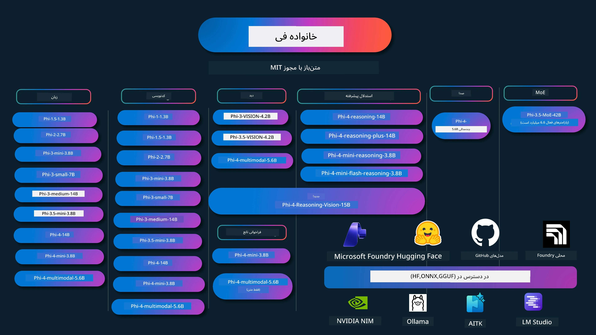

# کتاب آشپزی Phi: مثال‌های عملی با مدل‌های Phi مایکروسافت

[](https://codespaces.new/microsoft/phicookbook)
[](https://vscode.dev/redirect?url=vscode://ms-vscode-remote.remote-containers/cloneInVolume?url=https://github.com/microsoft/phicookbook)

[](https://GitHub.com/microsoft/phicookbook/graphs/contributors/?WT.mc_id=aiml-137032-kinfeylo)
[](https://GitHub.com/microsoft/phicookbook/issues/?WT.mc_id=aiml-137032-kinfeylo)
[](https://GitHub.com/microsoft/phicookbook/pulls/?WT.mc_id=aiml-137032-kinfeylo)
[](http://makeapullrequest.com?WT.mc_id=aiml-137032-kinfeylo)

[](https://GitHub.com/microsoft/phicookbook/watchers/?WT.mc_id=aiml-137032-kinfeylo)
[](https://GitHub.com/microsoft/phicookbook/network/?WT.mc_id=aiml-137032-kinfeylo)
[](https://GitHub.com/microsoft/phicookbook/stargazers/?WT.mc_id=aiml-137032-kinfeylo)

[](https://discord.com/invite/ByRwuEEgH4)

Phi مجموعه‌ای از مدل‌های هوش مصنوعی متن‌باز است که توسط مایکروسافت توسعه یافته است.

Phi در حال حاضر قدرتمندترین و مقرون به صرفه‌ترین مدل زبان کوچک (SLM) است که در معیارها در چند زبان، استدلال، تولید متن/چت، کدنویسی، تصاویر، صوت و سایر سناریوها عملکرد بسیار خوبی دارد.

شما می‌توانید Phi را در ابر یا دستگاه‌های لبه مستقر کنید و به‌راحتی برنامه‌های هوش مصنوعی مولد را با قدرت محاسباتی محدود بسازید.

برای شروع استفاده از این منابع مراحل زیر را دنبال کنید:
1. **انشعاب (Fork) مخزن را ایجاد کنید**: کلیک کنید [](https://GitHub.com/microsoft/phicookbook/network/?WT.mc_id=aiml-137032-kinfeylo)
2. **مخزن را کلون کنید**: `git clone https://github.com/microsoft/PhiCookBook.git`
3. [**به جامعه دیسکورد هوش مصنوعی مایکروسافت بپیوندید و با کارشناسان و همکاران توسعه‌دهنده ملاقات کنید**](https://discord.com/invite/ByRwuEEgH4?WT.mc_id=aiml-137032-kinfeylo)



### 🌐 پشتیبانی چندزبانه

#### پشتیبانی از طریق فعل و انفعال GitHub (خودکار و همواره به‌روز)

<!-- CO-OP TRANSLATOR LANGUAGES TABLE START -->
[عربی](../ar/README.md) | [بنگالی](../bn/README.md) | [بلغاری](../bg/README.md) | [برمه‌ای (میانمار)](../my/README.md) | [چینی (ساده‌شده)](../zh-CN/README.md) | [چینی (سنتی، هنگ‌کنگ)](../zh-HK/README.md) | [چینی (سنتی، ماکائو)](../zh-MO/README.md) | [چینی (سنتی، تایوان)](../zh-TW/README.md) | [کرواسی](../hr/README.md) | [چکی](../cs/README.md) | [دانمارکی](../da/README.md) | [هلندی](../nl/README.md) | [استونیایی](../et/README.md) | [فنلاندی](../fi/README.md) | [فرانسوی](../fr/README.md) | [آلمانی](../de/README.md) | [یونانی](../el/README.md) | [عبری](../he/README.md) | [هندی](../hi/README.md) | [مجارستانی](../hu/README.md) | [اندونزیایی](../id/README.md) | [ایتالیایی](../it/README.md) | [ژاپنی](../ja/README.md) | [کنادا](../kn/README.md) | [خمری](../km/README.md) | [کره‌ای](../ko/README.md) | [لیتوانیایی](../lt/README.md) | [مالایی](../ms/README.md) | [مالایالامی](../ml/README.md) | [مراتی](../mr/README.md) | [نپالی](../ne/README.md) | [پیدگین نیجریه‌ای](../pcm/README.md) | [نروژی](../no/README.md) | [فارسی (Farsi)](./README.md) | [لهستانی](../pl/README.md) | [پرتغالی (برزیل)](../pt-BR/README.md) | [پرتغالی (پرتغال)](../pt-PT/README.md) | [پنجابی (Gurmukhi)](../pa/README.md) | [رومانیایی](../ro/README.md) | [روسی](../ru/README.md) | [صرب (سیریلیک)](../sr/README.md) | [اسلواکی](../sk/README.md) | [اسلوونیایی](../sl/README.md) | [اسپانیایی](../es/README.md) | [سواحیلی](../sw/README.md) | [سوئدی](../sv/README.md) | [تاگالوگ (فیلیپینی)](../tl/README.md) | [تامیل](../ta/README.md) | [تلگو](../te/README.md) | [تایلندی](../th/README.md) | [ترکی](../tr/README.md) | [اوکراینی](../uk/README.md) | [اردو](../ur/README.md) | [ویتنامی](../vi/README.md)

> **ترجیح می‌دهید به‌صورت محلی کلون کنید؟**
>
> این مخزن شامل بیش از ۵۰ ترجمه زبانی است که اندازه دانلود را به طور قابل توجهی افزایش می‌دهد. برای کلون کردن بدون ترجمه‌ها، از بررسی پراکنده (sparse checkout) استفاده کنید:
>
> **Bash / macOS / لینوکس:**
> ```bash
> git clone --filter=blob:none --sparse https://github.com/microsoft/PhiCookBook.git
> cd PhiCookBook
> git sparse-checkout set --no-cone '/*' '!translations' '!translated_images'
> ```
>
> **CMD (ویندوز):**
> ```cmd
> git clone --filter=blob:none --sparse https://github.com/microsoft/PhiCookBook.git
> cd PhiCookBook
> git sparse-checkout set --no-cone "/*" "!translations" "!translated_images"
> ```
>
> این به شما همه چیز مورد نیاز برای تکمیل دوره را با دانلود بسیار سریع‌تر می‌دهد.
<!-- CO-OP TRANSLATOR LANGUAGES TABLE END -->

## فهرست مطالب

- معرفی
  - [خوش‌آمدید به خانواده Phi](./md/01.Introduction/01/01.PhiFamily.md)
  - [راه‌اندازی محیط شما](./md/01.Introduction/01/01.EnvironmentSetup.md)
  - [درک فناوری‌های کلیدی](./md/01.Introduction/01/01.Understandingtech.md)
  - [ایمنی هوش مصنوعی برای مدل‌های Phi](./md/01.Introduction/01/01.AISafety.md)
  - [پشتیبانی سخت‌افزاری Phi](./md/01.Introduction/01/01.Hardwaresupport.md)
  - [مدل‌های Phi و در دسترس بودن در پلتفرم‌ها](./md/01.Introduction/01/01.Edgeandcloud.md)
  - [استفاده از Guidance-ai و Phi](./md/01.Introduction/01/01.Guidance.md)
  - [مدل‌های بازار GitHub](https://github.com/marketplace/models)
  - [کاتالوگ مدل‌های AI Azure](https://ai.azure.com)

- استنتاج Phi در محیط‌های مختلف
    -  [Hugging face](./md/01.Introduction/02/01.HF.md)
    -  [مدل‌های GitHub](./md/01.Introduction/02/02.GitHubModel.md)
    -  [کاتالوگ مدل مایکروسافت فاندری](./md/01.Introduction/02/03.AzureAIFoundry.md)
    -  [Ollama](./md/01.Introduction/02/04.Ollama.md)
    -  [ابزار هوش مصنوعی VSCode (AITK)](./md/01.Introduction/02/05.AITK.md)
    -  [NVIDIA NIM](./md/01.Introduction/02/06.NVIDIA.md)
    -  [Foundry Local](./md/01.Introduction/02/07.FoundryLocal.md)

- استنتاج خانواده Phi
    - [استنتاج Phi در iOS](./md/01.Introduction/03/iOS_Inference.md)
    - [استنتاج Phi در اندروید](./md/01.Introduction/03/Android_Inference.md)
    - [استنتاج Phi در Jetson](./md/01.Introduction/03/Jetson_Inference.md)
    - [استنتاج Phi در رایانه هوش مصنوعی](./md/01.Introduction/03/AIPC_Inference.md)
    - [استنتاج Phi با چارچوب Apple MLX](./md/01.Introduction/03/MLX_Inference.md)
    - [استنتاج Phi در سرور محلی](./md/01.Introduction/03/Local_Server_Inference.md)
    - [استنتاج Phi در سرور راه دور با استفاده از ابزار هوش مصنوعی](./md/01.Introduction/03/Remote_Interence.md)
    - [استنتاج Phi با Rust](./md/01.Introduction/03/Rust_Inference.md)
    - [استنتاج Phi--Vision در محل](./md/01.Introduction/03/Vision_Inference.md)
    - [استنتاج Phi با Kaito AKS، Azure Containers (پشتیبانی رسمی)](./md/01.Introduction/03/Kaito_Inference.md)
-  [کوانتیزه‌کردن خانواده Phi](./md/01.Introduction/04/QuantifyingPhi.md)
    - [کوانتیزه کردن Phi-3.5 / 4 با استفاده از llama.cpp](./md/01.Introduction/04/UsingLlamacppQuantifyingPhi.md)
    - [کوانتیزه کردن Phi-3.5 / 4 با استفاده از افزونه‌های هوش مولد برای onnxruntime](./md/01.Introduction/04/UsingORTGenAIQuantifyingPhi.md)
    - [کوانتیزه کردن Phi-3.5 / 4 با استفاده از Intel OpenVINO](./md/01.Introduction/04/UsingIntelOpenVINOQuantifyingPhi.md)
    - [کوانتیزه کردن Phi-3.5 / 4 با استفاده از چارچوب Apple MLX](./md/01.Introduction/04/UsingAppleMLXQuantifyingPhi.md)

-  ارزیابی Phi
    - [هوش مصنوعی مسئول](./md/01.Introduction/05/ResponsibleAI.md)
    - [مایکروسافت فاندری برای ارزیابی](./md/01.Introduction/05/AIFoundry.md)
    - [استفاده از Promptflow برای ارزیابی](./md/01.Introduction/05/Promptflow.md)
 
- RAG با جستجوی هوش مصنوعی Azure
    - [نحوه استفاده از Phi-4-mini و Phi-4-multimodal (RAG) با جستجوی هوش مصنوعی Azure](https://github.com/microsoft/PhiCookBook/blob/main/code/06.E2E/E2E_Phi-4-RAG-Azure-AI-Search.ipynb)
    - [RAG هیبرید محلی صفرابری با SQLite FTS5 و phi-4-mini](https://github.com/microsoft/PhiCookBook/blob/main/code/06.E2E/E2E_Phi-4-mini_Local_Hybrid_RAG_SQLite_FTS5.ipynb)

- نمونه‌های توسعه برنامه Phi
  - برنامه‌های متن و چت
    - نمونه‌های Phi-4
      - [📓] [چت با مدل ONNX Phi-4-mini](./md/02.Application/01.TextAndChat/Phi4/ChatWithPhi4ONNX/README.md)
      - [چت با مدل محلی ONNX Phi-4 .NET](../../md/04.HOL/dotnet/src/LabsPhi4-Chat-01OnnxRuntime)
      - [برنامه کنسول چت .NET با استفاده از Phi-4 ONNX و Semantic Kernel](../../md/04.HOL/dotnet/src/LabsPhi4-Chat-02SK)

    - نمونه‌های فی-3 / 3.5
      - [چت‌بات محلی در مرورگر با استفاده از Phi3، ONNX Runtime Web و WebGPU](https://github.com/microsoft/onnxruntime-inference-examples/tree/main/js/chat)
      - [چت OpenVino](./md/02.Application/01.TextAndChat/Phi3/E2E_OpenVino_Chat.md)
      - [چند مدل – Phi-3-mini تعاملی و OpenAI Whisper](./md/02.Application/01.TextAndChat/Phi3/E2E_Phi-3-mini_with_whisper.md)
      - [MLFlow – ساخت یک Wrappper و استفاده از Phi-3 با MLFlow](./md//02.Application/01.TextAndChat/Phi3/E2E_Phi-3-MLflow.md)
      - [بهینه‌سازی مدل – چگونه مدل Phi-3-min را برای ONNX Runtime Web با Olive بهینه کنیم](https://github.com/microsoft/Olive/tree/main/examples/phi3)
      - [اپلیکیشن WinUI3 با Phi-3 mini-4k-instruct-onnx](https://github.com/microsoft/Phi3-Chat-WinUI3-Sample/)
      - [نمونه اپلیکیشن یادداشت چند مدلی با WinUI3 قدرت‌گرفته از هوش مصنوعی](https://github.com/microsoft/ai-powered-notes-winui3-sample)
      - [فاین‌تیون و ادغام مدل‌های سفارشی Phi-3 با Prompt flow](./md/02.Application/01.TextAndChat/Phi3/E2E_Phi-3-FineTuning_PromptFlow_Integration.md)
      - [فاین‌تیون و ادغام مدل‌های سفارشی Phi-3 با Prompt flow در Microsoft Foundry](./md/02.Application/01.TextAndChat/Phi3/E2E_Phi-3-FineTuning_PromptFlow_Integration_AIFoundry.md)
      - [ارزیابی مدل فاین‌تیون شده Phi-3 / Phi-3.5 در Microsoft Foundry با تمرکز بر اصول هوش مصنوعی مسئولانه مایکروسافت](./md/02.Application/01.TextAndChat/Phi3/E2E_Phi-3-Evaluation_AIFoundry.md)
      - [📓] [نمونه پیش‌بینی زبان Phi-3.5-mini-instruct (چینی/انگلیسی)](./md/02.Application/01.TextAndChat/Phi3/phi3-instruct-demo.ipynb)
      - [چت‌بات RAG تحت وب Phi-3.5-Instruct(WebGPU)](./md/02.Application/01.TextAndChat/Phi3/WebGPUWithPhi35Readme.md)
      - [استفاده از GPU ویندوز برای ساخت راه‌حل Prompt flow با Phi-3.5-Instruct ONNX](./md/02.Application/01.TextAndChat/Phi3/UsingPromptFlowWithONNX.md)
      - [ساخت اپلیکیشن اندروید با Microsoft Phi-3.5 tflite](./md/02.Application/01.TextAndChat/Phi3/UsingPhi35TFLiteCreateAndroidApp.md)
      - [نمونه Q&A دات‌نت با استفاده از مدل محلی ONNX Phi-3 با Microsoft.ML.OnnxRuntime](../../md/04.HOL/dotnet/src/LabsPhi301)
      - [اپلیکیشن کنسول چت دات‌نت با Semantic Kernel و Phi-3](../../md/04.HOL/dotnet/src/LabsPhi302)

  - نمونه‌های مبتنی بر کد Azure AI Inference SDK
    - نمونه‌های فی-4
      - [📓] [تولید کد پروژه با استفاده از Phi-4-multimodal](./md/02.Application/02.Code/Phi4/GenProjectCode/README.md)
    - نمونه‌های فی-3 / 3.5
      - [ساخت چت GitHub Copilot برای ویژوال استودیو کد با خانواده Phi-3 مایکروسافت](./md/02.Application/02.Code/Phi3/VSCodeExt/README.md)
      - [ساخت نماینده چت GitHub Copilot برای ویژوال استودیو کد با Phi-3.5 توسط مدل‌های GitHub](/md/02.Application/02.Code/Phi3/CreateVSCodeChatAgentWithGitHubModels.md)

  - نمونه‌های استدلال پیشرفته
    - نمونه‌های فی-4
      - [📓] [نمونه‌های Phi-4-mini-reasoning یا Phi-4-reasoning](./md/02.Application/03.AdvancedReasoning/Phi4/AdvancedResoningPhi4mini/README.md)
      - [📓] [فاین‌تیون Phi-4-mini-reasoning با Microsoft Olive](./md/02.Application/03.AdvancedReasoning/Phi4/AdvancedResoningPhi4mini/olive_ft_phi_4_reasoning_with_medicaldata.ipynb)
      - [📓] [فاین‌تیون Phi-4-mini-reasoning با Apple MLX](./md/02.Application/03.AdvancedReasoning/Phi4/AdvancedResoningPhi4mini/mlx_ft_phi_4_reasoning_with_medicaldata.ipynb)
      - [📓] [Phi-4-mini-reasoning با مدل‌های GitHub](./md/02.Application/02.Code/Phi4r/github_models_inference.ipynb)
      - [📓] [Phi-4-mini-reasoning با مدل‌های Microsoft Foundry](./md/02.Application/02.Code/Phi4r/azure_models_inference.ipynb)
  - دموها
      - [دموهای Phi-4-mini میزبانی شده در Hugging Face Spaces](https://huggingface.co/spaces/microsoft/phi-4-mini?WT.mc_id=aiml-137032-kinfeylo)
      - [دموهای Phi-4-multimodal میزبانی شده در Hugging Face Spaces](https://huggingface.co/spaces/microsoft/phi-4-multimodal?WT.mc_id=aiml-137032-kinfeylo)
  - نمونه‌های بینایی
    - نمونه‌های فی-4
      - [📓] [استفاده از Phi-4-multimodal برای خواندن تصاویر و تولید کد](./md/02.Application/04.Vision/Phi4/CreateFrontend/README.md)
    - نمونه‌های فی-3 / 3.5
      -  [📓][Phi-3-vision-تبدیل متن تصویر به متن](./md/02.Application/04.Vision/Phi3/E2E_Phi-3-vision-image-text-to-text-online-endpoint.ipynb)
      - [Phi-3-vision-ONNX](https://onnxruntime.ai/docs/genai/tutorials/phi3-v.html)
      - [📓][Phi-3-vision جاسازی CLIP](./md/02.Application/04.Vision/Phi3/E2E_Phi-3-vision-image-text-to-text-online-endpoint.ipynb)
      - [دمو: بازیافت Phi-3](https://github.com/jennifermarsman/PhiRecycling/)
      - [Phi-3-vision - دستیار زبان بصری - با Phi3-Vision و OpenVINO](https://docs.openvino.ai/nightly/notebooks/phi-3-vision-with-output.html)
      - [Phi-3 Vision Nvidia NIM](./md/02.Application/04.Vision/Phi3/E2E_Nvidia_NIM_Vision.md)
      - [Phi-3 Vision OpenVino](./md/02.Application/04.Vision/Phi3/E2E_OpenVino_Phi3Vision.md)
      - [📓][نمونه چند فریمی یا چند تصویری Phi-3.5 Vision](./md/02.Application/04.Vision/Phi3/phi3-vision-demo.ipynb)
      - [مدل محلی ONNX Phi-3 Vision با استفاده از Microsoft.ML.OnnxRuntime .NET](../../md/04.HOL/dotnet/src/LabsPhi303)
      - [مدل محلی ONNX Phi-3 Vision با منوی مبتنی بر Microsoft.ML.OnnxRuntime .NET](../../md/04.HOL/dotnet/src/LabsPhi304)

  - نمونه‌های استدلال-بینایی
    - Phi-4-Reasoning-Vision-15B
      - [📓] [استفاده از Phi-4-Reasoning-Vision-15B برای تشخیص عبور غیرمجاز از خیابان](./md/02.Application/10.ReasoningVision/Phi_4_reasoning_vision_15b_Jaywalking.ipynb)
      - [📓] [استفاده از Phi-4-Reasoning-Vision-15B برای ریاضیات](./md/02.Application/10.ReasoningVision/Phi_4_reasoning_vision_15b_Math.ipynb)
      - [📓] [استفاده از Phi-4-Reasoning-Vision-15B برای تشخیص رابط کاربری](./md/02.Application/10.ReasoningVision/Phi_4_reasoning_vision_15b_ui.ipynb)

  - نمونه‌های ریاضی
    - نمونه‌های Phi-4-Mini-Flash-Reasoning-Instruct  [دموی ریاضی با Phi-4-Mini-Flash-Reasoning-Instruct](./md/02.Application/09.Math/MathDemo.ipynb)

  - نمونه‌های صوتی
    - نمونه‌های فی-4
      - [📓] [استخراج رونوشت‌های صوتی با استفاده از Phi-4-multimodal](./md/02.Application/05.Audio/Phi4/Transciption/README.md)
      - [📓] [نمونه صوتی Phi-4-multimodal](./md/02.Application/05.Audio/Phi4/Siri/demo.ipynb)
      - [📓] [نمونه ترجمه گفتار Phi-4-multimodal](./md/02.Application/05.Audio/Phi4/Translate/demo.ipynb)
      - [اپلیکیشن کنسول دات‌نت با استفاده از Phi-4-multimodal برای تحلیل فایل صوتی و تولید رونوشت](../../md/04.HOL/dotnet/src/LabsPhi4-MultiModal-02Audio)

  - نمونه‌های MOE
    - نمونه‌های فی-3 / 3.5
      - [📓] [نمونه مدل‌های ترکیبی کارشناسان Phi-3.5 (MoEs) برای رسانه‌های اجتماعی](./md/02.Application/06.MoE/Phi3/phi3_moe_demo.ipynb)
      - [📓] [ساخت خط لوله تولید تکمیل بازیابی‌شده (RAG) با NVIDIA NIM Phi-3 MOE، Azure AI Search و LlamaIndex](./md/02.Application/06.MoE/Phi3/azure-ai-search-nvidia-rag.ipynb)
      - 
  - نمونه‌های فراخوانی تابع
    - نمونه‌های فی-4 🆕
      -  [📓] [استفاده از فراخوانی تابع با Phi-4-mini](./md/02.Application/07.FunctionCalling/Phi4/FunctionCallingBasic/README.md)
      -  [📓] [استفاده از فراخوانی تابع برای ساخت چند نماینده با Phi-4-mini](./md/02.Application/07.FunctionCalling/Phi4/Multiagents/Phi_4_mini_multiagent.ipynb)
      -  [📓] [استفاده از فراخوانی تابع با Ollama](./md/02.Application/07.FunctionCalling/Phi4/Ollama/ollama_functioncalling.ipynb)
      -  [📓] [استفاده از فراخوانی تابع با ONNX](./md/02.Application/07.FunctionCalling/Phi4/ONNX/onnx_parallel_functioncalling.ipynb)
  - نمونه‌های ترکیب چندرسانه‌ای
    - نمونه‌های فی-4 🆕
      -  [📓] [استفاده از Phi-4-multimodal به عنوان خبرنگار فناوری](./md/02.Application/08.Multimodel/Phi4/TechJournalist/phi_4_mm_audio_text_publish_news.ipynb)
      - [اپلیکیشن کنسول دات‌نت برای تحلیل تصاویر با استفاده از Phi-4-multimodal](../../md/04.HOL/dotnet/src/LabsPhi4-MultiModal-01Images)

- فاین‌تیون نمونه‌های Phi
  - [سناریوهای فاین‌تیون](./md/03.FineTuning/FineTuning_Scenarios.md)
  - [فاین‌تیون در مقابل RAG](./md/03.FineTuning/FineTuning_vs_RAG.md)
  - [اجازه دهید Phi-3 تبدیل به یک کارشناس صنعتی شود](./md/03.FineTuning/LetPhi3gotoIndustriy.md)
  - [فاین‌تیون Phi-3 با AI Toolkit برای VS Code](./md/03.FineTuning/Finetuning_VSCodeaitoolkit.md)
  - [فاین‌تیون Phi-3 با Azure Machine Learning Service](./md/03.FineTuning/Introduce_AzureML.md)
  - [فاین‌تیون Phi-3 با Lora](./md/03.FineTuning/FineTuning_Lora.md)
  - [فاین‌تیون Phi-3 با QLora](./md/03.FineTuning/FineTuning_Qlora.md)
  - [فاین‌تیون Phi-3 با Microsoft Foundry](./md/03.FineTuning/FineTuning_AIFoundry.md)
  - [فاین‌تیون Phi-3 با Azure ML CLI/SDK](./md/03.FineTuning/FineTuning_MLSDK.md)
  - [فاین‌تیون با Microsoft Olive](./md/03.FineTuning/FineTuning_MicrosoftOlive.md)
  - [کارگاه عملی فاین‌تیون با Microsoft Olive](./md/03.FineTuning/olive-lab/readme.md)
  - [فاین‌تیون Phi-3-vision با Weights and Bias](./md/03.FineTuning/FineTuning_Phi-3-visionWandB.md)

  - [تنظیم دقیق Phi-3 با چارچوب Apple MLX](./md/03.FineTuning/FineTuning_MLX.md)
  - [تنظیم دقیق Phi-3-vision (پشتیبانی رسمی)](./md/03.FineTuning/FineTuning_Vision.md)
  - [تنظیم دقیق Phi-3 با Kaito AKS ، کانتینرهای Azure (پشتیبانی رسمی)](./md/03.FineTuning/FineTuning_Kaito.md)
  - [تنظیم دقیق Phi-3 و 3.5 Vision](https://github.com/2U1/Phi3-Vision-Finetune)

- آزمایشگاه عملی
  - [بررسی مدل‌های پیشرفته: LLMها، SLMها، توسعه محلی و بیشتر](https://github.com/microsoft/aitour-exploring-cutting-edge-models)
  - [آزادسازی ظرفیت NLP: تنظیم دقیق با Microsoft Olive](https://github.com/azure/Ignite_FineTuning_workshop)

- مقالات و انتشارات پژوهشی دانشگاهی
  - [کتاب‌های درسی همه چیز مورد نیاز است II: گزارش فنی phi-1.5](https://arxiv.org/abs/2309.05463)
  - [گزارش فنی Phi-3: مدل زبان بسیار توانمند به صورت محلی روی گوشی شما](https://arxiv.org/abs/2404.14219)
  - [گزارش فنی Phi-4](https://arxiv.org/abs/2412.08905)
  - [گزارش فنی Phi-4-Mini: مدل‌های چندرسانه‌ای قدرتمند و جمع‌وجور از طریق مخلوط LoRAها](https://arxiv.org/abs/2503.01743)
  - [بهینه‌سازی مدل‌های زبان کوچک برای فراخوانی عملکرد در خودرو](https://arxiv.org/abs/2501.02342)
  - [(WhyPHI) تنظیم دقیق PHI-3 برای پاسخگویی به پرسش‌های چندجوابی: متدولوژی، نتایج و چالش‌ها](https://arxiv.org/abs/2501.01588)
  - [گزارش فنی استدلال Phi-4](https://www.microsoft.com/en-us/research/wp-content/uploads/2025/04/phi_4_reasoning.pdf)
  - [گزارش فنی استدلال Phi-4-mini](https://huggingface.co/microsoft/Phi-4-mini-reasoning/blob/main/Phi-4-Mini-Reasoning.pdf)

## استفاده از مدل‌های Phi

### Phi در Microsoft Foundry

شما می‌توانید بیاموزید چگونه از Microsoft Phi استفاده کنید و چگونه راهکارهای پایان به پایان را در دستگاه‌های سخت‌افزاری مختلف خود بسازید. برای تجربه Phi خودتان، با آزمایش مدل‌ها و سفارشی‌سازی Phi برای سناریوهای خودتان شروع کنید با استفاده از [کاتالوگ مدل‌های Azure AI در Microsoft Foundry](https://aka.ms/phi3-azure-ai). می‌توانید اطلاعات بیشتری در شروع کار با [Microsoft Foundry](/md/02.QuickStart/AzureAIFoundry_QuickStart.md) کسب کنید.

**محیط آزمایش**
هر مدل دارای محیط آزمایشی اختصاصی برای تست مدل است [Azure AI Playground](https://aka.ms/try-phi3).

### Phi در مدل‌های GitHub

شما می‌توانید بیاموزید چگونه از Microsoft Phi استفاده کنید و چگونه راهکارهای پایان به پایان را در دستگاه‌های سخت‌افزاری مختلف خود بسازید. برای تجربه Phi خودتان، با آزمایش مدل و سفارشی‌سازی Phi برای سناریوهای خودتان شروع کنید با استفاده از [کاتالوگ مدل GitHub](https://github.com/marketplace/models?WT.mc_id=aiml-137032-kinfeylo). می‌توانید اطلاعات بیشتری در شروع کار با [کاتالوگ مدل GitHub](/md/02.QuickStart/GitHubModel_QuickStart.md) کسب کنید.

**محیط آزمایش**
هر مدل دارای [محیط آزمایشی اختصاصی برای تست مدل](/md/02.QuickStart/GitHubModel_QuickStart.md) است.

### Phi در Hugging Face

همچنین می‌توانید مدل را در [Hugging Face](https://huggingface.co/microsoft) پیدا کنید.

**محیط آزمایش**
 [محیط آزمایش چت Hugging](https://huggingface.co/chat/models/microsoft/Phi-3-mini-4k-instruct)

 ## 🎒 دوره‌های دیگر

تیم ما دوره‌های دیگری نیز تولید می‌کند! مشاهده کنید:

<!-- CO-OP TRANSLATOR OTHER COURSES START -->
### LangChain
[](https://aka.ms/langchain4j-for-beginners)
[](https://aka.ms/langchainjs-for-beginners?WT.mc_id=m365-94501-dwahlin)
[](https://github.com/microsoft/langchain-for-beginners?WT.mc_id=m365-94501-dwahlin)
---

### Azure / Edge / MCP / نمایندگان
[](https://github.com/microsoft/AZD-for-beginners?WT.mc_id=academic-105485-koreyst)
[](https://github.com/microsoft/edgeai-for-beginners?WT.mc_id=academic-105485-koreyst)
[](https://github.com/microsoft/mcp-for-beginners?WT.mc_id=academic-105485-koreyst)
[](https://github.com/microsoft/ai-agents-for-beginners?WT.mc_id=academic-105485-koreyst)

---
 
### سری هوش مصنوعی مولد
[](https://github.com/microsoft/generative-ai-for-beginners?WT.mc_id=academic-105485-koreyst)
[-9333EA?style=for-the-badge&labelColor=E5E7EB&color=9333EA)](https://github.com/microsoft/Generative-AI-for-beginners-dotnet?WT.mc_id=academic-105485-koreyst)
[-C084FC?style=for-the-badge&labelColor=E5E7EB&color=C084FC)](https://github.com/microsoft/generative-ai-for-beginners-java?WT.mc_id=academic-105485-koreyst)
[-E879F9?style=for-the-badge&labelColor=E5E7EB&color=E879F9)](https://github.com/microsoft/generative-ai-with-javascript?WT.mc_id=academic-105485-koreyst)

---
 
### یادگیری بنیادی
[](https://aka.ms/ml-beginners?WT.mc_id=academic-105485-koreyst)
[](https://aka.ms/datascience-beginners?WT.mc_id=academic-105485-koreyst)
[](https://aka.ms/ai-beginners?WT.mc_id=academic-105485-koreyst)
[](https://github.com/microsoft/Security-101?WT.mc_id=academic-96948-sayoung)
[](https://aka.ms/webdev-beginners?WT.mc_id=academic-105485-koreyst)
[](https://aka.ms/iot-beginners?WT.mc_id=academic-105485-koreyst)
[](https://github.com/microsoft/xr-development-for-beginners?WT.mc_id=academic-105485-koreyst)

---
 
### سری همیار برنامه‌نویسی
[](https://aka.ms/GitHubCopilotAI?WT.mc_id=academic-105485-koreyst)
[](https://github.com/microsoft/mastering-github-copilot-for-dotnet-csharp-developers?WT.mc_id=academic-105485-koreyst)
[](https://github.com/microsoft/CopilotAdventures?WT.mc_id=academic-105485-koreyst)
<!-- CO-OP TRANSLATOR OTHER COURSES END -->

## هوش مصنوعی مسئولانه

مایکروسافت متعهد است به کمک به مشتریان خود برای استفاده مسئولانه از محصولات هوش مصنوعی، به اشتراک‌گذاری یادگیری‌های ما، و ساخت مشارکت‌های مبتنی بر اعتماد از طریق ابزارهایی مانند یادداشت‌های شفافیت و ارزیابی‌های تاثیر. بسیاری از این منابع را می‌توان در [https://aka.ms/RAI](https://aka.ms/RAI) یافت.
رویکرد مایکروسافت به هوش مصنوعی مسئولانه مبتنی بر اصول هوش مصنوعی ما یعنی عدالت، قابلیت اطمینان و ایمنی، حریم خصوصی و امنیت، فراگیری، شفافیت، و پاسخگویی است.

مدل‌های بزرگ زبان طبیعی، تصویر و گفتار - مانند آن‌هایی که در این نمونه استفاده شده‌اند - ممکن است به‌ شیوه‌هایی رفتار کنند که ناعادلانه، غیرقابل اطمینان یا توهین‌آمیز باشند و در نتیجه آسیب‌هایی ایجاد کنند. لطفاً برای اطلاع از خطرات و محدودیت‌ها به [یادداشت شفافیت سرویس Azure OpenAI](https://learn.microsoft.com/legal/cognitive-services/openai/transparency-note?tabs=text) مراجعه کنید.


رویکرد پیشنهادی برای کاهش این ریسک‌ها، وارد کردن یک سیستم ایمنی در معماری شما است که بتواند رفتارهای مضر را تشخیص داده و جلوگیری کند. [Azure AI Content Safety](https://learn.microsoft.com/azure/ai-services/content-safety/overview) یک لایه محافظت مستقل فراهم می‌کند که قادر به شناسایی محتوای مضر تولید شده توسط کاربر و هوش مصنوعی در برنامه‌ها و خدمات است. Azure AI Content Safety شامل API‌های متن و تصویر است که به شما امکان می‌دهد محتوای مضر را شناسایی کنید. در Microsoft Foundry، سرویس Content Safety به شما امکان مشاهده، بررسی و آزمایش نمونه کد برای تشخیص محتوای مضر در مدالیتی‌های مختلف را می‌دهد. [مستندات شروع سریع](https://learn.microsoft.com/azure/ai-services/content-safety/quickstart-text?tabs=visual-studio%2Clinux&pivots=programming-language-rest) زیر شما را در ارسال درخواست به این سرویس راهنمایی می‌کند.

جنبه دیگری که باید در نظر گرفته شود عملکرد کلی برنامه است. با برنامه‌های چند مدالیتی و چند مدلی، عملکرد به این معناست که سیستم همانطور که شما و کاربران‌تان انتظار دارید عمل کند، از جمله عدم تولید خروجی‌های مضر. ارزیابی عملکرد کلی برنامه خود با استفاده از [ارزیاب‌های عملکرد، کیفیت، ریسک و ایمنی](https://learn.microsoft.com/azure/ai-studio/concepts/evaluation-metrics-built-in) مهم است. همچنین شما این توانایی را دارید که با [ارزیاب‌های سفارشی](https://learn.microsoft.com/azure/ai-studio/how-to/develop/evaluate-sdk#custom-evaluators) بسازید و ارزیابی کنید.

می‌توانید برنامه هوش مصنوعی خود را در محیط توسعه خود با استفاده از [Azure AI Evaluation SDK](https://microsoft.github.io/promptflow/index.html) ارزیابی کنید. با داشتن یک مجموعه داده آزمایشی یا هدف، تولیدهای برنامه هوش مصنوعی تولیدی شما به طور کمی با استفاده از ارزیاب‌های داخلی یا ارزیاب‌های سفارشی انتخابی شما اندازه‌گیری می‌شود. برای شروع کار با azure ai evaluation sdk جهت ارزیابی سیستم خود، می‌توانید از [راهنمای شروع سریع](https://learn.microsoft.com/azure/ai-studio/how-to/develop/flow-evaluate-sdk) پیروی کنید. پس از اجرای یک ارزیابی، می‌توانید [نتایج را در Microsoft Foundry مشاهده کنید](https://learn.microsoft.com/azure/ai-studio/how-to/evaluate-flow-results).

## علائم تجاری

این پروژه ممکن است شامل علائم تجاری یا لوگوهایی برای پروژه‌ها، محصولات یا خدمات باشد. استفاده مجاز از علائم تجاری یا لوگوهای مایکروسافت منوط به و باید مطابق با [راهنمای علائم تجاری و برند مایکروسافت](https://www.microsoft.com/legal/intellectualproperty/trademarks/usage/general) باشد.
استفاده از علائم تجاری یا لوگوهای مایکروسافت در نسخه‌های تغییر یافته این پروژه نباید باعث سردرگمی شود یا به حمایت مایکروسافت دلالت کند. هرگونه استفاده از علائم تجاری یا لوگوهای شخص ثالث تابع سیاست‌های آن شخص ثالث است.

## دریافت کمک

اگر در ساخت برنامه‌های هوش مصنوعی به مشکل برخوردید یا سوالی داشتید، به موارد زیر بپیوندید:

[](https://aka.ms/foundry/discord)

اگر بازخورد محصول یا خطایی هنگام ساخت دارید، بازدید کنید:

[](https://aka.ms/foundry/forum)

---

<!-- CO-OP TRANSLATOR DISCLAIMER START -->
**سلب مسئولیت**:
این سند با استفاده از سرویس ترجمه هوش مصنوعی [Co-op Translator](https://github.com/Azure/co-op-translator) ترجمه شده است. در حالی که ما در تلاش برای دقت هستیم، لطفاً توجه داشته باشید که ترجمه‌های خودکار ممکن است شامل خطاها یا نادرستی‌هایی باشند. سند اصلی به زبان مادری خود باید به عنوان منبع معتبر در نظر گرفته شود. برای اطلاعات حیاتی، ترجمه حرفه‌ای انسانی توصیه می‌شود. ما در قبال هرگونه سوء تفاهم یا برداشت نادرست ناشی از استفاده از این ترجمه مسئولیتی نداریم.
<!-- CO-OP TRANSLATOR DISCLAIMER END -->