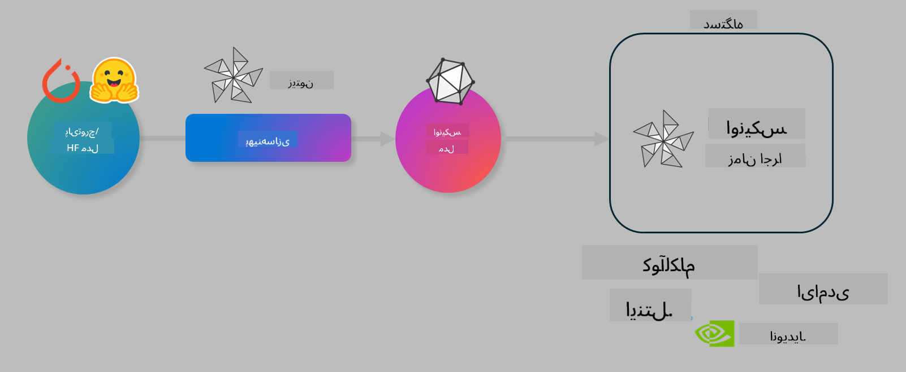

<!--
CO_OP_TRANSLATOR_METADATA:
{
  "original_hash": "6bbe47de3b974df7eea29dfeccf6032b",
  "translation_date": "2025-05-07T15:15:46+00:00",
  "source_file": "code/03.Finetuning/olive-lab/readme.md",
  "language_code": "fa"
}
-->
# آزمایشگاه بهینه‌سازی مدل‌های هوش مصنوعی برای استنتاج روی دستگاه

## مقدمه

> [!IMPORTANT]  
> این آزمایشگاه نیازمند **کارت گرافیک Nvidia A10 یا A100** به همراه درایورها و ابزار CUDA (نسخه ۱۲ به بالا) است.

> [!NOTE]  
> این آزمایشگاه **۳۵ دقیقه‌ای**، مقدمه‌ای عملی بر مفاهیم اصلی بهینه‌سازی مدل‌ها برای استنتاج روی دستگاه با استفاده از OLIVE ارائه می‌دهد.

## اهداف یادگیری

تا پایان این آزمایشگاه، قادر خواهید بود با استفاده از OLIVE:

- مدل هوش مصنوعی را با روش کم‌نمونه‌سازی AWQ کم‌نمونه‌سازی کنید.
- یک مدل هوش مصنوعی را برای یک کار خاص فاین‌تیون کنید.
- آداپتورهای LoRA (مدل فاین‌تیون‌شده) برای استنتاج بهینه روی دستگاه با ONNX Runtime تولید کنید.

### Olive چیست

Olive (*O*NNX *live*) یک جعبه‌ابزار بهینه‌سازی مدل است که با CLI همراه است و به شما امکان می‌دهد مدل‌ها را برای ONNX runtime +++https://onnxruntime.ai+++ با کیفیت و عملکرد بالا آماده کنید.



ورودی Olive معمولاً یک مدل PyTorch یا Hugging Face است و خروجی، یک مدل ONNX بهینه‌شده است که روی دستگاه (هدف استقرار) اجرا می‌شود و ONNX runtime روی آن نصب شده است. Olive مدل را برای شتاب‌دهنده هوش مصنوعی هدف استقرار (NPU، GPU، CPU) که توسط تولیدکنندگان سخت‌افزار مانند Qualcomm، AMD، Nvidia یا Intel ارائه شده بهینه می‌کند.

Olive یک *گردش‌کار* اجرا می‌کند که دنباله‌ای مرتب از وظایف بهینه‌سازی مدل به نام *پاس‌ها* است - نمونه‌ای از پاس‌ها شامل فشرده‌سازی مدل، ضبط گراف، کم‌نمونه‌سازی، بهینه‌سازی گراف است. هر پاس مجموعه‌ای از پارامترها دارد که می‌توان آن‌ها را برای دستیابی به بهترین معیارها مثل دقت و تأخیر تنظیم کرد که توسط ارزیاب مربوطه سنجیده می‌شوند. Olive از استراتژی جستجویی استفاده می‌کند که الگوریتم جستجو را به‌کار می‌گیرد تا هر پاس را به‌صورت خودکار یکی‌یکی یا به صورت مجموعه‌ای بهینه کند.

#### مزایای Olive

- **کاهش زمان و خستگی** آزمایش‌های دستی با روش‌های مختلف بهینه‌سازی گراف، فشرده‌سازی و کم‌نمونه‌سازی. معیارهای کیفیت و عملکرد خود را تعریف کنید و اجازه دهید Olive بهترین مدل را برای شما پیدا کند.  
- **بیش از ۴۰ مؤلفه بهینه‌سازی مدل داخلی** که تکنیک‌های پیشرفته در کم‌نمونه‌سازی، فشرده‌سازی، بهینه‌سازی گراف و فاین‌تیون را پوشش می‌دهند.  
- **رابط خط فرمان آسان برای استفاده** در وظایف معمول بهینه‌سازی مدل. به عنوان مثال، olive quantize، olive auto-opt، olive finetune.  
- بسته‌بندی و استقرار مدل به صورت داخلی.  
- پشتیبانی از تولید مدل برای **خدمات چندگانه LoRA**.  
- ساخت گردش‌کار با YAML/JSON برای هماهنگی وظایف بهینه‌سازی و استقرار مدل.  
- ادغام با **Hugging Face** و **Azure AI**.  
- مکانیزم **کشینگ** داخلی برای **صرفه‌جویی در هزینه‌ها**.

## دستورالعمل‌های آزمایشگاه

> [!NOTE]  
> لطفاً اطمینان حاصل کنید که Azure AI Hub و پروژه خود را فراهم کرده و محاسبات A100 خود را طبق آزمایشگاه ۱ راه‌اندازی کرده‌اید.

### گام ۰: اتصال به محاسبات Azure AI خود

شما با استفاده از قابلیت ریموت در **VS Code** به محاسبات Azure AI متصل خواهید شد.

1. برنامه دسکتاپ **VS Code** را باز کنید:  
1. با **Shift+Ctrl+P** پنل فرمان را باز کنید  
1. در پنل فرمان به دنبال **AzureML - remote: Connect to compute instance in New Window** بگردید.  
1. دستورالعمل‌های روی صفحه را برای اتصال به محاسبات دنبال کنید. این شامل انتخاب اشتراک Azure، گروه منابع، پروژه و نام محاسباتی است که در آزمایشگاه ۱ تنظیم کرده‌اید.  
1. پس از اتصال به گره محاسباتی Azure ML، این اتصال در **پایین سمت چپ ویژوال کد** نمایش داده می‌شود `><Azure ML: Compute Name`

### گام ۱: کلون کردن این مخزن

در VS Code می‌توانید با **Ctrl+J** ترمینال جدیدی باز کرده و این مخزن را کلون کنید:

در ترمینال باید پرامپت زیر را مشاهده کنید:

```
azureuser@computername:~/cloudfiles/code$ 
```  
کلون کردن راه‌حل

```bash
cd ~/localfiles
git clone https://github.com/microsoft/phi-3cookbook.git
```

### گام ۲: باز کردن پوشه در VS Code

برای باز کردن VS Code در پوشه مربوطه دستور زیر را در ترمینال اجرا کنید که یک پنجره جدید باز می‌کند:

```bash
code phi-3cookbook/code/04.Finetuning/Olive-lab
```

همچنین می‌توانید پوشه را با انتخاب **File** > **Open Folder** باز کنید.

### گام ۳: وابستگی‌ها

در VS Code در نمونه محاسبات Azure AI خود یک پنجره ترمینال باز کنید (می‌توانید از **Ctrl+J** استفاده کنید) و دستورات زیر را برای نصب وابستگی‌ها اجرا کنید:

```bash
conda create -n olive-ai python=3.11 -y
conda activate olive-ai
pip install -r requirements.txt
az extension remove -n azure-cli-ml
az extension add -n ml
```

> [!NOTE]  
> نصب همه وابستگی‌ها حدود ۵ دقیقه طول می‌کشد.

در این آزمایشگاه شما مدل‌ها را از کاتالوگ مدل Azure AI دانلود و آپلود خواهید کرد. برای دسترسی به کاتالوگ مدل باید وارد Azure شوید:

```bash
az login
```

> [!NOTE]  
> هنگام ورود، از شما خواسته می‌شود اشتراک خود را انتخاب کنید. اطمینان حاصل کنید که اشتراک مربوط به این آزمایشگاه را انتخاب کرده‌اید.

### گام ۴: اجرای دستورات Olive

در VS Code در نمونه محاسبات Azure AI خود یک ترمینال باز کنید (کلیدهای **Ctrl+J**) و مطمئن شوید که محیط `olive-ai` conda فعال است:

```bash
conda activate olive-ai
```

سپس دستورات زیر Olive را در خط فرمان اجرا کنید.

1. **بررسی داده‌ها:** در این مثال، قصد دارید مدل Phi-3.5-Mini را فاین‌تیون کنید تا در پاسخ به سوالات مرتبط با سفر تخصصی شود. کد زیر چند رکورد اول داده‌ها را که در فرمت JSON lines هستند نمایش می‌دهد:  
   
    ```bash
    head data/data_sample_travel.jsonl
    ```
2. **کم‌نمونه‌سازی مدل:** قبل از آموزش مدل، ابتدا با دستور زیر که از تکنیکی به نام Active Aware Quantization (AWQ) +++https://arxiv.org/abs/2306.00978+++ استفاده می‌کند، مدل را کم‌نمونه‌سازی می‌کنید. AWQ وزن‌های مدل را با توجه به فعال‌سازی‌های تولیدشده در زمان استنتاج کم‌نمونه‌سازی می‌کند. این یعنی فرآیند کم‌نمونه‌سازی توزیع واقعی داده‌ها در فعال‌سازی‌ها را در نظر می‌گیرد که باعث حفظ بهتر دقت مدل نسبت به روش‌های سنتی کم‌نمونه‌سازی وزن می‌شود.  
   
    ```bash
    olive quantize \
       --model_name_or_path microsoft/Phi-3.5-mini-instruct \
       --trust_remote_code \
       --algorithm awq \
       --output_path models/phi/awq \
       --log_level 1
    ```
    
    این فرآیند حدود **۸ دقیقه** طول می‌کشد و اندازه مدل را از حدود ۷.۵ گیگابایت به ۲.۵ گیگابایت کاهش می‌دهد.  
   
   در این آزمایشگاه، نحوه ورودی گرفتن مدل‌ها از Hugging Face (مثلاً `microsoft/Phi-3.5-mini-instruct`). However, Olive also allows you to input models from the Azure AI catalog by updating the `model_name_or_path` argument to an Azure AI asset ID (for example:  `azureml://registries/azureml/models/Phi-3.5-mini-instruct/versions/4`). 

1. **Train the model:** Next, the `olive finetune`) را نشان می‌دهیم که مدل کم‌نمونه‌سازی‌شده را فاین‌تیون می‌کند. کم‌نمونه‌سازی مدل *قبل از* فاین‌تیون به جای بعد از آن دقت بهتری می‌دهد چون فاین‌تیون مقداری از افت ناشی از کم‌نمونه‌سازی را جبران می‌کند.  
   
    ```bash
    olive finetune \
        --method lora \
        --model_name_or_path models/phi/awq \
        --data_files "data/data_sample_travel.jsonl" \
        --data_name "json" \
        --text_template "<|user|>\n{prompt}<|end|>\n<|assistant|>\n{response}<|end|>" \
        --max_steps 100 \
        --output_path ./models/phi/ft \
        --log_level 1
    ```
    
    فرآیند فاین‌تیون (با ۱۰۰ مرحله) حدود **۶ دقیقه** طول می‌کشد.

3. **بهینه‌سازی:** پس از آموزش مدل، اکنون مدل را با استفاده از دستور `auto-opt` command, which will capture the ONNX graph and automatically perform a number of optimizations to improve the model performance for CPU by compressing the model and doing fusions. It should be noted, that you can also optimize for other devices such as NPU or GPU by just updating the `--device` and `--provider` Olive بهینه‌سازی می‌کنید - اما برای اهداف این آزمایشگاه از CPU استفاده می‌کنیم.

    ```bash
    olive auto-opt \
       --model_name_or_path models/phi/ft/model \
       --adapter_path models/phi/ft/adapter \
       --device cpu \
       --provider CPUExecutionProvider \
       --use_ort_genai \
       --output_path models/phi/onnx-ao \
       --log_level 1
    ```
    
    بهینه‌سازی حدود **۵ دقیقه** طول می‌کشد.

### گام ۵: تست سریع استنتاج مدل

برای تست استنتاج مدل، یک فایل پایتون به نام **app.py** در پوشه خود ایجاد کنید و کد زیر را کپی و جای‌گذاری کنید:

```python
import onnxruntime_genai as og
import numpy as np

print("loading model and adapters...", end="", flush=True)
model = og.Model("models/phi/onnx-ao/model")
adapters = og.Adapters(model)
adapters.load("models/phi/onnx-ao/model/adapter_weights.onnx_adapter", "travel")
print("DONE!")

tokenizer = og.Tokenizer(model)
tokenizer_stream = tokenizer.create_stream()

params = og.GeneratorParams(model)
params.set_search_options(max_length=100, past_present_share_buffer=False)
user_input = "what is the best thing to see in chicago"
params.input_ids = tokenizer.encode(f"<|user|>\n{user_input}<|end|>\n<|assistant|>\n")

generator = og.Generator(model, params)

generator.set_active_adapter(adapters, "travel")

print(f"{user_input}")

while not generator.is_done():
    generator.compute_logits()
    generator.generate_next_token()

    new_token = generator.get_next_tokens()[0]
    print(tokenizer_stream.decode(new_token), end='', flush=True)

print("\n")
```

کد را با دستور زیر اجرا کنید:

```bash
python app.py
```

### گام ۶: آپلود مدل به Azure AI

آپلود مدل به مخزن مدل Azure AI باعث می‌شود مدل با سایر اعضای تیم توسعه به اشتراک گذاشته شود و کنترل نسخه مدل را نیز مدیریت می‌کند. برای آپلود مدل دستور زیر را اجرا کنید:

> [!NOTE]  
> مقادیر `{}` مربوط به گروه منابع و نام پروژه Azure AI را به‌روزرسانی کنید و دستور زیر را اجرا نمایید.

```
az ml workspace show
```

یا از طریق +++ai.azure.com+++ و انتخاب **management center** > **project** > **overview**

مقادیر `{}` را با نام گروه منابع و نام پروژه Azure AI خود جایگزین کنید.

```bash
az ml model create \
    --name ft-for-travel \
    --version 1 \
    --path ./models/phi/onnx-ao \
    --resource-group {RESOURCE_GROUP_NAME} \
    --workspace-name {PROJECT_NAME}
```

سپس می‌توانید مدل آپلودشده خود را مشاهده و در https://ml.azure.com/model/list مدل خود را مستقر کنید.

**سلب مسئولیت**:  
این سند با استفاده از سرویس ترجمه هوش مصنوعی [Co-op Translator](https://github.com/Azure/co-op-translator) ترجمه شده است. در حالی که ما در تلاش برای دقت هستیم، لطفاً توجه داشته باشید که ترجمه‌های خودکار ممکن است حاوی خطاها یا نواقصی باشند. سند اصلی به زبان بومی آن باید به عنوان منبع معتبر در نظر گرفته شود. برای اطلاعات حیاتی، ترجمه حرفه‌ای انسانی توصیه می‌شود. ما مسئول هیچ گونه سوءتفاهم یا برداشت نادرستی که از استفاده این ترجمه ناشی شود، نیستیم.