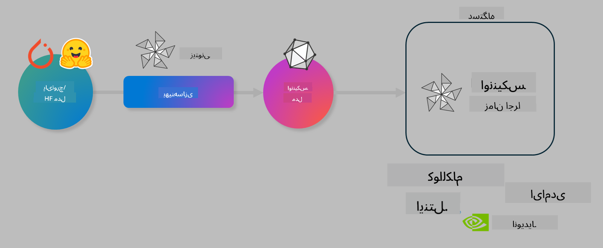

<!--
CO_OP_TRANSLATOR_METADATA:
{
  "original_hash": "6bbe47de3b974df7eea29dfeccf6032b",
  "translation_date": "2025-05-07T15:12:40+00:00",
  "source_file": "code/04.Finetuning/olive-lab/readme.md",
  "language_code": "fa"
}
-->
# آزمایشگاه بهینه‌سازی مدل‌های هوش مصنوعی برای استنتاج روی دستگاه

## مقدمه

> [!IMPORTANT]  
> این آزمایشگاه نیازمند **کارت گرافیک Nvidia A10 یا A100** به همراه درایورها و مجموعه ابزار CUDA (نسخه ۱۲ به بالا) است.

> [!NOTE]  
> این یک آزمایشگاه **۳۵ دقیقه‌ای** است که شما را به صورت عملی با مفاهیم اصلی بهینه‌سازی مدل‌ها برای استنتاج روی دستگاه با استفاده از OLIVE آشنا می‌کند.

## اهداف یادگیری

در پایان این آزمایشگاه قادر خواهید بود از OLIVE برای موارد زیر استفاده کنید:

- کمّی‌سازی مدل هوش مصنوعی با روش کمّی‌سازی AWQ.  
- تنظیم دقیق مدل هوش مصنوعی برای یک وظیفه خاص.  
- تولید آداپتورهای LoRA (مدل تنظیم‌شده) برای استنتاج کارآمد روی دستگاه با استفاده از ONNX Runtime.

### Olive چیست

Olive (*O*NNX *live*) یک مجموعه ابزار بهینه‌سازی مدل است که همراه با CLI ارائه می‌شود و به شما امکان می‌دهد مدل‌ها را برای ONNX runtime +++https://onnxruntime.ai+++ با کیفیت و کارایی ارسال کنید.



ورودی Olive معمولاً یک مدل PyTorch یا Hugging Face است و خروجی آن یک مدل ONNX بهینه‌شده است که روی دستگاه هدف (محل استقرار) با اجرای ONNX runtime اجرا می‌شود. Olive مدل را برای شتاب‌دهنده هوش مصنوعی دستگاه هدف (NPU، GPU، CPU) که توسط تولیدکننده سخت‌افزار مانند Qualcomm، AMD، Nvidia یا Intel فراهم شده، بهینه می‌کند.

Olive یک *جریان کاری* اجرا می‌کند، که دنباله‌ای مرتب از وظایف بهینه‌سازی مدل به نام *پَس‌ها* است - نمونه‌ای از پَس‌ها شامل: فشرده‌سازی مدل، ضبط گراف، کمّی‌سازی، بهینه‌سازی گراف. هر پَس مجموعه‌ای از پارامترها دارد که می‌توان آن‌ها را برای رسیدن به بهترین معیارها مانند دقت و تأخیر تنظیم کرد که توسط ارزیاب مربوطه سنجیده می‌شوند. Olive از یک استراتژی جستجو استفاده می‌کند که الگوریتمی برای تنظیم خودکار هر پَس به صورت جداگانه یا مجموعه‌ای از پَس‌ها به کار می‌برد.

#### مزایای Olive

- **کاهش ناامیدی و زمان** آزمایش‌های دستی و خطا با تکنیک‌های مختلف بهینه‌سازی گراف، فشرده‌سازی و کمّی‌سازی. محدودیت‌های کیفیت و کارایی خود را تعریف کنید و بگذارید Olive بهترین مدل را به طور خودکار پیدا کند.  
- **بیش از ۴۰ مؤلفه بهینه‌سازی مدل** داخلی که شامل تکنیک‌های پیشرفته در کمّی‌سازی، فشرده‌سازی، بهینه‌سازی گراف و تنظیم دقیق است.  
- **رابط خط فرمان آسان برای استفاده** برای وظایف معمول بهینه‌سازی مدل. به عنوان مثال، olive quantize، olive auto-opt، olive finetune.  
- بسته‌بندی و استقرار مدل به صورت داخلی.  
- پشتیبانی از تولید مدل‌ها برای **خدمات‌دهی Multi LoRA**.  
- ساخت جریان‌های کاری با استفاده از YAML/JSON برای هماهنگی وظایف بهینه‌سازی و استقرار مدل.  
- ادغام با **Hugging Face** و **Azure AI**.  
- مکانیزم **ذخیره‌سازی کش** داخلی برای **صرفه‌جویی در هزینه‌ها**.

## دستورالعمل‌های آزمایشگاه

> [!NOTE]  
> لطفاً اطمینان حاصل کنید که Azure AI Hub و پروژه خود را فراهم کرده و محاسبات A100 خود را طبق آزمایشگاه ۱ راه‌اندازی کرده‌اید.

### گام ۰: اتصال به محاسبات Azure AI

با استفاده از قابلیت ریموت در **VS Code** به محاسبات Azure AI متصل خواهید شد.

1. برنامه دسکتاپ **VS Code** خود را باز کنید:  
1. با فشردن **Shift+Ctrl+P** پنل فرمان را باز کنید.  
1. در پنل فرمان جستجو کنید برای **AzureML - remote: Connect to compute instance in New Window**.  
1. دستورالعمل‌های روی صفحه را برای اتصال به محاسبات دنبال کنید. این شامل انتخاب اشتراک Azure، گروه منابع، پروژه و نام محاسباتی است که در آزمایشگاه ۱ تنظیم کرده‌اید.  
1. پس از اتصال به گره محاسبات Azure ML، این اتصال در **پایین سمت چپ Visual Code** نمایش داده خواهد شد `><Azure ML: Compute Name`

### گام ۱: کلون کردن این مخزن

در VS Code می‌توانید با فشردن **Ctrl+J** یک ترمینال جدید باز کرده و این مخزن را کلون کنید:

در ترمینال باید پیام

```
azureuser@computername:~/cloudfiles/code$ 
```  
کلون کردن راه‌حل

```bash
cd ~/localfiles
git clone https://github.com/microsoft/phi-3cookbook.git
```

را مشاهده کنید.

### گام ۲: باز کردن پوشه در VS Code

برای باز کردن VS Code در پوشه مربوطه، فرمان زیر را در ترمینال اجرا کنید که پنجره جدیدی باز خواهد کرد:

```bash
code phi-3cookbook/code/04.Finetuning/Olive-lab
```

همچنین می‌توانید پوشه را با انتخاب **File** > **Open Folder** باز کنید.

### گام ۳: وابستگی‌ها

یک پنجره ترمینال در VS Code در نمونه محاسبات Azure AI خود باز کنید (نکته: **Ctrl+J**) و فرمان‌های زیر را برای نصب وابستگی‌ها اجرا کنید:

```bash
conda create -n olive-ai python=3.11 -y
conda activate olive-ai
pip install -r requirements.txt
az extension remove -n azure-cli-ml
az extension add -n ml
```

> [!NOTE]  
> نصب همه وابستگی‌ها حدود ۵ دقیقه طول خواهد کشید.

در این آزمایشگاه مدل‌ها را از کاتالوگ مدل Azure AI دانلود و آپلود خواهید کرد. برای دسترسی به کاتالوگ مدل، باید با استفاده از فرمان زیر وارد Azure شوید:

```bash
az login
```

> [!NOTE]  
> در زمان ورود، از شما خواسته می‌شود اشتراک خود را انتخاب کنید. مطمئن شوید که اشتراک ارائه‌شده برای این آزمایشگاه را انتخاب کرده‌اید.

### گام ۴: اجرای دستورات Olive

یک پنجره ترمینال در VS Code در نمونه محاسبات Azure AI خود باز کنید (نکته: **Ctrl+J**) و اطمینان حاصل کنید که محیط conda با نام `olive-ai` فعال است:

```bash
conda activate olive-ai
```

سپس دستورات Olive زیر را در خط فرمان اجرا کنید.

1. **بازبینی داده‌ها:** در این مثال، شما مدل Phi-3.5-Mini را برای تخصصی شدن در پاسخ به سوالات مرتبط با سفر تنظیم دقیق می‌کنید. کد زیر چند رکورد اول مجموعه داده را که در فرمت JSON lines هستند، نمایش می‌دهد:

    ```bash
    head data/data_sample_travel.jsonl
    ```  
2. **کمّی‌سازی مدل:** قبل از آموزش مدل، ابتدا آن را با فرمان زیر کمّی‌سازی می‌کنید که از تکنیکی به نام Active Aware Quantization (AWQ) +++https://arxiv.org/abs/2306.00978+++ استفاده می‌کند. AWQ وزن‌های مدل را با در نظر گرفتن فعال‌سازی‌های تولید شده در هنگام استنتاج کمّی‌سازی می‌کند. این یعنی فرآیند کمّی‌سازی توزیع داده واقعی در فعال‌سازی‌ها را در نظر می‌گیرد و باعث حفظ بهتر دقت مدل نسبت به روش‌های سنتی کمّی‌سازی وزن می‌شود.

    ```bash
    olive quantize \
       --model_name_or_path microsoft/Phi-3.5-mini-instruct \
       --trust_remote_code \
       --algorithm awq \
       --output_path models/phi/awq \
       --log_level 1
    ```

    این فرآیند حدود **۸ دقیقه** طول می‌کشد و اندازه مدل را از حدود ۷.۵ گیگابایت به حدود ۲.۵ گیگابایت کاهش می‌دهد.

   در این آزمایشگاه، نحوه ورودی گرفتن مدل‌ها از Hugging Face (مثلاً: `microsoft/Phi-3.5-mini-instruct`). However, Olive also allows you to input models from the Azure AI catalog by updating the `model_name_or_path` argument to an Azure AI asset ID (for example:  `azureml://registries/azureml/models/Phi-3.5-mini-instruct/versions/4`). 

1. **Train the model:** Next, the `olive finetune` فرمان مدل کمّی‌شده را تنظیم دقیق می‌کند. کمّی‌سازی مدل *قبل* از تنظیم دقیق به جای بعد از آن دقت بهتری می‌دهد چون فرآیند تنظیم دقیق بخشی از افت دقت ناشی از کمّی‌سازی را جبران می‌کند.

    ```bash
    olive finetune \
        --method lora \
        --model_name_or_path models/phi/awq \
        --data_files "data/data_sample_travel.jsonl" \
        --data_name "json" \
        --text_template "<|user|>\n{prompt}<|end|>\n<|assistant|>\n{response}<|end|>" \
        --max_steps 100 \
        --output_path ./models/phi/ft \
        --log_level 1
    ```

    تنظیم دقیق (با ۱۰۰ مرحله) حدود **۶ دقیقه** طول می‌کشد.

3. **بهینه‌سازی:** پس از آموزش مدل، اکنون مدل را با استفاده از آرگومان‌های `auto-opt` command, which will capture the ONNX graph and automatically perform a number of optimizations to improve the model performance for CPU by compressing the model and doing fusions. It should be noted, that you can also optimize for other devices such as NPU or GPU by just updating the `--device` and `--provider` در Olive بهینه‌سازی می‌کنید - اما برای اهداف این آزمایشگاه از CPU استفاده خواهیم کرد.

    ```bash
    olive auto-opt \
       --model_name_or_path models/phi/ft/model \
       --adapter_path models/phi/ft/adapter \
       --device cpu \
       --provider CPUExecutionProvider \
       --use_ort_genai \
       --output_path models/phi/onnx-ao \
       --log_level 1
    ```

    بهینه‌سازی حدود **۵ دقیقه** طول می‌کشد.

### گام ۵: تست سریع استنتاج مدل

برای تست استنتاج مدل، یک فایل پایتون به نام **app.py** در پوشه خود ایجاد کرده و کد زیر را کپی و جای‌گذاری کنید:

```python
import onnxruntime_genai as og
import numpy as np

print("loading model and adapters...", end="", flush=True)
model = og.Model("models/phi/onnx-ao/model")
adapters = og.Adapters(model)
adapters.load("models/phi/onnx-ao/model/adapter_weights.onnx_adapter", "travel")
print("DONE!")

tokenizer = og.Tokenizer(model)
tokenizer_stream = tokenizer.create_stream()

params = og.GeneratorParams(model)
params.set_search_options(max_length=100, past_present_share_buffer=False)
user_input = "what is the best thing to see in chicago"
params.input_ids = tokenizer.encode(f"<|user|>\n{user_input}<|end|>\n<|assistant|>\n")

generator = og.Generator(model, params)

generator.set_active_adapter(adapters, "travel")

print(f"{user_input}")

while not generator.is_done():
    generator.compute_logits()
    generator.generate_next_token()

    new_token = generator.get_next_tokens()[0]
    print(tokenizer_stream.decode(new_token), end='', flush=True)

print("\n")
```

کد را با دستور زیر اجرا کنید:

```bash
python app.py
```

### گام ۶: آپلود مدل به Azure AI

آپلود مدل به مخزن مدل Azure AI باعث می‌شود مدل برای سایر اعضای تیم توسعه شما قابل اشتراک باشد و همچنین کنترل نسخه مدل را مدیریت کند. برای آپلود مدل، فرمان زیر را اجرا کنید:

> [!NOTE]  
> مقدار `{}` را در `resourceGroup` و نام پروژه Azure AI به‌روزرسانی کنید و فرمان زیر را اجرا کنید:

```
az ml workspace show
```

یا از طریق +++ai.azure.com+++ به بخش **management center** > **project** > **overview** بروید.

مقادیر `{}` را با نام گروه منابع و نام پروژه Azure AI خود جایگزین کنید.

```bash
az ml model create \
    --name ft-for-travel \
    --version 1 \
    --path ./models/phi/onnx-ao \
    --resource-group {RESOURCE_GROUP_NAME} \
    --workspace-name {PROJECT_NAME}
```  
سپس می‌توانید مدل آپلود شده خود را مشاهده کرده و مدل خود را در https://ml.azure.com/model/list مستقر کنید.

**سلب مسئولیت**:  
این سند با استفاده از سرویس ترجمه هوش مصنوعی [Co-op Translator](https://github.com/Azure/co-op-translator) ترجمه شده است. در حالی که ما در تلاش برای دقت هستیم، لطفاً توجه داشته باشید که ترجمه‌های خودکار ممکن است حاوی خطاها یا نواقصی باشند. سند اصلی به زبان بومی خود باید به عنوان منبع معتبر در نظر گرفته شود. برای اطلاعات حیاتی، ترجمه حرفه‌ای انسانی توصیه می‌شود. ما مسئول هیچ گونه سوء تفاهم یا تفسیر نادرستی که از استفاده این ترجمه ناشی شود، نیستیم.