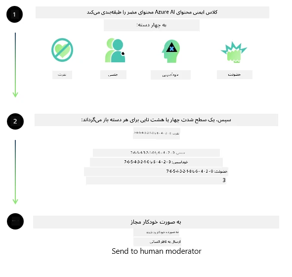

<!--
CO_OP_TRANSLATOR_METADATA:
{
  "original_hash": "839ccc4b3886ef10cfd4e64977f5792d",
  "translation_date": "2026-01-05T17:02:29+00:00",
  "source_file": "md/01.Introduction/01/01.AISafety.md",
  "language_code": "fa"
}
-->
# ایمنی هوش مصنوعی برای مدل‌های فی  
خانواده مدل‌های فی بر اساس [استاندارد هوش مصنوعی مسئول مایکروسافت](https://www.microsoft.com/ai/principles-and-approach#responsible-ai-standard) توسعه یافته‌اند، که مجموعه‌ای از الزامات سرتاسری شرکت است بر پایه شش اصل زیر: پاسخگویی، شفافیت، انصاف، قابلیت اطمینان و ایمنی، حریم خصوصی و امنیت، و فراگیری که [اصول هوش مصنوعی مسئول مایکروسافت](https://www.microsoft.com/ai/responsible-ai) را تشکیل می‌دهند.

مانند مدل‌های قبلی فی، ارزیابی ایمنی چندجانبه و رویکرد پس از آموزش ایمنی اتخاذ شده است، با تدابیر اضافی برای در نظر گرفتن قابلیت‌های چندزبانه این نسخه. رویکرد ما به آموزش و ارزیابی ایمنی شامل آزمایش در چند زبان و دسته‌های مختلف ریسک در [مقاله پس از آموزش ایمنی فی](https://arxiv.org/abs/2407.13833) شرح داده شده است. در حالی که مدل‌های فی از این رویکرد بهره‌مند می‌شوند، توسعه‌دهندگان باید بهترین شیوه‌های هوش مصنوعی مسئول را به کار گیرند، از جمله نقشه‌برداری، اندازه‌گیری و کاهش ریسک‌های مرتبط با مورد استفاده خاص خود و زمینه فرهنگی و زبانی.

## بهترین شیوه‌ها

مانند سایر مدل‌ها، خانواده مدل‌های فی می‌توانند به شیوه‌هایی رفتار کنند که ناعادلانه، غیرقابل اطمینان یا توهین‌آمیز باشد.

برخی از رفتارهای محدود کننده SLM و LLM که باید از آنها آگاه باشید عبارتند از:

- **کیفیت خدمات:** مدل‌های فی عمدتاً روی متن انگلیسی آموزش داده شده‌اند. سایر زبان‌ها عملکرد ضعیف‌تری خواهند داشت. گونه‌های زبان انگلیسی که کمتر در داده‌های آموزشی نمایندگی دارند ممکن است عملکرد ضعیف‌تری نسبت به انگلیسی آمریکایی استاندارد داشته باشند.
- **نمایش آسیب‌ها و تداوم کلیشه‌ها:** این مدل‌ها ممکن است گروه‌های مردم را بیش از حد یا کمتر از حد نمایندگی کنند، نمایندگی برخی گروه‌ها را محو کنند یا کلیشه‌های تحقیرآمیز یا منفی را تقویت کنند. علیرغم آموزش پس از ایمنی، این محدودیت‌ها ممکن است به دلیل سطوح متفاوت نمایندگی گروه‌های مختلف یا فراوانی نمونه‌های کلیشه‌های منفی در داده‌های آموزشی که الگوهای دنیای واقعی و تعصبات اجتماعی را منعکس می‌کند، همچنان وجود داشته باشد.
- **محتوای نامناسب یا توهین‌آمیز:** این مدل‌ها ممکن است انواع دیگری از محتوای نامناسب یا توهین‌آمیز تولید کنند، که ممکن است باعث شود برای استفاده در زمینه‌های حساس بدون تدابیر اضافی خاص آن مورد استفاده قرار نگیرند.
- **قابلیت اطمینان اطلاعات:** مدل‌های زبان می‌توانند محتوای بی‌معنی تولید کنند یا محتوایی ساخته‌شده تولید کنند که ممکن است منطقی به نظر برسد ولی نادرست یا قدیمی باشد.
- **دامنه محدود برای کد:** بیشتر داده‌های آموزشی Phi-3 بر پایه پایتون است و از بسته‌های رایجی مانند "typing, math, random, collections, datetime, itertools" استفاده می‌کند. اگر مدل اسکریپت‌های پایتون تولید کند که از بسته‌های دیگر یا اسکریپت‌هایی در زبان‌های دیگر استفاده می‌کند، به شدت توصیه می‌کنیم کاربران تمامی استفاده‌های API را به صورت دستی بررسی کنند.

توسعه‌دهندگان باید بهترین شیوه‌های هوش مصنوعی مسئول را به کار گیرند و مسئول اطمینان از انطباق مورد استفاده خاص با قوانین و مقررات مربوطه (مثلاً حریم خصوصی، تجارت و غیره) هستند.

## ملاحظات هوش مصنوعی مسئول

مانند سایر مدل‌های زبان، مدل‌های سری فی می‌توانند به شیوه‌هایی رفتار کنند که ناعادلانه، غیرقابل اطمینان یا توهین‌آمیز باشند. برخی از رفتارهای محدودکننده که باید در نظر داشت عبارتند از:

**کیفیت خدمات:** مدل‌های فی عمدتاً روی متن انگلیسی آموزش داده شده‌اند. سایر زبان‌ها عملکرد ضعیف‌تری خواهند داشت. گونه‌های زبان انگلیسی که کمتر در داده‌های آموزشی نمایندگی دارند ممکن است عملکرد ضعیف‌تری نسبت به انگلیسی آمریکایی استاندارد داشته باشند.

**نمایش آسیب‌ها و تداوم کلیشه‌ها:** این مدل‌ها ممکن است گروه‌های مردم را بیش از حد یا کمتر از حد نمایندگی کنند، نمایندگی برخی گروه‌ها را محو کنند یا کلیشه‌های تحقیرآمیز یا منفی را تقویت کنند. علیرغم آموزش پس از ایمنی، این محدودیت‌ها ممکن است به دلیل سطوح متفاوت نمایندگی گروه‌های مختلف یا فراوانی نمونه‌های کلیشه‌های منفی در داده‌های آموزشی که الگوهای دنیای واقعی و تعصبات اجتماعی را منعکس می‌کند، همچنان وجود داشته باشد.

**محتوای نامناسب یا توهین‌آمیز:** این مدل‌ها ممکن است انواع دیگری از محتوای نامناسب یا توهین‌آمیز تولید کنند، که ممکن است باعث شود برای استفاده در زمینه‌های حساس بدون تدابیر اضافی خاص آن مورد استفاده قرار نگیرند.  
**قابلیت اطمینان اطلاعات:** مدل‌های زبان می‌توانند محتوای بی‌معنی تولید کنند یا محتوایی ساخته‌شده تولید کنند که ممکن است منطقی به نظر برسد ولی نادرست یا قدیمی باشد.

**دامنه محدود برای کد:** بیشتر داده‌های آموزشی Phi-3 بر پایه پایتون است و از بسته‌های رایجی مانند "typing, math, random, collections, datetime, itertools" استفاده می‌کند. اگر مدل اسکریپت‌های پایتون تولید کند که از بسته‌های دیگر یا اسکریپت‌هایی در زبان‌های دیگر استفاده می‌کند، به شدت توصیه می‌کنیم کاربران تمامی استفاده‌های API را به صورت دستی بررسی کنند.

توسعه‌دهندگان باید بهترین شیوه‌های هوش مصنوعی مسئول را به کار گیرند و مسئول اطمینان از انطباق مورد استفاده خاص با قوانین و مقررات مربوطه (مثلاً حریم خصوصی، تجارت و غیره) هستند. حوزه‌های مهم برای توجه شامل:

**تخصیص:** مدل‌ها ممکن است برای سناریوهایی که می‌تواند تأثیر قابل توجهی بر وضعیت قانونی یا تخصیص منابع یا فرصت‌های زندگی داشته باشد (مثلاً مسکن، اشتغال، اعتبار و غیره) بدون ارزیابی‌های بیشتر و تکنیک‌های کاهش سوگیری اضافی مناسب نباشند.

**سناریوهای پرخطر:** توسعه‌دهندگان باید مناسب بودن استفاده از مدل‌ها در سناریوهای پرخطر را ارزیابی کنند، جایی که خروجی‌های ناعادلانه، غیرقابل اطمینان یا توهین‌آمیز می‌تواند بسیار هزینه‌بر یا مضر باشد. این شامل ارائه مشاوره در حوزه‌های حساس یا تخصصی است که دقت و قابلیت اطمینان بسیار مهم است (مثلاً مشاوره حقوقی یا پزشکی). اقدامات ایمنی اضافی باید در سطح برنامه مطابق با زمینه استقرار پیاده‌سازی شود.

**اطلاعات نادرست:** مدل‌ها ممکن است اطلاعات نادرست تولید کنند. توسعه‌دهندگان باید بهترین شیوه‌های شفافیت را رعایت کنند و به کاربران نهایی اطلاع دهند که با یک سیستم هوش مصنوعی تعامل دارند. در سطح برنامه، توسعه‌دهندگان می‌توانند مکانیزم‌های بازخورد و خطوط لوله بسازند تا پاسخ‌ها را بر اساس اطلاعات زمینه‌ای و مورد استفاده خاص، تکنیکی که به نام بازیابی افزوده نسل (RAG) شناخته می‌شود، مستند کنند.

**تولید محتوای مضر:** توسعه‌دهندگان باید خروجی‌ها را با توجه به زمینه بررسی کنند و از طبقه‌بندهای ایمنی موجود یا راه‌حل‌های سفارشی مناسب مورد استفاده خود بهره ببرند.

**سوءاستفاده:** ممکن است سوءاستفاده‌های دیگری مانند تقلب، هرزنامه یا تولید بدافزار امکان‌پذیر باشد، و توسعه‌دهندگان باید اطمینان حاصل کنند که برنامه‌های آنها قوانین و مقررات مربوطه را نقض نمی‌کند.

### آموزش مجدد و ایمنی محتوای هوش مصنوعی  

پس از آموزش مجدد مدل، به شدت توصیه می‌کنیم از اقدامات [Azure AI Content Safety](https://learn.microsoft.com/azure/ai-services/content-safety/overview) برای نظارت بر محتوای تولید شده توسط مدل‌ها، شناسایی و مسدود کردن ریسک‌ها، تهدیدها و مسائل کیفیت استفاده کنید.

[Azure AI Content Safety](https://learn.microsoft.com/azure/ai-services/content-safety/overview) از محتوای متنی و تصویری پشتیبانی می‌کند. این سرویس می‌تواند در فضای ابری، کانتینرهای جداشده و دستگاه‌های لبه/ جاسازی شده مستقر شود.

## مرور کلی Azure AI Content Safety

Azure AI Content Safety یک راه‌حل یکسان برای همه نیست؛ بلکه می‌توان آن را برای تطابق با سیاست‌های خاص کسب‌وکارها سفارشی کرد. علاوه بر این، مدل‌های چندزبانه آن امکان فهم چند زبان را به صورت همزمان فراهم می‌آورند.

- **Azure AI Content Safety**  
- **Microsoft Developer**  
- **5 ویدئو**

سرویس Azure AI Content Safety محتوای مضر تولید شده توسط کاربر و هوش مصنوعی را در برنامه‌ها و خدمات تشخیص می‌دهد. این سرویس شامل APIهای متن و تصویر است که به شما امکان تشخیص محتوای مضر یا نامناسب را می‌دهد.

[لیست پخش AI Content Safety](https://www.youtube.com/playlist?list=PLlrxD0HtieHjaQ9bJjyp1T7FeCbmVcPkQ)

---

<!-- CO-OP TRANSLATOR DISCLAIMER START -->
**سلب مسئولیت**:  
این سند با استفاده از سرویس ترجمه هوش مصنوعی [Co-op Translator](https://github.com/Azure/co-op-translator) ترجمه شده است. هرچند ما در تلاش برای دقت هستیم، لطفاً توجه داشته باشید که ترجمه‌های خودکار ممکن است حاوی خطاها یا نواقصی باشند. سند اصلی به زبان مادری آن باید به عنوان منبع معتبر در نظر گرفته شود. برای اطلاعات حیاتی، ترجمه حرفه‌ای انسانی توصیه می‌شود. ما در قبال هرگونه سوءتفاهم یا تعبیر نادرست ناشی از استفاده از این ترجمه مسئولیتی نداریم.
<!-- CO-OP TRANSLATOR DISCLAIMER END -->