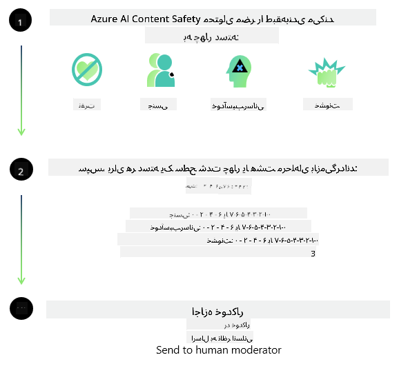
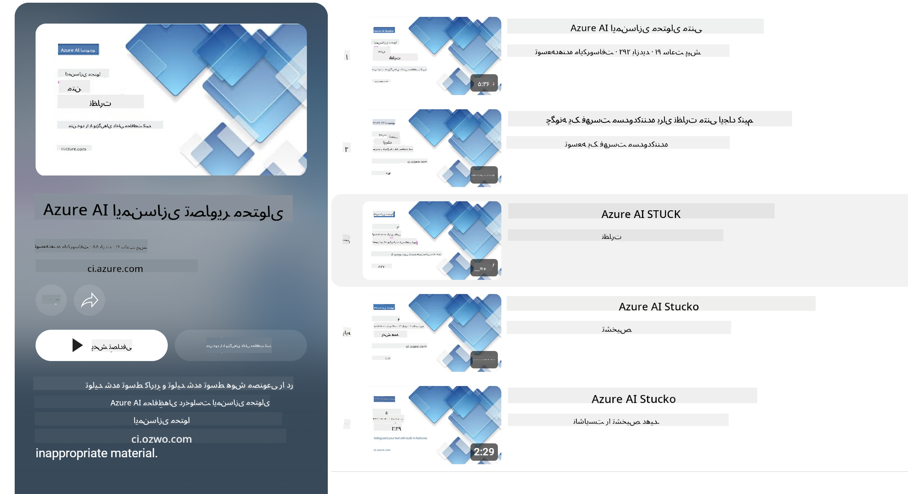

<!--
CO_OP_TRANSLATOR_METADATA:
{
  "original_hash": "c8273672cc57df2be675407a1383aaf0",
  "translation_date": "2025-05-07T14:54:13+00:00",
  "source_file": "md/01.Introduction/01/01.AISafety.md",
  "language_code": "fa"
}
-->
# ایمنی هوش مصنوعی برای مدل‌های Phi  
خانواده مدل‌های Phi مطابق با [استاندارد هوش مصنوعی مسئول مایکروسافت](https://query.prod.cms.rt.microsoft.com/cms/api/am/binary/RE5cmFl) توسعه یافته‌اند، که مجموعه‌ای از الزامات سرتاسری شرکت است و بر اساس شش اصل زیر استوار است: پاسخگویی، شفافیت، عدالت، قابلیت اطمینان و ایمنی، حریم خصوصی و امنیت، و فراگیری که اصول [هوش مصنوعی مسئول مایکروسافت](https://www.microsoft.com/ai/responsible-ai) را شکل می‌دهند.

مانند مدل‌های قبلی Phi، ارزیابی ایمنی چندوجهی و رویکرد پس از آموزش ایمنی اتخاذ شده است و تدابیر اضافی برای در نظر گرفتن قابلیت‌های چندزبانه این نسخه در نظر گرفته شده است. رویکرد ما برای آموزش و ارزیابی ایمنی، شامل آزمایش در چند زبان و دسته‌بندی‌های ریسک، در [مقاله پس از آموزش ایمنی Phi](https://arxiv.org/abs/2407.13833) شرح داده شده است. اگرچه مدل‌های Phi از این رویکرد بهره می‌برند، توسعه‌دهندگان باید بهترین شیوه‌های هوش مصنوعی مسئول را اعمال کنند، از جمله نقشه‌برداری، اندازه‌گیری و کاهش ریسک‌های مرتبط با مورد استفاده خاص و زمینه فرهنگی و زبانی خود.

## بهترین شیوه‌ها

مانند سایر مدل‌ها، خانواده مدل‌های Phi ممکن است رفتارهایی از خود نشان دهند که ناعادلانه، غیرقابل اعتماد یا توهین‌آمیز باشد.

برخی از رفتارهای محدودکننده SLM و LLM که باید به آن‌ها توجه داشته باشید عبارتند از:

- **کیفیت خدمات:** مدل‌های Phi عمدتاً روی متن‌های انگلیسی آموزش دیده‌اند. زبان‌های غیرانگلیسی عملکرد ضعیف‌تری خواهند داشت. گونه‌های زبان انگلیسی که نمایندگی کمتری در داده‌های آموزشی دارند ممکن است عملکرد بدتری نسبت به انگلیسی آمریکایی استاندارد داشته باشند.
- **نمایش آسیب‌ها و تداوم کلیشه‌ها:** این مدل‌ها ممکن است گروه‌های خاصی از مردم را بیش از حد یا کمتر از حد نشان دهند، نمایندگی برخی گروه‌ها را حذف کنند، یا کلیشه‌های تحقیرآمیز یا منفی را تقویت کنند. علی‌رغم آموزش پس از ایمنی، این محدودیت‌ها ممکن است همچنان وجود داشته باشند به دلیل سطوح متفاوت نمایندگی گروه‌های مختلف یا فراوانی نمونه‌های کلیشه‌های منفی در داده‌های آموزشی که الگوهای دنیای واقعی و تعصبات اجتماعی را منعکس می‌کند.
- **محتوای نامناسب یا توهین‌آمیز:** این مدل‌ها ممکن است انواع دیگری از محتوای نامناسب یا توهین‌آمیز تولید کنند که ممکن است باعث شود استفاده از آن‌ها در زمینه‌های حساس بدون تدابیر اضافی خاص مورد استفاده نامناسب باشد.
- **قابلیت اطمینان اطلاعات:** مدل‌های زبانی ممکن است محتوای بی‌معنی تولید کنند یا محتوایی بسازند که منطقی به نظر برسد اما نادرست یا قدیمی باشد.
- **دامنه محدود برای کد:** بیشتر داده‌های آموزشی Phi-3 بر پایه پایتون است و از بسته‌های رایجی مانند "typing, math, random, collections, datetime, itertools" استفاده می‌کند. اگر مدل اسکریپت‌های پایتونی تولید کند که از بسته‌ها یا اسکریپت‌های زبان‌های دیگر استفاده می‌کنند، به شدت توصیه می‌کنیم کاربران تمام استفاده‌های API را به صورت دستی بررسی کنند.

توسعه‌دهندگان باید بهترین شیوه‌های هوش مصنوعی مسئول را اعمال کنند و مسئولیت اطمینان از تطابق مورد استفاده خاص با قوانین و مقررات مربوطه (مانند حریم خصوصی، تجارت و غیره) را بر عهده دارند.

## ملاحظات هوش مصنوعی مسئول

مانند سایر مدل‌های زبانی، مدل‌های سری Phi ممکن است رفتارهایی ناعادلانه، غیرقابل اعتماد یا توهین‌آمیز از خود نشان دهند. برخی از رفتارهای محدودکننده که باید به آن‌ها توجه داشت عبارتند از:

**کیفیت خدمات:** مدل‌های Phi عمدتاً روی متن‌های انگلیسی آموزش دیده‌اند. زبان‌های غیرانگلیسی عملکرد ضعیف‌تری خواهند داشت. گونه‌های زبان انگلیسی که نمایندگی کمتری در داده‌های آموزشی دارند ممکن است عملکرد بدتری نسبت به انگلیسی آمریکایی استاندارد داشته باشند.

**نمایش آسیب‌ها و تداوم کلیشه‌ها:** این مدل‌ها ممکن است گروه‌های خاصی از مردم را بیش از حد یا کمتر از حد نشان دهند، نمایندگی برخی گروه‌ها را حذف کنند، یا کلیشه‌های تحقیرآمیز یا منفی را تقویت کنند. علی‌رغم آموزش پس از ایمنی، این محدودیت‌ها ممکن است همچنان وجود داشته باشند به دلیل سطوح متفاوت نمایندگی گروه‌های مختلف یا فراوانی نمونه‌های کلیشه‌های منفی در داده‌های آموزشی که الگوهای دنیای واقعی و تعصبات اجتماعی را منعکس می‌کند.

**محتوای نامناسب یا توهین‌آمیز:** این مدل‌ها ممکن است انواع دیگری از محتوای نامناسب یا توهین‌آمیز تولید کنند که ممکن است باعث شود استفاده از آن‌ها در زمینه‌های حساس بدون تدابیر اضافی خاص مورد استفاده نامناسب باشد.  
**قابلیت اطمینان اطلاعات:** مدل‌های زبانی ممکن است محتوای بی‌معنی تولید کنند یا محتوایی بسازند که منطقی به نظر برسد اما نادرست یا قدیمی باشد.

**دامنه محدود برای کد:** بیشتر داده‌های آموزشی Phi-3 بر پایه پایتون است و از بسته‌های رایجی مانند "typing, math, random, collections, datetime, itertools" استفاده می‌کند. اگر مدل اسکریپت‌های پایتونی تولید کند که از بسته‌ها یا اسکریپت‌های زبان‌های دیگر استفاده می‌کنند، به شدت توصیه می‌کنیم کاربران تمام استفاده‌های API را به صورت دستی بررسی کنند.

توسعه‌دهندگان باید بهترین شیوه‌های هوش مصنوعی مسئول را اعمال کنند و مسئولیت اطمینان از تطابق مورد استفاده خاص با قوانین و مقررات مربوطه (مانند حریم خصوصی، تجارت و غیره) را بر عهده دارند. حوزه‌های مهم برای ملاحظه شامل موارد زیر است:

**اختصاص:** مدل‌ها ممکن است برای سناریوهایی که می‌تواند تأثیر قابل توجهی بر وضعیت حقوقی یا تخصیص منابع یا فرصت‌های زندگی (مثلاً مسکن، اشتغال، اعتبار و غیره) داشته باشد، بدون ارزیابی‌های بیشتر و تکنیک‌های اضافی کاهش سوگیری مناسب نباشند.

**سناریوهای پرخطر:** توسعه‌دهندگان باید مناسب بودن استفاده از مدل‌ها در سناریوهای پرخطر را ارزیابی کنند، جایی که خروجی‌های ناعادلانه، غیرقابل اعتماد یا توهین‌آمیز می‌تواند بسیار پرهزینه باشد یا منجر به آسیب شود. این شامل ارائه مشاوره در حوزه‌های حساس یا تخصصی است که دقت و قابلیت اطمینان حیاتی است (مثلاً مشاوره حقوقی یا سلامت). باید در سطح برنامه تدابیر حفاظتی اضافی بر اساس زمینه استقرار اعمال شود.

**اطلاعات نادرست:** مدل‌ها ممکن است اطلاعات نادرست تولید کنند. توسعه‌دهندگان باید بهترین شیوه‌های شفافیت را دنبال کنند و به کاربران نهایی اطلاع دهند که با یک سیستم هوش مصنوعی تعامل دارند. در سطح برنامه، توسعه‌دهندگان می‌توانند مکانیزم‌های بازخورد و خطوط لوله‌ای برای پایه‌گذاری پاسخ‌ها بر اطلاعات زمینه‌ای و مورد استفاده خاص بسازند، تکنیکی که به آن تولید افزوده با بازیابی (RAG) گفته می‌شود.

**تولید محتوای آسیب‌زا:** توسعه‌دهندگان باید خروجی‌ها را با توجه به زمینه آن‌ها ارزیابی کنند و از طبقه‌بندهای ایمنی موجود یا راه‌حل‌های سفارشی متناسب با مورد استفاده خود بهره ببرند.

**سوءاستفاده:** سایر اشکال سوءاستفاده مانند کلاهبرداری، هرزنامه یا تولید بدافزار ممکن است ممکن باشد و توسعه‌دهندگان باید اطمینان حاصل کنند که برنامه‌های آن‌ها قوانین و مقررات قابل اجرا را نقض نمی‌کند.

### آموزش دقیق و ایمنی محتوای هوش مصنوعی

پس از آموزش دقیق یک مدل، به شدت توصیه می‌کنیم از تدابیر [Azure AI Content Safety](https://learn.microsoft.com/azure/ai-services/content-safety/overview) برای نظارت بر محتوای تولید شده توسط مدل‌ها استفاده کنید، خطرات، تهدیدات و مشکلات کیفیت احتمالی را شناسایی و مسدود کنید.

[Azure AI Content Safety](https://learn.microsoft.com/azure/ai-services/content-safety/overview) از محتوای متنی و تصویری پشتیبانی می‌کند. می‌تواند در فضای ابری، کانتینرهای جداشده و دستگاه‌های لبه/جاسازی شده مستقر شود.

## مرور کلی بر Azure AI Content Safety

Azure AI Content Safety یک راه‌حل یکسان برای همه نیست؛ می‌توان آن را متناسب با سیاست‌های خاص کسب‌وکارها سفارشی کرد. علاوه بر این، مدل‌های چندزبانه آن امکان درک همزمان چند زبان را فراهم می‌کنند.

- **Azure AI Content Safety**  
- **Microsoft Developer**  
- **5 ویدیو**

سرویس Azure AI Content Safety محتوای مضر تولید شده توسط کاربران و هوش مصنوعی را در برنامه‌ها و خدمات شناسایی می‌کند. این سرویس شامل APIهای متن و تصویر است که به شما امکان می‌دهد مواد مضر یا نامناسب را شناسایی کنید.

[لیست پخش AI Content Safety](https://www.youtube.com/playlist?list=PLlrxD0HtieHjaQ9bJjyp1T7FeCbmVcPkQ)

**سلب مسئولیت**:  
این سند با استفاده از سرویس ترجمه هوش مصنوعی [Co-op Translator](https://github.com/Azure/co-op-translator) ترجمه شده است. در حالی که ما برای دقت تلاش می‌کنیم، لطفاً توجه داشته باشید که ترجمه‌های خودکار ممکن است حاوی اشتباهات یا نواقصی باشند. سند اصلی به زبان اصلی خود باید به عنوان منبع معتبر در نظر گرفته شود. برای اطلاعات حیاتی، ترجمه حرفه‌ای انسانی توصیه می‌شود. ما مسئول هیچ گونه سوء تفاهم یا تفسیر نادرستی که از استفاده این ترجمه ناشی شود، نیستیم.