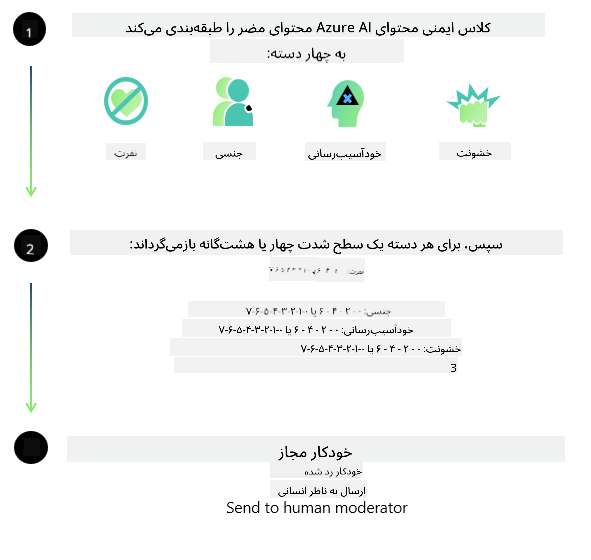

<!--
CO_OP_TRANSLATOR_METADATA:
{
  "original_hash": "c8273672cc57df2be675407a1383aaf0",
  "translation_date": "2025-07-16T17:42:43+00:00",
  "source_file": "md/01.Introduction/01/01.AISafety.md",
  "language_code": "fa"
}
-->
# ایمنی هوش مصنوعی برای مدل‌های Phi  
خانواده مدل‌های Phi بر اساس [استاندارد هوش مصنوعی مسئول مایکروسافت](https://query.prod.cms.rt.microsoft.com/cms/api/am/binary/RE5cmFl) توسعه یافته‌اند، که مجموعه‌ای از الزامات شرکت‌محور است و بر شش اصل زیر استوار است: پاسخگویی، شفافیت، عدالت، قابلیت اطمینان و ایمنی، حریم خصوصی و امنیت، و فراگیری که اصول [هوش مصنوعی مسئول مایکروسافت](https://www.microsoft.com/ai/responsible-ai) را تشکیل می‌دهند.

مانند مدل‌های قبلی Phi، رویکردی چندجانبه برای ارزیابی ایمنی و آموزش پس از آموزش ایمنی اتخاذ شده است، با اقدامات اضافی برای در نظر گرفتن قابلیت‌های چندزبانه این نسخه. رویکرد ما در آموزش و ارزیابی ایمنی، شامل آزمایش در چند زبان و دسته‌بندی‌های ریسک، در [مقاله آموزش پس از ایمنی Phi](https://arxiv.org/abs/2407.13833) تشریح شده است. در حالی که مدل‌های Phi از این رویکرد بهره‌مند می‌شوند، توسعه‌دهندگان باید بهترین شیوه‌های هوش مصنوعی مسئول را به کار گیرند، از جمله شناسایی، اندازه‌گیری و کاهش ریسک‌های مرتبط با مورد استفاده خاص و زمینه فرهنگی و زبانی خود.

## بهترین شیوه‌ها  

مانند سایر مدل‌ها، خانواده مدل‌های Phi ممکن است رفتارهایی داشته باشند که ناعادلانه، غیرقابل اعتماد یا توهین‌آمیز باشند.

برخی از رفتارهای محدودکننده SLM و LLM که باید از آن‌ها آگاه باشید عبارتند از:

- **کیفیت خدمات:** مدل‌های Phi عمدتاً بر روی متن‌های انگلیسی آموزش دیده‌اند. زبان‌های غیرانگلیسی عملکرد ضعیف‌تری خواهند داشت. گونه‌های زبان انگلیسی که در داده‌های آموزشی کمتر نمایندگی شده‌اند ممکن است عملکرد ضعیف‌تری نسبت به انگلیسی آمریکایی استاندارد داشته باشند.
- **نمایش آسیب‌ها و تداوم کلیشه‌ها:** این مدل‌ها ممکن است گروه‌های خاصی از مردم را بیش از حد یا کمتر از حد نمایندگی کنند، نمایندگی برخی گروه‌ها را حذف کنند یا کلیشه‌های تحقیرآمیز یا منفی را تقویت کنند. با وجود آموزش پس از ایمنی، این محدودیت‌ها ممکن است به دلیل سطوح متفاوت نمایندگی گروه‌های مختلف یا فراوانی نمونه‌های کلیشه‌های منفی در داده‌های آموزشی که الگوهای واقعی و تعصبات اجتماعی را منعکس می‌کنند، همچنان وجود داشته باشند.
- **محتوای نامناسب یا توهین‌آمیز:** این مدل‌ها ممکن است انواع دیگری از محتوای نامناسب یا توهین‌آمیز تولید کنند که ممکن است بدون تدابیر اضافی خاص مورد استفاده، برای زمینه‌های حساس نامناسب باشد.
- **قابلیت اطمینان اطلاعات:** مدل‌های زبانی ممکن است محتوای بی‌معنی تولید کنند یا محتوایی بسازند که به نظر منطقی می‌رسد اما نادرست یا قدیمی است.
- **دامنه محدود برای کد:** بیشتر داده‌های آموزشی Phi-3 بر پایه پایتون است و از بسته‌های رایجی مانند "typing, math, random, collections, datetime, itertools" استفاده می‌کند. اگر مدل اسکریپت‌های پایتونی تولید کند که از بسته‌های دیگر یا اسکریپت‌هایی به زبان‌های دیگر استفاده می‌کنند، به شدت توصیه می‌کنیم کاربران تمام استفاده‌های API را به صورت دستی بررسی کنند.

توسعه‌دهندگان باید بهترین شیوه‌های هوش مصنوعی مسئول را به کار گیرند و مسئول اطمینان از تطابق مورد استفاده خاص با قوانین و مقررات مربوطه (مانند حریم خصوصی، تجارت و غیره) هستند.

## ملاحظات هوش مصنوعی مسئول  

مانند سایر مدل‌های زبانی، مدل‌های سری Phi ممکن است رفتارهایی داشته باشند که ناعادلانه، غیرقابل اعتماد یا توهین‌آمیز باشند. برخی از رفتارهای محدودکننده که باید به آن‌ها توجه داشت عبارتند از:

**کیفیت خدمات:** مدل‌های Phi عمدتاً بر روی متن‌های انگلیسی آموزش دیده‌اند. زبان‌های غیرانگلیسی عملکرد ضعیف‌تری خواهند داشت. گونه‌های زبان انگلیسی که در داده‌های آموزشی کمتر نمایندگی شده‌اند ممکن است عملکرد ضعیف‌تری نسبت به انگلیسی آمریکایی استاندارد داشته باشند.

**نمایش آسیب‌ها و تداوم کلیشه‌ها:** این مدل‌ها ممکن است گروه‌های خاصی از مردم را بیش از حد یا کمتر از حد نمایندگی کنند، نمایندگی برخی گروه‌ها را حذف کنند یا کلیشه‌های تحقیرآمیز یا منفی را تقویت کنند. با وجود آموزش پس از ایمنی، این محدودیت‌ها ممکن است به دلیل سطوح متفاوت نمایندگی گروه‌های مختلف یا فراوانی نمونه‌های کلیشه‌های منفی در داده‌های آموزشی که الگوهای واقعی و تعصبات اجتماعی را منعکس می‌کنند، همچنان وجود داشته باشند.

**محتوای نامناسب یا توهین‌آمیز:** این مدل‌ها ممکن است انواع دیگری از محتوای نامناسب یا توهین‌آمیز تولید کنند که ممکن است بدون تدابیر اضافی خاص مورد استفاده، برای زمینه‌های حساس نامناسب باشد.  
**قابلیت اطمینان اطلاعات:** مدل‌های زبانی ممکن است محتوای بی‌معنی تولید کنند یا محتوایی بسازند که به نظر منطقی می‌رسد اما نادرست یا قدیمی است.

**دامنه محدود برای کد:** بیشتر داده‌های آموزشی Phi-3 بر پایه پایتون است و از بسته‌های رایجی مانند "typing, math, random, collections, datetime, itertools" استفاده می‌کند. اگر مدل اسکریپت‌های پایتونی تولید کند که از بسته‌های دیگر یا اسکریپت‌هایی به زبان‌های دیگر استفاده می‌کنند، به شدت توصیه می‌کنیم کاربران تمام استفاده‌های API را به صورت دستی بررسی کنند.

توسعه‌دهندگان باید بهترین شیوه‌های هوش مصنوعی مسئول را به کار گیرند و مسئول اطمینان از تطابق مورد استفاده خاص با قوانین و مقررات مربوطه (مانند حریم خصوصی، تجارت و غیره) هستند. حوزه‌های مهم برای توجه عبارتند از:

**تخصیص:** مدل‌ها ممکن است برای سناریوهایی که می‌توانند تأثیر مهمی بر وضعیت حقوقی یا تخصیص منابع یا فرصت‌های زندگی (مانند مسکن، اشتغال، اعتبار و غیره) داشته باشند، بدون ارزیابی‌های بیشتر و تکنیک‌های کاهش تعصب اضافی مناسب نباشند.

**سناریوهای پرخطر:** توسعه‌دهندگان باید مناسب بودن استفاده از مدل‌ها در سناریوهای پرخطر را ارزیابی کنند، جایی که خروجی‌های ناعادلانه، غیرقابل اعتماد یا توهین‌آمیز می‌تواند هزینه‌های بسیار بالا یا آسیب ایجاد کند. این شامل ارائه مشاوره در حوزه‌های حساس یا تخصصی است که دقت و قابلیت اطمینان حیاتی است (مانند مشاوره حقوقی یا بهداشتی). باید تدابیر حفاظتی اضافی در سطح برنامه مطابق با زمینه استقرار اعمال شود.

**اطلاعات نادرست:** مدل‌ها ممکن است اطلاعات نادرست تولید کنند. توسعه‌دهندگان باید بهترین شیوه‌های شفافیت را دنبال کنند و به کاربران نهایی اطلاع دهند که با یک سیستم هوش مصنوعی تعامل دارند. در سطح برنامه، توسعه‌دهندگان می‌توانند مکانیزم‌های بازخورد و خطوط لوله‌ای برای پایه‌گذاری پاسخ‌ها بر اطلاعات زمینه‌ای و مورد استفاده خاص بسازند، تکنیکی که به عنوان تولید تقویت‌شده با بازیابی (RAG) شناخته می‌شود.

**تولید محتوای مضر:** توسعه‌دهندگان باید خروجی‌ها را با توجه به زمینه آن‌ها ارزیابی کنند و از طبقه‌بندهای ایمنی موجود یا راه‌حل‌های سفارشی متناسب با مورد استفاده خود بهره ببرند.

**سوءاستفاده:** اشکال دیگر سوءاستفاده مانند کلاهبرداری، هرزنامه یا تولید بدافزار ممکن است رخ دهد و توسعه‌دهندگان باید اطمینان حاصل کنند که برنامه‌های آن‌ها قوانین و مقررات قابل اجرا را نقض نمی‌کنند.

### تنظیم دقیق و ایمنی محتوای هوش مصنوعی  

پس از تنظیم دقیق یک مدل، به شدت توصیه می‌کنیم از اقدامات [Azure AI Content Safety](https://learn.microsoft.com/azure/ai-services/content-safety/overview) برای نظارت بر محتوای تولید شده توسط مدل‌ها، شناسایی و مسدود کردن ریسک‌ها، تهدیدها و مشکلات کیفیت استفاده کنید.

[Azure AI Content Safety](https://learn.microsoft.com/azure/ai-services/content-safety/overview) از محتوای متنی و تصویری پشتیبانی می‌کند. این سرویس می‌تواند در فضای ابری، کانتینرهای جداشده و دستگاه‌های لبه‌ای/جاسازی شده مستقر شود.

## مرور کلی Azure AI Content Safety  

Azure AI Content Safety راه‌حلی یکسان برای همه نیست؛ بلکه می‌توان آن را متناسب با سیاست‌های خاص کسب‌وکارها سفارشی کرد. علاوه بر این، مدل‌های چندزبانه آن امکان درک همزمان چند زبان را فراهم می‌کنند.

- **Azure AI Content Safety**  
- **Microsoft Developer**  
- **۵ ویدئو**

سرویس Azure AI Content Safety محتوای مضر تولید شده توسط کاربران و هوش مصنوعی را در برنامه‌ها و خدمات شناسایی می‌کند. این سرویس شامل APIهای متنی و تصویری است که امکان شناسایی محتوای مضر یا نامناسب را فراهم می‌آورد.

[لیست پخش AI Content Safety](https://www.youtube.com/playlist?list=PLlrxD0HtieHjaQ9bJjyp1T7FeCbmVcPkQ)

**سلب مسئولیت**:  
این سند با استفاده از سرویس ترجمه هوش مصنوعی [Co-op Translator](https://github.com/Azure/co-op-translator) ترجمه شده است. در حالی که ما در تلاش برای دقت هستیم، لطفاً توجه داشته باشید که ترجمه‌های خودکار ممکن است حاوی خطاها یا نادرستی‌هایی باشند. سند اصلی به زبان بومی خود باید به عنوان منبع معتبر در نظر گرفته شود. برای اطلاعات حیاتی، ترجمه حرفه‌ای انسانی توصیه می‌شود. ما مسئول هیچ گونه سوءتفاهم یا تفسیر نادرستی که از استفاده این ترجمه ناشی شود، نیستیم.