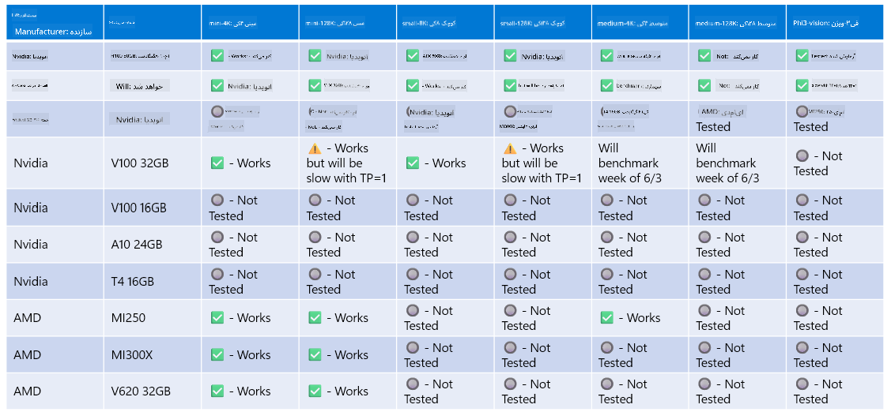

<!--
CO_OP_TRANSLATOR_METADATA:
{
  "original_hash": "8cdc17ce0f10535da30b53d23fe1a795",
  "translation_date": "2025-07-16T18:23:10+00:00",
  "source_file": "md/01.Introduction/01/01.Hardwaresupport.md",
  "language_code": "fa"
}
-->
# پشتیبانی سخت‌افزاری Phi

مایکروسافت Phi برای ONNX Runtime بهینه شده و از Windows DirectML پشتیبانی می‌کند. این فناوری به خوبی روی انواع مختلف سخت‌افزارها از جمله GPUها، CPUها و حتی دستگاه‌های موبایل کار می‌کند.

## سخت‌افزار دستگاه  
به طور خاص، سخت‌افزارهای پشتیبانی شده شامل موارد زیر هستند:

- GPU SKU: RTX 4090 (DirectML)
- GPU SKU: 1 A100 80GB (CUDA)
- CPU SKU: Standard F64s v2 (64 vCPU، 128 گیگابایت حافظه)

## SKU موبایل

- اندروید - Samsung Galaxy S21
- اپل iPhone 14 یا بالاتر با پردازنده A16/A17

## مشخصات سخت‌افزاری Phi

- حداقل پیکربندی مورد نیاز.
- ویندوز: GPU با پشتیبانی از DirectX 12 و حداقل ۴ گیگابایت حافظه رم ترکیبی

CUDA: GPU انویدیا با Compute Capability برابر یا بالاتر از 7.02



## اجرای onnxruntime روی چند GPU

مدل‌های Phi ONNX که در حال حاضر موجود هستند فقط برای یک GPU طراحی شده‌اند. امکان پشتیبانی از چند GPU برای مدل Phi وجود دارد، اما ORT با دو GPU تضمین نمی‌کند که نسبت به دو نمونه جداگانه از ort عملکرد بهتری داشته باشد. لطفاً برای آخرین به‌روزرسانی‌ها به [ONNX Runtime](https://onnxruntime.ai/) مراجعه کنید.

در [Build 2024 تیم GenAI ONNX](https://youtu.be/WLW4SE8M9i8?si=EtG04UwDvcjunyfC) اعلام کرد که به جای چند GPU، قابلیت multi-instance را برای مدل‌های Phi فعال کرده‌اند.

در حال حاضر این امکان به شما اجازه می‌دهد که یک نمونه onnxruntime یا onnxruntime-genai را با استفاده از متغیر محیطی CUDA_VISIBLE_DEVICES به این شکل اجرا کنید.

```Python
CUDA_VISIBLE_DEVICES=0 python infer.py
CUDA_VISIBLE_DEVICES=1 python infer.py
```

برای آشنایی بیشتر با Phi می‌توانید به [Azure AI Foundry](https://ai.azure.com) مراجعه کنید.

**سلب مسئولیت**:  
این سند با استفاده از سرویس ترجمه هوش مصنوعی [Co-op Translator](https://github.com/Azure/co-op-translator) ترجمه شده است. در حالی که ما در تلاش برای دقت هستیم، لطفاً توجه داشته باشید که ترجمه‌های خودکار ممکن است حاوی خطاها یا نواقصی باشند. سند اصلی به زبان بومی خود باید به عنوان منبع معتبر در نظر گرفته شود. برای اطلاعات حیاتی، ترجمه حرفه‌ای انسانی توصیه می‌شود. ما مسئول هیچ گونه سوءتفاهم یا تفسیر نادرستی که از استفاده این ترجمه ناشی شود، نیستیم.