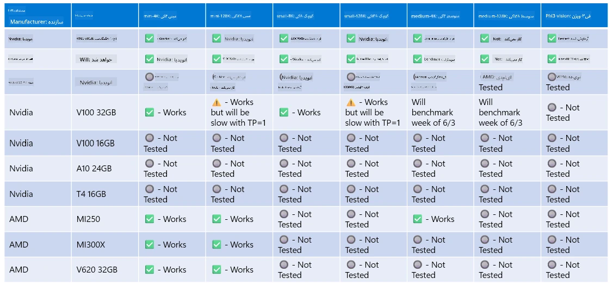

# پشتیبانی سخت‌افزاری فی

Microsoft Phi برای ONNX Runtime بهینه‌سازی شده و از Windows DirectML پشتیبانی می‌کند. این نرم‌افزار در انواع مختلف سخت‌افزارها از جمله GPUها، CPUها و حتی دستگاه‌های موبایل به خوبی کار می‌کند.

## سخت‌افزار دستگاه  
به طور مشخص، سخت‌افزارهای پشتیبانی شده شامل موارد زیر هستند:

- مدل GPU: RTX 4090 (DirectML)
- مدل GPU: 1 A100 80GB (CUDA)
- مدل CPU: Standard F64s v2 (64 vCPU، 128 گیگابایت حافظه)

## مدل موبایل

- اندروید - Samsung Galaxy S21
- Apple iPhone 14 یا بالاتر با پردازنده A16/A17

## مشخصات سخت‌افزاری فی

- حداقل پیکربندی مورد نیاز.
- ویندوز: GPU دارای قابلیت DirectX 12 و حداقل 4 گیگابایت رم ترکیبی

CUDA: GPU انویدیا با Compute Capability >= 7.02



## اجرای onnxruntime روی چندین GPU

در حال حاضر مدل‌های Phi ONNX موجود فقط برای یک GPU هستند. امکان پشتیبانی از چند-GPU برای مدل Phi وجود دارد، ولی ORT با 2 GPU تضمین نمی‌کند که نسبت به دو نمونه از ort مقدار ترافیک بیشتری ارائه دهد. لطفاً برای آخرین به‌روزرسانی‌ها به [ONNX Runtime](https://onnxruntime.ai/) مراجعه کنید.

در [Build 2024 تیم GenAI ONNX](https://youtu.be/WLW4SE8M9i8?si=EtG04UwDvcjunyfC) اعلام کرد که به جای چند-GPU، قابلیت چند-نمونه را برای مدل‌های Phi فعال کرده‌اند.

در حال حاضر این امکان به شما اجازه می‌دهد یک نمونه onnnxruntime یا onnxruntime-genai را با متغیر محیطی CUDA_VISIBLE_DEVICES به این شکل اجرا کنید.

```Python
CUDA_VISIBLE_DEVICES=0 python infer.py
CUDA_VISIBLE_DEVICES=1 python infer.py
```

برای کسب اطلاعات بیشتر درباره Phi خوش‌آمدید به [Microsoft Foundry](https://ai.azure.com) مراجعه کنید.

---

<!-- CO-OP TRANSLATOR DISCLAIMER START -->
**سلب مسئولیت**:  
این سند با استفاده از سرویس ترجمه هوش مصنوعی [Co-op Translator](https://github.com/Azure/co-op-translator) ترجمه شده است. در حالی که ما در تلاش برای دقت هستیم، لطفاً توجه داشته باشید که ترجمه‌های خودکار ممکن است شامل خطاها یا نواقصی باشند. سند اصلی به زبان بومی خود باید به عنوان منبع معتبر در نظر گرفته شود. برای اطلاعات حیاتی، استفاده از ترجمه حرفه‌ای انسانی توصیه می‌شود. ما مسئول هیچ گونه سوءتفاهم یا تفسیر نادرستی که ناشی از استفاده از این ترجمه باشد، نیستیم.
<!-- CO-OP TRANSLATOR DISCLAIMER END -->