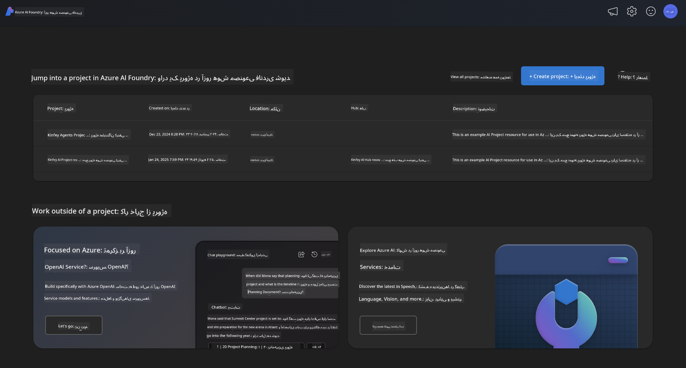
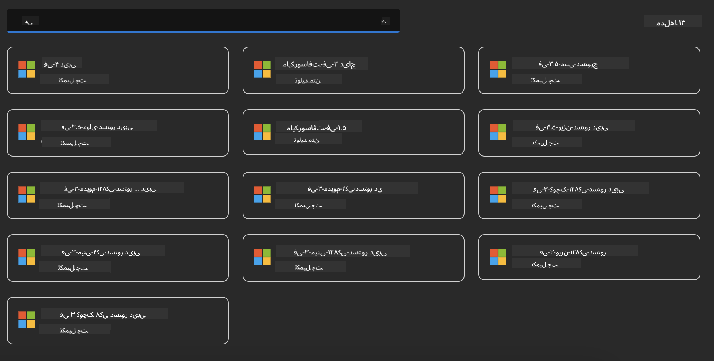
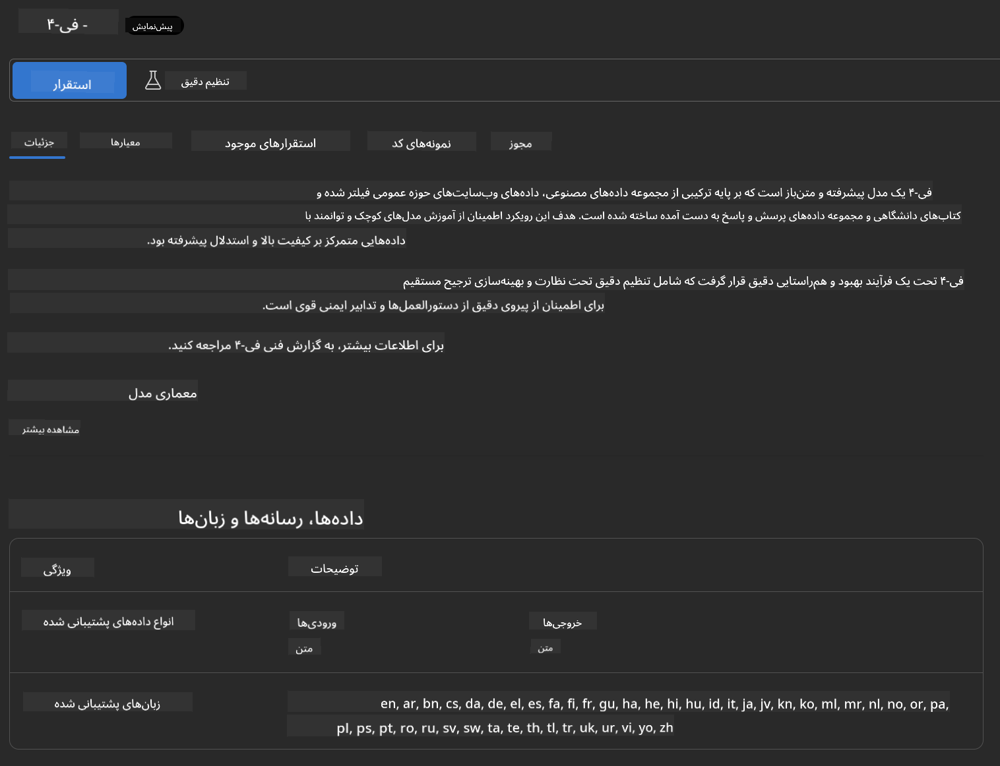
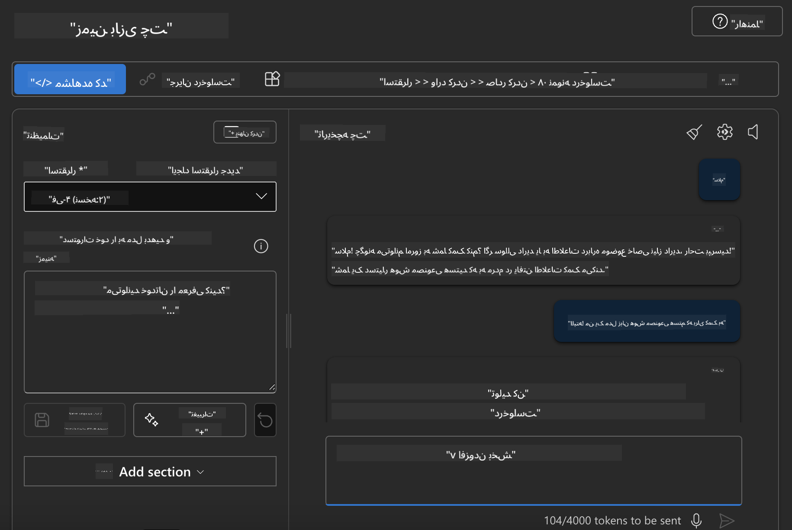

<!--
CO_OP_TRANSLATOR_METADATA:
{
  "original_hash": "3ae21dc5554e888defbe57946ee995ee",
  "translation_date": "2025-05-07T15:06:46+00:00",
  "source_file": "md/01.Introduction/02/03.AzureAIFoundry.md",
  "language_code": "fa"
}
-->
## خانواده Phi در Azure AI Foundry

[Azure AI Foundry](https://ai.azure.com) یک پلتفرم قابل اعتماد است که به توسعه‌دهندگان امکان می‌دهد نوآوری ایجاد کنند و آینده را با هوش مصنوعی به روشی ایمن، مطمئن و مسئولانه شکل دهند.

[Azure AI Foundry](https://ai.azure.com) برای توسعه‌دهندگان طراحی شده است تا:

- برنامه‌های هوش مصنوعی مولد را روی یک پلتفرم سازمانی بسازند.
- با استفاده از ابزارهای پیشرفته هوش مصنوعی و مدل‌های یادگیری ماشین، که بر پایه‌ی اصول هوش مصنوعی مسئولانه استوارند، کاوش، ساخت، آزمایش و استقرار انجام دهند.
- در تمام چرخه عمر توسعه برنامه با تیم همکاری کنند.

با Azure AI Foundry، می‌توانید انواع مختلفی از مدل‌ها، سرویس‌ها و قابلیت‌ها را بررسی کرده و برنامه‌های هوش مصنوعی را بسازید که بهترین پاسخ را به اهداف شما می‌دهند. پلتفرم Azure AI Foundry مقیاس‌پذیری را برای تبدیل نمونه‌های اولیه به برنامه‌های تولیدی کامل به سادگی فراهم می‌کند. نظارت و بهبود مداوم، موفقیت بلندمدت را تضمین می‌کند.



علاوه بر استفاده از سرویس Azure AOAI در Azure AI Foundry، می‌توانید از مدل‌های شخص ثالث در کاتالوگ مدل Azure AI Foundry نیز بهره ببرید. این گزینه مناسبی است اگر بخواهید از Azure AI Foundry به عنوان پلتفرم راه‌حل هوش مصنوعی خود استفاده کنید.

ما می‌توانیم مدل‌های خانواده Phi را به سرعت از طریق کاتالوگ مدل در Azure AI Foundry مستقر کنیم.

[Microsoft Phi Models in Azure AI Foundry Models](https://ai.azure.com/explore/models/?selectedCollection=phi)



### **استقرار Phi-4 در Azure AI Foundry**



### **آزمایش Phi-4 در محیط آزمایش Azure AI Foundry**



### **اجرای کد پایتون برای فراخوانی Phi-4 در Azure AI Foundry**

```python

import os  
import base64
from openai import AzureOpenAI  
from azure.identity import DefaultAzureCredential, get_bearer_token_provider  
        
endpoint = os.getenv("ENDPOINT_URL", "Your Azure AOAI Service Endpoint")  
deployment = os.getenv("DEPLOYMENT_NAME", "Phi-4")  
      
token_provider = get_bearer_token_provider(  
    DefaultAzureCredential(),  
    "https://cognitiveservices.azure.com/.default"  
)  
  
client = AzureOpenAI(  
    azure_endpoint=endpoint,  
    azure_ad_token_provider=token_provider,  
    api_version="2024-05-01-preview",  
)  
  

chat_prompt = [
    {
        "role": "system",
        "content": "You are an AI assistant that helps people find information."
    },
    {
        "role": "user",
        "content": "can you introduce yourself"
    }
] 
    
# Include speech result if speech is enabled  
messages = chat_prompt 

completion = client.chat.completions.create(  
    model=deployment,  
    messages=messages,
    max_tokens=800,  
    temperature=0.7,  
    top_p=0.95,  
    frequency_penalty=0,  
    presence_penalty=0,
    stop=None,  
    stream=False  
)  
  
print(completion.to_json())  

```

**سلب مسئولیت**:  
این سند با استفاده از سرویس ترجمه هوش مصنوعی [Co-op Translator](https://github.com/Azure/co-op-translator) ترجمه شده است. در حالی که ما در تلاش برای دقت هستیم، لطفاً توجه داشته باشید که ترجمه‌های خودکار ممکن است حاوی اشتباهات یا نواقص باشند. سند اصلی به زبان بومی خود باید به عنوان منبع معتبر در نظر گرفته شود. برای اطلاعات حیاتی، ترجمه حرفه‌ای انسانی توصیه می‌شود. ما مسئول هیچ گونه سوءتفاهم یا تفسیر نادرست ناشی از استفاده از این ترجمه نیستیم.