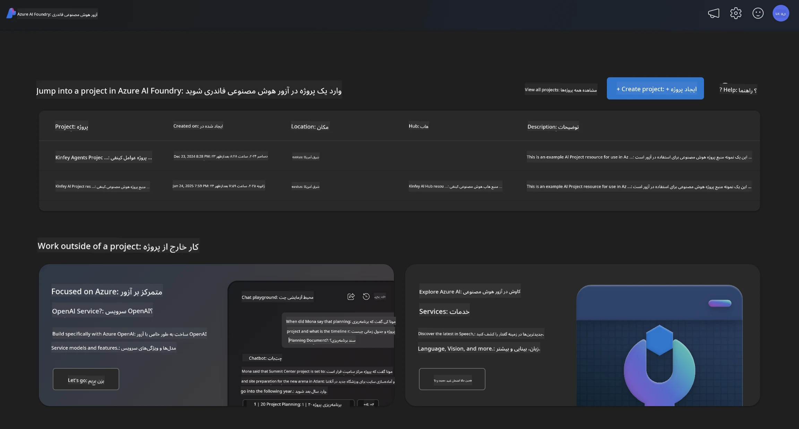
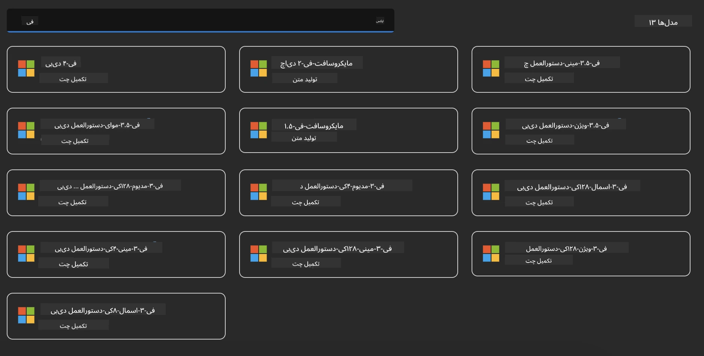
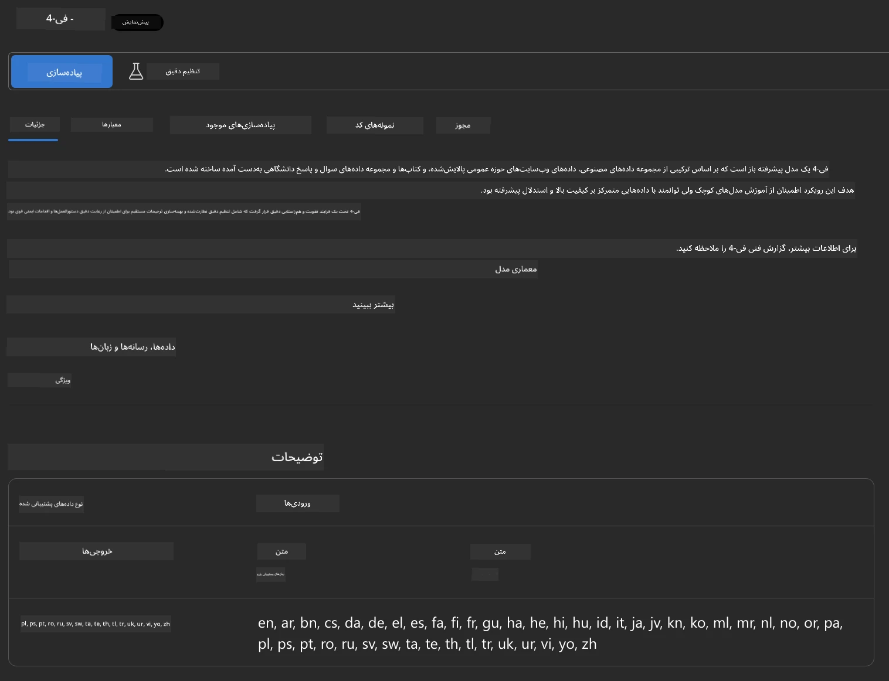
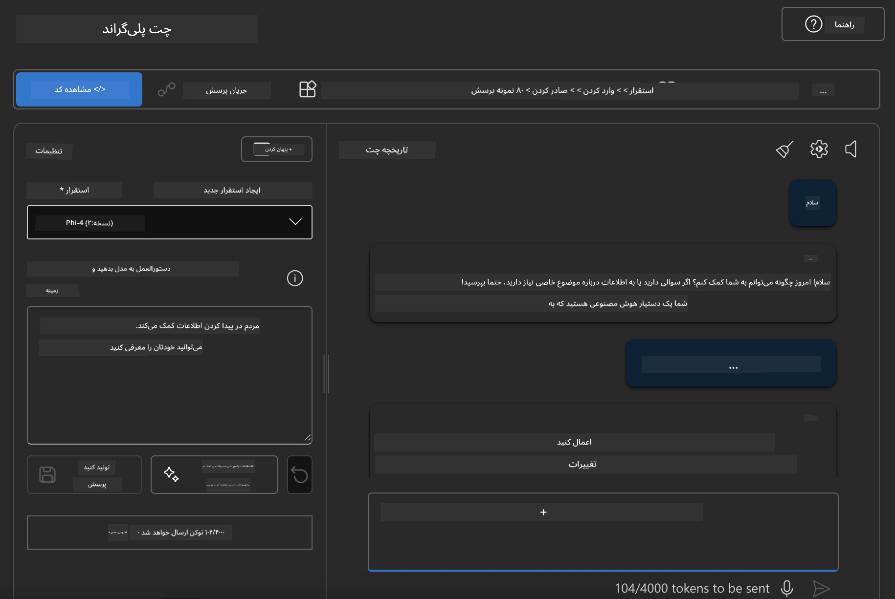

## خانواده فی در Microsoft Foundry

[Microsoft Foundry](https://ai.azure.com) یک پلتفرم مطمئن است که به توسعه‌دهندگان این امکان را می‌دهد که نوآوری ایجاد کنند و آینده را با هوش مصنوعی به روشی امن، ایمن و مسئولانه شکل دهند.

[Microsoft Foundry](https://ai.azure.com) برای توسعه‌دهندگان طراحی شده است تا:

- برنامه‌های هوش مصنوعی مولد را روی یک پلتفرم سازمانی بسازند.
- با استفاده از ابزارهای پیشرفته هوش مصنوعی و مدل‌های یادگیری ماشین که مبتنی بر رویه‌های مسئولانه هوش مصنوعی هستند، کاوش، ساخت، آزمایش و استقرار انجام دهند.
- با تیمی همکاری کنند برای چرخه کامل توسعه برنامه.

با Microsoft Foundry، می‌توانید طیف وسیعی از مدل‌ها، خدمات و قابلیت‌ها را کاوش کرده و به ساخت برنامه‌های هوش مصنوعی که بهترین خدمت را به اهداف شما می‌کنند، بپردازید. پلتفرم Microsoft Foundry قابلیت مقیاس‌پذیری برای تبدیل اثبات مفاهیم به برنامه‌های تولیدی کامل را به آسانی فراهم می‌کند. نظارت و بهبود مستمر، حمایت از موفقیت بلندمدت را تضمین می‌کند.



علاوه بر استفاده از سرویس Azure AOAI در Microsoft Foundry، می‌توانید از مدل‌های شخص ثالث در کاتالوگ مدل Microsoft Foundry نیز استفاده کنید. این گزینه خوبی است اگر بخواهید از Microsoft Foundry به عنوان پلتفرم راه‌حل هوش مصنوعی خود استفاده کنید.

ما می‌توانیم مدل‌های خانواده فی را به سرعت از طریق کاتالوگ مدل در Microsoft Foundry مستقر کنیم.

[مدل‌های فی در مدل‌های Microsoft Foundry](https://ai.azure.com/explore/models/?selectedCollection=phi)



### **استقرار Phi-4 در Microsoft Foundry**



### **آزمایش Phi-4 در زمین بازی Microsoft Foundry**



### **اجرای کد پایتون برای فراخوانی Phi-4 در Microsoft Foundry**

```python

import os  
import base64
from openai import AzureOpenAI  
from azure.identity import DefaultAzureCredential, get_bearer_token_provider  
        
endpoint = os.getenv("ENDPOINT_URL", "Your Azure AOAI Service Endpoint")  
deployment = os.getenv("DEPLOYMENT_NAME", "Phi-4")  
      
token_provider = get_bearer_token_provider(  
    DefaultAzureCredential(),  
    "https://cognitiveservices.azure.com/.default"  
)  
  
client = AzureOpenAI(  
    azure_endpoint=endpoint,  
    azure_ad_token_provider=token_provider,  
    api_version="2024-05-01-preview",  
)  
  

chat_prompt = [
    {
        "role": "system",
        "content": "You are an AI assistant that helps people find information."
    },
    {
        "role": "user",
        "content": "can you introduce yourself"
    }
] 
    
# اگر گفتار فعال باشد، نتیجه گفتار را بگنجانید
messages = chat_prompt 

completion = client.chat.completions.create(  
    model=deployment,  
    messages=messages,
    max_tokens=800,  
    temperature=0.7,  
    top_p=0.95,  
    frequency_penalty=0,  
    presence_penalty=0,
    stop=None,  
    stream=False  
)  
  
print(completion.to_json())  

```

---

<!-- CO-OP TRANSLATOR DISCLAIMER START -->
**توضیح ارسال**:  
این سند با استفاده از سرویس ترجمه هوش مصنوعی [Co-op Translator](https://github.com/Azure/co-op-translator) ترجمه شده است. در حالی که تلاش ما بر دقت استوار است، لطفاً توجه داشته باشید که ترجمه‌های خودکار ممکن است شامل خطاها یا نادرستی‌هایی باشند. سند اصلی به زبان مبدا باید به عنوان منبع معتبر در نظر گرفته شود. برای اطلاعات حیاتی، توصیه می‌شود از ترجمه حرفه‌ای انسانی استفاده شود. ما مسئول هیچگونه سوءتفاهم یا تفسیر نادرستی که از استفاده از این ترجمه ناشی شود، نیستیم.
<!-- CO-OP TRANSLATOR DISCLAIMER END -->