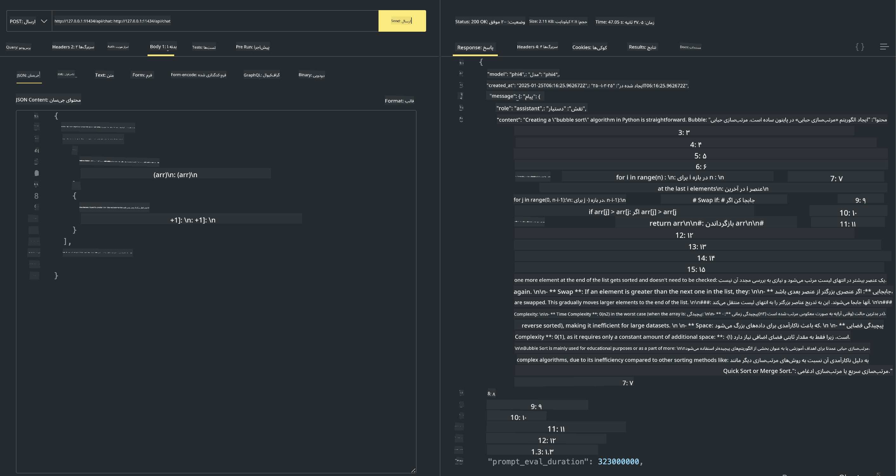

<!--
CO_OP_TRANSLATOR_METADATA:
{
  "original_hash": "0b38834693bb497f96bf53f0d941f9a1",
  "translation_date": "2025-07-16T19:13:02+00:00",
  "source_file": "md/01.Introduction/02/04.Ollama.md",
  "language_code": "fa"
}
-->
## خانواده فی در اولاما

[Ollama](https://ollama.com) به افراد بیشتری امکان می‌دهد تا مدل‌های LLM یا SLM متن‌باز را به‌سادگی از طریق اسکریپت‌ها مستقیماً اجرا کنند و همچنین می‌تواند APIهایی بسازد که به سناریوهای کاربردی محلی Copilot کمک کند.

## **1. نصب**

اولاما از اجرا روی ویندوز، مک‌اواس و لینوکس پشتیبانی می‌کند. می‌توانید اولاما را از این لینک ([https://ollama.com/download](https://ollama.com/download)) نصب کنید. پس از نصب موفق، می‌توانید مستقیماً با استفاده از اسکریپت اولاما، مدل Phi-3 را از طریق پنجره ترمینال فراخوانی کنید. می‌توانید تمام [کتابخانه‌های موجود در اولاما](https://ollama.com/library) را مشاهده کنید. اگر این مخزن را در Codespace باز کنید، اولاما از قبل نصب شده است.

```bash

ollama run phi4

```

> [!NOTE]
> مدل در اولین اجرای شما ابتدا دانلود خواهد شد. البته می‌توانید مدل Phi-4 دانلود شده را مستقیماً مشخص کنید. ما برای مثال از WSL برای اجرای دستور استفاده می‌کنیم. پس از دانلود موفق مدل، می‌توانید مستقیماً در ترمینال با آن تعامل داشته باشید.


## **2. فراخوانی API فی-4 از اولاما**

اگر می‌خواهید API مدل Phi-4 تولید شده توسط اولاما را فراخوانی کنید، می‌توانید با این دستور در ترمینال سرور اولاما را راه‌اندازی کنید.

```bash

ollama serve

```

> [!NOTE]
> اگر روی macOS یا لینوکس اجرا می‌کنید، ممکن است با خطای زیر مواجه شوید: **"Error: listen tcp 127.0.0.1:11434: bind: address already in use"** این خطا ممکن است هنگام اجرای دستور ظاهر شود. می‌توانید این خطا را نادیده بگیرید، چون معمولاً نشان می‌دهد سرور قبلاً در حال اجرا است، یا می‌توانید اولاما را متوقف و دوباره راه‌اندازی کنید:

**macOS**

```bash

brew services restart ollama

```

**لینوکس**

```bash

sudo systemctl stop ollama

```

اولاما دو API ارائه می‌دهد: generate و chat. می‌توانید بر اساس نیاز خود، API مدل ارائه شده توسط اولاما را با ارسال درخواست به سرویس محلی در حال اجرا روی پورت 11434 فراخوانی کنید.

**چت**

```bash

curl http://127.0.0.1:11434/api/chat -d '{
  "model": "phi3",
  "messages": [
    {
      "role": "system",
      "content": "Your are a python developer."
    },
    {
      "role": "user",
      "content": "Help me generate a bubble algorithm"
    }
  ],
  "stream": false
  
}'

This is the result in Postman



## Additional Resources

Check the list of available models in Ollama in [their library](https://ollama.com/library).

Pull your model from the Ollama server using this command

```bash
ollama pull phi4
```

Run the model using this command

```bash
ollama run phi4
```

***Note:*** Visit this link [https://github.com/ollama/ollama/blob/main/docs/api.md](https://github.com/ollama/ollama/blob/main/docs/api.md) to learn more

## Calling Ollama from Python

You can use `requests` or `urllib3` to make requests to the local server endpoints used above. However, a popular way to use Ollama in Python is via the [openai](https://pypi.org/project/openai/) SDK, since Ollama provides OpenAI-compatible server endpoints as well.

Here is an example for phi3-mini:

```python
import openai

client = openai.OpenAI(
    base_url="http://localhost:11434/v1",
    api_key="nokeyneeded",
)

response = client.chat.completions.create(
    model="phi4",
    temperature=0.7,
    n=1,
    messages=[
        {"role": "system", "content": "You are a helpful assistant."},
        {"role": "user", "content": "Write a haiku about a hungry cat"},
    ],
)

print("Response:")
print(response.choices[0].message.content)
```

## Calling Ollama from JavaScript 

```javascript
// نمونه‌ای از خلاصه‌سازی یک فایل با Phi-4
script({
    model: "ollama:phi4",
    title: "خلاصه‌سازی با Phi-4",
    system: ["system"],
})

// نمونه‌ای از خلاصه‌سازی
const file = def("FILE", env.files)
$`خلاصه ${file} را در یک پاراگراف بنویس.`
```

## Calling Ollama from C#

Create a new C# Console application and add the following NuGet package:

```bash
dotnet add package Microsoft.SemanticKernel --version 1.34.0
```

Then replace this code in the `Program.cs` file

```csharp
using Microsoft.SemanticKernel;
using Microsoft.SemanticKernel.ChatCompletion;

// افزودن سرویس چت کامپلیشن با استفاده از نقطه انتهایی سرور محلی اولاما
#pragma warning disable SKEXP0001, SKEXP0003, SKEXP0010, SKEXP0011, SKEXP0050, SKEXP0052
builder.AddOpenAIChatCompletion(
    modelId: "phi4",
    endpoint: new Uri("http://localhost:11434/"),
    apiKey: "non required");

// فراخوانی یک پرامپت ساده به سرویس چت
string prompt = "Write a joke about kittens";
var response = await kernel.InvokePromptAsync(prompt);
Console.WriteLine(response.GetValue<string>());
```

Run the app with the command:

```bash
dotnet run

**سلب مسئولیت**:  
این سند با استفاده از سرویس ترجمه هوش مصنوعی [Co-op Translator](https://github.com/Azure/co-op-translator) ترجمه شده است. در حالی که ما در تلاش برای دقت هستیم، لطفاً توجه داشته باشید که ترجمه‌های خودکار ممکن است حاوی خطاها یا نادرستی‌هایی باشند. سند اصلی به زبان بومی خود باید به عنوان منبع معتبر در نظر گرفته شود. برای اطلاعات حیاتی، ترجمه حرفه‌ای انسانی توصیه می‌شود. ما مسئول هیچ گونه سوءتفاهم یا تفسیر نادرستی که از استفاده این ترجمه ناشی شود، نیستیم.