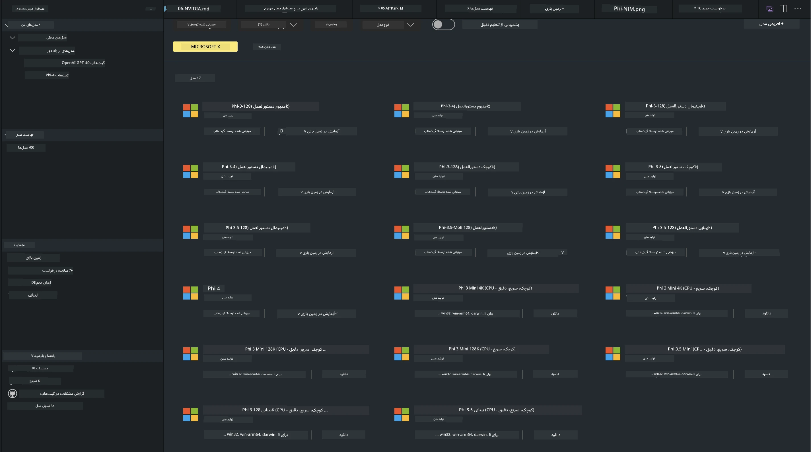
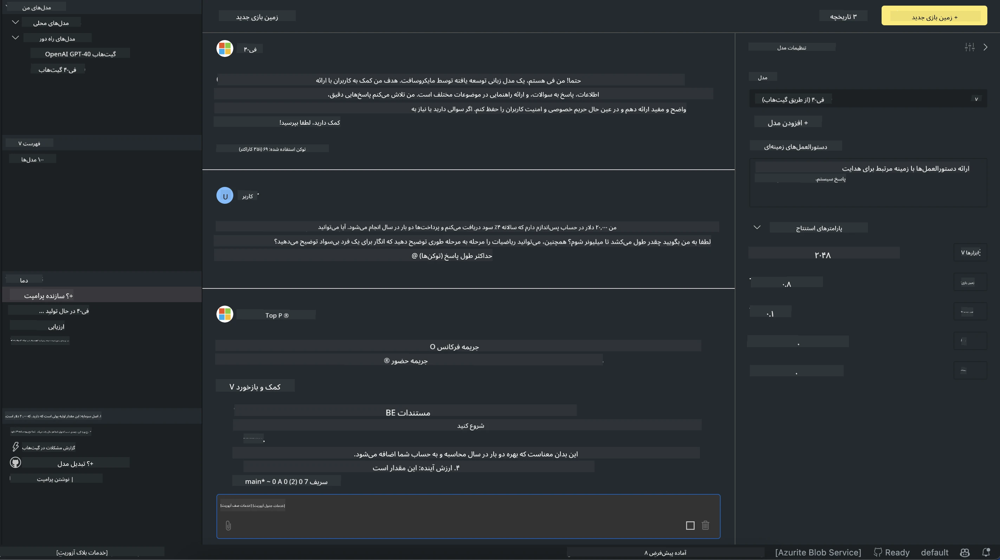

# خانواده فی در AITK

[جعبه‌ابزار هوش مصنوعی برای VS Code](https://marketplace.visualstudio.com/items?itemName=ms-windows-ai-studio.windows-ai-studio) توسعه برنامه‌های هوش مصنوعی مولد را با گرد هم آوردن ابزارها و مدل‌های پیشرفته توسعه هوش مصنوعی از Microsoft Foundry Catalog و سایر کاتالوگ‌ها مانند Hugging Face ساده می‌کند. شما قادر خواهید بود کاتالوگ مدل‌های هوش مصنوعی را که توسط GitHub Models و Microsoft Foundry Model Catalogs پشتیبانی می‌شود مرور کنید، آن‌ها را به صورت محلی یا از راه دور دانلود کنید، تنظیم دقیق انجام دهید، تست کنید و در برنامه خود استفاده کنید.

پیش‌نمایش AI Toolkit به صورت محلی اجرا خواهد شد. استنتاج یا تنظیم دقیق محلی، بسته به مدلی که انتخاب می‌کنید، ممکن است نیاز به GPU مانند NVIDIA CUDA GPU داشته باشید. همچنین می‌توانید مدل‌های GitHub را مستقیماً با AITK اجرا کنید.

## شروع به کار

[بیشتر بدانید چگونه زیرسیستم ویندوز برای لینوکس را نصب کنید](https://learn.microsoft.com/windows/wsl/install?WT.mc_id=aiml-137032-kinfeylo)

و [تغییر توزیع پیش‌فرض](https://learn.microsoft.com/windows/wsl/install#change-the-default-linux-distribution-installed).

[مخزن GitHub جعبه‌ابزار AI](https://github.com/microsoft/vscode-ai-toolkit/)

- ویندوز، لینوکس، macOS
  
- برای تنظیم دقیق در هر دو ویندوز و لینوکس به GPU Nvidia نیاز دارید. علاوه بر این، **ویندوز** نیاز به زیرسیستم لینوکس با توزیع Ubuntu نسخه 18.4 یا بالاتر دارد. [بیشتر بدانید چگونه زیرسیستم ویندوز برای لینوکس را نصب کنید](https://learn.microsoft.com/windows/wsl/install) و [تغییر توزیع پیش‌فرض](https://learn.microsoft.com/windows/wsl/install#change-the-default-linux-distribution-installed).

### نصب جعبه‌ابزار AI

جعبه‌ابزار AI به عنوان یک [افزونه Visual Studio Code](https://code.visualstudio.com/docs/setup/additional-components#_vs-code-extensions) عرضه می‌شود، بنابراین ابتدا باید [VS Code](https://code.visualstudio.com/docs/setup/windows?WT.mc_id=aiml-137032-kinfeylo) را نصب کنید و جعبه‌ابزار AI را از [بازار VS](https://marketplace.visualstudio.com/items?itemName=ms-windows-ai-studio.windows-ai-studio) دانلود کنید.
[جعبه‌ابزار AI در بازار Visual Studio](https://marketplace.visualstudio.com/items?itemName=ms-windows-ai-studio.windows-ai-studio) در دسترس است و می‌توان آن را مانند هر افزونه VS Code دیگری نصب کرد.

اگر با نصب افزونه‌های VS Code آشنایی ندارید، این مراحل را دنبال کنید:

### ورود به سیستم

1. در نوار فعالیت در VS Code گزینه **Extensions** را انتخاب کنید
1. در کادر جستجوی افزونه‌ها عبارت "AI Toolkit" را تایپ کنید
1. افزونه "AI Toolkit for Visual Studio code" را انتخاب کنید
1. روی **Install** کلیک کنید

حالا آماده استفاده از افزونه هستید!

از شما خواسته می‌شود که به GitHub وارد شوید، لطفاً برای ادامه روی "Allow" کلیک کنید. به صفحه ورود GitHub هدایت خواهید شد.

لطفاً وارد شوید و مراحل را دنبال کنید. پس از تکمیل موفق، به VS Code بازگردانده می‌شوید.

پس از نصب افزونه، آیکون جعبه‌ابزار AI در نوار فعالیت شما ظاهر خواهد شد.

بیایید عملکردهای موجود را بررسی کنیم!

### عملکردهای موجود

نوار کناری اصلی جعبه‌ابزار AI به صورت زیر سازماندهی شده است:

- **Models**
- **Resources**
- **Playground**  
- **Fine-tuning**
- **Evaluation**

در بخش Resources در دسترس هستند. برای شروع **Model Catalog** را انتخاب کنید.

### دانلود مدل از کاتالوگ

با باز کردن جعبه‌ابزار AI از نوار کناری VS Code، می‌توانید از گزینه‌های زیر انتخاب کنید:



- یافتن مدل پشتیبانی‌شده از **Model Catalog** و دانلود به صورت محلی
- تست استنتاج مدل در **Model Playground**
- تنظیم دقیق مدل به صورت محلی یا از راه دور در **Model Fine-tuning**
- استقرار مدل‌های تنظیم‌شده به صورت ابری از طریق palette دستورات برای جعبه‌ابزار AI
- ارزیابی مدل‌ها

> [!NOTE]
>
> **GPU در مقابل CPU**
>
> شما متوجه خواهید شد کارت‌های مدل اندازه مدل، پلتفرم و نوع شتاب‌دهنده (CPU، GPU) را نشان می‌دهند. برای عملکرد بهینه روی **دستگاه‌های ویندوز که حداقل یک GPU دارند**، نسخه‌های مدل را انتخاب کنید که فقط به ویندوز هدف‌گذاری شده‌اند.
>
> این اطمینان می‌دهد که مدلی که استفاده می‌کنید برای شتاب‌دهنده DirectML بهینه شده باشد.
>
> نام مدل‌ها به صورت
>
> - `{model_name}-{accelerator}-{quantization}-{format}`
>
> است.
>
> برای بررسی اینکه دستگاه ویندوز شما GPU دارد یا خیر، **Task Manager** را باز کنید و سپس تب **Performance** را انتخاب کنید. اگر GPU دارید، با نام‌هایی مانند "GPU 0" یا "GPU 1" فهرست می‌شوند.

### اجرای مدل در محیط بازی

بعد از تنظیم همه پارامترها، روی **Generate Project** کلیک کنید.

پس از دانلود مدل، روی کارت مدل در کاتالوگ گزینه **Load in Playground** را انتخاب کنید:

- شروع دانلود مدل
- نصب همه پیش‌نیازها و وابستگی‌ها
- ایجاد workspace در VS Code



### استفاده از REST API در برنامه شما

جعبه‌ابزار AI دارای یک سرور وب REST API محلی **روی پورت 5272** است که از فرمت [OpenAI chat completions](https://platform.openai.com/docs/api-reference/chat/create) استفاده می‌کند.

این امکان را فراهم می‌کند که برنامه خود را به صورت محلی بدون نیاز به وابستگی به سرویس مدل هوش مصنوعی ابری تست کنید. به عنوان مثال، فایل JSON زیر نحوه پیکربندی بدنه درخواست را نشان می‌دهد:

```json
{
    "model": "Phi-4",
    "messages": [
        {
            "role": "user",
            "content": "what is the golden ratio?"
        }
    ],
    "temperature": 0.7,
    "top_p": 1,
    "top_k": 10,
    "max_tokens": 100,
    "stream": true
}
```


شما می‌توانید REST API را با استفاده از (مثلاً) [Postman](https://www.postman.com/) یا ابزار CURL (Client URL) تست کنید:

```bash
curl -vX POST http://127.0.0.1:5272/v1/chat/completions -H 'Content-Type: application/json' -d @body.json
```


### استفاده از کتابخانه کلاینت OpenAI برای Python

```python
from openai import OpenAI

client = OpenAI(
    base_url="http://127.0.0.1:5272/v1/", 
    api_key="x" # برای API لازم است اما استفاده نمی‌شود
)

chat_completion = client.chat.completions.create(
    messages=[
        {
            "role": "user",
            "content": "what is the golden ratio?",
        }
    ],
    model="Phi-4",
)

print(chat_completion.choices[0].message.content)
```


### استفاده از کتابخانه کلاینت Azure OpenAI برای .NET

کتابخانه کلاینت [Azure OpenAI برای .NET](https://www.nuget.org/packages/Azure.AI.OpenAI/) را با استفاده از NuGet به پروژه خود اضافه کنید:

```bash
dotnet add {project_name} package Azure.AI.OpenAI --version 1.0.0-beta.17
```


یک فایل c# به نام **OverridePolicy.cs** به پروژه خود اضافه کرده و کد زیر را جای‌گذاری کنید:

```csharp
// OverridePolicy.cs
using Azure.Core.Pipeline;
using Azure.Core;

internal partial class OverrideRequestUriPolicy(Uri overrideUri)
    : HttpPipelineSynchronousPolicy
{
    private readonly Uri _overrideUri = overrideUri;

    public override void OnSendingRequest(HttpMessage message)
    {
        message.Request.Uri.Reset(_overrideUri);
    }
}
```


سپس کد زیر را در فایل **Program.cs** خود جای‌گذاری کنید:

```csharp
// Program.cs
using Azure.AI.OpenAI;

Uri localhostUri = new("http://localhost:5272/v1/chat/completions");

OpenAIClientOptions clientOptions = new();
clientOptions.AddPolicy(
    new OverrideRequestUriPolicy(localhostUri),
    Azure.Core.HttpPipelinePosition.BeforeTransport);
OpenAIClient client = new(openAIApiKey: "unused", clientOptions);

ChatCompletionsOptions options = new()
{
    DeploymentName = "Phi-4",
    Messages =
    {
        new ChatRequestSystemMessage("You are a helpful assistant. Be brief and succinct."),
        new ChatRequestUserMessage("What is the golden ratio?"),
    }
};

StreamingResponse<StreamingChatCompletionsUpdate> streamingChatResponse
    = await client.GetChatCompletionsStreamingAsync(options);

await foreach (StreamingChatCompletionsUpdate chatChunk in streamingChatResponse)
{
    Console.Write(chatChunk.ContentUpdate);
}
```


## تنظیم دقیق با جعبه‌ابزار AI

- شروع با کشف مدل و محیط بازی.
- تنظیم دقیق و استنتاج مدل با استفاده از منابع محلی.
- تنظیم دقیق و استنتاج از راه دور با استفاده از منابع Azure

[تنظیم دقیق با جعبه‌ابزار AI](../../03.FineTuning/Finetuning_VSCodeaitoolkit.md)

## منابع پرسش و پاسخ جعبه‌ابزار AI

لطفاً به [صفحه پرسش و پاسخ ما](https://github.com/microsoft/vscode-ai-toolkit/blob/main/archive/QA.md) برای رایج‌ترین مشکلات و راه‌حل‌ها مراجعه کنید.

---

<!-- CO-OP TRANSLATOR DISCLAIMER START -->
**توضیح مهم**:  
این سند با استفاده از سرویس ترجمه هوش مصنوعی [Co-op Translator](https://github.com/Azure/co-op-translator) ترجمه شده است. در حالی که ما در تلاش برای دقت هستیم، لطفاً توجه داشته باشید که ترجمه‌های خودکار ممکن است شامل خطاها یا نواقصی باشند. سند اصلی به زبان مادری خود، منبع معتبر و قطعی محسوب می‌شود. برای اطلاعات حیاتی، ترجمهٔ حرفه‌ای انسانی توصیه می‌شود. ما مسئول هیچ گونه سوءتفاهم یا تفسیر نادرستی که از استفاده این ترجمه ناشی شود، نمی‌باشیم.
<!-- CO-OP TRANSLATOR DISCLAIMER END -->