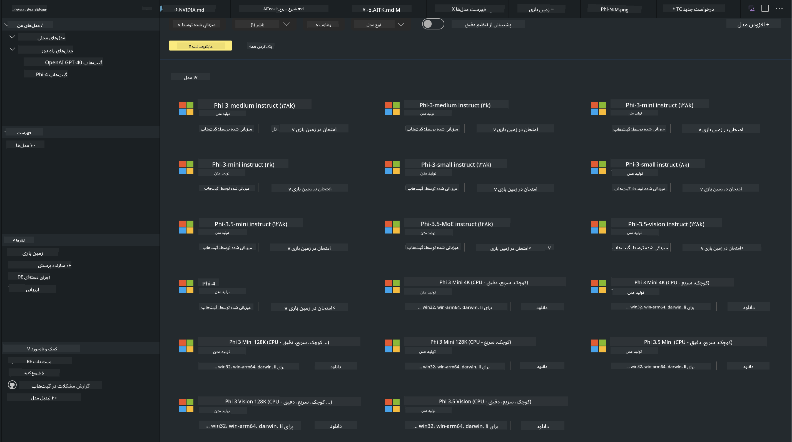

<!--
CO_OP_TRANSLATOR_METADATA:
{
  "original_hash": "4951d458c0b60c02cd1e751b40903877",
  "translation_date": "2025-05-07T15:04:29+00:00",
  "source_file": "md/01.Introduction/02/05.AITK.md",
  "language_code": "fa"
}
-->
# خانواده Phi در AITK

[AI Toolkit برای VS Code](https://marketplace.visualstudio.com/items?itemName=ms-windows-ai-studio.windows-ai-studio) توسعه برنامه‌های مبتنی بر هوش مصنوعی مولد را با گردآوری ابزارها و مدل‌های پیشرفته توسعه هوش مصنوعی از Azure AI Foundry Catalog و سایر کاتالوگ‌ها مانند Hugging Face ساده می‌کند. شما می‌توانید کاتالوگ مدل‌های هوش مصنوعی را که توسط GitHub Models و Azure AI Foundry Model Catalogs پشتیبانی می‌شود مرور کنید، مدل‌ها را به صورت محلی یا از راه دور دانلود کنید، آن‌ها را بهینه‌سازی، آزمایش و در برنامه خود استفاده نمایید.

پیش‌نمایش AI Toolkit به صورت محلی اجرا می‌شود. استنتاج یا بهینه‌سازی محلی بسته به مدلی که انتخاب کرده‌اید، ممکن است نیاز به GPU مانند NVIDIA CUDA GPU داشته باشید. همچنین می‌توانید GitHub Models را مستقیماً با AITK اجرا کنید.

## شروع کار

[اطلاعات بیشتر درباره نصب Windows subsystem for Linux](https://learn.microsoft.com/windows/wsl/install?WT.mc_id=aiml-137032-kinfeylo)

و [تغییر توزیع پیش‌فرض](https://learn.microsoft.com/windows/wsl/install#change-the-default-linux-distribution-installed).

[مخزن GitHub AI Toolkit](https://github.com/microsoft/vscode-ai-toolkit/)

- ویندوز، لینوکس، مک‌اواس
  
- برای بهینه‌سازی روی هر دو ویندوز و لینوکس، به GPU انویدیا نیاز دارید. علاوه بر این، **ویندوز** نیازمند subsystem برای لینوکس با توزیع اوبونتو ۱۸.۴ یا بالاتر است. [اطلاعات بیشتر درباره نصب Windows subsystem for Linux](https://learn.microsoft.com/windows/wsl/install) و [تغییر توزیع پیش‌فرض](https://learn.microsoft.com/windows/wsl/install#change-the-default-linux-distribution-installed).

### نصب AI Toolkit

AI Toolkit به صورت [افزونه Visual Studio Code](https://code.visualstudio.com/docs/setup/additional-components#_vs-code-extensions) ارائه می‌شود، بنابراین ابتدا باید [VS Code](https://code.visualstudio.com/docs/setup/windows?WT.mc_id=aiml-137032-kinfeylo) را نصب کرده و سپس AI Toolkit را از [بازار VS](https://marketplace.visualstudio.com/items?itemName=ms-windows-ai-studio.windows-ai-studio) دانلود کنید.
[AI Toolkit در بازار Visual Studio](https://marketplace.visualstudio.com/items?itemName=ms-windows-ai-studio.windows-ai-studio) موجود است و می‌توان آن را مانند هر افزونه دیگر VS Code نصب کرد.

اگر با نصب افزونه‌های VS Code آشنا نیستید، مراحل زیر را دنبال کنید:

### ورود به سیستم

1. در نوار فعالیت VS Code گزینه **Extensions** را انتخاب کنید
1. در نوار جستجوی افزونه‌ها عبارت "AI Toolkit" را تایپ کنید
1. "AI Toolkit for Visual Studio code" را انتخاب کنید
1. روی **Install** کلیک کنید

حالا آماده استفاده از افزونه هستید!

از شما خواسته می‌شود وارد حساب GitHub خود شوید، پس برای ادامه روی "Allow" کلیک کنید. به صفحه ورود GitHub هدایت خواهید شد.

لطفاً وارد شوید و مراحل را دنبال کنید. پس از اتمام موفقیت‌آمیز، به VS Code بازگردانده می‌شوید.

پس از نصب افزونه، آیکون AI Toolkit در نوار فعالیت شما ظاهر خواهد شد.

بیایید قابلیت‌های موجود را بررسی کنیم!

### عملیات‌های موجود

نوار کناری اصلی AI Toolkit به صورت زیر سازمان‌دهی شده است:

- **Models**
- **Resources**
- **Playground**  
- **Fine-tuning**
- **Evaluation**

این موارد در بخش Resources در دسترس هستند. برای شروع **Model Catalog** را انتخاب کنید.

### دانلود یک مدل از کاتالوگ

پس از اجرای AI Toolkit از نوار کناری VS Code، می‌توانید از گزینه‌های زیر انتخاب کنید:



- یافتن مدل پشتیبانی شده از **Model Catalog** و دانلود به صورت محلی
- آزمایش استنتاج مدل در **Model Playground**
- بهینه‌سازی مدل به صورت محلی یا از راه دور در **Model Fine-tuning**
- استقرار مدل‌های بهینه‌شده به فضای ابری از طریق command palette برای AI Toolkit
- ارزیابی مدل‌ها

> [!NOTE]
>
> **GPU در مقابل CPU**
>
> متوجه خواهید شد که کارت‌های مدل اندازه مدل، پلتفرم و نوع شتاب‌دهنده (CPU، GPU) را نشان می‌دهند. برای عملکرد بهینه روی **دستگاه‌های ویندوز که حداقل یک GPU دارند**، نسخه‌های مدلی را انتخاب کنید که فقط برای ویندوز هدف‌گذاری شده‌اند.
>
> این اطمینان می‌دهد که مدل برای شتاب‌دهنده DirectML بهینه شده است.
>
> نام مدل‌ها به صورت زیر است:
>
> - `{model_name}-{accelerator}-{quantization}-{format}`.
>
> برای بررسی اینکه آیا در دستگاه ویندوز خود GPU دارید، **Task Manager** را باز کرده و سپس تب **Performance** را انتخاب کنید. اگر GPU دارید، در زیر نام‌هایی مانند "GPU 0" یا "GPU 1" فهرست می‌شوند.

### اجرای مدل در playground

پس از تنظیم همه پارامترها، روی **Generate Project** کلیک کنید.

پس از دانلود مدل، روی کارت مدل در کاتالوگ گزینه **Load in Playground** را انتخاب کنید:

- شروع دانلود مدل
- نصب تمام پیش‌نیازها و وابستگی‌ها
- ایجاد فضای کاری VS Code


### استفاده از REST API در برنامه خود

AI Toolkit دارای یک سرور وب REST API محلی **روی پورت 5272** است که از [فرمت OpenAI chat completions](https://platform.openai.com/docs/api-reference/chat/create) استفاده می‌کند.

این امکان را به شما می‌دهد که برنامه خود را به صورت محلی بدون وابستگی به سرویس مدل هوش مصنوعی ابری آزمایش کنید. به عنوان مثال، فایل JSON زیر نحوه پیکربندی بدنه درخواست را نشان می‌دهد:

```json
{
    "model": "Phi-4",
    "messages": [
        {
            "role": "user",
            "content": "what is the golden ratio?"
        }
    ],
    "temperature": 0.7,
    "top_p": 1,
    "top_k": 10,
    "max_tokens": 100,
    "stream": true
}
```

می‌توانید REST API را با استفاده از (مثلاً) [Postman](https://www.postman.com/) یا ابزار CURL (Client URL) آزمایش کنید:

```bash
curl -vX POST http://127.0.0.1:5272/v1/chat/completions -H 'Content-Type: application/json' -d @body.json
```

### استفاده از کتابخانه کلاینت OpenAI برای Python

```python
from openai import OpenAI

client = OpenAI(
    base_url="http://127.0.0.1:5272/v1/", 
    api_key="x" # required for the API but not used
)

chat_completion = client.chat.completions.create(
    messages=[
        {
            "role": "user",
            "content": "what is the golden ratio?",
        }
    ],
    model="Phi-4",
)

print(chat_completion.choices[0].message.content)
```

### استفاده از کتابخانه کلاینت Azure OpenAI برای .NET

کتابخانه [Azure OpenAI client library for .NET](https://www.nuget.org/packages/Azure.AI.OpenAI/) را با استفاده از NuGet به پروژه خود اضافه کنید:

```bash
dotnet add {project_name} package Azure.AI.OpenAI --version 1.0.0-beta.17
```

فایلی با نام **OverridePolicy.cs** به پروژه خود اضافه کرده و کد زیر را در آن قرار دهید:

```csharp
// OverridePolicy.cs
using Azure.Core.Pipeline;
using Azure.Core;

internal partial class OverrideRequestUriPolicy(Uri overrideUri)
    : HttpPipelineSynchronousPolicy
{
    private readonly Uri _overrideUri = overrideUri;

    public override void OnSendingRequest(HttpMessage message)
    {
        message.Request.Uri.Reset(_overrideUri);
    }
}
```

سپس کد زیر را در فایل **Program.cs** خود قرار دهید:

```csharp
// Program.cs
using Azure.AI.OpenAI;

Uri localhostUri = new("http://localhost:5272/v1/chat/completions");

OpenAIClientOptions clientOptions = new();
clientOptions.AddPolicy(
    new OverrideRequestUriPolicy(localhostUri),
    Azure.Core.HttpPipelinePosition.BeforeTransport);
OpenAIClient client = new(openAIApiKey: "unused", clientOptions);

ChatCompletionsOptions options = new()
{
    DeploymentName = "Phi-4",
    Messages =
    {
        new ChatRequestSystemMessage("You are a helpful assistant. Be brief and succinct."),
        new ChatRequestUserMessage("What is the golden ratio?"),
    }
};

StreamingResponse<StreamingChatCompletionsUpdate> streamingChatResponse
    = await client.GetChatCompletionsStreamingAsync(options);

await foreach (StreamingChatCompletionsUpdate chatChunk in streamingChatResponse)
{
    Console.Write(chatChunk.ContentUpdate);
}
```


## بهینه‌سازی با AI Toolkit

- شروع کار با کشف مدل و playground.
- بهینه‌سازی مدل و استنتاج با استفاده از منابع محاسباتی محلی.
- بهینه‌سازی و استنتاج از راه دور با استفاده از منابع Azure

[بهینه‌سازی با AI Toolkit](../../03.FineTuning/Finetuning_VSCodeaitoolkit.md)

## منابع پرسش و پاسخ AI Toolkit

برای حل مشکلات رایج و پاسخ به سوالات به صفحه [پرسش و پاسخ ما](https://github.com/microsoft/vscode-ai-toolkit/blob/main/archive/QA.md) مراجعه کنید.

**سلب مسئولیت**:  
این سند با استفاده از سرویس ترجمه هوش مصنوعی [Co-op Translator](https://github.com/Azure/co-op-translator) ترجمه شده است. در حالی که ما در تلاش برای دقت هستیم، لطفاً توجه داشته باشید که ترجمه‌های خودکار ممکن است حاوی خطاها یا نواقصی باشند. سند اصلی به زبان بومی خود باید به عنوان منبع معتبر در نظر گرفته شود. برای اطلاعات حیاتی، توصیه می‌شود از ترجمه حرفه‌ای انسانی استفاده شود. ما مسئول هیچ گونه سوءتفاهم یا تفسیر نادرستی که از استفاده این ترجمه ناشی شود، نیستیم.