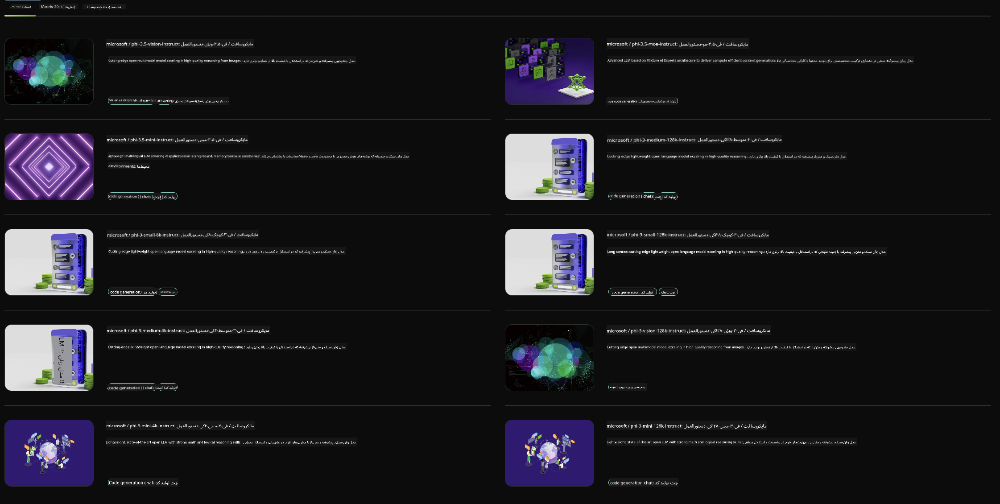

<!--
CO_OP_TRANSLATOR_METADATA:
{
  "original_hash": "7b08e277df2a9307f861ae54bc30c772",
  "translation_date": "2025-05-07T15:07:32+00:00",
  "source_file": "md/01.Introduction/02/06.NVIDIA.md",
  "language_code": "fa"
}
-->
## خانواده Phi در NVIDIA NIM

NVIDIA NIM مجموعه‌ای از میکروسرویس‌های ساده برای استفاده است که به تسریع استقرار مدل‌های هوش مصنوعی مولد در فضای ابری، دیتاسنتر و ایستگاه‌های کاری کمک می‌کند. NIM‌ها بر اساس خانواده مدل و مدل به مدل دسته‌بندی شده‌اند. به عنوان مثال، NVIDIA NIM برای مدل‌های زبان بزرگ (LLM) قدرت پیشرفته‌ترین مدل‌های LLM را به برنامه‌های سازمانی می‌آورد و قابلیت‌های بی‌نظیر پردازش و درک زبان طبیعی را فراهم می‌کند.

NIM این امکان را برای تیم‌های IT و DevOps فراهم می‌کند که مدل‌های زبان بزرگ (LLM) را در محیط‌های مدیریت شده خود به صورت خودمیزبان اجرا کنند و در عین حال به توسعه‌دهندگان APIهای استاندارد صنعتی ارائه دهد تا بتوانند کوپایلوت‌ها، چت‌بات‌ها و دستیارهای هوش مصنوعی قدرتمندی بسازند که کسب‌وکارشان را متحول کنند. با استفاده از شتاب‌دهی GPU پیشرفته NVIDIA و استقرار مقیاس‌پذیر، NIM سریع‌ترین مسیر برای استنتاج با عملکرد بی‌نظیر را ارائه می‌دهد.

شما می‌توانید از NVIDIA NIM برای استنتاج مدل‌های خانواده Phi استفاده کنید



### **نمونه‌ها - Phi-3-Vision در NVIDIA NIM**

تصور کنید یک تصویر (`demo.png`) دارید و می‌خواهید کد پایتونی تولید کنید که این تصویر را پردازش کند و نسخه جدیدی از آن را ذخیره کند (`phi-3-vision.jpg`).

کد بالا این فرآیند را به صورت خودکار انجام می‌دهد با:

1. راه‌اندازی محیط و تنظیمات لازم.
2. ایجاد یک پرامپت که به مدل دستور می‌دهد کد پایتون مورد نیاز را تولید کند.
3. ارسال پرامپت به مدل و جمع‌آوری کد تولید شده.
4. استخراج و اجرای کد تولید شده.
5. نمایش تصاویر اصلی و پردازش شده.

این رویکرد از قدرت هوش مصنوعی برای خودکارسازی وظایف پردازش تصویر استفاده می‌کند و رسیدن به اهداف شما را آسان‌تر و سریع‌تر می‌کند.

[نمونه کد](../../../../../code/06.E2E/E2E_Nvidia_NIM_Phi3_Vision.ipynb)

بیایید گام به گام بررسی کنیم که کل کد چه کاری انجام می‌دهد:

1. **نصب بسته مورد نیاز**:
    ```python
    !pip install langchain_nvidia_ai_endpoints -U
    ```  
    این دستور بسته `langchain_nvidia_ai_endpoints` را نصب می‌کند و مطمئن می‌شود که آخرین نسخه آن است.

2. **وارد کردن ماژول‌های لازم**:
    ```python
    from langchain_nvidia_ai_endpoints import ChatNVIDIA
    import getpass
    import os
    import base64
    ```  
    این واردات ماژول‌های لازم برای تعامل با نقاط انتهایی NVIDIA AI، مدیریت امن رمز عبور، تعامل با سیستم عامل و رمزگذاری/رمزگشایی داده‌ها به فرمت base64 را فراهم می‌کند.

3. **تنظیم کلید API**:
    ```python
    if not os.getenv("NVIDIA_API_KEY"):
        os.environ["NVIDIA_API_KEY"] = getpass.getpass("Enter your NVIDIA API key: ")
    ```  
    این کد بررسی می‌کند که آیا متغیر محیطی `NVIDIA_API_KEY` تنظیم شده است یا خیر. اگر نه، به کاربر به صورت امن درخواست وارد کردن کلید API داده می‌شود.

4. **تعریف مدل و مسیر تصویر**:
    ```python
    model = 'microsoft/phi-3-vision-128k-instruct'
    chat = ChatNVIDIA(model=model)
    img_path = './imgs/demo.png'
    ```  
    این قسمت مدل مورد استفاده را تعیین می‌کند، یک نمونه از `ChatNVIDIA` با مدل مشخص شده ایجاد می‌کند و مسیر فایل تصویر را تعریف می‌کند.

5. **ایجاد پرامپت متنی**:
    ```python
    text = "Please create Python code for image, and use plt to save the new picture under imgs/ and name it phi-3-vision.jpg."
    ```  
    این یک پرامپت متنی تعریف می‌کند که به مدل دستور می‌دهد کد پایتون برای پردازش تصویر تولید کند.

6. **رمزگذاری تصویر به base64**:
    ```python
    with open(img_path, "rb") as f:
        image_b64 = base64.b64encode(f.read()).decode()
    image = f''
    ```  
    این کد فایل تصویر را می‌خواند، آن را به base64 رمزگذاری می‌کند و یک تگ HTML تصویر با داده‌های رمزگذاری شده ایجاد می‌کند.

7. **ترکیب متن و تصویر در پرامپت**:
    ```python
    prompt = f"{text} {image}"
    ```  
    این قسمت پرامپت متنی و تگ تصویر HTML را در یک رشته ترکیب می‌کند.

8. **تولید کد با استفاده از ChatNVIDIA**:
    ```python
    code = ""
    for chunk in chat.stream(prompt):
        print(chunk.content, end="")
        code += chunk.content
    ```  
    این کد پرامپت را به `ChatNVIDIA` model and collects the generated code in chunks, printing and appending each chunk to the `code` ارسال می‌کند.

9. **استخراج کد پایتون از محتوای تولید شده**:
    ```python
    begin = code.index('```python') + 9  
    code = code[begin:]  
    end = code.index('```')
    code = code[:end]
    ```  
    این بخش کد پایتون واقعی را از محتوای تولید شده با حذف قالب‌بندی markdown استخراج می‌کند.

10. **اجرای کد تولید شده**:
    ```python
    import subprocess
    result = subprocess.run(["python", "-c", code], capture_output=True)
    ```  
    این کد کد استخراج شده پایتون را به عنوان یک زیر فرایند اجرا کرده و خروجی آن را دریافت می‌کند.

11. **نمایش تصاویر**:
    ```python
    from IPython.display import Image, display
    display(Image(filename='./imgs/phi-3-vision.jpg'))
    display(Image(filename='./imgs/demo.png'))
    ```  
    این خطوط تصاویر را با استفاده از ماژول `IPython.display` نمایش می‌دهند.

**سلب مسئولیت**:  
این سند با استفاده از سرویس ترجمه هوش مصنوعی [Co-op Translator](https://github.com/Azure/co-op-translator) ترجمه شده است. در حالی که ما در تلاش برای دقت هستیم، لطفاً توجه داشته باشید که ترجمه‌های خودکار ممکن است حاوی خطاها یا نادرستی‌هایی باشند. سند اصلی به زبان بومی خود باید به عنوان منبع معتبر در نظر گرفته شود. برای اطلاعات حیاتی، توصیه می‌شود از ترجمه حرفه‌ای انسانی استفاده شود. ما مسئول هیچ گونه سوء تفاهم یا تفسیر نادرستی که از استفاده این ترجمه ناشی شود، نمی‌باشیم.