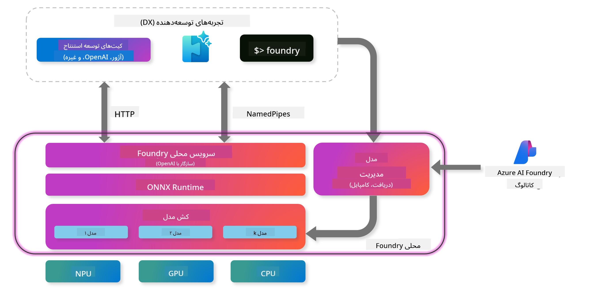
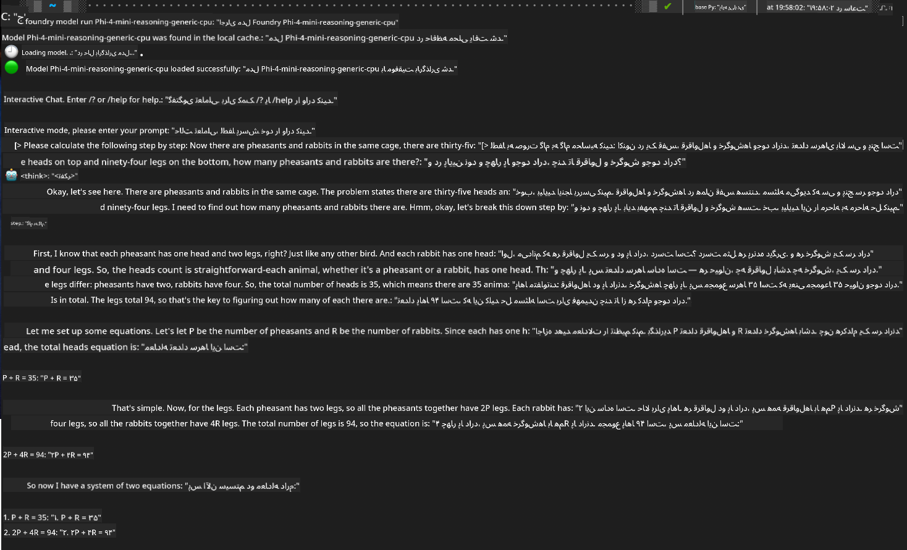

<!--
CO_OP_TRANSLATOR_METADATA:
{
  "original_hash": "52973a5680a65a810aa80b7036afd31f",
  "translation_date": "2025-07-16T19:42:26+00:00",
  "source_file": "md/01.Introduction/02/07.FoundryLocal.md",
  "language_code": "fa"
}
-->
## شروع کار با مدل‌های خانواده Phi در Foundry Local

### معرفی Foundry Local

Foundry Local یک راهکار قدرتمند استنتاج هوش مصنوعی روی دستگاه است که قابلیت‌های هوش مصنوعی سطح سازمانی را مستقیماً به سخت‌افزار محلی شما می‌آورد. این آموزش شما را در راه‌اندازی و استفاده از مدل‌های خانواده Phi با Foundry Local راهنمایی می‌کند و کنترل کامل بر بارهای کاری هوش مصنوعی‌تان را در حالی که حریم خصوصی حفظ شده و هزینه‌ها کاهش می‌یابد، به شما می‌دهد.

Foundry Local با اجرای مدل‌های هوش مصنوعی به صورت محلی روی دستگاه شما، مزایای عملکرد، حفظ حریم خصوصی، سفارشی‌سازی و صرفه‌جویی در هزینه را فراهم می‌کند. این سیستم به‌صورت یکپارچه در جریان‌های کاری و برنامه‌های موجود شما از طریق یک CLI، SDK و REST API کاربرپسند ادغام می‌شود.



### چرا Foundry Local را انتخاب کنیم؟

درک مزایای Foundry Local به شما کمک می‌کند تا تصمیمات آگاهانه‌تری درباره استراتژی استقرار هوش مصنوعی خود بگیرید:

- **استنتاج روی دستگاه:** مدل‌ها را به‌صورت محلی روی سخت‌افزار خود اجرا کنید، هزینه‌ها را کاهش دهید و تمام داده‌ها را روی دستگاه خود نگه دارید.

- **سفارشی‌سازی مدل:** از مدل‌های پیش‌تنظیم شده انتخاب کنید یا مدل خود را برای برآورده کردن نیازها و موارد استفاده خاص به کار ببرید.

- **صرفه‌جویی در هزینه:** با استفاده از سخت‌افزار موجود خود، هزینه‌های مکرر خدمات ابری را حذف کنید و هوش مصنوعی را در دسترس‌تر کنید.

- **ادغام بی‌دردسر:** از طریق SDK، نقاط پایانی API یا CLI به برنامه‌های خود متصل شوید و با رشد نیازها، به آسانی به Azure AI Foundry مقیاس دهید.

> **یادداشت شروع:** این آموزش بر استفاده از Foundry Local از طریق رابط‌های CLI و SDK تمرکز دارد. شما هر دو روش را یاد می‌گیرید تا بهترین روش را برای مورد استفاده خود انتخاب کنید.

## بخش ۱: راه‌اندازی Foundry Local CLI

### گام ۱: نصب

CLI Foundry Local دروازه شما برای مدیریت و اجرای مدل‌های هوش مصنوعی به‌صورت محلی است. بیایید با نصب آن روی سیستم خود شروع کنیم.

**پلتفرم‌های پشتیبانی شده:** ویندوز و macOS

برای دستورالعمل‌های نصب دقیق، لطفاً به [مستندات رسمی Foundry Local](https://github.com/microsoft/Foundry-Local/blob/main/README.md) مراجعه کنید.

### گام ۲: بررسی مدل‌های موجود

پس از نصب Foundry Local CLI، می‌توانید مدل‌های موجود برای مورد استفاده خود را کشف کنید. این دستور تمام مدل‌های پشتیبانی شده را به شما نشان می‌دهد:

```bash
foundry model list
```

### گام ۳: آشنایی با مدل‌های خانواده Phi

خانواده Phi مجموعه‌ای از مدل‌ها را ارائه می‌دهد که برای موارد استفاده و پیکربندی‌های سخت‌افزاری مختلف بهینه شده‌اند. مدل‌های Phi موجود در Foundry Local عبارتند از:

**مدل‌های Phi موجود:**

- **phi-3.5-mini** - مدل جمع‌وجور برای وظایف پایه
- **phi-3-mini-128k** - نسخه با زمینه گسترده‌تر برای مکالمات طولانی‌تر
- **phi-3-mini-4k** - مدل با زمینه استاندارد برای استفاده عمومی
- **phi-4** - مدل پیشرفته با قابلیت‌های بهبود یافته
- **phi-4-mini** - نسخه سبک‌تر Phi-4
- **phi-4-mini-reasoning** - تخصصی برای وظایف استدلال پیچیده

> **سازگاری سخت‌افزاری:** هر مدل می‌تواند برای شتاب‌دهی سخت‌افزاری مختلف (CPU، GPU) بسته به قابلیت‌های سیستم شما پیکربندی شود.

### گام ۴: اجرای اولین مدل Phi

بیایید با یک مثال عملی شروع کنیم. مدل `phi-4-mini-reasoning` را اجرا می‌کنیم که در حل مسائل پیچیده به صورت گام‌به‌گام بسیار خوب عمل می‌کند.

**دستور اجرای مدل:**

```bash
foundry model run Phi-4-mini-reasoning-generic-cpu
```

> **راه‌اندازی اولیه:** هنگام اجرای مدل برای اولین بار، Foundry Local به‌طور خودکار آن را روی دستگاه محلی شما دانلود می‌کند. زمان دانلود بسته به سرعت شبکه شما متفاوت است، پس لطفاً در طول راه‌اندازی اولیه صبور باشید.

### گام ۵: آزمایش مدل با یک مسئله واقعی

حالا بیایید مدل خود را با یک مسئله منطقی کلاسیک آزمایش کنیم تا ببینیم چگونه استدلال گام‌به‌گام را انجام می‌دهد:

**مسئله نمونه:**

```txt
Please calculate the following step by step: Now there are pheasants and rabbits in the same cage, there are thirty-five heads on top and ninety-four legs on the bottom, how many pheasants and rabbits are there?
```

**رفتار مورد انتظار:** مدل باید این مسئله را به گام‌های منطقی تقسیم کند و با استفاده از این واقعیت که قرقاول‌ها ۲ پا و خرگوش‌ها ۴ پا دارند، سیستم معادلات را حل کند.

**نتایج:**



## بخش ۲: ساخت برنامه‌ها با Foundry Local SDK

### چرا از SDK استفاده کنیم؟

در حالی که CLI برای آزمایش و تعاملات سریع عالی است، SDK به شما امکان می‌دهد Foundry Local را به‌صورت برنامه‌نویسی در برنامه‌های خود ادغام کنید. این امکان‌ها را فراهم می‌کند برای:

- ساخت برنامه‌های سفارشی مبتنی بر هوش مصنوعی
- ایجاد جریان‌های کاری خودکار
- ادغام قابلیت‌های هوش مصنوعی در سیستم‌های موجود
- توسعه چت‌بات‌ها و ابزارهای تعاملی

### زبان‌های برنامه‌نویسی پشتیبانی شده

Foundry Local پشتیبانی SDK را برای چندین زبان برنامه‌نویسی ارائه می‌دهد تا با ترجیحات توسعه شما سازگار باشد:

**📦 SDKهای موجود:**

- **C# (.NET):** [مستندات و مثال‌های SDK](https://github.com/microsoft/Foundry-Local/tree/main/sdk/cs)
- **Python:** [مستندات و مثال‌های SDK](https://github.com/microsoft/Foundry-Local/tree/main/sdk/python)
- **JavaScript:** [مستندات و مثال‌های SDK](https://github.com/microsoft/Foundry-Local/tree/main/sdk/js)
- **Rust:** [مستندات و مثال‌های SDK](https://github.com/microsoft/Foundry-Local/tree/main/sdk/rust)

### مراحل بعدی

1. **SDK مورد علاقه خود را** بر اساس محیط توسعه خود انتخاب کنید
2. **مستندات مخصوص SDK را** برای راهنمایی‌های دقیق پیاده‌سازی دنبال کنید
3. **با مثال‌های ساده شروع کنید** قبل از ساخت برنامه‌های پیچیده
4. **کد نمونه ارائه شده** در هر مخزن SDK را بررسی کنید

## نتیجه‌گیری

اکنون یاد گرفته‌اید که چگونه:
- ✅ Foundry Local CLI را نصب و راه‌اندازی کنید
- ✅ مدل‌های خانواده Phi را کشف و اجرا کنید
- ✅ مدل‌ها را با مسائل واقعی آزمایش کنید
- ✅ گزینه‌های SDK برای توسعه برنامه را درک کنید

Foundry Local پایه‌ای قدرتمند برای آوردن قابلیت‌های هوش مصنوعی مستقیماً به محیط محلی شما فراهم می‌کند، کنترل عملکرد، حفظ حریم خصوصی و هزینه‌ها را به شما می‌دهد و در عین حال انعطاف‌پذیری لازم برای مقیاس‌پذیری به راه‌حل‌های ابری را حفظ می‌کند.

**سلب مسئولیت**:  
این سند با استفاده از سرویس ترجمه هوش مصنوعی [Co-op Translator](https://github.com/Azure/co-op-translator) ترجمه شده است. در حالی که ما در تلاش برای دقت هستیم، لطفاً توجه داشته باشید که ترجمه‌های خودکار ممکن است حاوی خطاها یا نواقصی باشند. سند اصلی به زبان بومی خود باید به عنوان منبع معتبر در نظر گرفته شود. برای اطلاعات حیاتی، ترجمه حرفه‌ای انسانی توصیه می‌شود. ما مسئول هیچ گونه سوءتفاهم یا تفسیر نادرستی که از استفاده این ترجمه ناشی شود، نیستیم.