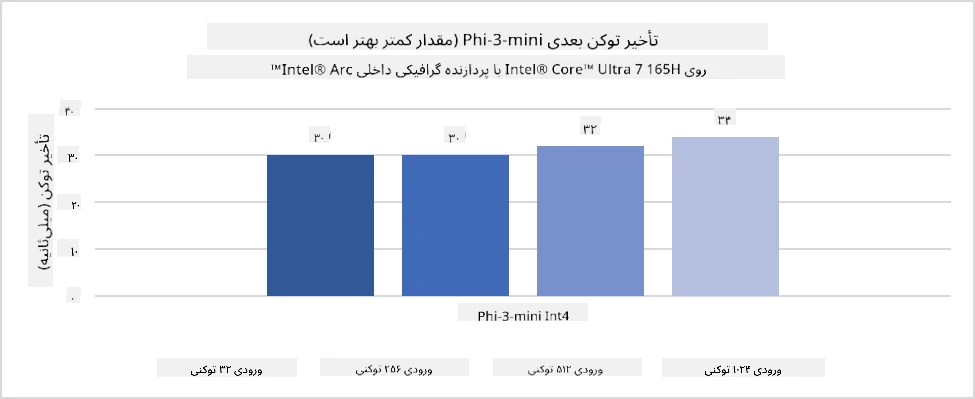
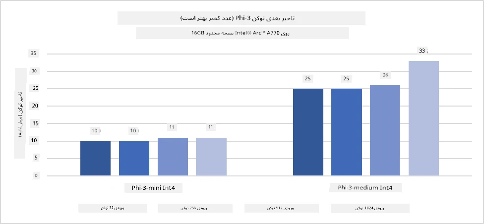
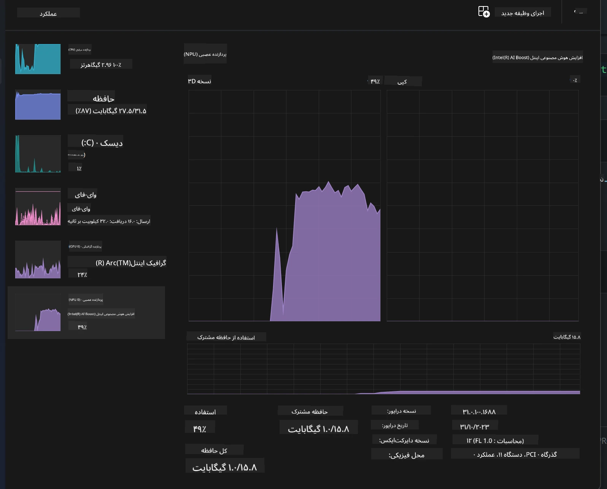
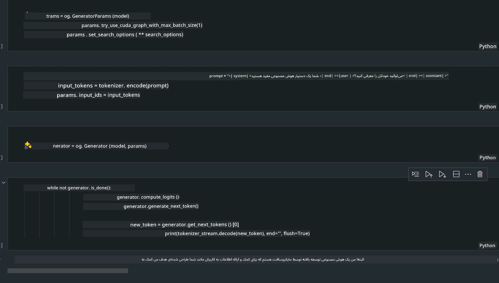
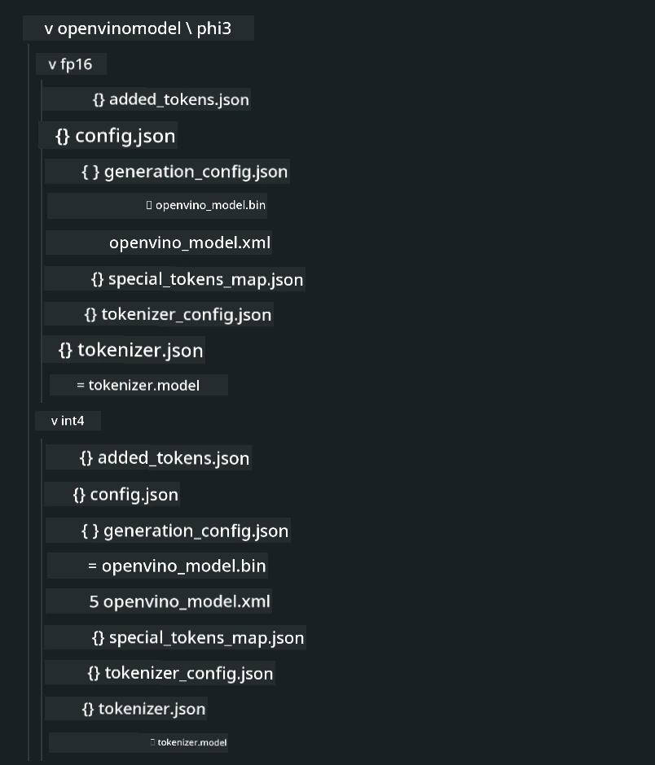
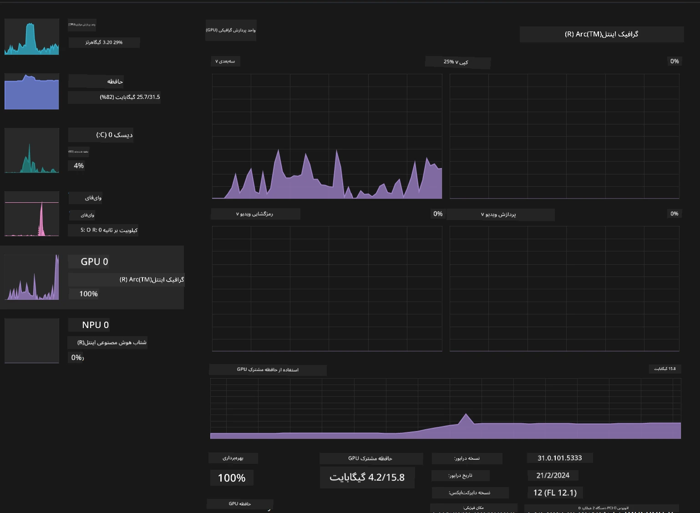

# **استنتاج Phi-3 در کامپیوترهای هوش مصنوعی**

با پیشرفت هوش مصنوعی مولد و بهبود قابلیت‌های سخت‌افزاری دستگاه‌های لبه‌ای، تعداد بیشتری از مدل‌های هوش مصنوعی مولد اکنون می‌توانند در دستگاه‌های Bring Your Own Device (BYOD) کاربران ادغام شوند. کامپیوترهای هوش مصنوعی از جمله این مدل‌ها هستند. از سال ۲۰۲۴، شرکت‌های Intel، AMD و Qualcomm با تولیدکنندگان کامپیوتر همکاری کرده‌اند تا کامپیوترهای هوش مصنوعی را معرفی کنند که از طریق تغییرات سخت‌افزاری، استقرار مدل‌های هوش مصنوعی مولد محلی را تسهیل می‌کنند. در این بحث، تمرکز ما بر کامپیوترهای هوش مصنوعی اینتل خواهد بود و نحوه استقرار Phi-3 روی یک کامپیوتر هوش مصنوعی اینتل را بررسی خواهیم کرد.

### NPU چیست

NPU (واحد پردازش عصبی) یک پردازنده یا واحد پردازشی اختصاصی در یک SoC بزرگ‌تر است که به طور خاص برای تسریع عملیات شبکه‌های عصبی و وظایف هوش مصنوعی طراحی شده است. برخلاف CPUها و GPUهای عمومی، NPUها برای محاسبات موازی مبتنی بر داده بهینه شده‌اند و در پردازش حجم عظیمی از داده‌های چندرسانه‌ای مانند ویدیوها و تصاویر و همچنین داده‌های شبکه‌های عصبی بسیار کارآمد هستند. آن‌ها به ویژه در انجام وظایف مرتبط با هوش مصنوعی مانند تشخیص گفتار، تار کردن پس‌زمینه در تماس‌های ویدیویی و فرآیندهای ویرایش عکس یا ویدیو مانند تشخیص اشیاء مهارت دارند.

## مقایسه NPU و GPU

در حالی که بسیاری از بارهای کاری هوش مصنوعی و یادگیری ماشین روی GPUها اجرا می‌شوند، تفاوت مهمی بین GPU و NPU وجود دارد.  
GPUها به خاطر قابلیت‌های محاسبات موازی شناخته شده‌اند، اما همه GPUها در پردازش فراتر از گرافیک به یک اندازه کارآمد نیستند. از سوی دیگر، NPUها به طور خاص برای محاسبات پیچیده مربوط به عملیات شبکه‌های عصبی ساخته شده‌اند و در انجام وظایف هوش مصنوعی بسیار مؤثرند.

خلاصه اینکه، NPUها نابغه‌های ریاضی هستند که محاسبات هوش مصنوعی را سرعت می‌بخشند و نقش کلیدی در عصر نوظهور کامپیوترهای هوش مصنوعی ایفا می‌کنند!

***این مثال بر اساس جدیدترین پردازنده Intel Core Ultra اینتل است***

## **۱. استفاده از NPU برای اجرای مدل Phi-3**

دستگاه Intel® NPU یک شتاب‌دهنده استنتاج هوش مصنوعی است که با CPUهای مشتری اینتل، از نسل Intel® Core™ Ultra (که قبلاً با نام Meteor Lake شناخته می‌شد) یکپارچه شده است. این دستگاه اجرای انرژی‌موثر وظایف شبکه عصبی مصنوعی را ممکن می‌سازد.





**کتابخانه شتاب‌دهنده Intel NPU**

کتابخانه شتاب‌دهنده Intel NPU [https://github.com/intel/intel-npu-acceleration-library](https://github.com/intel/intel-npu-acceleration-library) یک کتابخانه پایتون است که برای افزایش کارایی برنامه‌های شما با بهره‌گیری از قدرت واحد پردازش عصبی اینتل (NPU) جهت انجام محاسبات سریع روی سخت‌افزار سازگار طراحی شده است.

نمونه‌ای از Phi-3-mini روی کامپیوتر هوش مصنوعی مجهز به پردازنده‌های Intel® Core™ Ultra.


نصب کتابخانه پایتون با pip

```bash

   pip install intel-npu-acceleration-library

```

***توجه*** پروژه هنوز در حال توسعه است، اما مدل مرجع در حال حاضر بسیار کامل است.

### **اجرای Phi-3 با کتابخانه شتاب‌دهنده Intel NPU**

با استفاده از شتاب‌دهی NPU اینتل، این کتابخانه فرآیند رمزگذاری سنتی را تحت تأثیر قرار نمی‌دهد. شما فقط نیاز دارید که این کتابخانه را برای کم‌حجم‌سازی مدل اصلی Phi-3 به کار ببرید، مانند FP16، INT8، INT4، به صورت زیر:

```python
from transformers import AutoTokenizer, pipeline,TextStreamer
from intel_npu_acceleration_library import NPUModelForCausalLM, int4
from intel_npu_acceleration_library.compiler import CompilerConfig
import warnings

model_id = "microsoft/Phi-3-mini-4k-instruct"

compiler_conf = CompilerConfig(dtype=int4)
model = NPUModelForCausalLM.from_pretrained(
    model_id, use_cache=True, config=compiler_conf, attn_implementation="sdpa"
).eval()

tokenizer = AutoTokenizer.from_pretrained(model_id)

text_streamer = TextStreamer(tokenizer, skip_prompt=True)
```

پس از موفقیت در کم‌حجم‌سازی، اجرای برنامه را ادامه دهید تا NPU فراخوانی شده و مدل Phi-3 اجرا شود.

```python
generation_args = {
   "max_new_tokens": 1024,
   "return_full_text": False,
   "temperature": 0.3,
   "do_sample": False,
   "streamer": text_streamer,
}

pipe = pipeline(
   "text-generation",
   model=model,
   tokenizer=tokenizer,
)

query = "<|system|>You are a helpful AI assistant.<|end|><|user|>Can you introduce yourself?<|end|><|assistant|>"

with warnings.catch_warnings():
    warnings.simplefilter("ignore")
    pipe(query, **generation_args)
```

در هنگام اجرای کد، می‌توانیم وضعیت اجرای NPU را از طریق Task Manager مشاهده کنیم.



***نمونه‌ها*** : [AIPC_NPU_DEMO.ipynb](../../../../../code/03.Inference/AIPC/AIPC_NPU_DEMO.ipynb)

## **۲. استفاده از DirectML + ONNX Runtime برای اجرای مدل Phi-3**

### **DirectML چیست**

[DirectML](https://github.com/microsoft/DirectML) یک کتابخانه DirectX 12 با شتاب سخت‌افزاری و عملکرد بالا برای یادگیری ماشین است. DirectML شتاب GPU را برای وظایف رایج یادگیری ماشین روی طیف گسترده‌ای از سخت‌افزارها و درایورها، از جمله تمام GPUهای سازگار با DirectX 12 از تولیدکنندگانی مانند AMD، اینتل، NVIDIA و Qualcomm فراهم می‌کند.

وقتی به صورت مستقل استفاده شود، API DirectML یک کتابخانه سطح پایین DirectX 12 است و برای برنامه‌های با عملکرد بالا و تأخیر کم مانند فریم‌ورک‌ها، بازی‌ها و سایر برنامه‌های زمان واقعی مناسب است. همکاری بی‌وقفه DirectML با Direct3D 12 و همچنین سربار کم و تطابق آن در سخت‌افزارهای مختلف، DirectML را برای تسریع یادگیری ماشین ایده‌آل می‌کند، به ویژه زمانی که هم عملکرد بالا مورد نیاز است و هم اطمینان و پیش‌بینی‌پذیری نتایج در سخت‌افزارهای مختلف اهمیت دارد.

***توجه*** : آخرین نسخه DirectML از NPU پشتیبانی می‌کند (https://devblogs.microsoft.com/directx/introducing-neural-processor-unit-npu-support-in-directml-developer-preview/)

### مقایسه DirectML و CUDA از نظر قابلیت‌ها و عملکرد:

**DirectML** یک کتابخانه یادگیری ماشین توسعه یافته توسط مایکروسافت است که برای تسریع بارهای کاری یادگیری ماشین روی دستگاه‌های ویندوزی، از جمله دسکتاپ، لپ‌تاپ و دستگاه‌های لبه‌ای طراحی شده است.  
- مبتنی بر DX12: DirectML بر پایه DirectX 12 ساخته شده که پشتیبانی گسترده‌ای از سخت‌افزارهای مختلف GPU، از جمله NVIDIA و AMD ارائه می‌دهد.  
- پشتیبانی گسترده‌تر: از آنجا که از DX12 استفاده می‌کند، DirectML می‌تواند با هر GPU که از DX12 پشتیبانی می‌کند، حتی GPUهای مجتمع کار کند.  
- پردازش تصویر: DirectML تصاویر و داده‌های دیگر را با استفاده از شبکه‌های عصبی پردازش می‌کند و برای وظایفی مانند شناسایی تصویر، تشخیص اشیاء و غیره مناسب است.  
- سهولت راه‌اندازی: راه‌اندازی DirectML ساده است و نیازی به SDK یا کتابخانه‌های خاص از تولیدکنندگان GPU ندارد.  
- عملکرد: در برخی موارد، DirectML عملکرد خوبی دارد و می‌تواند سریع‌تر از CUDA باشد، به ویژه برای برخی بارهای کاری خاص.  
- محدودیت‌ها: با این حال، در مواردی ممکن است DirectML کندتر باشد، به خصوص برای اندازه‌های بزرگ دسته‌ای float16.

**CUDA** پلتفرم محاسبات موازی و مدل برنامه‌نویسی انویدیا است که به توسعه‌دهندگان اجازه می‌دهد از قدرت GPUهای NVIDIA برای محاسبات عمومی، از جمله یادگیری ماشین و شبیه‌سازی‌های علمی بهره ببرند.  
- مخصوص NVIDIA: CUDA به طور خاص برای GPUهای NVIDIA طراحی شده و با آن‌ها یکپارچه است.  
- بهینه‌سازی بالا: عملکرد بسیار خوبی برای وظایف شتاب‌یافته GPU، به ویژه با استفاده از GPUهای NVIDIA ارائه می‌دهد.  
- استفاده گسترده: بسیاری از فریم‌ورک‌ها و کتابخانه‌های یادگیری ماشین (مانند TensorFlow و PyTorch) از CUDA پشتیبانی می‌کنند.  
- قابلیت سفارشی‌سازی: توسعه‌دهندگان می‌توانند تنظیمات CUDA را برای وظایف خاص بهینه کنند که منجر به عملکرد بهینه می‌شود.  
- محدودیت‌ها: وابستگی CUDA به سخت‌افزار NVIDIA می‌تواند محدودکننده باشد اگر به دنبال سازگاری گسترده‌تر با GPUهای مختلف باشید.

### انتخاب بین DirectML و CUDA

انتخاب بین DirectML و CUDA بستگی به مورد استفاده خاص، سخت‌افزار موجود و ترجیحات شما دارد.  
اگر به دنبال سازگاری گسترده‌تر و سهولت راه‌اندازی هستید، DirectML گزینه مناسبی است. اما اگر GPUهای NVIDIA دارید و به عملکرد بهینه نیاز دارید، CUDA همچنان گزینه قدرتمندی است. در مجموع، هر دو DirectML و CUDA نقاط قوت و ضعف خود را دارند، بنابراین هنگام تصمیم‌گیری نیازها و سخت‌افزار موجود را در نظر بگیرید.

### **هوش مصنوعی مولد با ONNX Runtime**

در عصر هوش مصنوعی، قابلیت حمل مدل‌های هوش مصنوعی بسیار مهم است. ONNX Runtime به راحتی می‌تواند مدل‌های آموزش‌دیده را روی دستگاه‌های مختلف مستقر کند. توسعه‌دهندگان نیازی به توجه به چارچوب استنتاج ندارند و می‌توانند با استفاده از یک API یکپارچه، استنتاج مدل را انجام دهند. در عصر هوش مصنوعی مولد، ONNX Runtime همچنین بهینه‌سازی کد انجام داده است (https://onnxruntime.ai/docs/genai/). از طریق ONNX Runtime بهینه‌شده، مدل هوش مصنوعی مولد کم‌حجم‌شده می‌تواند روی ترمینال‌های مختلف استنتاج شود. در هوش مصنوعی مولد با ONNX Runtime، می‌توانید از API مدل هوش مصنوعی از طریق پایتون، C#، C / C++ استفاده کنید. البته، استقرار روی آیفون می‌تواند از API هوش مصنوعی مولد ONNX Runtime در C++ بهره ببرد.

[نمونه کد](https://github.com/Azure-Samples/Phi-3MiniSamples/tree/main/onnx)

***کامپایل کتابخانه هوش مصنوعی مولد با ONNX Runtime***

```bash

winget install --id=Kitware.CMake  -e

git clone https://github.com/microsoft/onnxruntime.git

cd .\onnxruntime\

./build.bat --build_shared_lib --skip_tests --parallel --use_dml --config Release

cd ../

git clone https://github.com/microsoft/onnxruntime-genai.git

cd .\onnxruntime-genai\

mkdir ort

cd ort

mkdir include

mkdir lib

copy ..\onnxruntime\include\onnxruntime\core\providers\dml\dml_provider_factory.h ort\include

copy ..\onnxruntime\include\onnxruntime\core\session\onnxruntime_c_api.h ort\include

copy ..\onnxruntime\build\Windows\Release\Release\*.dll ort\lib

copy ..\onnxruntime\build\Windows\Release\Release\onnxruntime.lib ort\lib

python build.py --use_dml


```

**نصب کتابخانه**

```bash

pip install .\onnxruntime_genai_directml-0.3.0.dev0-cp310-cp310-win_amd64.whl

```

این نتیجه اجرای برنامه است



***نمونه‌ها*** : [AIPC_DirectML_DEMO.ipynb](../../../../../code/03.Inference/AIPC/AIPC_DirectML_DEMO.ipynb)

## **۳. استفاده از Intel OpenVino برای اجرای مدل Phi-3**

### **OpenVINO چیست**

[OpenVINO](https://github.com/openvinotoolkit/openvino) یک کیت ابزار متن‌باز برای بهینه‌سازی و استقرار مدل‌های یادگیری عمیق است. این ابزار عملکرد یادگیری عمیق را برای مدل‌های بینایی، صوت و زبان از فریم‌ورک‌های محبوبی مانند TensorFlow، PyTorch و غیره افزایش می‌دهد. با OpenVINO شروع کنید. OpenVINO همچنین می‌تواند به صورت ترکیبی با CPU و GPU برای اجرای مدل Phi-3 استفاده شود.

***توجه***: در حال حاضر، OpenVINO از NPU پشتیبانی نمی‌کند.

### **نصب کتابخانه OpenVINO**

```bash

 pip install git+https://github.com/huggingface/optimum-intel.git

 pip install git+https://github.com/openvinotoolkit/nncf.git

 pip install openvino-nightly

```

### **اجرای Phi-3 با OpenVINO**

مانند NPU، OpenVINO با اجرای مدل‌های کم‌حجم‌شده، فراخوانی مدل‌های هوش مصنوعی مولد را انجام می‌دهد. ابتدا باید مدل Phi-3 را کم‌حجم کنیم و کم‌حجم‌سازی مدل را از طریق خط فرمان با optimum-cli انجام دهیم.

**INT4**

```bash

optimum-cli export openvino --model "microsoft/Phi-3-mini-4k-instruct" --task text-generation-with-past --weight-format int4 --group-size 128 --ratio 0.6  --sym  --trust-remote-code ./openvinomodel/phi3/int4

```

**FP16**

```bash

optimum-cli export openvino --model "microsoft/Phi-3-mini-4k-instruct" --task text-generation-with-past --weight-format fp16 --trust-remote-code ./openvinomodel/phi3/fp16

```

فرمت تبدیل شده، مانند تصویر زیر است



مسیرهای مدل (model_dir)، پیکربندی‌های مرتبط (ov_config = {"PERFORMANCE_HINT": "LATENCY", "NUM_STREAMS": "1", "CACHE_DIR": ""}) و دستگاه‌های شتاب‌دهنده سخت‌افزاری (GPU.0) را از طریق OVModelForCausalLM بارگذاری کنید.

```python

ov_model = OVModelForCausalLM.from_pretrained(
     model_dir,
     device='GPU.0',
     ov_config=ov_config,
     config=AutoConfig.from_pretrained(model_dir, trust_remote_code=True),
     trust_remote_code=True,
)

```

در هنگام اجرای کد، می‌توانیم وضعیت اجرای GPU را از طریق Task Manager مشاهده کنیم.



***نمونه‌ها*** : [AIPC_OpenVino_Demo.ipynb](../../../../../code/03.Inference/AIPC/AIPC_OpenVino_Demo.ipynb)

### ***توجه*** : هر سه روش بالا مزایای خاص خود را دارند، اما توصیه می‌شود برای استنتاج در کامپیوترهای هوش مصنوعی از شتاب‌دهی NPU استفاده شود.

**سلب مسئولیت**:  
این سند با استفاده از سرویس ترجمه هوش مصنوعی [Co-op Translator](https://github.com/Azure/co-op-translator) ترجمه شده است. در حالی که ما در تلاش برای دقت هستیم، لطفاً توجه داشته باشید که ترجمه‌های خودکار ممکن است حاوی خطاها یا نواقصی باشند. سند اصلی به زبان بومی خود باید به عنوان منبع معتبر در نظر گرفته شود. برای اطلاعات حیاتی، ترجمه حرفه‌ای انسانی توصیه می‌شود. ما مسئول هیچ گونه سوءتفاهم یا تفسیر نادرستی که از استفاده از این ترجمه ناشی شود، نیستیم.