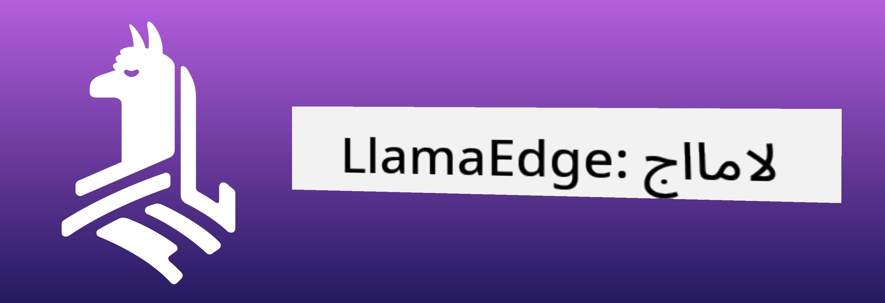
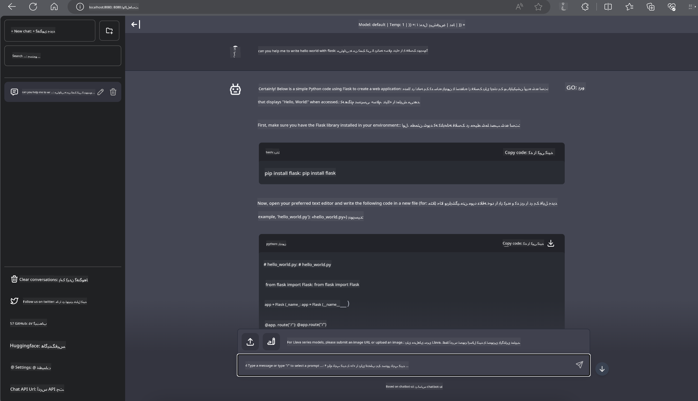

<!--
CO_OP_TRANSLATOR_METADATA:
{
  "original_hash": "be4101a30d98e95a71d42c276e8bcd37",
  "translation_date": "2025-05-07T14:27:40+00:00",
  "source_file": "md/01.Introduction/03/Jetson_Inference.md",
  "language_code": "fa"
}
-->
# **استنتاج Phi-3 در Nvidia Jetson**

Nvidia Jetson سری‌ای از بردهای محاسباتی توکار از شرکت Nvidia است. مدل‌های Jetson TK1، TX1 و TX2 همگی دارای پردازنده Tegra (یا SoC) از Nvidia هستند که واحد پردازش مرکزی (CPU) با معماری ARM را در خود جای داده‌اند. Jetson سیستمی کم‌مصرف است و برای تسریع برنامه‌های یادگیری ماشین طراحی شده است. Nvidia Jetson توسط توسعه‌دهندگان حرفه‌ای برای خلق محصولات پیشرفته هوش مصنوعی در تمامی صنایع استفاده می‌شود و همچنین توسط دانشجویان و علاقه‌مندان برای یادگیری عملی هوش مصنوعی و ساخت پروژه‌های شگفت‌انگیز به کار می‌رود. SLM در دستگاه‌های لبه‌ای مانند Jetson مستقر می‌شود که اجرای بهتر سناریوهای کاربردی هوش مصنوعی مولد صنعتی را ممکن می‌سازد.

## استقرار روی NVIDIA Jetson:
توسعه‌دهندگانی که روی رباتیک خودران و دستگاه‌های توکار کار می‌کنند، می‌توانند از Phi-3 Mini بهره ببرند. اندازه نسبتاً کوچک Phi-3 آن را برای استقرار در لبه ایده‌آل می‌کند. پارامترها در طول آموزش با دقت تنظیم شده‌اند تا دقت بالایی در پاسخ‌ها تضمین شود.

### بهینه‌سازی TensorRT-LLM:
کتابخانه [TensorRT-LLM شرکت NVIDIA](https://github.com/NVIDIA/TensorRT-LLM?WT.mc_id=aiml-138114-kinfeylo) استنتاج مدل‌های زبان بزرگ را بهینه می‌کند. این کتابخانه از پنجره زمینه بلند Phi-3 Mini پشتیبانی می‌کند و هم توان عملیاتی و هم تأخیر را بهبود می‌بخشد. بهینه‌سازی‌ها شامل تکنیک‌هایی مانند LongRoPE، FP8 و پردازش دسته‌ای در حال اجرا هستند.

### دسترسی و استقرار:
توسعه‌دهندگان می‌توانند Phi-3 Mini با پنجره زمینه ۱۲۸K را در [NVIDIA AI](https://www.nvidia.com/en-us/ai-data-science/generative-ai/) بررسی کنند. این مدل به صورت یک NIM از NVIDIA بسته‌بندی شده است، یک میکروسرویس با API استاندارد که می‌توان آن را در هر جایی مستقر کرد. همچنین، پیاده‌سازی‌های [TensorRT-LLM در گیت‌هاب](https://github.com/NVIDIA/TensorRT-LLM) موجود است.

## **۱. آماده‌سازی**

a. Jetson Orin NX / Jetson NX

b. JetPack 5.1.2+

c. Cuda 11.8

d. Python 3.8+

## **۲. اجرای Phi-3 در Jetson**

می‌توانیم از [Ollama](https://ollama.com) یا [LlamaEdge](https://llamaedge.com) استفاده کنیم.

اگر می‌خواهید gguf را همزمان در فضای ابری و دستگاه‌های لبه‌ای به کار ببرید، LlamaEdge را می‌توان مانند WasmEdge در نظر گرفت (WasmEdge یک محیط اجرای WebAssembly سبک‌وزن، با کارایی بالا و مقیاس‌پذیر است که برای برنامه‌های ابری بومی، لبه و غیرمتمرکز مناسب است. این محیط از برنامه‌های بدون سرور، توابع توکار، میکروسرویس‌ها، قراردادهای هوشمند و دستگاه‌های IoT پشتیبانی می‌کند. شما می‌توانید مدل کمی‌شده gguf را از طریق LlamaEdge به دستگاه‌های لبه‌ای و فضای ابری مستقر کنید).



مراحل استفاده به شرح زیر است:

1. نصب و دانلود کتابخانه‌ها و فایل‌های مرتبط

```bash

curl -sSf https://raw.githubusercontent.com/WasmEdge/WasmEdge/master/utils/install.sh | bash -s -- --plugin wasi_nn-ggml

curl -LO https://github.com/LlamaEdge/LlamaEdge/releases/latest/download/llama-api-server.wasm

curl -LO https://github.com/LlamaEdge/chatbot-ui/releases/latest/download/chatbot-ui.tar.gz

tar xzf chatbot-ui.tar.gz

```

**توجه**: فایل‌های llama-api-server.wasm و chatbot-ui باید در یک پوشه قرار داشته باشند

2. اجرای اسکریپت‌ها در ترمینال

```bash

wasmedge --dir .:. --nn-preload default:GGML:AUTO:{Your gguf path} llama-api-server.wasm -p phi-3-chat

```

نتیجه اجرای برنامه به شکل زیر است



***نمونه کد*** [Phi-3 mini WASM Notebook Sample](https://github.com/Azure-Samples/Phi-3MiniSamples/tree/main/wasm)

در مجموع، Phi-3 Mini جهشی در مدل‌سازی زبان است که کارایی، آگاهی زمینه‌ای و قدرت بهینه‌سازی NVIDIA را ترکیب می‌کند. چه در حال ساخت ربات باشید و چه برنامه‌های لبه‌ای، Phi-3 Mini ابزاری قدرتمند است که باید آن را بشناسید.

**سلب مسئولیت**:  
این سند با استفاده از سرویس ترجمه هوش مصنوعی [Co-op Translator](https://github.com/Azure/co-op-translator) ترجمه شده است. در حالی که ما برای دقت تلاش می‌کنیم، لطفاً توجه داشته باشید که ترجمه‌های خودکار ممکن است حاوی اشتباهات یا نادرستی‌هایی باشند. سند اصلی به زبان بومی خود باید به عنوان منبع معتبر در نظر گرفته شود. برای اطلاعات حیاتی، ترجمه حرفه‌ای انسانی توصیه می‌شود. ما مسئول هیچ گونه سوءتفاهم یا تفسیر نادرستی که از استفاده این ترجمه ناشی شود، نیستیم.