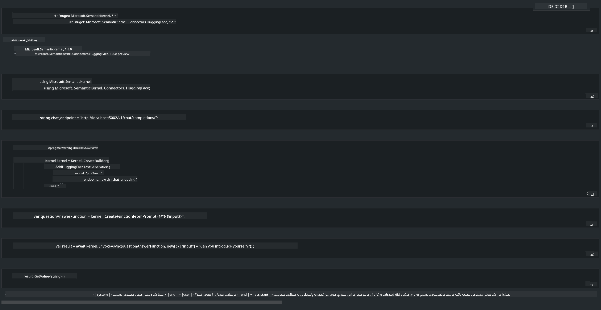

<!--
CO_OP_TRANSLATOR_METADATA:
{
  "original_hash": "bcf5dd7031db0031abdb9dd0c05ba118",
  "translation_date": "2025-07-16T20:55:18+00:00",
  "source_file": "md/01.Introduction/03/Local_Server_Inference.md",
  "language_code": "fa"
}
-->
# **استنتاج Phi-3 در سرور محلی**

ما می‌توانیم Phi-3 را روی یک سرور محلی مستقر کنیم. کاربران می‌توانند از راه‌حل‌های [Ollama](https://ollama.com) یا [LM Studio](https://llamaedge.com) استفاده کنند، یا خودشان کد بنویسند. شما می‌توانید خدمات محلی Phi-3 را از طریق [Semantic Kernel](https://github.com/microsoft/semantic-kernel?WT.mc_id=aiml-138114-kinfeylo) یا [Langchain](https://www.langchain.com/) متصل کنید تا برنامه‌های Copilot بسازید.

## **استفاده از Semantic Kernel برای دسترسی به Phi-3-mini**

در برنامه Copilot، ما برنامه‌ها را از طریق Semantic Kernel / LangChain ایجاد می‌کنیم. این نوع چارچوب برنامه‌نویسی معمولاً با Azure OpenAI Service / مدل‌های OpenAI سازگار است و همچنین می‌تواند از مدل‌های متن‌باز روی Hugging Face و مدل‌های محلی پشتیبانی کند. اگر بخواهیم از Semantic Kernel برای دسترسی به Phi-3-mini استفاده کنیم، چه باید بکنیم؟ به عنوان مثال در .NET، می‌توانیم آن را با Hugging Face Connector در Semantic Kernel ترکیب کنیم. به طور پیش‌فرض، این اتصال با شناسه مدل روی Hugging Face مطابقت دارد (اولین بار که استفاده می‌کنید، مدل از Hugging Face دانلود می‌شود که زمان‌بر است). همچنین می‌توانید به سرویس محلی ساخته شده متصل شوید. در مقایسه این دو، ما استفاده از گزینه دوم را توصیه می‌کنیم چون استقلال بیشتری دارد، به‌ویژه در برنامه‌های سازمانی.

از شکل مشخص است که دسترسی به خدمات محلی از طریق Semantic Kernel به راحتی می‌تواند به سرور مدل Phi-3-mini ساخته شده توسط خودتان متصل شود. در اینجا نتیجه اجرای آن آمده است:

***نمونه کد*** https://github.com/kinfey/Phi3MiniSamples/tree/main/semantickernel

**سلب مسئولیت**:  
این سند با استفاده از سرویس ترجمه هوش مصنوعی [Co-op Translator](https://github.com/Azure/co-op-translator) ترجمه شده است. در حالی که ما در تلاش برای دقت هستیم، لطفاً توجه داشته باشید که ترجمه‌های خودکار ممکن است حاوی خطاها یا نواقصی باشند. سند اصلی به زبان بومی خود باید به عنوان منبع معتبر در نظر گرفته شود. برای اطلاعات حیاتی، ترجمه حرفه‌ای انسانی توصیه می‌شود. ما مسئول هیچ گونه سوءتفاهم یا تفسیر نادرستی که از استفاده این ترجمه ناشی شود، نیستیم.