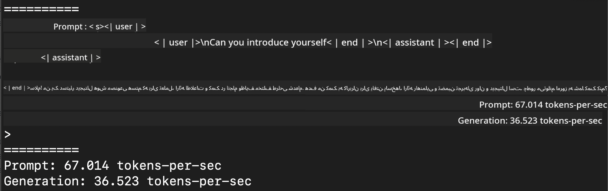
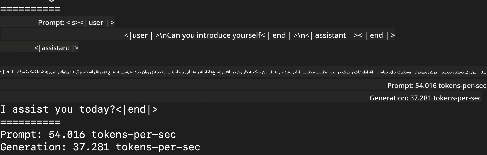
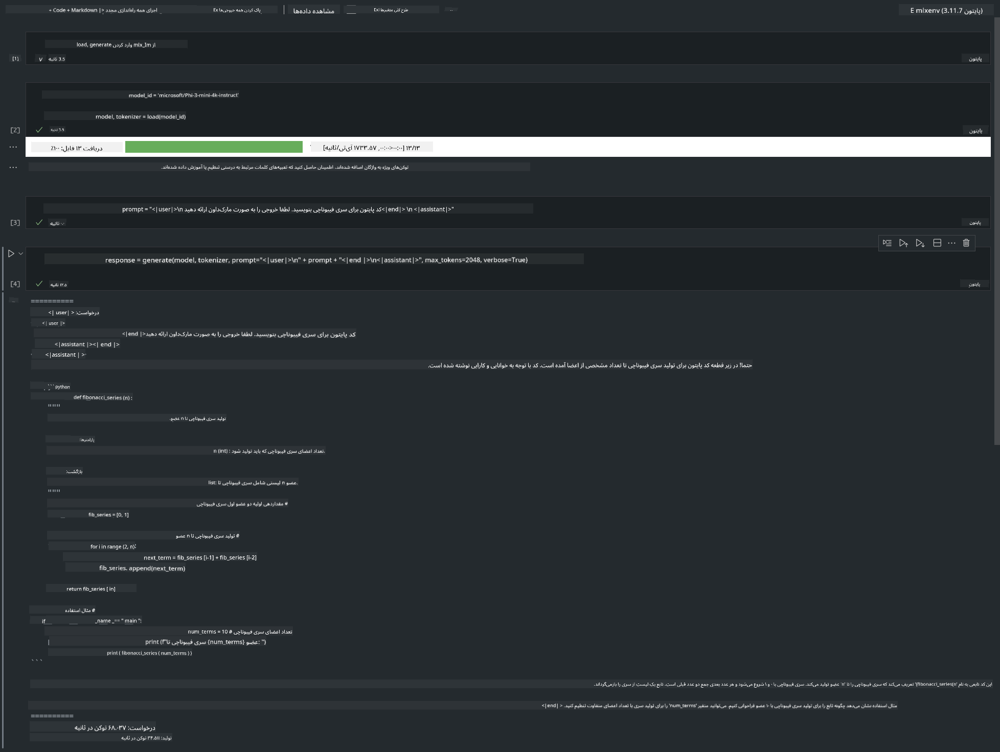

<!--
CO_OP_TRANSLATOR_METADATA:
{
  "original_hash": "dcb656f3d206fc4968e236deec5d4384",
  "translation_date": "2025-05-07T14:36:51+00:00",
  "source_file": "md/01.Introduction/03/MLX_Inference.md",
  "language_code": "fa"
}
-->
# **استنتاج Phi-3 با چارچوب Apple MLX**

## **چارچوب MLX چیست**

MLX یک چارچوب آرایه‌ای برای تحقیقات یادگیری ماشین روی سیلیکون اپل است که توسط تیم تحقیقات یادگیری ماشین اپل ارائه شده است.

MLX توسط پژوهشگران یادگیری ماشین برای پژوهشگران یادگیری ماشین طراحی شده است. هدف از این چارچوب، کاربرپسند بودن در عین حال کارآمد بودن برای آموزش و استقرار مدل‌ها است. طراحی چارچوب نیز از نظر مفهومی ساده است. ما قصد داریم این چارچوب را به گونه‌ای توسعه دهیم که پژوهشگران بتوانند به راحتی آن را گسترش داده و بهبود بخشند تا سریع‌تر ایده‌های جدید را بررسی کنند.

مدل‌های زبان بزرگ (LLM) می‌توانند روی دستگاه‌های سیلیکون اپل با استفاده از MLX تسریع شوند و مدل‌ها را می‌توان به راحتی به صورت محلی اجرا کرد.

## **استفاده از MLX برای استنتاج Phi-3-mini**

### **1. راه‌اندازی محیط MLX**

1. Python 3.11.x  
2. نصب کتابخانه MLX

```bash

pip install mlx-lm

```

### **2. اجرای Phi-3-mini در ترمینال با MLX**

```bash

python -m mlx_lm.generate --model microsoft/Phi-3-mini-4k-instruct --max-token 2048 --prompt  "<|user|>\nCan you introduce yourself<|end|>\n<|assistant|>"

```

نتیجه (محیط من Apple M1 Max با 64 گیگابایت رم است) به صورت زیر است



### **3. کوانتیزه کردن Phi-3-mini با MLX در ترمینال**

```bash

python -m mlx_lm.convert --hf-path microsoft/Phi-3-mini-4k-instruct

```

***Note：*** مدل را می‌توان با استفاده از mlx_lm.convert کوانتیزه کرد و کوانتیزه پیش‌فرض INT4 است. این مثال، Phi-3-mini را به INT4 کوانتیزه می‌کند.

مدل را می‌توان با mlx_lm.convert کوانتیزه کرد و کوانتیزه پیش‌فرض INT4 است. این مثال برای کوانتیزه کردن Phi-3-mini به INT4 است. پس از کوانتیزه کردن، مدل در دایرکتوری پیش‌فرض ./mlx_model ذخیره می‌شود.

می‌توانیم مدل کوانتیزه شده با MLX را از طریق ترمینال تست کنیم

```bash

python -m mlx_lm.generate --model ./mlx_model/ --max-token 2048 --prompt  "<|user|>\nCan you introduce yourself<|end|>\n<|assistant|>"

```

نتیجه به صورت زیر است



### **4. اجرای Phi-3-mini با MLX در Jupyter Notebook**



***Note:*** لطفاً این نمونه را مطالعه کنید [click this link](../../../../../code/03.Inference/MLX/MLX_DEMO.ipynb)

## **منابع**

1. آشنایی با چارچوب Apple MLX [https://ml-explore.github.io](https://ml-explore.github.io/mlx/build/html/index.html)

2. مخزن GitHub اپل MLX [https://github.com/ml-explore](https://github.com/ml-explore)

**سلب مسئولیت**:  
این سند با استفاده از سرویس ترجمه هوش مصنوعی [Co-op Translator](https://github.com/Azure/co-op-translator) ترجمه شده است. در حالی که ما در تلاش برای دقت هستیم، لطفاً توجه داشته باشید که ترجمه‌های خودکار ممکن است حاوی اشتباهات یا نواقصی باشند. سند اصلی به زبان بومی خود باید به عنوان منبع معتبر در نظر گرفته شود. برای اطلاعات حیاتی، توصیه می‌شود از ترجمه حرفه‌ای انسانی استفاده شود. ما مسئول هیچ گونه سوءتفاهم یا برداشت نادرستی که ناشی از استفاده از این ترجمه باشد، نیستیم.