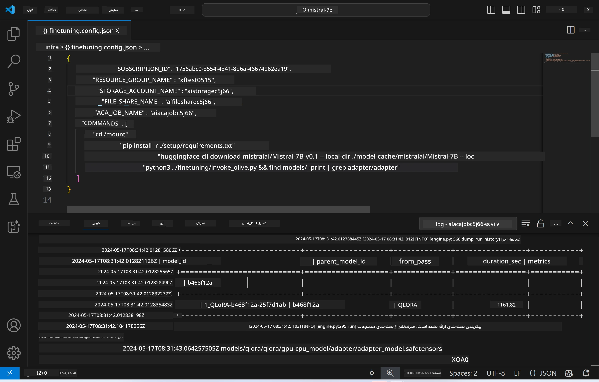
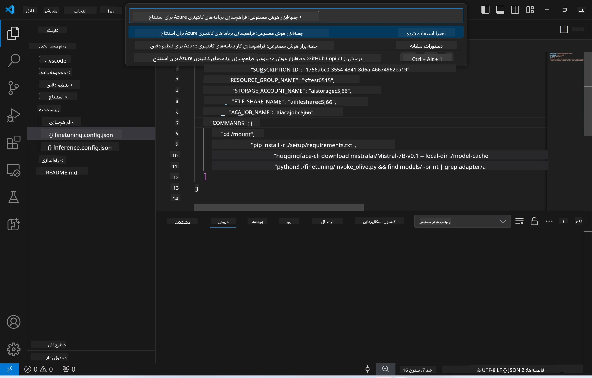
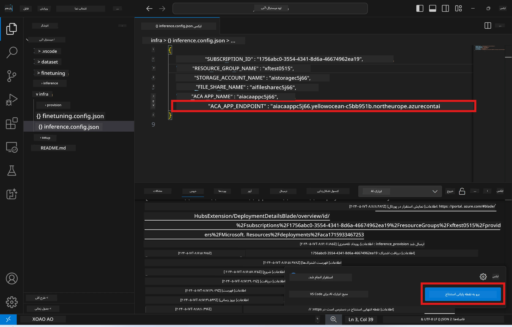

<!--
CO_OP_TRANSLATOR_METADATA:
{
  "original_hash": "a54cd3d65b6963e4e8ce21e143c3ab04",
  "translation_date": "2025-07-16T21:15:18+00:00",
  "source_file": "md/01.Introduction/03/Remote_Interence.md",
  "language_code": "fa"
}
-->
# استنتاج از راه دور با مدل تنظیم‌شده

پس از آموزش آداپتورها در محیط راه دور، از یک برنامه ساده Gradio برای تعامل با مدل استفاده کنید.



### فراهم‌سازی منابع Azure  
برای استنتاج از راه دور، باید منابع Azure را با اجرای دستور `AI Toolkit: Provision Azure Container Apps for inference` از پنل فرمان تنظیم کنید. در این مرحله از شما خواسته می‌شود اشتراک Azure و گروه منابع خود را انتخاب کنید.  

   
به طور پیش‌فرض، اشتراک و گروه منابع برای استنتاج باید با آن‌هایی که برای تنظیم دقیق استفاده شده‌اند، مطابقت داشته باشند. استنتاج از همان محیط Azure Container App استفاده می‌کند و به مدل و آداپتور مدل ذخیره شده در Azure Files که در مرحله تنظیم دقیق ایجاد شده‌اند، دسترسی دارد.

## استفاده از AI Toolkit

### استقرار برای استنتاج  
اگر می‌خواهید کد استنتاج را بازبینی کنید یا مدل استنتاج را مجدداً بارگذاری کنید، دستور `AI Toolkit: Deploy for inference` را اجرا کنید. این کار کد جدید شما را با ACA همگام‌سازی کرده و نسخه را مجدداً راه‌اندازی می‌کند.


پس از اتمام موفقیت‌آمیز استقرار، مدل آماده ارزیابی از طریق این نقطه پایانی است.

### دسترسی به API استنتاج

می‌توانید با کلیک روی دکمه "*Go to Inference Endpoint*" که در اعلان VSCode نمایش داده می‌شود، به API استنتاج دسترسی پیدا کنید. همچنین، نقطه پایانی وب API را می‌توانید در `ACA_APP_ENDPOINT` در فایل `./infra/inference.config.json` و در پنل خروجی بیابید.



> **Note:** ممکن است چند دقیقه طول بکشد تا نقطه پایانی استنتاج به طور کامل فعال شود.

## اجزای استنتاج موجود در قالب

| پوشه | محتویات |
| ------ |--------- |
| `infra` | شامل تمام تنظیمات لازم برای عملیات راه دور است. |
| `infra/provision/inference.parameters.json` | پارامترهای قالب‌های bicep را نگهداری می‌کند که برای فراهم‌سازی منابع Azure برای استنتاج استفاده می‌شوند. |
| `infra/provision/inference.bicep` | قالب‌هایی برای فراهم‌سازی منابع Azure برای استنتاج دارد. |
| `infra/inference.config.json` | فایل پیکربندی که توسط دستور `AI Toolkit: Provision Azure Container Apps for inference` ایجاد شده است. این فایل به عنوان ورودی برای سایر دستورات راه دور استفاده می‌شود. |

### استفاده از AI Toolkit برای پیکربندی فراهم‌سازی منابع Azure  
[AI Toolkit](https://marketplace.visualstudio.com/items?itemName=ms-windows-ai-studio.windows-ai-studio) را پیکربندی کنید.

دستور `Provision Azure Container Apps for inference` را اجرا کنید.

پارامترهای پیکربندی را می‌توانید در فایل `./infra/provision/inference.parameters.json` بیابید. جزئیات به شرح زیر است:

| پارامتر | توضیح |
| --------- |------------ |
| `defaultCommands` | دستورات لازم برای راه‌اندازی یک وب API است. |
| `maximumInstanceCount` | حداکثر ظرفیت نمونه‌های GPU را تعیین می‌کند. |
| `location` | مکانی که منابع Azure در آن فراهم می‌شوند. مقدار پیش‌فرض همان مکان گروه منابع انتخاب شده است. |
| `storageAccountName`, `fileShareName`, `acaEnvironmentName`, `acaEnvironmentStorageName`, `acaAppName`, `acaLogAnalyticsName` | این پارامترها برای نام‌گذاری منابع Azure استفاده می‌شوند. به طور پیش‌فرض، این نام‌ها با نام منابع تنظیم دقیق یکسان هستند. می‌توانید نام جدید و استفاده‌نشده‌ای وارد کنید تا منابع با نام دلخواه خود ایجاد کنید، یا نام یک منبع Azure موجود را وارد کنید اگر می‌خواهید از آن استفاده کنید. برای جزئیات بیشتر به بخش [استفاده از منابع Azure موجود](../../../../../md/01.Introduction/03) مراجعه کنید. |

### استفاده از منابع Azure موجود

به طور پیش‌فرض، فراهم‌سازی استنتاج از همان محیط Azure Container App، حساب ذخیره‌سازی، اشتراک فایل Azure و Azure Log Analytics استفاده می‌کند که در تنظیم دقیق به کار رفته‌اند. یک Azure Container App جداگانه فقط برای API استنتاج ایجاد می‌شود.

اگر در مرحله تنظیم دقیق منابع Azure را سفارشی کرده‌اید یا می‌خواهید از منابع Azure موجود خود برای استنتاج استفاده کنید، نام آن‌ها را در فایل `./infra/inference.parameters.json` مشخص کنید. سپس دستور `AI Toolkit: Provision Azure Container Apps for inference` را از پنل فرمان اجرا کنید. این کار منابع مشخص شده را به‌روزرسانی کرده و منابعی که وجود ندارند را ایجاد می‌کند.

برای مثال، اگر یک محیط Azure container موجود دارید، فایل `./infra/finetuning.parameters.json` شما باید به این شکل باشد:

```json
{
    "$schema": "https://schema.management.azure.com/schemas/2019-04-01/deploymentParameters.json#",
    "contentVersion": "1.0.0.0",
    "parameters": {
      ...
      "acaEnvironmentName": {
        "value": "<your-aca-env-name>"
      },
      "acaEnvironmentStorageName": {
        "value": null
      },
      ...
    }
  }
```

### فراهم‌سازی دستی  
اگر ترجیح می‌دهید منابع Azure را به صورت دستی پیکربندی کنید، می‌توانید از فایل‌های bicep موجود در پوشه‌های `./infra/provision` استفاده کنید. اگر قبلاً همه منابع Azure را بدون استفاده از پنل فرمان AI Toolkit راه‌اندازی و پیکربندی کرده‌اید، کافی است نام منابع را در فایل `inference.config.json` وارد کنید.

برای مثال:

```json
{
  "SUBSCRIPTION_ID": "<your-subscription-id>",
  "RESOURCE_GROUP_NAME": "<your-resource-group-name>",
  "STORAGE_ACCOUNT_NAME": "<your-storage-account-name>",
  "FILE_SHARE_NAME": "<your-file-share-name>",
  "ACA_APP_NAME": "<your-aca-name>",
  "ACA_APP_ENDPOINT": "<your-aca-endpoint>"
}
```

**سلب مسئولیت**:  
این سند با استفاده از سرویس ترجمه هوش مصنوعی [Co-op Translator](https://github.com/Azure/co-op-translator) ترجمه شده است. در حالی که ما در تلاش برای دقت هستیم، لطفاً توجه داشته باشید که ترجمه‌های خودکار ممکن است حاوی خطاها یا نادرستی‌هایی باشند. سند اصلی به زبان بومی خود باید به عنوان منبع معتبر در نظر گرفته شود. برای اطلاعات حیاتی، ترجمه حرفه‌ای انسانی توصیه می‌شود. ما مسئول هیچ گونه سوءتفاهم یا تفسیر نادرستی که از استفاده این ترجمه ناشی شود، نیستیم.