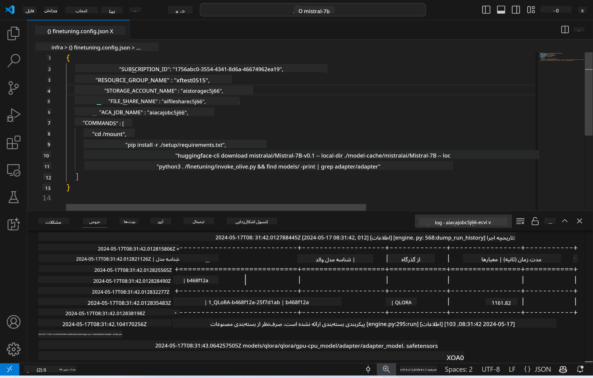
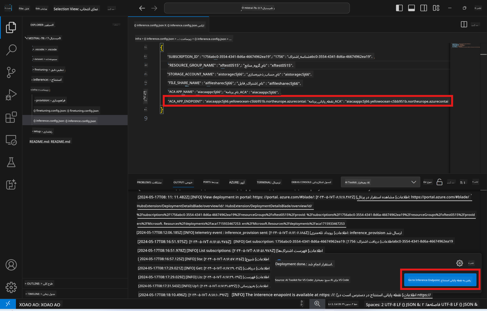

<!--
CO_OP_TRANSLATOR_METADATA:
{
  "original_hash": "a54cd3d65b6963e4e8ce21e143c3ab04",
  "translation_date": "2025-05-07T14:32:05+00:00",
  "source_file": "md/01.Introduction/03/Remote_Interence.md",
  "language_code": "fa"
}
-->
# استنتاج از راه دور با مدل فاین‌تیون شده

پس از آموزش آداپتورها در محیط راه دور، از یک برنامه ساده Gradio برای تعامل با مدل استفاده کنید.



### فراهم‌سازی منابع Azure  
برای استنتاج از راه دور باید منابع Azure را با اجرای `AI Toolkit: Provision Azure Container Apps for inference` از پالت فرمان تنظیم کنید. در این مرحله از شما خواسته می‌شود که اشتراک Azure و گروه منابع خود را انتخاب کنید.  


به طور پیش‌فرض، اشتراک و گروه منابع برای استنتاج باید با آن‌هایی که برای فاین‌تیون استفاده شده‌اند مطابقت داشته باشند. استنتاج از همان محیط Azure Container App استفاده می‌کند و به مدل و آداپتور مدل ذخیره شده در Azure Files که در مرحله فاین‌تیون ایجاد شده‌اند دسترسی خواهد داشت.

## استفاده از AI Toolkit

### استقرار برای استنتاج  
اگر می‌خواهید کد استنتاج را اصلاح کنید یا مدل استنتاج را دوباره بارگذاری کنید، دستور `AI Toolkit: Deploy for inference` را اجرا کنید. این کار کد جدید شما را با ACA همگام‌سازی کرده و نمونه را مجدداً راه‌اندازی می‌کند.


پس از تکمیل موفق استقرار، مدل اکنون آماده ارزیابی با استفاده از این نقطه پایانی است.

### دسترسی به API استنتاج

می‌توانید با کلیک روی دکمه "*Go to Inference Endpoint*" که در اعلان VSCode نمایش داده می‌شود به API استنتاج دسترسی پیدا کنید. همچنین، نقطه پایانی وب API را می‌توانید در `ACA_APP_ENDPOINT` در `./infra/inference.config.json` و در پنل خروجی پیدا کنید.



> **Note:** ممکن است چند دقیقه طول بکشد تا نقطه پایانی استنتاج به طور کامل فعال شود.

## اجزای استنتاج موجود در قالب

| پوشه | محتویات |
| ------ |--------- |
| `infra` | شامل تمام پیکربندی‌های لازم برای عملیات راه دور است. |
| `infra/provision/inference.parameters.json` | پارامترهای قالب‌های bicep را نگهداری می‌کند که برای فراهم‌سازی منابع Azure جهت استنتاج استفاده می‌شوند. |
| `infra/provision/inference.bicep` | شامل قالب‌هایی برای فراهم‌سازی منابع Azure برای استنتاج است. |
| `infra/inference.config.json` | فایل پیکربندی که توسط دستور `AI Toolkit: Provision Azure Container Apps for inference` تولید شده است. این فایل به عنوان ورودی برای سایر پالت‌های فرمان راه دور استفاده می‌شود. |

### استفاده از AI Toolkit برای پیکربندی فراهم‌سازی منابع Azure  
[AI Toolkit](https://marketplace.visualstudio.com/items?itemName=ms-windows-ai-studio.windows-ai-studio) را پیکربندی کنید

برای فراهم‌سازی Azure Container Apps جهت استنتاج، فایل `./infra/provision/inference.parameters.json` را ویرایش کنید سپس دستور `AI Toolkit: Provision Azure Container Apps for inference` را از پالت فرمان اجرا کنید. این دستور منابع مشخص شده را به‌روزرسانی کرده و هر منبعی که وجود ندارد را ایجاد می‌کند.

برای مثال، اگر یک محیط کانتینری Azure موجود دارید، فایل `./infra/finetuning.parameters.json` شما باید به این شکل باشد:

```json
{
    "$schema": "https://schema.management.azure.com/schemas/2019-04-01/deploymentParameters.json#",
    "contentVersion": "1.0.0.0",
    "parameters": {
      ...
      "acaEnvironmentName": {
        "value": "<your-aca-env-name>"
      },
      "acaEnvironmentStorageName": {
        "value": null
      },
      ...
    }
  }
```

### فراهم‌سازی دستی  
اگر ترجیح می‌دهید منابع Azure را به صورت دستی پیکربندی کنید، می‌توانید از فایل‌های bicep ارائه شده در پوشه `./infra/provision` و فایل `inference.config.json` استفاده کنید.

برای مثال:

```json
{
  "SUBSCRIPTION_ID": "<your-subscription-id>",
  "RESOURCE_GROUP_NAME": "<your-resource-group-name>",
  "STORAGE_ACCOUNT_NAME": "<your-storage-account-name>",
  "FILE_SHARE_NAME": "<your-file-share-name>",
  "ACA_APP_NAME": "<your-aca-name>",
  "ACA_APP_ENDPOINT": "<your-aca-endpoint>"
}
```

**سلب مسئولیت**:  
این سند با استفاده از سرویس ترجمه هوش مصنوعی [Co-op Translator](https://github.com/Azure/co-op-translator) ترجمه شده است. در حالی که ما در تلاش برای دقت هستیم، لطفاً توجه داشته باشید که ترجمه‌های خودکار ممکن است حاوی اشتباهات یا نواقصی باشند. سند اصلی به زبان بومی خود باید به عنوان منبع معتبر در نظر گرفته شود. برای اطلاعات حیاتی، ترجمه حرفه‌ای انسانی توصیه می‌شود. ما مسئول هیچ‌گونه سوءتفاهم یا تفسیر نادرستی که ناشی از استفاده از این ترجمه باشد، نیستیم.